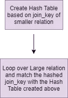
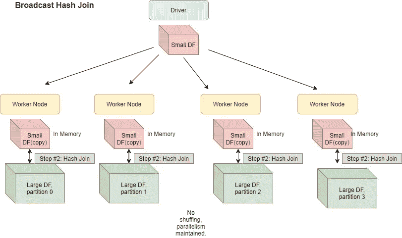
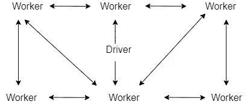
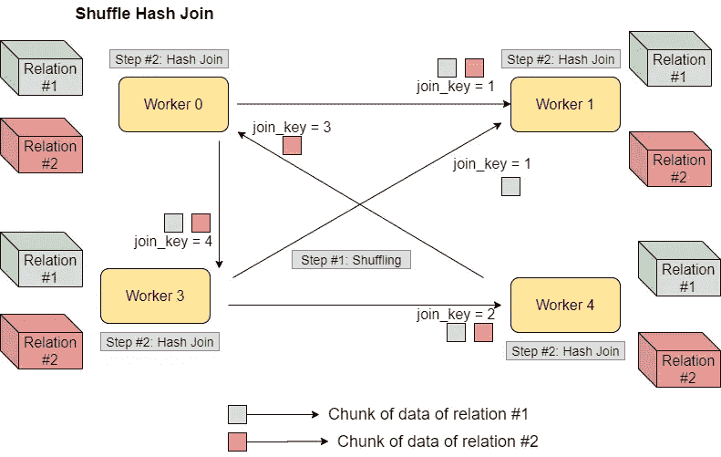
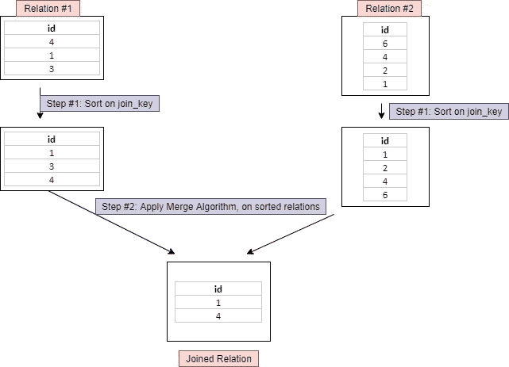

# Spark 加盟战略——方式和内容？

> 原文：<https://towardsdatascience.com/strategies-of-spark-join-c0e7b4572bcf?source=collection_archive---------0----------------------->

## Spark 加盟的内涵& Spark 的加盟策略选择

在处理数据时，我们都处理过不同种类的连接，可能是`inner`、`outer`、`left`或(可能是)`left-semi`。本文介绍了 Spark 用来执行`join`操作的不同连接策略。了解 spark join 的内部机制有助于优化复杂的 join 操作，找到一些内存不足错误的根本原因，并提高 spark 作业的性能(我们都希望如此，不是吗？).请继续阅读，找出答案。


Russ Ward 在 [Unsplash](/s/photos/spark?utm_source=unsplash&utm_medium=referral&utm_content=creditCopyText) 上拍摄的照片

# Spark 加盟策略:

# **广播哈希连接**

在开始广播 Hash join spark 之前，让我们先了解一下 **Hash Join，一般来说**:



散列连接

顾名思义，散列连接是通过首先基于较小关系的 join_key 创建一个散列表，然后遍历较大关系以匹配散列 join_key 值来执行的。此外，这仅支持“=”联接。

在 spark 中，散列连接在每个节点级别起作用，该策略用于连接节点上可用的分区。

现在，来广播散列连接。



广播散列连接

在广播散列连接中，其中一个`join`关系的副本被发送到所有工作节点**，这节省了混洗成本**。当您将一个大关系与一个小关系连接时，这很有用。这也称为映射端连接(将工作节点与映射器相关联)。

当其中一个`join`关系的大小小于阈值(默认为 10 M)时，Spark 部署这个连接策略。定义该阈值的火花属性是`spark.sql.autoBroadcastJoinThreshold`(可配置)。

使用 BitTorrent 协议在执行者之间共享广播关系(在这里阅读更多)。这是一种对等协议，其中文件块可以由对等方彼此共享。因此，它们不需要依赖单个节点。对等协议是这样工作的:



对等协议

需要注意的事项:

*   广播的关系应该完全适合每个执行者和驱动程序的记忆。在驱动程序中，因为驱动程序将开始数据传输。
*   仅支持“=”联接。
*   支持除完全外部联接之外的所有联接类型(内部、左侧、右侧)。
*   当广播大小较小时，它通常比其他连接策略更快。
*   关系的副本在网络上广播。因此，当广播大小很大时(例如，当明确指定使用广播加入/更改默认阈值时)，作为网络密集型操作可能会导致内存不足错误或性能问题。
*   广播后，您不能更改广播的关系。即使您这样做了，它们对工作节点也是不可用的(因为副本已经发布)。

# **洗牌哈希加入**



无序散列连接

Shuffle Hash Join 涉及在同一个 executor 节点中移动具有相同连接键值的数据，然后进行 Hash Join(如上所述)。使用连接条件作为输出键，数据在执行器节点之间混洗，在最后一步，使用散列连接合并数据，因为我们知道相同键的数据将出现在同一个执行器中。

需要注意的事项:

*   仅支持“=”联接。
*   连接键不需要是可排序的(这在下面会有意义)。
*   支持除完全外部联接之外的所有联接类型。
*   在我看来，这是一种代价很高的连接方式，既涉及到洗牌又涉及到散列(如上所述的散列连接)。维护哈希表需要内存和计算。

# **混洗排序合并连接**

让我们首先了解排序-合并连接



排序合并联接

排序连接包括，首先根据连接键对关系进行排序，然后合并两个数据集(考虑合并排序的合并步骤)。

现在，让我们来理解 spark 中的 shuffle 排序-合并连接策略:


无序排序合并连接

混洗排序-合并连接涉及混洗数据以获得相同工作者的相同 join_key，然后在工作者节点中的分区级别执行排序-合并连接操作。

需要注意的事项:

*   从 spark 2.3 开始，这是 spark 中默认的连接策略，可以用`spark.sql.join.preferSortMergeJoin`禁用。
*   仅支持“=”联接。
*   连接键需要是可排序的(显然)。
*   支持所有连接类型。

# 笛卡尔连接

在这个策略中，计算两个关系的笛卡尔积(类似于 SQL)来评估 join。

# **广播嵌套循环连接**

请将此视为两种关系的嵌套循环比较:

```
for record_1 in relation_1:
  for record_2 in relation_2:
    # join condition is executed
```

如你所见，这可能是一个非常缓慢的策略。这通常是在无法应用其他连接类型时的后备选项。Spark 使用广播查询适当部分的`[BroadcastNestedLoopJoinExe](https://jaceklaskowski.gitbooks.io/mastering-spark-sql/spark-sql-SparkPlan-BroadcastNestedLoopJoinExec.html)c` 操作符来处理这个问题，因此您可以认为至少会广播一些结果来提高性能。

需要注意的事项:

*   支持“=”和非等值联接(“≤=”、“
*   支持所有连接类型

# spark 如何选择加盟策略？

直接取自 spark [代码](https://github.com/apache/spark/blob/master/sql/core/src/main/scala/org/apache/spark/sql/execution/SparkStrategies.scala#L111)，让我们看看 spark 是如何决定加入策略的。

> 如果是“=”连接:
> 
> 按照以下顺序查看[连接提示](https://spark.apache.org/docs/latest/sql-performance-tuning.html#join-strategy-hints-for-sql-queries):
> 1。广播提示:如果加入类型受支持，选择`broadcast hash join`。
> 2。排序合并提示:如果连接键是可排序的，选择`sort-merge join`。
> 3。无序散列提示:如果连接类型受支持，选择`shuffle hash join`。
> 4。shuffle replicate NL 提示:如果连接类型是 inner like，则选择`cartesian product`。
> 
> 如果没有提示或提示不适用
> 1。如果一边足够小可以广播，并且支持加入类型，则选择`broadcast hash join`。
> 2。如果一边足够小，可以构建本地哈希映射，并且比另一边小得多，则选择`shuffle hash join`，并且`spark.sql.join.preferSortMergeJoin`为假。
> 3。如果连接键可排序，选择`sort-merge join`。
> 4。如果连接类型是内部，选择`cartesian product`。
> 5。选择`broadcast nested loop join`作为最终解决方案。它可能会爆炸，但没有其他选择。
> 
> 如果不是' =' join:
> 
> 看看[加入提示](https://spark.apache.org/docs/latest/sql-performance-tuning.html#join-strategy-hints-for-sql-queries)，按以下顺序:
> 1。广播提示:挑`broadcast nested loop join`。
> 2。shuffle replicate NL 提示:如果连接类型是 inner like，选择`cartesian product`。
> 
> 如果没有提示或提示不适用
> 1。如果一边足够小，可以播放，则选择`broadcast nested loop join`。
> 2。如果连接类型是内部相似，选择 `cartesian product`。
> 3。选择`broadcast nested loop join`作为最终解决方案。它可能会爆炸，但我们别无选择。

再见。