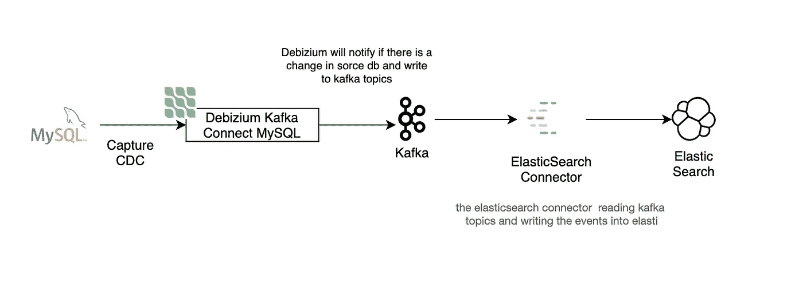
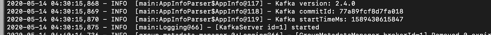
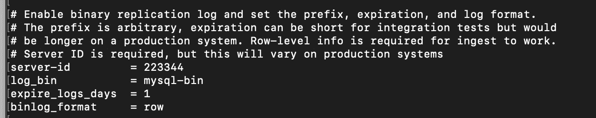
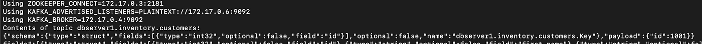
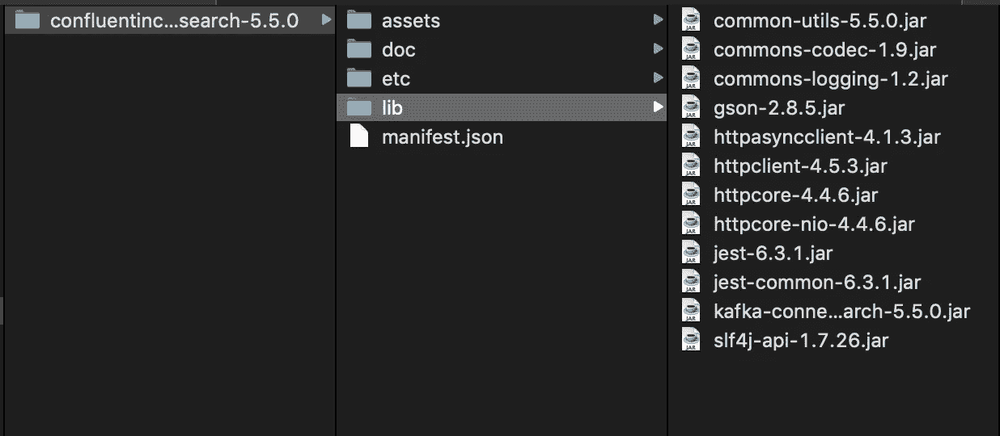
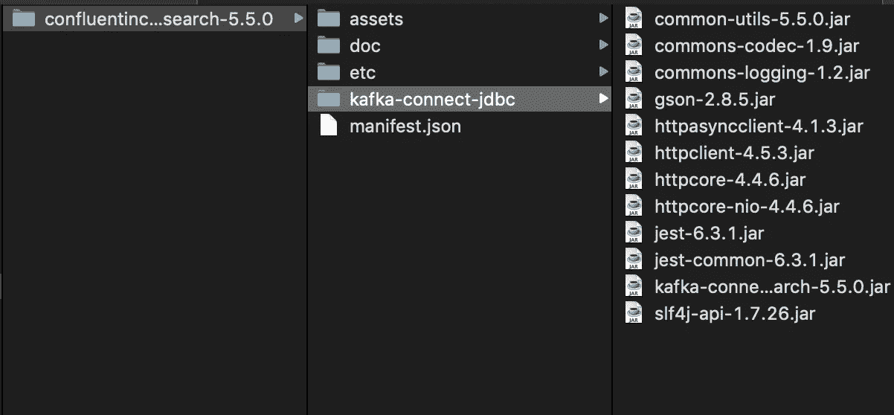
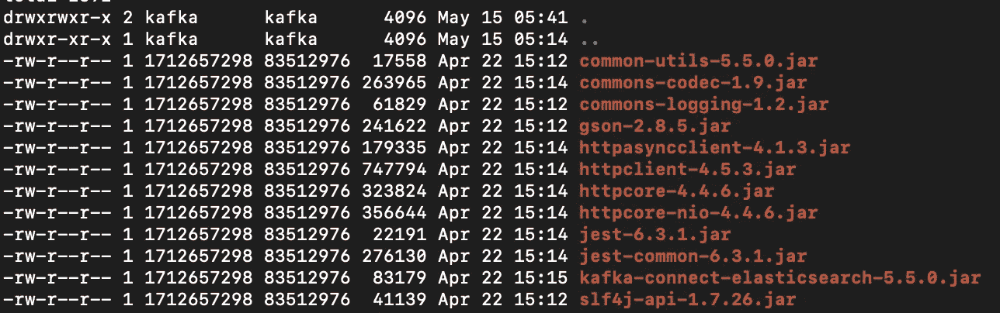

# 使用 Debezium、Kafka 和融合的 JDBC Sink Connector 将 MySQL 中的数据更改导入 ElasticSearch

> 原文：<https://towardsdatascience.com/stream-your-data-changes-in-mysql-into-elasticsearch-using-debizium-kafka-and-confluent-jdbc-b93821d4997b?source=collection_archive---------21----------------------->

## 如何使用 Debezium 将 MySQL 中的数据变化一步一步地导入 Elasticsearch


杰罗姆·普拉克斯在 [Unsplash](https://unsplash.com/s/photos/water-stream?utm_source=unsplash&utm_medium=referral&utm_content=creditCopyText) 上的照片

快速搜索能力，实时综合数据，现在是必要的，如果我们想建立像电子目录或电子商务。我们不希望我们的用户生气，因为他们花费大量时间只是为了从我们的门户网站获取信息。我们还希望我们的产品团队在不同的应用程序中输入的产品信息能够立即被我们的用户或客户搜索到。

比方说使用 MySQL 作为主要数据源的产品团队。我们将在门户网站中使用 ElasticSearch 作为搜索引擎服务。我们需要 MySQL 的每一个变化都会立即影响到 ElasticSearch 索引。如何达到那个要求？

在我的第一篇文章中，我将展示如何使用 Debezium、Kafka 和融合 JDBC Sink Connector 将 MySQL 中的数据更改流式传输到 ElasticSearch 中，以实现上述用例需求。感谢我的主人 [Erfin Feluzy](https://medium.com/u/92236fea730d?source=post_page-----b93821d4997b--------------------------------) ，他把我介绍给 Debezium，并给了我写第一篇关于媒介的文章的灵感。

# 解决方案高级图表



解决方案 HLD 图

# 关于技术的简短介绍

## Debezium

Debezium 是一个分布式平台，它将您现有的数据库转换成事件流，因此应用程序可以对数据库中的每个行级更改做出快速反应。Debezium 构建在 Kafka 之上，提供 Kafka Connect 兼容的连接器来监控特定的数据库管理系统。Debezium 在 Kafka 日志中记录数据更改的历史，因此您的应用程序可以在任何时候停止和重新启动，并且可以轻松地消耗它在不运行时错过的所有事件，确保所有事件都得到正确和完整的处理。

Debezium 是在 Apache 许可下的开源软件，版本 2.0

## 卡夫卡

Apache Kafka 是由 [LinkedIn](https://en.wikipedia.org/wiki/LinkedIn) 开发的[开源](https://en.wikipedia.org/wiki/Open-source_software) [流处理](https://en.wikipedia.org/wiki/Stream_processing)软件平台，捐赠给 [Apache 软件基金会](https://en.wikipedia.org/wiki/Apache_Software_Foundation)，用 [Scala](https://en.wikipedia.org/wiki/Scala_(programming_language)) 和 [Java](https://en.wikipedia.org/wiki/Java_(programming_language)) 编写。该项目旨在为处理实时数据馈送提供一个统一、高吞吐量、低延迟的平台。

## 汇流 JDBC 水槽连接器

Kafka Connect Elasticsearch 接收器连接器允许将数据从 Apache Kafka 移动到 Elasticsearch。它将 Apache Kafka 中一个主题的数据写入 Elasticsearch 中的一个[索引](https://www.elastic.co/guide/en/elasticsearch/reference/6.8/indices-create-index.html)中，一个主题的所有数据都是相同的

# 让我们开始教程

> 在本教程中，我们将为每个服务使用一个单独的容器，不使用持久卷。ZooKeeper 和 Kafka 通常将它们的数据本地存储在容器中，这需要您在主机上将目录挂载为卷。因此，在本教程中，当容器停止时，所有持久化的数据都会丢失

## **第一步运行 Zookeeper**

使用 debezium/zookeeper 映像在容器中启动 zookeeper。容器将以名称 **zookeeperdbz** 运行

```
> docker run -it — name zookeeperdbz -p 2181:2181 -p 2888:2888 -p 3888:3888 debezium/zookeeper:1.1
```

检查运行日志以验证 zookeeper 运行成功并监听端口`2181`

```
Starting up in standalone modeZooKeeper JMX enabled by defaultUsing config: /zookeeper/conf/zoo.cfg
.
.
.
020-05-13 17:18:28,564 - INFO  [main:NIOServerCnxnFactory@686] - binding to port 0.0.0.0/0.0.0.0:2181
```

## **第二步运行卡夫卡**

使用 debezium/kafka docker 映像在容器中启动 Kafka。该容器将以名称 **kafkadbz** 运行

```
> docker run -it — name kafkadbz -p 9092:9092 --link zookeeperdbz:zookeeperdbz debezium/kafka
```

验证 Kafka 服务器已启动



卡夫卡开始了

## **第三步运行 MySQL**

在这个演示中，我将使用一个预配置的 Docker 映像，它也包含 Debezium 提供的样本数据。

使用 debezium/example-mysql image 在容器中启动 MySQL。容器将以名称 **mysqldbz** 运行

```
> docker run -it -d --name mysqldbz -p 3306:3306 -e MYSQL_ROOT_PASSWORD=debezium -e MYSQL_USER=mysqluser -e MYSQL_PASSWORD=mysqlpw debezium/example-mysql
```

上面的命令将创建一个名为 *mysqldbz* 的容器。

接下来，让我们执行容器，并在容器上输入交互式 bash shell。

```
> docker exec -it mysqldbz /bin/bash
```

要在 MySQL 上使用 capture CDC，Debezium 需要在我们的 MySQL 中启用 bin_log 配置。多亏了 Debezium，因为我们使用的是预配置的 MySQL Docker 映像，所以我们不再需要配置它了。让我们检查一下配置。

```
# more /etc/mysql/conf.d/mysql.cnf
```



MySQL bin_log 已启用

如您所见，bin_log 是启用的，默认情况下是禁用的。

检查样本数据库

```
# mysql -u root -p 
Enter password: <enter your password>mysql> use inventory
Database changedmysql> show tables;
+---------------------+
| Tables_in_inventory |
+---------------------+
| addresses           |
| customers           |
| geom                |
| orders              |
| products            |
| products_on_hand    |
+---------------------+6 rows in set (0.00 sec)mysql> select * from customers;+------+------------+-----------+-----------------------+
| id   | first_name | last_name | email                 |
+------+------------+-----------+-----------------------+
| 1001 | Sally      | Thomas    | sally.thomas@acme.com |
| 1002 | George     | Bailey    | gbailey@foobar.com    |
| 1003 | Edward     | Walker    | ed@walker.com         |
| 1004 | Anne       | Kretchmar | annek@noanswer.org    |
+------+------------+-----------+-----------------------+4 rows in set (0.00 sec)
```

## **步骤 4 启动弹性搜索服务**

这里我们将使用单节点弹性和弹性版本 7.7。容器将以名称 **elasticdbz** 运行。

```
> docker run -it --name elasticdbz -p 9200:9200 -p 9300:9300 -e "discovery.type=single-node" docker.elastic.co/elasticsearch/elasticsearch:7.7.0 
```

## **步骤 5 启动 Debezium Kafka 连接服务**

该服务公开 REST API 来管理 Debezium MySQL 连接器。容器将以名称 **connectdbz** 运行。

```
> docker run -it --name connectdbz -p 8083:8083 -e GROUP_ID=1 -e CONFIG_STORAGE_TOPIC=my_connect_configs -e OFFSET_STORAGE_TOPIC=my_connect_offsets -e STATUS_STORAGE_TOPIC=my_connect_statuses **--link zookeeperdbz:zookeeperdbz --link kafkadbz:kafkadbz --link mysqldbz:mysqldbz --link elasticdbz:elasticdbz** debezium/connect
```

不要忘记将该容器与 kafkadbz **、** zookeeperdbz、elasticdbz 链接，因为该服务需要与 kafkadbz **、** zookeeperdbz、elasticdbz 服务进行通信。

使用 CURL 检查 Debezium Kafka Connect 服务的状态，从响应中我们会看到我们使用的是 2.4.0 版本

```
> curl -H "Accept:application/json" localhost:8083/
{"version":"2.4.0","commit":"77a89fcf8d7fa018","kafka_cluster_id":"XcbUOTN_TNG4hCftkY_j3w"}
```

让我们注册 MySQL 连接器来监视库存数据库中的 CDC

```
> curl -i -X POST -H "Accept:application/json" -H "Content-Type:application/json" localhost:8083/connectors/ -d '
{
"name": "inventory-connector",
"config": {
"connector.class": "io.debezium.connector.mysql.MySqlConnector",
"tasks.max": "1",
"database.hostname": "**mysqldbz**",
"database.port": "3306",
"database.user": "debezium",
"database.password": "dbz",
"database.server.id": "184054",
"database.server.name": "dbserver1",
"database.whitelist": "inventory",
"database.history.kafka.bootstrap.servers": "kafkadbz:9092",
"database.history.kafka.topic": "schema-changes.inventory"
}
}'
```

验证连接器是否在连接器列表中注册

```
> curl -H "Accept:application/json" localhost:8083/connectors/
["inventory-connector"]
```

现在，inventory-connector 已注册到连接器列表中

## **步骤 6 启动 Kafka 控制台消费者观察数据库上的变化**

> 这一步只是为了观察数据库上的变化，如果你想消费主题，你必须写你的卡夫卡消费

部署 Debezium MySQL 连接器后，它开始监控`inventory`数据库的数据变更事件。

要观看`dbserver1.inventory.customers`主题，我们需要启动 Kafka 控制台消费者。容器将以名称 **watcher** 运行。

```
> docker run -it --rm --name watcher --link zookeeperdbz:zookeeperdbz --link kafkadbz:kafkadbz debezium/kafka watch-topic -a -k dbserver1.inventory.customers
```

运行观察器后，我们可以看到 Debezium 开始监控库存数据库，并将结果作为`dbserver1.inventory.customers`主题。



Debezium 启动监视器

```
"payload":{"before":null,
      "after":{"id":1004,
         "first_name":"Anne",
         "last_name":"Kretchmar",
         "email":"annek@noanswer.org"
},
      "source":{"version":"1.1.1.Final",
         "connector":"mysql",
         "name":"dbserver1",
         "ts_ms":0,
         "snapshot":"true",
         "db":"inventory",
         "table":"customers",
         "server_id":0,
         "gtid":null,
         "file":"mysql-bin.000003",
         "pos":154,
         "row":0,
         "thread":null,
         "query":null
},
      "op":"c",
      "ts_ms":1589504913171,
      "transaction":null}
```

让我们与表库存进行比较。客户

```
mysql> select * from customers;+------+------------+-----------+-----------------------+
| id   | first_name | last_name | email                 |
+------+------------+-----------+-----------------------+
| 1001 | Sally      | Thomas    | sally.thomas@acme.com |
| 1002 | George     | Bailey    | gbailey@foobar.com    |
| 1003 | Edward     | Walker    | ed@walker.com         |
| **1004 | Anne       | Kretchmar | annek@noanswer.org   ** |
+------+------------+-----------+-----------------------+
```

它看起来像是 Kafka 主题中与客户库存表中的记录相匹配的最后一个事件

让我们尝试更新客户表。

```
mysql > UPDATE `inventory`.`customers` SET `last_name` = 'Kretchmar Kretchmer' WHERE `id` = 1004;
```

这是观察器中的结果

```
...
"payload":{
"before":{
         "id":1004,
         "first_name":"Anne",
         "last_name":"Kretchmar",
         "email":"annek@noanswer.org"
},
      "after":{
         "id":1004,
         "first_name":"Anne",
         "last_name":"Kretchmar Kretchmer",
         "email":"annek@noanswer.org"
},
...
```

## **到这一步我们刚刚取得了什么？**

至此，我们已经实现了 MySQL-Debezium-Kafka 的集成。当 MySQL 中有新的或更改的数据时，我们将从 Kafka 的主题中获得流式数据。

下一步是什么？

# 让我们开始与 ElasticSearch 整合

为了与 Elastic Search 集成，我们需要在 Debezium Kafka connect 容器上安装 Kafka Connect Elastic Sink 连接器。

**步骤 7 下载 Kafka Connect 弹性汇连接器**[https://www . confluent . io/hub/confluent Inc/Kafka-Connect-Elastic search](https://www.confluent.io/hub/confluentinc/kafka-connect-elasticsearch)

**步骤 8 提取下载的 zip 文件**



解压缩的 zip 文件

**第九步将 lib 文件夹重命名为 kafka-connect-jdbc**



重命名为 kafka-connect-jdbc 后的 lib 文件夹

**步骤 10 将 kafka-connect-jdbc 复制到 kafka-connect 的容器 debezium 中**

```
> docker cp /**path-to-file**/confluentinc-kafka-connect-elasticsearch-5.5.0/kafka-connect-jdbc/* connectdbz:/kafka/connect/
```

**步骤 11 验证所有依赖关系都已复制**

```
> docker exec -it connectdbz /bin/bash
$ cd connect/kafka-connect-jdbc/
$ ls -all
```



ls-所有结果

**步骤 12 重启 Debezium Kafka 连接容器**

我们需要重新启动 Kafka connect 服务，使 Kafka connect 可以检测新安装的连接器插件

```
> docker stop connectdbz
> docker start connectdbz
```

**步骤 13 注册 ElasticsearchSinkConnector**

```
> curl -i -X POST -H "Accept:application/json" -H "Content-Type:application/json" localhost:8083/connectors/ -d '
{
"name": "elastic-sink",
"config": {
"connector.class":
"io.confluent.connect.elasticsearch.ElasticsearchSinkConnector",
"tasks.max": "1",
"topics": "**dbserver1.inventory.customers**",
"connection.url": "http://**elasticdbz**:9200",
"transforms": "unwrap,key",
"transforms.unwrap.type": "io.debezium.transforms.UnwrapFromEnvelope",
"transforms.key.type": "org.apache.kafka.connect.transforms.ExtractField$Key",
"transforms.key.field": "id",
"key.ignore": "false",
"type.name": "customer"
}
}'
```

验证 ElasticsearchSinkConnector 连接器是否已在连接器列表中注册

```
> curl -H "Accept:application/json" localhost:8083/connectors/
["elastic-sink","inventory-connector"]
```

**步骤 14 检查 MySQL ElasticSearch 同步**

让我们检查数据库和搜索服务器是否同步。

```
> curl ‘[http://localhost:9200/](http://localhost:9200/customers/_search?pretty)dbserver1.inventory.customers[/_search?pretty](http://localhost:9200/customers/_search?pretty)'{
  "took" : 12,
  "timed_out" : false,
  "_shards" : {
    "total" : 1,
    "successful" : 1,
    "skipped" : 0,
    "failed" : 0
  },
  "hits" : {
    "total" : {
      "value" : 4,
      "relation" : "eq"
    },
    "max_score" : 1.0,
    "hits" : [
      {
        "_index" : "dbserver1.inventory.customers",
        "_type" : "customer",
        "_id" : "1001",
        "_score" : 1.0,
        "_source" : {
          "id" : 1001,
          "first_name" : "Sally",
          "last_name" : "Thomas",
          "email" : "sally.thomas@acme.com"
        }
      },
      {
        "_index" : "dbserver1.inventory.customers",
        "_type" : "customer",
        "_id" : "1004",
        "_score" : 1.0,
        "_source" : {
          "id" : 1004,
          "first_name" : "Anne",
          "last_name" : "Kretchmar Kretchme",
          "email" : "annek@noanswer.org"
        }
      },
      {
        "_index" : "dbserver1.inventory.customers",
        "_type" : "customer",
        "_id" : "1002",
        "_score" : 1.0,
        "_source" : {
          "id" : 1002,
          "first_name" : "George",
          "last_name" : "Bailey",
          "email" : "gbailey@foobar.com"
        }
      },
      {
        "_index" : "dbserver1.inventory.customers",
        "_type" : "customer",
        "_id" : "1003",
        "_score" : 1.0,
        "_source" : {
          "id" : 1003,
          "first_name" : "Edward",
          "last_name" : "Walker",
          "email" : "ed@walker.com"
        }
      }
    ]
  }
}
```

正如我们所看到的，现在 MySQL 中的所有数据都是同步的。MySQL 中的所有数据都可以在上面的弹性索引中找到。

让我们将新数据插入到 Customers 表中，看看弹性索引中会发生什么。

```
mysql> insert into customers values(default, 'Rizqi', 'Nugrohon', 'rizqi.nugroho@example.com');
Query OK, 1 row affected (0.05 sec)mysql> select * from customers;
+------+------------+--------------------+------------------------+| id   | first_name | last_name          | email                     |+------+------------+--------------------+-----------------------+|| 1001 | Sally      | Thomas             | sally.thomas@acme.com  |
| 1002 | George     | Bailey             | gbailey@foobar.com     |
| 1003 | Edward     | Walker             | ed@walker.com          |
| 1004 | Anne       | Kretchmar Kretchme | annek@noanswer.org     |
| 1005 | Rizqi      | Nugrohon           | rizqi.nugroho@example.com |+------+------------+--------------------+---------------------------+
```

检查弹性指数

```
> curl ‘[http://localhost:9200/](http://localhost:9200/customers/_search?pretty)dbserver1.inventory.customers[/_search?pretty](http://localhost:9200/customers/_search?pretty)'{
  "took" : 1476,
  "timed_out" : false,
  "_shards" : {
    "total" : 1,
    "successful" : 1,
    "skipped" : 0,
    "failed" : 0
  },
  "hits" : {
    "total" : {
      "value" : 5,
      "relation" : "eq"
    },
    "max_score" : 1.0,
    "hits" : [
      {
        "_index" : "dbserver1.inventory.customers",
        "_type" : "customer",
        "_id" : "1001",
        "_score" : 1.0,
        "_source" : {
          "id" : 1001,
          "first_name" : "Sally",
          "last_name" : "Thomas",
          "email" : "sally.thomas@acme.com"
        }
      },
      ...
      {
        "_index" : "dbserver1.inventory.customers",
        "_type" : "customer",
        "_id" : "1005",
        "_score" : 1.0,
        "_source" : {
          "id" : 1005,
          "first_name" : "Rizqi",
          "last_name" : "Nugrohon",
          "email" : "rizqi.nugroho@example.com"
        }
      }
    ]
  }
}
```

插入带有名字 Rizqi 的 Viola 新数据

更新语句怎么样

```
mysql> UPDATE `inventory`.`customers` SET `last_name` = 'Adhi Nugroho' WHERE `id` = 1005;
Query OK, 1 row affected (0.05 sec)mysql> select * from customers;
+------+------------+--------------------+------------------------+| id   | first_name | last_name          | email                     |+------+------------+--------------------+-----------------------+|| 1001 | Sally      | Thomas             | sally.thomas@acme.com  |
| 1002 | George     | Bailey             | gbailey@foobar.com     |
| 1003 | Edward     | Walker             | ed@walker.com          |
| 1004 | Anne       | Kretchmar Kretchme | annek@noanswer.org     |
| 1005 | Rizqi      | Adhi Nugroho           | rizqi.nugroho@example.com |+------+------------+--------------------+---------------------------+
```

再次检查弹性指数

```
> curl ‘[http://localhost:9200/](http://localhost:9200/customers/_search?pretty)dbserver1.inventory.customers[/_search?pretty](http://localhost:9200/customers/_search?pretty)'...
      {
        "_index" : "dbserver1.inventory.customers",
        "_type" : "customer",
        "_id" : "1005",
        "_score" : 1.0,
        "_source" : {
          "id" : 1005,
          "first_name" : "Rizqi",
          "last_name" : "Adhi Nugroho",
          "email" : "rizqi.nugroho@example.com"
        }
      }
    ]
  }
}
```

妈妈咪呀，数据更新！！！

# 摘要

感谢我的师父[Erfin Feluzy](https://medium.com/u/92236fea730d?source=post_page-----b93821d4997b--------------------------------)article[https://medium . com/@ Erfin . Feluzy/tutorial-streaming-CDC-MySQL-ke-Kafka-dengan-debezium-3a1ec 9150 cf 8](https://medium.com/@erfin.feluzy/tutorial-streaming-cdc-mysql-ke-kafka-dengan-debezium-3a1ec9150cf8)写的文章启发了我创作这篇文章。

最后，我们使用 Debezium 实现了 MySQL 和 ElasticSearch 的集成。我希望这个演示可以帮助您解决 MySQL DB 和 ElasticSearch 之间的数据延迟问题。现在 MySQL DB 中的所有改变都会立即影响到弹性索引。可以试着用另一个 DB 比如 PostgreSQL，Oracle，DB2，MSSQL 等。

参考:

https://medium . com/@ erfin . feluzy/tutorial-streaming-CDC-MySQL-ke-Kafka-dengan-debezium-3a1ec 9150 cf 8

[https://debezium . io/documentation/reference/1.1/tutorial . html](https://debezium.io/documentation/reference/1.1/tutorial.html)

[https://docs . confluent . io/current/connect/Kafka-connect-elastic search/index . html](https://docs.confluent.io/current/connect/kafka-connect-elasticsearch/index.html)