# 使用数据仓库进行流数据分析

> 原文：<https://towardsdatascience.com/streaming-data-analytics-with-data-warehouses-583422140311?source=collection_archive---------21----------------------->

## 使用 Amazon Kinesis Data Firehose、Amazon Redshift 和 Amazon QuickSight 来分析流数据

音频介绍

数据库非常适合存储和组织需要大量面向事务的查询处理的数据，同时保持数据的完整性。相反，数据仓库是为对来自一个或多个不同来源的大量数据执行数据分析而设计的。在我们这个快节奏、高度互联的世界中，这些来源通常采用 web 应用程序日志、电子商务交易、社交媒体源、在线游戏活动、金融交易交易和物联网传感器读数等连续流的形式。必须近乎实时地分析流数据，但通常首先需要清理、转换和浓缩。

在下面的帖子中，我们将演示如何使用 Amazon Kinesis Data Firehose、Amazon Redshift 和 Amazon QuickSight 来分析流数据。我们将模拟时间序列数据，从一组物联网传感器流向 Kinesis 数据消防软管。Kinesis Data Firehose 将把物联网数据写入亚马逊 S3 数据湖，然后近乎实时地复制到 Redshift。在 Amazon Redshift 中，我们将使用 Redshift 数据仓库中包含的数据来增强流式传感器数据，这些数据已经被收集并反规格化为星型模式。

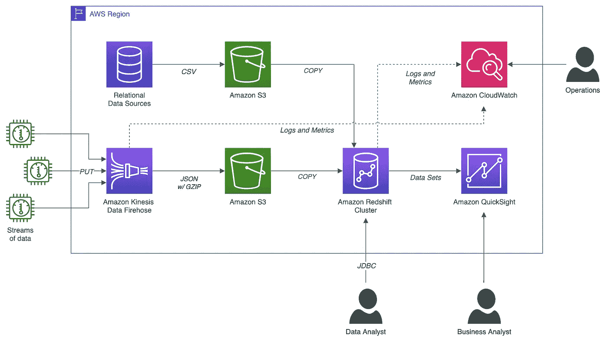

邮政示范建筑

在 Redshift 中，我们可以分析数据，提出一些问题，例如，在给定的时间段内，每个传感器位置的最低、最高、平均和中值温度是多少。最后，我们将使用 Amazon Quicksight，使用丰富的交互式图表和图形来可视化红移数据，包括显示地理空间传感器数据。

# 特色技术

本文将讨论以下 AWS 服务。

## 亚马逊 Kinesis 数据消防软管

根据亚马逊的说法，[亚马逊 Kinesis Data Firehose](https://aws.amazon.com/kinesis/data-firehose/) 可以捕获、转换和加载[流数据](https://aws.amazon.com/streaming-data/)到数据湖、数据存储和分析工具中。直接 Kinesis 数据消防软管集成包括亚马逊 S3、亚马逊红移、亚马逊弹性搜索服务和 Splunk。Kinesis Data Firehose 利用现有的[商业智能](https://en.wikipedia.org/wiki/Business_intelligence) (BI)工具和仪表盘实现近实时分析。

## 亚马逊红移

根据亚马逊的说法，[亚马逊红移](https://aws.amazon.com/redshift/)是最流行和最快的云[数据仓库](https://aws.amazon.com/data-warehouse/)。借助 Redshift，用户可以使用标准 SQL 在您的数据仓库和数据湖中查询数 Pb 的结构化和半结构化数据。Redshift 允许用户在数据湖中查询和导出数据。Redshift 可以联合查询来自 Redshift 的实时数据，也可以跨一个或多个关系数据库进行查询。

## 亚马逊红移光谱

据亚马逊介绍，[亚马逊红移光谱](https://docs.aws.amazon.com/redshift/latest/dg/c-using-spectrum.html)可以高效地从亚马逊 S3 的文件中查询和检索结构化和半结构化数据，而无需将数据加载到亚马逊红移表中。红移光谱表是通过定义数据文件的结构并将它们注册为外部数据目录中的表来创建的。外部数据目录可以是 [AWS Glue](https://aws.amazon.com/glue/) 或 [Apache Hive](https://hive.apache.org/index.html) metastore。虽然红移光谱是将数据复制到红移中进行分析的替代方法，但在本文中我们不会使用红移光谱。

## 亚马逊 QuickSight

据亚马逊称， [Amazon QuickSight](https://aws.amazon.com/quicksight/) 是一种完全托管的商业智能服务，可以轻松地向组织中的每个人提供见解。QuickSight 允许用户轻松创建和发布丰富的交互式仪表盘，其中包括[Amazon quick sight ML Insights](https://aws.amazon.com/quicksight/features-ml/)。然后，可以从任何设备访问仪表板，并将其嵌入到应用程序、门户和网站中。

# 什么是数据仓库？

据亚马逊称，[数据仓库](https://aws.amazon.com/data-warehouse/)是一个中央信息库，可以对其进行分析以做出更明智的决策。数据从事务系统、关系数据库和其他来源流入数据仓库，通常是有规律的。业务分析师、数据科学家和决策者通过商业智能工具、SQL 客户端和其他分析应用程序访问数据。

# 示范

## 源代码

这篇文章的所有源代码都可以在 [GitHub](https://github.com/garystafford/kinesis-redshift-streaming-demo) 上找到。使用以下命令 git 克隆项目的本地副本。

## 云的形成

使用项目中包含的两个 AWS CloudFormation 模板来构建两个 CloudFormation 堆栈。请查看这两个模板并了解资源成本，然后继续。第一个 CloudFormation 模板 [redshift.yml](https://github.com/garystafford/kinesis-redshift-streaming-demo/blob/master/cloudformation/redshift.yml) ，提供了一个新的亚马逊 VPC 以及相关的网络和安全资源、一个单节点红移集群和两个 S3 桶。第二个 CloudFormation 模板 [kinesis-firehose.yml](https://github.com/garystafford/kinesis-redshift-streaming-demo/blob/master/cloudformation/kinesis-firehose.yml) ，提供了一个 Amazon Kinesis 数据 firehose 交付流、相关的 IAM 策略和角色，以及一个 Amazon CloudWatch 日志组和两个日志流。

更改`REDSHIFT_PASSWORD`值以确保您的安全。或者，更改`REDSHIFT_USERNAME`值。在创建第二个堆栈之前，请确保第一个堆栈成功完成。

## 查看 AWS 资源

要确认所有 AWS 资源都已正确创建，请使用 AWS 管理控制台。

## Kinesis 数据消防软管

在 Amazon Kinesis 仪表板中，您应该会看到新的 Amazon Kinesis Data Firehose 交付流，redshift-delivery-stream。

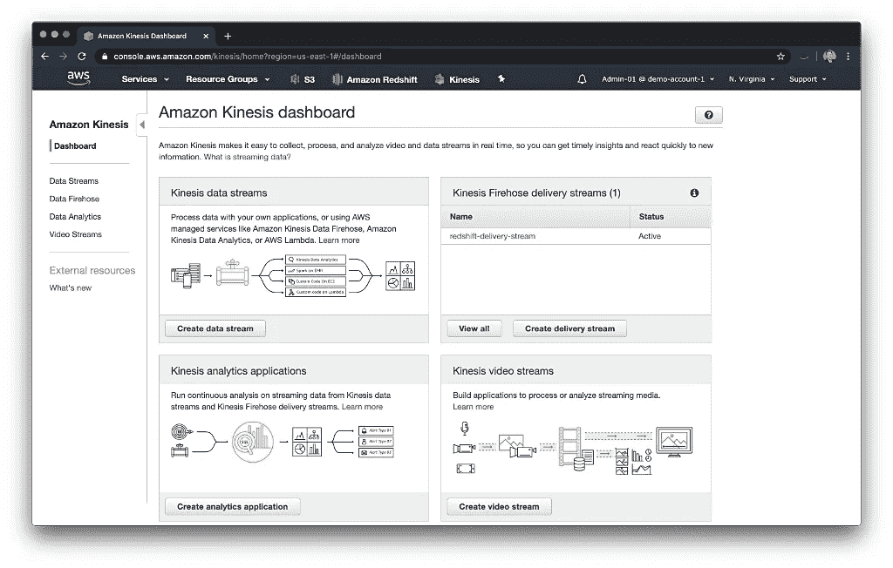

新的 Amazon Kinesis Firehose 交付流的 Details 选项卡应该类似于下图。请注意 IAM 角色 FirehoseDeliveryRole，它是由 CloudFormation 创建并与交付流相关联的。

我们不对传入的消息执行任何转换。注意新的 S3 桶，它是由云形成产生并与气流联系在一起的。存储桶名称是随机生成的。这个桶是传入消息将被写入的地方。

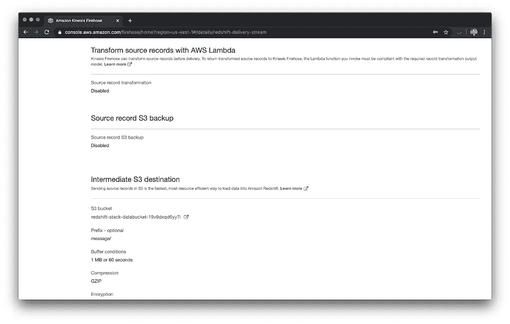

请注意 1 MB 和 60 秒的缓冲条件。每当传入消息的缓冲区大于 1 MB 或时间超过 60 秒时，消息就会使用 GZIP 压缩以 JSON 格式写入 S3。这些是最小的缓冲条件，也是我们所能得到的最接近红移的实时流。

请注意`COPY`命令，该命令用于将消息从 S3 复制到 Amazon Redshift 中的`message`表。Kinesis 使用由 CloudFormation 创建的 IAM 角色 ClusterPermissionsRole 作为凭证。我们使用一个清单将数据从 S3 复制到红移。据 Amazon 称，[清单](https://docs.aws.amazon.com/redshift/latest/dg/loading-data-files-using-manifest.html)确保`COPY`命令加载所有必需的文件，并且只加载数据加载所需的文件。清单由 Kinesis 消防软管交付流自动生成和管理。

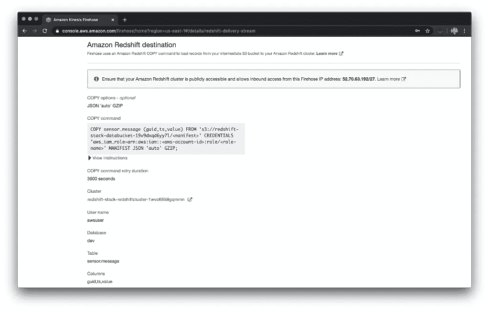

## 红移星团

在 Amazon 红移控制台中，您应该看到一个新的单节点红移集群，由一个红移 [dc2.large](https://aws.amazon.com/redshift/pricing/) 密集计算节点类型组成。

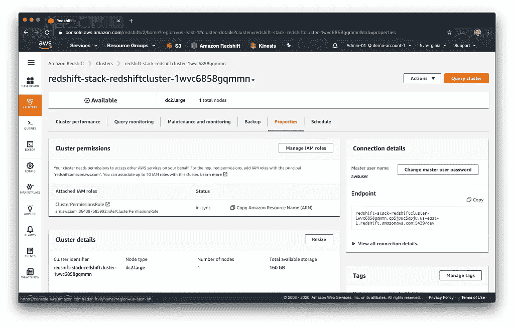

请注意 CloudFormation 创建的新 VPC、子网和 VPC 安全组。此外，观察到红移星团可以在新 VPC 之外公开访问。

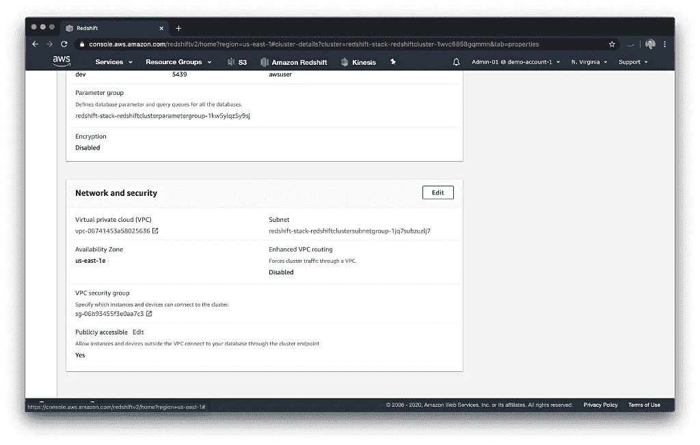

## 红移入口规则

单节点红移群集被分配到美国东部(N. Virginia) us-east-1 AWS 地区的 AWS 可用性区域。该群集与 VPC 安全组相关联。该安全组包含三个入站规则，都适用于红移端口 5439。与三个入站规则相关联的 IP 地址提供对以下内容的访问:1)美国东部-1 中亚马逊 QuickSight 的`/27` CIDR 块，美国东部-1 中亚马逊 Kinesis Firehose 的`/27` CIDR 块，以及对您而言，具有您当前 IP 地址的`/32` CIDR 块。如果您的 IP 地址发生变化或者您不再使用美国东部-1 地区，您将需要更改这些 IP 地址中的一个或全部。Kinesis Firehose IP 地址列表在这里是。QuickSight IP 地址列表在这里是[这里是](https://docs.aws.amazon.com/quicksight/latest/user/regions.html)。

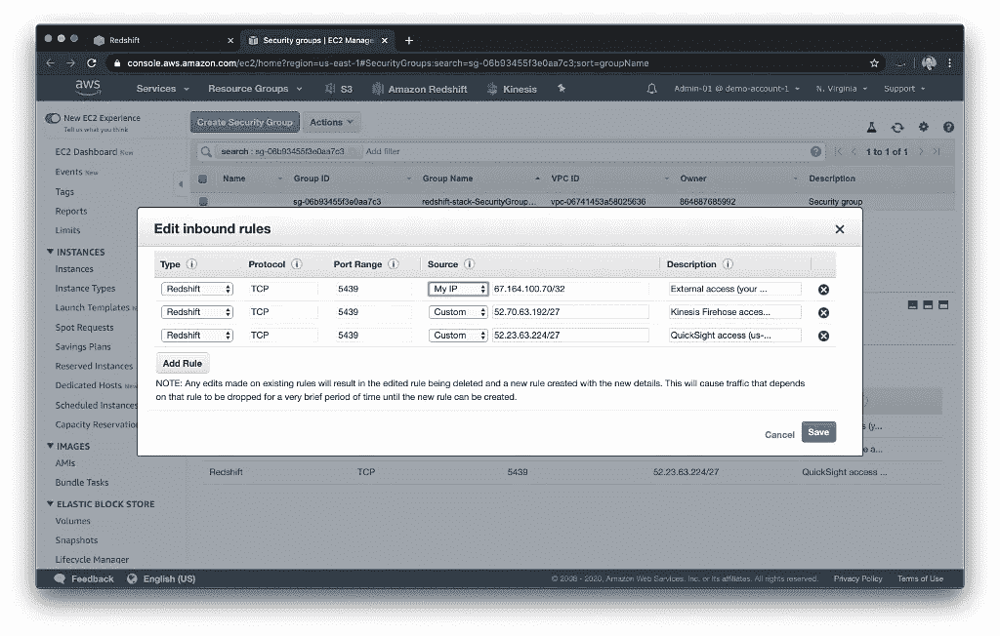

如果您无法从本地 SQL 客户端连接到 Redshift，最常见的情况是，您的 IP 地址已经更改，并且在安全组的入站规则中不正确。

## 红移 SQL 客户端

您可以选择使用红移查询编辑器与红移进行交互，或者使用第三方 SQL 客户端以获得更大的灵活性。要访问红移查询编辑器，请使用在[Redshift . yml](https://github.com/garystafford/kinesis-redshift-streaming-demo/blob/master/cloudformation/redshift.yml)cloud formation 模板中指定的用户凭据。

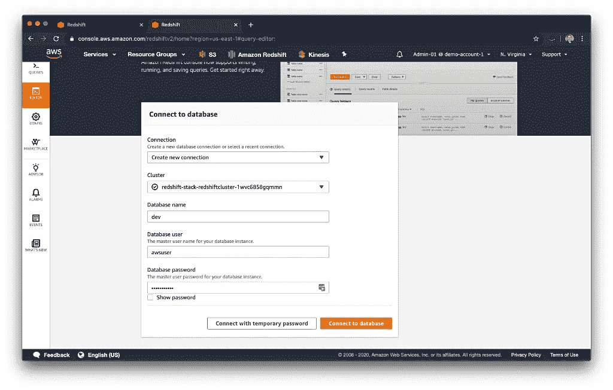

红移控制台和红移查询编辑器中有许多有用的功能。然而，在我看来，红移查询编辑器的一个显著限制是不能同时执行多个 SQL 语句。而大多数 SQL 客户端允许同时执行多个 SQL 查询。

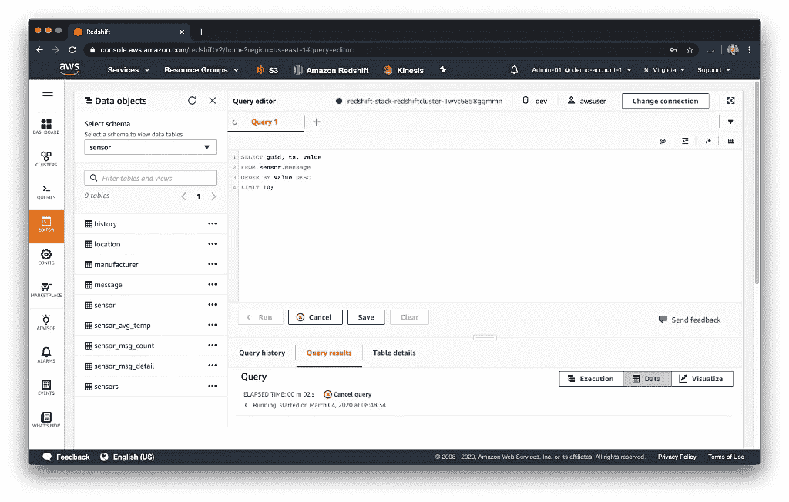

我更喜欢使用 JetBrains py charm IDE。PyCharm 具有与 Redshift 的现成集成。使用 PyCharm，我可以编辑项目的 Python、SQL、AWS CLI shell 和 CloudFormation 代码，所有这些都可以在 PyCharm 中完成。

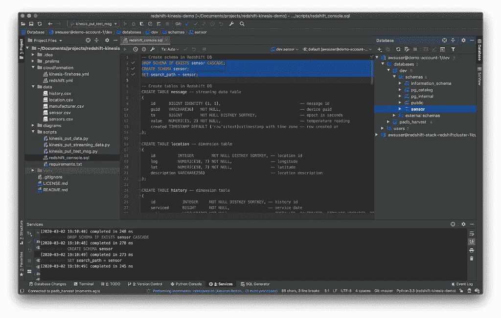

如果您使用任何常见的 SQL 客户端，您将需要设置一个 JDBC (Java 数据库连接)或 ODBC(开放式数据库连接)[连接到 Redshift](https://docs.aws.amazon.com/redshift/latest/mgmt/configure-jdbc-connection.html) 。ODBC 和 JDBC 连接字符串可以在红移星团的 Properties 选项卡或 CloudFormation 堆栈的 Outputs 选项卡中找到。

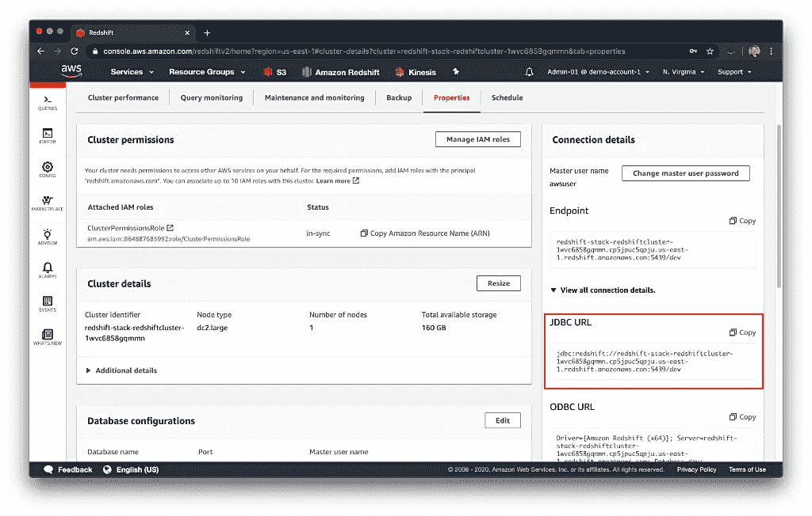

您还需要之前执行的`aws cloudformation create-stack` AWS CLI 命令中包含的 Redshift 数据库用户名和密码。下面，我们看到 PyCharm 的项目数据源窗口包含一个红移`dev`数据库的新数据源。

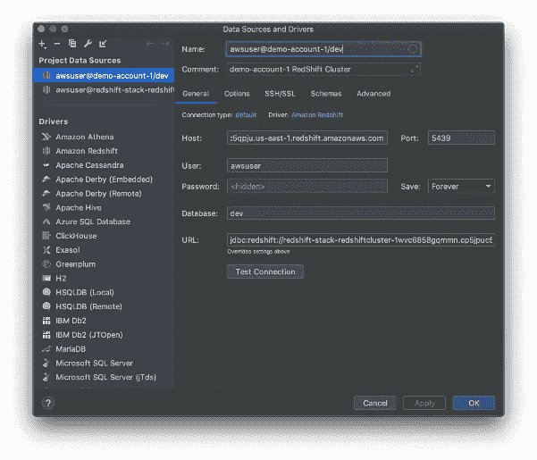

## 数据库模式和表

CloudFormation 在创建红移星团的同时，也创建了一个新的数据库，`dev`。使用红移查询编辑器或您选择的 SQL 客户机，执行以下一系列 SQL 命令来创建一个新的数据库模式`sensor`和`sensor`模式中的六个表。

## 星形模式

这些表表示从一个或多个关系数据库源获取的非规范化数据。这些表格形成了一个[星形模式](https://en.wikipedia.org/wiki/Star_schema)。星型模式被广泛用于开发数据仓库。星型模式由一个或多个引用任意数量的[维度表](https://en.wikipedia.org/wiki/Dimension_(data_warehouse))的[事实表](https://en.wikipedia.org/wiki/Fact_table)组成。`location`、`manufacturer`、`sensor`和`history`表是尺寸表。`sensors`表是一个事实表。

在下图中，外键关系是虚拟的，而不是物理的。该图是使用 PyCharm 的模式可视化工具创建的。注意模式的星形。`message`表是流式物联网数据最终将被写入的地方。`message`表通过公共的`guid`字段与`sensors`事实表相关联。

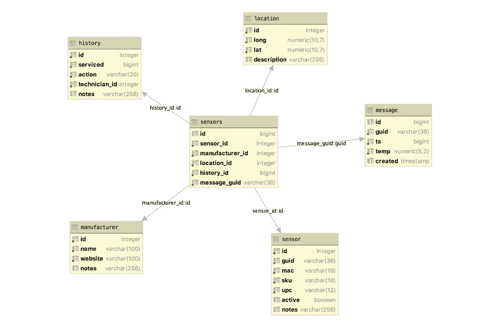

## S3 的样本数据

接下来，将项目中包含的样本数据复制到用 CloudFormation 创建的 S3 数据桶中。每个 CSV 格式的数据文件对应于我们之前创建的一个表。由于 bucket 名称是半随机的，我们可以使用 AWS CLI 和 [jq](https://stedolan.github.io/jq/) 来获取 bucket 名称，然后使用它来执行复制命令。

AWS CLI 的输出应该如下所示。

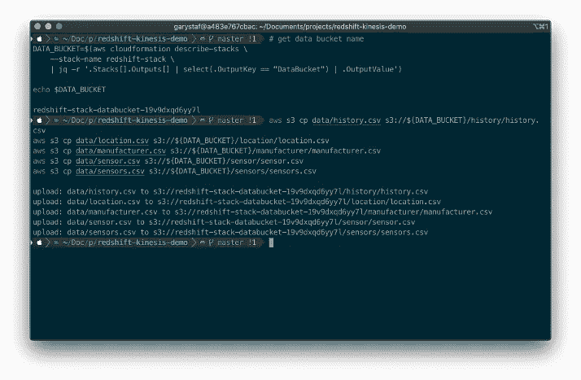

## 样本数据红移

关系数据库，如亚马逊 RDS，是为在线交易处理(OLTP)而设计的，而亚马逊 Redshift 是为在线分析处理(OLAP)和商业智能应用而设计的。为了将数据写入红移，我们通常使用`COPY`命令，而不是频繁的单独的`INSERT`语句，就像 OLTP 一样，这会非常慢。据亚马逊称，Redshift `COPY`命令利用亚马逊 Redshift 大规模并行处理(MPP)架构，从亚马逊 S3 上的文件、DynamoDB 表或一个或多个远程主机的文本输出中并行读取和加载数据。

在下面的一系列 SQL 语句中，用您的 S3 数据存储桶名称替换五处的占位符`your_bucket_name`。存储桶名称将以前缀`redshift-stack-databucket`开头。可以在 CloudFormation 堆栈`redshift-stack`的 Outputs 选项卡中找到 bucket 名称。接下来，用 ClusterPermissionsRole 的 ARN (Amazon 资源名称)替换占位符`cluster_permissions_role_arn`。ARN 的格式如下，`arn:aws:iam::your-account-id:role/ClusterPermissionsRole`。ARN 可以在云生成堆栈`redshift-stack`的输出选项卡中找到。

使用 Redshift 查询编辑器或您选择的 SQL 客户端，执行 SQL 语句将样本数据从 S3 复制到 Redshift `dev`数据库中的每个相应表中。`TRUNCATE`命令保证表格中没有以前的样本数据。

## 数据库视图

接下来，创建四个[红移数据库视图](https://docs.aws.amazon.com/redshift/latest/dg/r_CREATE_VIEW.html)。这些视图可能用于分析 Redshift 中的数据，以及稍后在 Amazon QuickSight 中的数据。

1.  **sensor_msg_detail** :使用 SQL 连接中的`sensors`事实表和所有五个维度表，返回聚合的传感器详细信息。
2.  **sensor_msg_count** :返回每个传感器红移收到的消息数。
3.  **sensor_avg_temp** :根据从每个传感器收到的所有信息，返回每个传感器的平均温度。
4.  **sensor _ avg _ temp _ current**:视图与前一视图相同，但仅限于最近 30 分钟。

使用红移查询编辑器或您选择的 SQL 客户端，执行以下一系列 SQL 语句。

此时，在 Redshift 中的`dev`数据库的`sensor`模式中，您应该总共有六个表和四个视图。

## 测试系统

有了所有必需的 AWS 资源和创建的红移数据库对象以及红移数据库中的样本数据，我们就可以测试系统了。包含的 Python 脚本[kine sis _ put _ test _ msg . py](https://github.com/garystafford/kinesis-redshift-streaming-demo/blob/master/scripts/kinesis_put_test_msg.py)将生成一条测试消息，并将其发送到 Kinesis Data Firehose。如果一切正常，这条消息应该会从 Kinesis Data Firehose 传送到 S3，然后复制到 Redshift，并出现在`message`表中。

安装所需的 Python 包，然后执行 Python 脚本。

运行下面的 SQL 查询，确认记录在数据库`dev`的`message`表中。至少需要一分钟消息才会出现在红移中。

一旦确认消息出现在`message`表中，通过截断该表删除记录。

## 流式数据

假设测试消息有效，我们可以继续模拟流式物联网传感器数据。包含的 Python 脚本，[kinesis _ put _ streaming _ data . py](https://github.com/garystafford/kinesis-redshift-streaming-demo/blob/master/scripts/kinesis_put_streaming_data.py)，创建六个并发线程，代表六个温度传感器。

模拟数据使用一种算法，该算法遵循振荡的[正弦波](https://en.wikipedia.org/wiki/Sine_wave)或正弦曲线，代表上升和下降的温度。在脚本中，我已经将每个线程配置为以任意偏移量开始，以给模拟数据添加一些随机性。

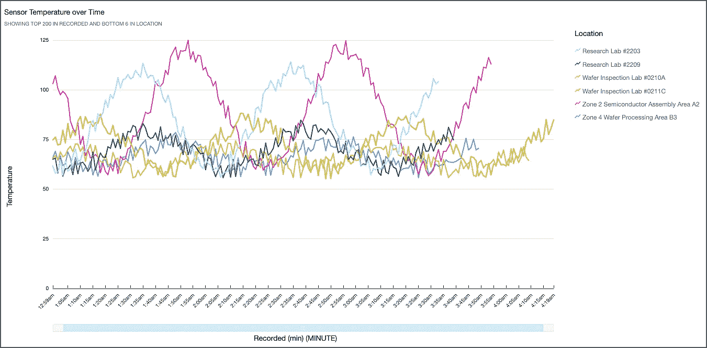

可以调整脚本中的变量，以缩短或延长传输模拟数据所需的时间。默认情况下，六个线程中的每一个都会为每个传感器创建 400 条消息，增量为一分钟。包括每个进行线程的偏移开始，脚本的总运行时间约为 7.5 小时，以生成 2，400 个模拟物联网传感器温度读数并推送到 Kinesis 数据消防软管。确保您能够保证在脚本的整个运行时间内保持与互联网和 AWS 的连接。我通常从一个小的 Amazon EC2 实例中在后台运行这个脚本。

要使用 Python 脚本，请执行以下两个命令之一。使用第一个命令将在前台运行脚本。使用第二个命令将在后台运行脚本。

查看`output.log`文件，您应该看到在每个线程上生成的消息被发送到 Kinesis Data Firehose。每条消息都包含传感器的 GUID、时间戳和温度读数。

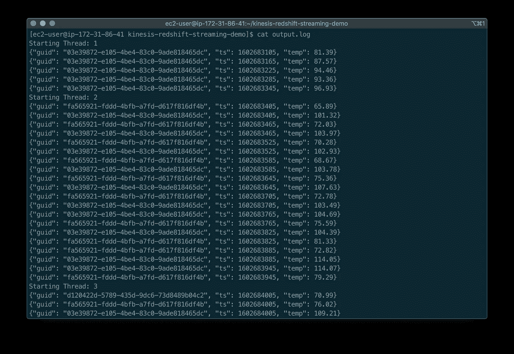

这些信息被发送到 Kinesis Data Firehose，后者再将信息写入 S3。这些消息是使用 GZIP 压缩以 JSON 格式编写的。下面，我们看到一个 S3 GZIP 压缩 JSON 文件的例子。JSON 文件按年、月、日和小时进行分区。

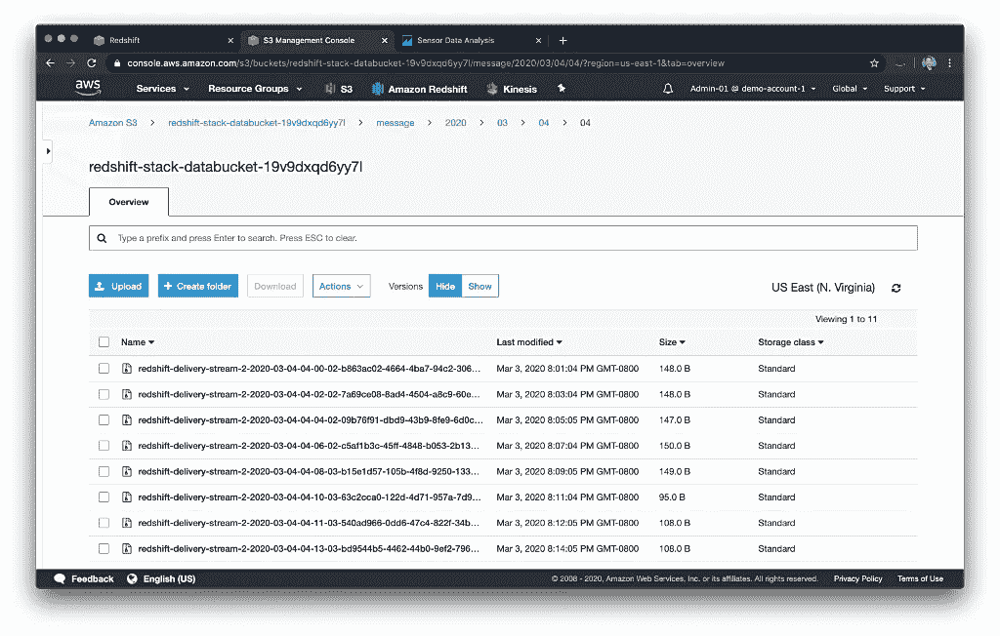

## 确认数据流向红移

从 Amazon Kinesis Firehose 控制台的 Metrics 选项卡，您应该可以看到传入的消息流向 S3 和 Redshift。

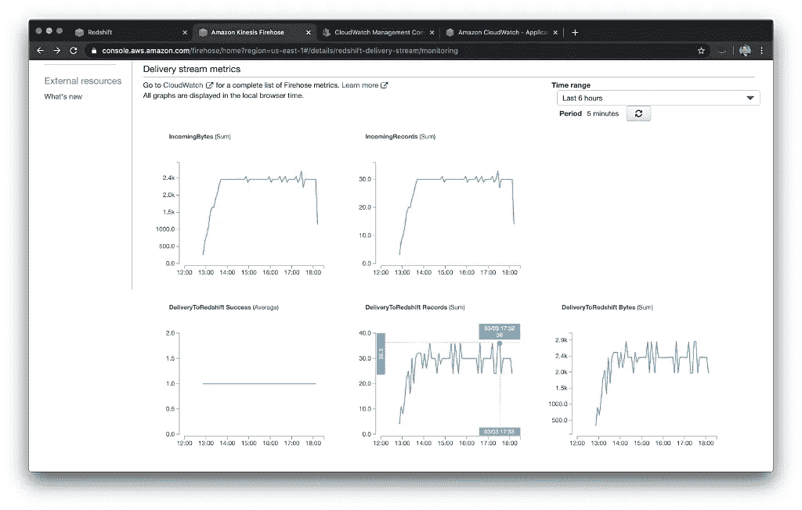

执行下面的 SQL 查询应该会显示越来越多的消息。

## 有多接近实时？

之前，我们看到了亚马逊 Kinesis Data Firehose 交付流是如何配置为以 1 MB 或 60 秒的速率缓冲数据的。每当传入消息的缓冲区大于 1 MB 或时间超过 60 秒时，消息就会被写入 S3。`message`表中的每条记录都有两个时间戳。第一个时间戳 ts 是记录温度读数的时间。第二个时间戳是使用`COPY`命令将消息写入 Redshift 时创建的。我们可以在 Redshift 中使用以下 SQL 查询来计算两个时间戳之间的差值(以秒为单位)。

使用红移查询的结果，我们可以在 Amazon QuickSight 中可视化结果。在我自己的测试中，我们看到在大约 7.5 小时内，对于 2，400 条消息，最小延迟是 1 秒，最大延迟是 64 秒。因此，在这种情况下，接近实时的时间大约为一分钟或更短，平均延迟大约为 30 秒。

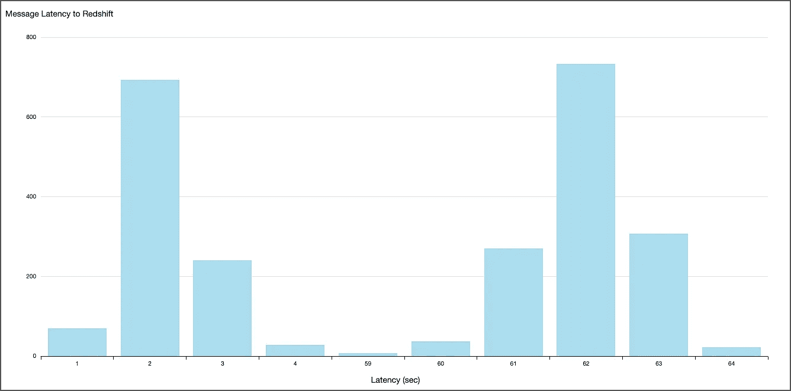

## 用红移分析数据

我建议至少等待 30 分钟，让大量消息复制到 Redshift 中。随着数据流进入 Redshift，执行我们之前创建的每个数据库视图。在 Redshift 中，您应该看到流消息数据与现有的静态数据相结合。随着数据继续流入 Redshift，视图将根据当前的`message`表内容显示不同的结果。

在这里，我们看到了`sensor_msg_detail`视图的前十个结果。

接下来，我们看看`sensor_avg_temp`视图的结果。

# 亚马逊 QuickSight

在最近的一篇文章中，[开始使用 AWS Glue、Amazon Athena 和 QuickSight 在 AWS 上进行数据分析:第 2 部分](http://programmaticponderings.com/2020/01/14/getting-started-with-data-analysis-on-aws-using-aws-glue-amazon-athena-and-quicksight-part-2/)，我详细介绍了 Amazon QuickSight 的入门。在这篇文章中，我假设你熟悉 QuickSight。

亚马逊[最近增加了](https://aws.amazon.com/about-aws/whats-new/2019/11/amazon-quicksight-adds-api-support-for-data-dashboard-spice-and-permissions/)全套`aws quicksight`API，用于与 QuickSight 交互。不过，在演示的这一部分，我们将直接在亚马逊 QuickSight 控制台中工作，而不是在 AWS CLI、AWS CDK 或 CloudFormation 中工作。

## 红移数据集

为了可视化来自 Amazon Redshift 的数据，我们首先在 QuickSight 中创建数据集。QuickSight 支持[大量数据源](https://docs.aws.amazon.com/quicksight/latest/user/supported-data-sources.html)用于创建数据集。我们将使用红移数据源。如果您还记得，我们为 QuickSight 添加了一个入站规则，允许我们连接到 us-east-1 中的红移星团。

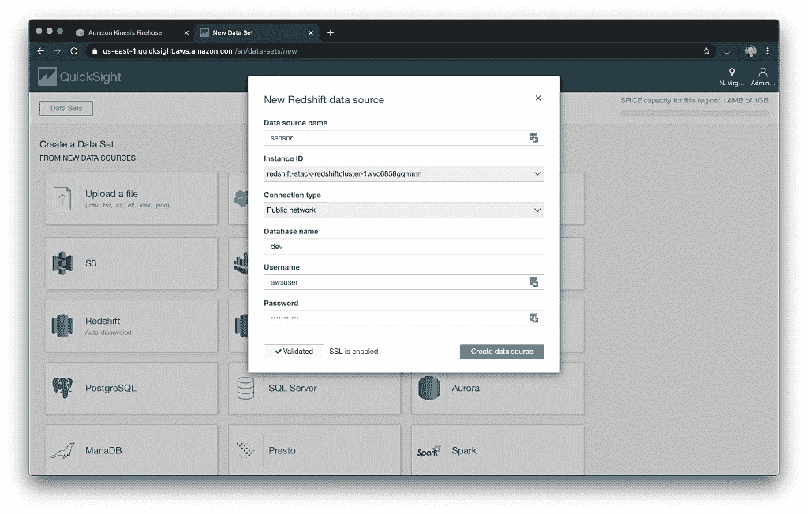

我们将选择`sensor`模式，这是本演示的表和视图所在的位置。

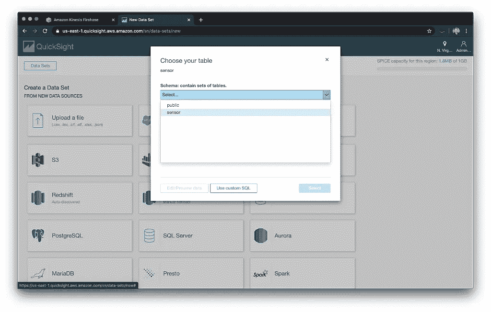

我们可以在 Redshift `dev`数据库中选择任何想要用于可视化的表或视图。

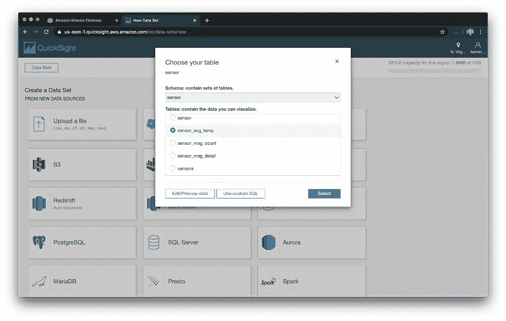

下面，我们将看到两个新数据集的示例，显示在 QuickSight 数据准备控制台中。请注意 QuickSight 如何自动识别字段类型，包括日期、纬度和经度。

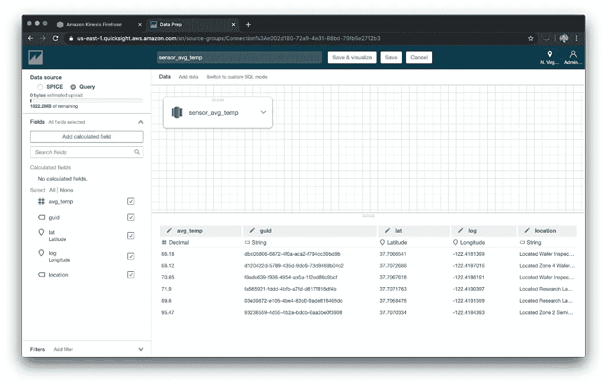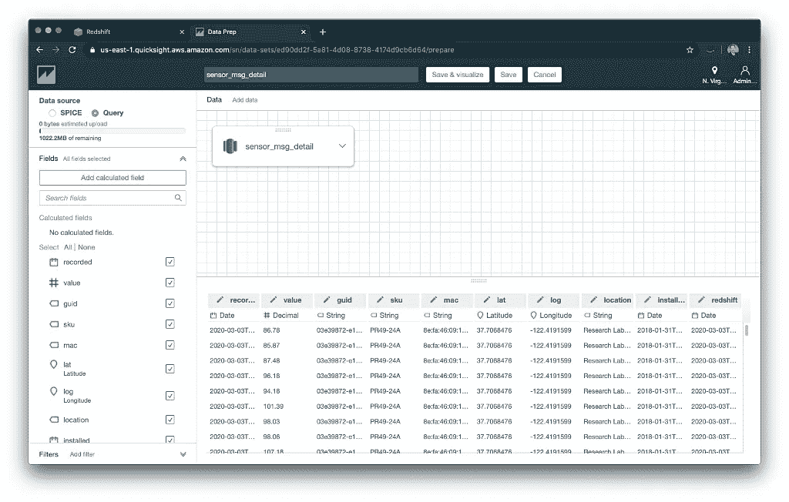

## 形象化

使用数据集，QuickSight 允许我们创建大量丰富的可视化效果。下面，我们看到来自六个温度传感器的模拟时间序列数据。

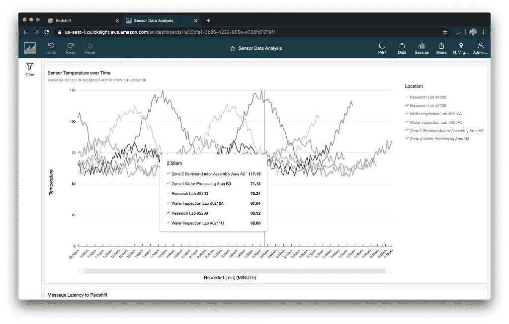

接下来，我们看一个 QuickSight 显示地理空间数据能力的例子。该图显示了每个传感器的位置以及该传感器记录的平均温度。

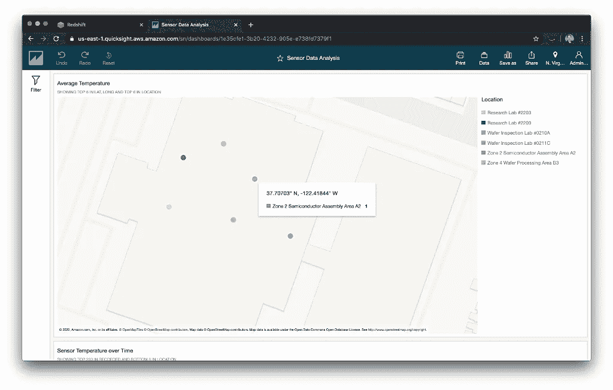

# 清理

要删除为此帖子创建的资源，请使用以下一系列 AWS CLI 命令。

# 结论

在这篇简短的帖子中，我们了解了如何使用 Amazon Kinesis Data Firehose 在 Amazon Redshift 中近乎实时地分析流数据。此外，我们还探索了如何在 Amazon QuickSight 中可视化这些分析的结果。对于依赖数据仓库进行数据分析但也有流数据源的客户来说，使用 Amazon Kinesis Data Firehose 或 Amazon Redshift Spectrum 是一个很好的选择。

*本博客代表我自己的观点，不代表我的雇主亚马逊网络服务公司的观点。*