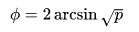
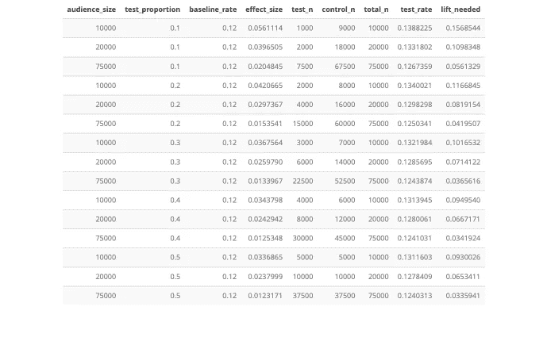

# 简化设计，最大限度地提高测试和学习的成功率

> 原文：<https://towardsdatascience.com/streamlining-design-and-maximizing-success-for-agile-test-and-learn-443156d9b2f1?source=collection_archive---------39----------------------->

## 如何使用 R 一次性权衡所有的 A/B 测试设计选项


克里斯蒂娜@ wocintechchat.com 在 [Unsplash](https://unsplash.com/photos/PviMD8jDeYE?utm_source=unsplash&utm_medium=referral&utm_content=creditCopyText) 上的照片

# **测试设计繁琐**

测试和学习分析作为一种定量了解零售商客户群偏好的方法，在整个行业广泛使用。成功的测试需要准确的假设(响应率、变量之间的预期差异)以及微调的执行参数(受众规模、测试/控制划分、测试迭代和时间)。

可以说，测试设计阶段是最关键的，需要营销策略师、统计学家、数据分析师和运营专家之间的及时合作，以就成功执行的正确参数达成一致。本文详细介绍了一种易于实现的方法来加速这个设计阶段，并使所有关键利益相关者保持一致。在本帖中，我们将介绍:

> 1.计算测试功效和效果大小的函数
> 
> 2.可视化展示所有可能的设计选项

这种方法提高了任意数量场景中效果大小计算的速度和简易性，允许营销策略师快速排除注定失败的测试设计，并专注于正确的参数，以最大化成功测试的机会。

# **背景**

从形式上讲，A/B 测试用于比较一个变量的两个或多个版本。最近与一家大型零售商的合作让我们的团队采用 A/B 测试来比较不同电子邮件活动在吸引现有客户回店方面的有效性。我们的目标是让每个活动尽可能个性化，以满足目标受众的需求(并一如既往地快速执行)。例如，我们可能希望锁定在过去 3 个月内购买了第一套西装的 20-30 岁男性，并将定制服务的报价与正装鞋的折扣进行比较。我们需要尽快将这个测试投入市场，因为假期很快就要到了，一旦这个测试完成，我们就会有更多的测试想法。

当营销策略师构思创意内容时，数据科学家的目标是评估提议的测试是否有很好的机会在 A 和 b 之间产生可检测的差异。如果设计不可能产生结果，整个团队需要迅速转向不同的设计，评估将重新开始。

# **问题**

许多因素使得设计阶段成为数据科学家的一项复杂任务:

1 每个测试都是为表现出非常特殊行为的顾客设计的，所以我们总是被 **s *mall 观众数量*所束缚**

2 在高度个性化的测试中，基于独特的客户群，基线响应率 存在 ***大的可变性***

3 测试通常会带来额外的实施成本(例如促销)，这意味着我们需要正确的 ***测试和控制组拆分***

4 敏捷框架被设计为每周启动多个测试，这意味着 ***有限的设计时间***

现在，在给定*特定的*输入值(例如:[https://www.evanmiller.org/ab-testing/sample-size.html](https://www.evanmiller.org/ab-testing/sample-size.html))的情况下，许多很棒的资源可用于确定所需的观众规模或效果规模。然而，将 30 种输入组合输入到这些计算器中并比较结果是非常麻烦的(高管们也不想在电话会议上看着你插上插头就喝)。

# 解决办法

为了使设计阶段对每个人来说都更容易，我们想出了一个流程来查看在任意数量的输入场景 下，我们需要自信地确认或拒绝一个测试假设 ***。***

## 设置参数

我们评估潜在设计所需的主要输入很简单:

**1。受众规模:**符合测试条件的客户(例如，刚买了一套西装的 20-30 岁男性)

**2。试验比例:**试验组和对照组之间的划分(试验组接收 A 内容，对照组接收 B 内容)

**3。基线回应:**历史回应率(例如，客户购买的典型比率)以 0 到 1 之间的概率来衡量

我们的测试设计评估应该量化 A 和 B 之间的差异，以便确认或拒绝我们的测试假设，即一个版本比另一个版本更好。

## 执行

让我们继续西装的例子。我们希望在我们的商店推广一项新的定制服务，因此我们定义了我们的假设，即服务的 15%折扣促销会比纯粹的信息性电子邮件推广服务吸引更多的客户使用定制服务。测试组将获得 15%的优惠促销，而控制组将收到一封标准的电子邮件，通知他们如何裁剪。

## 定义输入

**受众规模:**我们理想的目标受众是 10，000 名顾客，他们在过去的一年里只购买了一套西装。如果需要，我们可以放宽标准，将去年购买西装和鞋子的额外 10，000 名顾客包括在内，或者甚至将购买了正装衬衫但没有购买西装的额外 55，000 名顾客包括在内。因此，对于我们的评估，我们将着眼于从 10k 到 75k 的受众规模。

**测试比例:**测试活动包括 15%的促销活动，这降低了利润率，因此我们倾向于不平衡测试，以尽可能减少接收测试促销内容的客户数量。在我们的评估中，我们将考察各种比例:10/90、20/80、30/70、40/60 和 50/50。

**基线回应:**最后，我们知道现有购物者使用类似服务的总体基线回应率为 12%。虽然我们知道促销通常会将回复率提高 1-3 个百分点，但我们希望在这个测试中保持保守，因为定制服务是一项新服务，所以我们将这个常数保持在 12%。

## 定义功能

**效应大小计算:**由于我们的测试是比较两个概率(我们的响应变量将在 0 和 1 之间)，我们需要使用两个比例的测试设计。我们使用**科恩的 h** 公式计算影响大小，因为我们正在比较两个比例之间的差异([https://en.wikipedia.org/wiki/Cohen%27s_h](https://en.wikipedia.org/wiki/Cohen%27s_h))。因为我们的测试/控制分割可能不是 50/50，所以我们的测试被认为是不平衡的。请注意，我们使用 80%的功率。因为发送一封电子邮件的成本可以忽略不计，我们可以承受比标准的 90%或 95%阈值更大的误差空间。


科恩的 h 衡量两个概率之间的距离



应用于给定概率(p)的反正弦变换

第一个函数使用 R 中的 ***pwr*** 包来计算检验我们的假设所需的效应大小。第二个函数求解确认或拒绝我们的假设所需的测试响应率的效应大小公式。

【效应大小公式:h = 2 * asin(sqrt(p2))-2 * asin(sqrt(P1))
求解测试响应率(p2)给出:sin((h + 2*asin(sqrt(p1)))/2)】

注意:这种方法适应了观众规模、测试比例和基线反应率的主要效应规模参数的可变性，并且是为两个比例的不平衡测试而建立的。其他测试类型，如连续结果的比较，在这里没有探讨，但可以容纳在同一框架内。

## 设置输入参数

现在我们设置输入参数并应用函数。根据测试设计选项调整这些参数。

```
audience_size <- c(10000,20000,75000)
test_proportion <- c(0.1,0.2,0.3,0.4,0.5)
baseline_rate = c(0.12)
```

## 使用所有可能的测试设计创建一个数据集，并将效果大小计算应用于数据集的每一行



电梯需要证明不同。显示每个可能的测试设计输入。

现在我们有了一个清晰的表格，显示了测试受众规模(test_n)，以及确认或拒绝假设所需的基线响应率的百分比提升(lift_needed)。从技术上来说，这是我们需要的所有信息，但是没有人喜欢阅读一个无聊的旧表格…

## 为所有可能的设计创造一个互动的情节

使用 *ggplot* 和 *plotly* 可视化软件包，我们可以创建一个具有交互性的所有测试选项的图示，让我们悬停在不同的选项上以查看所有相关的细节。

# 结果

看着由此产生的情节，我们可以很快看到每个设计方案的利弊。利用这 10，000 名只买西装的顾客，我们的活动将需要以 50/50 的测试和控制比例推动至少 9%的增长。鉴于我们对过去活动的了解，这种类型的提升是不太可能的，而且由于促销优惠，我们宁愿将测试接受者限制在 50%以下的观众。因此，我们可能会建议放宽受众标准，以包括额外的 65，000 名西装+鞋子和礼服衬衫购物者，从而达到 75，000 名受众，测试和控制比例为 20/80，我们需要更合理的 5%提升来确认或拒绝假设。

## 让我们走远一点

我们刚刚看了一个使用基于三组初始标准的特定受众规模的示例。但是，如果我们更进一步，看看在广泛的观众规模和不同的基线率下，所需的提升是如何变化的呢？我们可以调整输入并观察。注:在本练习中，我们将保持测试比例恒定在 50/50。

## 解释

正如所料，基线速率越小，你需要看到的提升量就越高，才能发现差异。营销策略师感兴趣的是受众规模和提升需求之间的非线性关系。在设计针对小规模受众的极其个性化的活动时，考虑这种关系非常重要。例如，基线响应率为 10%，受众为 1，000 名客户，您需要看到至少 34%的提升才能证实您的假设。但是，增加 5，000 名客户会将需要的提升降低到 13%。在同样的 10%基线和 20，000 名客户的情况下，您将需要 7%的提升，而额外 5，000 名客户的好处是 0.7 个百分点的相对较小的差异。

## 结论

本文展示了一种用于 A/B 测试设计的方法，该方法可以在任意数量的设计场景中加速样本和效应大小的计算，并提供了所有可能设计的交互式可视化。这种方法大大提高了我们的测试和学习团队的速度，可以**排除注定失败的测试设计**并专注于正确的参数**以最大化成功测试的机会**。

# 密码

使用 R 3.5.3 生成