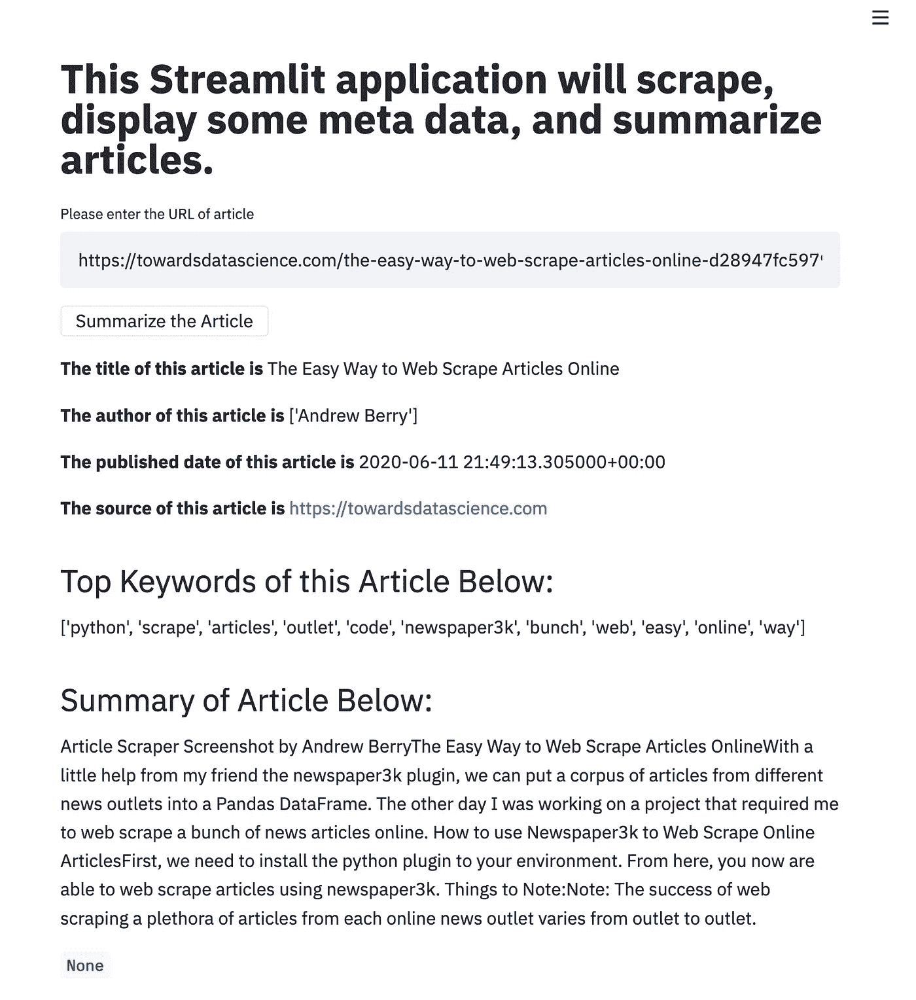
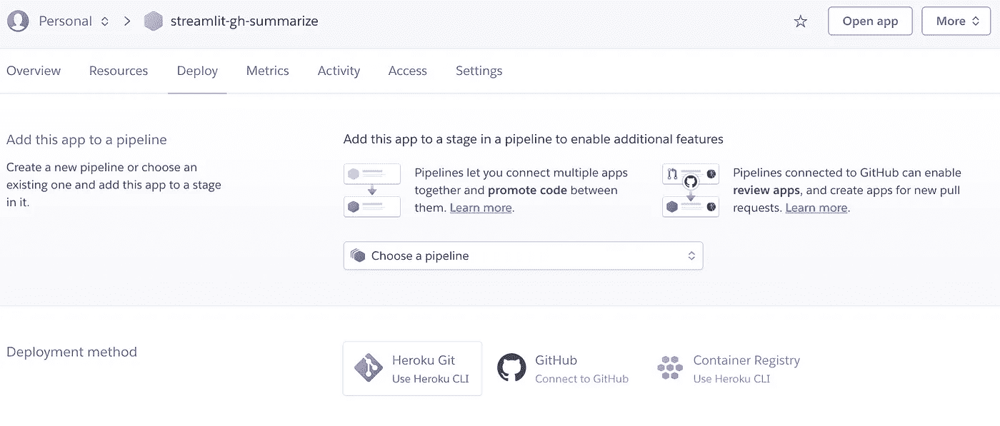
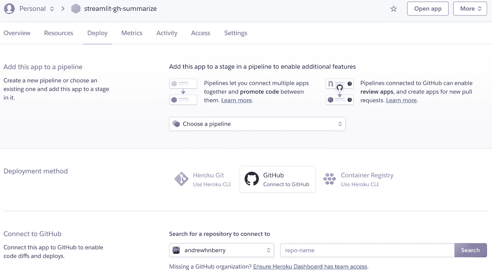
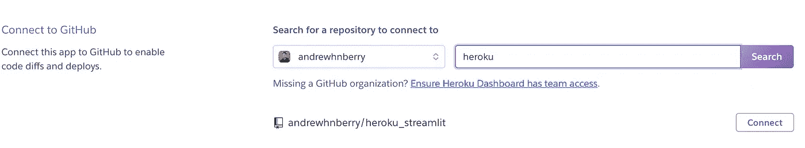
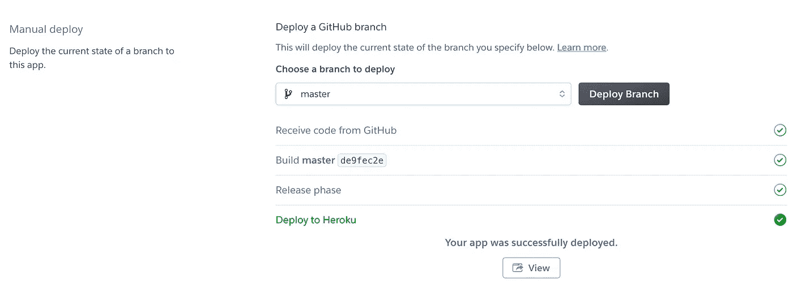

# Streamlit + Heroku = Magic？

> 原文：<https://towardsdatascience.com/streamlit-heroku-magic-5e4a7192929a?source=collection_archive---------62----------------------->


照片由[瑞德·卫斯理](https://unsplash.com/@rhett__noonan?utm_source=medium&utm_medium=referral)在 [Unsplash](https://unsplash.com?utm_source=medium&utm_medium=referral)

## 如何轻松地在 Heroku 上部署您的 streamlit 应用程序。

我不知道你怎么想，但在过去的几天里，我一直在玩 [streamlit](https://www.streamlit.io/) ，我不得不说我对它印象深刻。

它速度快，反应灵敏，易于掌握。**但最棒的是，您可以编辑您的 python 脚本，并看到您的 streamlit 应用程序实时自动更新。在我看来，与 streamlit 一起工作是非常愉快的。**

然而，一旦你构建了你的应用程序，你为什么不部署它，让全世界都能看到它呢？这是为您的数据科学或数据分析产品组合添加交互性的绝佳方式。

本教程将逐步介绍如何在 Heroku 上部署您的 streamlit 应用程序。

## 目录

1.  第 1 部分:您需要哪些文件？
2.  第 2 部分:通过 Heroku CLI(终端)使用 Heroku。
3.  要避免的常见陷阱
4.  第 3 部分:通过 Github 库使用 Heroku。

*注意:我假设您已经安装了 streamlit，并且已经知道一点如何使用它。*

# 第 1 部分:您需要哪些文件？

在 Heroku 上启动 streamlit 应用程序需要四个基本组件。

1.  setup.sh
2.  requirements.txt
3.  Procfile
4.  你的应用程序

## setup.sh —不需要凭据

*注意:您不需要将这个文件命名为 setup.sh，它可以是任何名称，但是必须以。sh 文件扩展名。然而，将其命名为 setup.sh 似乎是一种规范。*

## requirements.txt

这个文件基本上列出了我们将在 streamlit 应用程序中使用的所有特定 python 插件。可能看起来是这样的。

```
newspaper3k==0.2.8
streamlit==0.61.0
nltk==3.4.5
```

在您的终端上简单使用 *pip 冻结*功能可能很有诱惑力。

```
pip freeze > requirements.txt 
```

然而，我发现当你上传你的申请到 heroku 时，有时会引起很多不必要的问题。

*注意:我在我的基本环境中测试了这个 pip 冻结功能，因此一个* ***提示*** *将为您的新 streamlit 应用程序创建一个新的 python 环境，然后安装所需的 python 插件。*

## Procfile

*注意:将该文件命名为 Procfile，不要在其后添加任何扩展名。这是一个标准的文本文件。*

```
web: sh setup.sh && streamlit run your_application.py
```

## 你的应用程序

耗时的部分是构建您的 streamlit 应用程序，这是作为 python 脚本存储的。

对于本教程，我基于我在[网上抓取文章](/the-easy-way-to-web-scrape-articles-online-d28947fc5979)上的上一篇文章制作了一个简单的 python 应用程序。

[](/the-easy-way-to-web-scrape-articles-online-d28947fc5979) [## 网上搜集文章的简单方法

### 在我的朋友 newspaper3k 插件的一点帮助下，我们可以把来自不同新闻渠道的文章集合起来…

towardsdatascience.com](/the-easy-way-to-web-scrape-articles-online-d28947fc5979) 

**在我们继续之前，确保所有这些文件都在一个我们可以在终端中导航到的特定文件夹中。**

# 第 2 部分:通过 Heroku CLI(终端)使用 Heroku。

我想你们知道如何注册一个 Heroku 账户。

*注意:在我们开始在终端上使用 Heroku 之前，我建议导航到本教程第 1 部分的文件所在的文件夹。*

## 第一步:通过你的终端登录 Heroku。

```
$ heroku login
```

您将被重定向到您可以登录的网页，或者如果您已经登录到您的 web 浏览器，它将自动登录到您创建的帐户。

## 步骤 2:创建一个新的 Heroku 实例

运行下面的代码将自动创建一个带有随机名称的全新 Heroku 应用程序。

```
$ heroku create
```

或者你可以给它起自己的名字…

```
$ heroku create name_of_heroku_instance
```

## 第三步:将你的文件推送到新的 Heroku 应用程序中。

```
$ git push heroku master
```

这一部分可能需要一点时间，因为 Heroku 应用程序正在设置并在服务器上安装所需的 python 插件。一旦完成，它应该输出这个消息:*远程:验证部署…完成。*

## 步骤 4:启动你的应用程序

```
$ heroku open
```

瞧，这就对了！如果你按照上面所有的步骤复制了所有的代码。您在 heroku 上的 streamlit 应用程序应该如下所示。



我的 Streamlit 应用程序是什么样子的。

# 要避免的常见陷阱

有时您可能会忘记已经在您正在处理的文件夹中创建了一个远程 heroku 应用程序。

要进行检查，请运行以下代码。

```
$ git remote -v
```

如果不同，请删除此远程连接。

```
$ git remote rm heroku
```

然后添加正确的 heroku 地址，您希望您的应用程序托管在这个地址上。

```
$ git remote add heroku (git.heroku.com/heroku_application.git)
```

# 第 3 部分:通过 Github 库使用 Heroku。

也许，你并不是真的想通过你的终端推送你的应用文件。另一种方法是通过 Github。但是，这需要通过您选择的 web 浏览器上的 Heroku 仪表板来完成。

## 步骤 1:通过仪表板创建一个新的应用程序

## 第二步:点击应用程序

## 步骤 3:单击部署选项卡

## 步骤 4:选择 Github 作为部署方法



## 第 5 步:搜索 GitHub 存储库，其中存储了第 1 部分中的文件。



## **步骤 6:连接到存储库。**



## 步骤 7:在手动部署部分部署分支



在这里，您可以点击“查看”来查看您的应用程序。

**我还建议在自动部署部分启用自动部署。这将自动从你的 GitHub 推送最新的主分支，只要它有新的版本更新。**

这就是在 Heroku 上部署 streamlit 应用程序的两种方法。