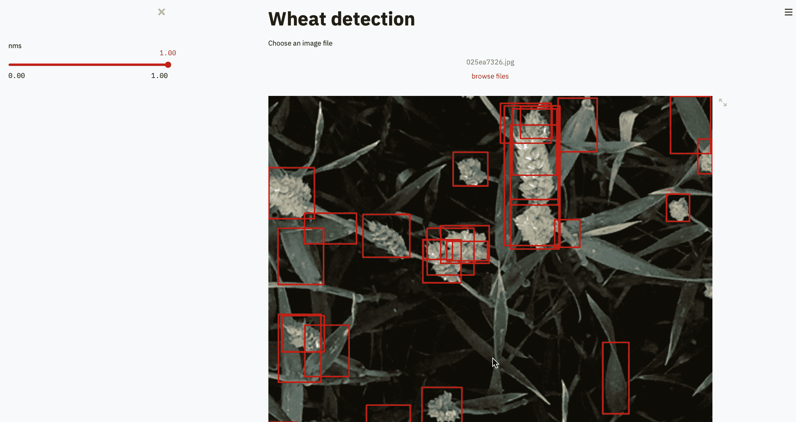
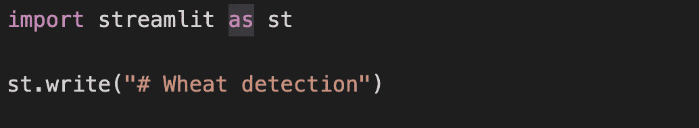
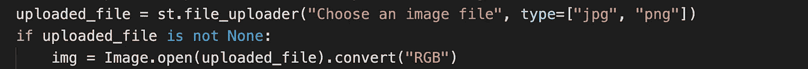
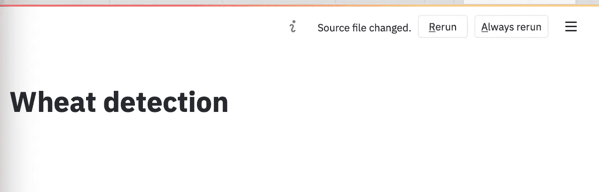
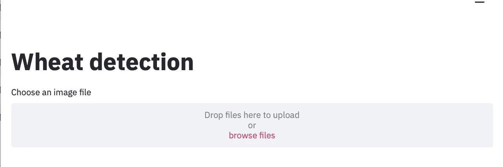
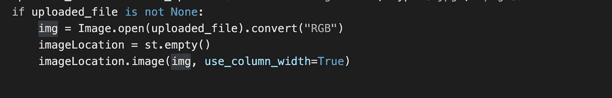
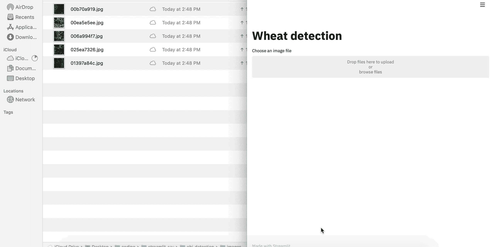
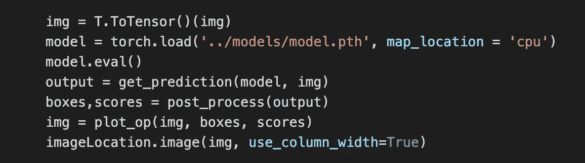
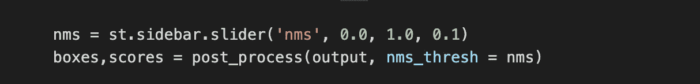
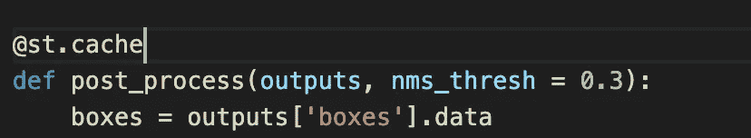

# Streamlit 使用数据应用程序更好地测试您的模型

> 原文：<https://towardsdatascience.com/streamlit-use-data-apps-to-better-test-your-model-4a14dad235f5?source=collection_archive---------49----------------------->

## 了解如何使用 Streamlit 制作快速数据应用程序来测试您的模型


[https://www . Reddit . com/r/wallpaper/comments/8of B1 d/natural _ architectural _ bridge _ at _ night _ scene _ HD/](https://www.reddit.com/r/wallpaper/comments/8ofb1d/natural_architectural_bridge_at_night_scenery_hd/)

## 介绍

我们使用各种技术，从创建非常可靠的验证集到使用 k-fold 交叉验证或提出各种奇特的指标来确定我们的模型执行得有多好。然而，没有什么比查看原始输出更好的了。当您查看样本输出时，您会发现其他方法无法告诉您的事情。

例如，如果您正在对作物执行对象检测，您可能会看到，由于风的原因，当作物以某种方式对齐时，我们的边界框没有正确封装作物。

然而，查看样本输出是一项单调乏味的任务。假设我们想测试各种 NMS 值，我们还想在一堆图像上测试它。我们总是可以为此编写一个函数，但是一次又一次地运行它是令人厌烦的。

如果有一个应用程序，我们可以上传图像，并使用滑块来调整 NMS 值，这不是很好吗？欢迎光临，史崔特。



## 什么是 Streamlit？

根据他们的网站，Streamlit 是一个开源的 web 框架，供数据科学家和机器学习工程师在短短几个小时内创建漂亮、高性能的应用程序，全部用纯 Python 编写。

## 装置

```
pip install streamlit
```

## 入门指南

在这个演示中，我将使用我训练的模型，通过快速 CNN 检测[小麦目标。您可以回到那篇文章，培训或者下载我的模型，然后继续学习。](/everything-about-fasterrcnn-6d758f5a6d79)

Streamlit 只是一个自顶向下运行的标准 python 文件。我们将首先创建一个名为 app.py 的文件，并在其中编写以下代码。



我们将按如下方式运行:

```
streamlit run app.py
```

它将打开我们的浏览器，输出如下。


注意，我们在 st.write()中使用了#号。这表明我们正在里面写 markdown。我们首先需要的是一个文件上传器来上传图像到 Streamlit。同样，这很简单:



我们传递允许的文件类型(本例中是 jpg 和 png ),当我们附加一个文件时，我们使用 PIL 读取它。现在保存 app.py 时:



我们看到 Streamlit 识别出源文件已经更改，并询问我们是否要重新运行。我们有。因此，我们选择“总是重新运行”来自动反映更改。现在我们的浏览器看起来像这样:



为了显示图像，我们可以使用 st.image()。然而，在生成预测之后，我们想要用我们的预测图像替换输入图像。为此，我们创建一个空容器并显示其中的所有内容。



我喜欢使用容器的另一个原因是你可以设置`use_column_width = True,`并且你不用担心图像的大小。现在，我们可以将图像拖放到我们的应用程序中。



最后，我们可以将图像转换为张量，加载模型，生成输出，并将其写入容器。



要改变 NMS 值，我们可以使用滑块或输入框来输入值，或者使用“+”和“-”按钮来增加或减少值。我要用滑球。我们的代码变成了。



仅此而已。只用大约 50 行代码，我们就可以创建这个超级有用的应用程序来测试我们的模型。您还可以为图像分类、分割、对象检测等各种问题创建模板，并在每次训练新模型时使用它们。

最后，当我们使用滑块更改 NMS 值时，如果我们已经为特定值生成了预测，我们就不想再生成它们了。因此，您可以在函数的顶部添加一个简单的装饰器:



它会为你缓存结果。这样，它不会每次都重新运行相同的阈值，而只是使用缓存的结果。很酷，不是吗？

## 结论:

这就是本文的全部内容。我真的会推荐大家使用 Streamlit，创建数据应用。它适用于所有类型的数据，缓存有助于处理昂贵的操作，如处理大型数据框。试试看。

如果你想了解更多关于深度学习的知识，请查看我的深度学习系列。

[](https://medium.com/@dipam44/deep-learning-series-30ad108fbe2b) [## 深度学习系列

### 我所有关于深度学习的文章的系统列表

medium.com](https://medium.com/@dipam44/deep-learning-series-30ad108fbe2b) 

~快乐学习

## 参考资料:

[https://docs.streamlit.io/en/stable/main_concepts.html](https://docs.streamlit.io/en/stable/main_concepts.html)