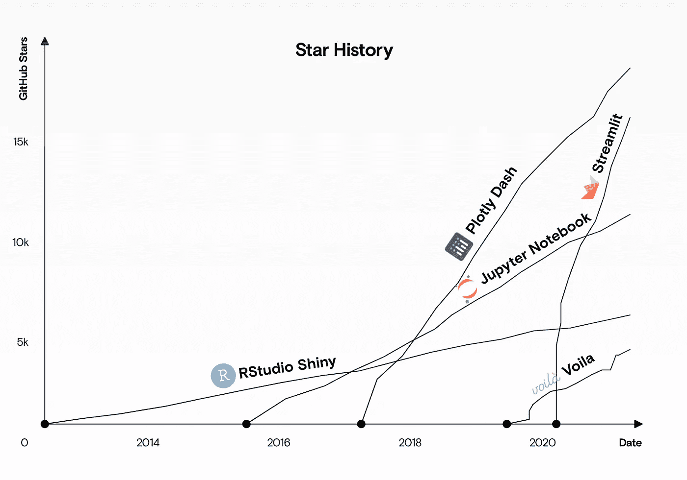
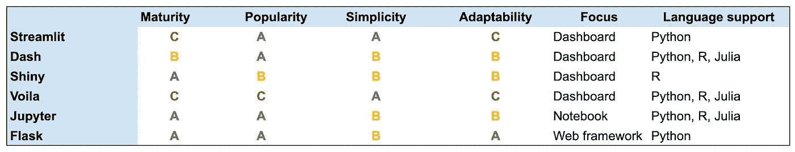

# streamlit vs . Dash vs . Shiny vs . Voila vs . Flask vs . Jupyter

> 原文：<https://towardsdatascience.com/streamlit-vs-dash-vs-shiny-vs-voila-vs-flask-vs-jupyter-24739ab5d569?source=collection_archive---------11----------------------->

## 比较数据仪表板工具和框架

来源:作者

在过去的三年里，Dash 和 Streamlit 作为一体式仪表板解决方案越来越受欢迎。来源:作者

# 数据仪表板—工具和库

几乎每个公司都拥有内部团队需要访问和分析的宝贵数据。非技术团队通常需要工具来简化这一过程。这些团队不需要为每个请求都找一位数据科学家，而是需要动态仪表板，在那里他们可以轻松地运行查询并查看定制的交互式可视化。

数据仪表板可以让您的非技术团队更容易访问数据。来源:作者

数据仪表板由许多不同的组件组成。它需要:

*   **分析:**使用后端库(如 Pandas)操作和汇总数据。
*   **可视化:**使用像散景这样的图形库创建数据的图表。
*   **交互:**使用 React 等前端库接受用户输入。
*   **Serve:** 使用 Flask 等 web 服务器监听用户请求并返回网页。

在过去，您不得不浪费大量的时间来编写所有的“粘合”代码，以便将这些组件连接在一起。但是对于像 Streamlit 和 Dash 这样的新库，这些组件都在一个包中。

尽管如此，确定使用哪个库仍然具有挑战性。以下是它们之间的比较，以及如何选择最适合您的项目的一些指导。

[您是否想要更详细的、贯穿营销语言的工具对比？注册我们的每周简讯。]

# 告诉我用哪一个

和往常一样，“视情况而定”——但是如果你在寻找一个快速的答案，你可能应该使用:

*   **破折号**如果您已经使用 Python 进行分析，并且想要为更大的公司构建生产就绪的数据仪表板。
*   **Streamlit** 如果您已经使用 Python 进行分析，并且希望尽快建立并运行您的仪表板原型。
*   **闪亮**如果您已经使用 R 进行分析，并且您希望让非技术团队更容易获得结果。
*   **Jupyter** 如果你的团队技术含量很高，并且不介意安装和运行开发者工具来查看分析。
*   **瞧**如果您已经有了 Jupyter 笔记本，并且希望让非技术团队也能使用它们。
*   如果你想从头开始构建自己的解决方案，那就试试烧瓶。

# 快速概述

并不是所有的库都可以直接比较。比如 Dash 是建立在 Flask 之上的，Flask 是一个更通用的 web 应用开发框架。类似地，每个库关注稍微不同的领域。

*   **Streamlit** 和 **Dash** 是完整的仪表板解决方案，专注于基于 Python 的数据分析，分别运行在 **Tornado** 和 **Flask** web 框架上。
*   **Shiny** 是一款完整的仪表板解决方案，专注于使用 r。
*   **Jupyter** 是数据科学家用来分析和操作数据的笔记本。您还可以使用它来可视化数据。
*   这是一个将个人 Jupyter 笔记本变成交互式网页的库。
*   **Flask** 是一个用于构建网站和应用的 Python web 框架——不一定专注于数据科学。

这些库有些已经存在了一段时间，有些还是全新的。有的比较死板，有自己的结构，有的比较灵活，能适应你的。有些侧重于特定的语言。下表显示了这些权衡:

来源:作者

我们在以下方面比较了这些库:

*   **成熟度:**基于项目的年限和稳定程度。
*   **人气:**基于领养和 GitHub 明星。
*   简单:基于开始使用这个库的容易程度。
*   **适应性:**基于库的灵活和固执程度。
*   **焦点:**基于本库解决什么问题。
*   语言支持:本库支持的主要语言。

这些不是严格或科学的基准，但它们旨在让您快速了解这些工具是如何重叠的，以及它们彼此之间有何不同。更多细节，请看下面的头对头对比。

# Streamlit 与 Dash

Streamlit 和 Dash 是这个集合中最相似的两个库。它们都是使用 Python 构建的完整仪表板解决方案，并且都包括用于数据分析、可视化、用户交互和服务的组件。

虽然它们都是开源的，但 Dash 更专注于企业市场，并不包括开源版本中的所有功能(如作业队列)。相比之下，Streamlit 是完全开源的。

Streamlit 更加结构化，更加注重简单性。它只支持基于 Python 的数据分析，并且有一组有限的小部件(例如滑块)可供选择。

Dash 的适应性更强。虽然它是用 Python 构建的，并把用户推向自己的绘图库(Plotly)，但它也兼容其他绘图库，甚至其他语言，如 R 或 Julia。

*   如果你想尽可能快地开始，并且没有强烈的意见或许多定制需求，使用 **Streamlit** 。
*   **如果你需要更灵活、更成熟的东西，并且不介意花费额外的工程时间，就用 Dash** 。

# 流线型与闪亮

Streamlit 是基于 Python 的仪表盘工具，而 Shiny 使用的是 r，这两个工具都专注于将数据分析脚本转化为完整的交互式 web 应用。

因为 Python 是一种通用语言，而 R 只专注于数据分析，所以用 Streamlit(基于 Tornado web 服务器)构建的 web 应用程序比用 Shiny 构建的更强大，也更容易扩展到生产环境。

Shiny 与 R 生态系统中的绘图库(如 ggplot2)集成良好，而 Streamlit 与 Python 绘图库(如 Bokeh 或 Altair)集成良好。

*   如果你更喜欢在 R 中做数据分析，并且已经投资了 R 生态系统，请使用 **Shiny** 。
*   **否则使用 Streamlit** (或破折号——见上文)。

# Streamlit 对 Voila

Streamlit 是一个完整的数据仪表板解决方案，而 Voila 是一个更简单、更有限的工具，允许您将现有的 Jupyter 笔记本电脑转换为基本的数据仪表板，并作为 web 应用程序提供给非技术用户。

像 Streamlit 一样，Voila 是建立在 Tornado web 框架之上的，所以你可以使用 Jupyter 笔记本和 Voila 来获得与 Streamlit 大致相似的东西。但是 Streamlit 更灵活(它不需要你使用 Jupyter)，而 Voila 可以更简单(前提是你已经有了你想要呈现的 Jupyter 笔记本)。

Voila 使用 Jupyter 的小部件库，而 Streamlit 使用自定义小部件——所以如果你已经熟悉 Jupyter，你会发现 Voila 更容易使用。

*   **如果您正在寻找一体化解决方案，请使用 Streamlit** 。
*   如果你已经有了 Jupyter 笔记本，并且正在寻找一种服务它们的方式，请使用 Voila 。

# Streamlit 与 Jupyter 笔记本电脑

Streamlit 是一个完整的数据仪表板解决方案，而 Jupyter 笔记本主要是对想要开发软件和可视化的工程师有用。工程师使用 Streamlit 为非技术用户构建仪表板，他们使用 Jupyter 笔记本开发代码并与其他工程师共享。

与 Voila 等插件相结合，Jupyter 笔记本可以类似地用于 Streamlit，但数据仪表板不是他们的核心目标。

*   **如果您需要非技术人员也能使用的仪表盘，请使用 Streamlit** 。
*   如果你的团队主要是技术型的，并且你更关心功能而不是美观，那么‍ **Jupyter 笔记本是最好的选择。**

# Streamlit 与 Flask

Streamlit 是一个数据仪表板工具，而 Flask 是一个 web 框架。向用户提供页面是数据仪表板的一个重要但很小的组件。Flask 没有任何数据可视化、操作或分析功能(尽管因为它是一个通用的 Python 库，所以它可以与执行这些任务的其他库很好地协作)。Streamlit 是一个集 web 服务和数据分析于一体的工具。

*   **如果您想要一个结构化数据仪表板，其中包含许多您需要的组件，请使用 Streamlit** 。如果你想用通用组件构建一个数据仪表板，并且不想重新发明轮子，那么使用 Streamlit**T3。**
*   **如果你想从头开始构建一个高度定制的解决方案，并且你有工程能力，就使用 Flask** 。

# 破折号 vs .闪亮

Dash 和 Shiny 都是完整的数据 dashboarding 工具，但 Dash 主要生活在 Python 生态中，而 Shiny 则是 r 的专属。

Dash 比 Shiny 有更多的功能，尤其是在其企业版中，它更加灵活。Python 是一种通用编程语言，而 R 只专注于数据分析。一些数据科学家更喜欢 R，因为它有成熟的库和(通常)更简洁的代码。工程师通常更喜欢 Python，因为它更符合其他语言。

*   如果你的团队更喜欢 Python，使用破折号。
*   如果你的团队更喜欢 r，使用闪亮的。

# Dash vs. Voila 和 Jupyter 笔记本

Dash 是一个一体化的仪表板解决方案，而 Voila 可以与 Jupyter 笔记本电脑结合使用，以获得类似的结果。Dash 更加强大和灵活，它是专门为创建数据仪表板而构建的，而 Voila 是建立在 Jupyter 笔记本电脑之上的一个薄层，用于将它们转换为独立的 web 应用程序。

*   **如果你想构建一个可伸缩的、灵活的数据仪表板工具，使用 Dash** 。
*   **如果您希望您的非技术团队能够使用现有的 Jupyter 笔记本电脑，请使用 Voila** 。

# Dash vs. Flask

Dash 构建在 Flask 之上，使用 Flask 作为其 web 路由组件，所以将它们进行正面比较意义不大。Dash 是一个数据仪表板工具，而 Flask 是一个极简的通用 web 框架。Flask 没有包含数据分析工具，尽管它可以与其他进行分析的 Python 库一起工作。

*   **如果您想要构建数据仪表板，请使用破折号**。
*   **如果你想构建一个更通用的 web 应用程序并选择其中的每个组件，请使用** **Flask** 。

# 闪亮与 Voila + Jupyter 笔记本电脑

Shiny 是 R 的数据仪表板解决方案，虽然你可以在 R 上使用 Voila 和 Jupyter 笔记本，但这些工具主要关注 Python 生态系统。

*   如果你已经在 r 中做了数据分析，就用闪亮的
*   如果你已经有了 Jupyter 笔记本，并想让它更容易使用，那么就使用 Voila 。

# 闪亮与烧瓶

Shiny 是一个内置在 r 中的数据仪表板工具，Flask 是一个内置在 Python 中的 web 框架。Shiny 与 R 绘图库配合得很好，比如 ggplot2。默认情况下，Flask 没有内置任何数据分析工具。

*   **如果你正在构建一个数据仪表板，并且想用 r 进行数据分析，那么就使用 Shiny** 。
*   **如果你想从头开始构建一个通用的 web 应用程序，使用 Flask** 。

# 瞧，这就是烧瓶

Voila 是一个将 Jupyter 笔记本转换为独立网络应用程序并使用 Tornado 为其提供服务的库。像 Tornado 一样，Flask 是一个通用的 web 框架。虽然可以使用 Flask 为 Jupyter 笔记本提供服务，但是您必须重新实现大部分 Voila 库——所以除非您有非常具体的原因，否则最好简单地使用 Voila。

# 结束语

我们在这里介绍的所有工具都可以帮助您访问锁定在现有数据中的价值。我们看到团队犯的一个常见错误是，在选择使用哪些工具时过于纠结，而不是关注数据本身。虽然使用错误的工具肯定会阻碍你的分析，但团队陷入所谓的[自行车脱落](https://exceptionnotfound.net/bikeshedding-the-daily-software-anti-pattern/)更常见:花太多时间争论不太重要的细节。

如果您想聊聊探索您的数据并将其转化为更多收入，请与我们的首席执行官[预约免费通话。](https://datarevenue.com/en-contact)