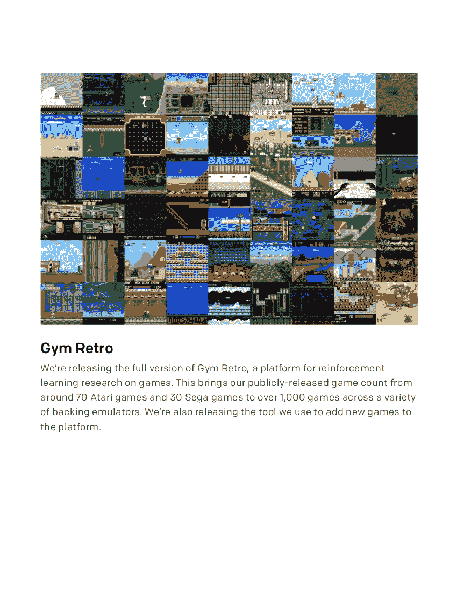
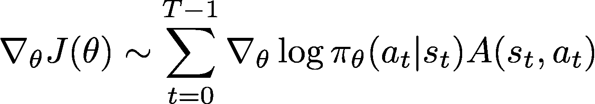

# 街头霸王 2 很难，所以我训练了一个人工智能来帮我打败它

> 原文：<https://towardsdatascience.com/street-fighter-ii-is-hard-so-i-trained-an-ai-to-beat-it-for-me-891dd5fc05be?source=collection_archive---------23----------------------->

## 训练一个人工神经网络玩街霸 II 冠军版


瑞安·昆塔尔在 [Unsplash](https://unsplash.com?utm_source=medium&utm_medium=referral) 上拍摄的照片

我先说我不擅长打游戏。在成长过程中，我总是在大多数游戏中失败，直到我想出了扣杀的策略，直到我赢了。尽管如此，作为一个年轻的成年人，我决定接受街头霸王 II 的挑战，这是一款卡普空钟爱的游戏。这是 90 年代的一款游戏，它激发了一代人酷炫的战斗动作和惊人的关卡主题。

虽然砸按钮策略很有效，但我需要一个不同的策略来完成这个活动。然后，突然意识到，我想出了一个主意，训练一个强化剂来帮我打败它。所以，舞台设置好了，我决定开始训练我自己的模特来击败这场运动！

# 健身房复古和整合工具

首先，我们需要一种方法将《街头霸王 2》实际实现到 Python 中。有几种方法可以做到这一点，但为了节省时间，最简单的方法是健身房复古。Gym-retro 是一个 Python 包，可以将我们的游戏数据转化为可用的环境。Gym-retro 带有超过 1000 种不同游戏的预制环境。这个工具很棒，因为它使得在游戏中实现一个人工代理变得非常简单。这也使得提取每次跑步的行动和奖励变得非常简单。



[开 AI 健身房复古](https://openai.com/blog/gym-retro/)

最初的包中唯一缺少的是每个级别的保存状态。但是，他们也发布了自己的集成工具，您可以在这种情况下使用！

你首先需要把它安装到你的健身房复古文件和游戏文件所在的文件夹中。开始后，你只需要把你的角色带到你想要保存状态的关卡开始，然后输出。短小精悍！

最后，过了一段时间，我获得了我们将要用来训练代理人的所有等级。接下来，我们需要决定使用什么强化算法。

# 稳定的基线和培训

我决定采用 A2C(演员优势评论家)模型的算法。



A2C [算法](https://en.wikipedia.org/wiki/Reinforcement_learning)

这个模型背后的基本思想是，预测一个近乎无限量输入的行动几乎是不可能的。因此，我们将使用一个神经网络“演员”来探索当前环境并执行一个动作。另一个神经网络“批评家”获取当前状态和行为，并输出评估。“行动者”然后根据“批评者”的建议调整执行某些动作的概率。改变执行动作的方式是优势所在。它比较了执行某个动作的代理人与在该状态下采取的平均动作之间的回报。

稳定基线是 Open AI 的初始基线 Python 包的延续，对原始包进行了改进。它包括许多强化学习模型，所以一定要去看看！他们的 A2C 模型是我们将使用的模型，有了它，我们就有了所有的运动部件来训练我们的模型！

[](https://github.com/hill-a/stable-baselines) [## 丘陵/稳定基线

### 稳定基线是一组基于 OpenAI 基线的强化学习算法的改进实现…

github.com](https://github.com/hill-a/stable-baselines) 

我们将使用 Google Colab 作为我们的 Python 环境。使用免费版的 Colab，我们可以在谷歌的云平台上运行 Python 笔记本，并利用他们的 Tesla K80 GPU 进行我们的培训。安装完所有的包之后，是时候创建我们的模型了。首先，我们验证我们的 Google Drive，并使用 Gym-Retro 包中的 Python 脚本导入我们的游戏文件。

```
!pip install stable-baselines[mpi]==2.10.0
!pip install gym-retro
!pip install tqdmfrom tqdm import tqdm
import time
import retrofrom stable_baselines.common.policies import MlpPolicy,MlpLstmPolicy, MlpLnLstmPolicy, CnnLnLstmPolicy, CnnPolicy, CnnLstmPolicyfrom stable_baselines.common.vec_env import SubprocVecEnv, DummyVecEnvfrom stable_baselines import PPO2, A2Cfrom google.colab import drive
drive.mount('/gdrive')
!python -m retro.import /gdrive/"My Drive"/"Where you Keep your Game Files"
```

接下来，我们将创建我们的模型。我们将使用我们之前在 CNN 政策中引入的 A2C 模型(最适合 2D 游戏)。我们还需要通过提供我们正在使用的游戏以及我们希望代理从什么状态开始来初始化我们的环境。

```
#Create and Train Model on SFII Engine
gamename = 'StreetFighterIISpecialChampionEdition-Genesis'
modelname = 'Fighter_a2c_pt2' #whatever name you want to give it
env = DummyVecEnv([lambda: retro.make(gamename ,state='Champion.Level1.RyuVsGuile')])model = A2C(CnnPolicy,env,n_steps=128, verbose=1)
#model = A2C.load('/gdrive/My Drive/ROMS/Fighter_a2c_pt2.zip')
model.set_env(env)
model.learn(total_timesteps=1000)#Saves Model into
model.save("/gdrive/My Drive/"#"Whatever Your File Name is/" + modelname)env.close()
```

现在是有趣的部分。我们将训练我们的模型来击败这场运动！街头霸王 II 战役中，Ryu 是唯一可玩的角色，所以我们会用他来训练我们的模型。我们的模型将在每一关运行 100，000 次，并在每一关后保存。我们的最终结果基于 10 个训练周期(每个级别 100 万次迭代)。我很好奇的一件事是培训需要多长时间？通过利用 Python 中的时间包，我能够看到每个训练周期大约需要 2 个小时。

```
#Training and Saving Your Model#Use whatever you called your states without the .state extension
sts = ['RyuVsGuile','RyuVsBlanka','RyuVsRyu','RyuVsKen','RyuVsChunLi','RyuVsZangief','RyuVsDhalsim','RyuVsHonda','RyuVsBalrog','RyuVsVega','RyuVsSagat','RyuVsBison']start_time = time.time()
for st in tqdm(sts, desc='Main Loop'):
  print(st)
  env = DummyVecEnv([lambda: retro.make('StreetFighterIISpecialChampionEdition-Genesis', state=st, scenario='scenario')])
  model.set_env(env)
  model.learn(total_timesteps=500000)
  model.save(modelname)
  env.close()
end_time = time.time() - start_time
print(f'\n The Training Took {end_time} seconds')
```

训练完我们的模型后，我们将需要计算代理获得的奖励金额。我们可以通过让代理人玩一个关卡并计算代理人获得的奖励金额(赢得一场比赛后获得的点数)来实现这一点。这个模型在一个比训练更容易的难度上被测试，仅仅是因为它产生了最好的结果。我们还将利用 Gym-Retro 中的一个伟大功能，它允许你记录你的代理人在游戏中的表现！录制的素材是 BK2 文件，可以使用 Gym-Retro 附带的另一个 Python 脚本将其转换为 MP4。

```
env = DummyVecEnv([lambda: retro.make('StreetFighterIISpecialChampionEdition-Genesis',state='RyuVsHonda-Easy', record='/gdrive/My Drive/'#"Wherever you put file")])model = A2C.load(modelname)
model.set_env(env)
obs = env.reset()
done = False
reward = 0while not done:
  actions, _ = model.predict(obs)
  obs, rew, done, info = env.step(actions)
  reward += rew
print(reward)### Convert BK2 to MP4 File!python /usr/local/lib/python3.6/dist-packages/retro/scripts/playback_movie.py "/gdrive/My Drive/Level16.RyuVsHonda-Easy-000000.bk2"
```

经过漫长的旅程，我们终于制造出了一个能够打败街霸 II 的人工智能！下面是 Ryu_Bot 打完战役的视频。

# 模仿和未来的设计

虽然这个项目给出了令人满意的结果，但这个设计有一些限制。首先，这个模型只适用于 Ryu。当切换到一个单独的角色时，比如 Guile，模型的表现并不好，因为他们的特殊动作有单独的输入。对于未来的设计，我会考虑使用单独的角色来训练模型，或者比较和对比不同的强化学习算法，看看哪种表现最好。

在一天结束时，如果你对开始使用机器学习感到好奇，构建一个 RL 代理会非常有趣和有意义。除了视频游戏，强化学习还有许多用途，比如在优化问题或机器人方面。还有大量很棒的文章和视频系列可以帮助你开始。

# 感谢您的阅读！

[街头霸王拳头撞 GIF](https://giphy.com/gifs/street-fighter-fist-bump-ryu-YwR8wm7KknBok)

完整代码可以通过 Google Colab 找到:

[](https://colab.research.google.com/drive/1cbyrrfqgc2mUu6ZyfYeB20A7-Khksq5-?usp=sharing) [## 谷歌联合实验室

### 龙 _ 机器人

colab.research.google.com](https://colab.research.google.com/drive/1cbyrrfqgc2mUu6ZyfYeB20A7-Khksq5-?usp=sharing) 

# 参考

1.  【https://retro.readthedocs.io/en/latest/getting_started.html 
2.  [https://stable-baselines.readthedocs.io/en/master/](https://stable-baselines.readthedocs.io/en/master/)
3.  [https://www.youtube.com/watch?v=NyNUYYI-Pdg&t = 547s](https://www.youtube.com/watch?v=NyNUYYI-Pdg&t=547s)
4.  [https://www.youtube.com/channel/UCLA_tAh0hX9bjl6DfCe9OLw](https://www.youtube.com/channel/UCLA_tAh0hX9bjl6DfCe9OLw)
5.  [https://www.youtube.com/watch?v=O5BlozCJBSE](https://www.youtube.com/watch?v=O5BlozCJBSE)