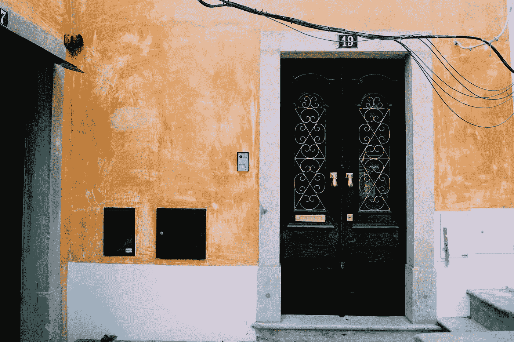
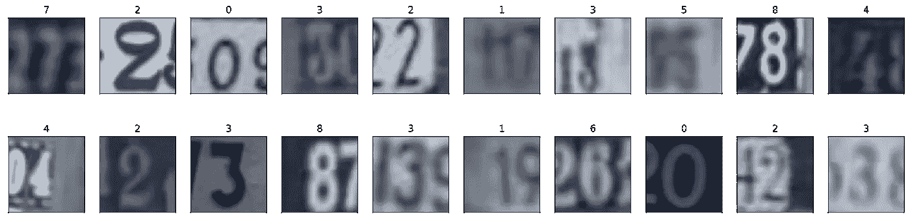
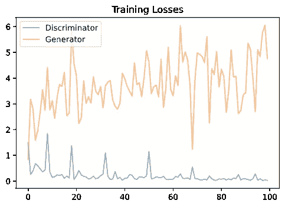
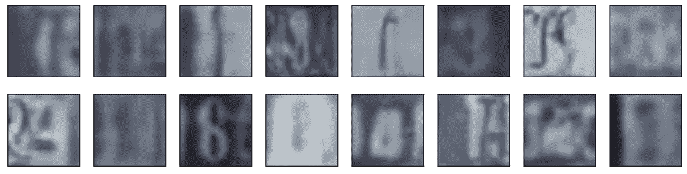

# 使用 DCGAN 生成街景门牌号

> 原文：<https://towardsdatascience.com/street-view-house-number-generation-using-dcgan-8cc5222408f3?source=collection_archive---------32----------------------->

## 深度学习

## 用 DCGANs 生成新的门牌号图像



由[卡拉·亚历山大](https://unsplash.com/@kmvrlv?utm_source=medium&utm_medium=referral)在 [Unsplash](https://unsplash.com?utm_source=medium&utm_medium=referral) 上拍摄的照片

在本文中，我将带您完成一个有趣的项目，在这个项目中，您将实现一个用于街景门牌号生成的 DCGAN。

我们将利用街景门牌号(SVHN)数据集来训练我们的对抗网络。

> *如果你不熟悉 GANs 及其工作方式，请阅读这篇关于走向数据科学的文章。*

[](/generative-adversarial-networks-6a17673db367) [## 生成对抗网络

### 用解读甘博弈

towardsdatascience.com](/generative-adversarial-networks-6a17673db367) 

## 街景门牌号(SVHN)数据集

您将在街景门牌号码(SVHN)数据集上训练 DCGAN。这些是从谷歌街景收集的门牌号的彩色图像。SVHN 图像是彩色的，比 MNIST 图像更加多变。

数据可以从[这里](http://ufldl.stanford.edu/housenumbers/)下载。

> 我们将使用深度卷积 GANs。如果你想了解 DCGANs，可以看看这篇文章。

[](/dcgans-deep-convolutional-generative-adversarial-networks-c7f392c2c8f8) [## 深度卷积生成对抗网络

### 生成对抗网络最有趣的部分之一是生成网络的设计。的…

towardsdatascience.com](/dcgans-deep-convolutional-generative-adversarial-networks-c7f392c2c8f8) 

## 预处理和数据加载

我们只需要将数据转换成张量，并准备好数据加载器。

作者代码。

## 可视化我们的训练数据

我们现在将生成一批数据，并将其可视化。请注意，np.transpose 函数按照指定的顺序转换图像尺寸。例如，在调用以下函数时，形状 3x32x32 的 RGB 图像将转换为 32x32x3:

```
np.transpose(img,(1,2,0))
```

作者代码。



图片由作者提供。

我们的批次大小是 128，所以在这种情况下，我们只绘制 20 个图像，而不是绘制一个批次的所有 128 个图像。

## 缩放图像

缩放图像是很重要的，因为 Tanh 函数的值在-1 到 1 的范围内，所以我们需要将我们的训练图像重新缩放到-1 到 1 的范围。(目前，它们在 0-1 的范围内。)

作者代码。

## 辅助函数—卷积和转置卷积

为了简化我们的代码，我们将定义帮助函数来定义我们的鉴别器和生成器网络。

这些助手功能的原因是什么？回答——干！😅

**卷积辅助函数**

> *注:要了解 CNN，请查看下面的斯坦福笔记。*

 [## 用于视觉识别的 CS231n 卷积神经网络

### 斯坦福 CS231n 课程材料和笔记:视觉识别的卷积神经网络。

cs231n.github.io](https://cs231n.github.io/) 

作者代码。

**转置卷积辅助函数**

> 注意:如果你想了解转置卷积，可以看看下面的文章。

[](/transposed-convolution-demystified-84ca81b4baba) [## 转置卷积去神秘化

### 转置卷积对于图像分割、超分辨率等应用来说是一个革命性的概念

towardsdatascience.com](/transposed-convolution-demystified-84ca81b4baba) 

作者代码。

## 鉴别器架构

我们现在将定义我们的鉴别器网络。正如我们所知，鉴别器负责将图像分类为真或假。因此这是一个典型的分类器网络。

作者代码。

## 发电机架构

生成器网络负责生成假图像，这些假图像可以欺骗鉴别器网络将其归类为真实图像。随着时间的推移，生成器在欺骗鉴别器方面变得相当不错。

作者代码。

## 参数初始化

我们将通过从正态分布中抽取随机值来初始化网络的权重和偏差。这导致更好的结果。我们为其定义了一个函数，将一个层作为输入。

对于权重，我使用 0 均值和 0.02 标准差。

对于偏差，我使用 0。

> *现在这应该被替换，所以函数后面的 _(下划线)也是如此。*

作者代码。

## 损失函数和优化器

我们将使用学习率为 0.002 的 Adam 优化器。这与 DCGANs 的原始研究论文一致。你可以在下面查看一下。

 [## 深度卷积生成对抗网络的无监督表示学习

### 近年来，卷积网络的监督学习(CNN)在计算机视觉领域得到了广泛应用…

arxiv.org](https://arxiv.org/abs/1511.06434) 

作者代码。

我们使用 BCEwithLogitsLoss()，它结合了一个 sigmoid 激活函数(我们希望鉴别器输出一个 0–1 的值来指示一个图像是真的*还是假的*)和二进制交叉熵损失。


Binar 交叉熵损失方程。图片由作者提供。

## 培训阶段

为了更好的结果，我们将训练 50 个时代。

作者代码。

## 策划损失

作者代码。



图片由作者提供。

## 样本生成

现在让我们生成几个样本。重要的是，我们要将这些值重新调整回像素范围(0–255)。

作者代码。

最后，下面是我们生成的街景小时数。👀



图片由作者提供。

# 结论

我们已经看到了如何在 SVHN 数据集上使用 DCGAN 实现来生成街景门牌号。通过调整超参数，可以进一步改善生成的图像。你也可以选择比这里更深的层次。然而，这样做将导致参数数量的增加，这又将花费大量时间来训练。现在打开你的 Jupyter 笔记本，执行同样的操作。在下一篇文章中，我将带您完成 CycleGANs 的图像到图像转换。干杯！

# 谢谢你。