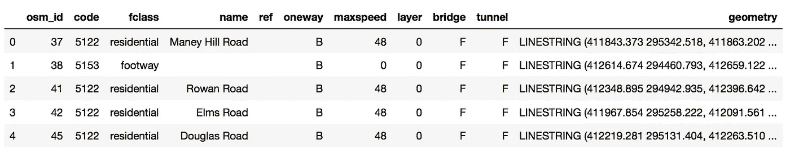
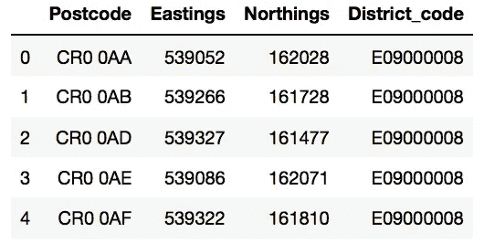
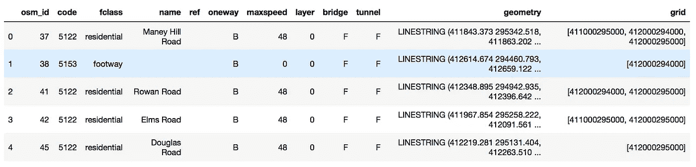
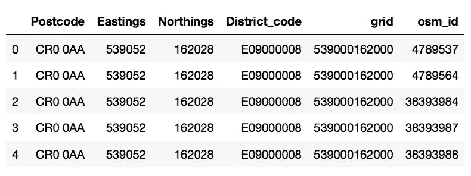
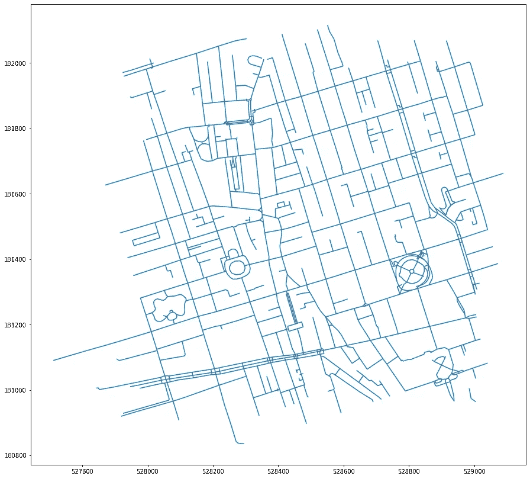

# 街道，邮政编码…都是关于瓷砖的，傻瓜。(地理空间探险续)

> 原文：<https://towardsdatascience.com/streets-postcodes-its-all-about-the-tiles-silly-geospatial-adventures-continued-8a01e3e230c3?source=collection_archive---------44----------------------->


图片由布鲁诺·马丁斯通过 Unsplash 提供

## 一个简单的过程中的道路/邮政编码匹配，以帮助您的地址匹配需求。

这篇文章扩展了我的地理空间探险系列中讨论的一些方法，并着眼于一种相对快速的方法，将英国的邮政编码质心与其邻居和附近的道路进行匹配。因此，我们将尝试在笔记本电脑上匹配 3.9 米长的道路和 1.7 米长的邮编质心…

首先，让我们先快速看一下为什么值得这么做。

我在处理商业、房地产相关数据时经常遇到的一个问题是处理方式的不一致。至少可以说，这通常意味着不同相关数据集之间的数据协调很困难，多家公司试图创建一个良好的系统来匹配它们。我不打算在这方面讲太多细节，但我想说的是，在大多数情况下，这些系统都依赖于使用某种形式的主地址列表，这种列表为它们提供了一个真实的基础来源，其他一切都与之匹配。这些地址列表中的不一致确实是个问题，尤其是在邮政编码有问题的情况下。因此，尝试将道路与附近的邮政编码进行匹配的一个很好的理由是验证您的地址列表的完整性。您可以简单地检查您的每个地址是否可信，并标记出需要进一步检查的地址(在某些情况下，甚至可以自动更正)。

你也可以用它来优化邮政编码系统，例如，提高递送效率。尽管为此你也需要添加建筑多边形。

或者你可以用它来规划你的自行车/跑步路线。我肯定还有很多很多。

我之所以使用邮政编码质心而不是它们的多边形形状，是因为我坚持使用免费的可用数据。这在一定程度上限制了精确度，但您仍然可以走得很远。

## 数据集

是时候看看数据集了。第一——英国道路网。事实上，我将坚持英格兰，但你可以很容易地将框架扩展到整个英国或其他国家。我们将使用 OSM 的数据，可以在这里找到[。下载形状文件，解压，我们在里面寻找 gis_osm_roads_free_1.shp 文件。让我们把它加载进来，快速地看一下内部(我们也把主要的导入放在这里)。](http://download.geofabrik.de/europe/great-britain.html)

```
import geopandas as gpd
import pandas as pd
import numpy as nproads = gpd.read_file(
    'england-latest-free.shp/gis_osm_roads_free_1.shp'
)
roads = roads.to_crs(epsg=27700)roads.head()
```



这里有大量非常有用的信息——街道名称、分类(A/B 号)、道路是否是单行道、速度限制、是桥梁还是隧道。“层”指的是城市中心的复杂结构，那里的道路可能一条接一条堆叠在一起。对于我们的目的来说，最重要的是 final-geometry 列，它包含描述道路位置和形状的 LineString 对象。还要注意，默认的 CRS 是 epsg:4326，所以我们还需要转换为 Northings/easting(因为我更喜欢后者，也因为邮政编码数据使用 epsg:27700)。如果你是几何对象或 GeoPandas 的新手，或者可能想重温一下 CRS 是怎么回事——看看我的地理空间冒险系列的前两篇文章[这里](https://medium.com/@datingpolygons/geospatial-adventures-step-1-shapely-e911e4f86361)和[这里](/geospatial-adventures-step-2-pandas-vs-geopandas-16e842d0e3a7)。

这里可以找到[的邮政编码数据](https://www.ordnancesurvey.co.uk/opendatadownload/products.html)。你可以从那个页面下载很多产品。我们在代码点开放之后。我正在使用它的 CSV 版本。您需要注册才能下载，并将通过电子邮件收到下载链接。它将作为一个 zip 文件夹——codepo _ GB，它本身将包含许多文件夹，我们需要遍历这些文件夹来加载整个数据集:

```
import os
ppc=[]
for f in os.listdir('codepo_gb/Data/CSV'):
    if type(pc) == list:
        pc = pd.read_csv('codepo_gb/Data/CSV/'+f, header=None)
    else:
        pc = pd.concat(
            [
                pc,
                pd.read_csv('codepo_gb/Data/CSV/' + f,
                            header=None)
            ], 
            ignore_index=True
        )
```

我在这里向 Python 纯粹主义者道歉，因为我有点作弊，只是在这里做了一个快速和肮脏的版本，所以请不要告诉任何人。不过说真的，我们所做的只是读入 csv 文件并将它们连接到我们的数据帧。理想情况下，我应该创建一个正确维度的空数据框架，而不是一个空列表，但这是 Python 的一大优点——您可以在某种程度上不受类型约束。不过，我不会在制作中这样做。

请注意，这些文件都是没有头文件的，带有头文件的文件可以在 DOC 文件夹中找到。让我们去掉那些我们不需要的，并重新命名其他的:

```
pc = pc[[0, 2, 3, 8]].rename(
    columns={
        0:'Postcode',
        2:'Eastings',
        3:'Northings',
        8:'District_code'
    }
)
pc.head()
```



## 瓷砖，瓷砖，瓷砖

现在我们已经加载了数据集，让我们来讨论一下策略。我们显然不是在寻找一个精确的匹配，没有邮政编码实际上会直接位于代表道路的线上。我们需要找到彼此相对接近的事物。理想情况下，我们还希望能够灵活地定义我们准备看多远。显而易见的强力方法是计算每个邮政编码质心和每条道路之间的距离，然后返回符合每个邮政编码(或每条道路)标准的集合。这将花费很长时间，所以更好的方法是使用磁贴，就像我们从光栅文件中提取建筑物高度的信息一样。

对于点来说，这是微不足道的，非常快。我们将使用 1km 乘 1km 的图块，因此我们所要做的就是将我们的坐标捕捉到最近的、更小的、圆形的 1km 数字(我们想要边界图块的左下角),并根据得到的坐标为我们的图块创建一个 12 位 id。一个长整数就足以识别和重建相关的图块，所以我们已经成功了一半。

```
pc['grid'] = (
    pc['Eastings'] // 1000
) * 1000000000 + (
    pc['Northings'] // 1000
) * 1000
```

道路会变得更加棘手。首先，我们将有多个瓷砖。同样，这个策略与我们以前构建多边形的策略非常相似。我们将找到每条线的边界框。将它捕捉到 1 公里的圆形标记(确保我们增加了它的大小，以免在这个过程中不小心切断了线串)，然后根据生成的边界框的大小创建网格。最后一步——我们遍历生成的网格单元，验证它们与我们的线串相交，然后将它们转换为 id，就像我们对待点一样。下面是结果函数:

```
def road_to_tiles(rd):
    bounds = rd.bounds
    X, Y = np.mgrid[
        int(
            bounds[0] // 1000 * 1000
        ): int(
            bounds[2] // 1000 * 1000
        ) + 1000 : 1000,
        int(
            bounds[1] // 1000 * 1000
        ): int(
            bounds[3] // 1000 * 1000
        ) + 1000: 1000
    ]
    grid = list(
            map(
                list,
                list(
                    zip(
                        list(
                            zip(X.flatten(), Y.flatten())
                        ),
                        list(
                            zip(X.flatten(), Y.flatten() + 1000)
                        ),
                        list(
                            zip(X.flatten() + 1000, Y.flatten() + 1000)),
                        list(
                            zip(X.flatten() + 1000, Y.flatten())
                        )
                    )
                )
            )
        )
    res=[
        a[0][0] * 1000000 + a[0][1] for a in grid if rd.intersects(Polygon(a))
    ]

    return res
```

如果这令人困惑——我在本系列的上一篇文章中一步一步地讲述了它，所以请检查一下。

接下来，我们将把它应用到我们的每一行字符串中，使用 swifter(和 swifter 下的 Dask)来加速。

```
import swifter
roads['grid'] = roads['geometry'].swifter.apply(
    lambda x: road_to_tiles(x)
)
```

在我的笔记本电脑上，这导致了 16 个分区，运行时间刚刚超过 10 分钟。

结果如下所示:

```
roads.head()
```



现在，为了将我们的邮政编码与附近的道路进行匹配，我们需要做的就是检查哪些道路属于相同的区块。

例如，如果您只关心是否在同一个图块中，而不关心确切的距离，您应该如何匹配它们:

1.  为 roads 创建一个新的 DataFrame，在这里，我们不是将每条道路的唯一记录和多个 id 存储为列表，而是将所有内容展开为简单的长数组:

```
roads_flat = pd.DataFrame(
    {
        'osm_id':np.repeat(
            np.array(roads['osm_id']),
            np.array(roads['grid'].swifter.apply(len))
        ),
        'grid': np.concatenate(roads['grid'])
    }
)
```

2.使用“网格”列合并邮政编码数据框架和我们的新 roads_flat 数据框架:

```
pc_w_roads = pd.merge(
    pc,
    roads_flat,
    on='grid',
    how='left'
)
```

瞧:

```
pc_w_roads.head():
```



如果您想查看每个邮编的道路集合，您只需按邮编对结果进行分组，然后将 osm_ids 发送至列表:

```
pc_w_roads.groupby('Postcode').agg(
    {'osm_id':list}
).reset_index().head()
```

注意-这将需要很长时间来计算，因为数据帧非常大。相反，您可能希望专门针对您要查找的邮政编码进行汇总，而不是使用一揽子方法。

以类似的方式，您可以将 OSM id 与行字符串本身或它们的名称联系起来。

例如，如果我们想对“W1S 1HN”进行聚合:

```
w1s1hn = roads[
    roads['osm_id'].isin(
        pc_w_roads[
            pc_w_roads['Postcode'] == 'W1S 1HN'
        ]['osm_id']
    )
].reset_index(drop=True)
```

让我们快速浏览一下结果集:

```
import matplotlib.pyplot as plt
%matplotlib inlinew1s1hn.plot(figsize=(15,15))
```



## 如果你想在一个特定的半径范围内拥有一些东西呢？

假设您要搜索的是您的邮政编码周围 3 公里半径内的所有道路(或者类似地，某条道路 3 公里范围内的所有邮政编码)。或者您只是希望结果以邮政编码为中心。在我们上面的例子中，“W1S 1HN”，顺便说一下，是汉诺威广场，出现在右下角。不是很有用。

最简单的方法是在你的邮政编码周围增加图块的数量，然后用它们来匹配。只需修改我们创建的 id，加上或减去 1000*1000，000 来修改东距，加上或减去 1000 来修改北距，就可以做到这一点。在每个方向上添加足够的图块以获得足够的距离，然后将数据帧与我们的 roads_flat 数据帧进行匹配。如果你想在那之后得到精确的 3 公里距离，你可以使用 shapely 的迭代结果。距离法，丢弃任何最终在 3 公里以外的东西。将所有内容缩小到一小组相关道路之后，这就成了一项非常容易管理的任务。

可以采用类似的方法来寻找最近的邻居。为此，我们可以将 pc 数据帧与其自身进行匹配，而不是与 roads 数据帧进行匹配，以识别所有落在相同图块(或相邻图块)中的邮政编码。

今天到此为止。感谢您的阅读。如果您对此感兴趣，请查看地理空间探险系列(在我的个人资料中),如果您有任何问题或有趣的用例，请告诉我。