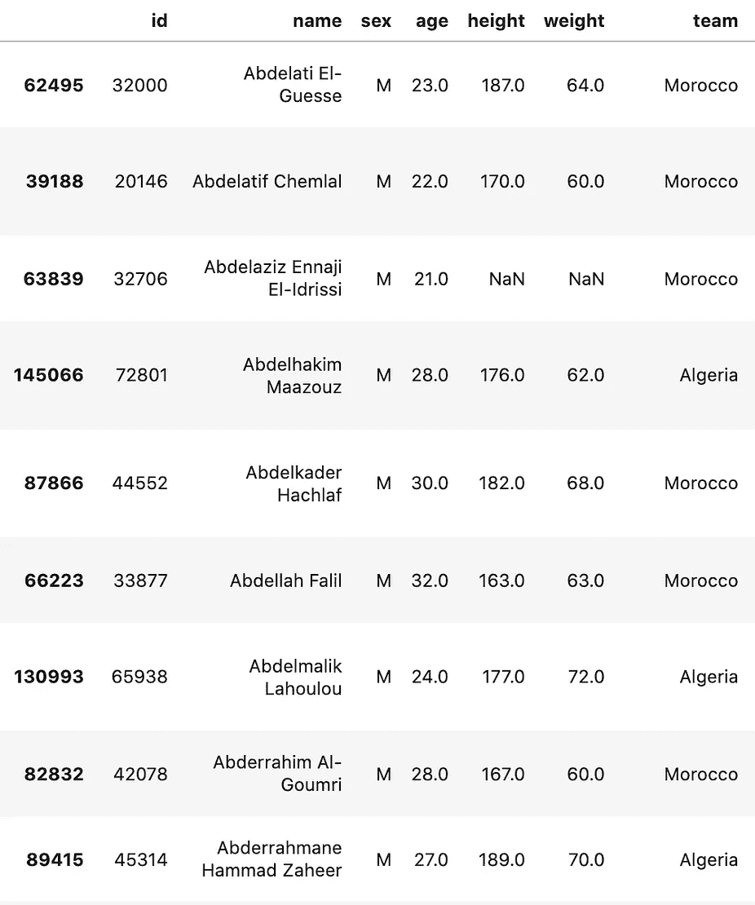

# 用 FuzzyWuzzy 进行字符串匹配

> 原文：<https://towardsdatascience.com/string-matching-with-fuzzywuzzy-e982c61f8a84?source=collection_archive---------1----------------------->

使用 FuzzyWuzzy 库匹配序列的教程


[约尔根·哈兰](https://unsplash.com/@jhaland?utm_source=unsplash&utm_medium=referral&utm_content=creditCopyText)在 [Unsplash](https://unsplash.com/s/photos/twins?utm_source=unsplash&utm_medium=referral&utm_content=creditCopyText) 上拍照

本教程将介绍如何通过相似性来匹配字符串。FuzzyWuzzy 通过提供诸如 Levenshtein 距离计算等工具，可以在数据科学过程中为您节省大量时间。除了例子之外，我还将包括一些有用的提示来充分利用 FuzzyWuzzy。

字符串匹配在各种情况下都很有用，例如，当两个表中运动员姓名的拼写或标点不同时，可以将两个表连接起来。这就是 FuzzyWuzzy 来拯救世界的时候了！Fuzzywuzzy 使用两个序列之间的某种相似性比率，并返回相似性百分比，而不是为了匹配而尝试格式化字符串。更详细的描述，请看一下 [**文档**](https://pypi.org/project/fuzzywuzzy/) 。让我们从导入必要的库开始，并查看一个简单的示例。虽然不是必需的，但是强烈推荐使用 FuzzyWuzzy 使用[**python-Levenshtein**](https://github.com/ztane/python-Levenshtein/)。它使字符串匹配过程加快了 4-10 倍，但结果可能与 [**difflib**](https://docs.python.org/3/library/difflib.html) 不同，difflib 是一个提供用于比较序列的类和函数的模块。

```
**#Installing FuzzyWuzzy**
pip install fuzzywuzzy**#Import** import fuzzywuzzy
from fuzzywuzzy import fuzz
from fuzzywuzzy import processStr_A = 'FuzzyWuzzy is a lifesaver!'
Str_B = 'fuzzy wuzzy is a LIFE SAVER.' ratio = fuzz.ratio(Str_A.lower(), Str_B.lower())
print('Similarity score: {}'.format(ratio))**#Output** Similarity score: 93
```

我们使用上面的`ratio()`函数来计算两个字符串(序列)之间的 Levenshtein 距离相似性比率。这里的相似率百分比是 93%。当两者都是小写时，我们可以说`Str_B`和`Str_A`有 93%的相似度。

## 部分比率

FuzzyWuzzy 还有更强大的函数来帮助在更复杂的情况下匹配字符串。`partial ratio()`函数允许我们执行子串匹配。这是通过获取最短的字符串并将其与所有长度相同的子字符串进行匹配来实现的。

```
Str_A = 'Chicago, Illinois' 
Str_B = 'Chicago'ratio = fuzz.partial_ratio(Str_A.lower(), Str_B.lower())
print('Similarity score: {}'.format(ratio))**#Output** Similarity score: 100
```

使用上面的`partial ratio()`函数，我们得到的相似度为 100。在`Chicago`和`Chicago, Illinois`的场景中，这很有帮助，因为两个字符串都指向同一个城市。这个函数在匹配姓名时也很有用。例如，如果一个序列是某人的名字和中间名，而您试图匹配的序列是此人的名字、中间名和姓氏。`partial_ratio()`函数将返回 100%匹配，因为这个人的名字和中间名是相同的。

## 令牌排序比率

FuzzyWuzzy 还有一些标记函数，可以标记字符串，将大写字母改为小写字母，以及删除标点符号。`token_sort_ratio()`函数按字母顺序对字符串进行排序，然后将它们连接在一起。然后，计算`fuzz.ratio()`。当您比较的字符串拼写相同，但顺序不同时，这就很方便了。让我们用另一个名字的例子。

```
Str_A = 'Gunner William Kline' 
Str_B = 'Kline, Gunner William'ratio = fuzz.token_sort_ratio(Str_A, Str_B)
print('Similarity score: {}'.format(ratio))**#Output** Similarity score: 100
```

## 令牌集比率

`token_set_ratio()`函数类似于上面的`token_sort_ratio()`函数，除了它在计算新字符串之间的`fuzz.ratio()`之前取出公共标记。当应用于一组长度差异很大的字符串时，这个函数是最有用的。

```
Str_A = 'The 3000 meter steeplechase winner, Soufiane El Bakkali' 
Str_B = 'Soufiane El Bakkali'ratio = fuzz.token_set_ratio(Str_A, Str_B)
print('Similarity score: {}'.format(ratio))**#Output** Similarity score: 100
```

## 过程模块

FuzzyWuzzy 还附带了一个方便的模块 process，它返回字符串以及字符串向量的相似性得分。你所需要做的就是在进程之后调用`extract()`函数。

```
choices = ["3000m Steeplechase", "Men's 3000 meter steeplechase",                    "3000m STEEPLECHASE MENS", "mens 3000 meter SteepleChase"] process.extract("Men's 3000 Meter Steeplechase", choices, scorer=fuzz.token_sort_ratio)**#Output** [("Men's 3000 meter steeplechase", 100),
 ('mens 3000 meter SteepleChase', 95),
 ('3000m STEEPLECHASE MENS', 85),
 ('3000m Steeplechase', 77)]
```

类似于`extract`函数，您也可以通过调用`extractOne()`函数，使用流程模块只提取一个具有最高相似性得分的字符串。

```
choices = ["3000m Steeplechase", "Men's 3000 meter steeplechase",                    "3000m STEEPLECHASE MENS", "mens 3000 meter SteepleChase"]process.extractOne("Men's 3000 Meter Steeplechase", choices, scorer=fuzz.token_sort_ratio)**#Output** ("Men's 3000 meter steeplechase", 100)
```

## 用 FuzzyWuzzy 替换字符串

看看下面的数据框，左边的`df_1`和右边的`df_2``df_1`包含了参加夏季奥运会的运动员。这个数据帧有一个`name`列，其中运动员的名字是字符串。如果我想得到这些运动员参加的项目的结果，我会把表格刮下来，放入数据框中。从那里，我可以将事件的结果与下面的数据框架(左)进行左连接。为此，我需要指定要连接值的列或索引级别。



**东风 _1(左)|东风 _2(右)(图片由作者提供)**

这里，我们遇到的问题是，第一个数据帧中的一些名称与第二个数据帧的格式不同。如果我尝试将第二个数据帧连接到 name 列的第一个数据帧，这些值将不会找到匹配，因此，这些值不会在我们需要的位置。在这里，我们可以将每个数据帧中的名称转换成一个列表，然后用 FuzzyWuzzy 创建一个函数来返回一个字典，其中包含我们需要替换的字符串，以便找到值的匹配。

```
**#Casting the name column of both dataframes into lists**df1_names = list(df_1.name.unique())
df2_names = list(df_2.name.unique()) **#Defining a function to return the match and similarity score of the fuzz.ratio() scorer. The function will take in a term(name), list of terms(list_names), and a minimum similarity score(min_score) to return the match.** def match_names(name, list_names, min_score=0):
    max_score = -1
    max_name = ''
    for x in list_names:
        score = fuzz.ratio(name, x)
        if (score > min_score) & (score > max_score):
            max_name = x
            max_score = score
    return (max_name, max_score) **#For loop to create a list of tuples with the first value being the name from the second dataframe (name to replace) and the second value from the first dataframe (string replacing the name value). Then, casting the list of tuples as a dictionary.** names = []
for x in doping_names:
    match = match_names(x, athlete_names, 75)
    if match[1] >= 75:
        name = ('(' + str(x), str(match[0]) + ')')
        names.append(name)
name_dict = dict(names)
name_dict**#Output**{'Abdelatif Chemlal': 'Abdelatif Chemlal',
 'Abdelkader Hachlaf': 'Abdelkader Hachlaf',
 'Abderrahim Goumri': 'Abderrahim Al-Goumri',
 'Abraham Kiprotich': 'Abraham Kipchirchir Rotich',
 'Abubaker Ali Kamal': 'Abubaker Ali Kamal',
 'Adil Kaouch': 'Adil El-Kaouch',
 'Adrián Annus': 'Adrin Zsolt Annus',
 'Ahmad Hazer': 'Ahmad Hazer',
 'Ahmed Faiz': 'Ahmed Ali',
 'Ahmed Mohamed Dheeb': 'Mohammed Ahmed',
 'Ak Hafiy Tajuddin Rositi': 'Ak Hafiy Tajuddin Rositi',
 'Aleksandr Bulanov': 'Aleksandar Rakovi',
 'Aleksey Lesnichiy': 'Aleksey Lesnichy',
 'Alemayehu Bezabeh': 'Alemayehu Bezabeh Desta',
 'Alemitu Bekele': 'Alemitu Bekele Degfa',
 'Alex Schwazer': 'Alex Schwazer',
 'Alicia Brown': 'Alicia Brown',
 'Alissa Kallinikou': 'Alissa Kallinikou',
 'Allison Randall': 'Allison Randall',
 'Amaka Ogoegbunam': 'Amaka Ogoegbunam',
 'Amantle Montsho': 'Amantle Montsho',
 'Amina Aït Hammou': 'Amina "Mina" At Hammou',
 'Amine Laâlou': 'Amine Lalou',
 'Anastasios Gousis': 'Anastasios "Tasos" Gousis',
 'Anastasiya Soprunova': 'Anastasiya Valeryevna Soprunova',
 'Antonio David Jiménez': 'AntonioDavid Jimnez Pentinel',
 'Anzhelika Shevchenko': 'Anzhelika Viktorivna Shevchenko}**#Using the dictionary to replace the keys with the values in the 'name' column for the second dataframe**df_2.name = df_2.name.replace(name_dict)
```

从上面的输出可以看出，当将元组列表转换为字典时，我们可以很容易地用新的字符串替换原来的字符串。这样做时，当我将数据帧连接在一起时，这些值将位于匹配的`name`上的正确位置。

```
combined_dataframe = pd.merge(df_1, df_2, how='left', on='name')
```

## 结论

这篇文章介绍了 Python 中用于字符串匹配的 FuzzyWuzzy 库。FuzzyWuzzy 有许多不同的用例，在查找字符串匹配时，它肯定能节省您的时间。我建议花些时间尝试不同的函数和方法，找到解决问题的最佳方案。非常感谢你花时间来看我的博客！

## 参考

*   *阿里亚斯，F. (2019)。Python 中的模糊字符串匹配。检索 2020 年 10 月 27 日，来自*[*https://www . data camp . com/community/tutorials/fuzzy-string-python？UTM _ source = AdWords _ PPC*](https://www.datacamp.com/community/tutorials/fuzzy-string-python?utm_source=adwords_ppc)
*   *Gitau，C. (2018 年 03 月 05 日)。Python 中的模糊字符串匹配。2020 年 10 月 27 日检索，来自*[*https://towardsdatascience . com/fuzzy-string-matching-in-python-68f 240d 910 Fe*](/fuzzy-string-matching-in-python-68f240d910fe)
*   *Fuzzywuzzy。(未注明)。检索到 2020 年 10 月 27 日，来自*[*https://pypi.org/project/fuzzywuzzy/*](https://pypi.org/project/fuzzywuzzy/)
*   *Ztane。(未注明)。Ztane/python-Levenshtein。检索到 2020 年 10 月 27 日，来自*【https://github.com/ztane/python-Levenshtein/】
*   **diff lib——计算增量的助手。(未注明)。检索到 2020 年 10 月 27 日，转自*[*https://docs.python.org/3/library/difflib.html*](https://docs.python.org/3/library/difflib.html)*