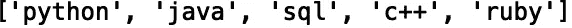
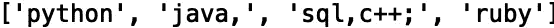
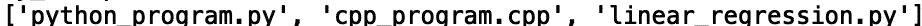

# Python 中的字符串和文本

> 原文：<https://towardsdatascience.com/strings-and-text-in-python-50be0452e0d3?source=collection_archive---------41----------------------->

## 拆分字符串和匹配文本


[来源](https://www.pexels.com/photo/abstract-black-and-white-blur-book-261763/)

文本处理在许多有用的软件程序中起着重要的作用。文本处理的应用包括网页抓取、自然语言处理、文本生成等等。在本帖中，我们将讨论一些基本的文本处理操作。具体来说，我们将讨论如何在多个分隔符上拆分字符串，以及如何将文本匹配到特定的模式。

我们开始吧！

# 使用“re.split()”拆分字符串

假设我们有一个包含几个编程语言名称的字符串:

```
my_string = 'python java sql c++ ruby'
```

我们可以使用字符串方法“split()”来分隔该字符串中的名称，并将它们存储在一个列表中:

```
print(my_string.split())
```



虽然对于这个例子很有用，但是“split()”方法主要用于非常简单的情况。它不处理具有多个分隔符的字符串，也不考虑分隔符周围可能存在的空白。例如，假设我们的字符串有几个分隔符:

```
my_string2 = 'python java, sql,c++;             ruby'
```

这可以是在抓取网站时接收文本数据的形式。让我们尝试对新字符串使用“split()”方法:

```
print(my_string2.split())
```



我们看到字符串中的“sql”和“c++”部分没有被正确分割。要解决这个问题，我们可以使用“re.split()”方法在多个分隔符上拆分字符串。让我们导入正则表达式模块“re”，并将“re.split()”方法应用于我们的字符串:

```
import re
print(re.split(r'[;,\s]\s*', my_string))
```


这非常有用，因为我们可以为分隔符指定多种模式。在我们的例子中，我们的字符串有逗号、分号和空格作为分隔符。每当发现一个模式时，整个匹配就成为位于匹配模式两侧的任何字段之间的分隔符。

让我们看另一个使用不同分隔符' | '的例子:

```
my_string3 = 'python| java, sql|c++;             ruby'
```

让我们将“re.split()”应用于新字符串:

```
print(re.split(r'[;|,\s]\s*', my_string3))
```


我们看到我们得到了想要的结果。现在，让我们讨论如何匹配文本开头和结尾的模式。

# 匹配文本

如果我们需要以编程方式检查特定文本模式的字符串的开头或结尾，我们可以使用“str.startswith()”和“str.endswith()”方法。例如，如果我们有一个指定 url 的字符串:

```
my_url = 'http://kaggle.com'
```

我们可以使用“str.startswith()”方法来检查我们的字符串是否以指定的模式开头:

```
print(my_url.startswith('http:'))
```


```
print(my_url.startswith('www.'))
```


或者我们可以检查它是否以特定的模式结束:

```
print(my_url.endswith('com'))
```


```
print(my_url.endswith('org'))
```


一个更实际的例子是，如果我们需要以编程方式检查目录中的文件扩展名。假设我们有一个包含不同扩展名的文件的目录:

```
my_directory = ['python_program.py', 'cpp_program.cpp', 'linear_regression.py', 'text.txt', 'data.csv']
```

我们可以使用“str.endswith()”方法检查多个文件扩展名。我们只需要传递一组扩展值。让我们使用 list comprehension 和' str.endswith()'方法来过滤我们的列表，使它只包含'。cpp '和'。“py”文件:

```
my_scripts = [script for script in my_directory if script.endswith(('.py', '.cpp'))]
print(my_scripts)
```



我就讲到这里，但是我鼓励你自己去研究代码。

# 结论

总之，在这篇文章中，我们讨论了如何使用“re.split()”方法沿着多个分隔符拆分字符串。我们还展示了如何使用“str.startswith()”和“str.endswith()”方法来检查特定文本模式的字符串的开头和结尾。我希望你觉得这篇文章有用/有趣。这篇文章的代码可以在 GitHub 上找到。感谢您的阅读！