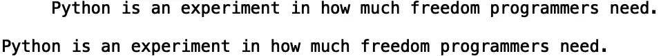
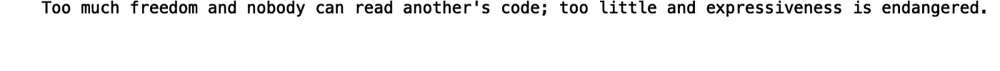
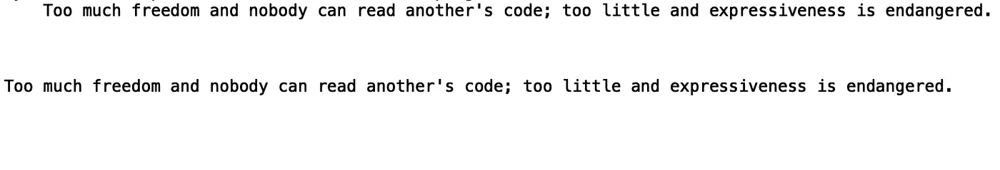
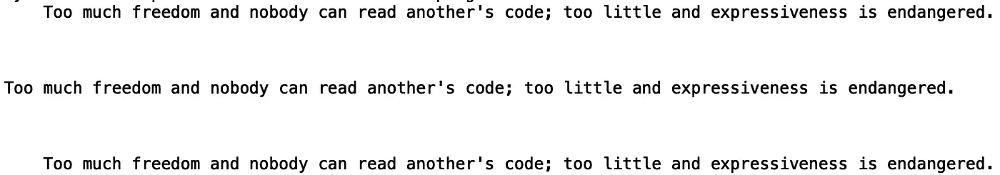
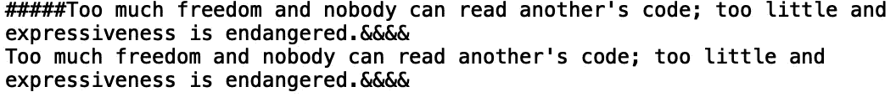
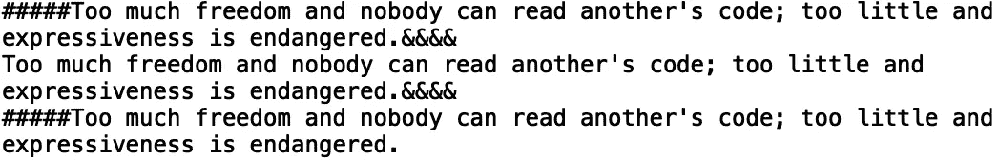
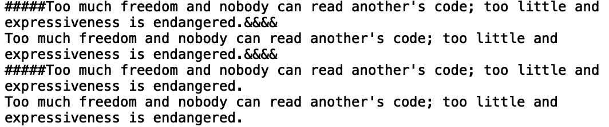
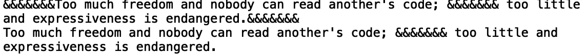
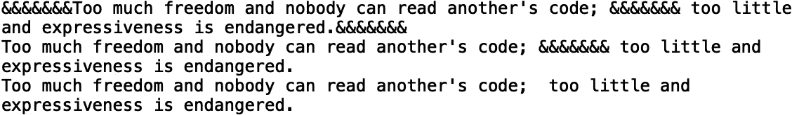

# 在 Python 中剥离字符串

> 原文：<https://towardsdatascience.com/stripping-python-strings-6635cbc1b501?source=collection_archive---------34----------------------->

## 探索 Python 字符串方法


[来源](https://www.pexels.com/photo/shallow-focus-photography-of-keychains-1194036/)

在计算机科学中，字符串数据类型是由一系列字符定义的。字符串通常由字符、单词、句子和/或数字信息组成。在 python 中，字符串对象可以访问几个方法，这些方法支持文本剥离、清理、搜索等操作。对这些方法有一个很好的理解是任何数据科学家的自然语言处理工具包的基础。在本帖中，我们将讨论如何使用 strip 方法来移除不需要的字符和文本，strip 方法可用于 python 中的字符串对象。

我们开始吧！

假设我们想从一个字符串的开头、结尾或起点删除不想要的字符，比如空格，甚至是损坏的文本。让我们定义一个带有多余空格的示例字符串。我们将引用 python 编程语言的作者吉多·范·罗苏姆的一段话:

```
string1 = '     Python is an experiment in how much freedom programmers need. \n'
```

我们可以使用' strip()'方法删除不需要的空白和新行，' \n '。让我们在应用“strip()”方法之前和之后打印:

```
print(string1)
print(string1.strip())
```



如果我们只想去掉字符串开头不需要的字符，我们可以使用' lstrip()'。让我们来看看 Guido 的另一首弦乐:

```
string2 = "    Too much freedom and nobody can read another's code; too little and expressiveness is endangered. \n\n\n" 
```



让我们使用' lstrip()'来删除左边不需要的空白:

```
print(string2)
print(string2.lstrip())
```



我们还可以使用“rstrip()”删除右边的新行:

```
print(string2)
print(string2.lstrip())
print(string2.rstrip())
```



我们看到在最后一个字符串中，三个新行被删除了。我们也可以用这些方法去掉不想要的字符。考虑以下包含不需要的' # '和' & '字符的字符串:

```
string3 = "#####Too much freedom and nobody can read another's code; too little and expressiveness is endangered.&&&&"
```

如果我们想删除字符串左边的' # '字符，我们可以使用' lstrip()':

```
print(string3)
print(string3.lstrip('#'))
```



我们还可以使用' rstrip()'删除' & '字符:

```
print(string3)
print(string3.lstrip('#'))
print(string3.rstrip('&'))
```



我们可以使用' strip()'方法去掉这两个字符:

```
print(string3)
print(string3.lstrip('#'))
print(string3.rstrip('&'))
print(string3.strip('#&'))
```



值得注意的是，strip 方法不适用于字符串中间的任何文本。考虑以下字符串:

```
string4 = "&&&&&&&Too much freedom and nobody can read another's code; &&&&&&& too little and expressiveness is endangered.&&&&&&&"
```

如果我们应用' srtip()'方法，将' & '作为我们的参数传入，它将只移除它们的左边和右边:

```
print(string4)
print(string4.strip('&'))
```



我们看到不需要的' & '仍然在字符串的中间。如果我们想删除文本中间不需要的字符，我们可以使用' replace()'方法:

```
print(string4)
print(string4.replace('&', ''))
```



我就讲到这里，但是我鼓励你自己去研究代码。

## 结论

总之，在这篇文章中，我们讨论了如何在 python 中从字符串中删除不需要的文本和字符。我们展示了如何使用' lstrip()'和' rstrip()'分别删除字符串左边和右边不需要的字符。我们还展示了如何使用“strip()”删除左侧或右侧的多个不需要的字符。最后，我们展示了如何使用“replace()”方法删除字符串中间不需要的文本。我希望你觉得这篇文章有用/有趣。这篇文章中的代码可以在 [GitHub](https://github.com/spierre91/medium_code/blob/master/basic_python/stripping_strings.py) 上找到。感谢您的阅读！