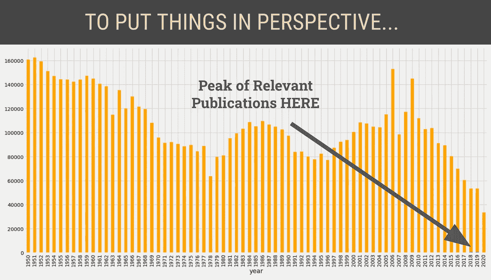

# 透过《纽约时报》的镜头看强势女性

> 原文：<https://towardsdatascience.com/strong-women-through-the-lens-of-the-new-york-times-f7f7468a2645?source=collection_archive---------35----------------------->

## Python 中的 API 数据收集和文本分析

## 历史版画中的性别平等与表现研究


照片由[贾科莫·费乐理](https://unsplash.com/@giaferroni?utm_source=unsplash&utm_medium=referral&utm_content=creditCopyText)在 [Unsplash](https://unsplash.com/s/photos/suffragette?utm_source=unsplash&utm_medium=referral&utm_content=creditCopyText) 上拍摄

这个项目的**目标是通过情感分析、频繁术语可视化和主题建模的方式，调查过去 70 年间纽约时报中女性的代表性。**

为了这次调查，我通过纽约时报开发者门户的[归档 API](https://developer.nytimes.com/docs/archive-product/1/overview) 搜集了纽约时报的数据。首先，你必须在这里获得 API 密匙。免费的！NYT 只是喜欢调节防洪闸门的概念。由于这种类型的 API 适合批量数据收集，它不允许有效的预先过滤。如果您希望重新创建实验，请遵循 Github 上发布的 Jupyter [笔记本](https://github.com/sasha-talks-tech/New-York-Times)中的说明。如果你喜欢这篇文章的视频版本，你可以点击进入[。](https://www.youtube.com/watch?v=rK-9t1IS0A4&feature=youtu.be)


分析管道。图片作者。弗里皮克的图标。

所有的指令、代码笔记本和结果也可以通过[GitHub 上的](https://github.com/sasha-talks-tech/New-York-Times) [my project repository](https://github.com/sasha-talks-tech/New-York-Times) 进行访问，以实现更流畅的复制。

## 通过归档 API 收集数据，并使用 SpaCy 和 Gensim 进行主题建模

在我进一步进行分析之前，我决定对 2019 年 1 月至 2020 年 9 月期间《纽约时报》的大部分文章运行**主题建模**，以分析标题、关键词和前导段落。我的目标是区分最普遍的问题和持久的话题，以确保我的研究符合 NYT 的使命宣言，我没有歪曲他们的新闻风格。

这部分分析的数据收集蓝图受到了[布蕾娜·赫罗尔德](https://towardsdatascience.com/@brienna)的[教程](/collecting-data-from-the-new-york-times-over-any-period-of-time-3e365504004)的启发。

让我们导入必要的工具和库:

```
**import** **os**
**import** **pandas** **as** **pd**
**import** **requests**
**import** **json**
**import** **time**
**import** **dateutil**
**import** **datetime**
**from** **dateutil.relativedelta** **import** relativedelta
**import** **glob**
```

确定分析的时间框架:

```
end = datetime.date.today()
start = datetime.date(2019, 1, 1)
print('Start date: ' + str(start))
print('End date: ' + str(end))
```

将数据按月分组:

```
months_in_range = [x.split(' ') **for** x **in** pd.date_range(start, end, freq='MS').strftime("%Y %-m").tolist()]
```

下面一组**辅助函数**(参见[教程](/collecting-data-from-the-new-york-times-over-any-period-of-time-3e365504004))通过 API 提取 NYT 数据，并保存到特定的 csv 文件中:

```
**def** send_request(date):
    *'''Sends a request to the NYT Archive API for given date.'''*
    base_url = 'https://api.nytimes.com/svc/archive/v1/'
    url = base_url + '/' + date[0] + '/' + date[1] + '.json?api-key=' + 'F9FPP1mJjiX8pAEFAxBYBg08vZECa39n'
    **try**:
        response = requests.get(url, verify=**False**).json()
    **except** **Exception**:
        **return** **None**
    time.sleep(6)
    **return** response

**def** is_valid(article, date):
    *'''An article is only worth checking if it is in range, and has a headline.'''*
    is_in_range = date > start **and** date < end
    has_headline = type(article['headline']) == dict **and** 'main' **in** article['headline'].keys()
    **return** is_in_range **and** has_headline

**def** parse_response(response):
    *'''Parses and returns response as pandas data frame.'''*
    data = {'headline': [],  
        'date': [], 
        'doc_type': [],
        'material_type': [],
        'section': [],
        'keywords': [],
        'lead_paragraph': []}

    articles = response['response']['docs'] 
    **for** article **in** articles: *# For each article, make sure it falls within our date range*
        date = dateutil.parser.parse(article['pub_date']).date()
        **if** is_valid(article, date):
            data['date'].append(date)
            data['headline'].append(article['headline']['main']) 
            **if** 'section' **in** article:
                data['section'].append(article['section_name'])
            **else**:
                data['section'].append(**None**)
            data['doc_type'].append(article['document_type'])
            **if** 'type_of_material' **in** article: 
                data['material_type'].append(article['type_of_material'])
            **else**:
                data['material_type'].append(**None**)
            keywords = [keyword['value'] **for** keyword **in** article['keywords'] **if** keyword['name'] == 'subject']
            data['keywords'].append(keywords)
            **if** 'lead_paragraph' **in** article:
                data['lead_paragraph'].append(article['lead_paragraph'])
            **else**:
                data['lead_paragraph'].append(**None**)
    **return** pd.DataFrame(data) 

**def** get_data(dates):
    *'''Sends and parses request/response to/from NYT Archive API for given dates.'''*
    total = 0
    print('Date range: ' + str(dates[0]) + ' to ' + str(dates[-1]))
    **if** **not** os.path.exists('headlines'):
        os.mkdir('headlines')
    **for** date **in** dates:
        print('Working on ' + str(date) + '...')
        csv_path = 'headlines/' + date[0] + '-' + date[1] + '.csv'
        **if** **not** os.path.exists(csv_path): *# If we don't already have this month* 
            response = send_request(date)
            **if** response **is** **not** **None**:
                df = parse_response(response)
                total += len(df)
                df.to_csv(csv_path, index=**False**)
                print('Saving ' + csv_path + '...')
    print('Number of articles collected: ' + str(total))
```

让我们仔细看看助手函数:

*   **send_request(date)** 在给定的*日期*将请求发送到存档中，转换成 json 格式，返回*响应。*
*   **is_valid(article，date)** 检查文章是否在请求的时间范围内，确认标题的存在，并返回 *is_in_range* 和 *has_headline* 结论。
*   **parse _ response(response)**将响应转换成数据帧。 *data* 是一个字典，它包含我们的数据帧的列，这些列最初是空的，但是会被这个函数追加。该函数返回最终的*数据帧*。
*   **get_data(dates)** ，其中*date*对应于用户指定的范围，利用 *send_request()* 和 *parse_response()* 函数。将*标题*和其他信息保存到。csv 文件，范围内每年每月一个文件。

一旦我们获得了该范围内每年的每月 csv 文件，我们就可以将它们连接起来供将来使用。glob 库是一个很好的工具。确保到 *headlines* 文件夹的路径与代码中的路径匹配。我使用了相对路径，而不是我的绝对路径。

```
*# get data file names*
path = "headlines/"
filenames = glob.glob("*.csv")

dfs = []
print(filenames)
**for** filename **in** filenames:
    dfs.append(pd.read_csv(filename))

*# Concatenate all data into one DataFrame*
big_frame = pd.concat(dfs, ignore_index=**True**)
```

*big_frame* 是一个数据帧，它将标题文件夹中的所有文件连接成一个帧。这是预期的输出:


拉了 135954 篇文章及其数据。

现在，我们为**主题建模**做好准备。以下分析的目的是对过去一年半《纽约时报》文章的标题、关键词和前导段落进行主题建模。我想确保标题与介绍性段落和关键词一致。

导入工具和库:

```
**from** **collections** **import** defaultdict  
**import** **re**, **string   #regular expressions**
**from** **gensim** **import** corpora # this is the topic modeling library
**from** **gensim.models** **import** LdaModel
```

让我们仔细看看:

*   [*defaultdict*](https://www.geeksforgeeks.org/defaultdict-in-python/) 用于统计唯一单词及其出现的次数。
*   *re* 和 *string* 在我们寻找文本中的匹配时很有用，无论是完整的还是模糊的。如果你对文本分析感兴趣，正则表达式会经常出现；这里有一个方便的[工具](https://regex101.com/)来练习这些。
*   [*gensim*](https://radimrehurek.com/gensim/) 是我们要用来做主题建模的库。一旦你把必要的[依赖关系](https://www.tutorialspoint.com/gensim/gensim_getting_started.htm)整理出来，它就是用户友好的。

因为我们正在查看数据帧的三个不同列，所以将实例化语料库的三个不同实例:保存标题的语料库、关键字的语料库和引导段落的语料库。这意味着是一个健全的检查，以确保标题和关键字和引导段落与文章的内容一致。

```
big_frame_corpus_headline = big_frame['headline']
big_frame_corpus_keywords = big_frame['keywords']
big_frame_corpus_lead = big_frame['lead_paragraph']
```

为了使文本数据可用，需要对其进行预处理。一般来说，它看起来像这样:小写和标点符号删除，词干，词汇化和标记化，然后停用词删除和矢量化。前四个操作显示为一个群集，因为这些操作的顺序通常取决于数据，在某些情况下，交换操作的顺序可能是有意义的。


文本预处理步骤。图片作者。Freepik 的图标

先说预处理。

```
**from** **nltk.corpus** **import** stopwordsheadlines = [re.sub(r'[^\w\s]','',str(item)) **for** item **in** big_frame_corpus_headline]keywords = [re.sub(r'[^\w\s]','',str(item)) **for** item **in** big_frame_corpus_keywords]lead = [re.sub(r'[^\w\s]','',str(item)) **for** item **in** big_frame_corpus_lead]stopwords = set(stopwords.words('english')) 
# please note: you can append to this list of pre-defined stopwords if needed
```

更多预处理:

```
headline_texts = [[word **for** word **in** document.lower().split() **if** word **not** **in** stopwords] **for** document **in** headlines]keywords_texts = [[word for word in document.lower().split() if word not in stopwords] for document in keywords]lead_texts = [[word for word in document.lower().split() if word not in stopwords] for document in lead]
```

删除不常用的单词:

```
frequency = defaultdict(int)
for headline_text in headline_texts:
    for token in headline_text:
         frequency[token] += 1
for keywords_text in keywords_texts:
    for token in keywords_text:
         frequency[token] += 1
for lead_text in lead_texts:
    for token in lead_text:
         frequency[token] += 1

headline_texts = [[token for token in headline_text if frequency[token] > 1] for headline_text in headline_texts]
keywords_texts = [[token for token in keywords_text if frequency[token] > 1] for keywords_text in keywords_texts]
lead_texts = [[token for token in lead_text if frequency[token] > 1] for lead_text in lead_texts]dictionary_headline = corpora.Dictionary(headline_texts)
dictionary_keywords = corpora.Dictionary(keywords_texts)
dictionary_lead = corpora.Dictionary(lead_texts)headline_corpus = [dictionary.doc2bow(headline_text) for headline_text in headline_texts]
keywords_corpus = [dictionary.doc2bow(keywords_text) for keywords_text in keywords_texts]
lead_corpus = [dictionary.doc2bow(lead_text) for lead_text in lead_texts]
```

让我们决定我们案例的最佳主题数量:

```
NUM_TOPICS = 5  
ldamodel_headlines = LdaModel(headline_corpus, num_topics = NUM_TOPICS, id2word=dictionary, passes=12)
ldamodel_keywords = LdaModel(keywords_corpus, num_topics = NUM_TOPICS, id2word=dictionary, passes=12)
ldamodel_lead = LdaModel(lead_corpus, num_topics = NUM_TOPICS, id2word=dictionary, passes=12)
```

结果如下:

```
topics_headlines = ldamodel_headlines.show_topics()
for topic_headlines in topics_headlines:
    print(topic_headlines)topics_keywords = ldamodel_keywords.show_topics()
for topic_keywords in topics_keywords:
    print(topic_keywords)topics_lead = ldamodel_lead.show_topics()
for topic_lead in topics_lead:
    print(topic_lead)
```

让我们将它们组织成数据帧:

```
word_dict_headlines = {};for i in range(NUM_TOPICS):
    words_headlines = ldamodel_headlines.show_topic(i, topn = 20)
    word_dict_headlines['Topic # ' + '{:02d}'.format(i+1)] = [i[0] for i in words_headlines]
pd.DataFrame(word_dict_headlines)for i in range(NUM_TOPICS):
    words_keywords = ldamodel_keywords.show_topic(i, topn = 20)
    word_dict_keywords['Topic # ' + '{:02d}'.format(i+1)] = [i[0] for i in words_keywords]
pd.DataFrame(word_dict_keywords)for i in range(NUM_TOPICS):
    words_lead  = ldamodel_lead.show_topic(i, topn = 20)
    word_dict_lead ['Topic # ' + '{:02d}'.format(i+1)] = [i[0] for i in words_lead]
pd.DataFrame(word_dict_lead)
```

请记住:即使算法可以将单词分类到相应的主题中，仍然要靠人类来解释和标记它们。


话题建模结果。图片作者。弗里皮克的图标。

出现了各种各样的话题。它们在我们的社会中都是非常严肃和重要的。在这项特殊的研究中，我们将调查性别表征。

## 1950 年至今:数据收集和关键词分析。

我们将使用前面提到的助手函数来获取从 1950 年 1 月 1 日到现在(即 2020 年 9 月)的数据。我建议使用较小的时间增量，例如十年，以防止 API 超时。

数据将被收集到 *headlines.csv* 中，然后使用上述方法连接成一个数据帧。一旦你得到了你辛辛苦苦得到的数据框架，我建议把它腌制一下以备后用:

```
import pickle
with open('frame_all.pickle', 'wb') as to_write:
    pickle.dump(frame, to_write)
```

以下是您提取腌制文件的方法:

```
with open('frame_all.pickle', 'rb') as read_file:
    df = pickle.load(read_file)
```


发现的文章总数与 70 年时间范围内的相关文章。图片作者。Slidesgo 模板。

让我们将日期列转换成*日期时间*格式，这样就可以按时间顺序对文章进行排序。我们也将删除空值和重复。

```
df['date'] = pd.to_datetime(df['date'])df = df[df['headline'].notna()].drop_duplicates().sort_values(by='date')df.dropna(axis=0, subset=['keywords'], inplace = True)
```

查看**相关关键词**:

```
import ast
df.keywords = df.keywords.astype(str).str.lower().transform(ast.literal_eval)keyword_counts = pd.Series(x for l in df['keywords'] for x in l).value_counts(ascending=False)len(keyword_counts)
```

**58298**唯一关键字。

我用自己的个人判断来确定哪些关键词与强势女性及其代表性的话题相关:政治、社会活动、企业家精神、科学、技术、军事成就、体育突破和女性领导力。这种分析绝不意味着将任何群体或个人排除在女强人的概念之外。我乐于接受补充和建议，所以请不要犹豫，如果你认为有什么事情可以做，使这个项目更加全面。快速提醒如果您发现单元格中的代码由于格式问题难以复制，请参考我的项目[资源库](https://github.com/sasha-talks-tech/New-York-Times)中的代码和说明。

```
project_keywords1 = [x for x in keyword_counts.keys() if 'women in politics' in x 
                 or 'businesswoman' in x  
                 or 'female executive' in x 
                 or 'female leader' in x 
                 or 'female leadership' in x 
                 or 'successful woman' in x 
                 or 'female entrepreneur' in x
                 or 'woman entrepreneur' in x 
                 or 'women in tech' in x 
                 or 'female technology' in x 
                 or 'female startup' in x 
                 or 'female founder' in x ]
```

上面是一个相关关键字的示例查询。关于相关关键词搜索和文章标题提取的更详细说明可以在[本笔记本](https://github.com/sasha-talks-tech/New-York-Times/blob/master/project5_data_analysis.ipynb)中找到。

现在，让我们来看看与从政女性有关的头条新闻。

首先，我们通过小写来规范化它们:

```
df['headline'] = df['headline'].astype(str).str.lower()
```

检查包含诸如女性、政治和权力等词汇的标题:

```
wip_headlines = df[df['headline'].str.contains(('women' or 'woman' or 'female')) & df['headline'].str.contains(('politics' or 'power' or 'election'))]
```

‘WIP’代表‘从政的妇女’。

我们的搜索只返回了 185 个标题。让我们看看关键字来补充这一点。

```
df['keywords'].dropna()
df['keywords_joined'] = df.keywords.apply(', '.join)
df['keywords_joined'] = df['keywords_joined'].astype(str)
import re
wip_keywords = df[df['keywords_joined'].str.contains(r'(?=.*women)(?=.*politics)',regex=True)]
```


妇女参政:结果数据框架

上面的数据框架包含了基于相关关键词的 2579 篇文章。我们将对关键字和标题数据帧执行外部连接，以获得更全面的数据:

```
wip_df = pd.concat([wip_headlines, wip_keywords], axis=0, sort = True)
```

利用同样的技术，我们将能够获得更多关于女性在军事、科学、体育、创业和其他领域成就的数据。例如，如果我们要寻找关于女权主义的文章:

```
feminist_keywords = df[df['keywords_joined'].str.contains(r'(?=.*women)(?=.*feminist)',regex=True)]
```


基于关键词搜索的文章:女权主义

#metoo 机芯:

```
metoo_keywords = df[df['keywords_joined'].str.contains(r'(?=.*women)(?=.*metoo)(?=.*movement)',regex=True)]
```

正则表达式和模糊匹配允许几乎无限的可能性。您可以在本笔记本中查看更多查询。

所有查询完成后，最终的数据框架将在 GitHub 和本文的代码笔记中被进一步称为 *project_df* 。

我们来看一下**历年文章分布**:

```
ax = df.groupby(df.date.dt.year['headline'].count().plot(kind='bar', figsize=(20, 6))
ax.set(xlabel='Year', ylabel='Number of Articles')
ax.yaxis.set_tick_params(labelsize='large')
ax.xaxis.label.set_size(18)
ax.yaxis.label.set_size(18)
ax.set_title('Total Published Every Year', fontdict={'fontsize': 24, 'fontweight': 'medium'})
plt.show()
```


```
ax = project_df.groupby('year')['headline'].count().plot(kind='bar', figsize=(20, 6))
ax.set(xlabel='Year', ylabel='Number of Articles')
ax.yaxis.set_tick_params(labelsize='large')
ax.xaxis.label.set_size(18)
ax.yaxis.label.set_size(18)
ax.set_title('Articles About Strong Women (based on relevant keywords) Published Every Year', \
             fontdict={'fontsize': 20, 'fontweight': 'medium'})
plt.show()
```


如果我们把这两张图叠加起来，蓝色的几乎消失了:



与随着时间的推移而发表的大量文章相比，基于关键词和标题的相关出版物几乎是不可见的。

对妇女问题的报道似乎不多。我认为这可能是由于这些关键字并不总是正确编码的事实:有些不是丢失了就是误导了，因此使得研究人员更难通过 Archive API 找到想要的资料。

通过我的分析，我有了一个**有趣的发现**。根据对 n-grams 的分析，在 20 世纪 50 年代初，多次提到妇女的职业机会。他们中的许多人从大学毕业成为医生，以便加入海军。我把这种宣传的激增归因于第二次世界大战的后果:妇女被鼓励加入劳动大军，以补充军队的努力。还记得铆钉工罗西的海报吗？


这些剪报是通过 NYT 出版物档案馆获得的。作者利用这些剪报创作了这幅图像。

尽管在那个没有太多机会向女性敞开的时代，看到女性可以获得这样的机会令人温暖和振奋，但我真的希望这不是因为战争。

## N-grams，WordCloud 和情感分析。

要了解标题中的总体术语频率:

```
from sklearn.feature_extraction.text import CountVectorizerword_vectorizer = CountVectorizer(ngram_range=(1,3), analyzer='word')
sparse_matrix = word_vectorizer.fit_transform(corpus)
frequencies = sum(sparse_matrix).toarray()[0]
ngram_df_project = pd.DataFrame(frequencies, index=word_vectorizer.get_feature_names(), columns=['frequency'])from wordcloud import WordCloud, STOPWORDS
all_headlines = ' '.join(project_df['headline'].str.lower())stopwords = STOPWORDS
stopwords.add('will')
# Note: you can append your own stopwords to the existing ones.wordcloud = WordCloud(stopwords=stopwords, background_color="white", max_words=1000, width = 480, height = 480).\
generate(all_headlines)plt.figure(figsize=(20,10))
plt.imshow(wordcloud)
plt.axis("off");
```


上面的代码创建的 WordCloud:最常用的术语以更大的字体显示。

我们还可以根据各种时间框架或特定关键字等特征创建单词云。参考[笔记本](https://github.com/sasha-talks-tech/New-York-Times/blob/master/project5_data_analysis.ipynb)获取更多视觉效果。

先说**情绪分析**。我们将使用 [NLTK 的 Vader 库](https://www.nltk.org/_modules/nltk/sentiment/vader.html)来分析与标题相关联的**情感** **。我们真的能在写文章的时候了解记者们对某个问题的感受吗？**

```
import nltk 
nltk.download('vader_lexicon')from nltk.sentiment.vader import SentimentIntensityAnalyzer as SIAsia = SIA()
results = []for line in project_df.headline:
    pol_score = sia.polarity_scores(line)
    pol_score['headline'] = line
    results.append(pol_score)print(results[:3])
```

输出:

```
[{'neg': 0.0, 'neu': 0.845, 'pos': 0.155, 'compound': 0.296, 'headline': 'women doctors join navy; seventeen end their training and are ordered to duty'}, {'neg': 0.18, 'neu': 0.691, 'pos': 0.129, 'compound': -0.2732, 'headline': 'n.y.u. to graduate 21 women doctors; war gave them, as others, an opportunity to enter a medical school'}, {'neg': 0.159, 'neu': 0.725, 'pos': 0.116, 'compound': -0.1531, 'headline': 'greets women doctors; dean says new york medical college has no curbs'}]
```

作为数据框架的情感:

```
sentiment_df = pd.DataFrame.from_records(results)
```


```
dates = project_df['year']
sentiment_df = pd.merge(sentiment_df, dates, left_index=True, right_index=True)
```

上面的代码允许我们为自己的情绪设定一个时间表。为了简化情感分析，我们将为积极、消极和中立创建一些新的类别。

```
sentiment_df['label'] = 0
sentiment_df.loc[sentiment_df['compound'] > 0.2, 'label'] = 1
sentiment_df.loc[sentiment_df['compound'] < -0.2, 'label'] = -1
sentiment_df.head()
```

要可视化整体情绪分布:

```
sentiment_df.label.value_counts(normalize=True) * 100
```


图片作者。Slidesgo 模板。

要可视化情绪随时间的变化:

```
sns.lineplot(x="year", y="label", data=sentiment_df) 
plt.show()
```


由于问题的复杂性，情绪波动很大

如你所见，情绪波动。这一点都不意外，因为女性问题通常包含沉重的主题，如暴力和虐待。在这些情况下，我们预计市场情绪会偏向负面。

我创建了一个 [**Tableau 仪表板**](https://public.tableau.com/profile/alexandra.prokhorova#!/vizhome/NYT_16003912659750/Dashboard1) ，观众可以在那里与可视化互动。可通过[我的 Tableau 公众号](https://public.tableau.com/profile/alexandra.prokhorova#!/)获取。这个仪表板展示了几十年来关键词的分布情况。


图片作者。

## 结论

多年来,《纽约时报》在性别平等代表性方面取得了显著进步。如果让我提一个建议，我会推荐增加关键词列表。当我们进一步探究存档 API 的过去时，更全面、更强大的关键字会有助于搜索。

重要的是继续展示*女性领导力*，直到它变成*正义领导力*。想象一下这个世界，不再需要形容词“女性”来描述成就，因为它变得多余了。想象一下这个世界，没有“女医生”或“女工程师”:只有医生和工程师。创始人和政治家。企业家、科学家和开拓者。作为一个社团，我们的目标是为不同群体持有的这些头衔建立一个坚实的心智模型。通过不断提醒我们自己和我们周围的社会，任何性别或国籍都不能被排除在这些机会之外，我们可以共同实现这一目标。