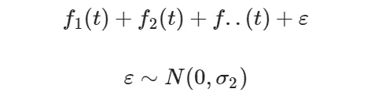
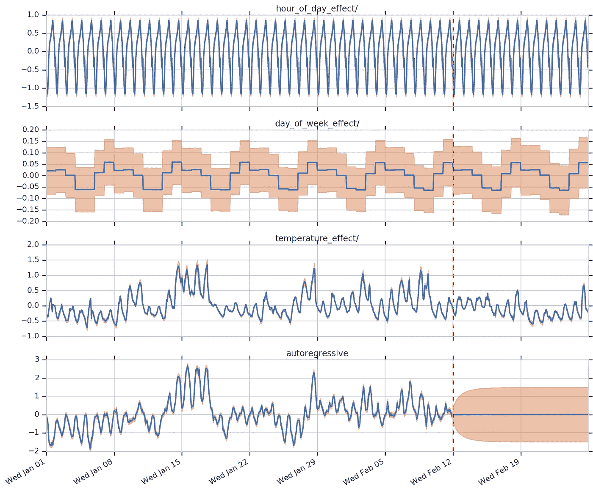
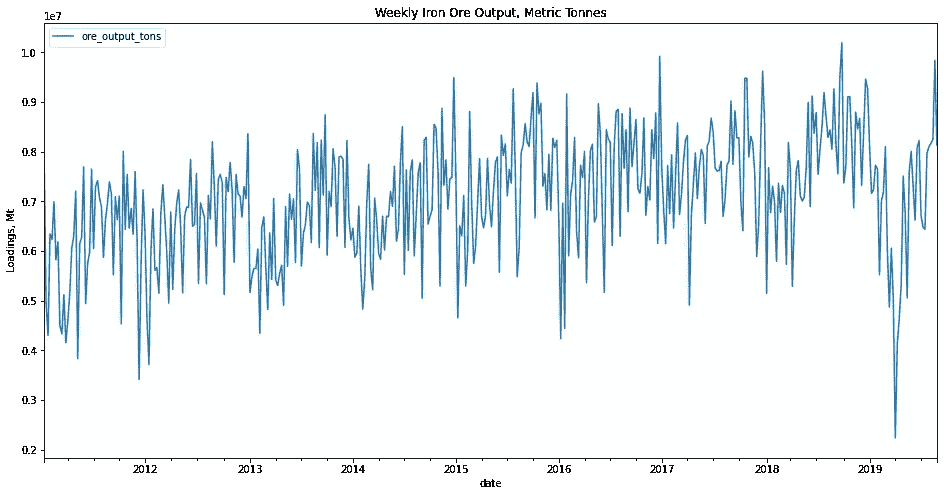
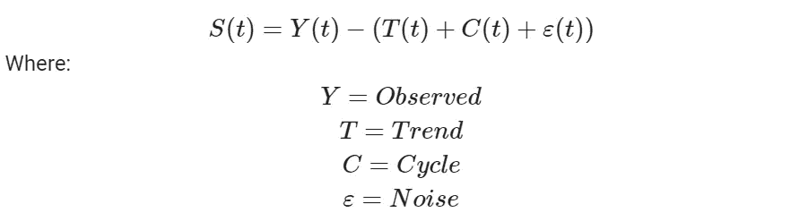
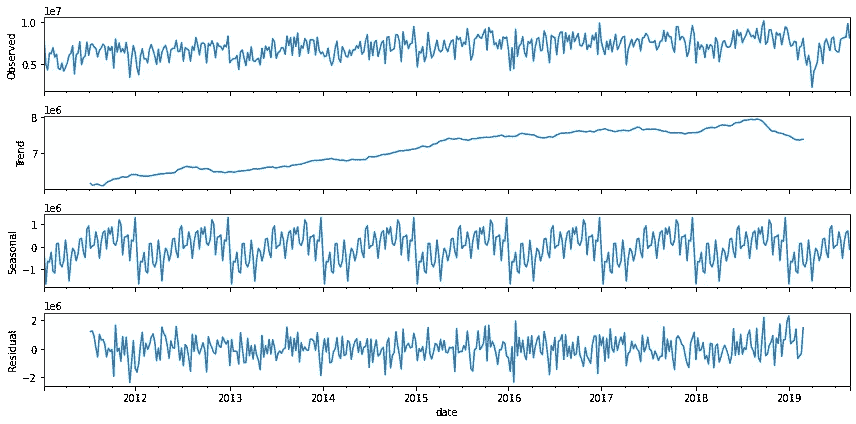
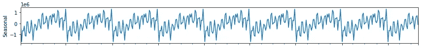
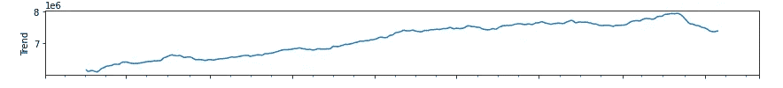
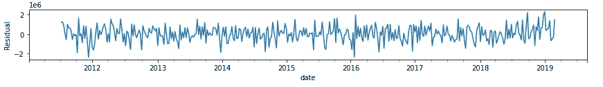
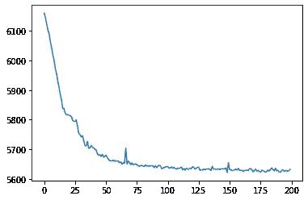
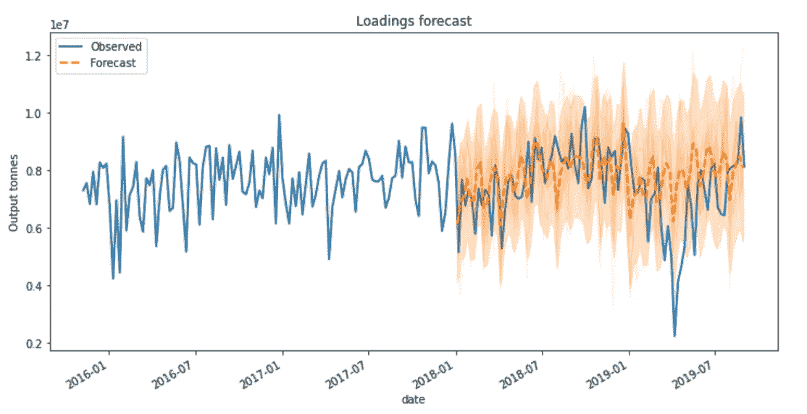

# 基于张量流概率的结构时间序列预测:铁矿产量

> 原文：<https://towardsdatascience.com/structural-time-series-forecasting-with-tensorflow-probability-iron-ore-mine-production-897d2334c72b?source=collection_archive---------9----------------------->

## 张量流概率结构时间序列的贝叶斯结构时间序列预测


图片:[https://unsplash.com/photos/-subrrYxv8A](https://unsplash.com/photos/-subrrYxv8A)

# 介绍

I[Ron 矿石](https://www.spglobal.com/platts/en/our-methodology/price-assessments/metals/iodex-iron-ore-metals-price-assessment) 是世界上[交易量最大的商品](https://www.ig.com/en/trading-opportunities/top-10-most-traded-commodities-180905)之一。作为钢铁生产的主要投入，它为全球最大的金属市场的交易提供了基础，并在全球干散货贸易中占据最大份额。

不出所料，铁矿石生产始于矿山。作为实物或金融交易商，了解铁矿石市场的基本供需性质至关重要。铁矿石等级(质量)差异不仅对现货和远期合约定价有显著影响，而且对工厂的杂质罚款也有显著影响。基本供求关系的失衡可能导致铁矿石价格大幅上涨。**预测最大铁矿石出口国的铁矿石产量**以便预测全球铁矿石供应，这在投机现货、期货和污染物罚款价格变动时非常有用。

# 问题

在本文中，我们将使用 [TensorFlow Probability 的结构时间序列](https://www.tensorflow.org/probability/api_docs/python/tfp/sts) (STS)框架开发一个预测模型，以预测巴西主要铁矿的总产量。

巴西是全球第二大铁矿石出口国。如上所述，巴西供应的重大变化会对铁矿石价格产生影响。此外，巴西铁矿石通常品位很高，杂质含量很低。因此，巴西铁矿石的相对供应会对钢厂收取的杂质罚款价格产生影响。如果由于巴西矿山供应短缺，高污染铁矿石主导了全球供应，污染物的价格惩罚可能会急剧上升。因此，预测巴西的产量有助于理解上述动态。

本文中使用的代码遵循类似于 tensor flow Probability tutorial(tensor flow 作者版权所有 2019)中的[结构时间序列建模](https://blog.tensorflow.org/2019/03/structural-time-series-modeling-in.html)中概述的逻辑。

# 为什么要张量流概率 STS？

当处理一个时间序列预测问题时，投入时间去理解你想要预测的变量的复杂性是至关重要的。在设计任何模型的架构之前，平稳性、季节性、分布和外生特征关系只是要记住的许多考虑因素中的一小部分。

结构时间序列模型(有时称为贝叶斯结构时间序列)表示为趋势、季节模式、周期和残差等组件的总和:



这些单独的组成部分本身是由结构假设定义的时间序列。在时间序列中配置每个组件的能力使得 TFP 的 STS 库在我们的时间序列预测问题的上下文中特别相关，因为它使我们能够将特定领域的知识编码到我们的模型中，例如交易者和采矿操作员的专业知识以及已知事件。

## 这对我们的问题有什么帮助

矿山产量通常表现为系统行为，可以建模为结构时间序列。就我们的问题而言，我们知道许多矿井在 12 月会关闭两周进行定期维护。这种可重复的模式可以作为季节性组件添加到结构化时间序列模型中。我们还知道，铁矿石和其他露天采矿呈现出明显的季节性模式，与降雨量密切相关，在暴雨期间，排水泵不堪重负，导致产量减少。

在我们的问题的背景下，结构时间序列模型特别有用的是，它们采用概率方法来模拟时间序列问题，即，它们返回后验预测分布，我们可以对其进行采样，不仅提供预测，还提供量化模型不确定性的方法。

STS 模型的另一个令人兴奋且非常有用的特性是，最终的模型可以被分解为多个独立组件的集合。然后可以绘制这些组件，让我们深入了解它们各自对因变量(Y-hat)的影响，并更深入地了解全局时间序列问题:



时间序列分解示例摘自[https://blog . tensor flow . org/2019/03/structural-time-series-modeling-in . html](https://blog.tensorflow.org/2019/03/structural-time-series-modeling-in.html)

# 先决条件

在我们开始之前，值得注意的是张量流概率有一组特定的依赖关系。此外，张量流*不*作为张量流概率库的依赖项，需要单独安装:

[](https://github.com/tensorflow/probability/releases) [## 释放张量流/概率

### 今天就创建您的免费 GitHub 帐户，订阅这个新版本库，并与 50…

github.com](https://github.com/tensorflow/probability/releases) 

```
pip install --upgrade tensorflow-probability
```

或者，你可以使用[谷歌的合作实验室](https://colab.research.google.com/notebooks/intro.ipynb) (Colab)，他们友好地在 Colab 中完全免费地提供托管运行时(CPU、GPU 和*甚至* TPU！)受制于内存限制。

# 结构时间序列模型

让我们开始吧。

## 数据

我们首先检查我们的矿山负荷(产量)数据，其观察值是每个矿山的每周总产量(百万公吨),汇总了所有主要的巴西铁矿石生产商:

```
# Imports
import matplotlib.pyplot as plt
import pandas as pd
import numpy as np
import seaborn as sns
import tensorflow_probability as tfp
import tensorflow as tffrom statsmodels.tsa.seasonal import seasonal_decomposedf = pd.read_excel(
    '/content/bloomberg_weekly_io_output_brazil.xlsx',
    header = 1, 
    index_col = 0,
    parse_dates = True)# Loadings
df.plot(figsize=(16, 8))
plt.title(‘Weekly Iron Ore Output, Metric Tonnes’)
plt.ylabel(‘Loadings, Mt’)
```



每周矿山装载量(百万吨)

如果我们仔细检查观察到的输出时间序列，我们可以隐约看到本文前面提到的一些结构组件，我们可以尝试在 STS 模型中进行编码:

*   明显的季节性模式。从每个周期的振幅和频率来判断，有理由认为这是加性季节性(定义如下)。
*   2018 年末/2019 年初除外，呈线性趋势。
*   在圣诞节期间，当矿井通常关闭进行定期维护时，产量明显下降。
*   噪音程度，可能与天气、罢工、设备故障等相关。

## 时间序列分解

我们可以通过尝试将时间序列分解成其组成部分来验证时间序列中的某些上述成分。我们将使用 [statsmodels](https://www.statsmodels.org/stable/tsa.html) 时间序列分析库来执行分解，并根据我们的时间序列图中观察到的行为选择一个“附加”模型作为季节成分。作为参考，附加季节性估计为:



将“iron _ ore _ Brazil”Pandas 系列传递给我们从 statsmodels 导入的 seasonal_decompose 方法会生成以下图形:

```
tsa = seasonal_decompose(
    df[‘iron_ore_brazil’],model=’additive’
).plot()
```



铁矿石产量吨—季节性分解

通过检查，我们可以立即识别(大部分)线性趋势和季节性成分。如果我们仔细观察频率和幅度，你可以看到在冬季期间每年的矿井产量减少。

通过对残差的检验，很明显，在这个时间序列中存在其他关系，这些关系不能仅由季节和趋势元素来解释。然而，残差中的**方差**保持相当恒定，并且在定义的界限内。**在定义我们的结构组件时，这是需要牢记的有用信息。**

**“啊哈！”我听到你在这一刻哭泣。“如果这是 STS 模型的*点*，为什么要分解时间序列？”。有两个原因:**

1.  它有助于识别和理解时间序列中的各种基本成分:趋势、季节性、周期和无法解释的方差，这反过来可以告诉我们*如何*配置 STS 模型先验的输入参数。
2.  TFP 的 STS 模型通过[变分推理](https://www.tensorflow.org/probability/api_docs/python/tfp/sts/build_factored_surrogate_posterior) (VI)或[哈密顿蒙特卡罗(HMC)](https://www.tensorflow.org/probability/api_docs/python/tfp/sts/fit_with_hmc) 方法对数据进行训练；

```
# Fit model to observed data with HMC
tfp.sts.fit_with_hmc(
    model, observed_time_series, num_results=100, num_warmup_steps=50,
    num_leapfrog_steps=15, initial_state=None, initial_step_size=None,
    chain_batch_shape=(), num_variational_steps=150, variational_optimizer=None,
    variational_sample_size=5, seed=None, name=None
)# Or, fit model to data with VI
tfp.sts.build_factored_surrogate_posterior(
    model, batch_shape=(), seed=None, name=None
)
```

一般来说，这两种方法在高维问题上都是计算密集型的(特别是在 HMC 的情况下),并且对调整非常敏感。在配置 STS 组件时，明智地选择输入参数有助于节省时间和资源，并提高后验分布的准确性。

解释 HMC 和 VI 背后的数学原理超出了本文的范围，但是你可以在这里找到更多关于 HMC [和 VI](https://en.wikipedia.org/wiki/Hamiltonian_Monte_Carlo) [的信息。](https://en.wikipedia.org/wiki/Variational_Bayesian_methods)

## 定义我们的结构组件

我们现在可以定义 STS 模型的各种组件，并根据我们对数据生成过程的了解来配置它们。让我们从季节性因素开始:

## **季节性:**



铁矿石产量(吨):季节性因素

我们将结构时间序列模型的季节性输入定义如下:

```
# Create train dataset
_train = df[‘iron_ore_brazil’][df.index < ‘2018–01–01’]
_dates = train.index# Test data
test = df[‘iron_ore_brazil’][df.index >= ‘2018–01–01’]# TensorFlow requires an an (N, 1) float tensor
train = _train.to_numpy().reshape(-1, 1))# Seasonal effect 1: weekly cycle as identified in decomp.
weekly_cycle = tfp.sts.Seasonal(
    num_seasons=52, # 52 weeks in year
    observed_time_series=train,
    allow_drift=True,
    name=’weekly_effect’)# Seasonal effect 2: month of year to capture winter drop in output.
monthly_affect = tfp.sts.Seasonal(
    num_seasons=12, # 12 months in year
    num_steps_per_season=4, # assumed 4 weeks in every month
    observed_time_series=train,
    name=’month_of_year_effect’)
```

tfp.sts.Seasonal 模型提供的一个有价值的特性是能够将*【漂移】*添加到季节性影响中。此参数允许每个季节的影响按照高斯随机游走从一个事件演变或“漂移”到下一个事件(具体来说，样本取自由平均值和方差加上一些漂移项定义的正态分布)。如果我们对季节成分的先验分布的均值和方差有信心，我们可以在模型中自己配置它:

```
monthly_effect = tfp.sts.Seasonal(
    num_seasons=12, # 12 months in year
    num_steps_per_season=4, # assumed 4 weeks in month
    observed_time_series=train,
    drift_scale_prior=tfd.Normal(loc=1., scale=0.1), # define priors
    initial_effect_prior=tfd.Normal(loc=0., scale=5.),
    name=’month_of_year_effect’)
```

现在，通过设置参数“allow_drift=True ”,我们可以让模型为我们处理这个问题。

## **趋势分量**



铁矿石产量(吨)趋势成分

对我们铁矿产量的目测显示(2018 年末/2019 年初除外)一致的线性趋势。我们可以用一个[**localineartrend**](https://www.tensorflow.org/probability/api_docs/python/tfp/sts/LocalLinearTrend)**模型来模拟这种行为。**

**局部线性趋势模型将时间序列趋势表示为某个量级(`level`)和`slope.`的组合，这些元素中的每一个都通过高斯随机游走随时间演变:**

```
level[t] = level[t-1] + slope[t-1] + Normal(0., level_scale)
slope[t] = slope[t-1] + Normal(0., slope_scale) 
```

**在我们的问题中，局部线性趋势组件的实现非常简单:**

```
# Add trend
trend = tfp.sts.LocalLinearTrend(
    observed_time_series=train,
    name='trend')
```

****在选择如何对趋势组件建模时，需要牢记的一个重要考虑因素是模型的选择，这取决于问题的性质。在我们的时间序列问题的情况下，观察到的趋势随着时间的推移相对稳定，并逐渐演变，即它没有显示任何强烈的非线性行为。因此，我们选择代表这种趋势的模型是合理的，**但是**这种模型可以在更长的预测期内产生高度不确定性的预测。****

****替代方案是什么？****

**众所周知，大多数时间序列都具有固有的[时间结构](https://bookdown.org/rdpeng/timeseriesbook/the-structure-of-temporal-data.html)，其中后续观测依赖于时间上的前 *n* 个观测，即[自相关](https://en.wikipedia.org/wiki/Autocorrelation)。因此，明智的选择可能是使用 TFP STS 的[**SemiLocalLinearTrend**](https://www.tensorflow.org/probability/api_docs/python/tfp/sts/LocalLinearTrend)模型来模拟趋势。在半局部线性趋势模型中，`slope`分量按照一阶自回归过程演化。因此，AR 过程可以解释时间序列中的[自相关](https://en.wikipedia.org/wiki/Autocorrelation)(数量级为 *n* )效应，并且通常会导致更长时间内更确定的预测。**

## ****残差:****

****

**铁矿石产量(吨)剩余部分**

**如前所述，在我们检查季节分解图的过程中，我们的时间序列中的残差看起来相对一致，表明它们可能是*稳定的，即它们在一段时间内保持恒定的方差，不表现出偏差或异方差等。因此，我们可以在 sts 中表示剩余行为。 [**自回归**](https://www.tensorflow.org/probability/api_docs/python/tfp/sts/Autoregressive) 模型:***

```
*# Residuals
residuals = tfp.sts.Autoregressive(
    order=1,
    observed_time_series=train,
    coefficients_prior=None,
    level_scale_prior=None,
    initial_state_prior=None,
    name='residuals_autoregressive')*
```

***与其他组件一样，对于完全贝叶斯方法，应该指定先验`coefficients_prior`、`level_scale_prior`和`initial_state_prior`。由于我们没有指定先验，tensor flow Distributions(tfd)MultivariateNormalDiag 实例用作系数的默认先验，并基于输入时间序列为级别和初始状态构建启发式先验。***

## ***定义模型***

***我们现在可以使用 [**tfp.sts.Sum**](https://www.tensorflow.org/probability/api_docs/python/tfp/sts/Sum) 类来定义我们的结构化时间序列模型。这个类使我们能够从上面定义的组件中定义结构化时间序列模型的组合规范:***

```
*model = tfp.sts.Sum(
    components=[
        trend,
        weekly_cycle,
        monthly_effect,
        residuals],
    observed_time_series=train)* 
```

## ***拟合模型***

***我们现在将我们的模型拟合到观察到的时间序列，即我们的铁矿石产量。不同于传统的时间序列预测架构，例如线性回归模型，其通过最大似然估计来估计系数，或者，在规模的更强大的一端，LSTM 学习将一系列过去的观察值作为输入映射到输出观察值的函数，STS 模型学习 ***分布*** *，*即后验分布。***

***我们将使模型与数据相匹配，并使用变分推理建立后验预测分布。简而言之，VI 拟合了我们定义的模型参数的一组近似后验分布(针对每种成分)，并通过最小化称为负证据下限(ELBO)的变分损失函数来优化这些分布:***

```
*# VI posterior 
variational_posteriors = tfp.sts.build_factored_surrogate_posterior(
    model=loadings_model)# Build and optimize the variational loss function (ELBO).
@tf.function()
def train_sts_model():
  elbo_loss_curve = tfp.vi.fit_surrogate_posterior(
      target_log_prob_fn=loadings_model.joint_log_prob(
      observed_time_series=training_data),
  surrogate_posterior=variational_posteriors,
  ptimizer=tf.optimizers.Adam(learning_rate=.1),
  num_steps=200)
  return elbo_loss_curve# Plot KL divergence
elbo = train_sts_model()()
plt.plot(elbo_loss_curve)
plt.show()*
```

******

***证据图下限优化(ELBO 最小化 Kullbeck-Leibler 分歧)***

***我们当中精明的人可能已经注意到了装修工。它接受一个函数，在这个例子中是我们的 STS 模型，作为一个参数，并将它编译成一个可调用的 TensorFlow 图。关于 TensorFlow 如何工作和通过使用图形处理操作的有趣介绍可以在[这里](https://www.tensorflow.org/guide/intro_to_graphs)找到。***

## *****预测*****

***现在是有趣的部分。在检查损失函数收敛后，我们可以进行预测。我们从变分后验数据中提取轨迹(样本)，并通过将这些作为参数传递给`[tfp.sts.forecast(](https://www.tensorflow.org/api_docs/python/tf/function))`来构建预测。给定我们的模型、观察到的时间序列和我们的采样参数， **forecast()** 会针对所需数量的预测步骤返回未来观察值的预测分布:***

```
*# Draw traces from posterior
traces__ = variational_posteriors.sample(50)# No timesteps to forecast
n_forecast_steps = len(test)# Build forecast distribution over future timesteps
forecast_distribution = tfp.sts.forecast(
    loadings_model,
    observed_time_series=train,
    parameter_samples=traces__
    num_steps_forecast=n_forecast_steps)# Draw fcast samples
num_samples=50# Assign vars corresponding to variational posterior
fcst_mu, fcast_scale, fcast_samples=(
    forecast_distribution.mean().numpy()[..., 0],
    forecast_distribution.stddev().numpy()[..., 0],
    forecast_distribution.sample(num_samples).numpy()[..., 0])*
```

***然后我们可以想象我们的预测:***

******

***铁矿石产量预测值与观察值(吨)***

## ***验证模型性能***

***乍一看，我们可以观察到该模型(除了 2019 年的不可抗力)在预测我们的矿山产量方面表现相当合理。通过计算平均绝对误差，我们可以根据观察到的数据点验证我们预测的准确性。然而，从商业角度来看，考虑到标签的规模，即以百万吨为单位，计算和呈现平均百分比误差(MAPE)更有意义，因为这对非数据科学人员来说更具可解释性和意义:***

```
*# Remember to check for div by zero errors first
print(np.mean(np.abs((test- fcast_mu) / test)) * 100)>>> 13.92*
```

***在 13.92% MAPE 的情况下，很明显，我们的铁矿石产量模型在模拟数据生成分布方面做得很好，尤其是在我们没有完全调整模型参数的情况下。***

## ***验证结构组件贡献***

***我们可以进一步了解我们的模型的拟合，并通过将其分解为各自的时间序列(再次)来验证我们的单个结构组件的贡献。我们使用`[tfp.sts.decompose_by_component](https://www.tensorflow.org/probability/api_docs/python/tfp/sts/decompose_by_component)`来执行该操作，该操作返回单个分量后验分布的`collections.OrderedDict`，映射回其各自的观察模型:***

```
*# Dist. over individual component outputs from posterior (train)
component_dists = tfp.sts.decompose_by_component(
    loadings_model,
    observed_time_series=train,
    parameter_samples=traces__)# Same for fcast.
forecast_component_dists = tfp.sts.decompose_forecast_by_component(
    loadings_model,
    forecast_dist=loadings_model_distribution,
    parameter_samples=traces__)*
```

***经过一点处理后，我们可以绘制分解时间序列的输出，得到下面的图表:***

******

***按成分、训练和预测分布的铁矿石结构时间序列分解***

# *****观察、批评&进一步分析*****

***对我们的分解模型的检查为进一步分析提出了一些要点:***

1.  ***我们预测后验分布的均值和标准差为我们提供了每个时间步的边际不确定性。考虑到这一点，我们可以观察到，我们的模型对我们的**趋势**成分对时间序列的贡献充满信心，展示了直到 2018 年模型不确定性复合的稳定轮廓。为了应对这一点，我们可以通过将其建模为 [**半对数趋势**](https://www.tensorflow.org/probability/api_docs/python/tfp/sts/SemiLocalLinearTrend) 模型来提高趋势分量的准确性，这允许`slope`分量作为自回归过程发展。***
2.  ***我们的模型对**每周**和**每月**的季节性成分贡献有信心，在每个时间步显示一致的输出，表明我们的配置是正确的。虽然一致，但我们的**月度**部分的不确定性明显更高。我们有可能通过增加知情的先验知识(即`initial_state_prior`等)来改进这些组件。***
3.  ***有趣的是，我们的**自回归**成分贡献很小。我们的模型对此也相当有信心，表明残差不能用 AR 过程来解释。我们可以探索使用 [**sts 添加**外部特征**，如当地天气/降水模式和铁矿石现货价格作为线性协变量。线性回归**](https://www.tensorflow.org/probability/api_docs/python/tfp/sts/LinearRegression) **。*****
4.  ***我们可以通过使用马尔可夫链蒙特卡罗(MCMC)方法(即`[tfp.sts.fit_with_hmc()](https://www.tensorflow.org/probability/api_docs/python/tfp/sts/fit_with_hmc)`,而不是使用 VI)将模型拟合到数据，从而获得更准确的后验概率。***

# ***结论***

***在本文中，我们看到了如何使用 TensorFlow Probability 的结构化时间序列库来开发贝叶斯结构化时间序列模型。此外，我们还探索了:***

*   ***如何定义和配置结构化时间序列模型组件？***
*   ***如何训练 STS 模型建立后验预测概率分布？***
*   ***如何对后验分布进行采样以进行时间序列预测？***
*   ***如何分解结构时间序列模型，以检查其各个组成部分的个别贡献。***
*   ***通过 TensorFlow Probability STS 提供的其他一些令人惊叹的模型，简要了解一些改进我们的 STS 模型的替代方法。***

***感谢您的阅读！***

# ***参考***

*   ***TensorFlow 博客，TensorFlow 中的结构化时间序列建模(2019):[https://Blog . tensor flow . org/2019/03/Structural-Time-Series-modeling-in . html](https://blog.tensorflow.org/2019/03/structural-time-series-modeling-in.html)***
*   ***SPGlobal Platts，IODEX 铁矿石金属价格评估(2020):[https://www . sp global . com/Platts/en/our-methodology/Price-assessments/metals/IODEX-Iron-Ore-metals-Price-Assessment](https://www.spglobal.com/platts/en/our-methodology/price-assessments/metals/iodex-iron-ore-metals-price-assessment)***
*   ***ig.com，交易量最大的十种商品(2018 年)，[https://www . ig . com/en/trading-opportunities/Top-10-trading-Commodities-180905](https://www.ig.com/en/trading-opportunities/top-10-most-traded-commodities-180905)***
*   ***《金融时报》，淡水河谷警告(2019 年)后铁矿石处于每吨 100 美元以上的五年高点:[https://www . ft . com/content/8452 e078-7880-11e 9-bbad-7c 18 c 0 ea 0201](https://www.ft.com/content/8452e078-7880-11e9-bbad-7c18c0ea0201)***
*   ***Argus Media，铁矿石氧化铝罚款因供应紧缩而飙升(2019):[https://www . argus Media . com/en/news/1893132-Iron-ore-alumina-penalties-soar-on-supply-crunch](https://www.argusmedia.com/en/news/1893132-iron-ore-alumina-penalties-soar-on-supply-crunch)***
*   ****Roger D. Peng，*时间序列分析短期课程:(2020):[https://book down . org/rd Peng/timeseries book/the-structure-of-temporal-data . html](https://bookdown.org/rdpeng/timeseriesbook/the-structure-of-temporal-data.html)***
*   ***维基百科，自相关:[https://en.wikipedia.org/wiki/Autocorrelation](https://en.wikipedia.org/wiki/Autocorrelation)***
*   ***维基百科，哈密顿蒙特卡罗:[https://en.wikipedia.org/wiki/Hamiltonian_Monte_Carlo](https://en.wikipedia.org/wiki/Hamiltonian_Monte_Carlo)***
*   ***维基百科，变分贝叶斯方法:[https://en.wikipedia.org/wiki/Variational_Bayesian_methods](https://en.wikipedia.org/wiki/Variational_Bayesian_methods)***