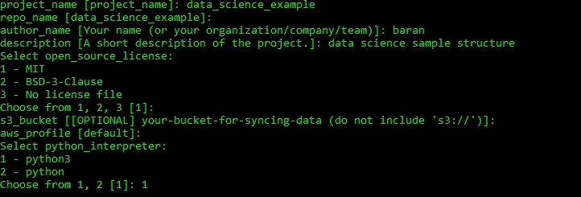
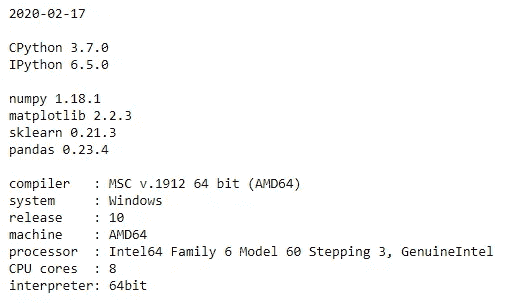

# 构建您的数据科学项目

> 原文：<https://towardsdatascience.com/structure-your-data-science-projects-6c6c8653c16a?source=collection_archive---------6----------------------->

## 数据科学项目结构

## 开发协作和可复制的数据科学项目


费利佩·费塔多在 [Unsplash](https://unsplash.com/s/photos/project-structure?utm_source=unsplash&utm_medium=referral&utm_content=creditCopyText) 上的照片

与软件开发相比，数据科学有一些关键的区别。例如，数据科学项目侧重于探索和发现，而软件开发通常侧重于实现一个明确定义的问题的解决方案。在定义软件产品的需求、理解客户需求的过程中，很少会出现不明确的地方，尽管对于数据驱动的解决方案来说，范围可能会发生变化。

您可以发现数据科学和软件开发之间的许多其他差异，但是这两个领域的工程师需要致力于一致且结构良好的项目布局。毕竟，数据科学项目像任何其他软件系统一样包含源代码，以构建模型本身的软件产品。结构化源代码和与项目相关的数据有很多好处。构建数据科学工作的主要优势包括:

1.  ***跨数据科学团队的协作变得更加容易。当团队中的每个人都遵循相同的项目结构时，发现其他人所做的变更并促成这些变更就变得非常容易。***
2.  ***再现性。*** 模型应该是可再生的，不仅是为了跟踪模型版本，也是为了在模型失败的情况下容易地恢复到旧版本。以可重复的方式记录您的工作，可以确定新模型是否比以前的模型执行得更好。
3.  ***效率。*** 我已经多次检查过旧的 jupyter 笔记本，以便为新项目重用一些功能。我可以凭经验告诉你，假设你有很好的记忆力，平均迭代十个笔记本，找到一段 20 行的代码可能会令人沮丧。以一致的结构提交我写的代码避免了自我重复和复制。
4.  **数据管理。**原始数据应与中间数据和处理过的数据分开。这将确保从事该项目的任何团队成员都可以轻松地重现所构建的模型。找到在模型建立阶段之一中使用的各个数据集所花费的时间大大减少。

虽然要成功实现数据科学项目的可再现性，还需要许多其他的依赖因素，例如，如果您没有覆盖用于模型构建的原始数据，在下一节中，我将分享一些工具，它们可以帮助您开发一致的项目结构，从而促进数据科学项目的可再现性。

烹饪刀

[Cookiecutter](https://github.com/cookiecutter/cookiecutter) 是一个命令行工具，它从项目模板中创建项目。您可以创建自己的项目模板，也可以使用现有的模板。让这个工具如此强大的是，您可以轻松地导入模板，并且只使用最适合您的部分。

在这篇文章中，我将更多地谈论 [cookiecutter 数据科学模板](https://drivendata.github.io/cookiecutter-data-science/)。安装简单明了。要安装，请运行以下命令:

```
pip install cookiecutter
```

要处理模板，只需使用命令行获取它:

```
cookiecutter https://github.com/drivendata/cookiecutter-data-science
```

该工具会询问一些配置选项，然后您就可以开始了。



项目结构如下所示:

```
├── LICENSE
├── Makefile           <- Makefile with commands like `make data` or    `make train`
├── README.md          <- The top-level README for developers using this project.
├── data
│   ├── external       <- Data from third party sources.
│   ├── interim        <- Intermediate data that has been transformed.
│   ├── processed      <- The final, canonical data sets for modeling.
│   └── raw            <- The original, immutable data dump.
│
├── docs               <- A default Sphinx project; see sphinx-doc.org for details
│
├── models             <- Trained and serialized models, model predictions, or model summaries
│
├── notebooks          <- Jupyter notebooks. Naming convention is a number (for ordering),the creator's initials, and a short `-` delimited description, e.g.
│                         `1.0-jqp-initial-data-exploration`.
│
├── references         <- Data dictionaries, manuals, and all other explanatory materials.
│
├── reports            <- Generated analysis as HTML, PDF, LaTeX, etc.
│   └── figures        <- Generated graphics and figures to be used in reporting
│
├── requirements.txt   <- The requirements file for reproducing the analysis environment
│
├── setup.py           <- makes project pip installable (pip install -e .) so src can be imported
├── src                <- Source code for use in this project.
│   ├── __init__.py    <- Makes src a Python module
│   │
│   ├── data           <- Scripts to download or generate data
│   │   └── make_dataset.py
│   │
│   ├── features       <- Scripts to turn raw data into features for modeling
│   │   └── build_features.py
│   │
│   ├── models         <- Scripts to train models and then use trained models to make
│   │   │                 predictions
│   │   ├── predict_model.py
│   │   └── train_model.py
│   │
│   └── visualization  <- Scripts to create exploratory and results oriented visualizations
│       └── visualize.py
│
└── tox.ini            <- tox file with settings for running tox; see tox.testrun.org
```

**文件夹**

生成的项目模板结构允许您为数据科学流程组织源代码、数据、文件和报告。这种结构简化了跟踪项目变更的过程。我将详细介绍五个文件夹:

*   **数据。**数据应分段，以便将来重现相同的结果。你今天用来建立机器学习模型的数据可能与你将来拥有的数据不一样，也就是说。数据可能被覆盖，或者在最坏的情况下丢失。为了拥有可再生的机器学习管道，保持原始数据不变非常重要。原始数据的任何进展都应该被适当地记录下来，这就是数据文件夹发挥作用的地方。您不再需要将文件命名为 final_17_02_2020.csv、final2_17_02_2020.csv 来跟踪更改。
*   **车型。**模型是机器学习管道的最终产品。它们应该存储在一致的文件夹结构下，以确保将来可以复制模型的精确副本。
*   **笔记本。**许多数据科学项目都是在 Jupyter 笔记本上完成的，这让读者可以了解项目的流程。这些笔记本很可能充满了大量的功能和代码块，这使得创作者甚至忘记了代码块的功能。将您的功能、代码块和结果存储在单独的文件夹中，可以让您进一步细分项目，并便于在笔记本中遵循项目逻辑。
*   **报道。**作为数据分析流程的一部分，数据科学项目不仅会生成模型，还会生成数字和图表。这些可以是平行线、条形图、散点图等。您应该存储生成的图形和数字，以便在需要时能够轻松地报告它们。
*   **Src。** Src 文件夹是放置管道中使用的函数的地方。这些功能可以像软件产品一样根据它们在功能上的相似性来存储。您可以轻松测试和调试您的功能，而使用它们就像将它们导入笔记本一样简单。

为了演示如何使用这个工具，我修改了我之前参与的一个项目。[存储库](https://github.com/bkoseoglu/cookiecutter-data-science-example)并不是为机器学习流程而优化的，尽管你可以很容易地理解按照链接组织你的数据科学项目的想法。

**Makefile**

GNU make 是一个控制程序的可执行文件和非源文件生成的工具。它利用 makefiles 列出所有要构建的非源文件，以便产生程序的预期结果。Makefiles 极大地帮助数据科学家建立他们的工作流程。在数据科学项目交付后的大部分时间里，开发人员很难记住构建最终产品所采取的步骤。Makefiles 帮助数据科学家记录管道，以重现构建的模型。因此，这个工具应该放在数据科学家的工具箱里。

Makefile 不仅提供了可再现性，还简化了数据科学团队的协作。一个团队成员，他将使用多个命令设置环境和安装需求，现在可以在一行中完成:

```
#old
virtualenv ex
source ex/bin/activate
pip install -r requirements.txt
#new
make requirements
```

**水印**

Watermark 是一个 IPython 扩展，可以在任何 IPython shell 或 Jupyter 笔记本会话中打印日期和时间戳、版本号和硬件信息。它提供了一种简单的方法来跟踪项目中涉及的工具、库和作者。对于大型项目，使用像 watermark 这样的工具来跟踪所做的更改是一种非常简单且低效的方法。

要安装和使用 watermark，请运行以下命令:

```
pip install watermark
%load_ext watermark
```

这里演示了如何使用它来打印库版本。您可以在他们的[文档](https://github.com/rasbt/watermark#installation-and-updating)中找到更多信息:

```
%watermark -d -m -v -p numpy,matplotlib,sklearn,pandas
```



**最终想法**

凭经验我可以说，数据科学项目一般没有标准化的结构。然而，我在这篇文章中描述的工具可以帮助您创建可重复的数据科学项目，这将提高您的数据团队的协作、效率和项目管理。

*如果你对这个帖子有任何疑问，或者对数据科学有任何疑问，你可以在*[***Linkedin***](http://www.linkedin.com/in/koseoglubaran)***上找到我。***

感谢阅读！