# 来自非结构化语料库的结构化食谱

> 原文：<https://towardsdatascience.com/structured-recipe-from-an-unstructured-corpus-5710ee869505?source=collection_archive---------53----------------------->

## 信息检索

## 基于食物的知识图驱动的信息检索和自然语言处理项目概述

在 [Unsplash](https://unsplash.com?utm_source=medium&utm_medium=referral) 上由[S O C I A l C U T](https://unsplash.com/@socialcut?utm_source=medium&utm_medium=referral)拍摄

本文简要介绍了一个信息检索(和自然语言处理混合)项目的素质和标志，并强调了所获得的结果和推论。

该项目的目标是:

*   从食谱数据的非结构化语料库中导出结构。
*   利用这种结构来获得知识图。
*   从获得的知识图中提取和检查推论。
*   建立信息检索和可视化系统。

接下来的工作可以作为烹饪分类、推荐系统、基于知识图的语义推导等的基础。

# 什么是非结构化数据？

*   在数据收集中缺乏定义良好的结构使其**非结构化**。
*   图像、文本、歌曲、视频是这种数据的一些例子。
*   大多数生成的数据是非结构化的。

> 虽然事实上没有数据是完全非结构化的，但我们的机器发现这种形式的数据平淡无奇；除非我们无能为力。

无法对非结构化数据执行信息提取和分析。由于大多数数据是非结构化的，这是一个广泛面临的问题，因此我们的问题定义。

# 问题定义

许多烹饪网站提供各种烹饪和方法的食谱。尽管存在大量的食谱数据，但几乎没有结构。任何结构，如果存在的话，都不能从中导出有用的模式。

因此，我们的任务是从基于**非结构化配方的数据**中导出一些结构和有意义的关系，并能够在其上运行信息检索系统。

# 数据集

我们使用的数据集具有以下结构。

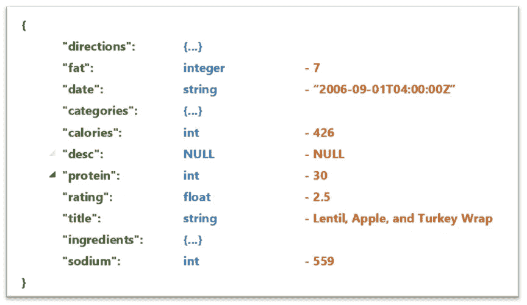

单一配方 JSON 分解。(*图片作者*)

这是一个食谱的 JSON 分解。食谱的*标题*、配料*列表*和说明*列表*是我们在这个项目中唯一关心的条目。配料表描述如下。即我们的非结构化数据:

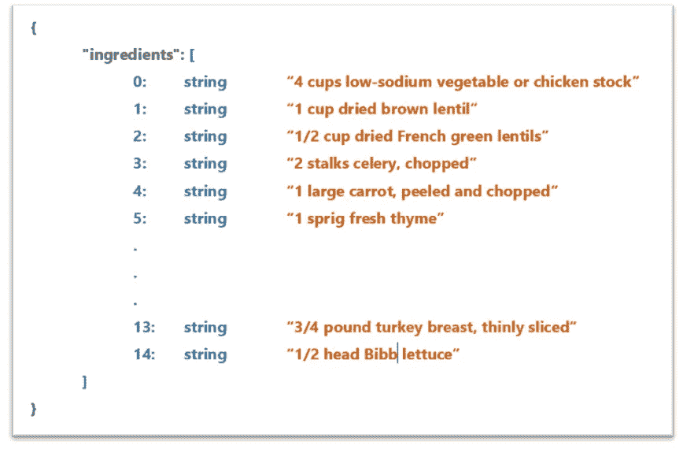

一个配方的成分列表。(*作者图片*)

相邻的图像显示了配方配料数据是如何存储在配料列表中的。可以看出，这些数据是非结构化的。

这个列表是我们要构建的输入。

# 结构化数据

非结构化成分数据可以使用 NYTimes 的 [CRF 成分短语标签进行结构化。](https://github.com/nytimes/ingredient-phrase-tagger)

这个问题是一个结构化的预测问题，其中我们需要识别一系列标签，而不是识别单个标签。为此，CRF 成分短语标记器使用线性链条件随机场，这在诸如词性标记和命名实体识别(NER)的任务中经常是成功的。

成分的各种标签包括数量、单位、名称和注释。该模型通过在一种成分的所有可能标签序列中找到最高概率来找到最佳的可能标签序列。这描述如下:

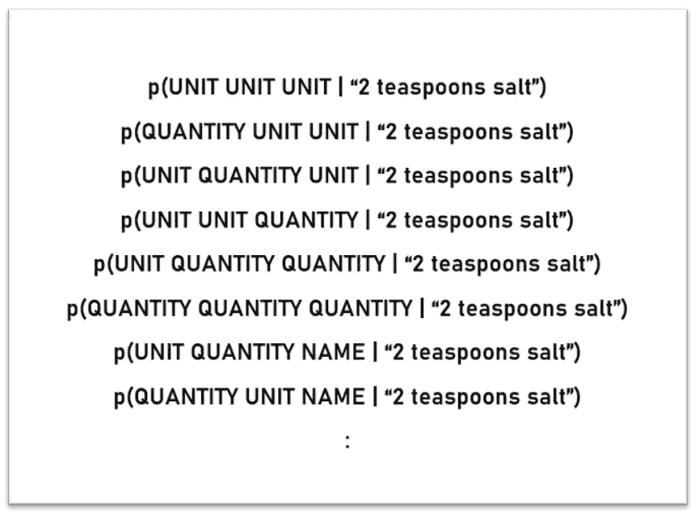

如果我们的配料短语是“2 茶匙盐”然后我们需要给所有可能的标签序列打分。(*图片作者*)

生成的结构由附在配料上的标签组成。

该模型对 20000 种成分进行训练，并生成中间模型文件，该文件进一步用于测试目的。

评估标准是模型预测的准确性:

*   句子级:模型预测成分句中每个单词的实际值。如果句子中的一个单词被错误地识别，则该句子被添加到错误指定的句子中。
*   单词级:在单词级的情况下，检查每个单词，而不管句子是什么。

对 2000 种成分的测试在句子级别产生了大约 74%的准确度，而在单词级别产生了 90%的准确度。句子级别的较低准确度可归因于句子中存在多个单词，并且并非所有单词都被正确识别，因此降低了句子级别的整体准确度。

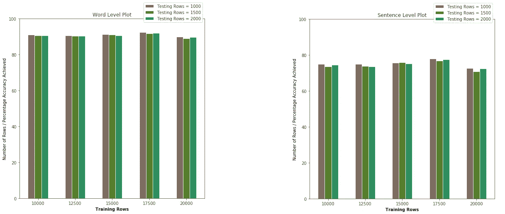

在构造阶段获得的单词级图表和句子级图表的准确度。(*图片作者*)

将模型应用于对应于食谱数据集的配料，我们可以构造其数据，从而暗示模型的稳健性和准确性。

现在我们已经从语料库中准备好了一个结构，我们可以从这里开始构建知识图了。

# 知识图构建

下一步是构建三元组来制作知识图。

如果你是知识图表的新手，看看叶戈尔·德芝克的快速阅读:

 [## 理解知识图表

### 首先，人工智能系统严重依赖数据库中的手工知识。典型的专家系统使用这个…

medium.com](https://medium.com/@Dezhic/understanding-knowledge-graphs-5cb05593eb84) 

在创建三元组之前，我们需要做一些快速的预处理步骤:

1.  词汇化
2.  删除标点符号
3.  停用词删除
4.  移除前导和尾随空格
5.  小写转换

这清理了我们的数据，并为以后在本文的查询部分使用提供了一致性。

要构建的三元组的形式为:(**源** ) — **边** — ( **目标**)。每个源值和目标值成为一个**节点**，第三个三元组将它们连接成一个**边**。

为每个(食谱，结构化烹饪步骤)对创建一个三元组集合。对于每一对，'**源**'节点是结构化 JSON 的'**标题**'列，'**目标**'节点是从获取的结构化数据中的'**名称**'和'**注释**字段中的'**边缘**'。

简而言之，每个菜谱标题都是一个源节点，通过在菜谱中应用的处理连接到它的配料。

我们的收集产生了这样一个知识图表:

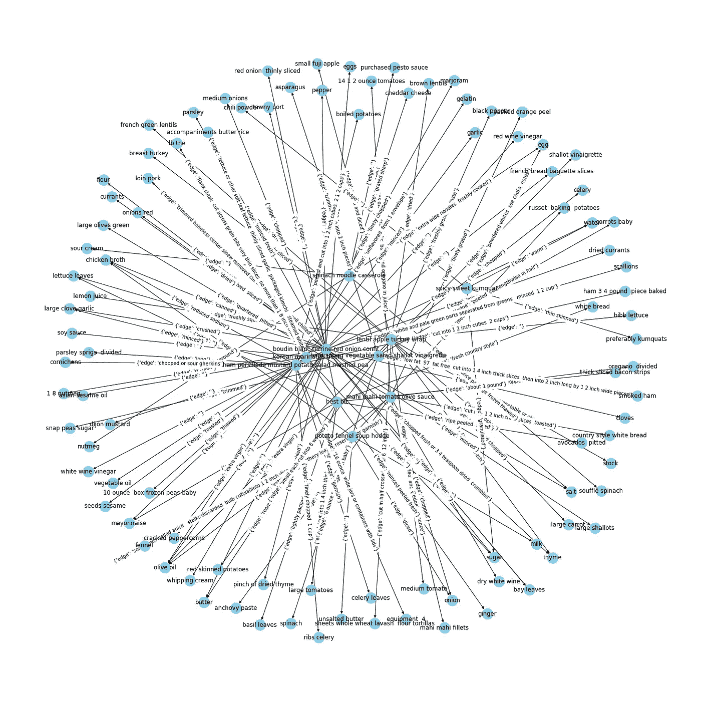

10 种食谱的知识图表。(*图片作者*)

如果你认为这 10 个食谱的知识图表是密集的，那么看看下面 100 个食谱的图表。

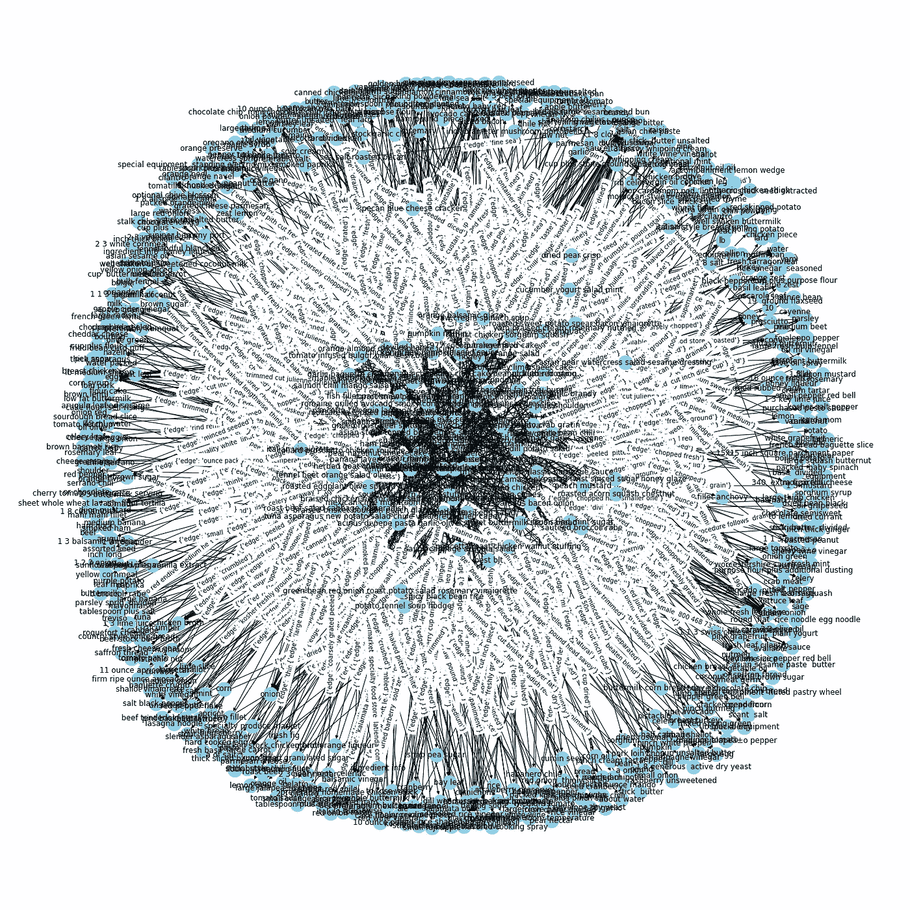

100 种食谱的知识图表。(*图片作者*)

为了清楚起见，让我们来看一个来自单个配方的知识图:

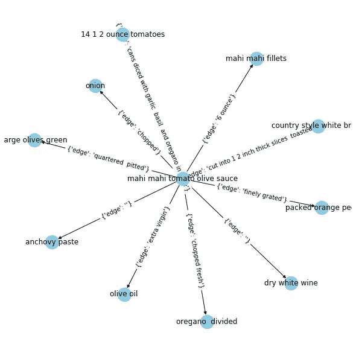

单一配方的知识图表。(*图片作者*)

所以我们有一个图表。但是从这里去哪里呢？

# 查询图表

让我们查询这个图，这样我们就可以从中获得任何想要的信息。

为在三元词库中找到的每个关键词建立一个**倒排索引**。每个关键字指向该关键字所在的节点或边。倒排索引看起来像:

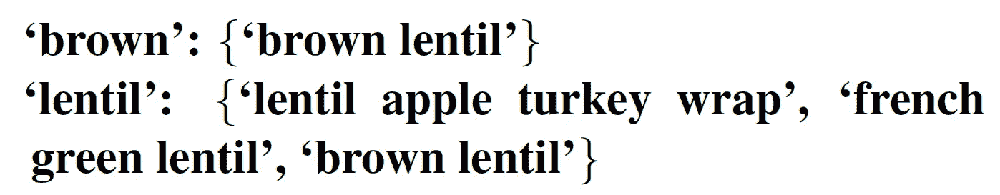

倒排索引的一个例子。这里，花括号内的元素是知识图中的节点或边。(*图片作者*)

对于每个查询词，候选集包含该词在倒排索引中指向的节点或边的集合。这个候选集用于从我们的原始知识图中绘制输出子图。

因此，包含查询词及其紧邻的任何节点都将显示在图中。任何包含术语“胡萝卜”的边都会出现它所连接的两个节点。互连得到了处理。

考虑查询— **胡萝卜**。该查询的输出是:

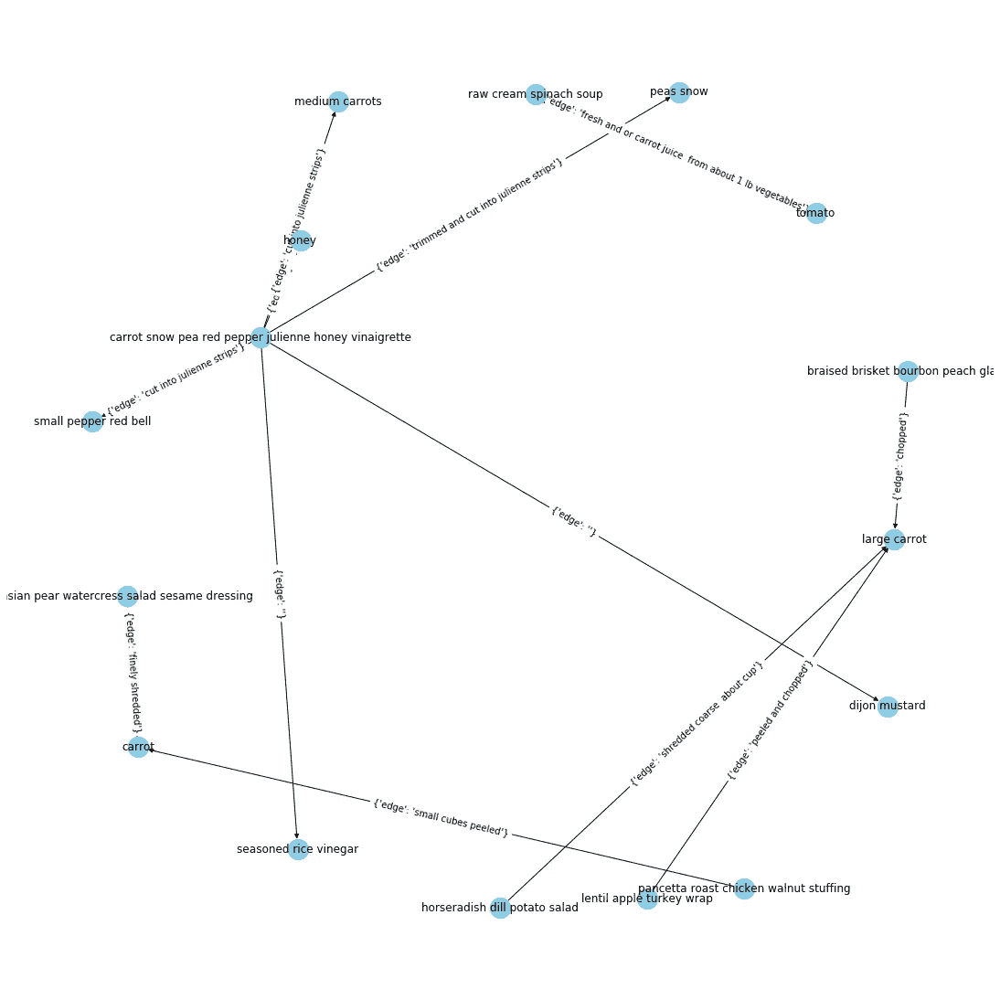

查询的子图输出:胡萝卜。(*图片作者*)

这个图稀疏得多，可以清楚地观察到节点和边。

让我们考虑另一个查询— **菠菜丁**。对于多个查询术语，输出知识图可以是连接的或断开的，这取决于查询术语从图中带来的启示。该查询的结果是:

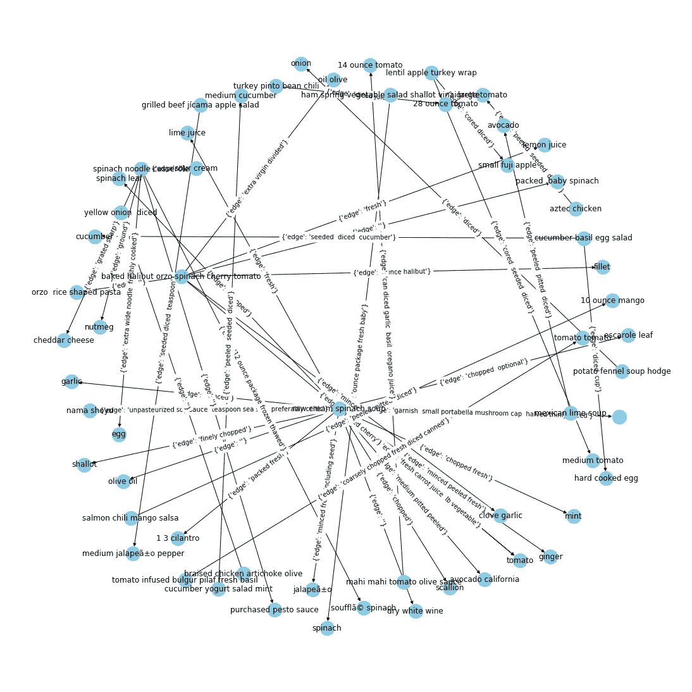

查询的子图输出:菠菜丁。(*图片作者*)

我们得到了一个稍微多一点的连通图。甚至一些连接到它们各自成分的配方节点也出现在图中。

还有几个问题:

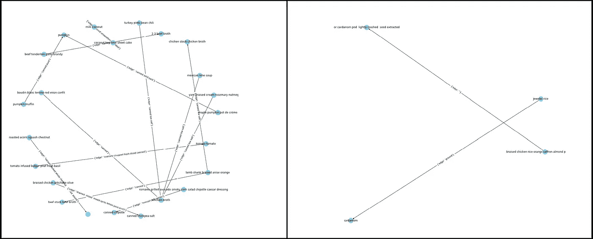

**罐头**和**豆蔻**作为查询。(*图片作者*)

查询部分到此结束。让我们谈谈从我们的全知识图中可以得出的推论。

# 结论

构建的知识图用于进行推论以找出重要信息。

评估的措施:

**程度中心性:**

程度中心性是受欢迎程度的度量。它确定连接到最多节点的节点。该度量确定了图中可以在局部区域中快速传播信息的节点。

对于食谱数据的上下文，具有高度中心性的配料节点是受欢迎的配料，并且在许多食谱中使用或者与许多其他配料一起使用。

**中间中心性:**

介数中心性是一种度量，它提供了关于哪些节点重要的感觉，不是因为它们具有大量的连接，而是因为它们提供了网络的连通性和内聚性。

这些节点是食谱的重要组成部分，它们具有较高的介数中心性和较低的度中心性。

**特征向量中心性:**

特征向量中心性有助于理解哪些节点可以快速获得大量节点的信息。

也可以看做是相关的影响力或者说是在幕后发挥权力作用的节点。本质上，是知识图中重要节点的邻居的节点。

这些成分可以看做是最本质的成分。

**连接组件:**

可以看出，大多数配方构成了图中最大的连通部分，其余的包含一个或两个配方。这暗示了一些食谱是非常独特和不同的，因为它们的成分或制备方法不同。

这些食谱就像样本空间中的离群值，因为它们的制备方法和/或配料设置与大多数食谱非常不同。

**社区检测:**

社区检测是一种以最佳方式划分知识图的方法。可以看到，这些配方组合在一起。这些分组被称为**社区**。

社区暗示了基于成分或准备方法的食谱的分离。

**可以看出，在从 100 个食谱的语料库构建的知识图中，具有 2 个连接的组件，其中具有 9 个社区。**

**社区暗示了可以执行的食谱的可能分类。这些集群有同类的配方。**

汇总推论:

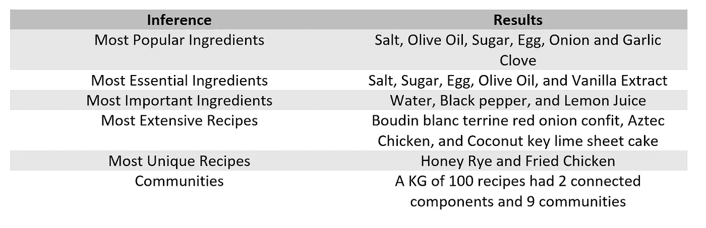

从所描述的测量中得到的推论。(*图片作者*)

如果您想了解更多关于用于推断的测量方法，以下是一些有用的链接:

 [## 图形分析——中心性的介绍和概念

### 社交网络、大数据和电子商务的出现再次强调了分析一种独特类型的…

towardsdatascience.com](/graph-analytics-introduction-and-concepts-of-centrality-8f5543b55de3)  [## 图形和网络中的社区检测入门

### 今年,“社区”一词进入了世界各地的主流对话，这在很大程度上要归功于…

www.analyticsvidhya.com](https://www.analyticsvidhya.com/blog/2020/04/community-detection-graphs-networks/) 

# 未来工作:

未来的工作可能包括包含具有不同规则的三重映射的架构上不同的知识图的几个副本。不同结构的组合可能能够更好地表示复杂的关系。可以进一步查询该图以得出更多的推论。

# 贡献:

这个项目的开发是一个共同的努力。这个团队在这个项目的大部分时间里密切合作。我们面临的困难是，我们改进业绩的想法效果不佳，这是一次高度团结的合作。虽然项目的内聚结构是众所周知的，但工作分配细分如下。

**([坦莫·查克拉博蒂](https://medium.com/u/ba1b9df6733e?source=post_page-----5710ee869505--------------------------------))坦莫·查克拉博蒂博士——全程指导。**

**知识图和子图查询系统的实现和设计。结构到三层结构的设计和转换。**

****罗斯·维尔马(** [罗斯·维尔马](https://medium.com/u/4f0aadbc3369?source=post_page-----5710ee869505--------------------------------) **)** —从知识图中提取推理。结构到三层结构的设计和转换。**

****普拉蒂克·阿加瓦尔(** [普拉蒂克·阿加瓦尔](https://medium.com/u/6025bd767d06?source=post_page-----5710ee869505--------------------------------) **)** —从非结构化数据和数据预处理技术中创建结构化数据。**

**这个项目是为 [IIITD](https://www.iiitd.ac.in/) 的课程信息检索 2020 做的。**