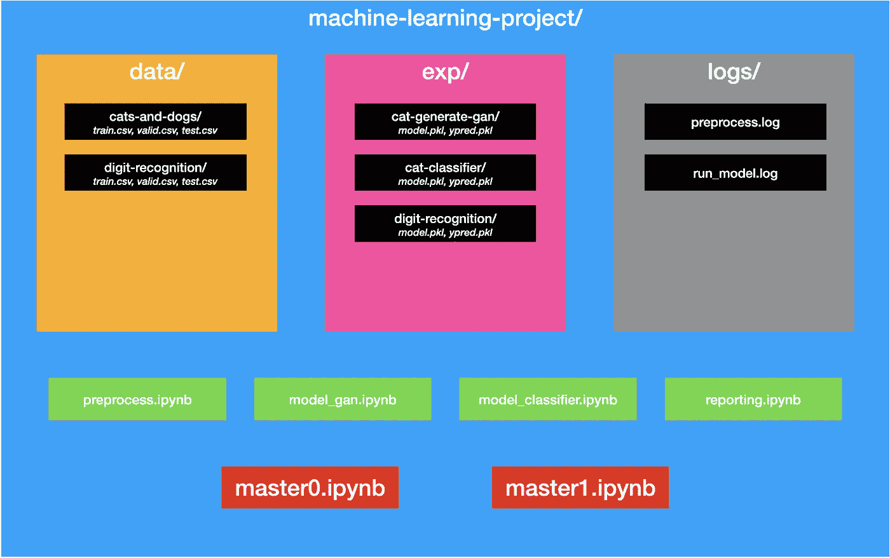

# 为快速迭代机器学习实验构建 Jupyter 笔记本

> 原文：<https://towardsdatascience.com/structuring-jupyter-notebooks-for-fast-and-iterative-machine-learning-experiments-e09b56fa26bb?source=collection_archive---------13----------------------->

## 这是为那些需要在整洁的 Jupyter 工作空间中快速运行大量建模实验的忙碌的 ML 实践者准备的备忘单。

# “模块化”你的代码在机器学习项目中很难

与软件世界不同，术语“可重用组件”可能很难应用于建模世界。实验通常是一次性的，没有多少代码被重用。如果你是一个干净的代码倡导者，喜欢花时间重构每一行代码来遵循“不要重复自己”(DRY)的原则，你很容易花太多时间这样做。

然而，我并不是建议去“不要重复自己”原则的对立面。我见过非常杂乱无章的 Jupyter 笔记本目录。然而，我们应该努力理解我们应该重用哪些组件。在本文中，我将根据我两年多来使用 Jupyter 笔记本对数据进行预处理和建模的经验，重点介绍机器学习项目中倾向于重用的组件。

# 首先，我们为什么要用 Jupyter？

我们在建模项目中使用 Jupyter 的主要原因是我们希望速度更快。我们想快速实验，快速失败，快速学习。数据处理需要时间，机器学习训练更需要时间。不像软件世界里“热重装”是一个东西，我们在建模世界里通常没有它。准备一个实验和实验本身都要花很多时间。为了更快，我们需要使用 Jupyter，它让我们能够只在一小部分代码上测试运行，而不是整个脚本。

> 这是一个迭代的过程。你越快完成这个循环，你的进步就越快。
> 
> —吴恩达，机器学习向往

现在，知道我们不应该在一开始就写脚本，而是应该使用 Jupyter 笔记本，让我们看看我们应该如何组织我们的项目。

# 概观

以下是我们将在这篇文章中涵盖的内容的概述:

1.  **拥有“小数据”有助于** —为什么以及如何在编写代码时拥有小数据集。
2.  **使用 git** —如何使用 git 对你的笔记本进行版本控制。
3.  **关注点分离**——如何构建你的 Jupyter 文件目录。
4.  **预处理、建模笔记本&报告笔记本** —这里我们讨论如何构建 3 个笔记本以及笔记本中包含的内容
5.  **主笔记本** —如何从一个笔记本调用其他笔记本以及如何记录输出

# **拥有“小数据”有助于**

首先，在我们开始为我们的数据处理和数据模型编写代码之前，我们应该有一组“小数据”作为我们的数据。主要的直觉是有一个非常小的数据集，可以快速处理。通过这样做，当我们第一次运行我们的代码时，我们不必等几个小时才知道我们的代码中有一个简单的 bug。

例如，如果我们希望在 1000 万张图片上训练一个模型，那么试着每类只采样 50 张图片来编写代码。或者，如果我们正在训练 1 亿行销售数据，我们可以尝试采样 2000 行销售数据作为我们的“小数据”。

“小数据”应该有多大取决于样本的代表性和处理它的时间。就样本而言，每节课至少要有 5 个样本。就时间而言，经验法则是“小数据”从数据处理到完成模型训练所需的时间应该在 10 分钟以内。

你可以在笔记本的开头使用下面的代码来打开和关闭`SMALL_DATA_MODE`。

```
SMALL_DATA_MODE = Trueif SMALL_DATA_MODE:
    DATA_FILE = "path/to/smallData.csv"
else:
    DATA_FILE = "path/to/originalData.csv"
```

# 使用 git

随着您运行越来越多的实验，很可能会删除旧代码并用新代码替换它们。仅仅为了代码上的一个小变化而创建一个新的笔记本是不好的，因为我们将来可能甚至不需要它们，它会占用我们的工作空间。

使用 git 有助于我们在保持工作场所整洁的同时对笔记本进行版本控制。如果需要，您可以通过返回到之前的 git 提交来恢复到旧版本。此外，如果我们定期将代码推送到远程存储库，我们就不必担心代码丢失。如果你独自做这个项目，你可以把所有的事情都推到主分支，如果你在一个团队中，你可以推到不同的分支。

**安装 git，**

在 Windows 上，转到[https://git-scm.com/download/win](https://git-scm.com/download/win)

在 macOS 上，在终端中运行`git --version`。如果您还没有安装 git，它会提示您进行安装。

在 Linux Ubuntu 上，运行`sudo apt install git-all`

安装后，在项目目录中运行以下命令

```
git init
```

同样，让我们指定不想用 git 跟踪的文件。创建一个名为`.gitignore`的新文件，并将以下文本放入该文件。我们将忽略 Jupyter 检查点、python 缓存和数据目录。

```
.ipynb_checkpoints/
data/
__pycache__/
```

要提交，请使用以下内容(如果您以前加入过软件项目，您应该对这些内容很熟悉)。如果没有，我建议查看 git 教程。

```
git add .
git commit -m "Give a clear message here on what's changing compared to last time you commit"# remember to set a remote named `origin` for this:
git push origin master
```

# 关注点分离



图中显示了机器学习项目的推荐结构

一个机器学习项目通常会有多个使用相同数据和相同模型的实验。与其把所有东西都封在一个目录里，一个好办法是把**数据**、**预处理**、**建模**和**实验输出(exp)** 分开。

## **这是我最喜欢的文件结构:**

*   `data/` —各种数据(原始数据、预处理数据等)的存储桶
*   `exp/` —这里是实验的输出(保存的模型+实际和预测的标签)
*   `logs/` —只是放置我们预处理数据和建模的日志文件
*   `a_MASTER0.ipynb` —“主”Jupyter 笔记本，可以调用其他“从”笔记本(预处理、建模、报告)。我们将在下一节展示如何从一个笔记本中调用另一个笔记本。
*   `a_MASTER1.ipynb` —只是另一个并行运行另一个实验的“主”笔记本。您可以根据需要添加任意数量的主笔记本。
*   `b_preprocess.ipynb` —预处理笔记本，接收来自`data/raw`的原始数据，并将数据输出到`data/{dir}`
*   `c_model_svm.ipynb` —该笔记本接收预处理的输出，稍加修改以适应 SVM 模型，然后将建模结果(如学习的模型参数、预测等)输出到`exp/`。
*   `c_model_randomForest.ipynb` —如果你有另一个型号，就这样命名。
*   `d_reporting.ipynb` —这将从`exp/`中读取并为您的报告绘制表格或图像。

# 预处理笔记本

在这里，我将展示当我们第一次在笔记本中运行代码时应该做什么，我们应该用笔记本的参数启动笔记本。

```
# PARAMETER
#-------------# check if IS_MASTER exists, this variable will only exist if it's being called by MASTER notebook.
# if it does not exist, set it to False
try: IS_MASTER
except: IS_MASTER = False# The code below will only run if it's NOT being called from MASTER notebook
if IS_MASTER:
    DATA_DIR = './data/temp/' # 
    RAW_FILE = f'/path/to/smallData.csv' # use "small data" here
    PROCESSED_FILE = f'{DATA_DIR}processed.pkl' # always use pickle for fast I/O!
    OTHER_PREPROCESS_PARAMETER = ... # e.g. batch size, sliding window size, etc
```

上面的代码为我们的笔记本设置了默认参数。我们将只使用一个临时目录`TMP_DIR`(在`data/`目录下)来存储我们的输出。这是为了确保快速迭代。当我们写代码时，我们应该总是使用“小数据”。

您可以继续编写预处理部分。既然您在这个“开发”阶段使用“小数据”,那么您应该很快！当你完成预处理后，记得使用`pickle`库输出一个 Pickle 文件:

```
import pickle
with open(PROCESSED_FILE, 'wb') as f:
    pickle.dump(python_object, f)
```

或者，使用`pandas`快捷键:

```
df.to_pickle(PROCESSED_FILE)
```

我们使用 Pickle 而不是 CSV 格式来实现持久性和快速读写。这个`PROCESSED_FILE`将在下一部分的建模笔记本中读到。

# 建模笔记本

从这个开始我们的模型笔记本:

```
# PARAMETER
#-------------# check if IS_MASTER exists, this variable will only exist if it's being called by MASTER notebook.
# if it does not exist, set it to False
try: IS_MASTER
except: IS_MASTER = False# The code below will only run if it's NOT being called from MASTER notebook
if IS_MASTER:
    DATA_DIR = './data/temp/'
    EXP_DIR = './exp/temp/'
    PROCESSED_FILE = f'{DATA_DIR}processed.pkl'
    MODEL_FILE = f'{EXP_DIR}model.pkl'
    PREDICTION_FILE = f'{EXP_DIR}ypred.pkl'
    OTHER_MODEL_PARAMETERS = ... # like N_ESTIMATOR, GAMMA, etc
```

请注意，`DATA_DIR`和`PROCESSED_FILE`与之前预处理笔记本的输出相同，并与之相连。

在本建模笔记本中，您应该做 3 件事(此处未显示，因为每个模型都不一样):

1.  读取处理过的数据，并做一点小小的修改，使数据适合模型。
2.  训练和评估模型
3.  将模型的学习参数`MODEL_FILE`和预测`PREDICTION_FILE`输出到`EXP_DIR`目录。对于预测输出，将实际标注和预测标注放在同一个数据框中(便于报告)。

# 报告笔记本

报告笔记本是一个快捷的笔记本，它只需要从`exp/`目录中读取。其输入通过`EXP_DIR`、`MODEL_FILE`和`PREDICTION_FILE`连接到造型笔记本的输出。

```
# PARAMETER
#-------------# check if IS_MASTER exists, this variable will only exist if it's being called by MASTER notebook.
# if it does not exist, set it to False
try: IS_MASTER
except: IS_MASTER = False# The code below will only run if it's NOT being called from MASTER notebook
if IS_MASTER:
    EXP_DIR = './exp/temp/'
    MODEL_FILE = f'{EXP_DIR}model.pkl'
    PREDICTION_FILE = f'{EXP_DIR}ypred.pkl'
```

在这里，您可以将预测的标签与实际标签进行比较。在这里，您可以使用精度、召回率或 ROC AUC 等指标。您还可以在这里运行图表和绘图的代码。

# 主笔记本

最后，大师笔记本！

主笔记本是调用所有其他笔记本的笔记本。在这个笔记本中，您将监督整个数据管道(从原始数据预处理到建模和报告)。

主笔记本也是您调用其他(经过良好测试的)预处理和建模笔记本来运行实际“大数据”的地方。我还将介绍一个日志技巧(因为如果“大数据”出错，我们想知道原因)。

我们也将在这里使用 Jupyter 魔法命令`%run`。

首先，创建一个名为`print_n_log.py`的文件，并将下面的代码粘贴到其中:

```
"""
Returns a modified print() method that returns TEE to both stdout and a file
"""
import loggingdef run(logger_name, log_file, stream_level='ERROR'):
    stream_level = {
        'DEBUG': logging.DEBUG,
        'INFO': logging.INFO,
        'WARNING': logging.WARNING,
        'ERROR': logging.ERROR,
        'CRITICAL': logging.CRITICAL,
    }[stream_level]

    # create logger with 'logger_name'
    logger = logging.getLogger(logger_name)
    logger.setLevel(logging.DEBUG)
    # create file handler which logs even debug messages
    fh = logging.FileHandler(log_file)
    fh.setLevel(logging.DEBUG)
    # create console handler with a higher log level
    ch = logging.StreamHandler()
    ch.setLevel(stream_level)
    # create formatter and add it to the handlers
    formatter = logging.Formatter('%(asctime)s - %(name)s - %(levelname)s - %(message)s')
    fh.setFormatter(formatter)
    ch.setFormatter(formatter)
    # add the handlers to the logger
    logger.addHandler(fh)
    logger.addHandler(ch)
    def modified_print(*args):
        s = ' '.join([str(a) for a in args])
        logger.info(s)
    return modified_print
```

上面的代码将创建一个修改过的`print()`方法，该方法将输出(stdout)和错误(stderr)重定向到主笔记本单元的输出和日志文件。

接下来，将此模块导入您的主笔记本:

```
import print_n_log
```

在您的下一个单元格中，让我们尝试调用预处理笔记本:

```
# Parameters for Preprocessing Notebook
#---------------------------------------------
IS_MASTER = True # Remember this? We need to set this to True in MASTER Notebook so that it does not use the default parameters in processing notebook.
RAW_FILE = f'/path/to/smallData.csv' # use "small data" here
PROCESSED_FILE = f'{DATA_DIR}processed.pkl' # always use pickle for fast I/O!
OTHER_PREPROCESS_PARAMETER = ... # like batch size, sliding# Let's save the original print method in ori_print
#---------------------------------------------------
ori_print = print# Now we set the print method to be modified print
#--------------------------------------------------
print = print_n_log.run('preproc', './logs/preprocess.log', 'DEBUG')# Now, we run the Preprocessing Notebook using the %run magic
#-------------------------------------------------------------
%run 'c_preprocess.ipynb'# Finally, after running notebook, we set the print method back to the original print method.
#-----------------------------------------------------
print = ori_print
```

注意，我们使用`%run`魔法来运行预处理笔记本。这是一个 IPython 魔术，让我们从当前的笔记本运行其他 Python 文件和 Jupyter 笔记本。我们使用这个命令来运行预处理笔记本中的所有代码。

通过调用`print_n_log.run('preproc', './logs/preprocess.log', 'DEBUG')`，我们修改了原始的 Python 内置`print()`方法，将输出重定向到屏幕和日志文件。`'preproc'`只是我们记录器的一个名字，你可以使用任何其他名字。运行后，您可以转到`'./logs/preproc.log'`来查看运行预处理笔记本记录的输出。最后一个参数`'DEBUG'`只是说“打印每个输出到屏幕上”。如果您只想在屏幕上看到错误(无输出)，也可以使用`'ERROR'`。

是的，就是这样！您可以使用相同的模板来调用建模笔记本和报告笔记本。但是，提示一下，您可能不希望记录报告笔记本的输出，所以您可以对它使用原始的 print()方法。

# 结论

这里的关键思想是将 Jupyter 笔记本中与其他部分没有太多纠缠的部分“模块化”，同时对整个数据管道有一个概览。

与封装的软件哲学不同，我们实际上并不想将代码封装在 python 文件中，然后再也看不到它们(尽管我们可以对一些实用程序方法这样做)。我们希望将大部分代码保存在笔记本中，因为在设计实验时，每个部分都应该是可变的。当一个部分被改变时，我们也想让它们可测试。通过留在 Jupyter notebook，我们知道我们的代码在用“小数据”运行时是可测试的。通过遵循这些指导方针，我们将拥有一个组织化和模块化的 Jupyter 项目，然而每个部分都是易于编辑和测试的。

要获得我帖子的通知，请在 Medium、 [Twitter](https://twitter.com/desmondyeoh) 或[脸书](https://www.facebook.com/desmond.yeoh)上关注我。