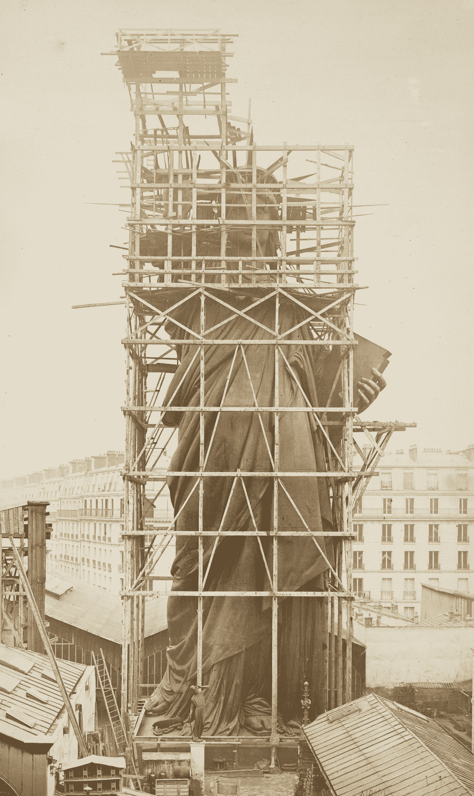
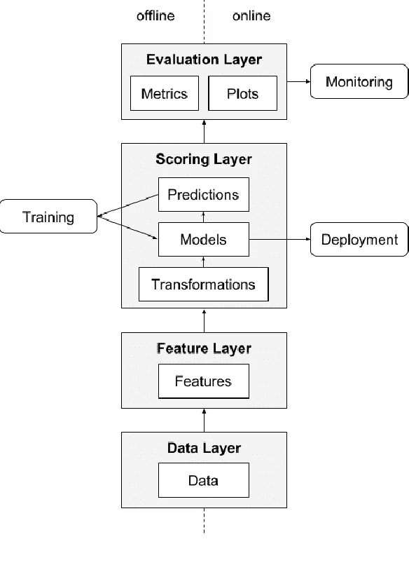

# 构建机器学习项目

> 原文：<https://towardsdatascience.com/structuring-machine-learning-projects-be473775a1b6?source=collection_archive---------7----------------------->

图 1:自由女神像周围的脚手架——照片由[纽约公共图书馆](https://unsplash.com/@nypl?utm_source=medium&utm_medium=referral)在 [Unsplash](https://unsplash.com?utm_source=medium&utm_medium=referral) 拍摄

## 构建 ML 项目的模板指南

“分层方法被认为是比作为一个整体块实现协议更好的实践，因为分别实现概念上不同的问题有几个好处”Buschmann 等人(1996)[1]。在发表的时候，Buschmann 等人被认为是软件开发的一种新方法。自从 POSA 第一卷发布以来已经过去了 20 多年，有趣的是，设计的思想仍然非常适用于现代软件开发。

那么，软件开发与构建机器学习项目到底有什么关系呢？实际编写的机器学习代码只是机器学习系统的一小部分。基于前述的基础，我相信将大规模的机器学习项目视为一个软件项目是非常公平的——当然，不要忽视实践者的能力。在本文中，我将详细说明拥有良好结构布局的好处，然后我将提供一个模板结构布局，详细描述每个目录中可能包含的内容。

资料来源:霍尔特，加里&戈洛文，丹尼尔&达维多夫，尤金&菲利普斯，托德&埃布纳，迪特马尔&乔德里，维奈&杨，迈克尔&丹尼森，丹。(2015).机器学习系统中隐藏的技术债务。乳头。2494–2502.

> 注:拟议的结构仅作为一个框架，可能会发生变化。没有一种方法可以设计一个项目，所以最好的方法是选择并采用符合您的偏好和项目需求的实践。

> “风格指南是关于一致性的。与本风格指南保持一致非常重要。项目内部的一致性更重要。一个模块或功能内的一致性是最重要的。
> 
> 然而，要知道什么时候不一致——有时候风格指南的建议并不适用。当有疑问时，使用你最好的判断。看看其他例子，决定什么是最好看的。不要犹豫地问！"
> 
> ——吉多·范·罗森[2]。

W **hy 在意结构？**

*你未来的自己会感激:*

在某些时候，我们会想要复制我们的工作。就我接触过的许多人而言，在我们工作的时候，很少考虑未来会发生什么对我们最有利。当构建预测模型时，我们更关心的是获得洞察力，从而构建一个强大的工作预测模型——我们希望把事情做好！快速测试、可视化和分析并不罕见，但这种环境并不适合考虑结构，因此很难返回代码并理解您当时得出的某些结论或您当时的思维过程。

回到过去的项目，如果你不得不考虑是否应该执行`make_column.py`、`new_make_column.py`或`fixed_make_column.py`来完成工作，那么这就是我称之为 HDW(高度无组织工作)的症状。无法重现结果不仅令人尴尬，对灵魂来说也是相当痛苦的，因此，从长远来看，通过预先制定项目结构，我们为自己做了一件好事。好的项目结构鼓励那些让回到过去的工作充满快乐的实践。

*别人会感激:*

当一个项目组织良好时，它往往是自文档化的。出于各种原因，有人可能想要参观你的作品来扩展它、展示它或者仅仅是从中学习。可能想要访问您的工作的人是不熟悉您的项目的人，所以通过维护良好的结构，您为他们节省了大量的时间，因为他们可以通过简单地查看结构来对您所做的事情有一个大致的了解，而不必解析大量的文档或代码来找到他们正在寻找的特定功能——也就是说，这也意味着协作过程将更加容易，这在任何团队活动中总是高效团队的一个有用特征。

*再现性:*

我们简要地谈到了这个话题，但是由于它是 ML 中的一个至关重要的因素——在数据科学、深度学习、计算机视觉和自然语言处理等领域也是如此——所以必须明确地提到可再现性。在 Sugimura，P. Hartl，F. 2018[3]中，提供了阻碍模型再现能力的各种无意方式以及修复这些问题的解决方案。这类问题的例子有数据起源、特征起源、模型起源等等。此外，Sugimura，P. Hartl，F. 2018[3]指出，用于构建具有系统架构的可再生管道的方法从一开始就将该概念视为一等公民[4]，为了使该架构实现通用性和可扩展性，该项目分为多个部分。拥有良好的项目结构有助于实现这个目标！

图二。整体系统架构示例。资料来源:杉村，P. Hartl，F. 2018。建立一个可复制的机器学习管道。arXiv。[3].

为了进一步扩展再现性的话题，值得注意的是，你做的每件事，你可能都要再做一遍——这就像墨菲定律的版本*。出于各种原因，你的工作可能需要复制，无论是你意识到有一个缺陷，还是你离开公司，有人想延长你的工作。因此，无论你做了什么都可能需要重做，如果有一个组织良好的结构，那么知道从哪里开始就会简单得多。*

> 注:请参阅 Ericson 等人 2020[6]关于标准化项目结构的更多信息。

**拟建结构布局**

图 3:目录布局

**数据**

*外部:*这是从第三方来源提取的数据(不可变数据)。如果没有提取第三方数据，则该文件夹过时。

*过渡:*在事件外部数据可用时，该数据将是我们通过使用`src/data`目录中的脚本为特征工程加载的数据。该数据集是通过执行各种连接和/或合并来组合外部和原始数据而生成的。

*已处理:*这是使用各种机器学习技术转换的数据。我们将在`src`文件夹中进入的 features 文件夹对数据执行各种转换，以使其为建模做好准备。为了缩短模型的训练时间，保存处理过的数据不失为一个好主意。

*Raw:* 拥有数据的本地子集副本可以确保您有一个静态数据集来执行任务。此外，这克服了由于网络延迟问题导致的任何工作流故障。这个数据应该被认为是不可变的。如果没有外部数据，那么这是由`src\data`中的脚本下载的数据。

**车型**

我们使用`src\models`中的脚本来训练我们的机器学习模型。我们可能需要将该模型与其他模型一起恢复或重用，以构建一个集合或进行比较，并且我们可以决定要部署的模型。为此，我们将训练好的模型保存到一个文件中(通常是 pickle 格式),该文件将保存在这个目录中。

**笔记本**

Jupyter 笔记本电脑非常适合制作原型、探索和交流发现，但是它们不太适合长期发展，并且在可重复性方面效率较低。笔记本可以进一步分为`Notebooks\explorations`、`Notebooks\PoC`等子文件夹。使用良好的命名约定有助于区分每个笔记本中填充了什么——一个有用的模板是<步骤> - <用户> - <描述>。ipynb(即 01-kpy-eda.ipynb ),其中步骤用作排序机制，创建者的名字首字母、姓氏的前两个字母以及笔记本内容的描述。

**Src**

*数据:*在这个目录中，我们有脚本，这些脚本从数据生成的任何地方接收数据，并转换这些数据，使其处于可以进行进一步特性工程的状态。

*特性:*在这个目录中，我们有一个脚本来处理数据，并将其转换成一种可以被我们的机器学习模型使用的格式。

*模型:*包含用于构建和训练我们的模型的脚本。

**结论**

拥有一个结构化的目录布局对于组织 ML 项目中数据科学团队的思维非常有用。在项目开始时花一些时间思考你将如何规划未来的工作并将其记录为你的标准化项目结构是很有用的(Ericson et al 2020。)[6].如果在项目过程中需要重命名、添加或删除某个目录，这是没有问题的，因为结构不是严格的，但是应该有一种方法向团队的其他成员提出这一点，以便您可以批准这一更改。在你独自进行一个项目或者作为一个单独的实践者的情况下，记录变化仍然是一个好主意，这样你就可以在你进行项目的过程中跟踪你的思维过程。

在这篇文章中，我没有提到其他重要的东西，如 README.md、environment.yml/requirements.txt 和测试。在以后的文章中，我会深入探讨这些问题。我还将在以后的文章中构建一个自定义管道。在 Medium 或 Twitter 上关注我吧 [@kurtispykes](https://twitter.com/KurtisPykes) 关注我的下一篇文章。

**其他有用资源:**

[马志威](https://medium.com/u/ba547bff904f?source=post_page-----be473775a1b6--------------------------------) - [前期管理你的数据结构](/manage-your-data-science-project-structure-in-early-stage-95f91d4d0600)

Mateusz Bednarski - [机器学习项目的结构化和自动化工作流第一部分](/structure-and-automated-workflow-for-a-machine-learning-project-2fa30d661c1e)

[Mateusz Bednarski](https://medium.com/u/2792cb20f25?source=post_page-----be473775a1b6--------------------------------) - [机器学习项目的结构化和自动化工作流第二部分](/structure-and-automated-workflow-for-a-machine-learning-project-part-2-b5b420625102)

[Semi Koen](https://medium.com/u/aabf98f9b9a?source=post_page-----be473775a1b6--------------------------------) - [成为数据科学家并不能让你成为软件工程师](/being-a-data-scientist-does-not-make-you-a-software-engineer-c64081526372)

[Semi Koen](https://medium.com/u/aabf98f9b9a?source=post_page-----be473775a1b6--------------------------------) - [构建机器学习管道](/architecting-a-machine-learning-pipeline-a847f094d1c7)

[FloydHub](https://medium.com/u/fd2a02f2ad47?source=post_page-----be473775a1b6--------------------------------) - [如何计划和执行你的 ML 和 DL 项目](https://blog.floydhub.com/structuring-and-planning-your-machine-learning-project/)

**参考文献**

[1] Buschmann 等人(1996 年)。建筑模式，在布希曼，F(编辑。)*面向模式的软件架构。约翰·威利的儿子们。第 32 页*

[2]范·罗森，G .华沙，B .科格兰，N. 2001 年。PEP 8——Python 代码风格指南。查看 2020 年 3 月 25 日，<[https://www.python.org/dev/peps/pep-0008/](https://www.python.org/dev/peps/pep-0008/)>

[3]杉村，p .哈特尔，F. 2018。建立一个可复制的机器学习管道。arXiv。

[4]《一等公民》(2020)维基百科。可在:[https://en.wikipedia.org/wiki/First-class_citizen](https://en.wikipedia.org/wiki/First-class_citizen)(访问日期:2020 年 3 月 26 日)

[5]《墨菲定律》(2020)维基百科。可在:[https://en.wikipedia.org/w/index.php?title=Murphy%27s_law&行动=历史](https://en.wikipedia.org/w/index.php?title=Murphy%27s_law&action=history)(访问时间:2020 年 3 月 25 日)

[6]埃里克森等人 2020。*团队数据科学流程是什么？。*微软。查看 2020 年 3 月 25 日，<[https://docs . Microsoft . com/en-us/azure/machine-learning/team-data-science-process/overview #标准化-项目-结构](https://docs.microsoft.com/en-us/azure/machine-learning/team-data-science-process/overview#standardized-project-structure) >