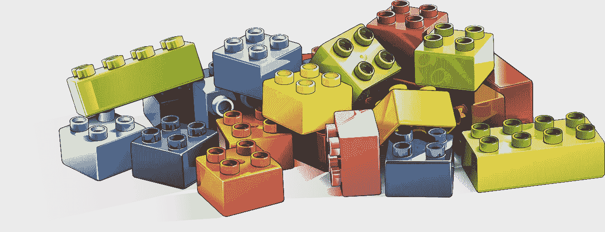

# 构建 ML 管道项目

> 原文：<https://towardsdatascience.com/structuring-ml-pipeline-projects-97c16348be4a?source=collection_archive---------19----------------------->

## 一个有组织的代码库使你能够更快地实现变化，犯更少的错误，最终导致更高的代码和模型质量。阅读更多内容，了解如何使用 Tensorflow Extended (TFX)构建您的 ML 项目，这是一种简单明了的方法。

[图片由来自 Pixabay 的 Francis Ray 拍摄](https://pixabay.com/illustrations/lego-building-game-toy-drawing-3388163/)

# 项目结构:需求

*   启用`multiple`管道实验
*   支持`local`执行模式和`deployment`执行模式。这确保了创建两个独立的运行配置，第一个用于本地开发和端到端测试，第二个用于在云中运行。
*   `Reuse code`如果这样做有意义的话，跨管道变量
*   提供一个易于使用的`CLI interface`来执行具有不同`configurations`和数据的流水线

一个正确的实现还可以确保测试很容易被整合到您的工作流程中。

# 项目结构:设计决策

*   用 Python。
*   使用 Tensorflow Extended (TFX)作为管道框架。

在本文中，我们将演示如何以最少的麻烦在本地和 Kubeflow 管道系统上运行 TFX 管道。

# 设计决策引起的副作用

*   通过使用 TFX，我们将使用`tensorflow`。请记住，tensorflow 支持更多类型的模型，如[增强树](https://www.tensorflow.org/tutorials/estimator/boosted_trees)。
*   Apache Beam 可以在本地、kubernetes 运行的任何地方以及所有公共云提供商上执行。例子包括但不限于:GCP 数据流，Azure 数据砖。
*   由于 Apache Beam，我们需要确保项目代码很容易被 python 的`sdist`打包，以获得最大的可移植性。这体现在项目的顶层模块结构上。(如果您使用外部库，请确保通过向 apache beam 提供一个参数来包含它们。*阅读更多关于* [*Apache Beam:管理 Python 管道依赖关系*](https://beam.apache.org/documentation/sdks/python-pipeline-dependencies/) *)。*

> **【可选】**在继续之前，花点时间阅读一下提供的 [TFX CLI](https://www.tensorflow.org/tfx/guide/cli) 。目前，[运行起来非常慢](https://github.com/tensorflow/tfx/issues/2164)，而且目录结构比它需要的要冗长得多。它也不包括任何关于可再现性和代码重用的注释。

# 目录结构及其背后的直觉

*   `$project-name`是项目的根目录
*   `$project-name/ml`包括机器学习相关的东西。
*   `$project-name/ml/pipelines`包括实际的 ML 管道代码
*   通常，您可能会发现自己需要管理多个 ML 管道，例如`$project-name/ml/pipelines/predict-sales`和`$project-name/ml/pipelines/classify-fraud`或类似的管道。
*   下面是一个简单的`tree`视图:

`$project-name/ml/pipelines`包括以下内容:

*   `data` →少量代表性培训数据在本地运行，用于测试和 CI。如果您的系统没有专门的组件来从某个地方提取数据，那就是真的。如果是这样的话，请确保包含一个带有少量有限项目的抽样查询。
*   `util` →跨`$pipeline-name`重复使用和共享的代码。不需要包含`input_fn_utils.py`和`model_utils.py`。在这里使用任何有意义的东西。以下是一些例子:

在我自己的项目中，在实用模块上抽象一些部分是有意义的，比如为 keras 模型构建命名的输入和输出层。

使用张量流变换输出构建服务签名元图。

使用关键字将特征预处理成组。

以及其他常见的重复性任务，如使用 Tensorflow 数据集 api 构建输入管道。

*   `cli.py` →管道的入口点和命令行界面。以下是使用 TFX 时需要考虑的一些常见问题。

通过使用`[abseil](https://github.com/abseil/abseil-py)`,你可以声明和访问全局标志。[每个模块都定义了特定的标志。这是一个分布式系统。这意味着常见的标志，如`--data_dir=...`、`--hparam_tuning`、`--pipeline_root`、`--ml_metadata_url`、`--use_cache`、`--train_epochs`可以在实际的`cli.py`文件中定义。另外，可以在子模块上为每个管道定义更具体的参数。](https://abseil.io/docs/python/guides/flags)

这个文件充当系统的入口点。它使用`pipeline.py`中的内容来设置管道的组件，并根据某些标志(如`--pipeline_name=$pipeline-name`或其他配置)提供用户提供的模块文件(在树形示例中为`constants.py`、`model.py`、`training.py`)。

最后，对于组装好的管道，它通过使用一个`--runner=`标志来调用某个`_runner.py`文件。

*   `pipeline.py` →参数化管道组件声明和接线。这通常只是一个声明一堆 TFX 组件并返回一个`tfx.orchestration.Pipeline`对象的函数。

*   `local_beam_dag_runner.py` →使用便携式光束运行器进行本地运行的配置。这通常几乎不需要配置，只需使用`BeamDagRunner`。
*   `kfp_runner.py` →在 Kubeflow 管道上运行的配置。这通常包括不同的数据路径和管道输出前缀，并自动绑定 ml-metadata 实例。

> 注意:你可以有更多的运行者，像在 GCP 上运行的东西，只是配置更多的供应资源，如 TPU 实例，并行人工智能平台超参数搜索等。

## $管道名称

这是用户提供的代码，用于制作不同的模型，安排不同的实验，等等。

由于有了`util`子模块，每个管道下的代码应该更精简。不需要把它分成 3 个以上的文件。但是这并不禁止将你的代码分割成更多的文件。

从实验中，我收敛到一个`constants`、`model`和`training`分裂。

*   `constants.py` →申报。要跟踪的训练参数、超参数键和声明、特性键、特性组、评估配置和指标的合理默认值。这里有一个小例子:

*   `model.py` →模型定义。通常包含一个`build_keras_model`函数，并使用来自`util`和`$pipeline-name.constants`的导入。这是我最近一个项目中的一个例子:

*   最后，`training.py`包括训练模型所需的所有细节。这通常包括:预处理定义、超参数搜索、设置训练数据或模型——并行策略和张量板日志，以及保存用于生产的模块。

就是这样。谢谢你看完！

我希望你喜欢读这篇文章，就像我喜欢写它一样。