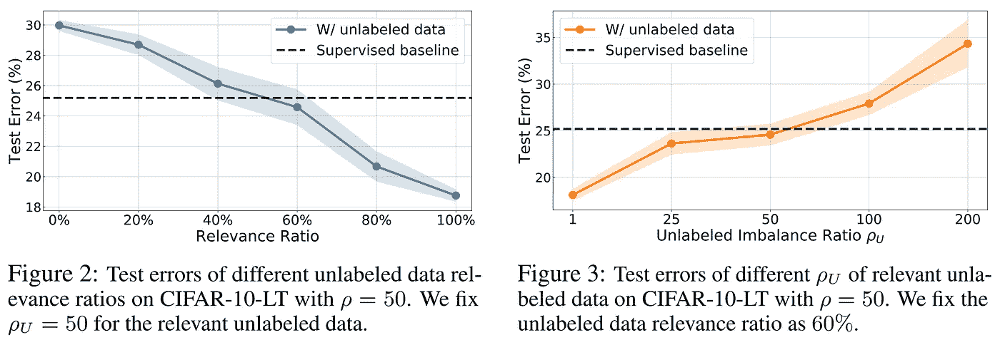
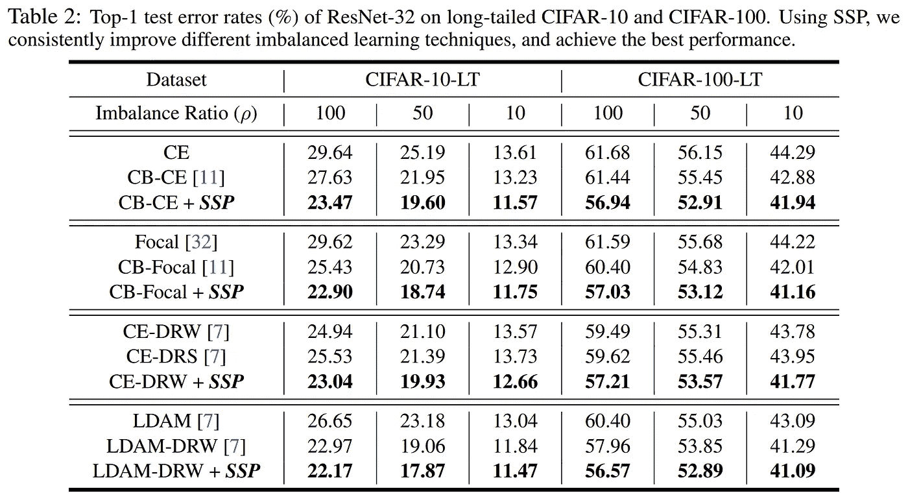
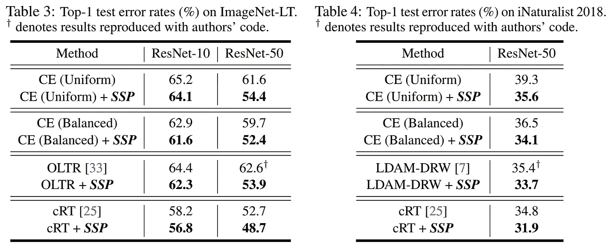

# 纠结于数据不平衡？半监督和自我监督学习帮助！

> 原文：<https://towardsdatascience.com/struggling-with-data-imbalance-semi-supervised-self-supervised-learning-help-4de8b8f23490?source=collection_archive---------6----------------------->

(图片由作者提供)

## [入门](https://towardsdatascience.com/tagged/getting-started)

## 反思标签对改善班级不平衡学习的价值

给大家介绍一下我们最新的作品，已经被 NeurIPS 2020 接受: [**反思标签对于改善班级不平衡学习的价值**](https://arxiv.org/abs/2006.07529) 。这项工作主要研究一个经典但非常实用和常见的问题:数据类别不平衡下的分类问题(也称为数据的*长尾分布*)。通过理论建模和大量实验，我们发现**半监督**和**自监督学习**都能显著提高不平衡数据下的学习性能。

源代码(和相关数据，> 30 个预训练模型)可以通过这个 GitHub 链接找到:[https://github.com/YyzHarry/imbalanced-semi-self](https://github.com/YyzHarry/imbalanced-semi-self)。

首先，我想用一句话来总结本文的主要贡献:我们已经从理论和经验上验证了，对于具有不平衡数据(类别)的学习问题，使用

*   *半监督学习* —即使用更多*未标记数据*；或者，
*   *自监督学习*——即不使用任何额外的数据，只需先做一步*自监督预训练*对已有不平衡数据没有标签信息

都可以大大提高模型性能。它们的简单性和通用性也使得它们很容易与不同的经典方法相结合，以进一步增强学习效果。

接下来，我们将进入正文。我将首先介绍数据不平衡问题的背景和目前的一些研究现状。那我就介绍一下我们的思路和方法，省略不必要的细节。

# 背景

数据不平衡的问题在现实世界中非常普遍。对于真实数据，不同类别的数据量一般不会是理想的均匀分布，而往往会不平衡；如果按照样本数量从高到低对类进行排序，会发现数据分布有一个*【长尾】*，也就是我们所说的长尾效应。大规模数据集通常呈现这样的长尾标签分布:

大规模数据集通常呈现长尾标签分布(图片由作者提供)。

当然，不仅对于分类任务，对于物体检测或实例分割等其他任务，在很多常用的数据集中也存在类别不平衡的情况。除了视觉领域的数据，对于涉及安全或健康的关键应用，如自动驾驶和医疗/疾病诊断，数据本身就严重失衡。

**为什么会出现不平衡？**一般的解释是，特定类型的数据难以收集。以物种分类为例(例如，大规模数据集 iNaturalist)，某些物种(如猫、狗等。)都很常见，但有些品种(如胡兀鹫)非常罕见。对于自动驾驶，正常行驶的数据会占大部分，而实际发生异常情况/车祸的数据很少。就医疗诊断而言，与正常人口相比，患有某些疾病的人数也极其不平衡。

**那么，不平衡或长尾数据有什么问题呢？**简单地说，如果你直接将不平衡样本扔给模型用 ERM 学习，很明显，模型在主要类别的样本上会学习得更好，但在次要类别上概括得很差，因为它看到的主要类别的样本远远多于次要类别。

**那么，目前有哪些解决学习不平衡问题的方法呢？**我总结的目前主流的方法大致分为以下几类:

1.  *重采样*:具体来说，可以分为对少数样本过采样，或者对多数样本欠采样。然而，过采样容易过度适应小类，并且不能学习更鲁棒和可概括的特征，并且它通常在非常不平衡的数据上表现不佳；另一方面，欠采样会导致主类中严重的信息丢失，从而导致欠拟合。
2.  *合成样本*:即生成与少数样本相似的“新”数据。经典方法 SMOTE 对随机选取的少数样本使用 K 近邻选取相似样本，通过线性插值得到新样本。
3.  *重新加权*:给不同的类别(甚至不同的样本)分配不同的权重。注意，这里的权重可以是自适应的。这种方法有许多变种。最简单的就是按照类别数量的倒数来加权。
4.  *迁移学习*:这类方法的基本思想是将多数类和少数类分别建模，将多数类的学习信息/表征/知识迁移给少数类。
5.  *度量学习*:本质上是希望学习更好的嵌入，更好的建模少数类附近的边界/边距。
6.  *元学习/领域适应*:可以使用头部和尾部数据的不同处理来自适应地学习如何重新加权，或者将问题公式化为领域适应问题。

至此，大致总结了背景和常用方法；然而，即使有数据重采样或类平衡损失等专门算法，在极端数据不平衡的情况下，深度模型性能的退化仍然普遍存在。因此，了解不平衡数据标签分布的影响是非常重要的。

# 我们的动机和想法

与以前的方法不同，我们考虑如何平衡这些不平衡数据标签的“价值”。然而，与平衡数据不同，不平衡学习环境中的标签扮演着令人惊讶的争议角色，这导致了对其价值的持续困境:(1)一方面，有标签监督的学习算法通常会比无监督的学习算法产生更准确的分类器，证明了标签的*正*值；(2)然而，另一方面，不平衡的标签自然会在学习过程中强加“标签偏差”，其中决策边界可以由多数类显著驱动，这表明了标签的*负面*影响。结果，不平衡的标签就像一把双刃剑；一个很重要的问题是*如何最大限度地挖掘标签的价值来改善类不平衡学习*？

因此，我们试图对上述两种不同的观点分别进行系统的分解和分析。我们的结论表明，对于*正*和*负*视角，不平衡标签的值可以被充分利用，从而大大提高最终分类器的准确性:

*   *正面*我们发现，当有更多的未标注数据时，这些不平衡的标注提供了稀缺的监管信息。通过使用这种监督，我们可以使用*半监督学习*来显著改善最终的分类结果，即使未标记数据也具有长尾分布。
*   然而，我们认为不平衡的标签并不总是有用的。标签失衡几乎肯定会导致标签偏差。所以在训练时，我们首先想到的是“抛弃”标签信息，通过*自监督学习*学习一个好的初始表征。我们的结果表明，通过这种自我监督的预训练方法获得的模型也可以有效地提高分类的准确性。

# 具有未标记数据的不平衡学习

我们首先研究了一个简单的理论模型，并对原始不平衡数据和额外数据的不同成分如何影响整个学习过程建立了直觉。我们考虑这样的场景，其中我们有一个在不平衡训练集和一定量的未标记数据上获得的基本分类器，并且我们可以使用这个基本分类器来伪标记这些数据。这里，未标记的数据也可能是(高度)不平衡的。我在这里省略了细节，有兴趣的读者可以参考我们的[论文](https://arxiv.org/pdf/2006.07529.pdf)。简而言之，我们展示了几个有趣的观察结果:

*   *训练数据的不平衡*影响了我们估计的准确性；
*   *未标记的数据不平衡*影响获得如此好的估计的概率。

**半监督不平衡学习框架:**我们的理论发现表明使用伪标签(因此训练数据中的标签信息)可以帮助不平衡学习；这种方法的有用程度受到数据不平衡的影响。受此启发，我们系统地探索了未标记数据的有效性。我们采用最简单的*自训练*半监督学习方法，在无标签数据上生成伪标签，然后一起训练。准确地说，我们首先在原始不平衡数据集上进行正常训练，以获得中间分类器，并应用它来生成未标记数据的伪标记。通过组合两部分数据，我们最小化联合损失函数来学习最终模型。

值得注意的是，除了自训练，其他半监督算法也可以很容易地纳入我们的框架，只需修改损失函数；同时，由于我们没有指定最终模型的学习策略，因此，半监督框架也可以很容易地与现有的不平衡算法相结合。

**实验:**现在进入激动人心的部分——实验:！让我们先谈谈实验的设置——我们选择了人工生成的长尾版本的 CIFS-10 和 SVHN 数据集，因为它们都有自然的对应的无标记部分，具有相似的数据分布:CIFS-10 属于 mini-Images 数据集，而 SVHN 本身有一个额外的数据集，可以用来模拟无标记数据。本部分设置详见本公司[论文](https://arxiv.org/pdf/2006.07529.pdf)；我们也[开源了相应的数据](https://github.com/YyzHarry/imbalanced-semi-self)供大家使用和测试。对于未标记数据，我们还考虑了其可能的不平衡/长尾分布，并明确比较了来自不同分布的未标记数据的影响。

典型的原始不平衡数据分布和可能的未标记数据分布(作者提供的图像)。

实验结果见下表。我们可以清楚地看到，使用非标记数据时，半监督学习能够显著提高最终的分类结果，并且在不同的(1)数据集、(2)基本学习方法、(3)标记数据的不平衡比率、(4)非标记数据的不平衡比率之间，能够带来一致的改进。此外，我们还在附录(5)中提供了不同半监督学习方法的比较，以及不同数据量的消融研究。

(作者图像)

最后给出了定性实验结果。我们在训练集和有/无未标记数据的测试集上绘制 t-SNE 可视化。从图中可以直观地看出，使用未标记数据有助于建立更清晰的类边界模型，并促进类之间更好的分离，尤其是对于尾部类样本。这个结果也符合我们的直觉理解。对于尾部样本，这些区域的数据密度较低，模型在学习过程中无法很好地模拟这些低密度区域的边界，导致模糊性和泛化能力较差。相比之下，未标记数据可以有效增加低密度区域的样本量，而更强正则化的加入使得模型更好地对边界进行再建模。

(作者图像)

# 关于半监督不平衡学习的进一步思考

虽然半监督学习可以显著提高不平衡数据的性能，但半监督学习本身存在一些实际问题，这些问题在不平衡的情况下会进一步放大。接下来，我们将通过设计相应的实验系统地阐述和分析这些情况，并激发下一步对不平衡标签的*负值*的思考和研究。

第一，**未标记数据与原始数据的相关性**对半监督学习的结果影响很大。比如对于 CIFAR-10 (10 类分类)，得到的未标注数据可能不属于原来的 10 类中的任何一类(比如胡兀鹫……)。在这种情况下，未标记的信息可能是不正确的，并且对训练和结果有很大的影响。为了验证这一观点，我们将未标记数据和原始训练数据固定为具有相同的不平衡比例，但改变未标记数据和原始训练数据之间的相关性，以构建不同的未标记数据集。从图 2 可以看出，未标记数据的相关性需要达到 60%以上，才能对不平衡学习有积极的帮助。

(图片由作者提供)

由于原始训练数据是不平衡的，**未标记的数据也可能是高度不平衡的**。例如，在医疗数据中，您构建了一个自动诊断某种疾病的数据集。其中，阳性病例极少，仅占总数的 1%；但是，由于现实中的发病率在 1%左右，即使已经收集了大量未标记的数据，其中真正患病的数据数量仍然很少。然后，**在考虑相关性的同时**，如图 3 所示，我们首先使未标记集合具有足够的相关性(60%)，但是改变未标记数据的不平衡比例。在这个实验中，我们将原始训练数据的不平衡比例固定为 50。可以看出，对于未标记数据，当未标记数据过于不平衡时(在这种情况下，不平衡比例高于 50)，使用未标记数据实际上可能会使结果变得更糟。

上述问题在某些实际的不平衡学习任务中可能非常普遍。例如，在医疗/疾病诊断应用中，可以获得的未标记数据大多是从正常样本中采集的，这首先造成了数据的不平衡；其次，即使是有疾病的样本，也很可能是由许多其他混杂因素引起的，而这将降低疾病本身的相关性。因此，在一些难以使用半监督学习的极端情况下，我们需要一种完全不同但也有效的方法。自然，我们就从*负* *值*的角度出发，解释另一个思路——自我监督学习。

# 来自自我监督的不平衡学习

同样，我们从另一个理论模型开始研究不平衡的学习如何受益于自我监督。我们得到的结果也是鼓舞人心和有趣的:

*   以高概率，我们使用通过自监督任务学习的表示获得满意的分类器*，错误概率在特征维度上指数衰减；*
*   *训练数据不平衡*影响我们获得这样一个令人满意的分类器的概率。

**自监督不平衡学习框架:**为了利用自监督克服固有的“标签偏向”，我们提出在第一阶段抛弃标签信息，进行**自监督预训练** (SSP)。该过程旨在从不平衡数据中学习独立于标签的更好的初始化/特征信息。过了这个阶段，我们可以用任何标准的训练方法来学习最终的模型。由于预训练与正常训练阶段使用的学习方法无关，因此该策略与任何现有的不平衡学习算法兼容。一旦自我监督产生良好的初始化，网络可以从预训练任务中受益，并最终学习更一般的表示。

**实验:**激动人心的实验部分又来了；)这次我们不需要额外的数据。除了在长尾 CIFAR-10/100 上验证算法之外，我们还在大规模数据集 *ImageNet* 的长尾版本上进行验证，以及在 Naturalist 中的一个真实基准*上进行验证。对于自监督算法，我们采用经典的*旋转预测*和最新的对比学习方法 *MoCo* 。在附录中，我们还提供了更多的消融研究，比较了 4 种不同的自我监督方法的效果。*

实验结果显示在下面的两个表中。简而言之，使用 SSP 可以在不同的(1)数据集，(2)不平衡率，和(3)不同的基本训练算法之间带来一致的和大的改进。

(图片由作者提供)

(图片由作者提供)

最后，我们还展示了自我监督的定性结果。和以前一样，我们分别绘制训练集和测试集的 t-SNE 投影。从图中我们不难发现，正常 CE 训练的决策边界会被头类样本大大改变，导致测试时尾类样本大量“泄漏”，不能很好的泛化。相比之下，使用 SSP 可以保持清晰的分离效果，并减少尾部样品的泄漏，尤其是相邻头尾类之间的泄漏。这个结果也可以直观的理解:自监督学习使用额外的任务来约束学习过程，更好的学习数据空间的结构，提取更全面的信息。因此可以有效缓解网络对高层语义特征的依赖和对尾部数据的过拟合。学习到的特征表示将更加健壮且易于概括，从而在下游任务中表现得更好。

(图片由作者提供)

# 结束语

总结这篇文章，我们首先尝试通过两种不同的观点来理解和利用不平衡数据(标签)，即**半监督**和**自监督学习**，并验证了这两种框架都可以改善不平衡学习问题。它有非常直观的理论分析和解释，用非常简洁通用的框架来改进长尾数据分布下的学习任务。这些结果可能会引起更广泛的不同应用领域的兴趣。最后，我附上了几个与本文相关的链接；感谢阅读！

【https://github.com/YyzHarry/imbalanced-semi-self】代号 : [代号](https://github.com/YyzHarry/imbalanced-semi-self)

**网站** / **视频**:[https://www.mit.edu/~yuzhe/imbalanced-semi-self.html](https://www.mit.edu/~yuzhe/imbalanced-semi-self.html)