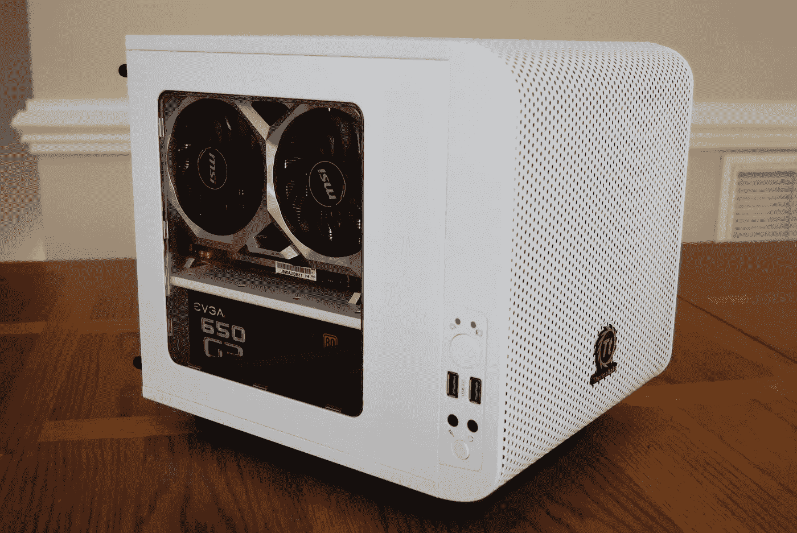
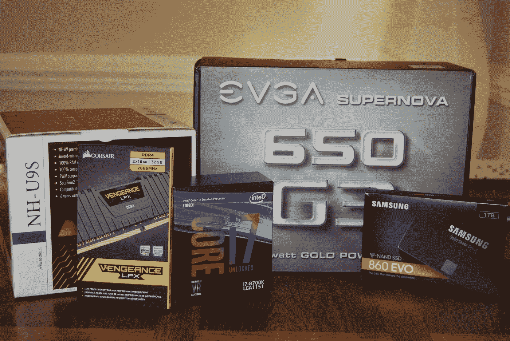
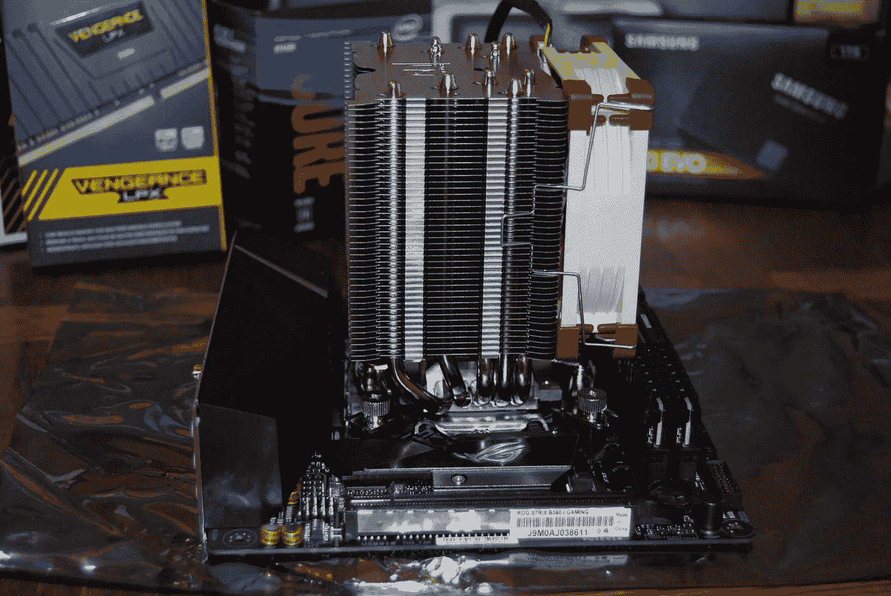
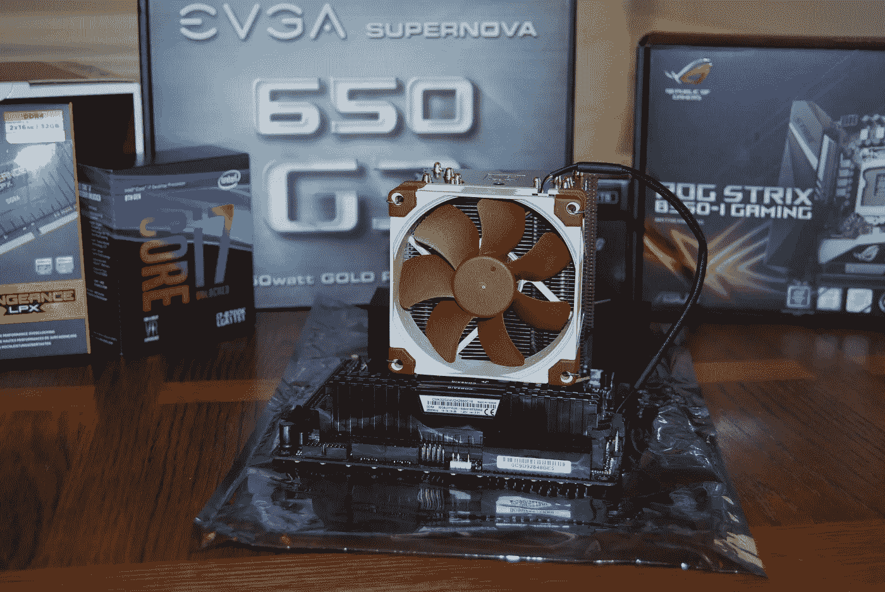
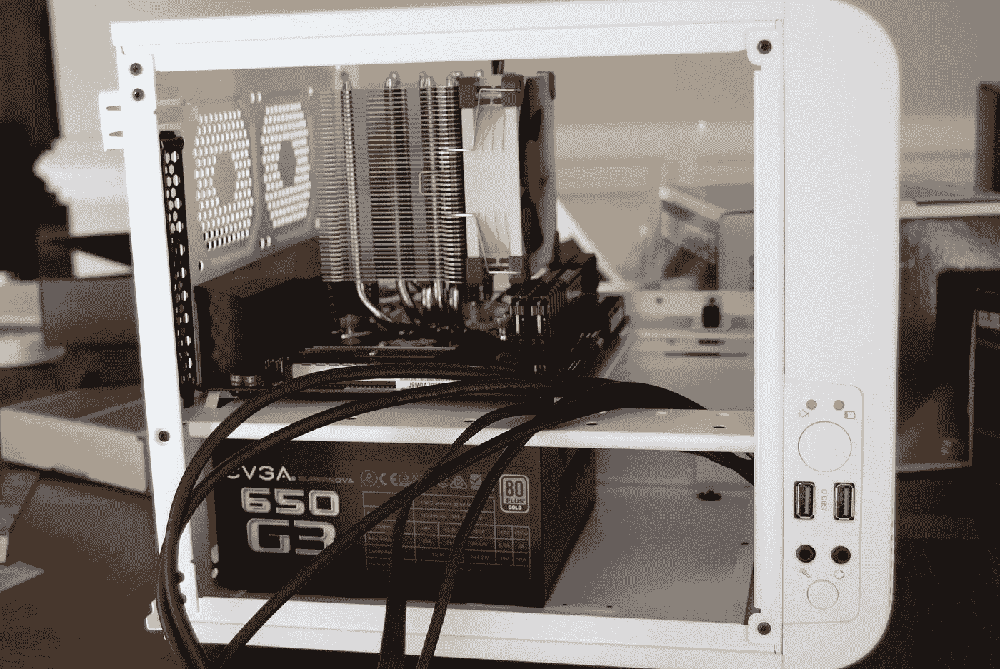
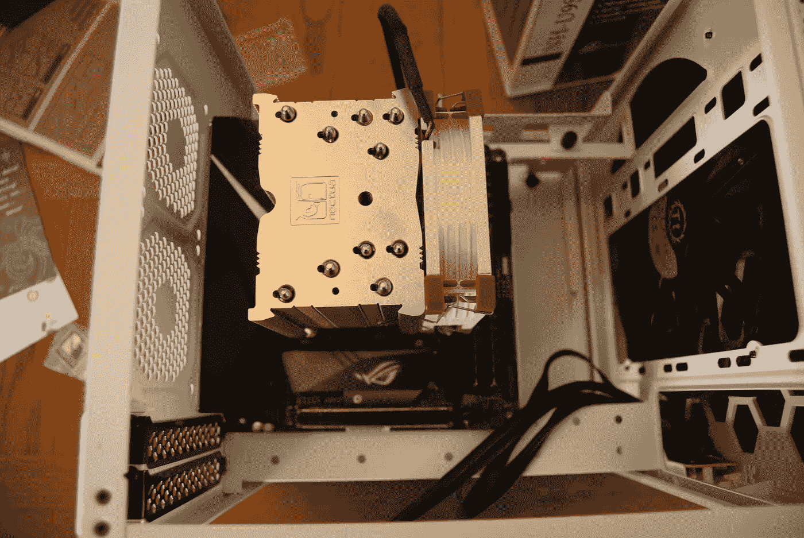
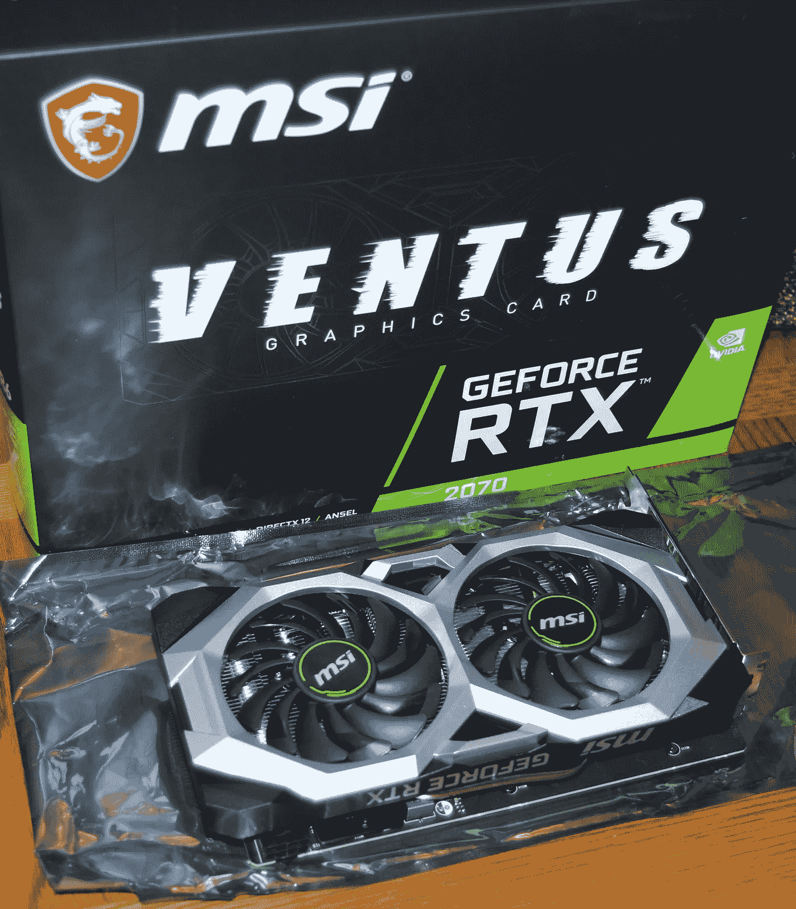
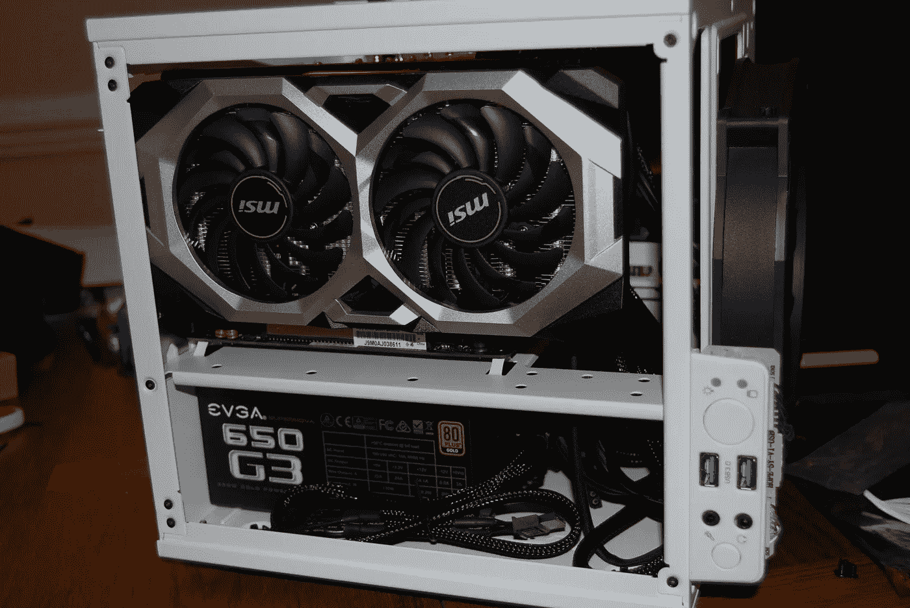
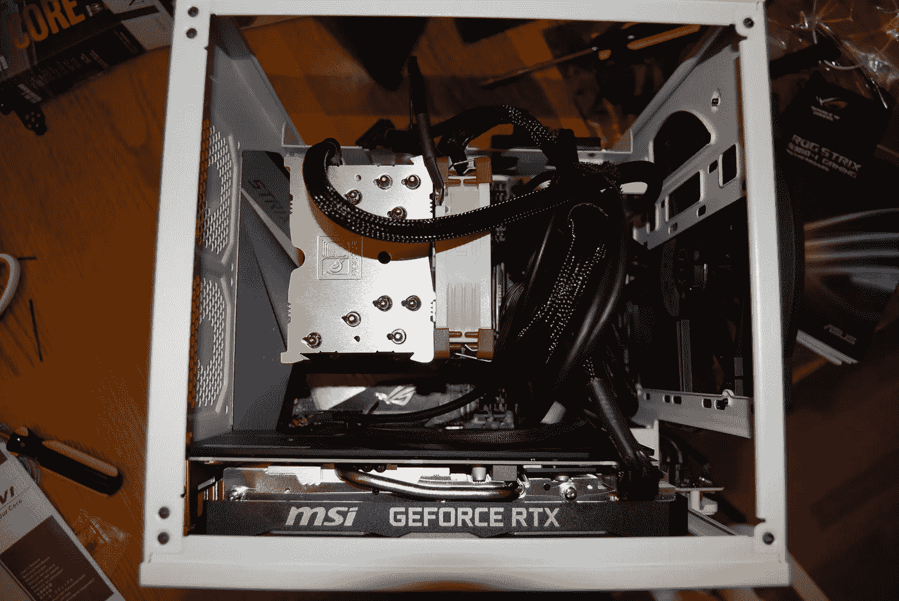
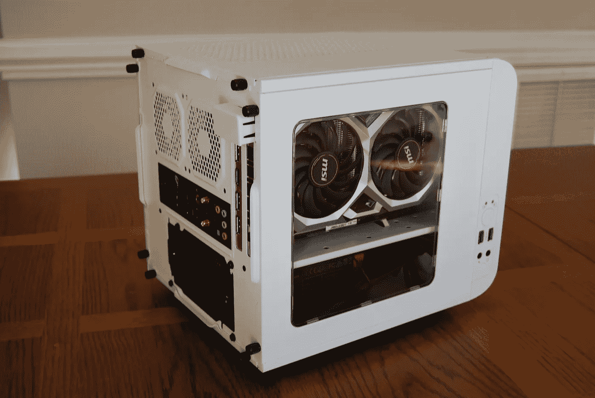

# 呆在家里？为什么不造一个 GPU 盒子！

> 原文：<https://towardsdatascience.com/stuck-at-home-why-not-build-a-gpu-box-ac93bee21786?source=collection_archive---------31----------------------->

## 构建定制计算机以适应深度学习模型(或玩 GTA V:)

作者图片

在使用机器学习应用程序工作了一段时间后，我很兴奋地尝试了一些深度学习模型。可能我在开始时面临的最大障碍是工作流，特别是找到一个可访问的、流动的 GPU 驱动的工作环境。我的 Mac Pro(被亲切地称为垃圾桶型号)没什么用。我开始使用云服务，但怀念在没有仪表运行的情况下拥有自己的存储数据和运行代码的地方。所以我决定自己造一个 GPU 盒子。起初，这是相当令人生畏的(大写 I)，但事情进行得相当顺利，最终结果是非常令人满意的。万一我的冒险对你有意思或有帮助，就在这里！

作者图片

# 母板

**华硕 ROG Strix B360-I**

我从移动电话开始。让我先说一下，如果你想使用多个 GPU，这个版本不会在没有修改的情况下适用于你的情况。我决定用单个 GPU 构建一个迷你 ITX 外形(即小型)的机器，因为这是我的第一次构建，我认为这将具有足够的挑战性。此外，我喜欢我的房子有一种装饰和组装的感觉，包括我的办公室。我并不是想创造一个拥有巨大霓虹灯塔的人类洞穴游戏天堂。但是我可以说，我爱这块板！对于游戏玩家来说，这是我为该系统购买的唯一一个 RGB 项目，它非常完美。但是在实际的构建中，真正的好处是内置的 I/O 屏蔽。正如一个有用的 youtube 游戏电脑组装先生指出的，安装防护罩可能是最具挑战性的部分。你已经是建造自己钻机的英雄了；你可以抓住机会而不会感到内疚。

# 情况

**Thermaltake Core V1 雪景版**

我在过程的早期就决定了这个案例，因为它决定了其他一些组件可能的大小。这也很有趣，因为有很多选择。我选择核心 V1 是因为，虽然它肯定是一个迷你，但它不是超级小，所以仍然有足够的空间来放置电缆等。一些需要注意的事情是:CPU 冷却器的高度，GPU 的长度，以及 3)电源的长度(PSU)。这个箱子设计得非常好。我喜欢这一事实，即董事会坐在垂直而不是侧面，所以你的组件不是“挂在亲爱的生活”作为一个评论家指出。

# 中央处理器

**英特尔酷睿 i7–8700k**

我想我可能在处理器上买多了。我必须有第 8 代才能适应主板，但型号中的“K”意味着处理器没有锁定，因此可以“超频”这是推动处理器比正常速度更快的游戏语言；然而，我的主板无论如何都不支持这个功能(它是 B 系列而不是 Z 系列)。

# CPU 冷却器/散热器

**配备 NF-A9 92 毫米风扇的 NOC tua NH-U9S**

冷却器可能是一台小机器上的一个地方，在那里你会多付一点钱，但这是我列表中评价最高的项目(评论者星级)。它仍然比许多液体冷却器便宜(尽管没有那么可爱)。另外，谁会因为东西太便宜而不愿意多花 30 美元就把它们烧掉呢？你会学会爱这个孩子的。

# 随机存取存储

**海盗船复仇 LPX 32GB(2x16GB)DDR 4 DRAM 2666 MHz**

对 RAM 没有太多评论。我决定最大限度地发挥董事会的作用。这些棍子位置很低，因此将风扇安装在散热器上清理它们并不困难。

# 储存；储备

**三星 860 EVO 1TB 2.5 英寸 SATA III SSD**

目前我有一个固态硬盘。箱子里有专门的空间，如果需要的话可以再加一秒钟。

# 到目前为止建筑

作者图片

作者图片

# 供电设备

**EVGA Supernova 650 G3，80 Plus Gold 650W，完全模块化**

对于 PSU，我使用了 GPU 指定的推荐功率(“完全模块化”意味着没有预先连接电缆，所以您只使用您需要的)。PSU 是我最担心能不能装进箱子里的部分，但它还是进去了。

作者图片

作者图片

# 国家政治保卫局。参见 OGPU

**微星 GeForce RTX 2070**

最后，也是最重要的部分。我选择 RTX 2070 是因为它的性价比。定制机器的另一个好处是，如果需要，你可以在未来相对容易地更新你的 GPU。

作者图片

作者图片

作者图片

# 成品

只要有一点计划和运气，这一切都非常适合！现在你已经完成了硬件，你可以开始安装软件，将你的机器变成一台深度学习机器。

作者图片