# 学生在 R 和手工中的 t 检验:如何在不同场景下比较两组

> 原文：<https://towardsdatascience.com/students-t-test-in-r-and-by-hand-how-to-compare-two-groups-under-different-scenarios-5ad79fce2130?source=collection_archive---------32----------------------->

## 学生对两个样本的 t 检验用于**检验两组是否不同，基于从这两组中抽取的两个样本**的比较。我们展示了如何在 r 中手工计算它。


照片由[杰森·登特](https://unsplash.com/@jdent?utm_source=medium&utm_medium=referral)拍摄

# 介绍

推断统计学分支中最重要的测试之一是学生的 t-测试。 [1](https://www.statsandr.com/blog/student-s-t-test-in-r-and-by-hand-how-to-compare-two-groups-under-different-scenarios/#fn1) 学生对两个样本的 t 检验用于**检验两组(两个群体)在一个定量变量**方面是否不同，**基于从这两组中抽取的两个样本**的比较。换句话说，一个学生对两个样本的 t 检验可以确定你的两个样本所来自的两个群体是否不同(这两个样本是在一个[定量连续](https://www.statsandr.com/blog/variable-types-and-examples/#continuous)变量上测量的)。 [2](https://www.statsandr.com/blog/student-s-t-test-in-r-and-by-hand-how-to-compare-two-groups-under-different-scenarios/#fn2)

这种统计检验背后的推理是，如果你的两个样本明显不同，可以假设从中抽取样本的两个总体是不同的。相反，如果两个样本相当相似，我们就不能拒绝两个群体相似的假设，所以在手头的数据中没有足够的证据可以得出样本从中抽取的两个群体是不同的结论。请注意，这种统计工具属于推断统计学的一个分支，因为从样本研究中得出的结论可以推广到总体，即使我们没有整个总体的数据。

为了比较两个样本，通常要比较每个样本的集中趋势。在学生 t 检验的情况下，[均值](https://www.statsandr.com/blog/descriptive-statistics-by-hand/#mean)用于比较两个样本。然而，在某些情况下，平均值不适于比较两个样本，因此通过[威尔科克森检验](https://www.statsandr.com/blog/wilcoxon-test-in-r-how-to-compare-2-groups-under-the-non-normality-assumption/)使用[中值](https://www.statsandr.com/blog/descriptive-statistics-by-hand/#median)来比较它们。这篇文章已经很长很完整了，Wilcoxon 测试在另一篇[文章](https://www.statsandr.com/blog/wilcoxon-test-in-r-how-to-compare-2-groups-under-the-non-normality-assumption/)中有所涉及，同时还有一些关于何时使用其中一种测试的说明。

这两种检验(Student’s t 检验和 Wilcoxon 检验)具有相同的最终目标，即比较两个样本，以确定从中抽取样本的两个群体是否不同。请注意，学生的 t 检验比 Wilcoxon 检验更有效(即，如果存在真正的差异，它更经常检测到显著差异，因此学生的 t 检验可以检测到较小的差异)，但学生的 t 检验对异常值和数据不对称很敏感。此外，在这两种测试的每一种中，都存在几个版本，每个版本使用不同的公式来得出最终结果。因此，有必要了解两种测试之间的差异以及使用哪种版本，以便根据问题和手头的数据进行适当的分析。

在本文中，我将首先一步一步地详细说明如何手工执行独立样本和配对样本的所有版本的学生 t 检验。为了说明和方便起见，将对一小组观察值进行分析。然后，我将展示如何用完全相同的数据在 R 中执行这个测试，以便验证手工发现的结果。还将介绍假设检验背后的推理、p 值和结果的解释以及该检验的假设。

请注意，本文的目的是展示如何用 R 手工计算学生的 t 检验，因此我们避免测试假设，并假设在本练习中所有假设都满足。为了完整性，我们仍然提到假设，如何测试它们，以及如果有一个不满足，还有什么其他测试。感兴趣的读者可以看看文章的[结尾，了解更多关于这些假设的信息。](https://www.statsandr.com/blog/student-s-t-test-in-r-and-by-hand-how-to-compare-two-groups-under-different-scenarios/#assumptions)

# 无效假设和替代假设

在开始手动计算学生的 t 检验之前，让我们回顾一下该检验的无效假设和替代假设:

*   H0: μ1=μ2
*   H1: μ1≠μ2

其中μ1 和μ2 是从中抽取样本的两个总体的平均值。

如简介中所述，虽然从技术上讲学生的 t 检验是基于两个样本的均值比较，但这种检验的最终目标实际上是检验以下假设:

*   H0:这两个群体很相似
*   H1:这两种人群是不同的

这是在一般情况下，我们只想确定两个群体是否**不同**(就因变量而言)。从这个意义上来说，我们事先并不认为某个特定群体比另一个群体大或小。这种测试被称为**双边**或双边测试。

如果我们对一个群体比另一个群体大或小有一些先验信念，学生的 t 检验也允许检验以下假设:

*   H0: μ1=μ2
*   H1: μ1>μ2

或者

*   H0: μ1=μ2
*   H1: μ1

In the first case, we want to test if the first population is significantly larger than the second, while in the latter case, we want to test if the first population is significantly smaller than the second. This type of test is referred as a **单边**或单边测试。

一些作者认为，在实践中不应该使用单边检验，原因很简单，如果一个研究人员如此确信一个群体比另一个群体大(小),并且永远不会比另一个群体小(大),为什么她还需要检验显著性呢？这是一个相当哲学的问题，超出了本文的范围。感兴趣的读者被邀请去看 Rowntree (2000)中的部分讨论。

# 假设检验

在统计学中，许多统计检验是以假设检验的形式进行的。假设检验用于根据手头的数据(即样本)确定某个信念是否为真(似是而非)。大多数假设检验可以归结为以下 4 个步骤: [3](https://www.statsandr.com/blog/student-s-t-test-in-r-and-by-hand-how-to-compare-two-groups-under-different-scenarios/#fn3)

1.  陈述无效假设和替代假设。
2.  计算测试统计量，表示为 t-stat。计算检验统计量的公式在不同版本的学生 t 检验中有所不同，但它们具有相同的结构。请参见下面的场景 1 至 5，了解不同的公式。
3.  给定测试的理论统计分布、分布参数和显著性水平α，找出临界值。对于一个学生的 t 检验及其扩展版本，要么是正态分布，要么是学生的 t 分布( *t* 表示学生分布， *z* 表示正态分布)。
4.  通过比较 t-stat(在步骤 2 中找到)得出结论。)与临界值(在步骤中找到。3).如果 t-stat 位于拒绝区域(由临界值和测试方向决定)，我们拒绝零假设，否则我们不拒绝零假设。这两个选项(拒绝或不拒绝零假设)是仅有的两个可能的解决方案，我们从不“接受”一个假设。总是根据最初的问题来解释决定也是一个好的做法。

# 学生 t 检验的不同版本

根据样本是独立的还是成对的，以及根据总体的方差，两个样本的学生 t 检验有几种版本:

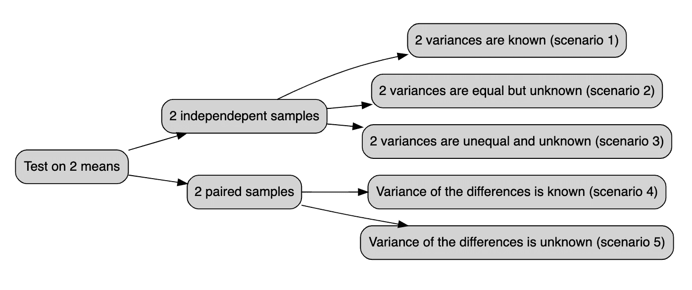

一方面，**独立**样本是指在**不同的**实验单位或不同的个体上采集的两个样本，例如当我们分别对女性和男性进行研究，或者对被随机分配到对照组和治疗组的患者进行研究时(一个患者只属于一个组)。另一方面，当测量是在**相同的**实验单元、相同的个体上收集时，我们面对**成对的**样本。例如在医学研究中，当在两个不同的时间测试治疗的效率时，经常会出现这种情况。在治疗前和治疗后，对相同的患者进行两次测量，在计算检验统计数据时，必须考虑两个样本之间的相关性，对每个受试者的测量值进行**差异**处理。成对样本通常是两个不同时间的测量结果，但不排除其他情况。假设我们要测试 50 名运动员左右眼的视力差异。虽然测量不是在两个不同的时间(之前-之后)进行的，但是很明显，每一个对象的双眼都是相互依赖的。因此，应该使用学生对成对样本的 t 检验来说明两个样本之间的相关性，而不是标准的学生对独立样本的 t 检验。

选择合适的学生 t 检验版本的另一个标准是总体的方差(不是样本的方差！)是已知的或未知的，是相等的或不相等的。这个标准相当简单，我们要么知道总体的方差，要么不知道。无法计算总体的方差，因为如果您可以计算总体的方差，这意味着您有整个总体的数据，那么就没有必要再进行假设检验了…所以总体的方差要么在语句中给出(在这种情况下使用它们)，要么没有关于这些方差的信息，在这种情况下，假设方差是未知的。在实践中，总体的方差在大多数情况下是未知的，为了选择合适的测试版本，唯一要做的就是检查方差是否相等。然而，在假设检验的 4 个步骤之后的下一节中，我们仍然说明了如何手工和在 R 中做这个检验的所有版本。

# 如何手工计算学生的 t-test？

请注意，这些数据是人为的，并不代表任何真实的变量。此外，提醒可能满足也可能不满足假设。本文的重点是详细说明如何手工和在 R 中计算不同版本的测试，所以所有的假设都被假定为满足。此外，假设所有测试的显著性水平α=5%。

如果你对手工应用这些测试感兴趣，而不需要自己做计算，这里有一个[闪亮的应用程序](https://www.statsandr.com/blog/a-shiny-app-for-inferential-statistics-by-hand)可以帮你做。你只需要输入数据，并通过侧边栏菜单选择合适的测试版本。还有一个图形表示，帮助您可视化测试统计和拒绝区域。希望你会觉得有用！

# 场景 1:具有 2 个已知方差的独立样本

对于第一个场景，假设下面的数据。此外，假设两个样本是独立的，两个总体的方差都等于 1，并且我们想检验两个总体是否不同。

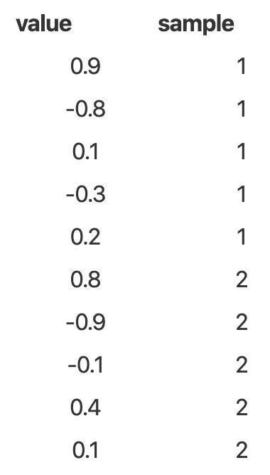

所以我们有:

*   每个样本中的 5 个观察值:n1=n2=5
*   样本 1 的平均值= 0.02
*   样本 2 的平均值= 0.06
*   两个总体的方差= 1

按照假设检验的 4 个步骤，我们有:

1.  H0: μ1=μ2，H1:μ1μ2≠0。(≠因为要测试两种手段是否不同，所以在测试中不强加方向。)
2.  测试统计:

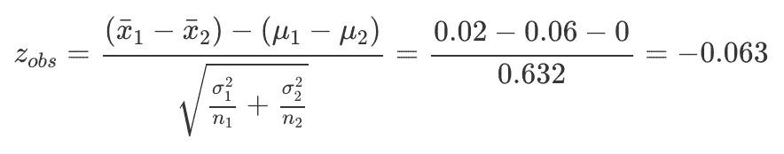

3.临界值:z(α/2)= z(0.025)= 1.96(如果你很难找到临界值，请参见[如何阅读统计表](https://www.statsandr.com/blog/a-guide-on-how-to-read-statistical-tables)的指南)

4.结论:因此，拒绝区域从∞到-1.96 和从 1.96 到+∞。检验统计量在拒绝区域之外，所以我们不拒绝零假设 H0。就最初的问题而言:在 5%的显著性水平上，我们不排斥两个总体相同的假设，或者数据中没有足够的证据可以得出所考虑的两个总体不同的结论。

# 场景 2:具有 2 个相等但未知方差的独立样本

对于第二种情况，假设下面的数据。此外，假设两个样本是独立的，两个总体中的方差未知但相等，并且我们想测试总体 1 是否大于总体 2。


所以我们有:

*   样本 1 中的 6 个观察值:n1=6
*   样本 2 中的 5 个观察值:n2=5
*   样本 1 的平均值= 1.247
*   样本 2 的平均值= 0.1
*   样本 1 的方差= 0.303
*   样本 2 的方差= 0.315

按照假设检验的 4 个步骤，我们有:

1.  H0: μ1=μ2，H1:μ1-μ2 > 0。(>因为我们要检验第一个总体的均值是否大于第二个总体的均值。)
2.  测试统计:

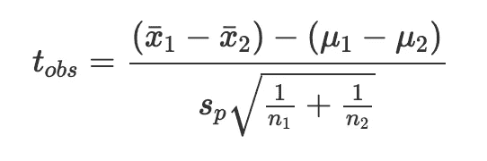

在哪里

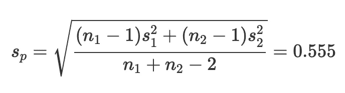

因此

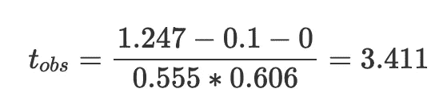

(请注意，由于假设两个总体的方差相等，因此会计算一个混合(公共)方差，表示为 s_p。)

3.临界值:t(α，n1+N2 2)= t(0.05，9)=1.833

4.结论:拒绝区域因此从 1.833 到+∞(只有一个拒绝区域，因为它是单侧测试)。检验统计量位于拒绝区域内，因此我们拒绝零假设 H0。就最初的问题而言:在 5%的显著性水平上，我们得出的结论是，总体 1 大于总体 2。

# 场景 3:具有 2 个不相等且未知方差的独立样本

对于第三种情况，假设下面的数据。此外，假设两个样本是独立的，两个总体中的方差都是未知且不相等的，并且我们想要检验总体 1 是否小于总体 2。

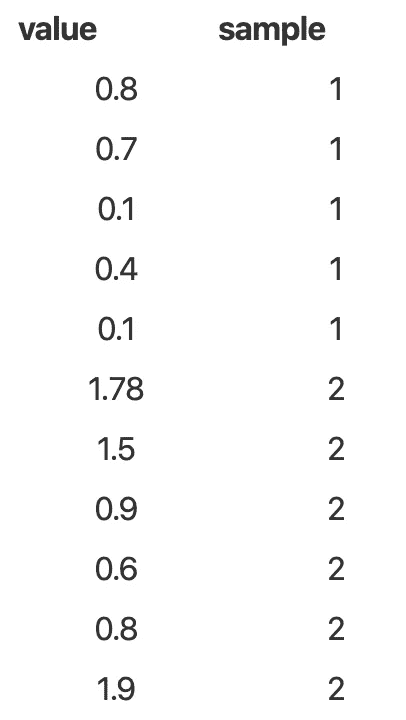

所以我们有:

*   样本 1 中的 5 个观察值:n1=5
*   样本 2 中的 6 个观察值:n2=6
*   样本 1 的平均值= 0.42
*   样本 2 的平均值= 1.247
*   样本 1 的方差= 0.107
*   样本 2 的方差= 0.303

按照假设检验的 4 个步骤，我们有:

1.  H0: μ1=μ2，H1:μ1-μ2 < 0。(
2.  测试统计:

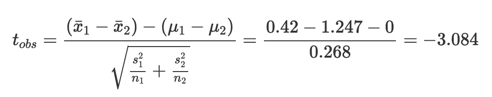

3.临界值:t(α，υ)其中

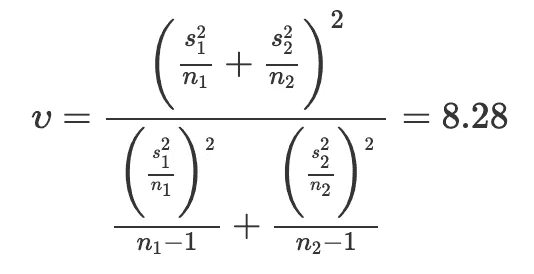

因此

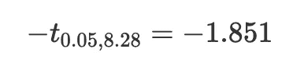

自由度 8.28 在标准学生分布表中是不存在的，那就简单的取 8，或者用`qt(p = 0.05, df = 8.28)`在 R 中计算。

4.结论:因此，拒绝区域从∞到-1.851。检验统计量位于拒绝区域内，因此我们拒绝零假设 H0。就最初的问题而言:在 5%的显著性水平上，我们的结论是总体 1 小于总体 2。

# 场景 4:差异方差已知的配对样本

成对样本的学生 t 检验与独立样本的稍有不同，它们实际上更类似于单个样本的学生 t 检验。这是它的工作原理。我们实际上计算每对观察值的两个样本之间的差异，然后我们通过计算这些差异的检验统计量来处理这些差异，就像我们在做单样本学生 t 检验一样。

如果不清楚的话，这里有第四个场景作为说明。假设下面的数据。此外，假设两个样本是相关的(匹配的)，总体差异的方差已知且等于 1，并且我们想测试总体差异是否不等于 0。

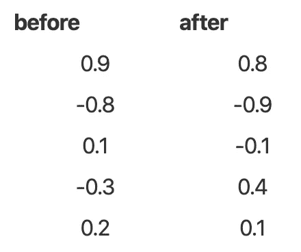

首先要做的是计算所有观测值对的差异:

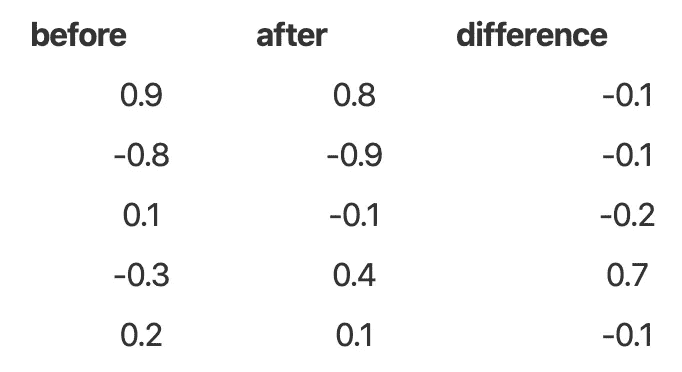

所以我们有:

*   对数:n=5
*   差异的平均值= 0.04
*   总体差异的方差= 1
*   总体差异的标准偏差= 1

按照假设检验的 4 个步骤，我们有:

1.  H0: μD=0，H1: μD≠0
2.  测试统计:

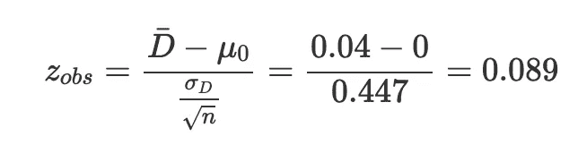

(这个公式与一个样本学生的方差已知的 t 检验公式完全相同，只是我们处理的是方差的平均值。)

3.临界值:z(α/2)= z(0.025)= 1.96

4.结论:因此，拒绝区域从∞到-1.96 和从 1.96 到+∞。检验统计量在拒绝区域之外，所以我们不拒绝零假设 H0。就最初的问题而言:在 5%的显著性水平上，我们不拒绝两个总体的差异等于 0 的假设。

# 场景 5:差异方差未知的配对样本

对于第五个也是最后一个场景，假设下面的数据。此外，假设两个样本是相关的(匹配的)，总体差异的方差是未知的，并且我们想测试一种治疗在增加跑步能力方面是否有效(数值越高，跑步能力越好)。

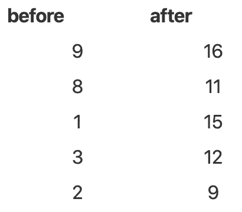

首先要做的是计算所有观测值对的差异:

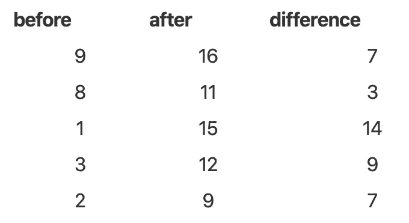

所以我们有:

*   对数:n=5
*   差异的平均值= 8
*   样本差异的方差= 16
*   样本差异的标准偏差= 4

按照假设检验的 4 个步骤，我们有:

1.  H0: μD=0 和 H1: μD>0(>因为我们想测试治疗是否有效，所以治疗是否对跑步能力有积极影响。)
2.  测试统计:

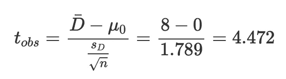

(这个公式与一个样本学生的方差未知的 t 检验公式完全相同，只是我们处理的是方差的平均值。)

3.临界值:t(α，n1)= t(0.05，4)=2.132 ( *n* 是对数，不是观测数！)

4.结论:拒绝域从 2.132 到+∞。检验统计量位于拒绝区域内，因此我们拒绝零假设 H0。根据最初的问题:在 5%的显著性水平，我们得出结论，治疗对跑步能力有积极的影响。

这里总结了如何手工对两个样本执行不同版本的学生 t 检验。在接下来的小节中，我们将详细介绍如何在 r 中执行完全相同的测试。

# 如何计算学生在 R 中的 t 检验？

在 R 中进行 t-tests 之前，一个好的实践是借助箱线图(或者[密度图](https://www.statsandr.com/blog/descriptive-statistics-in-r/#density-plot)，或者最终两者都有)按组可视化数据。两个方框相互重叠的箱线图给出了两个样本相似的第一个指示，因此，可以不拒绝相等平均值的零假设。相反，如果两个框不重叠，则表明两个样本不相似，因此，群体可能不同。然而，即使箱线图或密度图能很好地显示两组之间的比较，只有可靠的统计测试才能证实我们的第一印象。

在按组可视化数据后，我们在 R 中复制手工发现的结果。我们将看到，对于 t-test 的某些版本，R 中没有内置默认函数(至少就我所知，如果我弄错了，请不要犹豫让我知道)。在这些情况下，编写一个函数来手动复制结果。

请注意，我们对所有 5 个场景使用了相同的数据、相同的假设和相同的问题，以便于比较手工测试和 r。

# 场景 1:具有 2 个已知方差的独立样本

对于第一个场景，假设下面的数据。此外，假设两个样本是独立的，两个总体的方差都等于 1，并且我们想检验两个总体是否不同。

```
dat1 <- data.frame(
  sample1 = c(0.9, -0.8, 0.1, -0.3, 0.2),
  sample2 = c(0.8, -0.9, -0.1, 0.4, 0.1)
)
dat1##   sample1 sample2
## 1     0.9     0.8
## 2    -0.8    -0.9
## 3     0.1    -0.1
## 4    -0.3     0.4
## 5     0.2     0.1dat_ggplot <- data.frame(
  value = c(0.9, -0.8, 0.1, -0.3, 0.2, 0.8, -0.9, -0.1, 0.4, 0.1),
  sample = c(rep("1", 5), rep("2", 5))
)library(ggplot2)ggplot(dat_ggplot) +
  aes(x = sample, y = value) +
  geom_boxplot() +
  theme_minimal()
```

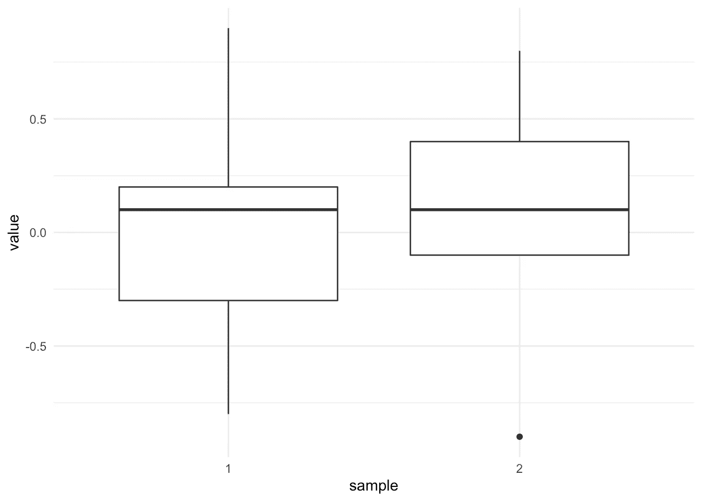

注意，如果你想用[包](https://www.statsandr.com/blog/graphics-in-r-with-ggplot2/) `[{ggplot2}](https://www.statsandr.com/blog/graphics-in-r-with-ggplot2/)`画一个方框图而不自己写代码，你可以使用`[{esquisse}](https://www.statsandr.com/blog/rstudio-addins-or-how-to-make-your-coding-life-easier/#esquisse)` [RStudio addin](https://www.statsandr.com/blog/rstudio-addins-or-how-to-make-your-coding-life-easier/#esquisse) 。如果你喜欢默认图形，使用`boxplot()`功能:

```
boxplot(value ~ sample,
  data = dat_ggplot
)
```

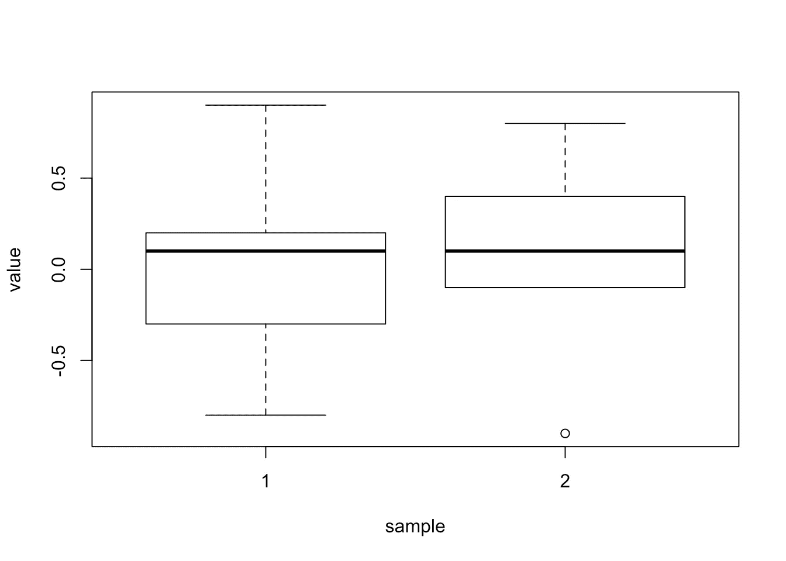

这两个方框似乎重叠，说明这两个样本非常相似，因此我们倾向于认为我们无法拒绝两个总体相似的零假设。然而，只有正式的统计测试才能证实这一观点。

由于 R 中没有使用已知方差来执行 t 检验的函数，因此这里有一个函数，其参数接受两个样本(`x`和`y`)、总体的两个方差(`V1`和`V2`)、零假设下均值的差异(`m0`，默认为`0`)、显著性水平(`alpha`，默认为`0.05`)以及备选项(`alternative`、`"two.sided"`(默认)、`"less"`或`"greater"`之一):

```
t.test_knownvar <- function(x, y, V1, V2, m0 = 0, alpha = 0.05, alternative = "two.sided") {
  M1 <- mean(x)
  M2 <- mean(y)
  n1 <- length(x)
  n2 <- length(y)
  sigma1 <- sqrt(V1)
  sigma2 <- sqrt(V2)
  S <- sqrt((V1 / n1) + (V2 / n2))
  statistic <- (M1 - M2 - m0) / S
  p <- if (alternative == "two.sided") {
    2 * pnorm(abs(statistic), lower.tail = FALSE)
  } else if (alternative == "less") {
    pnorm(statistic, lower.tail = TRUE)
  } else {
    pnorm(statistic, lower.tail = FALSE)
  }
  LCL <- (M1 - M2 - S * qnorm(1 - alpha / 2))
  UCL <- (M1 - M2 + S * qnorm(1 - alpha / 2))
  value <- list(mean1 = M1, mean2 = M2, m0 = m0, sigma1 = sigma1, sigma2 = sigma2, S = S, statistic = statistic, p.value = p, LCL = LCL, UCL = UCL, alternative = alternative)
  # print(sprintf("P-value = %g",p))
  # print(sprintf("Lower %.2f%% Confidence Limit = %g",
  #               alpha, LCL))
  # print(sprintf("Upper %.2f%% Confidence Limit = %g",
  #               alpha, UCL))
  return(value)
}test <- t.test_knownvar(dat1$sample1, dat1$sample2,
  V1 = 1, V2 = 1
)
test## $mean1
## [1] 0.02
## 
## $mean2
## [1] 0.06
## 
## $m0
## [1] 0
## 
## $sigma1
## [1] 1
## 
## $sigma2
## [1] 1
## 
## $S
## [1] 0.6324555
## 
## $statistic
## [1] -0.06324555
## 
## $p.value
## [1] 0.949571
## 
## $LCL
## [1] -1.27959
## 
## $UCL
## [1] 1.19959
## 
## $alternative
## [1] "two.sided"
```

以上输出概括了执行测试所需的所有信息:测试统计量、*p*-值、所用替代方案、两个样本平均值和总体的两个方差(将 R 中的结果与手工找到的结果进行比较)。

*p*-值可以照常提取:

```
test$p.value## [1] 0.949571
```

*p*-值为 0.95，因此在 5%显著性水平下，我们不拒绝相等平均值的零假设。数据中没有足够的证据拒绝这两种方法在人群中相似的假设。这个结果证实了我们手工发现的东西。

# 关于 p 值和显著性水平α的注记

对于那些不熟悉*p*-值概念的人来说，*p*-值是一个[概率](https://www.statsandr.com/blog/the-9-concepts-and-formulas-in-probability-that-every-data-scientist-should-know/)，和任何概率一样，它是从 0 到 1。***p*-值是在零假设为真的情况下，观察结果与我们测量的结果(通过样本)一样极端的概率**。换句话说，假设零假设是真的，它是测试统计量和我们计算的一样极端的概率。如果观察结果不那么极端——如果零假设是真的，也不太可能发生——我们不会拒绝这个零假设，因为它被认为是可信的。如果这些观察结果被认为过于极端——在零假设的情况下不太可能发生——我们会拒绝零假设，因为它被认为太不可信而不真实。请注意，这并不意味着我们 100%确定这种可能性太大，有时会出现零假设被拒绝的情况，尽管它是真的(参见后面的显著性水平α)。

在上面的例子中，观察结果并不极端，两个平均值之间的差异也不极端，因此检验统计量也不极端(因为检验统计量部分基于两个样本平均值的差异)。拥有一个非极端的检验统计量并非不可能，这就是为什么 *p* 值很高的原因。*p*-0.95 的值实际上告诉我们，假设群体中的平均值差异为 0(零假设)，则两个样本的平均值差异为-0.04(= 0.02–0.06)的概率等于 95%。95%的概率被明确认为是合理的，因此我们并不拒绝总体均值相等的零假设。

人们可能会想，“对于一个测试统计来说，什么太极端了？”大多数时候，我们认为，假设零假设为真，当出现这种极端检验统计量的概率低于 5%时，检验统计量过于极端，不可能偶然发生。你在统计学课程或教科书中非常经常看到的 5% (α=0.05)的阈值是许多领域使用的阈值。当一个*p*-值低于 5%的阈值时，我们认为如果零假设为真，观察值(以及测试统计量)是**不太可能**偶然发生，因此零假设被拒绝。当一个*p*-值高于 5%的阈值时，我们认为，如果零假设是真的，面对我们所得到的观察结果并不是不合理的，因此我们不拒绝零假设。

注意，我写的是“我们不拒绝零假设”，而不是“我们接受零假设”。这是因为有可能零假设事实上是错误的，但我们无法用样本证明这一点。假设一个嫌疑犯被指控谋杀，而我们不知道真相。一方面，如果我们收集了足够的证据证明嫌疑犯犯了谋杀罪，他就被认为有罪:我们拒绝他是无辜的无效假设。另一方面，如果我们没有收集到足够的对嫌疑犯不利的证据，尽管他可能实际上犯了罪，他还是被假定是无辜的:我们不能拒绝他是无辜的无效假设。即使他被释放了，我们也不能确定他没有犯罪，我们只是没有找到足够的证据来反对嫌疑人无罪的假设。这就是为什么我们不拒绝零假设，而是接受它的原因，也是为什么你会经常读到“数据中没有足够的证据来拒绝零假设”或“基于样本，我们无法拒绝零假设”之类的话。

**显著性水平** α，来源于前面提到的阈值 5%，**是当零假设事实上为真时拒绝零假设的概率**。在这个意义上，为了能够得出结论，我们接受处理的是一个误差(5%)。如果我们不接受任何误差(0%的误差)，我们将无法得出关于总体的任何结论，因为我们只能通过样本访问有限部分的总体。因此，在解释假设检验的结果时，我们永远不会有 100%的把握，除非我们可以获得整个群体的数据，但这样就没有理由再做假设检验了，因为我们可以简单地比较两个群体。我们通常允许这种误差(称为 I 型误差)为 5%，但为了在得出我们拒绝零假设的结论时更加确定，alpha 水平也可以设置为 1%(在一些罕见的情况下甚至可以设置为 0.1%)。

**总结一下**关于 *p* 你需要记住的——值和显著性水平α:

*   如果 *p* 值小于预定的显著性水平α(通常为 5%)，那么如果 *p* 值<为 0.05，我们拒绝零假设
*   如果 *p* 值大于或等于预定的显著性水平α(通常为 5%)，那么如果 *p* 值≥ 0.05，我们不**拒绝**零假设

这毫无例外地适用于所有的统计测试。当然，无效假设和替代假设会随着测试的不同而变化。

经验法则是，对于大多数假设检验来说，替代假设是你想要检验的，而无效假设是现状。带着这个极度谨慎(！)因为，即使它适用于所有版本的学生 t 检验，它也不适用于所有的统计检验。例如，当测试正态性时，您通常希望测试您的分布是否遵循正态分布。根据这条建议，你可以写出另一个假设 H1:分布遵循正态分布。然而，对于正态性检验，如夏皮罗-维尔克或科尔莫戈罗夫-斯米尔诺夫检验，情况正好相反；另一个假设是 H1:分布不遵循正态分布。所以对于每个测试，确保使用正确的假设，否则你的测试的结论和解释将是错误的。

# 场景 2:具有 2 个相等但未知方差的独立样本

对于第二种情况，假设下面的数据。此外，假设两个样本是独立的，两个总体中的方差未知但相等，并且我们想测试总体 1 是否大于总体 2。

```
dat2 <- data.frame(
  sample1 = c(1.78, 1.5, 0.9, 0.6, 0.8, 1.9),
  sample2 = c(0.8, -0.7, -0.1, 0.4, 0.1, NA)
)
dat2##   sample1 sample2
## 1    1.78     0.8
## 2    1.50    -0.7
## 3    0.90    -0.1
## 4    0.60     0.4
## 5    0.80     0.1
## 6    1.90      NAdat_ggplot <- data.frame(
  value = c(1.78, 1.5, 0.9, 0.6, 0.8, 1.9, 0.8, -0.7, -0.1, 0.4, 0.1),
  sample = c(rep("1", 6), rep("2", 5))
)ggplot(dat_ggplot) +
  aes(x = sample, y = value) +
  geom_boxplot() +
  theme_minimal()
```

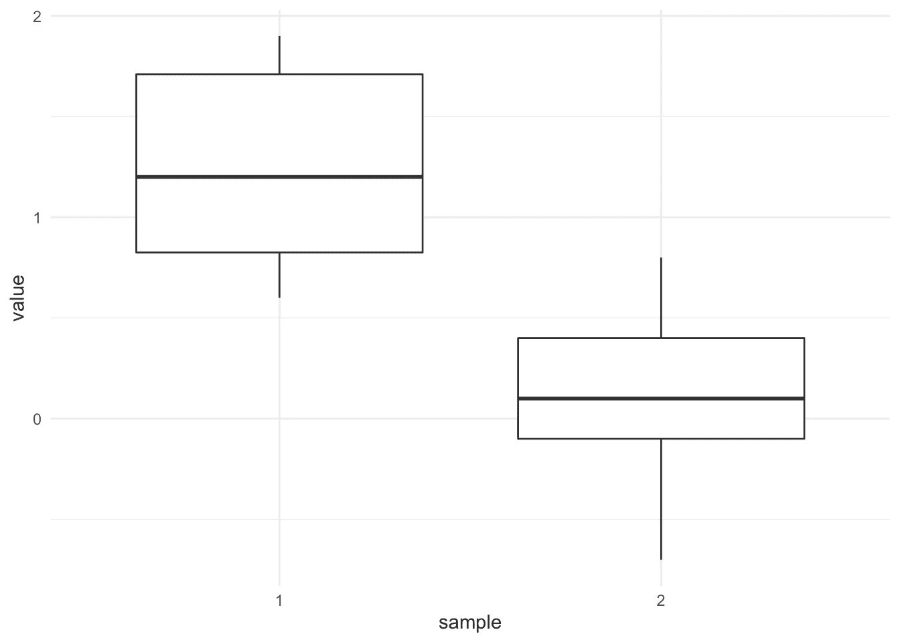

与前面的场景不同，这两个框没有重叠，这说明这两个样本彼此不同。从这个箱线图中，我们可以预期该检验会拒绝总体均值相等的零假设。尽管如此，只有正式的统计测试才能证实这一预期。

R 里面有一个函数，简单来说就是`t.test()`函数。这个版本的测试实际上是“标准”学生对两个样本的 t 检验。请注意，假设两个总体的方差相等，因此我们需要在函数中用参数`var.equal = TRUE`(默认为`FALSE`)指定它，另一个假设是 H1:μ1-μ2>0，因此我们还需要添加参数`alternative = "greater"`:

```
test <- t.test(dat2$sample1, dat2$sample2,
  var.equal = TRUE, alternative = "greater"
)
test## 
##  Two Sample t-test
## 
## data:  dat2$sample1 and dat2$sample2
## t = 3.4113, df = 9, p-value = 0.003867
## alternative hypothesis: true difference in means is greater than 0
## 95 percent confidence interval:
##  0.5304908       Inf
## sample estimates:
## mean of x mean of y 
##  1.246667  0.100000
```

上面的输出概括了执行测试所需的所有信息:测试的名称、测试统计、自由度、*p*-值、使用的备选项和两个样本均值(将 R 中找到的这些结果与手动找到的结果进行比较)。

可以照常提取 *p* 值:

```
test$p.value## [1] 0.003866756
```

*p*-值为 0.004，因此在 5%的显著性水平上，我们拒绝相等平均值的零假设。这个结果证实了我们手工发现的东西。

与第一个场景不同，这个场景中的*p*-值低于 5%，因此我们拒绝零假设。在 5%的显著性水平上，我们可以得出人口 1 大于人口 2 的结论。

在 R 中报告学生 t-test 结果的一种简单而又好的方法是使用`{report}`包中的`report()`函数:

```
# install.packages("remotes")
# remotes::install_github("easystats/report") # You only need to do that once
library("report") # Load the package every time you start Rreport(test)## Effect sizes were labelled following Cohen's (1988) recommendations.
## 
## The Two Sample t-test testing the difference between dat2$sample1 and dat2$sample2 (mean of x = 1.25, mean of y = 0.10) suggests that the effect is positive, significant and large (difference = 1.15, 95% CI [0.53, Inf], t(9) = 3.41, p < .01; Cohen's d = 2.07, 95% CI [0.52, 3.55])
```

如您所见，该函数为您解释了测试(以及*p*-值)。

注意`report()`功能可用于其他分析。如果你觉得这个有用，请查看 R 中的更多[提示和技巧。](https://statsandr.com/blog/tips-and-tricks-in-rstudio-and-r-markdown/)

如果您的数据是长格式(长格式更好)，只需使用`~`。例如，想象完全相同的数据如下所示:

```
dat2bis <- data.frame(
  value = c(1.78, 1.5, 0.9, 0.6, 0.8, 1.9, 0.8, -0.7, -0.1, 0.4, 0.1),
  sample = c(rep("1", 6), rep("2", 5))
)
dat2bis##    value sample
## 1   1.78      1
## 2   1.50      1
## 3   0.90      1
## 4   0.60      1
## 5   0.80      1
## 6   1.90      1
## 7   0.80      2
## 8  -0.70      2
## 9  -0.10      2
## 10  0.40      2
## 11  0.10      2
```

下面是如何用长数据在 R 中执行学生的 t 检验:

```
test <- t.test(value ~ sample,
  data = dat2bis,
  var.equal = TRUE,
  alternative = "greater"
)
test## 
##  Two Sample t-test
## 
## data:  value by sample
## t = 3.4113, df = 9, p-value = 0.003867
## alternative hypothesis: true difference in means is greater than 0
## 95 percent confidence interval:
##  0.5304908       Inf
## sample estimates:
## mean in group 1 mean in group 2 
##        1.246667        0.100000test$p.value## [1] 0.003866756
```

结果完全一样。

# 场景 3:具有 2 个不相等且未知方差的独立样本

对于第三种情况，假设下面的数据。此外，假设两个样本是独立的，两个总体中的方差都是未知且不相等的，并且我们想要检验总体 1 是否小于总体 2。

```
dat3 <- data.frame(
  value = c(0.8, 0.7, 0.1, 0.4, 0.1, 1.78, 1.5, 0.9, 0.6, 0.8, 1.9),
  sample = c(rep("1", 5), rep("2", 6))
)
dat3##    value sample
## 1   0.80      1
## 2   0.70      1
## 3   0.10      1
## 4   0.40      1
## 5   0.10      1
## 6   1.78      2
## 7   1.50      2
## 8   0.90      2
## 9   0.60      2
## 10  0.80      2
## 11  1.90      2ggplot(dat3) +
  aes(x = sample, y = value) +
  geom_boxplot() +
  theme_minimal()
```


对于这个版本的测试，R 中也有一个函数，它就是带有`var.equal = FALSE`参数的`t.test()`函数。`FALSE`是`var.equal`参数的默认选项，因此您实际上不需要指定它。这个版本的检验实际上是韦尔奇检验，当总体的方差未知且不相等时使用。要测试两个方差是否相等，可以使用 Levene 的测试(`{car}`包中的`leveneTest(dat3$value, dat3$sample)`)。请注意，另一个假设是 H1:μ1-μ2<0，因此我们还需要添加参数`alternative = "less"`:

```
test <- t.test(value ~ sample,
  data = dat3,
  var.equal = FALSE,
  alternative = "less"
)
test## 
##  Welch Two Sample t-test
## 
## data:  value by sample
## t = -3.0841, df = 8.2796, p-value = 0.007206
## alternative hypothesis: true difference in means is less than 0
## 95 percent confidence interval:
##        -Inf -0.3304098
## sample estimates:
## mean in group 1 mean in group 2 
##        0.420000        1.246667
```

上面的输出概括了执行测试所需的所有信息(将 R 中找到的结果与手工找到的结果进行比较)。

可以照常提取 *p* 值:

```
test$p.value## [1] 0.00720603
```

*p*-值为 0.007，因此在 5%的显著性水平上，我们拒绝了均值相等的零假设，这意味着我们可以得出人口 1 小于人口 2 的结论。这个结果证实了我们手工发现的东西。

# 场景 4:差异方差已知的配对样本

对于第四种情况，假设下面的数据。此外，假设两个样本是相关的(匹配的)，总体差异的方差已知且等于 1，并且我们想测试总体差异是否不等于 0。

```
dat4 <- data.frame(
  before = c(0.9, -0.8, 0.1, -0.3, 0.2),
  after = c(0.8, -0.9, -0.1, 0.4, 0.1)
)
dat4##   before after
## 1    0.9   0.8
## 2   -0.8  -0.9
## 3    0.1  -0.1
## 4   -0.3   0.4
## 5    0.2   0.1dat4$difference <- dat4$after - dat4$beforeggplot(dat4) +
  aes(y = difference) +
  geom_boxplot() +
  theme_minimal()
```

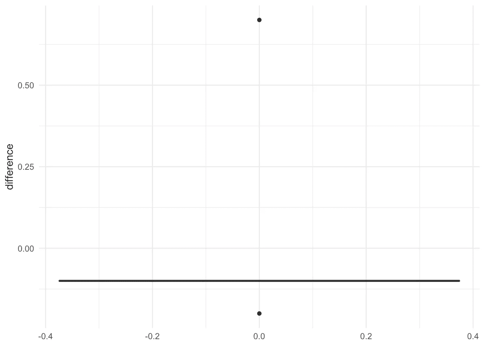

由于 R 中没有函数在已知差异方差的情况下对成对样本执行 t 检验，因此这里有一个函数的参数接受两个样本之间的差异(`x`)、总体差异方差(`V`)、零假设下的差异均值(`m0`，默认为`0`)、显著性水平(`alpha`，默认为`0.05`)以及备选项(`alternative`、`"two.sided"`(默认)、`"less"`或`"greater"`):

```
t.test_pairedknownvar <- function(x, V, m0 = 0, alpha = 0.05, alternative = "two.sided") {
  M <- mean(x)
  n <- length(x)
  sigma <- sqrt(V)
  S <- sqrt(V / n)
  statistic <- (M - m0) / S
  p <- if (alternative == "two.sided") {
    2 * pnorm(abs(statistic), lower.tail = FALSE)
  } else if (alternative == "less") {
    pnorm(statistic, lower.tail = TRUE)
  } else {
    pnorm(statistic, lower.tail = FALSE)
  }
  LCL <- (M - S * qnorm(1 - alpha / 2))
  UCL <- (M + S * qnorm(1 - alpha / 2))
  value <- list(mean = M, m0 = m0, sigma = sigma, statistic = statistic, p.value = p, LCL = LCL, UCL = UCL, alternative = alternative)
  # print(sprintf("P-value = %g",p))
  # print(sprintf("Lower %.2f%% Confidence Limit = %g",
  #               alpha, LCL))
  # print(sprintf("Upper %.2f%% Confidence Limit = %g",
  #               alpha, UCL))
  return(value)
}test <- t.test_pairedknownvar(dat4$after - dat4$before,
  V = 1
)
test## $mean
## [1] 0.04
## 
## $m0
## [1] 0
## 
## $sigma
## [1] 1
## 
## $statistic
## [1] 0.08944272
## 
## $p.value
## [1] 0.9287301
## 
## $LCL
## [1] -0.8365225
## 
## $UCL
## [1] 0.9165225
## 
## $alternative
## [1] "two.sided"
```

上面的输出概括了执行测试所需的所有信息(将 R 中找到的结果与手工找到的结果进行比较)。

可以照常提取*p*-值:

```
test$p.value## [1] 0.9287301
```

*p*-值为 0.929，因此在 5%的显著性水平上，我们不拒绝差异均值等于 0 的零假设。数据中没有足够的证据否定两个人群的差异等于 0 的假设。这个结果证实了我们手工发现的东西。

# 场景 5:差异方差未知的配对样本

对于第五个也是最后一个场景，假设下面的数据。此外，假设两个样本是相关的(匹配的)，总体差异的方差是未知的，并且我们想测试一种治疗在增加跑步能力方面是否有效(数值越高，跑步能力越好)。

```
dat5 <- data.frame(
  before = c(9, 8, 1, 3, 2),
  after = c(16, 11, 15, 12, 9)
)
dat5##   before after
## 1      9    16
## 2      8    11
## 3      1    15
## 4      3    12
## 5      2     9dat5$difference <- dat5$after - dat5$beforeggplot(dat5) +
  aes(y = difference) +
  geom_boxplot() +
  theme_minimal()
```

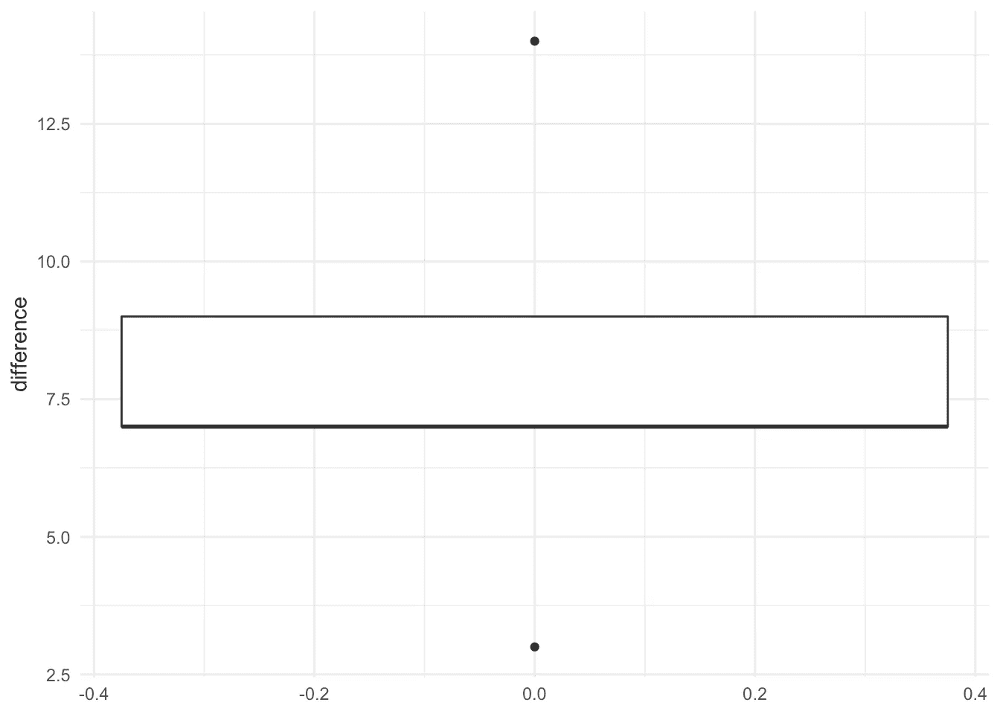

对于这个版本的测试，R 中有一个函数，它就是带有`paired = TRUE`参数的`t.test()`函数。这个版本的测试实际上是学生配对样本 t 检验的标准版本。注意，另一个假设是 H1: μD > 0，所以我们也需要添加参数`alternative = "greater"`:

```
test <- t.test(dat5$after, dat5$before,
  alternative = "greater",
  paired = TRUE
)
test## 
##  Paired t-test
## 
## data:  dat5$after and dat5$before
## t = 4.4721, df = 4, p-value = 0.005528
## alternative hypothesis: true difference in means is greater than 0
## 95 percent confidence interval:
##  4.186437      Inf
## sample estimates:
## mean of the differences 
##                       8
```

注意，我们按照这个顺序写了`after`，然后是`before`。如果先写`before`，再写`after`，一定要把备选改为`alternative = "less"`。

如果您的数据是长格式，使用`~`:

```
dat5 <- data.frame(
  value = c(9, 8, 1, 3, 2, 16, 11, 15, 12, 9),
  time = c(rep("before", 5), rep("after", 5))
)
dat5##    value   time
## 1      9 before
## 2      8 before
## 3      1 before
## 4      3 before
## 5      2 before
## 6     16  after
## 7     11  after
## 8     15  after
## 9     12  after
## 10     9  aftertest <- t.test(value ~ time,
  data = dat5,
  alternative = "greater",
  paired = TRUE
)
test## 
##  Paired t-test
## 
## data:  value by time
## t = 4.4721, df = 4, p-value = 0.005528
## alternative hypothesis: true difference in means is greater than 0
## 95 percent confidence interval:
##  4.186437      Inf
## sample estimates:
## mean of the differences 
##                       8
```

上面的输出概括了执行测试所需的所有信息(将 R 中找到的结果与手工找到的结果进行比较)。

可以照常提取 *p* 值:

```
test$p.value## [1] 0.005528247
```

*p*-值为 0.006，因此在 5%的显著性水平上，我们拒绝了差异均值等于 0 的零假设，这意味着我们可以得出结论，该治疗在提高跑步能力方面是有效的。这个结果证实了我们手工发现的东西。

# 绘图和统计检验相结合

写完这篇文章后，我发现了`{ggstatsplot}`包，我认为这里值得一提，特别是分别用于独立样本和配对样本的`ggbetweenstats()`和`ggwithinstats()`函数。

这两个函数组合了一个图(代表每个组的分布)和显示在图的副标题中的统计测试结果。

请参见以下场景 2、3 和 5 的示例。不幸的是，这个包不允许运行场景 1 和场景 4 的测试。

# 场景 2

`ggbetweenstats()`功能用于独立样本:

```
# load package
library(ggstatsplot)
library(ggplot2)# plot with statistical results
ggbetweenstats(
  data = dat2bis,
  x = sample,
  y = value,
  plot.type = "box", # for boxplot
  type = "parametric", # for student's t-test
  var.equal = TRUE, # equal variances
  centrality.plotting = FALSE # remove mean
) +
  labs(caption = NULL) # remove caption
```

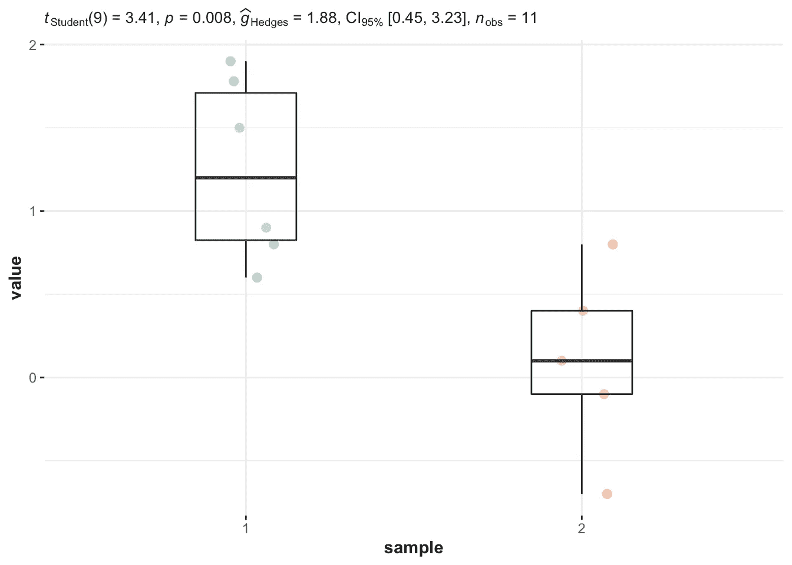

*p*-值(显示在`p =`之后)是使用`t.test()`函数获得的值的两倍，因为当我们运行`t.test()`时，我们指定了`alternative = "greater"`(即单边测试)。在我们使用`ggbetweenstats()`函数的图中，这是一个默认执行的双边测试，即`alternative = "two.sided"`。

# 场景 3

我们也有独立的样本，所以我们再次使用`ggbetweenstats()`函数，但是这一次两个总体的方差并不相等，所以我们指定参数`var.equal = FALSE`:

```
# plot with statistical results
ggbetweenstats(
  data = dat3,
  x = sample,
  y = value,
  plot.type = "box", # for boxplot
  type = "parametric", # for student's t-test
  var.equal = FALSE, # unequal variances
  centrality.plotting = FALSE # remove mean
) +
  labs(caption = NULL) # remove caption
```

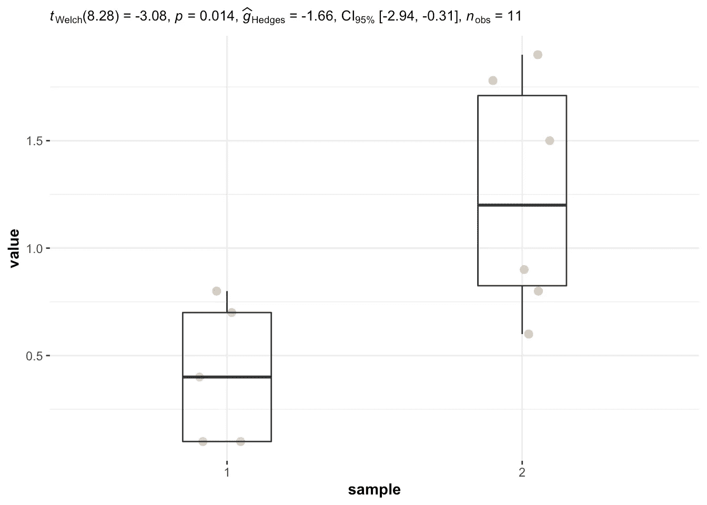

注意，出于与上述相同的原因，图的副标题中显示的*p*-值也比使用`t.test()`功能时大两倍。

# 场景 5

在这种情况下，样本是成对的，因此我们使用`ggwithinstats()`函数:

```
ggwithinstats(
  data = dat5,
  x = time,
  y = value,
  type = "parametric", # for student's t-test
  centrality.plotting = FALSE # remove mean
) +
  labs(caption = NULL) # remove caption
```

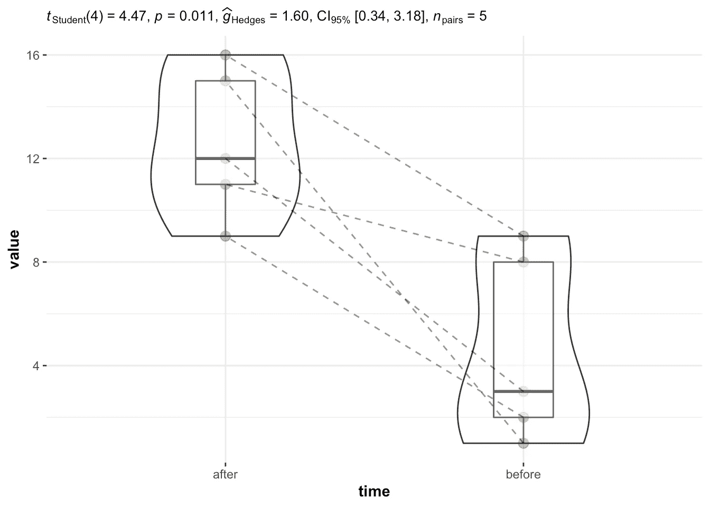

同样，图的副标题中的*p*-值是使用`t.test()`函数获得的值的两倍，原因同上。

然而，本节的重点是说明如何轻松绘制带有统计结果的图表，这正是`{ggstatsplot}`包的目的。在这篇[文章](https://statsandr.com/blog/how-to-do-a-t-test-or-anova-for-many-variables-at-once-in-r-and-communicate-the-results-in-a-better-way/)中可以看到更多的细节和例子。

# 假设

对于许多统计测试，为了能够解释结果，需要满足一些假设。当其中一个或几个不满足时，尽管技术上可以进行这些测试，但解释结果或相信结论是不正确的。

以下是学生对两个样本进行 t 检验的假设，如何检验它们，以及如果假设不成立，还有哪些其他检验:

*   **变量类型**:学生的 t 检验需要混合一个[定量](https://statsandr.com/blog/variable-types-and-examples/#quantitative)因变量(对应于与问题相关的测量)和一个[定性](https://statsandr.com/blog/variable-types-and-examples/#qualitative)自变量(精确的 2 个水平将决定要比较的组)。
*   **独立性**:从总[人口](https://statsandr.com/blog/what-is-the-difference-between-population-and-sample/)中随机选择的有代表性的部分收集的数据，在组间和组内应该是独立的。独立性的假设通常基于实验的设计和对实验条件的良好控制来验证，而不是通过正式的测试。如果你仍然不确定基于实验设计的独立性，问问自己一个观察是否与每个组内或组间的另一个观察相关(如果一个观察对另一个有影响)。如果没有，很可能你有独立的[样本](https://statsandr.com/blog/what-is-the-difference-between-population-and-sample/)。如果样本之间的观察值(形成要比较的不同组)是相关的(例如，如果两个测量值是在**相同的个体**上收集的，这是医学研究中测量指标(I)治疗前和(ii)治疗后时的常见情况)，则应首选学生 t 检验的配对版本，称为配对样本的学生 t 检验，以便考虑要比较的两组之间的相关性。
*   **常态**:
*   对于小样本(通常 n 个样本< 30), when the two samples are independent, observations in **和一个样本 [**都应遵循正态分布**](https://statsandr.com/blog/do-my-data-follow-a-normal-distribution-a-note-on-the-most-widely-used-distribution-and-how-to-test-for-normality-in-r/) )。当对成对样本使用学生的 t 检验时，两个样本的观察值之差应该遵循正态分布。正态性假设可以通过[直方图](https://statsandr.com/blog/descriptive-statistics-in-r/#histogram)和 [QQ 图](https://statsandr.com/blog/descriptive-statistics-in-r/#qq-plot)进行直观测试，和/或通过[正态性测试](https://statsandr.com/blog/do-my-data-follow-a-normal-distribution-a-note-on-the-most-widely-used-distribution-and-how-to-test-for-normality-in-r/#normality-test)进行正式测试，如夏皮罗-维尔克或科尔莫戈罗夫-斯米尔诺夫测试。即使在变换(例如，对数变换、平方根等)之后。)，您的数据仍然不符合正态分布，可以应用 [Wilcoxon 检验](https://statsandr.com/blog/wilcoxon-test-in-r-how-to-compare-2-groups-under-the-non-normality-assumption/)(R 中的`wilcox.test(variable1 ~ variable2, data = dat`)。这种非参数检验对非正态分布稳健，它比较中位数而不是平均值，以便比较两个总体。**
*   **对于大样本(n ≥ 30)，不需要数据的**正态性**(这是一个常见的误解！).根据[中心极限定理](https://en.wikipedia.org/wiki/Central_limit_theorem)，即使数据不是正态分布，大样本的样本均值通常也是正态分布的近似值。因此，当每组/样本中的观察值数量很大时，不需要检验正态性假设。**
*   ****方差相等**:当两个样本独立时，两组的方差在总体中应该相等(这种假设被称为**方差齐性**，或者有时甚至被称为同方差，与方差在组间不同时的异方差相对)。这种假设可以通过图形进行测试(例如，通过比较[箱线图](https://statsandr.com/blog/descriptive-statistics-in-r/#boxplot)或[点线图](https://statsandr.com/blog/descriptive-statistics-in-r/#dotplot)中的离散度)，或者更正式地通过 Levene 测试(`{car}`包中的`leveneTest(variable ~ group)`)或 f 检验(`var.test(variable ~ group)`)。如果等方差假设被拒绝，可以使用另一种版本的学生 t 检验:韦尔奇检验(`t.test(variable ~ group, var.equal = FALSE)`)。请注意，韦尔奇检验不要求方差齐性，但在小样本情况下，分布仍应遵循正态分布。如果你的分布不是正态分布或者方差不相等，应该使用 [Wilcoxon 检验](https://statsandr.com/blog/wilcoxon-test-in-r-how-to-compare-2-groups-under-the-non-normality-assumption/)。这种检验不需要假设正态性或方差的同方差性。**

**这就结束了一篇比较长的文章。谢谢你阅读它。我希望这篇文章能帮助你理解学生对两个样本的不同版本的 t-test 是如何工作的，以及如何手动和在 r 中执行它们。如果你感兴趣，这里有一个[闪亮的应用程序](https://www.statsandr.com/blog/a-shiny-app-for-inferential-statistics-by-hand/)可以轻松地手动执行这些测试(你只需要输入你的数据，并通过侧边栏菜单选择合适的测试版本)。**

**此外，我邀请您阅读:**

*   **这篇[文章](https://www.statsandr.com/blog/how-to-perform-a-one-sample-t-test-by-hand-and-in-r-test-on-one-mean/)如果你想知道如何计算学生的 t 检验但是这次，对于一个样本，**
*   **此[条](https://www.statsandr.com/blog/wilcoxon-test-in-r-how-to-compare-2-groups-under-the-non-normality-assumption/)如果您想在非正态假设下比较两组，或**
*   **如果您想使用方差分析来比较 3 个或更多组，请点击此[条](https://www.statsandr.com/blog/anova-in-r/)。**

**和往常一样，如果您有与本文主题相关的问题或建议，请将其添加为评论，以便其他读者可以从讨论中受益。如果您发现了错误或 bug，可以通过在 GitHub 上提出问题来通知我。对于所有其他要求，你可以与我联系。**

****相关文章:****

*   **[R 中的相关图:如何突出显示数据集中最相关的变量](https://www.statsandr.com/blog/correlogram-in-r-how-to-highlight-the-most-correlated-variables-in-a-dataset/)**
*   **[R markdown 入门](https://www.statsandr.com/blog/getting-started-in-r-markdown/)**
*   **[聚类分析完全指南:k-means 和手动和 in R 系统聚类](https://www.statsandr.com/blog/clustering-analysis-k-means-and-hierarchical-clustering-by-hand-and-in-r/)**
*   **[安装和加载 R 包的有效方法](https://www.statsandr.com/blog/an-efficient-way-to-install-and-load-r-packages/)**
*   **我的数据符合正态分布吗？关于最广泛使用的分布以及如何检验 R 中的正态性的注释**

# **参考**

**朗特里德里克。2000.*统计无泪*。**

1.  **请注意，与[描述统计学](https://www.statsandr.com/blog/descriptive-statistics-by-hand)相反，推断统计学是统计学的一个分支，它被定义为从对人口的代表性样本的观察中得出关于人口的结论的科学。参见[人群和样本的差异](https://www.statsandr.com/blog/what-is-the-difference-between-population-and-sample)。 [↩](https://www.statsandr.com/blog/student-s-t-test-in-r-and-by-hand-how-to-compare-two-groups-under-different-scenarios/#fnref1)**
2.  **在本文的其余部分，当我们写学生的 t 检验时，我们指的是两个样本的情况。如果您只想比较一个样本，请参见[一个样本 t 检验](https://www.statsandr.com/blog/how-to-perform-a-one-sample-t-test-by-hand-and-in-r-test-on-one-mean/)。 [↩︎](https://www.statsandr.com/blog/student-s-t-test-in-r-and-by-hand-how-to-compare-two-groups-under-different-scenarios/#fnref2)**
3.  **这至少是参数假设检验的情况。参数测试意味着它是基于理论统计分布，这取决于一些定义的参数。在学生对两个样本进行 t 检验的情况下，它基于具有单个参数的学生 t 分布，即自由度(df = n1+n2 2，其中 n1 和 N2 是两个样本大小)或正态分布。 [↩](https://www.statsandr.com/blog/student-s-t-test-in-r-and-by-hand-how-to-compare-two-groups-under-different-scenarios/#fnref3)**

***原载于 2020 年 2 月 28 日 https://statsandr.com**[*。*](https://statsandr.com/blog/student-s-t-test-in-r-and-by-hand-how-to-compare-two-groups-under-different-scenarios/)***