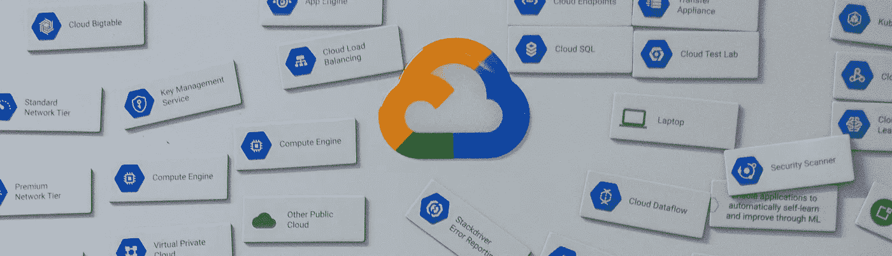

# 学习谷歌云助理工程师认证

> 原文：<https://towardsdatascience.com/studying-for-the-google-cloud-associate-engineer-certification-1bb53939ee2a?source=collection_archive---------10----------------------->

照片由[米切尔罗](https://unsplash.com/@mitchel3uo?utm_source=unsplash&utm_medium=referral&utm_content=creditCopyText)在 [Unsplash](https://unsplash.com/s/photos/google-cloud?utm_source=unsplash&utm_medium=referral&utm_content=creditCopyText)

## 如何学习(并通过)谷歌的云认证考试？

# 介绍

随着云的使用越来越多，谷歌的云助理工程师(ACE)认证提供了一个展示你在云工程和云开发方面的才能的好方法。

这篇文章提供了一些资源和建议来帮助你准备 ACE 考试。

# 一.评价

*你应该参加这个考试吗？*

照片由[韦斯·希克斯](https://unsplash.com/@sickhews?utm_source=unsplash&utm_medium=referral&utm_content=creditCopyText)在 [Unsplash](https://unsplash.com/?utm_source=unsplash&utm_medium=referral&utm_content=creditCopyText) 上拍摄

## 1.云工程适合你吗？

如果云计算听起来与你正在做或想要做的工作相关，那么云工程是你想要拥有的技能。

*   **如果你是谷歌云平台(GCP)的新手:** [谷歌在 Coursera 上的在线课程](https://www.coursera.org/learn/gcp-fundamentals/home/welcome)是一个很好的学习工具，会给你在云中构建的技能。
*   **如果你已经与谷歌云平台(GCP)互动过:**
    学习并参加考试是完善你的技能组合并向你介绍 GCP 提供的你可能不知道的元素的一种可靠方式。*(例如。谷歌的私有 ip 网络，以减少延迟和成本。)*

## 2.认证有益吗？

*   验证你的技能组合
    认证是对你技能组合的一个很好的验证，无论是内在的(你会对你的技能组合更有信心)还是外在的(你可以证明你知道你在说什么)。
*   **增加就业能力** 这个挺明显的。
*   **进入谷歌认证目录**
    通过这次考试，你将获得[谷歌认证目录](https://googlecloudcertified.credential.net)的排名。你还将获得许多 GCP 产品的提前发布。
*   **截止日期作为动力** 认证考试可以作为你学习目标的动力&截止日期。

## 3.你能承受现在准备考试的压力吗？

为考试学习是有压力的。问问你自己，你现在是否能承受那么大的压力。

> 提示:在你准备考试的时候，制定一个计划来管理额外的压力。(例如。如果你生病了，你的日程/工作量会有什么变化。)

## 4.被你的目标所激励。

保持动力很重要。保持专注于你的目标——无论是学习新技能、创造新项目、获得新工作还是证明你的能力——并在你的学习计划中加入这个目标。

# 二。关于考试:

*考试很难。许多问题将挑战你的知识和应试技巧。*

照片由[蒂姆·高](https://unsplash.com/@punttim?utm_source=unsplash&utm_medium=referral&utm_content=creditCopyText)在 [Unsplash](https://unsplash.com/s/photos/student?utm_source=unsplash&utm_medium=referral&utm_content=creditCopyText) 上拍摄

## **1。谷歌** [**考试指南**](https://cloud.google.com/certification/guides/cloud-engineer)

考试内容的布局。

## **2。谷歌的** [**样本考试**](https://cloud.google.com/certification/practice-exam/cloud-engineer)

这个示例与考试结构和问题风格非常相似。我建议在开始学习之前参加这个模拟考试*——这样你就知道如何获取信息。*

> **注**:这是网上唯一可用的实践考试(截至 2020 年 8 月 20 日)。

# 三。准备考试

*为例题学习为你提供了基于考试材料的知识。准备考试为你提供了通过考试所需的技能和领域知识。*

在 [Unsplash](https://unsplash.com/?utm_source=unsplash&utm_medium=referral&utm_content=creditCopyText) 上由 [NESA 拍摄的制造商](https://unsplash.com/@nesabymakers?utm_source=unsplash&utm_medium=referral&utm_content=creditCopyText)

## 第一步:[注册](https://cloud.google.com/certification/register/)参加考试

给自己一个期限。你随时可以重新安排。

> **报名费用:** $125 美元
> **改期费用:**考试前 72 小时免费。那么，50 美元
> 
> 注意:我在截止日期前工作得很好——注册是我激励自己的方式。

## 步骤 2:查看考试指南

复习考试指南，这样你就知道学什么了。

## 步骤 3:参加模拟考试

这样你就能了解考试风格，知道该期待什么。

> **提示:**在开始学习之前参加模拟考试。这会让你对提问方式有所准备。另外，一旦你完成了学习，你几乎肯定会忘记问题的答案…

## 第四步:在 Coursera 上参加[谷歌的云工程课程(谷歌提供)。](https://www.coursera.org/professional-certificates/cloud-engineering-gcp?aid=true)

这门深入的课程将带你了解考试所需的一切(以及更多)。它提供讲座和实验室实践经验。参加完这个课程后，我能够轻松地部署和扩展应用程序。

> **注意:**这是一个庞大的课程，将花费你 2-3 周的时间，每周 10 个小时。

## 第五步:重考样题。

看你对内容的了解程度。你应该花更多的时间学习什么。

> **注意:**最好是全面的，因为标准化考试中的大多数问题都是低水平的，涵盖了广泛的知识。确保你的后期学习集中在你的弱点上。

## 第六步:再次复习课程内容。

*   快速浏览 Coursera 上的课程。
*   创建学习笔记。
*   经常复习这些学习笔记。

> 小贴士:考虑在吃早餐的时候复习你的学习笔记。(很棒的大脑热身。)

## 第七步:考试前一天停止学习。

事实证明，临时抱佛脚对结果有负面影响。在考试的前一天，帮自己一个忙，放松一下。

照片由 [Shutterstock](https://www.shutterstock.com/home) 拍摄

# **四。关键概念**

*我在参加考试时签署了保密协议，不会泄露任何考试问题。也就是说，这里有一些你需要很好了解的领域。*

## InternationalAssociationofMachinists 国际机械师协会

*   规则层次结构
*   不同类型的角色*(原始/预定义/定制)*
*   特定权限之间的差异*(例如云存储创建者与查看者。)*

## 虚拟机(虚拟机)

*   虚拟机类型(托管与非托管实例)
*   可抢占虚拟机的用途
*   使用定制机器类型+如何重复使用它们*(图像和快照)*
*   管理虚拟机。*(如何开关等等。)*

## **VPC (** 虚拟私有云)**联网**

*   如何配置防火墙规则
*   子网的角色和功能
*   如何设置负载平衡器
*   如何连接 VPN(虚拟专用网络)
*   每种不同类型的对等

## 云存储

*   不同的储物选项以及每种储物选项的使用时间
*   存储类别以及如何在它们之间转换
*   何时使用 BigQuery

## 云函数

*   云功能的用例是什么？
*   它们的局限性是什么？

## 库伯内特发动机

*   Kubernetes 的用例是什么？
*   与 Kubernetes 合作
*   自动缩放是如何执行的？
*   如何启用互联网连接

## **堆栈驱动**

*   stackdriver 有哪些用例？
*   它的局限性是什么？
*   创建和使用警报

## **云 SDK**

*   如何在命令行界面执行基本命令？*(不需要了解它的冷，只是松松地熟悉它。)*

照片由 [Keegan Houser](https://unsplash.com/@khouser01?utm_source=unsplash&utm_medium=referral&utm_content=creditCopyText) 在 [Unsplash](https://unsplash.com/s/photos/meditation?utm_source=unsplash&utm_medium=referral&utm_content=creditCopyText) 上拍摄

# 动词 （verb 的缩写）考试技巧

以下是一些有助于你参加考试的应试技巧:

## 1.跳过困难的问题:

如果一个问题难倒了你，跳过它！考试软件给你选择*【标记】*一个问题供以后复习。不要把时间花在那些旨在迷惑你的问题上。

## 2.永远不要留下空白答案

阅读问题前选择一个选项。*(回答错误没有处罚。)*如果你跳过一个硬 Q，在继续之前随机选择一个选项。

## 3.识别问题中的问题:

有时候问题包含很多信息*(意在迷惑你)*。学会识别被询问的内容，而不是被告知的内容。

***举个例子:*** *一个管理员不小心删除了他们的数据库。在混乱中，他们恢复了错误的数据库，现在网络崩溃了。您如何确保新数据库的安全配置？*

*   这个问题实际上是在问“如何为恢复的数据库设置安全配置。”
*   关于意外恢复版本+网络崩溃的信息是无关紧要的。

## 4.识别错误答案

不管是什么问题，有些答案都是错误的(并且可以被删除)。这些错误答案有几种形式:

*   永远错误的——这些都是旨在迷惑你的错误陈述。*(例如。更改无法重新定位的服务器的位置。)*
*   有时是假的——这些是规则的例外。仅当“例外”是问题的一部分时，才选择此答案。*(例如。打破永不删除此服务器的规则，以便您可以将此服务器的位置重置为高速连接。)*
*   **永远正确** —这些答案是正确的陈述，但并不总能解决你的问题。如果你发现了几个“永远正确”的答案，重新评估这个问题，看看它真正想要的是什么。*(例如。更改网络设置以允许此用户 ip 地址的流量。)*

## **5。留意时钟**

不要在一个问题上花太多时间。如果某件事花费的时间比你想要的多，把它标记出来，以后再继续做。

## 6.休息一下你的眼睛

每隔几分钟就移开视线，放松眼部肌肉。这会帮助你保持专注。

## 7.沉思

不时花 15-30 秒闭上眼睛，慢慢呼吸。这种努力的时间成本会让你获得平静和放松。

## 8.审查标记的问题(迭代)

通过复习标记的问题来重复你的考试。如果你能解决它，取消标记 q。如果不能，留下标记，继续前进。这样做一次——然后检查你的答案(# 9)——然后做第二次。

## 9.检查您的答案

对于每个问题，首先阅读你选择的答案，然后是问题，最后是答案。*(这允许您验证您的答案，并根据问题进行确认。)*如果你发现自己第二次怀疑自己，标记问题，继续前进。重复所有标记的 Q，直到完成或时间用完。

# 不及物动词更多资源

以下是您可能会用到的一些附加资源:

*   [撰写并通过谷歌云助理工程师认证](https://medium.com/@sathishvj/writing-and-passing-the-google-cloud-associate-engineer-certification-a60c2f6d99c2)
*   [如何通过谷歌云平台助理云工程师考试](https://medium.com/@wings/how-to-ace-the-google-cloud-platform-associate-cloud-engineer-exam-5a39e12f091f)
*   [我是如何通过谷歌云认证助理云工程师考试的？](https://vrealizeandbeyond.com/2020/06/how-did-i-pass-google-cloud-certified-associate-cloud-engineer-exam/)
*   [谷歌云—助理云工程师认证学习路径](https://jayendrapatil.com/google-cloud-associate-cloud-engineer-certification-learning-path/)

# 结论:

祝你考试顺利！