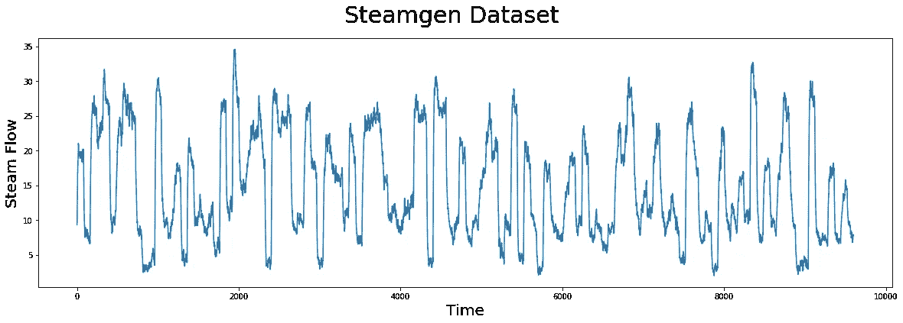
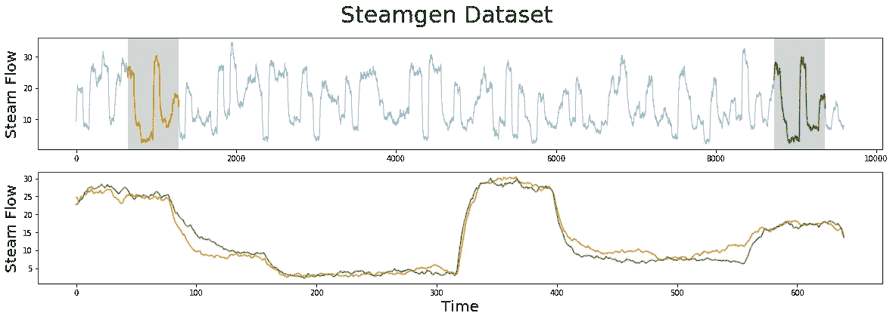
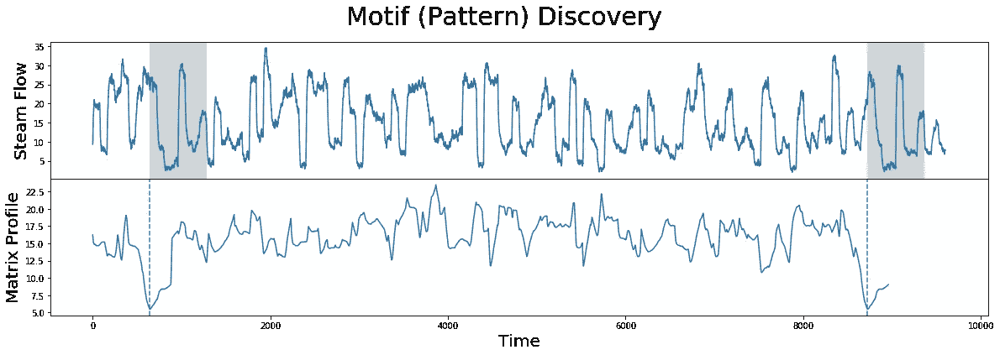
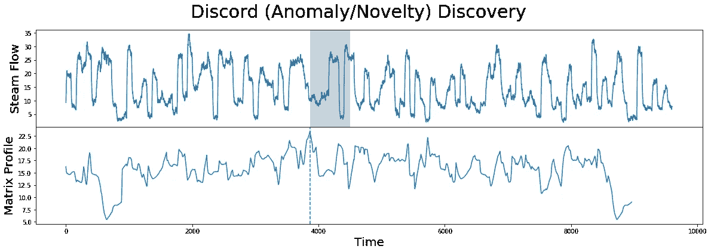
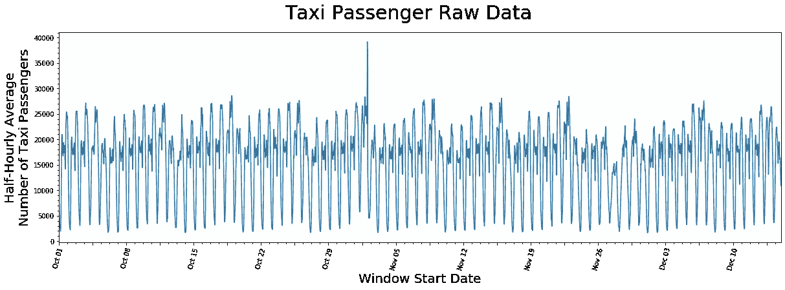
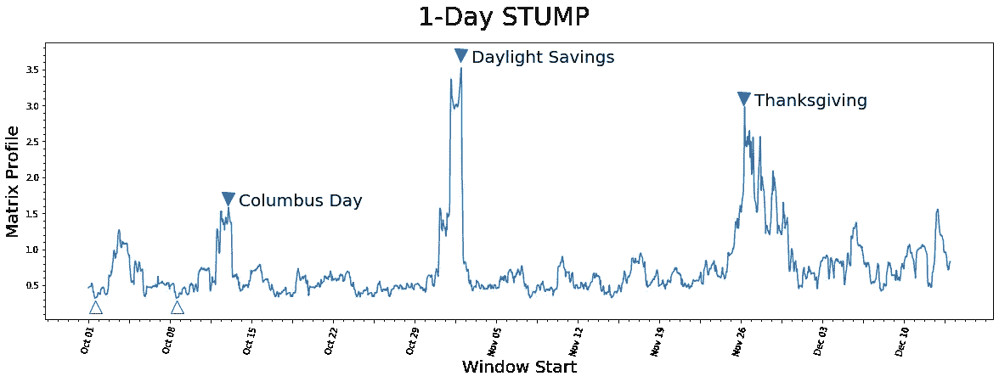
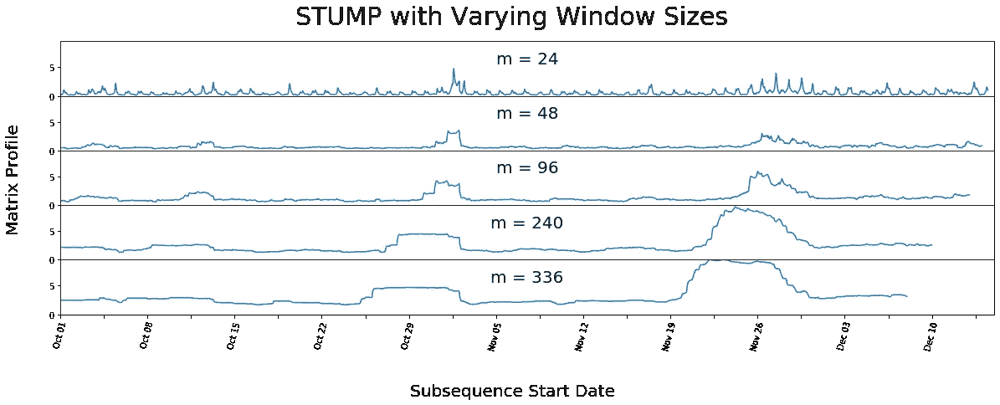

# 第 2 部分:STUMPY 基础知识

> 原文：<https://towardsdatascience.com/stumpy-basics-21844a2d2d92?source=collection_archive---------15----------------------->

## 用 STUMPY 分析图案和异常


(图片由[阿诺·梅瑟尔](https://unsplash.com/@tbzr?utm_source=unsplash&utm_medium=referral&utm_content=creditCopyText)拍摄)

# 整体大于部分之和


(图片由作者提供)

[STUMPY 是一个强大且可扩展的 Python 库，用于现代时间序列分析](https://github.com/TDAmeritrade/stumpy)，在其核心，有效地计算出一种叫做*矩阵轮廓*的东西。这个多部分系列的目标是解释什么是 matrix profile，以及如何开始利用 [STUMPY](https://stumpy.readthedocs.io/en/latest/) 完成所有现代时间序列数据挖掘任务！

*注:这些教程最初出现在* [*STUMPY 文档*](https://stumpy.readthedocs.io/en/latest/tutorials.html) *中。*

第 1 部分:[矩阵轮廓图](/the-matrix-profile-e4a679269692)
第 2 部分: [STUMPY 基础知识](/stumpy-basics-21844a2d2d92)
第 3 部分:[时间序列链](/part-3-time-series-chains-da281450abbf)
第 4 部分:[语义分割](/part-4-semantic-segmentation-b42c3792833d)
第 5 部分:[用 STUMPY 快速近似矩阵轮廓图](/part-5-fast-approximate-matrix-profiles-with-scrump-c6d9c984c560)
第 6 部分:[用于流式时间序列数据的矩阵轮廓图](/matrix-profiles-for-streaming-time-series-data-f877ff6f9eef)
第 7 部分:[用 STUMPY 快速模式搜索](/part-7-fast-pattern-searching-with-stumpy-2baf610a8de1) 10: [发现多维时间序列模体](/part-10-discovering-multidimensional-time-series-motifs-45da53b594bb)
第 11 部分:[用户引导的模体搜索](/part-11-user-guided-motif-search-d3d317caf9ea)
第 12 部分:[机器学习的矩阵轮廓](/part-12-matrix-profiles-for-machine-learning-2dfd98d7ff3f)

# 用残肢分析图案和异常

在这篇博客中，我们将使用 [STUMPY](https://stumpy.readthedocs.org/) 包来看看研究论文中的一些主要内容:[矩阵概要 I](http://www.cs.ucr.edu/~eamonn/PID4481997_extend_Matrix%20Profile_I.pdf) & [矩阵概要 II](http://www.cs.ucr.edu/~eamonn/STOMP_GPU_final_submission_camera_ready.pdf) 。

为了探索基本概念，我们将使用 workhorse `stumpy.stump()`函数来寻找有趣的主题(模式)或不一致(异常/新奇),并用两个不同的时间序列数据集来演示这些概念:

1.  Steamgen 数据集
2.  纽约市出租车乘客数据集

`stumpy.stump()`是流行的 STOMP 算法的 [Numba](http://numba.pydata.org/) JIT 编译版本，在最初的 [Matrix Profile II](http://www.cs.ucr.edu/~eamonn/STOMP_GPU_final_submission_camera_ready.pdf) 论文中有详细描述。`stumpy.stump()`能够进行并行计算，它对特定时间序列内的模式和异常值进行有序搜索，并利用一些计算的局部性来最小化运行时间。

# 入门指南

让我们导入加载、分析和绘制数据所需的包。

```
%matplotlib inline

import pandas as pd
import stumpy
import numpy as np
import matplotlib.pyplot as plt
import matplotlib.dates as dates
from matplotlib.patches import Rectangle
import datetime as dt

plt.rcParams["figure.figsize"] = [20, 6]  # width, height
plt.rcParams['xtick.direction'] = 'out'
```

# 什么是主题？

时间序列基序是在一个较长的时间序列中发现的近似重复的子序列。能够说一个子序列是“近似重复的”需要你能够将子序列相互比较。在 STUMPY 的情况下，时间序列中的所有子序列可以通过计算成对的 z 归一化欧几里得距离进行比较，然后只存储其最近邻的索引。这个最近邻距离向量被称为`matrix profile`，时间序列内每个最近邻的索引被称为`matrix profile index`(参见[第 1 部分:矩阵轮廓](https://medium.com/@seanmylaw/the-matrix-profile-e4a679269692)进行全面回顾)。幸运的是，`stumpy.stump()`函数接受任何时间序列(具有浮点值),并计算矩阵轮廓和矩阵轮廓索引，反过来，人们可以立即找到时间序列主题。让我们看一个例子:

# 加载 Steamgen 数据集

该数据是使用模糊模型生成的，该模型用于模拟位于伊利诺伊州香槟市的 Abbott 电厂的蒸汽发生器。我们感兴趣的数据特性是输出蒸汽流量遥测，单位为 kg/s，数据每三秒“采样”一次，共有 9600 个数据点。

```
steam_df = pd.read_csv("https://zenodo.org/record/4273921/files/STUMPY_Basics_steamgen.csv?download=1")
steam_df.head()drum pressure  excess oxygen  water level  steam flow
    320.08239       2.506774     0.032701    9.302970
   1321.71099       2.545908     0.284799    9.662621
   2320.91331       2.360562     0.203652   10.990955 
   3325.00252       0.027054     0.326187   12.430107
   4326.65276       0.285649     0.753776   13.681666
```

# 可视化 Steamgen 数据集

```
plt.suptitle('Steamgen Dataset', fontsize='30')
plt.xlabel('Time', fontsize ='20')
plt.ylabel('Steam Flow', fontsize='20')
plt.plot(steam_df['steam flow'].values)
```



(图片由作者提供)

花一点时间，用肉眼仔细检查上面的情节。如果你被告知有一个模式是近似重复的，你能发现它吗？即使对于计算机来说，这也是非常具有挑战性的。以下是您应该寻找的内容:

# 手动寻找主题

```
m = 640
fig, axs = plt.subplots(2)
plt.suptitle('Steamgen Dataset', fontsize='30')
axs[0].set_ylabel("Steam Flow", fontsize='20')
axs[0].plot(steam_df['steam flow'], alpha=0.5, linewidth=1)
axs[0].plot(steam_df['steam flow'].iloc[643:643+m])
axs[0].plot(steam_df['steam flow'].iloc[8724:8724+m])
rect = Rectangle((643, 0), m, 40, facecolor='lightgrey')
axs[0].add_patch(rect)
rect = Rectangle((8724, 0), m, 40, facecolor='lightgrey')
axs[0].add_patch(rect)
axs[1].set_xlabel("Time", fontsize='20')
axs[1].set_ylabel("Steam Flow", fontsize='20')
axs[1].plot(steam_df['steam flow'].values[643:643+m], color='C1')
axs[1].plot(steam_df['steam flow'].values[8724:8724+m], color='C2')
```



(图片由作者提供)

上面突出显示了我们正在寻找的基序(图案),但仍然很难确定橙色和绿色的子序列是否匹配(上图)，也就是说，直到我们放大它们并将子序列彼此重叠(下图)。现在，我们可以清楚地看到，母题非常相似！计算矩阵轮廓的基本价值在于，它不仅能让你快速找到基序，还能识别时间序列中所有子序列的最近邻。请注意，我们实际上没有做任何特别的事情来定位主题，除了我们从原始文件中抓取位置并绘制它们。现在，让我们获取 steamgen 数据，并对其应用`stumpy.stump()`函数:

# 使用 STUMP 找到主题

```
m = 640
mp = stumpy.stump(steam_df['steam flow'], m)
```

`stump`需要两个参数:

1.  时间序列
2.  一个窗口大小，`m`

在这种情况下，基于一些领域的专业知识，我们选择了`m = 640`，这大约相当于半小时的窗口。同样，`stump`的输出是一个数组，它包含所有的矩阵轮廓值(即，到最近邻居的 z 归一化欧几里德距离)和矩阵轮廓索引，分别在第一和第二列(我们现在忽略第三和第四列)。为了确定基元的索引位置，我们需要找到矩阵轮廓`mp[:, 0]`具有最小值的索引位置:

```
motif_idx = np.argsort(mp[:, 0])[0]
print(f"The motif is located at index {motif_idx}")The motif is located at index 643
```

有了这个`motif_idx`信息，我们还可以通过交叉引用矩阵轮廓索引来识别其最近邻居的位置，`mp[:, 1]`:

```
nearest_neighbor_idx = mp[motif_idx, 1]
print(f"The nearest neighbor is located at index {nearest_neighbor_idx}")The nearest neighbor is located at index 8724
```

现在，让我们将所有这些放在一起，并在原始数据旁边绘制矩阵图:

```
fig, axs = plt.subplots(2, sharex=True, gridspec_kw={'hspace': 0})
plt.suptitle('Motif (Pattern) Discovery', fontsize='30')axs[0].plot(steam_df['steam flow'].values)
axs[0].set_ylabel('Steam Flow', fontsize='20')
rect = Rectangle((643, 0), m, 40, facecolor='lightgrey')
axs[0].add_patch(rect)
rect = Rectangle((8724, 0), m, 40, facecolor='lightgrey')
axs[0].add_patch(rect)
axs[1].set_xlabel('Time', fontsize ='20')
axs[1].set_ylabel('Matrix Profile', fontsize='20')
axs[1].axvline(x=643, linestyle="dashed")
axs[1].axvline(x=8724, linestyle="dashed")
axs[1].plot(mp[:, 0])
```



(图片由作者提供)

我们了解到的是，来自矩阵轮廓的全局最小值(垂直虚线)对应于构成基序对的两个子序列的位置！并且这两个子序列之间的精确 z 归一化欧几里德距离是:

```
mp[:, 0].min()5.49161982776594
```

因此，这个距离不是零，因为我们之前看到两个子序列不是完全相同的匹配，但是，相对于矩阵分布图的其余部分(即，与矩阵分布图的平均值或中值相比)，我们可以理解这个基序是非常好的匹配。

# 使用 STUMP 查找异常

相反，矩阵轮廓中的最大值(根据上述`stumpy.stump()`计算)为:

```
print(f"The discord is located at index {discord_idx}")The discord is located at index 3864
```

与这种不和谐最近的邻居有一段相当远的距离:

```
nearest_neighbor_distance = mp[discord_idx, 0]
print(f"The nearest neighbor subsequence to this discord is {nearest_neighbor_distance} units away")The nearest neighbor subsequence to this discord is 23.476168367301987 units away
```

位于这个全局最大值的子序列也被称为不一致、新奇或“潜在异常”:

```
fig, axs = plt.subplots(2, sharex=True, gridspec_kw={'hspace': 0})
plt.suptitle('Discord (Anomaly/Novelty) Discovery', fontsize='30')axs[0].plot(steam_df['steam flow'].values)
axs[0].set_ylabel('Steam Flow', fontsize='20')
rect = Rectangle((3864, 0), m, 40, facecolor='lightgrey')
axs[0].add_patch(rect)
axs[1].set_xlabel('Time', fontsize ='20')
axs[1].set_ylabel('Matrix Profile', fontsize='20')
axs[1].axvline(x=3864, linestyle="dashed")
axs[1].plot(mp[:, 0])
```



(图片由作者提供)

为了进一步发展/加强我们不断增长的直觉，让我们继续探索另一个数据集！

# 加载纽约市出租车乘客数据集

首先，我们将下载代表 2014 年秋季 75 天内纽约市出租车乘客半小时平均人数的历史数据。

我们提取该数据并将其插入到一个 [Pandas](https://pandas.pydata.org/) dataframe 中，确保时间戳存储为 *datetime* 对象，并且值的类型为 *float64* 。请注意，我们将进行比上面多一点的数据清理，以便您可以看到一个包含时间戳的示例。但是请注意，在计算矩阵概要文件时，`stumpy.stump()`实际上根本不使用或者不需要时间戳列。

```
taxi_df = pd.read_csv("https://zenodo.org/record/4276428/files/STUMPY_Basics_Taxi.csv?download=1")
taxi_df['value'] = taxi_df['value'].astype(np.float64)
taxi_df['timestamp'] = pd.to_datetime(taxi_df['timestamp'])
taxi_df.head() timestamp    value
2014-10-01 00:00:00  12751.0
2014-10-01 00:30:00   8767.0
2014-10-01 01:00:00   7005.0
2014-10-01 01:30:00   5257.0
2014-10-01 02:00:00   4189.0
```

# 可视化出租车数据集

```
# This code is going to be utilized to control the axis labeling of the plots
DAY_MULTIPLIER = 7  # Specify for the amount of days you want between each labeled x-axis tickx_axis_labels = taxi_df[(taxi_df.timestamp.dt.hour==0)]['timestamp'].dt.strftime('%b %d').values[::DAY_MULTIPLIER]
x_axis_labels[1::2] = " "
x_axis_labels, DAY_MULTIPLIERplt.suptitle('Taxi Passenger Raw Data', fontsize='30')
plt.xlabel('Window Start Date', fontsize ='20')
plt.ylabel('Half-Hourly Average\nNumber of Taxi Passengers', fontsize='20')
plt.plot(taxi_df['value'])plt.xticks(np.arange(0, taxi_df['value'].shape[0], (48*DAY_MULTIPLIER)/2), x_axis_labels)
plt.xticks(rotation=75)
plt.minorticks_on()
plt.margins(x=0)
plt.show()
```



(图片由作者提供)

似乎在一天和七天之间有一个普遍的周期性，这可能是因为更多的人在白天而不是晚上使用出租车，并且有理由说大多数周都有类似的出租车乘客模式。此外，也许在接近 10 月底的窗口右侧有一个异常值，但除此之外，仅从原始数据无法得出任何结论。

# 生成矩阵配置文件

同样，定义窗口大小，`m`，通常需要一定程度的领域知识，但是我们稍后将展示`stumpy.stump()`对于该参数的变化是健壮的。因为这个数据是半小时采集一次的，所以我们选择了一个值`m = 48`来表示正好一天的跨度:

```
m = 48
mp = stumpy.stump(taxi_df['value'], m=m)
```

# 可视化矩阵轮廓

```
plt.suptitle('1-Day STUMP', fontsize='30')
plt.xlabel('Window Start', fontsize ='20')
plt.ylabel('Matrix Profile', fontsize='20')
plt.plot(mp[:, 0])plt.plot(575, 1.7, marker="v", markersize=15, color='b')
plt.text(620, 1.6, 'Columbus Day', color="black", fontsize=20)
plt.plot(1535, 3.7, marker="v", markersize=15, color='b')
plt.text(1580, 3.6, 'Daylight Savings', color="black", fontsize=20)
plt.plot(2700, 3.1, marker="v", markersize=15, color='b')
plt.text(2745, 3.0, 'Thanksgiving', color="black", fontsize=20)
plt.plot(30, .2, marker="^", markersize=15, color='b', fillstyle='none')
plt.plot(363, .2, marker="^", markersize=15, color='b', fillstyle='none')
plt.xticks(np.arange(0, 3553, (m*DAY_MULTIPLIER)/2), x_axis_labels)
plt.xticks(rotation=75)
plt.minorticks_on()
plt.show()
```



(图片由作者提供)

# 了解矩阵配置文件

让我们明白我们在看什么。

# 最低值

最低值(空心三角形)被认为是基元，因为它们代表具有最小 z 归一化欧几里得距离的一对最近邻子序列。有趣的是，两个最低的数据点*正好相隔* 7 天，这表明，在这个数据集中，除了更明显的一天的周期性之外，可能还有七天的周期性。

# 最高值

那么最高的矩阵轮廓值(实心三角形)呢？具有最高(局部)值的子序列实际上强调了它们的唯一性。我们发现前三个峰值恰好分别与哥伦布日、夏令时和感恩节的时间相对应。

# 不同的窗口大小

如上所述，`stumpy.stump()`对于窗口大小参数`m`的选择应该是稳健的。下面，我们通过运行不同窗口大小的`stumpy.stump()`来演示操作窗口大小如何对你生成的矩阵轮廓产生小的影响。

```
days_dict ={
  "Half-Day": 24,
  "1-Day": 48,
  "2-Days": 96,
  "5-Days": 240,
  "7-Days": 336,
}

days_df = pd.DataFrame.from_dict(days_dict, orient='index', columns=['m'])
days_df.head() m
Half-Day  24
1-Day     48
2-Days    96
5-Days    240
7-Days    336
```

我们特意选择了与人类可以选择的相当直观的白天长度相对应的时间跨度。

```
fig, axs = plt.subplots(5, sharex=True, gridspec_kw={'hspace': 0})
fig.text(0.5, -0.1, 'Subsequence Start Date', ha='center', fontsize='20')
fig.text(0.08, 0.5, 'Matrix Profile', va='center', rotation='vertical', fontsize='20')
for i, varying_m in enumerate(days_df['m'].values):
    mp = stumpy.stump(taxi_df['value'], varying_m)
    axs[i].plot(mp[:, 0])
    axs[i].set_ylim(0,9.5)
    axs[i].set_xlim(0,3600)
    title = f"m = {varying_m}"
    axs[i].set_title(title, fontsize=20, y=.5)
plt.xticks(np.arange(0, taxi_df.shape[0], (48*DAY_MULTIPLIER)/2), x_axis_labels)
plt.xticks(rotation=75)
plt.suptitle('STUMP with Varying Window Sizes', fontsize='30')
plt.show()
```



(图片由作者提供)

我们可以看到，即使窗口大小不同，我们的峰值仍然突出。但是看起来好像所有的非峰值都在向彼此靠拢。这就是为什么在运行`stumpy.stump()`之前了解数据环境非常重要的原因，因为它有助于获得一个可以捕捉数据集中重复模式或异常的窗口大小。

# GPU-STUMP —使用 GPU 加快 STUMP 速度

当时间序列中的数据远远超过几千个数据点时，您可能需要提高速度来帮助分析数据。幸运的是，你可以试试`stumpy.gpu_stump()`，一种超快速的 GPU 驱动的`stumpy.stump()`的替代品，它提供几百个 CPU 的速度，并提供与`stumpy.stump()`相同的输出:

```
**import** **stumpy**mp = stumpy.gpu_stump(df['value'], m=m)  *# Note that you'll need a properly configured NVIDIA GPU for this*
```

事实上，如果你不处理 PII/SII 的数据，那么你可以在 Google Colab 上用[这个笔记本来试试`stumpy.gpu_stump()`。](https://colab.research.google.com/drive/1FIbHQoD6mJInkhinoMehBDj2E1i7i2j7)

# 树桩—分布式树桩

或者，如果您只能访问一个 CPU 集群，并且您的数据需要留在防火墙后面，那么`stumpy.stump()`和`stumpy.gpu_stump()`可能不足以满足您的需求。相反，您可以尝试`stumpy.stumped()`函数，它是`stumpy.stump()`的分布式并行实现，依赖于 [Dask](https://dask.org/) distributed:

```
**import** **stumpy**
**from** **dask.distributed** **import** Clientdask_client = Client()mp = stumpy.stumped(dask_client, df['value'], m=m)  *# Note that a dask client is needed*
```

# 摘要

就是这样！现在，您已经加载了一个数据集，使用 [STUMPY](https://stumpy.readthedocs.io/en/latest/) 包在`stumpy.stump()`中运行它，并且能够提取两个不同时间序列中现有模式和异常的多个结论。您现在可以导入这个包并在您自己的项目中使用它。编码快乐！

## 资源

[Matrix Profile I](http://www.cs.ucr.edu/~eamonn/PID4481997_extend_Matrix%20Profile_I.pdf)
[Matrix Profile II](http://www.cs.ucr.edu/~eamonn/STOMP_GPU_final_submission_camera_ready.pdf)
[STUMPY Matrix Profile 文档](https://stumpy.readthedocs.io/en/latest/)
[STUMPY Matrix Profile Github 代码库](https://github.com/TDAmeritrade/stumpy)

## **←** [**第一部分:矩阵简介**](/the-matrix-profile-e4a679269692) **|** [**第三部分:时间序列链**](/part-3-time-series-chains-da281450abbf) **→**