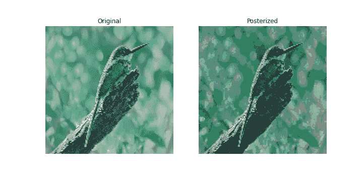
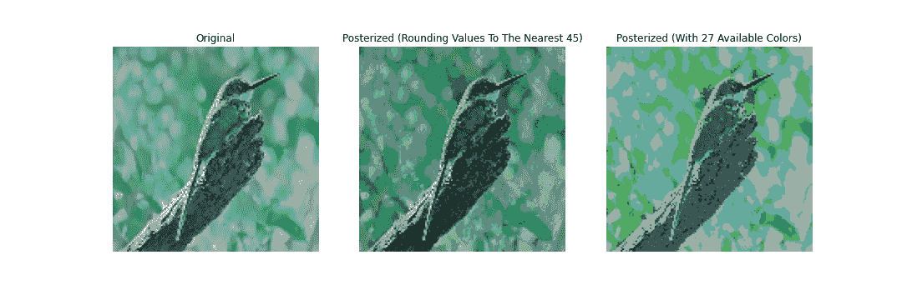
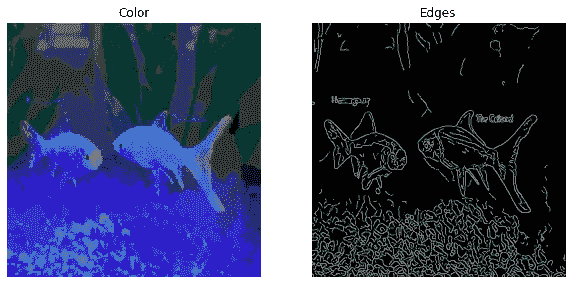
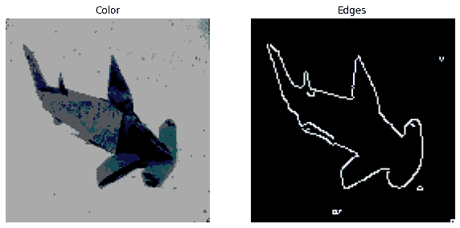

# 线条画的风格转换

> 原文：<https://towardsdatascience.com/style-transfer-for-line-drawings-3c994492b609?source=collection_archive---------50----------------------->

## 用 ML 从线条画生成图像

在这里，我将以类似教程的方式介绍我最近做的一个机器学习项目。这是一种从线条画中以艺术风格生成完整图像的方法。

# 资料组

我在 [Imagenet](http://www.image-net.org/) 数据集的 10%上进行训练。这是计算机视觉任务中常用的基准数据集。Imagenet 数据集不是公开可用的；它仅限于那些需要使用它来计算性能基准以便与其他方法进行比较的研究人员。因此，通常要求您提交一份申请表。但是如果你只是随便用的话，这里有[。除了个人项目之外，我不会用这个做任何事情。请注意，数据集非常大，这就是为什么我只用了 1/10 来训练我的模型。它由 1000 个类组成，所以我用了其中的 100 个图像类进行训练。](https://academictorrents.com/collection/imagenet-2012)

几周前，我在一个不同的个人项目中使用了 Imagenet，所以我已经在 Google Drive 中收集了大量文件。然而，不幸的是，将这 140，000 张图片上传到 Google Drive 需要大约 20 个小时。有必要在 Google Colab 的在线 GPU 上训练模型，但这需要你将图像上传到 Google Drive，因为你没有在本地托管你的编码环境。

# 数据输入管道

我有一个 Colab Pro 帐户，但即使有额外的 RAM，我也肯定无法处理 140，000 个线条画，每个都是 256x256 像素大小，以及它们的 256x256 像素彩色对应物。因此，我必须使用 TensorFlow 数据输入管道随时加载数据。

在我们开始设置管道之前，让我们导入所需的库(这些是我的代码中的所有导入语句):

```
import matplotlib.pyplot as plt
import numpy as np
import cv2
from tqdm.notebook import tqdm
import glob
import random
import threading, queuefrom tensorflow.keras.models import *
from tensorflow.keras.layers import *
from tensorflow.keras.optimizers import *
from tensorflow.keras.regularizers import *
from tensorflow.keras.utils import to_categorical
import tensorflow as tf
```

现在，让我们加载指向 Imagenet 子集中每个图像的文件路径，假设您已经将它们上传到适当目录结构下的 Drive，并将 Google Colab 实例连接到 Google Drive。

```
filepaths = glob.glob("drive/My Drive/1-100/**/*.JPEG")# Shuffle the filepaths
random.shuffle(filepaths)
```

如果你不想使用`glob`模块，你可以使用`os`库中的函数，这样通常效率更高。

这里有几个我需要的助手函数:

*   标准化数据
*   *色调分离*图像数据

```
def normalize(x):
  return (x - x.min()) / (x.max() - x.min())
```

## 色调分离

上述色调分离过程将图像作为输入，并通过将颜色值舍入到某个最接近的值，将平滑的渐变转换为更清晰分离的颜色部分。这里有一个例子:



色调分离

正如您所看到的，生成的图像具有不太平滑的渐变，这些渐变被替换为单独的颜色部分。我实现这一点的原因是因为我可以将输出图像限制为一组颜色，允许我将学习问题格式化为图像中每个像素的分类问题。对于每一种可用的颜色，我分配一个标签。该模型通过最后一个通道`num_colors`输出由 softmax 函数激活的形状`(height, width, num_colors)`的图像。给定一个变量`num_values`，我允许颜色值限制在`np.arange(0, 255, 255 / num_values)`的所有 RGB 组合。这意味着`num_colors = num_values ** 3`。这里有一个例子:



色调分离

作为我如何实现这一点的例子，这里有一个演示:

```
def get_nearest_color(color, colors):
  """
  Args:
   - color: A vector of size 3 representing an RGB color
   - colors: NumPy array of shape (num_colors, 3)
  Returns:
   - The index of the color in the provided set of colors that is
     closest in value to the provided color
  """ return np.argmin([np.linalg.norm(color - c) for c in colors])def posterize_with_limited_colors(image, colors):
  """
  Args:
   - colors: NumPy array of shape (num_colors, 3)
  Returns:
   - Posterized image of shape (height, width, 1), where each value 
     is an integer label associated with a particular index of the
     provided colors array
  """ image = normalize(image)
  posterized = np.array([[get_nearest_color(x, colors) for x in y] for y in image])
  return posterized
```

## 边缘抽取

为了从我们的彩色图像中创建输入数据，我们需要一种从图像中提取边缘的方法，这种方法类似于描画或画线。

我们将使用 [Canny 边缘检测算法](https://en.wikipedia.org/wiki/Canny_edge_detector)。让我们编写助手函数，它输入图像的路径并输出相关的示例/(X，Y)训练对，包括彩色输入的色调分离以及黑白边缘提取:

```
def preprocess(path):
  color = cv2.imread(path)
  color = cv2.resize(color, input_image_size) # Assuming your pipelines generator function ignores None
  if color.shape < input_image_size:
    return None, None color = (normalize(color) * 255).astype(np.uint8) gray = cv2.cvtColor(color, cv2.COLOR_RGB2GRAY
  # Removes noise while preserving edges
  filtered = cv2.bilateralFilter(gray, 3, 60, 120) # Automatically determine threshold for edge detection algorithm
  # based upon the median color value of the image
  m = np.median(filtered)
  preservation_factor = 0.33
  low = max(0, int(m - 255 * preservation_factor))
  high = int(min(255, m + 255 * preservation_factor))
  filtered_edges = cv2.Canny(filtered, low, high)
  filtered_edges = normalize(filtered_edges)
  filtered_edges = np.expand_dims(filtered_edges, axis = -1) color = cv2.resize(color, output_image_size)
  color /= 255.
  color = posterize_with_limited_colors(color, colors) return filtered_edges, color
```

自动 Canny 边缘检测只是我对这篇文章中使用的小函数的修改。

## 管道

正如我所说的，我正在使用输入管道现场加载数据。因此，我需要定义一个生成器对象，以便在需要时加载这些数据。我的生成器函数很简单，因为我们基本上刚刚定义了它。它所添加的只是过滤掉`preprocess`函数的`None`输出(分辨率低于`input_image_size`的图像),并过滤掉任何包含`nan`或`inf`值的结果。

```
def generate_data(paths):
  for path in paths:
    edges, color = preprocess(path.decode())
    if not edges is None:
      if not np.any(np.isnan(edges)) or np.any(np.isnan(color)):
        if not np.any(np.isinf(edges)) or np.any(np.isinf(color))):
          # Yield the clean data
          yield edges, color
```

我用`(128, 128)`来表示`input_image_size`和`output_image_size`。128x128 像素的图像并不是低分辨率的，所以对于我们的目的来说没有明显的缺点。此外，Imagenet 图像的分辨率通常要高得多，因此如果需要，我们可以使用更高的分辨率。

现在让我们建立管道。我使用多线程来提高速度。TensorFlow 的`.interleave()`允许我们这样做:

```
thread_names = np.arange(0, 8).astype(str)
dataset = tf.data.Dataset.from_tensor_slices(thread_names)dataset = dataset.interleave(lambda x:
  tf.data.Dataset.from_generator(
    generate_data,
    output_types = (tf.float32, tf.float32),
    output_shapes = ((*input_image_size, 1),
                     (*output_image_size, 1)),
    args = (train_paths,)),
    cycle_length = 8,
    block_length = 8,
    num_parallel_calls = 8)dataset = dataset.batch(batch_size).repeat()
```

## 测试管道

让我们通过管道加载一个培训示例:



一个带有输入线条画/边缘(右)和输出着色(左)的训练示例

完全如你所愿。请注意，左边描绘的图像并不完全是管道输出的图像。回想一下，管道返回的是引用每个像素颜色的索引。我只是引用了每种相关的颜色来创建可视化。这里有一个简单得多的例子。



更简单的培训示例

你会看到在左边我们有输出，色调分离的彩色图像，这部分类似于一幅画。在右侧，您可以看到输入边提取，类似于草图。

当然，并不是所有的训练样本都比其他样本具有更好的边缘提取。当颜色更难分离时，产生的轮廓可能会有点嘈杂和/或分散。然而，这是我能想到的提取边缘最准确的方法。

# 模型架构

让我们继续讨论模型架构。

我从`input_image_size = (128, 128)`开始，从而在展开最后一个轴后输入形状`(128, 128, 1)`。我将图层输入形状缩小 2 倍，直到它等于 1。然后，我用`stride = 1`再应用两个卷积层，因为我们不能再减少前两个轴的形状了。然后，我对转置的层执行相反的操作。每个卷积层有`padding = 'valid'`，每个卷积层之间有一个批量归一化层。所有卷积层都有 ReLU 激活，除了最后一个，当然它在最后一个热编码颜色标签通道上有 softmax 激活。

```
_________________________________________________________________ Layer (type)                 Output Shape              Param #    ================================================================= input_35 (InputLayer)        [(None, 128, 128, 1)]     0          _________________________________________________________________ conv2d_464 (Conv2D)          (None, 64, 64, 3)         30         _________________________________________________________________ batch_normalization_388 (Bat (None, 64, 64, 3)         12         _________________________________________________________________ conv2d_465 (Conv2D)          (None, 32, 32, 9)         252        _________________________________________________________________ batch_normalization_389 (Bat (None, 32, 32, 9)         36         _________________________________________________________________ conv2d_466 (Conv2D)          (None, 16, 16, 27)        2214       _________________________________________________________________ batch_normalization_390 (Bat (None, 16, 16, 27)        108        _________________________________________________________________ conv2d_467 (Conv2D)          (None, 8, 8, 81)          19764      _________________________________________________________________ batch_normalization_391 (Bat (None, 8, 8, 81)          324        _________________________________________________________________ conv2d_468 (Conv2D)          (None, 4, 4, 243)         177390     _________________________________________________________________ batch_normalization_392 (Bat (None, 4, 4, 243)         972        _________________________________________________________________ conv2d_469 (Conv2D)          (None, 2, 2, 729)         1595052    _________________________________________________________________ batch_normalization_393 (Bat (None, 2, 2, 729)         2916       _________________________________________________________________ conv2d_470 (Conv2D)          (None, 1, 1, 2187)        14351094   _________________________________________________________________ batch_normalization_394 (Bat (None, 1, 1, 2187)        8748       _________________________________________________________________ conv2d_471 (Conv2D)          (None, 1, 1, 2187)        43048908   _________________________________________________________________ batch_normalization_395 (Bat (None, 1, 1, 2187)        8748       _________________________________________________________________ conv2d_472 (Conv2D)          (None, 1, 1, 2187)        43048908   _________________________________________________________________ batch_normalization_396 (Bat (None, 1, 1, 2187)        8748       _________________________________________________________________ conv2d_transpose_229 (Conv2D (None, 1, 1, 2187)        43048908   _________________________________________________________________ batch_normalization_397 (Bat (None, 1, 1, 2187)        8748       _________________________________________________________________ conv2d_transpose_230 (Conv2D (None, 1, 1, 2187)        43048908   _________________________________________________________________ batch_normalization_398 (Bat (None, 1, 1, 2187)        8748       _________________________________________________________________ conv2d_transpose_231 (Conv2D (None, 2, 2, 2187)        43048908   _________________________________________________________________ batch_normalization_399 (Bat (None, 2, 2, 2187)        8748       _________________________________________________________________ conv2d_transpose_232 (Conv2D (None, 4, 4, 2187)        43048908   _________________________________________________________________ batch_normalization_400 (Bat (None, 4, 4, 2187)        8748       _________________________________________________________________ conv2d_transpose_233 (Conv2D (None, 8, 8, 729)         14349636   _________________________________________________________________ batch_normalization_401 (Bat (None, 8, 8, 729)         2916       _________________________________________________________________ conv2d_transpose_234 (Conv2D (None, 16, 16, 243)       1594566    _________________________________________________________________ batch_normalization_402 (Bat (None, 16, 16, 243)       972        _________________________________________________________________ conv2d_transpose_235 (Conv2D (None, 32, 32, 81)        177228     _________________________________________________________________ batch_normalization_403 (Bat (None, 32, 32, 81)        324        _________________________________________________________________ conv2d_transpose_236 (Conv2D (None, 64, 64, 27)        19710      _________________________________________________________________ up_sampling2d_1 (UpSampling2 (None, 128, 128, 27)      0          _________________________________________________________________ batch_normalization_404 (Bat (None, 128, 128, 27)      108        ================================================================= Total params: 290,650,308 Trainable params: 290,615,346 Non-trainable params: 34,962 _________________________________________________________________
```

# 培养

让我们创建一些列表来存储整个培训过程中的指标。

```
train_losses, train_accs = [], []
```

此外，训练时期数量的变量

```
epochs = 100
```

这是我们的训练脚本

```
for epoch in range(epochs):
  random.shuffle(filepaths)
  history = model.fit(dataset,
                      steps_per_epoch = steps_per_epoch,
                      use_multiprocessing = True,
                      workers = 8,
                      max_queue_size = 10) train_loss = np.mean(history.history["loss"])
  train_acc = np.mean(history.history["accuracy"]) train_losses = train_losses + history.history["loss"]
  train_accs = train_accs + history.history["accuracy"] print ("Epoch: {}/{}, Train Loss: {:.6f}, Train Accuracy: {:.6f}, Val Loss: {:.6f}, Val Accuracy: {:.6f}".format(epoch + 1, epochs, train_loss, train_acc, val_loss, val_acc)) if epoch > 0:
    fig = plt.figure(figsize = (10, 5))
    plt.subplot(1, 2, 1)
    plt.plot(train_losses)
    plt.xlim(0, len(train_losses) - 1)
    plt.xlabel("Epoch")
    plt.ylabel("Loss")
    plt.title("Loss")
    plt.subplot(1, 2, 2)
    plt.plot(train_accs)
    plt.xlim(0, len(train_accs) - 1)
    plt.ylim(0, 1)
    plt.xlabel("Epoch")
    plt.ylabel("Accuracy")
    plt.title("Accuracy")
    plt.show() model.save("model_{}.h5".format(epoch))
  np.save("train_losses.npy", train_losses)
  np.save("train_accs.npy", train_accs)
```