# 设计你的熊猫数据框

> 原文：<https://towardsdatascience.com/style-your-pandas-dataframes-814e6a078c6d?source=collection_archive---------13----------------------->

## 让我们创造出比简单数字更多的东西。


照片由亨电影公司在 Unsplash 上拍摄

数据可视化是从普通数据中推断出有意义结果的伟大工具。它们广泛用于探索性数据分析过程，以便更好地理解手头的数据。如果我们在熊猫数据框架中集成一些可视化结构会怎么样？我认为这比简单的数字更好看。此外，我们可以在数据帧的显示上增加一些信息能力。

我们可以通过使用熊猫数据帧的 **Style** 属性来实现这一点。Style 属性返回一个 **styler** 对象，该对象为格式化和显示数据帧提供了许多选项。在本帖中，我们将浏览几个例子，看看数据帧是如何以不同的风格显示的。

我们可以通过调整参数来使用内置的样式函数。我们也可以编写自己的样式函数，并将其传递给 styler 对象，然后该对象在呈现之前实现样式。

有两种方法可以使用 styler 对象。一种是基于元素的样式，可以用 **applymap** 方法完成。另一种是列或行样式，需要使用**应用**方法。

让我们首先用 numpy 和 pandas 创建一个样本 dataframe。

```
df = pd.DataFrame({'A':np.linspace(1,8,8),
                   'B':np.random.random(8),
                   'C':np.random.randn(8),
                   'D':np.random.randn(8),
                   'E':np.random.randint(-5,5,8)})df.iloc[[1,5],[1,3]] = np.nan
df
```

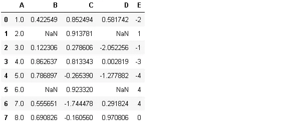

它看起来简单明了。我们可以编写一个函数，根据条件用不同的颜色显示一些值。例如，我们可以选择用红色显示负值。下面是完成这项任务的函数。

```
def color_negative_values(val):
  color = 'red' if val < 0 else 'black'
  return 'color: %s' % color
```

然后我们把它传递给 applymap 方法。

```
df.style.applymap(color_negative_values)
```

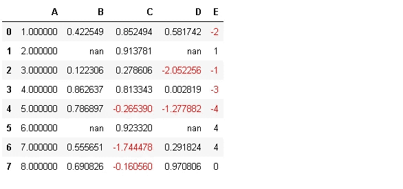

**Applymap** 执行基于元素的操作，而 **apply** 基于列或行执行操作。这是一个改变列中最大值的背景颜色的函数。

```
def color_max(s):
    is_max = s == s.max()
    return ['background-color: lightblue' if v else '' for v in    is_max]
```

我们只需要通过它来应用方法。

```
df.style.apply(color_max)
```

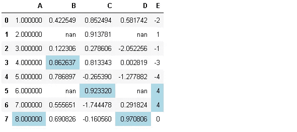

我们还可以通过将 axis 参数设置为 1 来将该函数应用于行。

```
df.style.apply(color_max, axis=1)
```

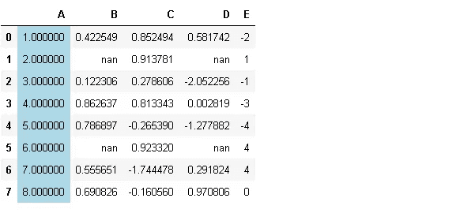

每行的最大值是彩色的。在这种情况下，它们恰好在“A”栏中。

我们可以通过链式操作来组合不同风格的功能。

```
df.style.applymap(color_negative_values).apply(color_max)
```

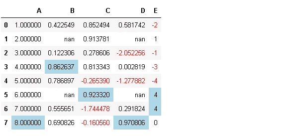

通过使用**子集**参数选择特定的行或列，样式功能可部分应用于数据帧。

```
df.style.apply(color_max, subset=['B','C'])
```

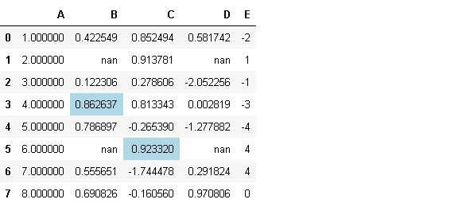

Color_max 函数应用于列“B”和“C”。

除了定制的功能之外，pandas 还有一些内置的功能，可以满足一些常见的任务。例如， **highlight_null** 函数标记缺失值。

```
df.style.highlight_null(null_color='yellow')
```

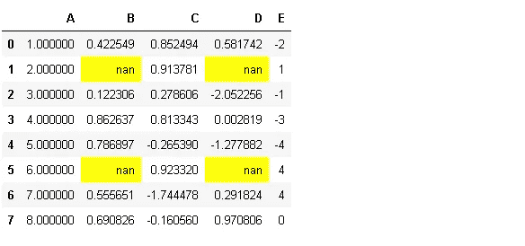

我们可以用 **null_color** 参数改变颜色。另一个有用的内置函数是 **background_gradient** ，它在 seaborn 的帮助下标记与值成比例的单元格。

```
import seaborn as snscm = sns.light_palette("green", as_cmap=True)df.style.background_gradient(cmap=cm)
```

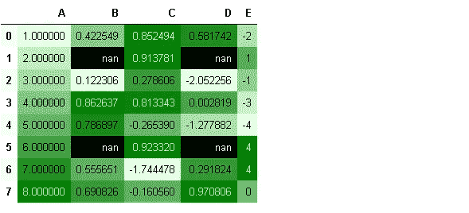

值越大，背景颜色越深。缺失值与其余值分开。

**Highlight_max** 和 **highlight_min** 函数像我们的自定义 color_max 函数一样标记一列或一行中的最大值和最小值。

```
df.style.highlight_min(color='lightgreen', axis=1)
```


```
df.style.highlight_max()
```

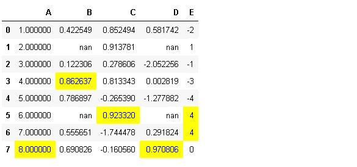

axis 参数的默认值为 0，执行列操作。

**Set_properties** 功能允许组合多种风格选择。

```
df.style.set_properties(**{'background-color': 'lightblue',
                           'color': 'black',
                           'border-color': 'white'})
```

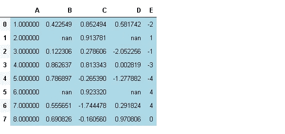

另一个非常有用的函数是 **bar** ，它在单元格上绘制条形，条形的长度与单元格中的值成比例。

```
df.style.bar(color='lightgreen')
```

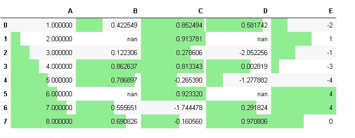

通过使用 **align** 参数，我们可以用不同的颜色显示负值和正值。

```
df.style.bar(align='mid', color=['red', 'lightgreen'])
```

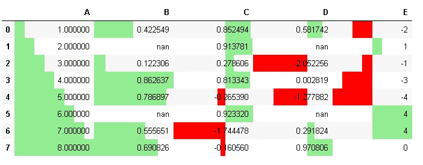

# **传送样式**

我们在这里使用的样式函数非常简单。然而，我们也可以创建更复杂的样式函数来增强数据帧的信息能力。我们可能希望在我们处理的所有数据帧上使用相同的样式。Pandas 提供了一种在数据帧之间转换样式的方法。

我们首先将样式保存到 styler 对象中。

```
style = df.style.applymap(color_negative_values).apply(color_max)
style
```

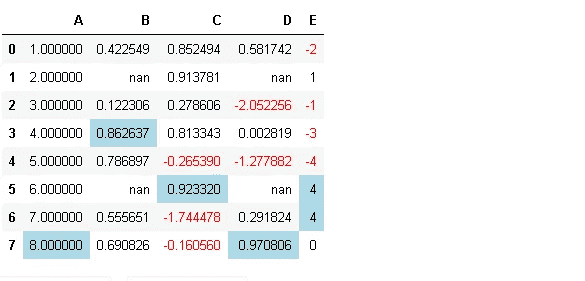

让我们创建另一个示例数据帧。

```
df2 = pd.DataFrame({'col1':np.random.random(8),
                   'col2':np.random.randn(8),
                   'col3':np.random.randint(-5,5,8)})
df2
```

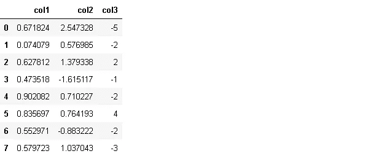

然后，我们可以创建另一个 styler 对象，并使用保存在前一个 styler 对象中的相同样式。

```
style2 = df2.style
style2.use(style.export())
style2
```

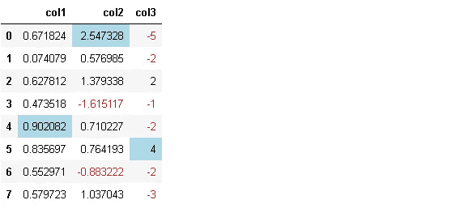

我们已经覆盖了

*   如何创建自定义样式函数并应用于数据框架
*   如何使用内置样式函数
*   如何将样式从一个 styler 对象转移到另一个

在 pandas 用户指南的[样式部分](https://pandas.pydata.org/docs/user_guide/style.html)有其他可用的样式和格式选项。

感谢您的阅读。如果您有任何反馈，请告诉我。