# StyleGAN v2:训练和潜在空间探索笔记

> 原文：<https://towardsdatascience.com/stylegan-v2-notes-on-training-and-latent-space-exploration-e51cf96584b3?source=collection_archive---------2----------------------->

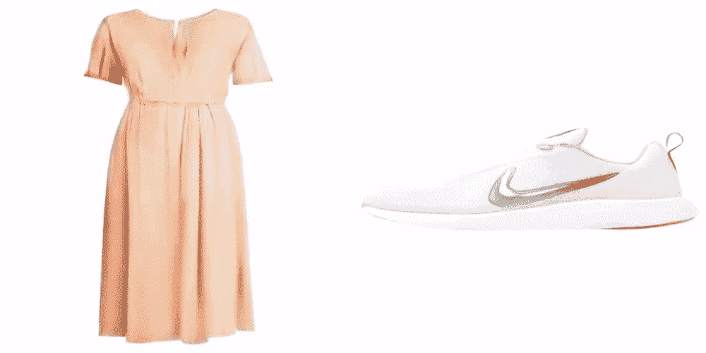

**内容:**在这篇文章中，我将展示我在训练多个 StyleGAN 模型和探索学习的潜在空间时收集的笔记、想法和实验结果。

**为什么:**这是一个想法/考虑的垃圾场，范围从显而易见的到“神圣的钼”，旨在为其他有类似兴趣和意图的人提供洞察力或讨论的起点。因此，可以浏览一下，看看是否有什么感兴趣的东西。

我也在这里大量利用[坎宁安定律](https://en.wikipedia.org/wiki/Ward_Cunningham#Cunningham%27s_Law)。

许多考虑因素适用于 StyleGAN v1 和 v2，但是所有生成的结果都来自 v2 模型，除非明确指定。

就代码资源而言:

*   [StyleGAN v1](https://github.com/NVlabs/stylegan) 和 [v2](https://github.com/NVlabs/stylegan2) 官方回购
*   [v1 用编码器(+方向学习](https://github.com/Puzer/stylegan-encoder))和[v2 用编码器](https://github.com/rolux/stylegan2encoder)

这里的所有内容都是通过[我定制的 Jupyter 笔记本](https://github.com/5agado/data-science-learning/tree/master/deep%20learning/StyleGAN)在这些回复的基础上生成的。

值得一提的是勤勤恳恳分享代码、实验和宝贵建议的人: [Gwern](https://twitter.com/gwern) ( [TWDNE](https://www.gwern.net/Faces) )， [pbaylies，](https://twitter.com/pbaylies) [gpt2ent，](https://twitter.com/gpt2ent) [xsteenbrugge，](https://twitter.com/xsteenbrugge) [Veqtor](https://twitter.com/Veqtor) ， [Norod78](https://twitter.com/Norod78) ， [roadrunner01](https://twitter.com/ak92501) 。所有这些都非常值得关注。

# 培养

## 资料组

对于自定义数据集，需要预先创建一组图像，确保所有条目具有相同的方形和颜色空间。然后，您可以生成 tf 记录，如这里的[所述](https://github.com/NVlabs/stylegan2#preparing-datasets)。
正如人们多次指出的那样，这个模型非常渴求数据。数据集大小要求因图像内容而异，但一般目标是 4 到 5 个数量级，比如有镜像时大约 50k，没有镜像时加倍。这适用于从头开始的训练，而在微调的情况下，已经在非常小的数据集上进行了许多实验，提供了有趣的结果。

我主要用两个“时尚”数据集进行实验

*   服装(~30k 包装照片)
*   鞋类(~ 140，000 包照片)

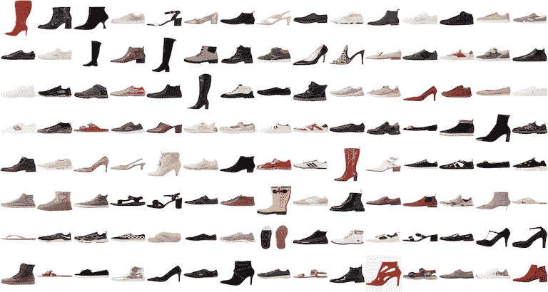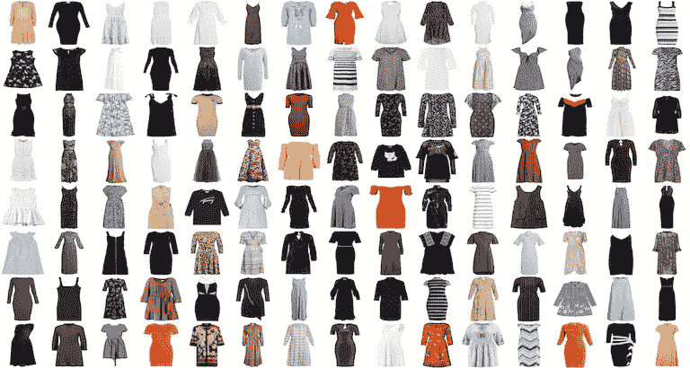

来自鞋类和服装数据集的真实图像样本

但是也将展示一些在人工策划的艺术数据集上的实验(每个数据集大约 1k 张图片)。

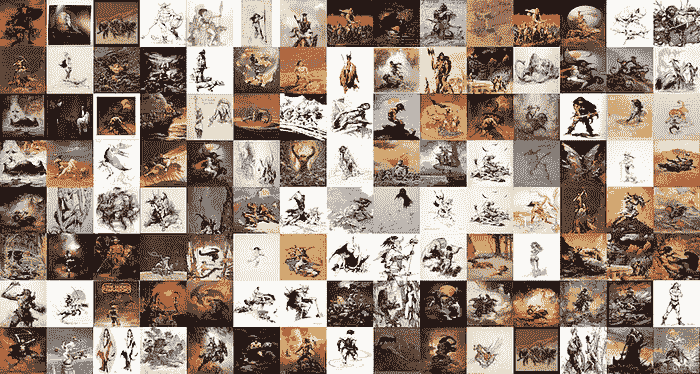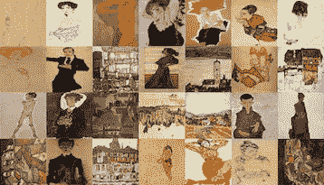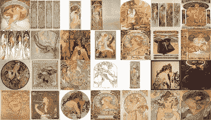

真实图像样本(弗兰克·弗兰泽塔，埃贡·席勒，阿尔丰斯·穆夏)

请注意，时尚数据集的内容一致性更高(在位置、背景等方面。).与艺术作品相比。因此，无论数据集大小如何，我们都希望前者能够达到更高的生成精度。

服装图像是应该启用**镜像增强**的一个例子，因为我们可以免费加倍我们的训练集，学习服装的语义不变属性用于水平镜像。

相反，鞋类是应该禁用镜像的情况，因为数据集中的所有图像都是对齐的，并且学习镜像版本对于网络来说只是不必要的负担。

关于大小，我选择 512 来首先验证结果。从之前其他网络的实验来看，我相信这是一个捕捉图案、材质和纽扣、拉链等小细节的好方法。我还计划在 256 上进行下一次迭代，并验证所学表述的质量以及与训练制度的比较。
我建议，如果你有合适的硬件资源，并且已经用较小的分辨率验证了你的数据集，那么就转到全 1024 分辨率(或更高)。

## 火车

人们可以从头开始训练模型，或者利用以前训练的结果，将学习到的表示微调到新的数据集。

**从头开始训练**就像运行以下程序一样简单

```
python run_training.py -num-gpus=2 -data-dir=<your_data_dir> -config=config-f -dataset=<your_dataset_name> -mirror-augment=True -result-dir=<your_results_dir>
```

我们已经讨论过镜像增强，GPU 的数量取决于您的设置。

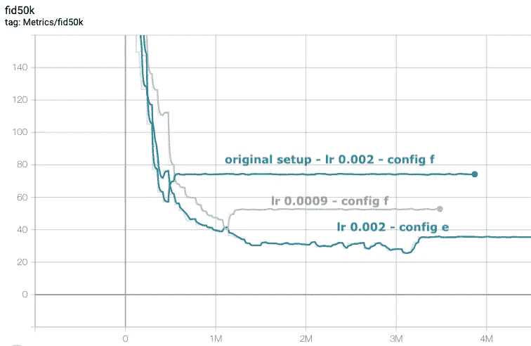

服装数据集多次训练的 fid50k 曲线比较

**配置**用于控制模型的架构和属性，从 *config-a* (最初的 SyleGAN v1)开始，逐步添加/更改组件(权重解调、惰性正则化、路径长度正则化)到*config-e*(v2 的完整更新设置)，加上 *config-f* ，一个更大的网络版本 *config-e* 和本文中使用的默认设置。
对于我的 512 大小的数据集，我选择了 *config-e* 。在 *config-f* 中增加的复杂性主要是由在训练时探索网络对更高分辨率的隐含关注时注意到的信息瓶颈引起的，因此我的基本原理是增加的复杂性只会对训练稳定性更加有害。

**微调**用于节省时间，依赖于先前模型已经学习的结构，并试图使这样的结构适应新的目标数据集。我也见过[人](https://twitter.com/Norod78)使用与原始数据集不完全相关的图像进行微调，所以这很大程度上取决于你的目标。微调提供了关于训练质量的更快的视觉反馈，因此更容易运行多次迭代和实验，这是最初了解更多模型行为和超参数的好方法。

要微调现有网络，需要指定要重新启动的快照。对于 v2，这是在[*run _ training . py*](https://github.com/NVlabs/stylegan2/blob/master/run_training.py)中完成的，通过添加和修改以下内容

```
train.resume_pkl = "your_network_snapshot.pkl"  # Network pickle to resume training from, None = train from scratch.
train.resume_kimg = 0.0  # Assumed training progress at the beginning. Affects reporting and training schedule.
train.resume_time = 0.0  # Assumed wallclock time at the beginning. Affects reporting.
```

请注意，根据您的快照指定`resume_kimg`是多么重要，因为它用于控制训练计划(如学习率衰减)。

## 监测进展

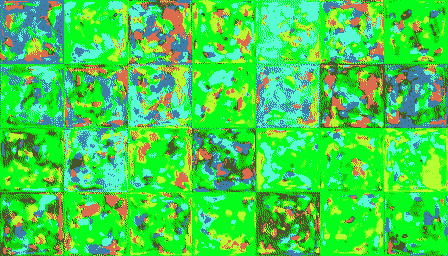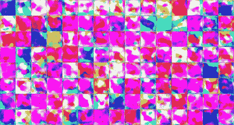

StyleGAN v1(左)和 v2(右)的训练进度对比

在训练时，我看到的主要**度量**是 [Frechet 初始距离(FID)](https://nealjean.com/ml/frechet-inception-distance/) ，默认情况下，它是在 50k 图像上每 50 个训练刻度计算一次。如 [repo 自述文件](https://github.com/NVlabs/stylegan2#evaluation-metrics)中所述，可以调用其他指标。注意，Tensorflow 日志是在目标目录中生成的，可以通过运行 tensorboard 来访问

```
tensorboard --logdir <LOGS_TARGET_DIR>
```

除了 FID 之外，您还可以在这里检查分数/假和分数/真，这分别是假图像和真图像的鉴别器预测。由于标签最初可能会产生误导，因此值得再次指出，这些不是损失值，而是鉴别器的纯预测输出。

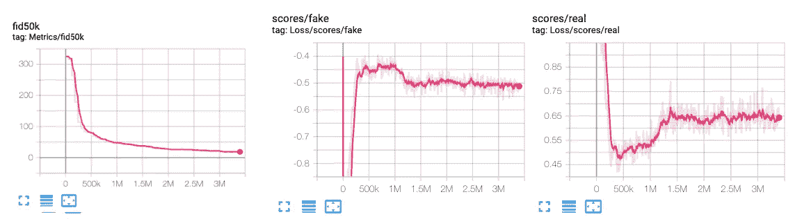

张量板图

我试图从这些图表中获得一些指导，但发现很难提取网络运行情况的精确信息。理想情况下，人们希望鉴别器不能区分真假，因此趋向于零，因为这只是随机猜测。其他次要指标也是基于损失选择。例如，默认情况下，鉴别器使用带有 R1 正则化的[逻辑损失，](https://arxiv.org/pdf/1801.04406.pdf)提供梯度罚分图。

对于我的数据集，FID 很好地映射到个人感知的图像质量，但由于度量是基于从 inception v3 模型中提取的特征之间的汇总统计比较来计算的，因此它可能对其他类型的数据集没有帮助，特别是度量值越趋于零。
我仍然建议避免在短期训练期间进行视觉比较，因为我们的主观近似判断往往会因我们所观察的特定示例或甚至仅因噪声贡献而产生偏差，尽管假样本中没有可察觉的变化，但网络可能仍在改进。

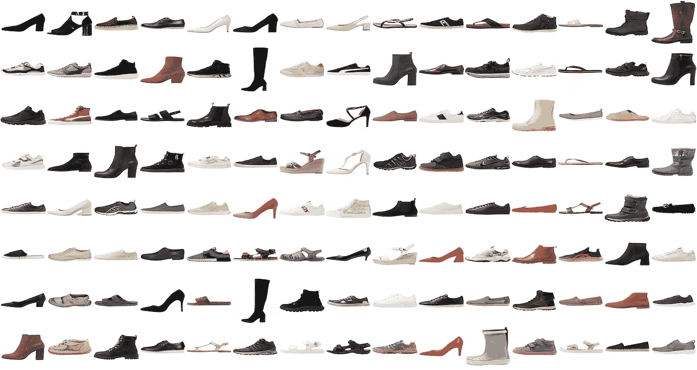

约 10，000 公里后为鞋类数据集生成的图像

另一方面，通过视觉检查，人们可以很容易地发现像**模式崩溃**这样的问题，如以下为穆卡数据集生成的假样本所示。

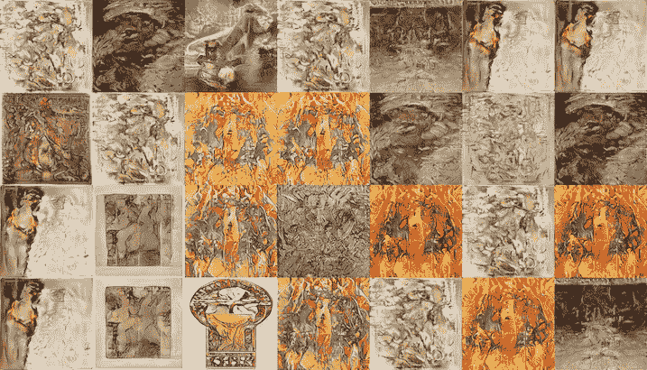

穆卡数据集的部分模式折叠示例

这是部分模式崩溃的一个例子，生成器被减少到只生成几个例子，在多样性方面有所损失。造成这种情况的一个主要原因可能是数据集的规模较小，再加上常见的重复条目。

请参见下面的 Franzetta art 示例，尤其是与训练曲线相关的示例。虽然有些条目可能会给人模式崩溃的印象，但更有可能的是，对于该特定示例，训练数据集中的重复项太多了。

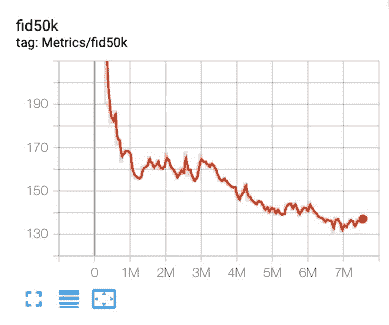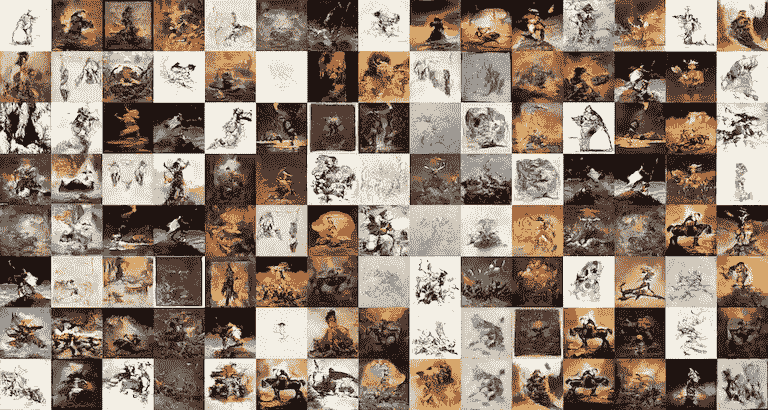

Franzetta 数据集的 FID50k 曲线，带有在最后一步生成的假图像样本

## 调整和超参数调谐

一个像样的数据集通常应该提供一个遵循[帕累托分布](https://en.wikipedia.org/wiki/Pareto_distribution)的良好的训练曲线。[官方自述文件](https://github.com/NVlabs/stylegan2#training-networks)指定了不同配置的训练时间，但是正如所说的，你将在训练的第一部分获得大部分的改进；棘手和繁琐的部分是试图达到更好的质量细节。

平台是一种常见的情况，模型很少或没有改进。另一种可能但不太常见的行为是发散或爆炸，在初始步骤改进后，模型开始恶化，并以指数形式退化为纯噪声结果。

针对这种情况采取的行动是从先前的检查点重新训练(如先前的*微调*部分所述)，根据识别的问题合理地调整超参数。正如经常提到的，这本身就是一门艺术，强烈地基于直觉、经验和运气。
根据目标、模型状态等，有多种可能性..以下是一些最常见的建议，并附有一些经验笔记。

*   像往常一样，如果你的数据集在大小或噪音方面有明显的缺陷，花些精力去修复它们，而不是冒险在模型调优上浪费时间
*   **learning-rate (lr)** ，在这里您可以降低 lr 以获得潜在的更稳定(但缓慢)的训练进度。您还可以根据架构中可能存在的两个组件之间的不平衡，单独调整鉴频器和发生器的 lr。对此， [Shawn Presser](https://twitter.com/theshawwn) 在推特上指出[v2 其实有一个 bug](https://twitter.com/theshawwn/status/1230022825538248704) ，针对这个 bug，生成器 lr 值被错误地用作鉴别器 lr。在试验 G/D lr 平衡之前，一定要修补这个部分。我试着增加 lr，只是为了搞笑，但总是以快速突然的发散结束。
*   **批量**，增加批量也可以提供更稳定的训练或从局部最小值突破。这是基于这样的想法，即随着越来越多的预测用于计算梯度，权重更新和训练方向将越精确。我用更大的 minibatch 运行的多个实验迫使 FID50k 增加了一个很好的百分点，但其中一些很快变得不稳定并爆炸。此外，请注意您的设置的内存限制，v2 更昂贵，1024 分辨率的培训需要至少 16 GB 内存的 GPU。
    值得指出的是，StyleGAN 有两个不同的批量参数，`minibatch_size_base`和`minibatch_gpu_base`。前者是要使用的实际最大 minibatch 大小，而后者是单个 GPU 一次处理的大小。这意味着这两个参数需要根据您的设置的 GPU 数量进行调整，因为梯度会累积，直到达到基本迷你批次大小。

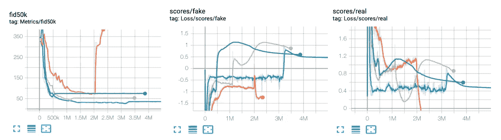

训练曲线:用相同的数据集测试不同的超参数

关于这些方面，我想再次建议 [Gwern StyleGAN v1 post](https://www.gwern.net/Faces) ，因为它提供了深入的细节和参考，如果你想进一步探索 GAN-training，还有三篇额外的优秀论文:[稳定生成性对抗网络训练:调查(2019)](http://arxiv.org/abs/1910.00927) ，[GAN 的哪些训练方法实际上是趋同的？(2018)](http://arxiv.org/abs/1801.04406) ，[训练甘斯的改进技术(2016)](https://arxiv.org/abs/1606.03498) 。

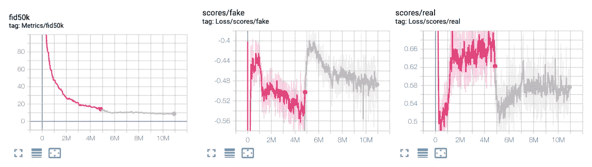

一些行为仍然困扰着我，比如在我从之前的检查点(相同的配置)重新开始训练后，是什么导致了损失分数的变化。

# 潜在空间探索

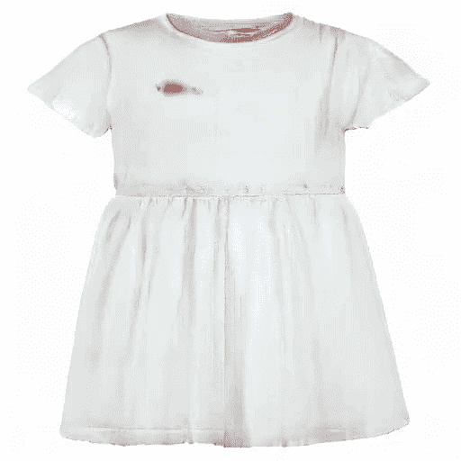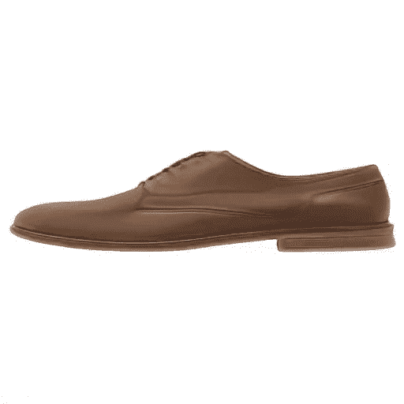

服装和鞋类数据集的结果

## 漫步在林荫道上

以上是我的服装和鞋款潜在空间探索的一些例子。其思想只是生成 N 个样本向量(从高斯分布中提取)并使用任何优选的转换函数在它们之间顺序转换。在我的例子中，这个函数只是一个固定帧数的线性插值(相当于变形)。

请注意，我们依赖于非常初始的潜在向量 *z.* 这意味着我们使用 StyleGAN 映射网络来首先生成潜在向量 *w* ，然后使用 *w* 来合成新图像。由于这个原因，我们可以依靠截断技巧，丢弃潜在空间中表现不佳的区域。我们想要指定所生成的中间向量 *w* 必须接近平均值多少(基于映射网络的随机输入来计算)。ψ (psi)值衡量了 *w* 与平均值的偏差，因此可以针对质量/品种的权衡进行调整。ψ=1 相当于没有截断(原始的 *w* ),而值越接近 0，我们越接近平均值，质量有所提高，但多样性有所减少。

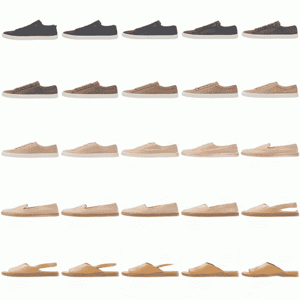

截断技巧在起作用，这里线性间隔从-0.5(左上)到 1.5(右下)

## 编码真实图像

我们经常希望能够获得关于目标模型的真实图像的代码/潜在向量/嵌入，换句话说:我应该馈送给我的模型的输入值是什么，以生成我的图像的最佳近似。

一般来说，有两种方法:

*   通过网络的编码器组件传递图像
*   优化潜在(使用梯度下降)

前者提供了一个快速的解决方案，但在训练数据集之外推广时存在问题，不幸的是，对我们来说，它不是现成的标准样式。该架构根本不学习显式编码功能。

我们只剩下使用感知损失的**潜在优化选项**。我们为参考和生成的图像提取高级特征(例如，从像 VGG 这样的预训练模型中)，计算它们之间的距离，并优化潜在表示(我们的目标代码)。该目标代码的**初始化对于效率和效果来说是一个非常重要的方面。最简单的方法是简单的随机初始化，但可以做很多事情来改进这一点，例如通过学习从图像到潜像的显式编码函数。想法是随机生成一组 N 个示例，并存储生成的图像和生成它的代码。然后，我们可以在这些数据上训练一个模型(例如 ResNet ),并在实际的 StyleGAN 编码过程之前使用它来初始化我们的 latent。参见[关于改进初始化的丰富讨论](https://github.com/rolux/stylegan2encoder/issues/2)。**

用于 v1 的[编码器](https://github.com/Puzer/stylegan-encoder)和用于 v2 的[编码器](https://github.com/rolux/stylegan2encoder)为该操作提供代码和分步指南。我还推荐以下两篇文章: [Image2StyleGAN](http://arxiv.org/abs/1904.03189) 和 [Image2StyleGAN++和](http://arxiv.org/abs/1911.11544)，它们很好地概述了 StyleGAN 的图像编码，考虑了初始化选项和潜在空间质量，并分析了图像编辑操作，如变形和样式混合。

## w(1)对 w(N)

StyleGAN 使用映射网络(八个完全连接的层)将输入噪声(`z`)转换为中间潜在向量(`w`)。两者的大小都是 512，但是中间向量是为每个样式层复制的。对于在 1024 尺寸图像上训练的网络，该中间向量将是形状(512，18)，对于 512 尺寸，它将是(512，16)。

编码过程通常在这个中间向量上完成，因此可以决定是优化`w(1)`(意味着只有一个 512 层，然后根据需要平铺到每个样式层)还是整个`w(N)`。官方放映员操作前者，而改编通常依赖于单独优化所有`w`条目，以达到视觉保真度。关于这个话题，请参见[这个 Twitter 帖子](https://twitter.com/robertluxemburg/status/1216854802254254082)。

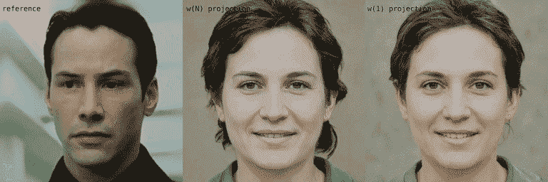

使用 Nvidia FFHQ 模型投影到 w(N)和 w(1)的比较

当投影不适合模型训练分布的参考时，更引人注目，就像在下面的示例中为 FFHQ 模型投影服装图像。

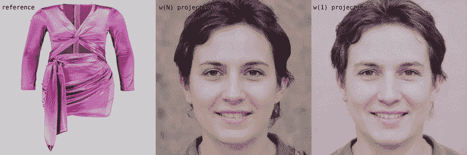

一般来说，人们总是会注意到，对于高分辨率，投影仪似乎无法匹配参考图片的精细细节，但这很可能是使用 256x256 分辨率的感知损失的结果，如[本主题](https://twitter.com/quasimondo/status/1226801679208718336)所示。

## 学习方向

StyleGAN 对潜在空间解缠的改进允许以令人愉快的正交方式探索数据集的单个属性(意味着不影响其他属性)。
鉴别模型学习区分目标属性的界限(例如，男性/女性、微笑/不微笑、猫/狗)，而我们感兴趣的是跨越这些界限，垂直于它们移动。例如，如果我从一张悲伤的脸开始，我可以缓慢但稳定地移动到同一张脸的微笑版本。

这应该已经提供了如何学习新方向的提示。我们首先从我们的模型中收集多个样本(图像+潜像),并针对我们的目标属性对图像进行手动分类(例如，微笑与不微笑),试图保证适当的类别表示平衡。然后，我们训练一个模型来对我们的潜在客户和人工标签进行分类或回归。此时，我们可以使用这些支持模型的学习功能作为过渡方向。

[罗伯特·卢森堡](https://twitter.com/robertluxemburg)分享了【FFHQ 官方车型的学习方向。

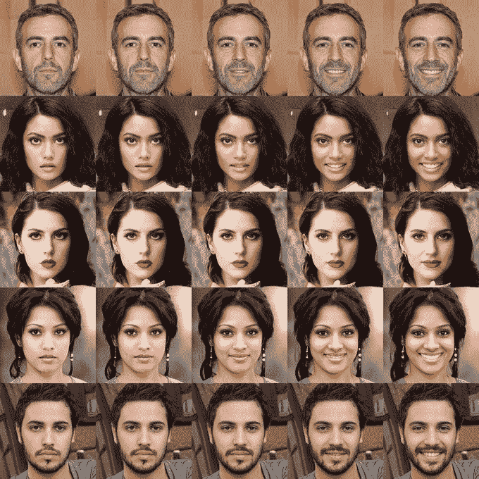

样从玩弄微笑潜向

[用于前馈图像处理的 StyleGAN2 蒸馏](https://arxiv.org/abs/2003.03581)是一篇非常新的论文，通过在 StyleGAN 生成的不成对数据集上训练的“学生”图像到图像网络来探索方向处理。该论文旨在克服编码性能瓶颈，并学习能够有效地应用于真实世界图像的变换函数。

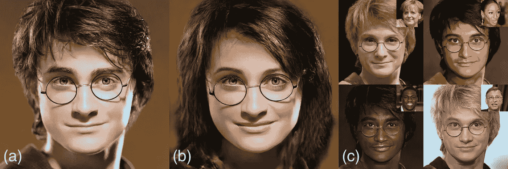

来自论文“用于前馈图像处理的 StyleGAN2 蒸馏”的例子

# 结论

我的很多实验最初都是为了评估 StyleGAN 模型学习的潜在空间有多好(**表示学习**)，以及获得的嵌入对于下游任务(例如，通过线性模型的图像分类)有多好。一方面，我将继续致力于这种评估，试图涵盖其他生成模型类型，如[自回归](http://www.offconvex.org/2018/07/27/approximating-recurrent/)和[基于流程的模型](https://openai.com/blog/glow/)。

我也有兴趣探索这种模型的纯图像合成能力，以及有效的语义混合和编辑的日益增长的潜力，特别是与我对[绘画、数字绘画和动画](https://www.instagram.com/amartinelli1/)的热情有关的方面。[自动线条画着色](https://github.com/lllyasviel/style2paints)、[动画绘画](https://www.ebsynth.com/)、[帧插值](https://grisk.itch.io/dain-app)已经有了一些很棒的免费工具，但是对于 [**辅助绘图**](https://medium.com/@samim/assisted-drawing-7b26c81daf2d) 还有很多可以做的，特别是从更语义的角度来看。实际改进的空间也很大:泛化能力、加快推理时间、训练优化和迁移学习。

接下来，我还想超越纯粹的二维画布，更多地了解在 3D 图形领域已经取得的惊人成就。[去噪](https://www.youtube.com/watch?v=fONxsfY9nO0)是我现在经常依赖的东西，[可微渲染](https://rgl.epfl.ch/publications/Loubet2019Reparameterizing)只是让我意乱情迷，为了闭环，又回到了 [GAN 进行连续的 3D 形状生成](https://marian42.de/article/shapegan/)。

引用科学家卡罗里·索尔奈-费希尔

> “多么美好的活着的时光”

> 你可以在 [Github](https://github.com/5agado/data-science-learning) 上查看我的代码，在 [Twitter](https://twitter.com/5agado) 上关注我的更多实验和解释，并在 [Instagram](https://www.instagram.com/amartinelli1/) 上查看我的图形结果。

***免责声明*** *:目前我不能分享数据集和训练模型。抱歉。*