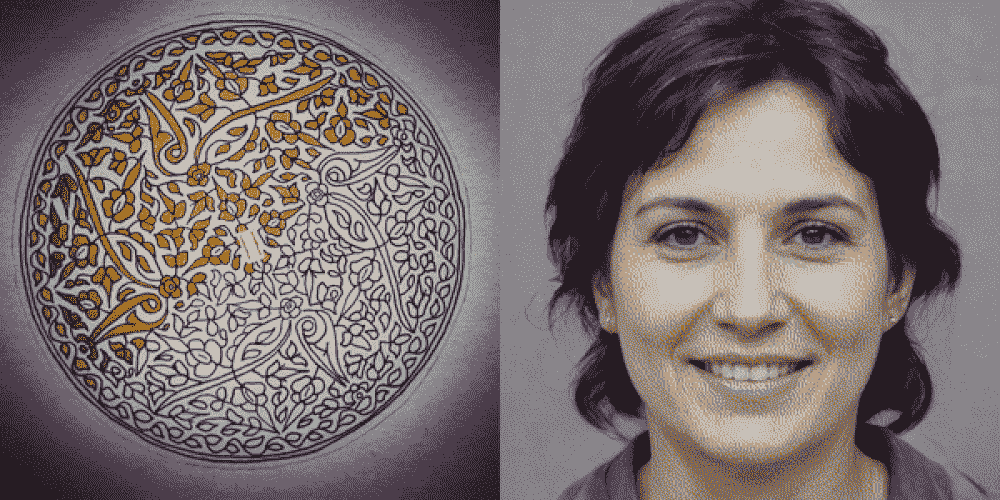
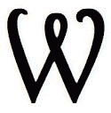
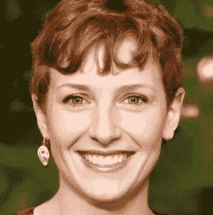
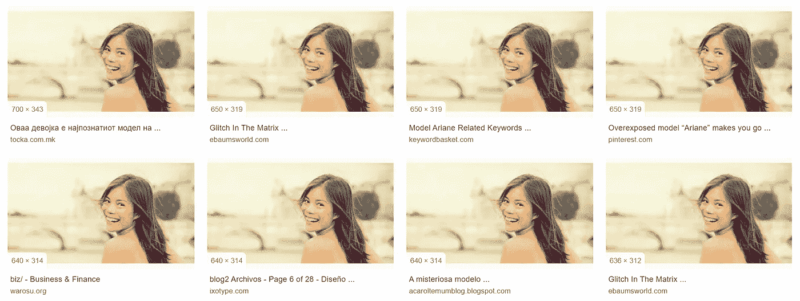
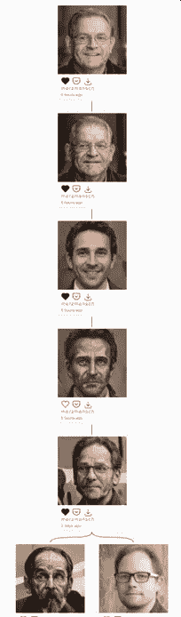
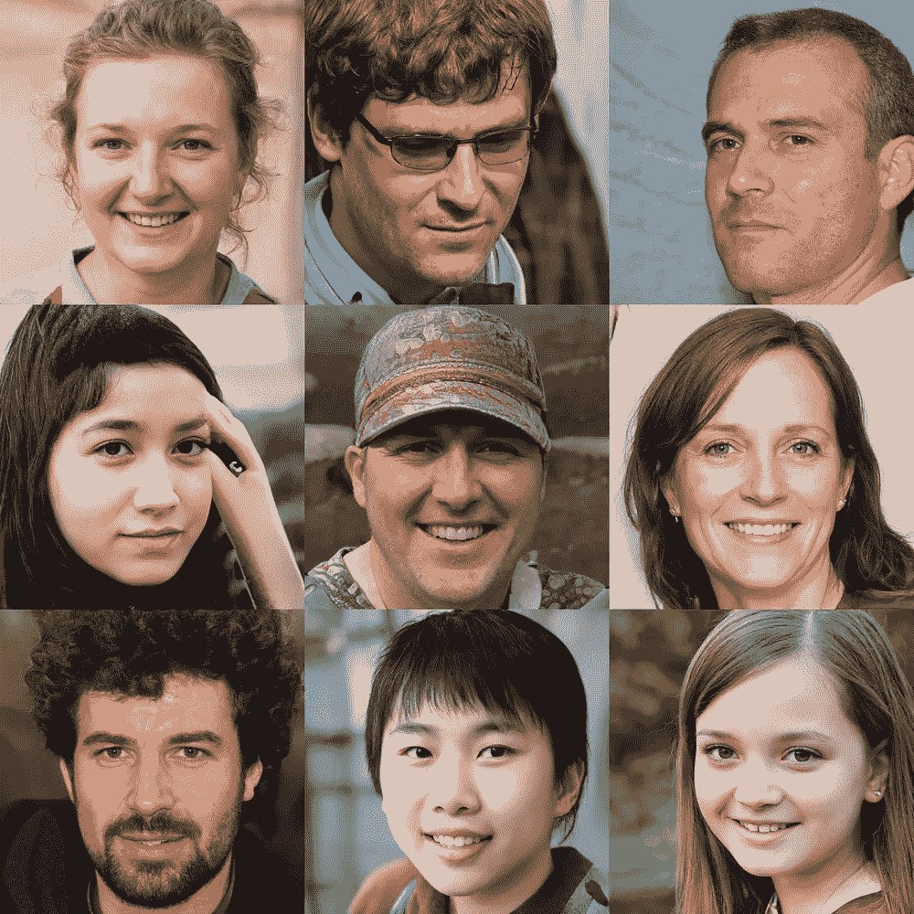
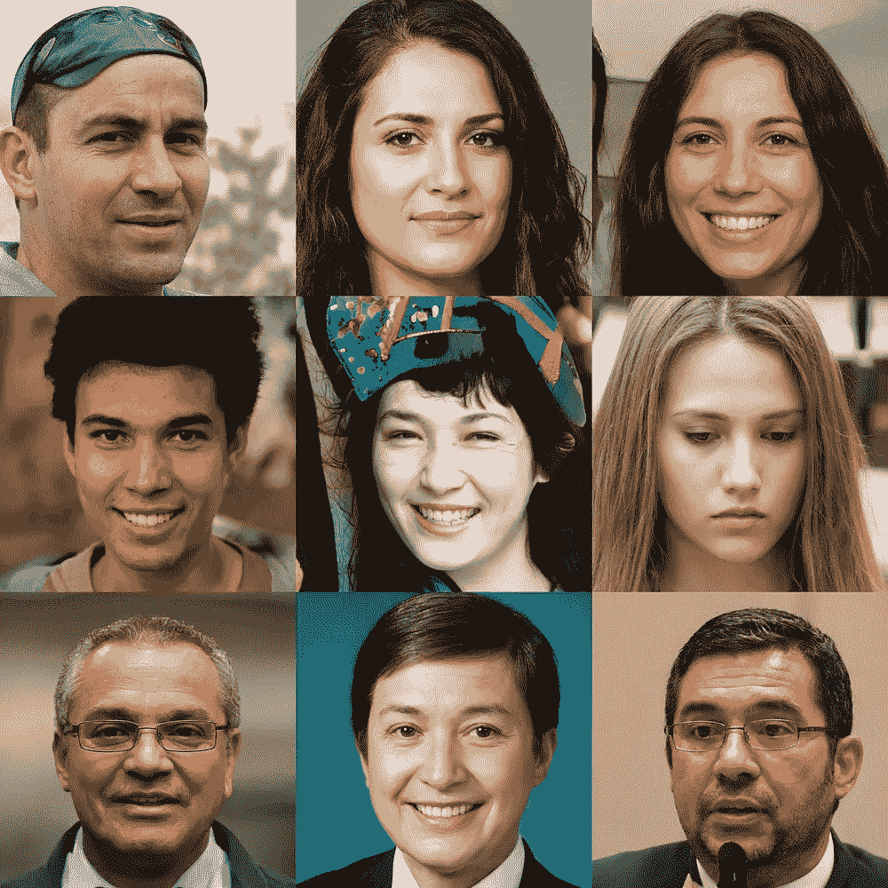
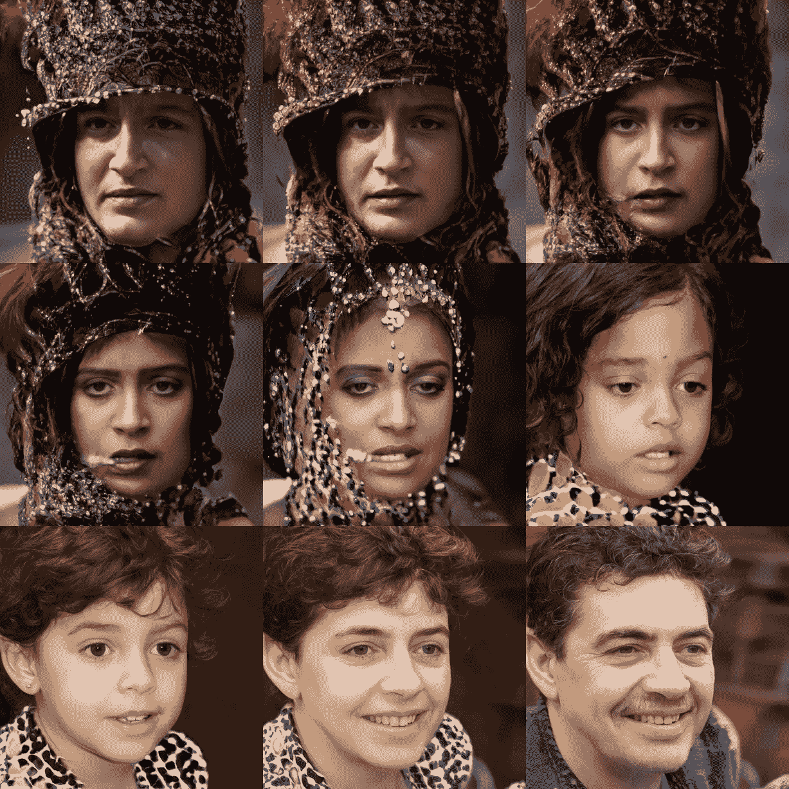
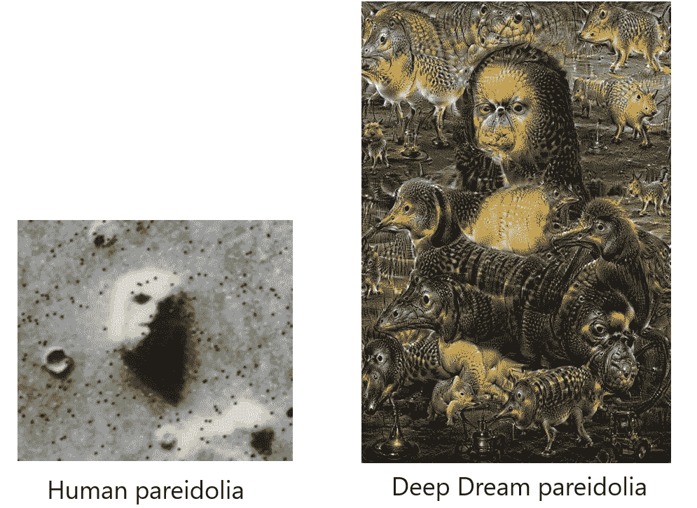
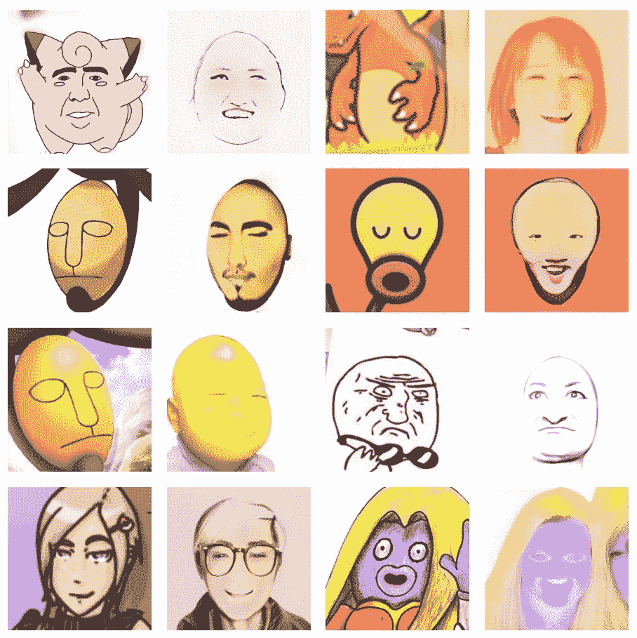

# StyleGAN2 投影。一种可靠的图像取证方法？

> 原文：<https://towardsdatascience.com/stylegan2-projection-a-reliable-method-for-image-forensics-700922579236?source=collection_archive---------15----------------------->

## 一些需要尝试的实验。还有艺术。

幻觉妄想

  W 随着 [StyleGAN2](https://github.com/NVlabs/stylegan2) ，一种全新品质的 GAN 驱动的图像生成方式进入了舞台。在性能和结果方面有显著的改进。[康纳缩短](https://medium.com/u/59216259c525?source=post_page-----700922579236--------------------------------)写了一篇[全面介绍](/stylegan2-ace6d3da405d)这款新车型:

*   更好的图像质量(和分辨率)
*   最大限度地减少图像伪影(如“斑点”或“水滴”)
*   风格混合(效果更好)
*   **将图像投影到潜在空间**

这里有一个简短的视频介绍 StyleGAN2，由 NVidia 团队的开发人员(Tero Karras 等人)制作。

**Colab 笔记本:**最近你还可以在[这款 Colab 笔记本](https://colab.research.google.com/drive/1ShgW6wohEFQtqs_znMna3dzrcVoABKIH)中试用 StyleGAN2(由 Mikael Christensen 改进了一些类似投影的功能)。

# 真相是什么？

关于真理的问题比以往任何时候都更加重要。各个时代的哲学家、艺术家和其他人都在寻找真理和谎言的区别。

在数字时代，我们得到了严峻的消息:证据受到质疑。“一图胜千言”*这种老套的观念已经不管用了。我们有#deepfakes、图像生成和其他(音频)视觉建设性的可能性。我们不能确定我们现在看到的图像是否代表真实事件，或者它是否是几秒钟前生成的。*

所以我们不得不谈谈**图像取证**。

现在已经有多种方法来鉴别真假图像:

**最明显(但不是最靠谱)的方法就是训练自己去检测假货。**

*   Kaggle 开启 [DeepFake 检测挑战](https://www.kaggle.com/c/deepfake-detection-challenge)。
*   有一个网站[http://www.whichfaceisreal.com/](http://www.whichfaceisreal.com/)开玩笑地训练你去发现被放大的图像。

如何检测假图像？

与比根相比，斯泰尔根是一个压倒性的发展。尽管如此，它在人脸生成方面还是有一些缺陷:

*   对称不是斯泰勒根的朋友。
*   你可能会在脸上和头发上发现奇怪的人造物，比如“气泡”。
*   耳环不一样(最普遍的因素之一)。
*   背景很奇怪。

<= This image shows various GAN glitches.

With StyleGAN2 new standards were established. “Bubble artifacts” were mostly fixed. Is it way too hard to detect fakes?

StyleGAN2 developers added a brilliant method to detect fake: **投影**。

# 什么是 StyleGAN2 投影？

方法很聪明。StyleGAN 将一个给定的图像投射到潜在空间——生成图像的起源。

它与**反向图片搜索**有一些表面上的相似之处(如使用 [TinEye](https://tineye.com/search/dfc1bae8aeeccfaf484e0e86225750ab80be3efa?page=1) 或[谷歌图片搜索](https://www.google.de/search?hl=en-DE&tbs=simg:CAQSrQIJGL_1fzLIi5zgaoQILELCMpwgaYgpgCAMSKN8alRqUGooFmx2VB9MatgWPEP8P5TGWMfMxsTHqJfcr-TD1Ja0x8SwaMOpPLOhswphaOdEivewuA1vCQpXNoQdHr2dcwxqG4il52wV3_1GFIT_1yQj8ss_1Ugp7iAEDAsQjq7-CBoKCggIARIEm6yIAgwLEJ3twQkamQEKFwoEZ2lybNqliPYDCwoJL20vMDVyNjU1CicKFHBvcnRyYWl0IHBob3RvZ3JhcGh52qWI9gMLCgkvbS8wY2htbDkKHwoLcGhvdG8gc2hvb3TapYj2AwwKCi9tLzAycWJsMW0KGwoIdmFjYXRpb27apYj2AwsKCS9tLzAyandxaAoXCgNmdW7apYj2AwwKCi9tLzBkczk5bGgM&sxsrf=ACYBGNTBfE6TFq2JlLofvx5kQPY151o4LQ:1578764837455&q=stock+photo+girl+ariane&tbm=isch&sa=X&ved=2ahUKEwj6z8eqjfzmAhWlM-wKHUoBDPcQ2A4oAXoECAcQKQ&biw=1280&bih=561&dpr=1.5)进行查找，如果图片是库存照片):

神秘的股票形象女孩(阿丽亚娜)

在某些情况下，它不仅会导致原始股票图像提供者，甚至会导致独特的人——就像上面的例子中的[股票图像模型 Ariane](https://vulcanpost.com/6176/overexposed-model-ariane-makes-you-go-she-is-everywhere/) (另一个故事)。

StyleGAN2 投影将相关图像与生成 GAN 图像的潜在空间进行比较，并寻找原点。

理论上。在实践中(你可以在 [Colab 笔记本](https://colab.research.google.com/drive/1ShgW6wohEFQtqs_znMna3dzrcVoABKIH)里尝试一下)，它……很复杂。

# 投影实验

已经有一些杰出的艺术家和研究人员对投影进行了令人惊叹的线程和测试，如[吉恩·科岗](https://twitter.com/genekogan/status/1205901296622067712)、[乔纳森·弗莱](https://twitter.com/jonathanfly/status/1212677486259179520)、[马里奥·克林格曼](https://twitter.com/quasimondo/status/1205119800453849089)、[迈克尔·克里斯滕森](https://twitter.com/SyntopiaDK/status/1206153385445068801)，仅举几例。不过还是自己试试吧。经验主义法则。

## 现状核实

第一次(一如既往)，我做了一个自我实验。只是为了确定我不是在某个潜在的空间里产生的:

因此，正如你(希望)看到的，这两张图片是不可比较的。我是真实的([又是](/donald-trump-is-an-android-3bf1173f3e88?source=friends_link&sk=fe92e297e9e21d5c1539282246383fdf))。

## 用 ArtBreeder 创建的图像。

接下来，我检查了我用 ArtBreeder 生成的这个**绅士**([你已经读过这个奇妙的系统](/artbreeder-draw-me-an-electric-sheep-841babe80b67?source=friends_link&sk=2fff2b9e102ce632d725e58bfa4c67dd))。由于 ArtBreeder 实现了用于面部生成的 StyleGAN2，您可以假设这是相同的潜在空间。但是…

**这个人是真的吗？**原物和投影相似但不相同。

甘+我的脸=无法察觉的假

事情是这样的:自从[art breader](https://artbreeder.com/)最近增加了**上传你的图像**并将它们与潜在空间中生成的图片混合的可能性，你不能再指望可用的图像了。

幸运的是，ArtBreeder 提供了*血统*功能，在这里你可以“按谱系”追踪到根源。

对于这位先生来说，**一部分是我的脸**，和另一个人混在一起:[https://artbreeder.com/lineage?k=45f6f4c1750ed4fe014202fb](https://artbreeder.com/lineage?k=45f6f4c1750ed4fe014202fb)

已经不是纯粹的 StyleGAN 了。

## StyleGAN2 生成的图像

让我们看看潜在空间本身。让我们用 StyleGAN2 直接创建图像。我做到了。很多都是。很好玩。

现在让我们随机挑选一张脸:

如你所见，这些面孔也很相似，但仍然不相同！

从这张夸张的插值图像中，我得到了令人惊讶的最佳结果:

我看到了第一张神秘的脸，瞧！

所以如果你偶然发现这位女士穿着异国情调的时装，你可以肯定地知道:这是假的。(如果你到那时还不好奇的话)。

# 结论

投射到潜在空间的想法很棒——而且是 StyleGAN2 所有品质不可避免的。假检测不再是人类的任务。我们不可靠。

尽管如此，还是有可能防止投影和反向搜索。因此，开发人员仍然必须找到如何不使我们的世界陷入完全混乱的方法。(剧透:来不及了)。

# 艺术呢？

说到人工智能，我总是指内在的艺术。你可以做许多你以前不能做的创新的事情(查看我的系列[艾&艺术](https://medium.com/merzazine/tagged/ai))。有一些新的艺术方法是几年前在最奇怪的梦里也想不出来的。

有了投影，我们可以做一些我们已经用[谷歌深梦](https://medium.com/merzazine/deep-dream-comes-true-eafb97df6cc5?source=friends_link&sk=6d50ebb59584b487183385009ba50f54)体验过的事情。我称之为**盲目崇拜**。

> ***在我的定义中:*
> Pareidolia** 是人脑识别各处模式的能力(即使它们不在那里)。在石器时代，这是一项至关重要的技能。我们最好下次把丛林和老虎混淆起来，而不是我们认不出丛林里的老虎。
> 石器时代已经过去，但我们仍处于这种觉知状态，看到火星上的脸和烤面包上的耶稣。
> **ParAIdolia** 是神经网络(如 CNN)识别其接受训练的模式动机的能力。即使是在白噪音中。[这就是为什么所有那些狗在最初的深度梦实验中](https://www.fastcompany.com/3048941/why-googles-deep-dream-ai-hallucinates-in-dog-faces)。

StyleGAN2 正在铺开，可用的 Colab 笔记本仍然提供了有限的型号选择: ***人脸******教堂******马、*** 等。但是 ***面孔*** 是一个有趣的面孔，因为我们可以尝试崇拜偶像。

***side note:****Jonathan Fly 对非人脸和艺术品进行了实验，StyleGAN 能找到的不仅仅是上面这些。*

所以，如果想知道 StyleGAN 是否梦到过大阪的惠比寿塔摩天轮:

假马里奥看起来像一个表情符号:

东京变成了一张令人毛骨悚然的脸:

最后，甚至装饰图案也变成了一场可怕的噩梦:

在这张来自[的历史照片中，大都会艺术博物馆最近的展览](https://news.artnet.com/exhibitions/met-historic-photography-gift-1746276) StyleGAN 认识到了一些非常令人不安的事情:

一个有趣的实验是，当乔纳森让斯泰尔根看一点点，而不是直到最终结果时，他用投影飞了起来。因此，即使非人类的模式也变成了人类。这里只是一个仍然来自他的综合 [**项目口袋妖怪**](https://iforcedabot.com/project-pokemon-not-too-much-mostly-faces/) 。

出自: [**项目口袋妖怪**](https://iforcedabot.com/project-pokemon-not-too-much-mostly-faces/) **作者乔纳森·弗莱(**[iforcedabot.com](http://iforcedabot.com))

如你所见，技术和艺术的界限再次被湮灭。

> 这些是人类和机器之间惊人的本体论对话。

**你会在潜在空间里发现什么？**

***发表你的发现吧！***