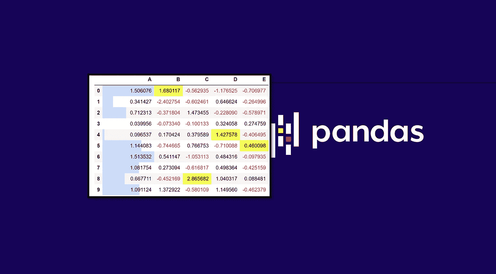
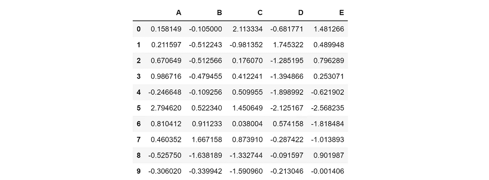
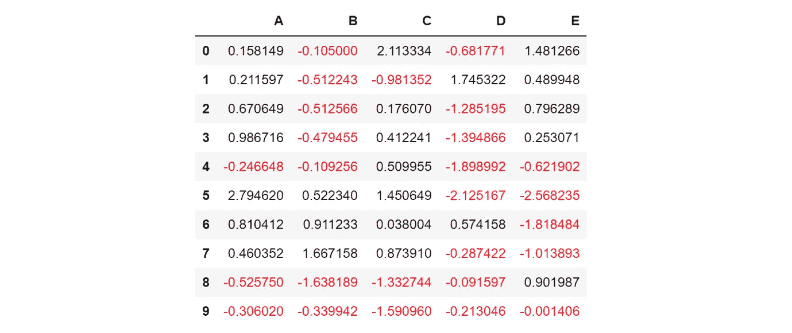
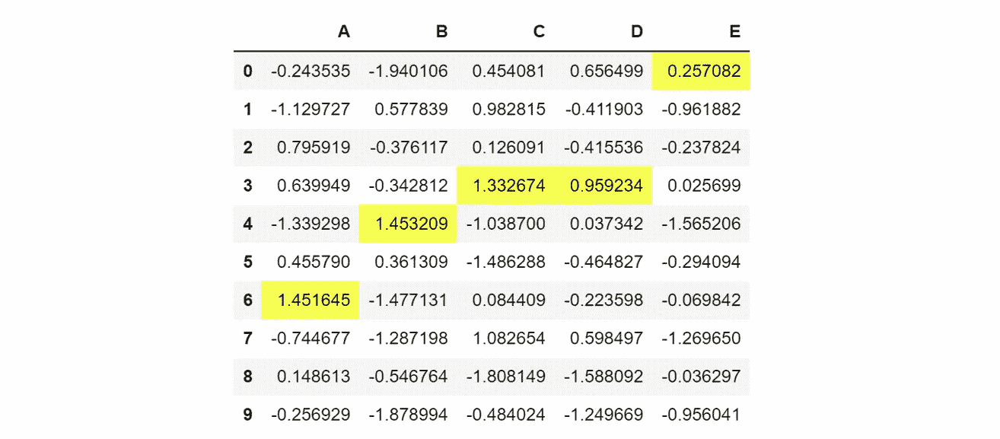
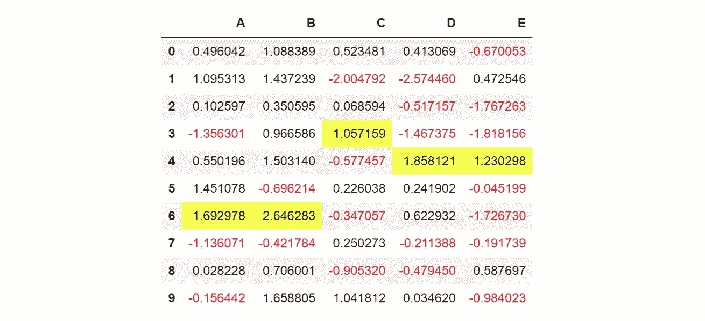
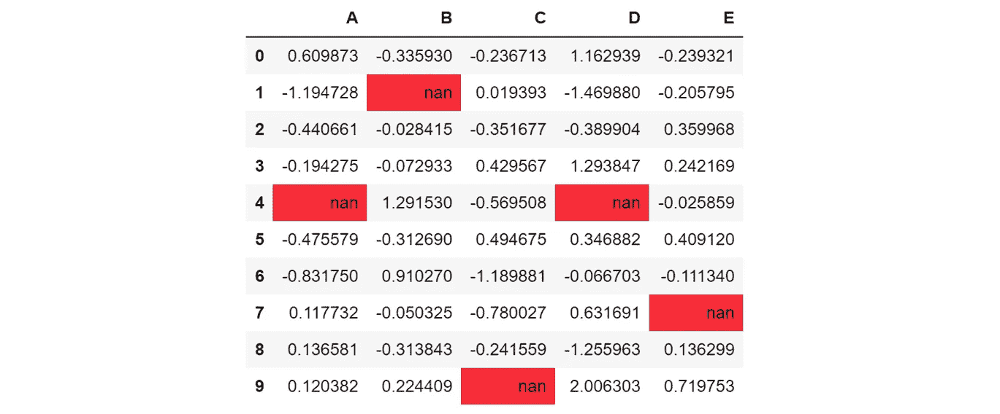
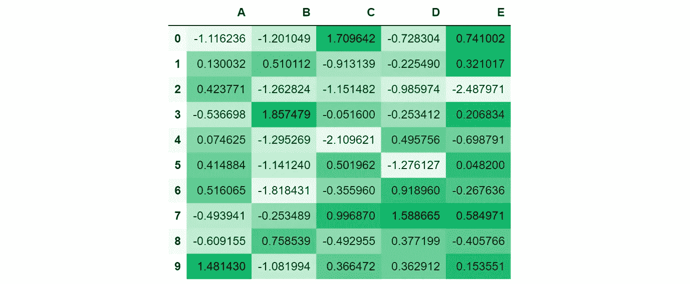
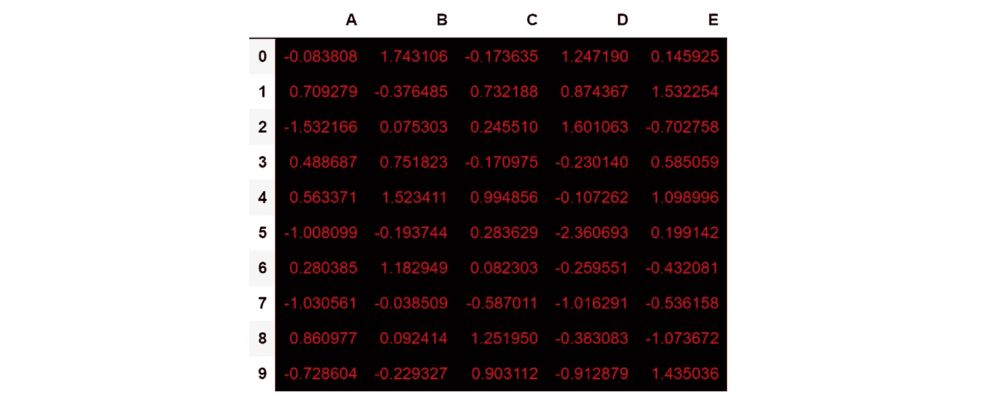
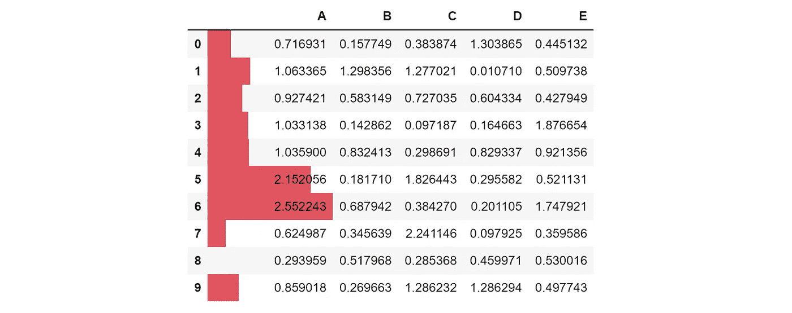

# 设计熊猫数据框架:不仅仅是数字

> 原文：<https://towardsdatascience.com/styling-pandas-dataframes-more-than-just-numbers-4bbb790fb919?source=collection_archive---------50----------------------->

## 让原始数据更有洞察力

数据帧是 Python 中操作和存储数据的最标准方法——但是您知道您可以存储的不仅仅是数字吗？Pandas 有多种方法来设计您的数据框架，既方便数据管理者，也方便查看数据的人。

首先，我们将生成一个样本数据帧。它有五列，每行十行，都是从正态分布中随机抽取的。

为了根据条件规则给数据帧着色，需要创建一个颜色映射。它以函数的形式存在，接受一个值，返回一个字符串“color: [color]”。该函数将负值涂成红色。标准颜色是可以接受的，但是十六进制代码也可以。

通过使用`.style.applymap`功能，颜色图被应用于数据帧。

现在，它看起来像这样:

例如，假设我们想用黄色突出显示每列中的最大值。就像给文本涂上某种颜色一样，我们需要创建一个样式函数。因为此函数突出显示系列中的最大值，而不是每个值的条件，所以此函数接受完整的列(系列)并返回该列中每个单元格的样式说明列表。

在这种情况下，不使用“color: [color]”，而是使用“background-color: [color]”(通常，颜色可以是标准颜色名称或十六进制代码)。

注意，因为这个函数应用于每一列而不是一个值，所以不要使用`apply_map` 而是使用`apply`。

您可能会发现，如果您之前已经应用了某些东西，那么应用`.style.apply`将会产生一个错误。这是因为使用函数创建的不是数据帧，而是样式化的对象。要组合许多样式元素，请使用 Python 方法链。

另一种方法是简单地将方法堆叠起来，例如`.style.highlight_null().apply().apply_map()`。

如果您想标记所有 NaN 值，使用`.style.highlight_null`。这对于使丢失的值更加明显特别有用。

要使数据帧成为热图——也就是说，值根据它们的值进行着色——使用`.style.background_gradient`方法。该方法接受一个`cmap`(颜色映射)参数，该参数指示它应该如何着色。在本例中，`cmap`是使用 seaborn 的`light_palette`创建的，它接受一个根颜色(在本例中，是蓝莓的十六进制代码)。第三行的`cmap`参数也可以设置为标准的调色板名称，如`viridis`或`magma`。

要设置固有的数据帧属性，使用`.style.set_properties`。它将一个字典作为参数，包含各种属性及其值。

人们甚至可以在 Pandas 数据框架中创建“条形图”,其中每个条形对应一个列的值。这对可视化非常有帮助。在这种情况下，`subset`指的是上面有条形的列。

# 如果你喜欢这个，

你可能会喜欢我的其他熊猫和 Python 数据科学库教程。

 [## 您的最终 Python 可视化备忘单

### 这个备忘单包含了你最常需要的一个情节的要素，以一种清晰和有组织的方式，用…

medium.com](https://medium.com/swlh/your-ultimate-python-visualization-cheat-sheet-663318470db)  [## 处理日期时间时你必须知道的 6 种方法

### 迄今为止最混乱的数据类型

medium.com](https://medium.com/analytics-vidhya/6-methods-you-must-know-when-dealing-with-datetime-fa0160fe579a)  [## 您的终极数据挖掘和机器学习备忘单

### 特性重要性、分解、转换等

medium.com](https://medium.com/analytics-vidhya/your-ultimate-data-mining-machine-learning-cheat-sheet-9fce3fa16)