# R 和 Python 在通过神经网络建模数据方面的风格差异

> 原文：<https://towardsdatascience.com/stylistic-differences-between-r-and-python-in-modelling-data-through-neural-networks-1156627ed07e?source=collection_archive---------29----------------------->

## [数据](https://towardsdatascience.com/tagged/data-science-stylistics)科学文体学

## 如何使用 R 和 Python 对神经网络路径进行建模，并为一组预测器和目标变量生成预测

数据科学方法的核心步骤是对数据进行建模，以产生准确的预测。最后，有大量的方法和算法可供探索。这篇博客用 R 和 Python 介绍了一种在建模数据时不断发展的方法，此外还有以前的方法( [**决策树**](https://levelup.gitconnected.com/stylistic-differences-between-r-and-python-in-modelling-data-through-decision-trees-ea6f7c98e6e8) **，** [**贝叶斯定理**](/stylistic-differences-between-r-and-python-in-modelling-data-through-the-naïve-bayes-classifier-b7a30e6a1715) **)，**这些方法模拟了大脑的功能。


通过作者组合来自[源 1](https://pixabay.com/illustrations/artificial-intelligence-brain-think-4469138/) 、[源 2](https://upload.wikimedia.org/wikipedia/commons/c/c3/Python-logo-notext.svghttps://upload.wikimedia.org/wikipedia/commons/c/c3/Python-logo-notext.svg) 和[源 3](https://commons.wikimedia.org/wiki/File:R_logo.svg) 的图像

# 1.神经网络导论

数据科学中的神经网络代表了再现非线性学习的尝试，该非线性学习发生在自然界中发现的神经元网络中。一个神经元由树突组成，收集来自其他**神经元**的输入，并组合输入信息，以便在达到某个阈值时产生响应，该响应被发送给其他神经元。输入(Xi)通过**组合函数**从上游神经元收集，然后传递到**激活函数**以产生具有预测能力(y)的最终输出响应。

组合函数通常是求和，将节点输入和连接权重的线性组合生成单个标量值。根据下面的等式， **X** 表示节点 **J** 的第 *i* 个输入， **W** 表示与节点 J 的每个输入相关联的权重， **comb** 表示组合函数的最终结果。

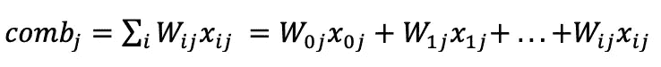

给定节点 j 的组合函数

一旦组合函数导致一组数值结果，激活函数就沿着这条路径前进。可能有一系列选择，但最常见的是 sigmoid 函数。原因是它结合了线性、曲线和常数行为，同时使用自然对数的基数(e= 2.718..).通用公式如下所示。

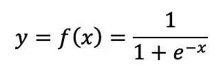

广义 sigmoid 激活函数

一旦激活函数被定义，来自组合函数的值被应用于它，以便产生来自神经网络路径的输出。这些值将代表对所考虑的目标变量的预测。

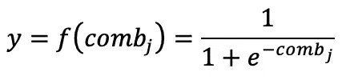

应用于组合函数结果的 Sigmoid 激活函数

神经结构由称为节点的人工神经元的分层、前馈和连接网络组成。
1。**分层**:最少有一个输入层、一个隐藏层和一个输出层
2。**前馈**:没有回路和循环的单向流动
3。**连接**:相邻层中的每个节点都与另一个节点相连
神经网络的分层特性是其优势和弱点，因为隐藏层中的节点越多，其处理复杂模式的能力就越强，但如果以泛化为代价，也可能导致过拟合。

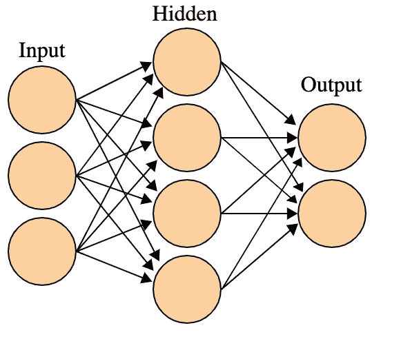

维基共享通过[维基百科](https://en.wikipedia.org/wiki/Artificial_neural_network#/media/File:Artificial_neural_network.svg)

神经网络不是静态模型，它会不断学习。对于来自训练数据集的每个观察，产生输出值，然后与一组训练观察的目标变量的实际值进行比较，并计算误差(实际输出)。为了测量输出预测与实际目标值的吻合程度，大多数神经网络模型使用误差平方和(SSE)。

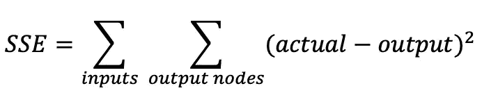

误差平方和

使用神经网络的主要好处是，由于其非线性结构，它们对于嘈杂和复杂的数据非常稳健。然而，基本的内部工作仍然难以人为解释。

# 2.用 Python 创建神经网络模型

在 **Python** 中开始构建神经网络的起点是上传相关的库，其中有`keras.models`、`keras.layers`和`keras.utils`。这些是收集和定义神经网络模型的各种组件的必要前提。

> Keras 是一个用 Python 编写的开源神经网络库。它能够运行在 TensorFlow、微软认知工具包、Theano 或 PlaidML 之上。旨在实现深度神经网络的快速实验，它专注于用户友好、模块化和可扩展。

```
import numpy as np
import pandas as pd
from numpy import loadtxt
from keras.models import Sequential
from keras.layers import Dense
from keras.layers import Dropout
from keras.layers import Activation
from keras.utils import to_categorical
from keras.regularizers import l1
from sklearn.utils import class_weight
```

其次，上传或创建相关数据帧是进行分析的基础，在神经网络的情况下，选择非线性数据集是明智的，尤其是当它们与视觉记录相关时。首先，我们可以随机生成一个数据集来模拟代码。在这个例子中，对收到多少援助的预测(Y)被探索为冲击类型和位置(X1，X2)的函数。我们可以通过组合命令`insert`和`tolist`来指定要插入的变量的属性数量和类型，从而将数值变量转换为分类变量。

```
df = pd.DataFrame(np.random.randint(0,1000,size=(1000,1)), columns= ['AidMillion'])
category = pd.cut(df.AidMillion,bins=[0,500,1000],labels=['Below_500_Mill','Above_500_Mill'])df.insert(2,'Aid_Given',category)
df.Aid_Given = df.Aid_Given.tolist()TypeShock = (['Draught','Floods','Famine'])
df["TypeShock"] = np.random.choice(TypeShock, size=len(df))Location = (['Urban','Rural'])
df["Location"] = np.random.choice(Location, size=len(df))
```

对于神经网络，有必要将所有分类变量转换成数值变量。在 **Python** 中实现这种转换的命令应该是`astype(‘category’).cat.codes.`另外，我们可以使用`train_test_split`命令预先分割数据帧。

```
df['TypeShockNum'] = df['TypeShock'].astype('category').cat.codes
df['LocationNum'] = df['Location'].astype('category').cat.codes
df['Aid_GivenNum'] = df['Aid_Given'].astype('category').cat.codesdf_train, df_test=train_test_split(df,test_size=0.33,random_state=2)
df.head()
```

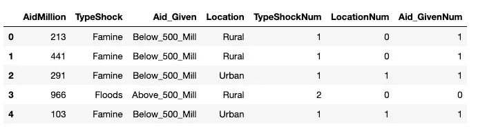

一旦相关变量被转换，下一个关键步骤是以一种可以通过神经网络算法处理的方式定义预测器和目标变量。在 **Python 中，**这可以通过设置变量的子集并确保每个变量都处于`np.array`的形式下来实现。

```
X_train = np.array(df_train[["TypeShockNum","LocationNum"]])
y_train = np.array(df_train[["Aid_GivenNum"]])X_test = np.array(df_test[["TypeShockNum","LocationNum"]])
y_test = np.array(df_test[["Aid_GivenNum"]])
```

然后，创建神经网络的最关键时刻是定义要测试的模型。在 **Python 中，**第一步是定义我们希望探索的是**顺序**还是**功能**应用程序接口(API)。前者允许您为大多数问题逐层创建模型，但不允许模型共享层或具有多个同时输入或输出。后者使您能够创建具有更大灵活性的模型，因为您可以轻松定义可能具有多个不同输入源、生成多个输出目标或重用层的模型。在这种情况下，使用更简单的顺序模型。

```
model = Sequential()
```

其次，我们通过使用**密集**类开始构建完全连接的层。这是我们希望测试的层中有多少神经元或节点的规范，**输入维度**表示为`input_dim`以及使用特定参数的**激活**函数。在模型中，我们可以表示各种层类型。最常见的是密集，但也可能是卷积、池化或循环。在密集层中，我们可以定义几个项目，例如:

> *1)表示输出空间维度的***单元的数量。没有完美的公式来定义最佳单元数，起点是模型中输入和输出及其属性的平均值。在我们的例子中，数据集有 2 个输入，总共有 5 个属性和 1 个输出。这些值通知一系列迭代以创建最佳模型。**
> 
> **2)****激活函数:*** *如果没有指定任何东西，则不应用激活(即“线性”激活:* `*a(x) = x*` *)。否则，通常将激活函数应用于节点的输出，以限制或限定其值。激活函数有助于限制值，并有助于决定节点是否应该被“触发”。它们可以是线性、sigmoid、双曲正切或校正线性单位(ReLU)函数。**
> 
> *可以包括其他元素。例如， `[***kernel_initializer***](https://keras.io/initializers/)`*描述了用于初始化权重的统计分布。* `[***kernel_regularizer***](https://keras.io/regularizers/)`*在优化期间对层参数或层活动施加惩罚，以并入网络优化的损失函数中。* `***activity_regularizer***` *作为输出的函数工作，主要用于调整隐藏单元。其他组件可以在这里找到*[](https://keras.io/layers/core/)**。***

**除了密集层，其他元素也可以添加到模型中。例如，`Dropout`函数的工作原理是基于概率从后续层的先前激活中“删除”输入变量。它具有模拟具有非常不同的网络结构的大量网络的效果，并且反过来，使网络中的节点通常对输入更鲁棒。**

```
**model.add(Dense(3, input_dim=X_train.shape[1], activation='sigmoid', activity_regularizer=l1(0.001)))model.add(Dropout(0.1))
model.add(Dense(2))
model.add(Dropout(0.1))
model.add(Dense(1))
print(model.summary())**
```

**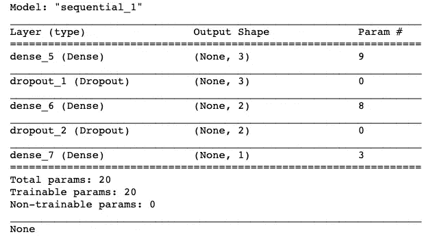**

**为了用 **Python** 从目前创建的模型中产生预测，编译是必要的。在这个关键步骤中，我们需要通过考虑目标变量的性质来定义损失函数。我们可以使用以下选项:**

> ***1)****mean _ squared _ error****是回归问题的损失函数，它计算数据集中每个示例的实际目标值和预测目标值之间的平方差，然后返回它们的平均值。
> 2)****mean _ absolute _ error****是回归问题的损失函数，计算数据集中每个示例的实际目标值和预测目标值之间的差异，然后返回它们的平均值。
> 3)****mean _ absolute _ per%
> 4)* ***二元 _ 交叉熵*** *是针对两类/二元分类问题的损失函数。通常，交叉熵损失用于计算模型的损失，其中输出是 0 到 1 之间的概率数。
> 5)* ***分类 _ 交叉熵*** *是针对多类(两类以上)分类问题的损失函数。*****

**在模型函数中，我们还必须选择一个优化器。每当神经网络完成通过网络传递一批输入时，它必须决定如何使用预测值和实际值之间的差异来调整节点上的权重，以便网络优化其解决方案。确定该步骤的算法被称为**优化算法**。最常见的是:**

> ***1)* ***随机梯度下降*** *(* `*SGD*` *)计算网络损失函数相对于网络中每个个体权重的梯度。内斯特罗夫加速梯度(NAG)也可用于加速梯度下降。
> 2)* ***自适应梯度****(*`*Adagrad*`***)****是一种更先进的机器学习技术，它以可变的学习速率进行梯度下降。通过对不频繁参数的大更新和对频繁参数的小更新，保留和加强了节点梯度的历史权重。因此，它非常适合处理稀疏数据。
> 3)* ***均方根传播*** *(* `*RMSprop*` *)是对 Adagrad 的一种修正，学习率进一步除以所有平方梯度的指数衰减平均值，得到全局调整值。
> 4)* ***自适应矩估计*** *(* `*Adam*` *)除了存储过去梯度平方的指数衰减平均值外，它还保留过去梯度的指数衰减平均值。***

**最后，我们还可以依靠一种“平衡”模式来应用于通过神经途径使用的权重。A `class_weight.compute_sample_weight`实用程序可以通过下面的公式`n_samples / (n_classes * np.bincount(y))`变换 y 的值，自动调整与输入数据中的类频率成反比的权重**

```
**model.compile(loss='binary_crossentropy', optimizer='RMSprop', metrics=['accuracy'])**
```

**一旦在 **Python、**中定义并编译了模型，我们就可以根据一组参数来拟合模型。在`fit`函数中，我们将指定:1)模型中的关键变量，2)运行模型的`epochs`的数量，这意味着在整个数据集上的迭代次数，3)`batch_sizes`，这是每次梯度更新使用的训练数据样本的数量，以及引用测试数据集中等效变量的`validation_data`。一旦定义完毕，我们就可以通过`model.evaluate`命令运行模型并评估其结果。如下所示的最终输出指示训练和测试数据集的损失函数和准确度系数。我们的目标是精度尽可能接近 1，并且损失函数产生的结果接近 0。呈现的输出表明模型仍然需要修正和更多的迭代来正确地参数化它。**

```
**history=model.fit(X_train, y_train, epochs=200, validation_data=(X_test,y_test),batch_size=50, verbose=0, sample_weight= sample_weightsloss_acc_metric_train = model.evaluate(X_train, y_train, verbose=1)
loss_acc_metric_trainloss_acc_metric_test = model.evaluate(X_test, y_test, verbose=1)
loss_acc_metric_test**
```

**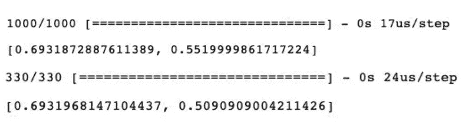**

# **3.创建神经网络模型 R**

**与前面的 Python 示例类似，在 **R** 中，我们将使用 Keras 作为创建神经网络的关键包。我们还需要安装`tensorflow`和`reticulate`来运行我们的模型。Keras 的使用允许在两种编码语言之间使用非常相似的编码风格。**

```
**library(keras)
library(tensorflow)
library(reticulate)
library(kerasR)**
```

**第一步仍然是创建或上传相关数据框架，作为进行分析的基础。在本例中，我们将随机生成一个数据集来模拟 **R** 中的代码。和前面的例子一样，收到的援助预测(Y)是冲击类型和位置(X1，X2)的函数。我们还可以通过命令`ifelse`指定属性，将数字目标变量转换成分类变量。**

```
**df <- data.frame(replicate(1,sample(0:1000, 1000, rep=TRUE)))
colnames(df) <- c("AidMillion")
df$Aid_Given <- ifelse(df$AidMillion <= 500, "Above_500_Mill", "Below_500_Mill")df$TypeShock <- sample(c('Draught','Floods','Famine'), size = nrow(df), replace = TRUE)df$Location <- sample(c('Urban','Rural'), size = nrow(df), replace = TRUE)**
```

**为了有合适的变量进行分析，我们需要将分类变量转换成数字变量。在 **R** 中，我们的预测变量和目标变量的转换需要通过`as.factor` 和`as.numeric`命令将每个分类双重转换为因子和整数。要将目标变量转换成零和一的值，我们可以依靠`ifelse`来表达相关的条件。随后，我们可以通过命令`runif`将数据帧分成测试和训练帧。**

```
**df$LocationNum<-as.numeric(factor(df$Location))
df$TypeShockNum<-as.numeric(factor(df$TypeShock))
df$Aid_GivenNum<-ifelse(df$Aid_Given=="Above_500_Mill",1,0)set.seed(8)
n<- dim(df)[1]
train_df<-runif(n)<0.60
df_train<- as.data.frame(df[train_df, ])
df_test<- as.data.frame(df[!train_df, ])head(df)**
```

**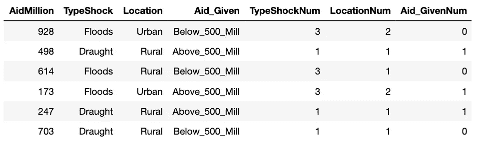**

**所有变量都是数字格式后，在 **R** 中创建合适的目标变量和预测变量也需要进一步操作，以确保目标变量成为数组，预测变量成为矩阵。与 Python 相比，这需要一个额外的步骤，因为变量的选择不能与`array`和`data.matrix`命令结合使用。这需要单独完成，而 Python 中的 numpy 允许组合转换。**

```
**X <- df_train[c("TypeShockNum","LocationNum")]
y <- df_train[c("Aid_GivenNum")]X_t <- df_test[c("TypeShockNum","LocationNum")]
y_t<- df_test[c("Aid_GivenNum")]X_train <- data.matrix(X)
Y_train <- array(y$Aid_GivenNum)
X_test <- data.matrix(X_t)
Y_test <- array(y_t$Aid_GivenNum)**
```

**一旦变量被转换，我们将**定义模型**。R 中的这一步在风格上与 Python 完全相似，只是有一些小的不同。在定义了顺序模型之后，我们将使用美元符号来添加层和 dropout 函数。在第一层中，参数的唯一区别是语义上的。例如，我们将使用`input_shape`代替 input_dim 来表示预测器的数量。其余的仍然非常相似，包括其他参数的名称。**

```
**mod <- Sequential()
model$add(Dense(units=3, activity_regularizer=regularizer_l1(0.001), input_shape = ncol(X_train), activation="sigmoid"))model$add(Dropout(rate = 0.1))
model$add(Dense(units = 2))
model$add(Dropout(rate = 0.1))
model$add(Dense(units = 1))
model**
```

**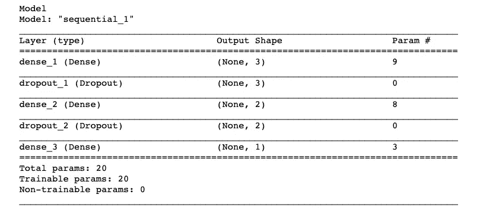**

**一旦模型被定义，模型就准备好进行**编译**。在 **R** 中，这是通过`keras_compile`命令完成的，同时保持大部分参数的定义方式与之前 Python 中损失函数和优化的示例相同。一旦定义了编译标准，就可以根据与 Python 中表达的参数相同的措辞来使模型适合训练变量。除了一些措辞上的变化，比如需要在验证数据规范之前添加`list`，以及在函数中插入我们的模型，没有重大的差异需要报告。要显示结果，在 R 中更容易，因为我们可以只调用函数的结果来查看它们，而不需要进一步的求值命令。**

**就损失函数而言，这种模拟的最终结果是可以接受的，但是精度仍然太低。**

```
**keras_compile(model,  loss = 'binary_crossentropy', optimizer = RMSprop(), metrics = c('accuracy'))history <-fit(model, X_train, Y_train, batch_size = 30, epochs = 250, verbose = 0, validation_data =  list(X_test, Y_test))history**
```

**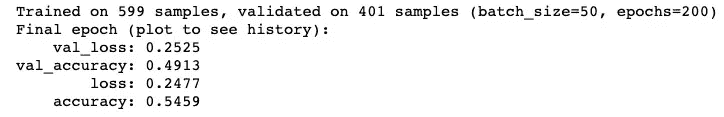**

# **4.用 R 和 Python 绘制模型和预测**

**一旦模型生成了相关的预测，我们就可以绘制结果来查看在各个迭代(时期)中损失和准确性结果的进展。在 **Python 中，**这要耗费更多的时间，因为我们需要定义绘图的各种参数来绘制模型在精度和损失方面的表现。下面的结果表明，在第 50 次迭代之后，精确度有了显著的提高，损失函数有所下降。**

```
**plt.plot(history.history['accuracy'])
plt.plot(history.history['val_accuracy'])
plt.title('model accuracy')
plt.ylabel('accuracy')
plt.xlabel('epoch')
plt.legend(['train', 'test'], loc='upper left')
plt.show()plt.plot(history.history['loss'])
plt.plot(history.history['val_loss'])
plt.title('model loss')
plt.ylabel('loss')
plt.xlabel('epoch')
plt.legend(['train', 'test'], loc='upper left')
plt.show()**
```

**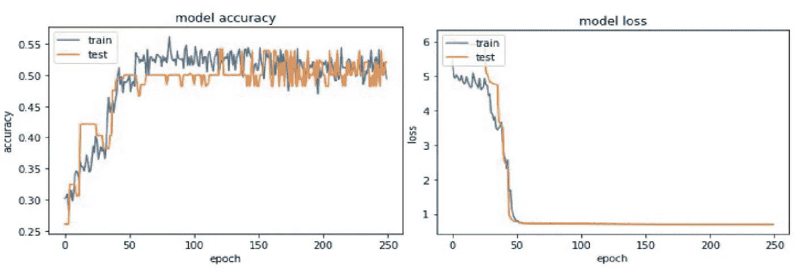**

**另一方面，在 **R.** 中绘制我们的模型的损失和准确性的进展要容易得多，只需调用`plot`函数，我们就可以访问我们的损失和准确性函数的趋势。这再次证明了 R 是一种非常注重视觉的语言，可以非常容易地生成相关的情节。我们可以再次看到我们的模型在第 50 个纪元前后有了显著的改进(也称为数据集上的迭代)。**

```
**plot(history)**
```

**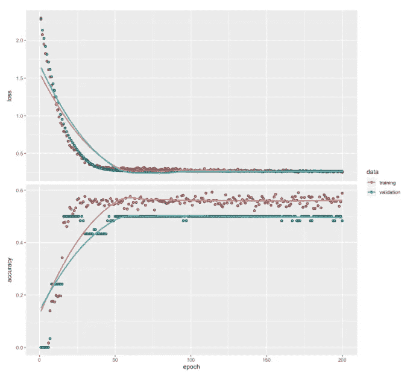**

**最后，我们可以将预测值添加到测试数据集中，以进一步验证它们的一致性。在 **Python 中，**`predict`和舍入函数的组合可以生成一系列预测值，我们可以在测试数据集中使用这些预测值进行进一步分析。**

```
**predictions = model.predict(X_test)  
predictions = [round(x[0]) for x in predictions]
X_test['predictions'] = predictions
X_test.head(7)**
```

**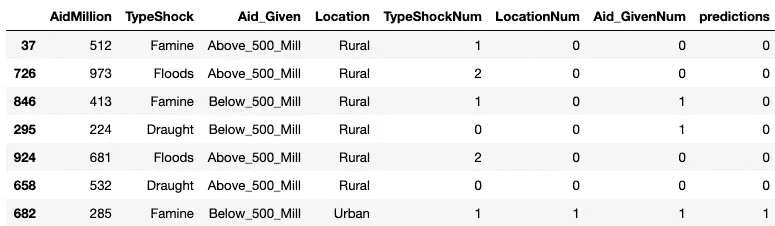**

**同样，在 **R** 中，我们可以预测应用于测试数据集的值，对它们进行舍入，并通过使用美元符号来创建一个新变量，以推进我们的比较。除了语义上的一些变化，方法仍然是命令 predict 为测试样本中的输入样本生成输出预测。**

```
**pred <- predict(model, (X_test))
df_test$pred <-round(pred, digits = 0)
head(df_test,5)**
```

**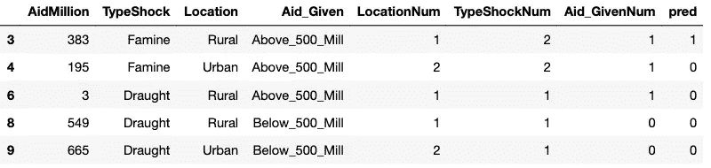**

# **5.最终反射**

**虽然这些模型的输出可以得到显著的改进，但这篇博客的目的是为了说明在 Keras 中创建神经网络时，从风格的角度来看，R 和 Python 是多么相似。事实是，神经网络可能比迄今为止所展示的要复杂得多。它可以是多层感知器、卷积网络或递归网络。它可以具有共享的要素提取图层、多个输入或多个输出。虽然这是一个不断发展的领域，但对基础概念的基本理解足以模拟神经网络。这可以为我们提供一个基础，通过测试各种参数和优化功能，不断改进和构建我们所知道的东西。**

# **除了这种方法之外，还有其他可以探索的数据建模方法。敬请关注即将推出的方法！**