# R 和 Python 在通过回归分析建模数据方面的风格差异

> 原文：<https://towardsdatascience.com/stylistic-differences-between-r-and-python-in-modelling-data-through-regression-analysis-23fbac7e8609?source=collection_archive---------48----------------------->

## 科学文体学

## 如何使用 R 和 Python 通过不同版本的回归分析对数据进行建模，回归分析代表一项估算任务，为不同类型的目标变量生成预测

数据科学方法的核心步骤是通过分类、聚类或评估任务对数据建模。最后，有大量的方法和算法可供探索。本博客用 R 和 Python 对不同类型的回归分析进行了基本介绍，这是对之前介绍的其他方法的重要补充([](/stylistic-differences-between-r-and-python-in-modelling-data-through-neural-networks-1156627ed07e)**[**决策树**](https://levelup.gitconnected.com/stylistic-differences-between-r-and-python-in-modelling-data-through-decision-trees-ea6f7c98e6e8)**[**贝叶斯定理**](/stylistic-differences-between-r-and-python-in-modelling-data-through-the-naïve-bayes-classifier-b7a30e6a1715) **)。**回归分析****

************

******由作者组合来自[源 1](https://pixabay.com/illustrations/artificial-intelligence-brain-think-4469138/) 、[源 2](https://upload.wikimedia.org/wikipedia/commons/c/c3/Python-logo-notext.svghttps://upload.wikimedia.org/wikipedia/commons/c/c3/Python-logo-notext.svg) 和[源 3](https://en.wikipedia.org/wiki/Linear_regression#/media/File:Thiel-Sen_estimator.svg) 的图像******

# ******1.回归分析导论******

> ******在统计建模中，**回归分析**是一组统计过程，用于估计因变量(通常称为“结果变量”)和一个或多个自变量(通常称为“预测值”、“协变量”或“特征”)之间的关系。([维基百科](https://en.wikipedia.org/wiki/Regression_analysis))******

****回归模型可用于**因果分析**和**交叉验证**，代表两个截然不同的范围。在没有实验的情况下，回归不能导致因果关系的陈述，但它可以用于交叉验证的目的，这提高了关系的预测准确性和模型**的 ***内部有效性*** 。因果推断需要一个包括所有相关预测因素的模型，而不是一个只有有限解释因素的观察研究。因此，一个简单的滞后变量或与结果相关的变量可以产生一个在多个样本中验证的模型，而不一定导致因果推断。******

**换句话说，回归分析可用于交叉验证，以确保预测的可重复性。另一方面，回归分析可以在更广泛的人群中建立因果联系，并与实验的 ***外部有效性*** 相关。因果推理需要一个反映实验设计的样本结构，以及由专业知识支撑的清晰的逻辑连接。**

# **2.普通最小二乘(OLS)回归模型**

**回归可以是简单的，也可以是多重的。简单回归只考虑一个预测因子，而多重回归将分析扩展到包括一个以上的因子。线性**多元回归**是一个参数模型，由以下等式定义，其中 x 代表预测变量，各种βeta*代表未知模型参数，其值使用可用证据进行估计。***

***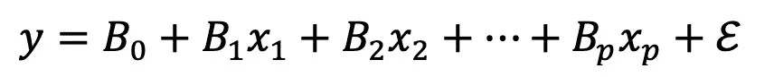***

***传统参数多元回归***

*****普通最小二乘法** ( **OLS** )符号定义了用于估计线性回归模型中未知参数的线性最小二乘法。OLS 通过最小二乘法原理选择一组预测值的线性函数的参数。OLS 最小化给定数据集中观察到的目标变量与线性函数预测的目标变量之间的差异的平方和。下面的公式显示了第 *i* 次观测 y 的**残差**测量数据点( *xi* 、*伊*)与超平面之间的垂直距离。该公式旨在评估实际数据和模型之间的拟合程度。下面的公式显示了第 *i* 次观察 y 测量的数据点(*， *yi* )与超平面之间的垂直距离的**残差**。([维基百科](https://en.wikipedia.org/wiki/Ordinary_least_squares))这个公式意在评估实际数据和模型之间的吻合程度。****

****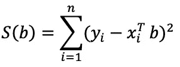****

****残差平方和****

> *****此外，OLS 的应用依赖于以下假设，这些假设对于验证该方法的使用是必要的(改编自本* [*来源*](https://statisticsbyjim.com/regression/ols-linear-regression-assumptions/) *):* 1 .**回归模型在系数和误差项中是线性的**，这意味着其函数形式遵循一组参数，而不是对曲率
> 2 建模的能力。**误差项的总体均值为零，**回归模型中的常数迫使残差均值等于零
> 3。所有的**独立变量都与误差**项不相关，因此 OLS 模型不会将任何方差归因于其误差
> 4。**误差项的观测值彼此不相关**，并且信息不会预测后续观测值的误差项
> 5。**误差项具有恒定方差**(无异方差)，因为它不会因每次观察或一系列观察而改变
> 6。没有**自变量是其他**解释变量的完美线性函数(不存在多重共线性)
> 7。**误差项呈正态分布**，如果残差遵循正态概率图上的线，则意味着它们呈正态分布****

****以下示例基于随机生成的数据集，因此可能不满足以下假设，但仍然值得考虑，以便了解回归建模中各种计算背后的代码。然而，对特定目标变量的分布和均值的行为进行分析，将告知要利用的回归类型。****

# ****3.R 和 Python 中的普通最小二乘(OLS)****

****在 **Python** 中开始构建 OLS 回归的起点是上传相关的库，其中`statsmodels.api`代表了产生回归结果的最具定义性的库。Statsmodels 允许用户探索数据、估计统计模型和执行统计测试。描述性统计、统计测试、绘图函数和结果统计的广泛列表可用于不同类型的数据和每个估计量****

```
**import pandas as pd
import numpy as np
from sklearn.model_selection import train_test_split
from sklearn import preprocessing
import statsmodels.api as sm**
```

****其次，上传或创建相关数据框架是进行分析的基础。在回归分析的情况下，最好是根据主题相关性选择变量。在本例中，对获得多少援助(Y)的预测是作为预测因素(如冲击类型、位置和持续时间)组合的函数进行研究的。****

```
**df = pd.DataFrame(np.random.randint(0,1000,size=(1000,1)), columns= ['IncomeLoss'])df["DurationMonths"] = np.random.randint(1, 12, df.shape[0])TypeShock = (['Draught','Floods','Famine'])
df["TypeShock"] = np.random.choice(TypeShock, size=len(df))Location = (['Urban','Rural'])
df["Location"] = np.random.choice(Location, size=len(df))df["AidMillion"] = np.random.randint(0, 1000, df.shape[0])
category = pd.cut(df.AidMillion,bins=[0,500,1000],labels=['Below_500_Mill','Above_500_Mill'])
df.insert(2,'Aid_Given',category)**
```

****为了建立 OLS 模型，有必要通过对标签进行编码将所有分类变量转换成数值变量。在 **Python** 中实现这种转换的命令应该是`le.fit_transform`。此外，我们可以使用`train_test_split`命令将数据帧分割成一列并测试一列，以简化估算的验证过程。****

```
**le = preprocessing.LabelEncoder()
y1=df['Location']
df['LocationNum']= le.fit_transform(y1.astype(str))y2=df['TypeShock']
df['TypeShockNum']= le.fit_transform(y2.astype(str))df_train, df_test=train_test_split(df, test_size=0.33, random_state=2)df.head()**
```

****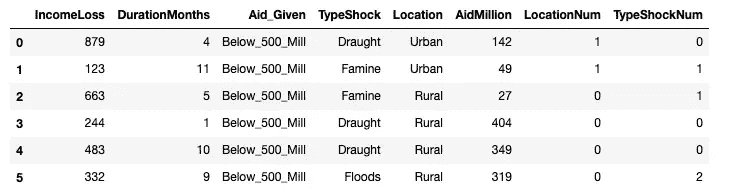****

****上传或生成数据帧后，我们需要定义预测变量和目标变量。在 **Python 中，**这可以简单地通过在两个方括号中指定预测变量和目标变量来完成。一旦明确定义了变量，我们将需要通过`sm.add_constant`向回归中添加一个常量值。然后，可以通过运行`sm.OLS`命令轻松检索回归结果。输出非常详细，并提供了一系列统计值，可以对这些值进行进一步的解释。在这种情况下，模型是从随机生成的值中创建的，因此它的解释能力非常有限。****

```
**X=pd.DataFrame(df[['DurationMonths','IncomeLoss','LocationNum','TypeShockNum']])
y=np.asarray(pd.DataFrame(df[['AidMillion']]))
X=sm.add_constant(X)model01_test= sm.OLS(y, X).fit()
model01_test.summary()**
```

****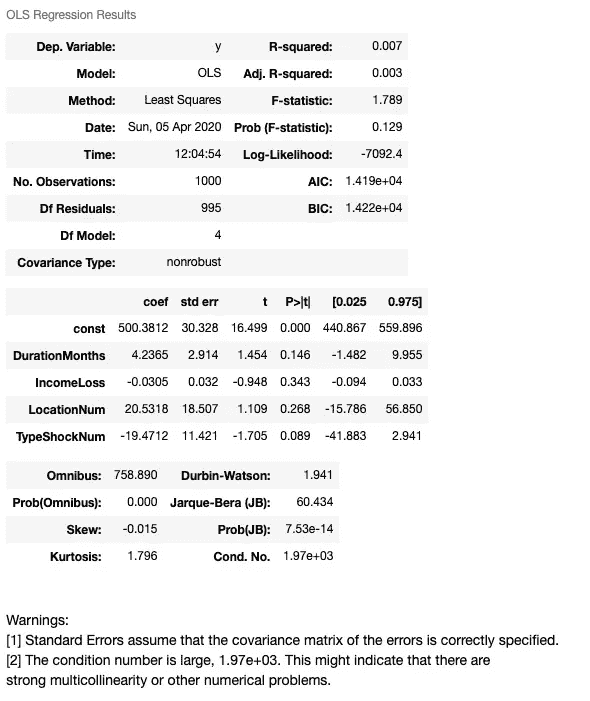****

****为了验证整个数据集的分析，我们可以在测试数据集上运行相同的回归。在 **Python 中，**我们将使用类似的代码，唯一的区别是从`df_test`中提取变量。结果似乎是相似的。没有一个变量有显著的系数，强调这个输出只是为了举例说明要使用的代码。****

```
**X=pd.DataFrame(df_test[['DurationMonths','IncomeLoss','LocationNum', 'TypeShockNum']])
y=np.asarray(pd.DataFrame(df_test[['AidMillion']]))
X=sm.add_constant(X)model01_test= sm.OLS(y, X).fit()
model01_test.summary()**
```

****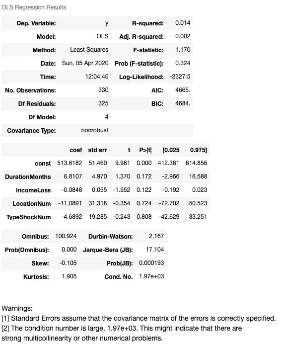****

****与前面的例子不同，我们不需要上传很多包来产生 OLS 输出。因此，在 **R** 中的第一步是创建或上传相关数据帧，作为进行分析的基础。与前一个例子一样，对接受援助(Y)的预测将作为一系列预测因素的函数来探讨。我们还可以通过命令`as`指定属性，将数字目标变量转换成分类变量。****

```
**df <- data.frame(replicate(1,sample(0:1000, 1000, rep=TRUE)))
colnames(df) <- c("IncomeLoss")df$DurationMonths <- sample(0:12, dim(df), rep=TRUE)df$Type <- sample(c('Draught','Floods','Famine'), size = nrow(df), replace = TRUE)df$Location <- sample(c('Urban','Rural'), size = nrow(df), replace = TRUE)df$AidMillion <- sample(0:1000, dim(df), rep=TRUE)
df$Aid_Given <- ifelse(df$AidMillion <= 500, "Above_500_Mill", "Below_500_Mill")**
```

****为了将目标变量转换成零和一的值，我们可以依靠从`as.numeric`到`as.factor`的双重转换，以便以可行的形式表达变量来运行回归。随后，我们可以通过命令`runif`将数据帧分为测试帧和训练帧。****

```
**df$AidMillion<- as.numeric(as.factor(df$AidMillion))
df$DurationMonths<- as.numeric(as.factor(df$DurationMonths))
df$LocationNum<- as.numeric(as.factor(df$Location))
df$TypeShockNum<- as.numeric(as.factor(df$Type))
df$IncomeLoss<- as.numeric(as.factor(df$IncomeLoss))set.seed(8)
n<- dim(df)[1]
train_df<-runif(n)<0.75
df_train<- df[train_df, ]
df_test<- df[!train_df, ]head(df)**
```

****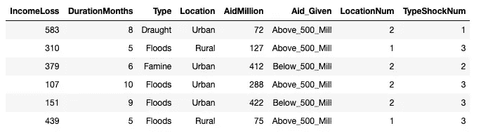****

****一旦数据框架准备就绪，相关变量被编码成数值因子，公式就不需要将变量的规格具体化。在 **R** 中，lm 命令提示直接在公式中定义所有相关变量和数据帧的选项。另一方面，输出不太详细，没有像 Python 中那样指定其他统计参数的范围。同样，该模型不会产生任何显著的系数，因为它是随机生成的。****

```
**model01<- lm(formula = AidMillion ~ DurationMonths+ IncomeLoss+ TypeShockNum+ LocationNum, data= df)
summary(model01)**
```

****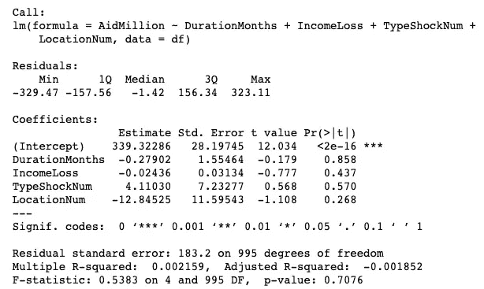****

****为了验证分析，我们可以在测试数据集上运行相同的回归。类似于 Python，同样在 **R** 中，我们将使用类似的代码，唯一的区别是从函数内部的`df_test`提取变量。模型的结果似乎是相似的。没有一个变量有显著的系数，R 平方只是稍微高一点。****

```
**model01_test<- lm(formula = AidMillion ~ DurationMonths+IncomeLoss+TypeShockNum+LocationNum, data= df_test)
summary(model01_test)**
```

****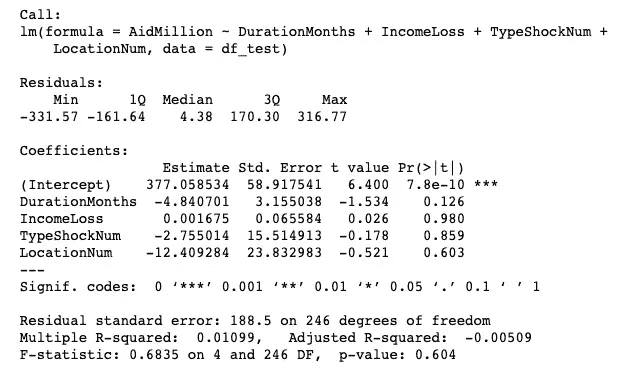****

# ****4.R 和 Python 中的模型评估估计****

****可以通过查看各种维度来评估回归模型，如平均绝对误差、给定一组参数的目标变量预测以及模型比例参数的平方根。所有这些推导可以指示预测元素的位置或其行为。****

****为了生成目标变量的预测(估计)，Python**中的一个简单的`predict`命令**可以生成一系列估计值。****

```
**y_pred=model01.predict(X)
y_pred**
```

****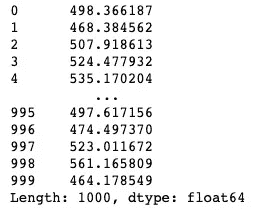****

****预测器生成后，在 **Python** 中我们可以通过`sklearn.metrics`中的`mean_absolute_error`命令计算平均绝对误差。**平均绝对误差**取 y 的实际值和预测值之间的距离，并求出这些距离的平均值。这是一个重要的指标，表明如果 MAE 较小，则模型在预测方面表现出色，而 MAE 较大则表明您的模型在某些方面可能有问题。MAE 近似为 0 意味着您的模型是输出预测器的**完美拟合**。在这种情况下，MAE 非常高，这意味着模型不够充分。****

****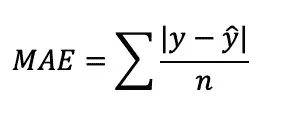****

****绝对平均误差****

```
**ytrue= df[['AidMillion']]
sklearn.metrics.mean_absolute_error(y_true=ytrue, y_pred=y_pred)**
```

****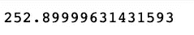****

****平均绝对误差****

****为了在 **Python** 中验证根据一组特定参数对目标变量的估计，`np.column_stack`产生一个数组，该数组一旦插入预测`command`中，就会根据为每个参数提供的位置产生目标值。在这种情况下，参数将表示为:常量值(1)、持续时间(从 0 到 12)、收入损失量(从 0 到 1000)、位置(0，1)和冲击类型(0，1，2)。****

```
**est01=np.column_stack((1,1,500,1,1))
est02=np.column_stack((1,2,500,0,2))
model01.predict(est01), model01.predict(est02)**
```

****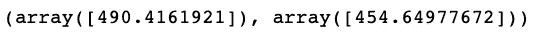****

****按参数位置的预测值****

****最后， **Python** 还允许我们通过应用于回归模型的`np.sqrt`命令轻松计算数组的正**平方根**，从而计算出标准误差。估计量的均方误差衡量误差平方的平均值，即估计值和实际值之间的平均平方差。这是另一个重要的适合度指标，可用于分析回归中的误差是否准确，尤其是当误差接近零时。****

****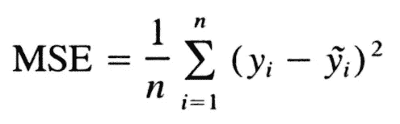****

****均方误差****

```
**np.sqrt(model01.scale)**
```

****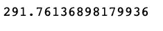****

****标准误差输出****

****在 **R** 中，目标变量的预测生成可通过`predict`命令激活。这与 Python 非常相似，正如在其他情况下观察到的那样，这里的风格差异是将各种参数的规范放在括号内。****

```
**X<- data.frame(DurationMonths= df$DurationMonths, IncomeLoss= df$IncomeLoss, TypeShockNum=df$TypeShockNum, LocationNum =df$LocationNum)ypred<- predict(object=model01, newdata=X)
head(ypred)**
```

****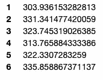****

****预测响应示例****

****在 **R** 中，MAE 的计算包含在应用于预测和真实目标值的同名命令`MAE`中。这与 Python 中的`sklearn.metric`非常相似。为了进行模型估计，可以在训练和测试数据集之间比较该值，以确认其有效性。代码下面的输出只代表整个数据集的输出。****

```
**ytrue<- df$AidMillion
MAE(y_pred=ypred, y_true=ytrue)**
```

****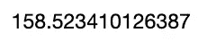****

****MAE 输出****

****为了计算标准误差，在 **R** 中的`lm`输出已经有了这个细节。事实上，从下面可以看出，剩余标准误差是模型本身生成的可视化输出的一部分。这是 R 中的一个特殊特性，在 Python 中无法以同样的方式找到。****

****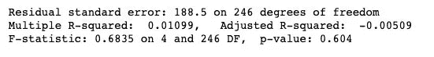****

****此外， **R** 还可以选择运行**逐步回归**，而 Python 没有这个预编码命令**。**这是一种拟合**回归**模型的方法，其中预测变量的选择由自动程序执行。在每一步中，基于一些预先指定的标准，考虑将一个变量添加到解释变量集或从解释变量集中减去。输出显示了 **Akaike 信息标准** (AIC)，它是样本外预测误差的估计值，因此是给定数据集的统计模型的相对质量。给定数据的模型集合，AIC 估计每个模型相对于其他每个模型的质量。因此，AIC 为模型选择提供了一种手段。****

```
**library(MASS)
model01_step<- stepAIC(object=model01)**
```

****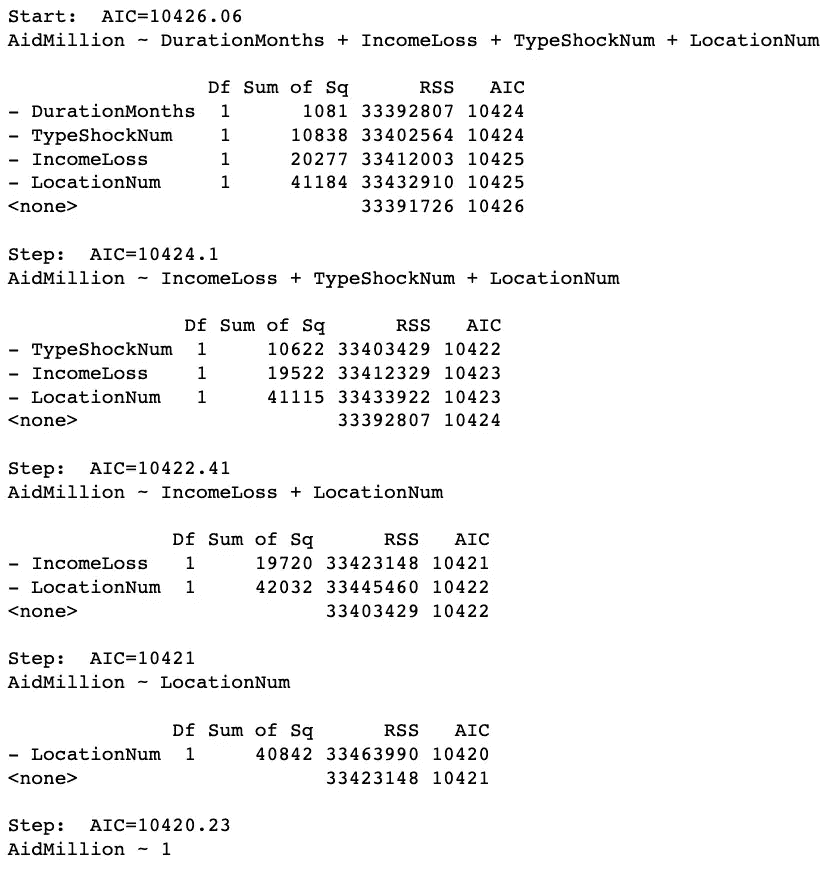****

# ****5.R 和 Python 中的广义线性模型(GLM)****

****除了线性回归模型之外，还有另一套回归模型考虑了**不同类型的目标变量**。OLS 模型通常适用于连续变量，而 GLM 模型适用于预测值为二进制或数字离散响应的情况。当目标变量对于每组预测变量值都具有正态分布时，我们可以使用线性回归模型。****

****另一方面，如果我们试图预测一个二进制响应变量(像是或否的情况)，线性预测器的二进制响应集的链接函数将是一个对数函数，如下式所示。****

****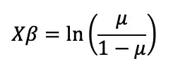****

****线性预测函数****

****然后，为了分离平均值，我们可以使用一个指数函数，该函数以某种方式归一化，从而产生一个总是在 0 和 1 之间的值。换句话说，回归模型的值应该被用作目标变量为 1 的概率。****

****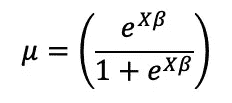****

****隔离平均值****

****反向工作，我们就能够通过将目标变量等同于指数函数的完整符号的扩展来制定参数形式的模型。因此，该公式代表适用于二进制目标值的**逻辑回归**。****

****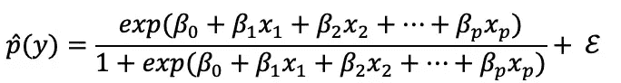****

****逻辑回归模型****

****作为 **Python 中逻辑回归的一个例子，**我们可以指定一个二元变量，如位置(1 =城市，0=农村)和一组数值预测值。然后，`sm.Logit`命令激活一个输出的生成，在这种情况下，虽然从解释的角度来看，它不会导致一个强大的模型，但它仍然可以作为一个参考的例子。****

```
**X=pd.DataFrame(df[['DurationMonths','IncomeLoss', 'TypeShockNum']])
y=np.asarray(pd.DataFrame(df[['LocationNum']]))
X=sm.add_constant(X)logistic01= sm.Logit(y, X).fit()logistic01.summary()**
```

****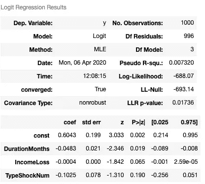****

****在 **R 中，**与之前的公式相似，目标变量是二进制变量。在这种情况下，我们将在括号前指定`glm`和`family`类型。这一规范似乎非常重要，因为它还提供了根据目标变量的性质调整到其他类型的回归模型的机会，而无需以显著的方式改变公式。重要的是，没有提到伪 R 调整值或对数似然性。相反，与 Python 不同，输出强调了 AIC 和偏差分布。****

```
**df$LocationNum<-ifelse(df$Location=="Urban",1,0)logistic01<- glm(formula = LocationNum ~ DurationMonths+IncomeLoss, data= df, family=binomial)summary(logistic01)**
```

****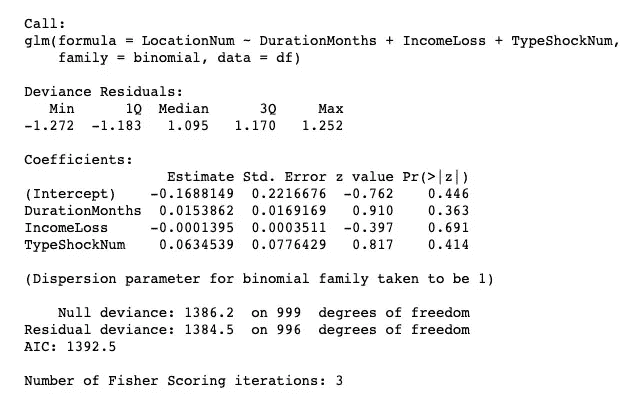****

****另一种类型的目标变量可以是事件的计数，例如，某件事情发生了多少个月或多少次。因此，该变量的分布将是最小值为零的出现次数。这类目标变量的回归模型是**泊松**。下面是推导回归方程的各种数学步骤。最初，我们会将线性预测值等同于对数函数，以使分布正常化。然后，在分离出平均值后，我们可以通过使用指数表达式为**泊松回归**导出一个完整的参数函数。****

****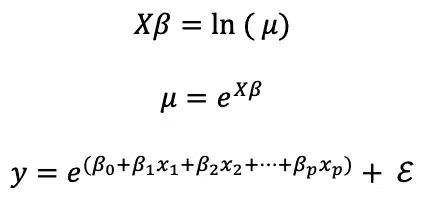****

****链接函数、均值和泊松回归方程****

****在 **Python** 中，我们可以通过将目标变量指定为以月为单位的持续时间来轻松运行泊松回归。那么回归的规范似乎与逻辑类型完全不同。我们需要导入`stattools`，然后将`sm.GL`放在括号前，最后将家族`sm.families.Poisson()`声明为回归参数的一部分。下面的结果显示了很强的显著性，但不应过多解释这些值，因为它是随机生成的数据集。****

```
**import statsmodels.tools.tools as stattoolsX=pd.DataFrame(df[['AidMillion','IncomeLoss', 'TypeShockNum']])
y=np.asarray(pd.DataFrame(df[['DurationMonths']]))poisreg01=sm.GLM(y,X, family=sm.families.Poisson()).fit()poisreg01.summary()**
```

****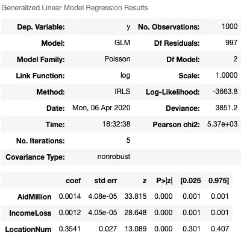****

****在 **R，**泊松回归是一个简单的变量变化和一个新的家庭类型的说明，即`poisson`。在逻辑回归建模中，似乎没有必要对前面的例子做进一步的改变。与 Python 在`stattools`中的输出不同，它会引出更多关于异常及其行为的信息。输出没有显示与任何预测值的显著关系，如前所述，这是一个随机生成的数据集，仅用于说明目的。****

```
**poisson01 <- glm(formula =  DurationMonths~ AidMillion+ IncomeLoss+ LocationNum, data= df_test, family=poisson)summary(poisson01)**
```

****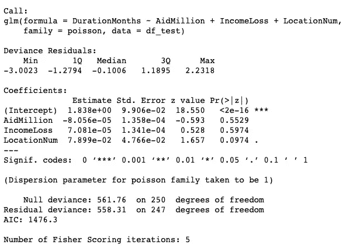****

# ****6.最终想法****

****各种回归说明了根据目标变量的不同性质可以选择的不同类型的模型。要开发一个有效的模型，还需要考虑许多其他因素，例如，目标变量如何在各种预测器之间分布，以及误差在不同场景和多次迭代中的表现如何。此外，选择与主题相关的变量并由之前研究的专业技术支持也很重要。到目前为止所展示的应该只是一个基础，让我们继续尝试不同的回归模型，并从手头的数据中学习！****

# ****除了基本的回归概念，还有其他方法通过关联或其他考虑因素来对数据建模，例如维度！建模数据可以采用其他形式和形状。****