# R 和 Python 在通过朴素贝叶斯分类器建模数据方面的风格差异

> 原文：<https://towardsdatascience.com/stylistic-differences-between-r-and-python-in-modelling-data-through-the-na%C3%AFve-bayes-classifier-b7a30e6a1715?source=collection_archive---------41----------------------->

## [数据](https://towardsdatascience.com/tagged/data-science-stylistics)科学文体学

## 如何使用 R 和 Python，根据与事件相关的条件的先验知识，预测事件的概率


通过作者组合来自[源 1](https://analyticsprofile.com/wp-content/uploads/2019/06/naive-bayes-algorithm-1140x660.jpg) 、[源 2](https://upload.wikimedia.org/wikipedia/commons/c/c3/Python-logo-notext.svghttps://upload.wikimedia.org/wikipedia/commons/c/c3/Python-logo-notext.svg) 和[源 3](https://commons.wikimedia.org/wiki/File:R_logo.svg) 的图像

由于数据科学方法的最具决定性的方面是对数据进行建模，以产生估计和强大的预测，因此有大量的方法和算法可以探索这一目标。这篇博客提出了另一种建模数据的方法，超越了之前关于 [**决策树**](https://levelup.gitconnected.com/stylistic-differences-between-r-and-python-in-modelling-data-through-decision-trees-ea6f7c98e6e8)**的博客中所解释的方法，即朴素贝叶斯分类方法。**

**这种分类方法是**贝叶斯定理**的衍生，贝叶斯定理描述了基于可能与事件相关的条件的先验知识的事件概率。这个定理的构想者是英国统计学家、哲学家和长老会牧师托马斯·贝叶斯(1701-1761)。这个定理成为他最著名的成就。贝叶斯定理的一个应用也是基于对概率的解释，即认知置信度的大小(信念、假设等的强度)。)而不是一个频率。这允许将概率应用于各种领域，而不仅仅是引用类附带的领域。**

****

**托马斯·贝叶斯 `Wikimedia Commons via [Wikipedia](https://en.wikipedia.org/wiki/Thomas_Bayes#/media/File:Thomas_Bayes.gif)`**

# ****1。贝叶斯定理****

**在数据科学中，通过将我们以前的知识(称为先验分布)与从观察数据中获得的新信息相结合，贝叶斯定理被应用于更新我们关于特定数据参数的知识。这导致更新的参数知识，也称为后验分布。**

**解释该定理的主要公式考虑了两个事件。在数据科学中，这两个事件可以是变量类型(预测值和目标值)。我们可以考虑由两个预测值(X*=X1，X2)组成的数据集，响应变量 Y 可以由多个类别(y1，y2，y3…)组成。通过贝叶斯定理，我们可以确定对于预测变量的特定组合，哪个类最有可能。**

**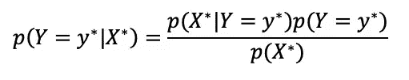**

**由分析前类值 y*的可能性给出的**先验概率**和当响应对应于特定类时数据如何表现的表示的组合产生了**后验概率**。等式左侧的分母描述了数据在不参考目标变量的类值的情况下如何表现，也称为数据的**边际概率**。在没有关于参数的先验知识的情况下，我们可以使用一个**无信息先验**，它表示所有类值都是同等可能的。在后一种情况下，后验概率仅基于数据。**

**在 Y 的 3 个不同的可能类值的情况下，对于常数 X 值，我们可以计算 Y 的三个可能值中的每一个的贝叶斯概率，如下式所示。最大后验假设告诉我们将所选预测值 X 的记录分类为具有最高后验概率的目标变量 Y 的值。**

**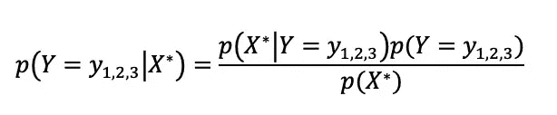**

**重要的是，即使我们有一个以上的预测变量，类条件独立性假设将各种事件或变量描述为独立的。因此，我们预测因子的选择应该考虑这一假设，确保 X1 和 X2 之间没有关系。**

# **2.Python 中的朴素贝叶斯定理**

**在 **Python** 中应用贝叶斯定理的起点是上传相关的库，其中有一个名为`MultinomialNB`的多项式朴素贝叶斯分类器，它适用于具有离散特征的分类(例如文本分类的字数)。**

```
import pandas as pd
import numpy as np
from sklearn.naive_bayes import MultinomialNB
import statsmodels.tools.tools as stattools
```

**其次，上传或创建相关数据框架是进行分析的基础。在这种情况下，为了模拟定理，我们可以随机生成一个数据集。在数据集中，预测因子和目标变量的选择可以源于特定的分析需要。在这个例子中，对收到多少援助的预测(Y)被探索为冲击类型和位置(X1，X2)的函数。**

```
df = pd.DataFrame(np.random.randint(0,1000,size=(1000,1)), columns= ['AidMillion'])category = pd.cut(df.AidMillion,bins=[0,500,1000],labels=['Below_500_Mill','Above_500_Mill'])
df.insert(2,'Aid_Given',category)
df.Aid_Given = df.Aid_Given.tolist()df["TypeShock"] = np.random.choice(TypeShock, p=[0.40, 0.30, 0.30], size=len(df))Location = (['Urban','Rural'])
df["Location"] = np.random.choice(Location, size=len(df))df.head()
```

**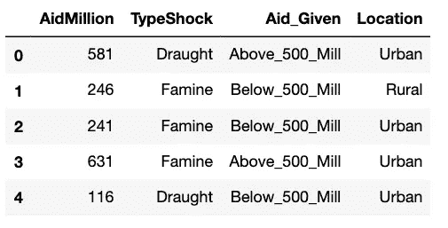**

**为了在 **Python** 中进行分析，我们需要考虑一个测试和一个训练数据帧。可以分割主数据框架，或者选择具有相同变量的另一个信息源。在这种情况下，可以使用`train_test_split`命令分割主数据帧。此外，如果打算手动执行贝叶斯计算，我们可以通过`pd.crosstab`导出预测值的边际概率和条件概率。**

```
df_train, df_test=train_test_split(df, test_size=0.40, random_state=8)t1=pd.crosstab(df_train['Aid_Given'], df_train['TypeShock'])
t1['Total']=t1.sum(axis=1)
t1.loc['Total']=t1.sum()
t1t2=pd.crosstab(df_train['Aid_Given'], df_train['Location'])
t2['Total']=t2.sum(axis=1)
t2.loc['Total']=t2.sum()
t2
```

**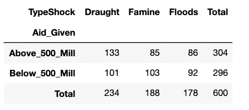****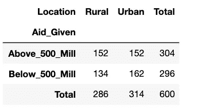**

**为了在 **Python** 中应用贝叶斯算法，我们需要将每个预测器转换成哑元。这可以通过对解释目标变量所需的每个变量(冲击类型、位置)使用`stattools.categorical` 命令来完成，并通过命令 `pd.concat`将它们连接成一个数据帧。**

```
x_loc_ind= np.array(df_train['Location'])
(x_loc_ind, x_loc_dict)= stattools.categorical(x_loc_ind, drop= True, dictnames=True)
x_loc_ind= pd.DataFrame(x_loc_ind)x_shock_ind= np.array(df_train['TypeShock'])
(x_shock_ind, x_shock_dict)= stattools.categorical(x_shock_ind, drop=True, dictnames= True)
x_shock_ind=pd.DataFrame(x_shock_ind)X=pd.concat((x_loc_ind, x_shock_ind), axis=1)X.head()
```

**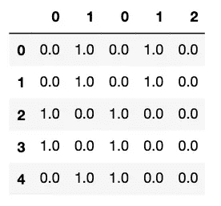**

**将预测变量转换成虚拟矩阵后，为了清晰起见，定义 Y 变量是有用的。在预测器和目标变量被很好地定义后，就可以将代表**朴素贝叶斯**算法的`MultinomialNB`命令应用于训练数据集。**

```
Y= df_train['Aid_Given']
Bayes_01=MultinomialNB().fit(X,Y)
```

**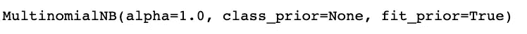**

**决定性的一步是在测试数据集上测试**朴素贝叶斯估计器**。为了做到这一点，我们需要像以前一样将测试数据中的 X 变量设置为虚拟变量。一旦为测试数据集设置了预测变量，就可以使用命令`predict`生成预测，该命令为测试数据集中的每条记录生成一个预测值数组。**

```
x_loc_ind_test= np.array(df_test['Location'])
(x_loc_ind_test, x_loc_dict_test)= stattools.categorical(x_loc_ind_test, drop=True, dictnames= True)
x_loc_ind_test= pd.DataFrame(x_loc_ind_test)x_shock_ind_test= np.array(df_test['TypeShock'])
(x_shock_ind_test, x_shock_dict_test)= stattools.categorical(x_shock_ind_test, drop= True, dictnames= True)
x_shock_ind_test=pd.DataFrame(x_shock_ind_test)X_test= pd.concat((x_loc_ind_test, x_shock_ind_test), axis=1)Y_predicted= Bayes_01.predict(X_test)
```

**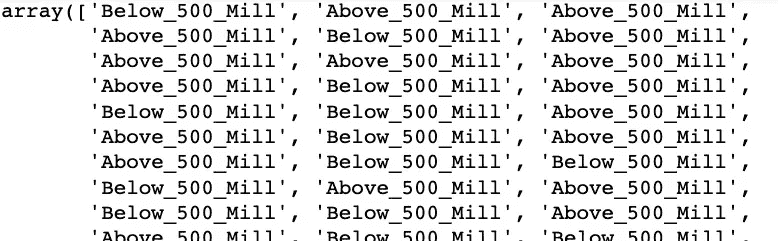**

**在对 Bayes 对象(在本例中命名为 Bayes_01)使用了`predict`命令之后，我们最终可以创建一个实际和预测目标类(高于和低于 5 亿)的列联表，这可以帮助我们理解我们的模型的准确性。**

```
ypred = pd.crosstab(df_test['Aid_Given'], Y_predicted, rownames=['Actual'], colnames=['Predicted'])ypred['Total'] = ypred.sum(axis=1); ypred.loc['Total']=ypred.sum(); ypred
```

**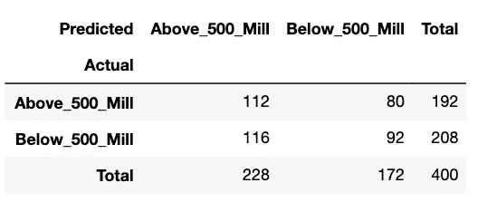**

**为了测试 **Python** 的准确性水平，我们可以简单地对测试数据集中记录总数中实际条目与预测条目相对应的频率进行求和。总的来说，该模型只有 51%的准确率，这意味着只有 1/2 的预测是正确的。该模型在预测 500 Mill 以上级别时比基线模型表现更好(58.3%对 48%)，而在预测 500 Mill 以下级别时比基线模型表现差(44.3%对 48%)。**

```
PerformanceGlobal=(112+92)/400
PerformanceAbove500=(112/192)
PerformanceBelow500=(92/208)
PerformanceGlobal, PerformanceAbove500, PerformanceBelow500
```

**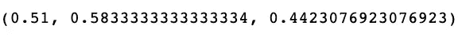**

# **3.R 中的朴素贝叶斯定理**

**就像我们在前面的例子中所做的一样，在 **R** 中应用贝叶斯定理的第一步也需要上传或生成包含预测值和目标变量的数据集。在这种情况下，建议使用相同的数据集结构，预测值仍然是冲击类型和位置，而目标变量是给定 aid 的分解。**

```
df <- data.frame(replicate(1,sample(0:1000, 1000, rep=TRUE)))
colnames(df) <- c("AidMillion")df$Aid_Given <- ifelse(df$AidMillion <= 500, "Above_500_Mill", "Below_500_Mill")df$TypeShock <- sample(c('Draught','Floods','Famine'), size = nrow(df), replace = TRUE)df$Location <- sample(c('Urban','Rural'), size = nrow(df), replace = TRUE)df$Aid_Given <- as.factor(df$Aid_Given)
head(df)
```

**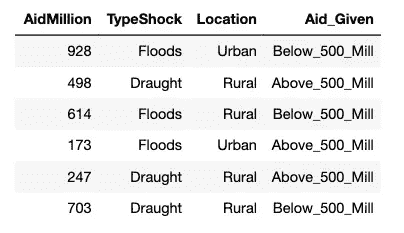**

**一旦选择了数据帧，我们要么将它分成两部分，要么上传一个具有相同变量的相似数据集。为了将从训练数据集生成的预测值应用于测试数据集，有必要使用两个数据框架。如果我们决定使用相同的数据帧，那么`runif`命令可以帮助我们做到这一点。**

```
set.seed(8)
n<- dim(df)[1]
train_df<-runif(n)<0.60
df_train<- df[train_df, ]
df_test<- df[!train_df, ]
```

**一旦数据帧准备好进行分析，我们就可以创建两个表来手工计算概率(如果我们愿意的话)。**列联表**也有助于理解预测值的分类属性在各类目标变量中的**分布**。请注意与 Python 的区别，在 **R** 中，我们必须为每个表指定列名和行名，而没有轴的指定。**

```
t1<- table(df_train$Aid_Given, df_train$TypeShock) 
colnames(t1)<- c("Draught","Floods","Famine")
rownames(t1)<- c("Above_500_Mill","Below_500_Mill")
addmargins(A=t1, FUN=list(Total=sum), quiet=TRUE)t2<- table(df_train$Aid_Given, df_train$Location) 
colnames(t2)<- c("Urban","Rural")
rownames(t2)<- c("Above_500_Mill","Below_500_Mill")
addmargins(A=t2, FUN=list(Total=sum), quiet=TRUE)
```

**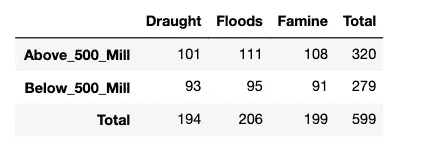****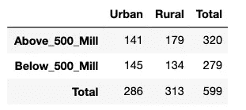**

**一旦我们创建了列联表，下一步就是通过库`e1071`应用贝叶斯算法。命令`naiveBayes`比 Python 中的对等命令产生了更多关于**先验**和**条件** **概率**的信息。之间的另一个风格差异是在 Bayes 命令中明确指定了解释预测值和目标变量之间关系的公式。**

```
library(e1071)
Bayes01 <- naiveBayes(formula= Aid_Given~ TypeShock+ Location, data=df_train)Bayes01
```

**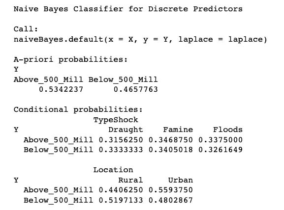**

****R** 中的最后一步是通过命令`predict`将 object Bayes01 中生成的目标变量的预测类应用于测试数据集，生成**最终列联表**。和前面的表格一样，我们需要定义`rownames`、`colnames`和边距来创建一个可读的表格。这是与 Python 风格的一个关键区别。**

```
ypred <- predict(object=Bayes01, newdata=df_test)
test.preds <- table (df_test$Aid_Given, ypred)rownames(test.preds)<- c("Actual:Above_500_Mill","Actual:Below_500_Mill")
colnames(test.preds)<- c("Predicted:Above_500_Mill","Predicted:Below_500_Mill")
addmargins(A=test.preds, FUN=list(Total=sum), quiet=TRUE)
```

**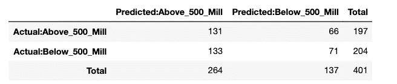**

**一旦生成列联表，我们就可以评估模型的性能与先验计算中规定的基线值。总体而言，该模型的准确率为 50.4%，这意味着只有 1/2 的预测是正确的，就像我们前面的例子一样。与基线模型相比，该模型在预测 500 Mill 以下级别方面表现更好(51.8%对 46.5%)，而在预测 500 Mill 以上级别方面，该模型表现稍差(49.62%对 53.4%)。**

```
PerformanceGlobal=(131+71)/401
PerformanceAbove500=131/264
PerformanceBelow500=71/137
PerformanceGlobal; PerformanceAbove500; PerformanceBelow500
```

**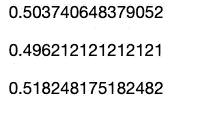**

**由于数据集是随机生成的，这些结果的唯一目的是说明性的。遵循之前博客中强调的所有步骤，以确保相关的专业知识与精心准备的数据框架相结合，从而产生有意义的分析，这仍然是非常关键的。**

# **在这另一种建模方法之后，下一篇博客将继续解释建模数据的其他方法。敬请关注即将推出的方法！**