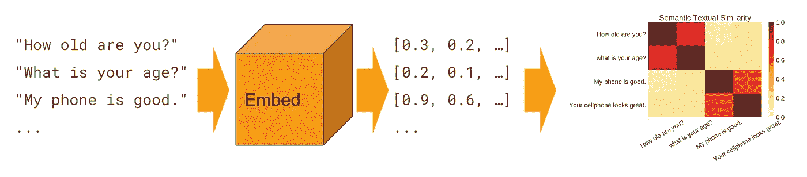

# 卡格尔·新冠肺炎公开研究数据集挑战赛(CORD-19)提交的解决方案

> 原文：<https://towardsdatascience.com/submitted-solution-for-kaggle-covid-19-open-research-dataset-challenge-cord-19-138eced43985?source=collection_archive---------49----------------------->

这篇文章描述了为 Kaggle CORD-19 竞赛提交的解决方案。

[*迈向数据科学*](http://towardsdatascience.com/) *是一份以研究数据科学和机器学习为主的媒体刊物。我们不是健康专家，这篇文章的观点不应被解释为专业建议。*

# CORD-19 竞赛说明

2020 年 3 月 17 日，随着全球新冠肺炎封锁的开始，Kaggle 宣布与艾伦人工智能研究所合作举办[新冠肺炎开放研究数据集挑战赛(CORD-19)](https://www.kaggle.com/allen-institute-for-ai/CORD-19-research-challenge) 比赛，并与 Chan Zuckerberg Initiative、乔治敦大学安全和新兴技术中心、微软研究院、IBM 和国家医学图书馆-国家卫生研究院合作，并与白宫科技政策办公室协调。

## CORD-19 数据集

CORD-19 数据集是一个开放的资源，包含超过 167，000 篇关于新冠肺炎、新型冠状病毒和相关冠状病毒的学术文章(随着时间的推移逐渐增加)，由上述六位合作者创建。这些文章代表了迄今为止可用于数据挖掘的最广泛的机器可读冠状病毒文献集合。由于冠状病毒文献的快速增加，对这些方法的需求越来越迫切，使得医学界难以跟上。数据集也可以在[语义学者](https://pages.semanticscholar.org/coronavirus-research)上找到。

竞赛的目的是为世界人工智能专家和 NLP 社区提供一个机会，开发文本和数据挖掘工具，帮助医疗界找到高优先级科学问题的答案，并将这些内容的见解联系起来，以支持全球范围内正在进行的新冠肺炎响应工作。

比赛分两轮进行，最初的关键问题列表选自 NASEM 的 SCIED(国家科学院、工程和医学委员会关于新出现的传染病和 21 世纪健康威胁的常务委员会)[研究主题](https://www.nationalacademies.org/event/03-11-2020/standing-committee-on-emerging-infectious-diseases-and-21st-century-health-threats-virtual-meeting-1)和世界卫生组织为新冠肺炎制定的[研发蓝图](https://www.who.int/blueprint/priority-diseases/key-action/Global_Research_Forum_FINAL_VERSION_for_web_14_feb_2020.pdf?ua=1)。

第一轮截止日期为 2020 年 4 月 16 日，包括以下主题的 9 项任务:

1.  关于传播、潜伏期和环境稳定性，我们知道些什么？
2.  我们对新冠肺炎风险因素了解多少？
3.  我们对疫苗和疗法了解多少？
4.  我们对病毒遗传学、起源和进化了解多少？
5.  关于医疗保健已经发表了什么？
6.  关于伦理和社会科学的考虑已经发表了什么
7.  我们对非药物干预了解多少？
8.  我们对诊断和监控了解多少？
9.  关于信息共享和跨部门协作，已经发表了哪些内容？

第二轮截止日期为 2020 年 6 月 16 日，包括以下主题的 8 项任务:

1.  创建处理与新冠肺炎相关的因素的汇总表
2.  创建治疗、干预和临床研究的汇总表
3.  创建汇总表，说明与新冠肺炎相关的风险因素
4.  创建用于新冠肺炎诊断的汇总表(提交的解决方案)
5.  创建与新冠肺炎相关的材料研究汇总表
6.  创建汇总表，说明与新冠肺炎相关的模型和未决问题
7.  创建处理与新冠肺炎相关的人口研究的汇总表
8.  创建处理与新冠肺炎相关的患者描述的汇总表

# 已提交的诊断类别解决方案:

在第一轮中，大多数提交的文章展示了分析和分类文章类型和摘要内容的各种解决方案。第 2 轮的任务主要集中在 NLP 的“信息提取”技术上，这意味着解决方案必须回答特定的问题或检索与 COVID 相关的特定搜索查询的相关信息。参与者被要求提供 CSV 格式的文章汇总表，并保存到 Kaggle 笔记本的输出文件夹中。的。CSV 文件应包含符合表格格式的汇总表，表格格式在标题为`target_table`的文件夹中有描述和演示。我提交的材料涉及任务 4，新冠肺炎的诊断。

为了完成上述任务，我决定从文章的**正文**中提取相关信息，而不是摘要，因为这种信息可能不会在那个级别提供，而且许多文章没有摘要。


**图 1:1000 篇净身文章的文字分布**

然而，从正文中提取相关信息的挑战是从提供的文章正文中找到包含相关信息的正确的文本片段。图 1 显示了 1000 篇文章的单词分布，这些文章的正文被清除了停用词。超过 95%的文章平均包含 5000 个单词。因此，找到每篇文章中最相似的句子是至关重要的。

因此，我分三个阶段设计了一个解决方案(见图 2):

*   **阶段 1** 加载数据并预处理两个数据集的句子:诊断任务和 Kaggle 文章。
*   **第二阶段**计算任务句和文章正文句的 Word2Vec 句子相似度，选出排名靠前的句子。
*   **阶段 3** 对排名靠前的句子应用 BERT 预训练问答模型，以找到汇总表查询的准确答案。


图 2:提交的解决方案概述(3 个阶段)

## **环境设置:**

Kaggle 为参与者提供了一个 jupyter 笔记本电脑环境，容量为 10 个 CPU，1 个 GPU，最大 5 GB 磁盘和 16 GB RAM。为了参加竞赛，你需要公开你的私人笔记本。为了这次提交，我在 Kaggle notebook 中开发了我的代码，这些代码可以在我的公共 [github](https://github.com/LidaGh/Submitted_Kaggle_CORD_19_Word2Vec_BERT_QA_Diagnostics_Task) 库中找到。

*然而，由于在 Kaggle 笔记本上安装变压器的容量问题，我不得不在 azure data science Linux 虚拟机上运行部分代码。*

## 阶段 1:数据加载和预处理:

与数据集相关联的元数据如下:


请注意，在撰写这篇博客时，上面的数字与实际的数据集并不匹配。

从 Kaggle 输入目录加载数据后，生成一个字典来提取结合元数据和 json 文件内容的汇总表所需的列，如下所示:


**准备 Kaggle 数据集:**

一旦所有的数据都被加载，我在第二阶段和第三阶段将数据二次抽样到“paper_id”、“abstract”和“body”中。然后，最终结果在“paper_id”上与原始数据集合并。

开发了一系列函数来实现预处理步骤:

*   使用 NLTK 英语标记器将文章的正文分成句子，该标记器通过应用词性标记来识别句子。
*   小写所有的单词
*   去掉标点符号
*   标记所有的句子


Kaggle 数据集的第一阶段的结果是句子及其干净标记的熊猫数据框架。


**准备任务数据集:**

如前所述，对于 CORD-19 Kaggle 提交，选择了第 2 轮的任务 4，并准备了以下数据集:


## 阶段 2:应用句子相似度

在这个阶段，我在 Kaggle 的句子和任务数据集之间应用了句子相似性技术，如下所示。

**句子相似度**或**语义文本相似度**是衡量两段文本有多相似，或者它们表达相同意思的程度。相关任务包括释义或重复识别、搜索和匹配应用程序。用于文本相似性的常用方法从**简单的词向量**点积到**成对分类**，以及最近的**深度神经网络**。

句子相似度通常通过以下两个步骤计算:

1.  获得句子的嵌入
2.  取它们之间的余弦相似度如下图所示:



图 3: [资料来源:通用语句编码器](https://tfhub.dev/google/universal-sentence-encoder/4)

**Word2vec** 是一个用于从文本中学习单词嵌入的预测模型，由 Google research 于 2013 年推出[。](https://papers.nips.cc/paper/5021-distributed-representations-of-words-and-phrases-and-their-compositionality.pdf)

简而言之，**单词嵌入**是将单词表示成向量的一种方式，即语料库中有共同上下文的单词在向量空间中会靠得很近，如男-女、国王-王后等。


图 4: [来源:可视化单词向量](https://www.tensorflow.org/images/linear-relationships.png)

有两种不同的模型架构可用于产生 word2vec 嵌入:**连续词袋(CBOW)** 或**连续跳格。**前者使用周围单词的窗口(“上下文”)来预测当前单词，而后者使用当前单词来预测周围的上下文单词。更多关于 word2vec 的详细信息，请参见 word2vec 上的本[教程](https://www.guru99.com/word-embedding-word2vec.html#3)和本[博客](https://www.analyticsvidhya.com/blog/2017/06/word-embeddings-count-word2veec/)。

我使用了**预训练的 word2vec 单词嵌入。**这些嵌入在谷歌新闻语料库上进行训练，并为 300 万个英语单词提供 300 维嵌入(向量)。参见此[链接](https://code.google.com/archive/p/word2vec/)了解嵌入的原始位置。

**Doc2vec** 是 word2vec 的扩展，它产生文档的嵌入。这里，“文档”指的是由多个记号/单词组成的更大的块。对于这个解决方案，我还应用了 doc2vec，其中的文档是实际的句子。然而，word2vec 的结果比第 3 阶段稍好，因此，这个解决方案只关注 Word2Vec。

TF-IDF 或术语频率-逆文档频率是一种加权方案，旨在衡量一个单词在更广泛的语料库(整个文章正文)中对文档(或 Kaggle 文章的句子)的重要性。权重“与单词在文档中出现的次数成比例增加，但被单词在语料库中的频率抵消”([教程链接](http://www.tfidf.com/))。

对于语料库 cc 中句子***【s】***中的术语 ***t*** ，则 TF-IDF 权重为:


[TF-IDF 重量(来源)](https://github.com/LidaGh/nlp-1/blob/master/examples/sentence_similarity/baseline_deep_dive.ipynb)

其中:

**TFt，s**= term**t**出现在句子 **s**
**dft** =包含 term **t**
**N** 的句子数量=语料库的大小。

**余弦相似度**是向量之间常见的相似度度量。直观地，它测量任意两个向量之间的角度余弦。对于向量 **a** 和 **b** ，余弦相似度为:


[计算余弦相似度(来源)](https://github.com/microsoft/nlp-recipes)

我计算了所有单词嵌入的 TF-IDF 加权平均值以及 Kaggle 数据集和任务数据集的每个句子之间的余弦相似度，并找到了每篇文章中排名最高的句子。代码的更多细节可以在 [github](https://github.com/LidaGh/Submitted_Kaggle_CORD_19_Word2Vec_BERT_QA_Diagnostics_Task) 上找到，第二阶段的成果如下。


例如，为一篇文章提取的与任务 4 中的诊断句子相似的排名前十的句子是:

```
['In addition to the poorly understood but well observed advantageous nature of narrow sutures on the prevention of abdominal incisional hernias, studies assessing for this type of suture and comparing it with other suturing techniques also carry a number of limitations, which may limit the generalizability of their results.',
 'Participants will be randomly assigned to their treatment arms in a 1:1 ratio, according to a computer generated schedule, stratified by type of surgery (vascular or non-vascular), using permuted blocks of variable sizes.',
 'Their results showed a lower incidence of wound infections, dehiscence, and incisional hernias with their new fascial closure technique as compared to the conventional one.',
 'In addition, several studies showed that the clinical detection of ventral abdominal incisional hernias is a simple, rapid, radiation-free, and cost-effective method to rely on .',
 'Nevertheless, major studies such as the STITCH trial relied on physical examination as the primary means of detecting incisional hernias  .',
 'We will use the chi-square or Fisher exact test if the expected count of any of the outcomes is less than 5 per cell for analysis of the incidence of dichotomous outcomes (fascia dehiscence, incisional hernia, wound seroma, wound infection, and intervention for wound complications).',
 'To that effect, the modality for the detection of incisional hernias remains subjective to the experience of the physician or investigator.',
 'Investigating the prevention of incisional hernias using different suturing techniques requires adequate detection of this complication as a prerequisite.',
 'On the other hand, some studies showed that ultrasound can be a superior modality for incisional hernia detection with a sensitivity ranging between 70 and 98% and a specificity between 88 and 100%    .']
```

## 阶段 3:使用微调过的 BERT 应用问题回答

阶段 1 和阶段 2 的结果是类似于 Kaggle 任务的句子。在第 3 阶段，我使用如下微调的 BERT 应用了问答技术。

**问题回答**是一项经典的自然语言处理任务，包括确定回答用户“问题”的相关“答案”(从提供的段落中摘录的文本片段)。这项任务是机器理解的一个子集，或者测量机器理解一段文本的程度。[ [1](https://render.githubusercontent.com/view/ipynb?commit=a5cd2303187239799ae0b1597a7c16eb99a97108&enc_url=68747470733a2f2f7261772e67697468756275736572636f6e74656e742e636f6d2f6d6963726f736f66742f6e6c702d726563697065732f613563643233303331383732333937393961653062313539376137633136656239396139373130382f6578616d706c65732f7175657374696f6e5f616e73776572696e672f707265747261696e65642d424552542d53517541442d646565702d646976652d616d6c2e6970796e62&nwo=microsoft%2Fnlp-recipes&path=examples%2Fquestion_answering%2Fpretrained-BERT-SQuAD-deep-dive-aml.ipynb&repository_id=179728393&repository_type=Repository#References)

**BERT** (来自变形金刚的双向编码器表示)是谷歌在 2019 年推出的预训练语言模型[，在各种各样的 NLP 任务中呈现最先进的结果，包括问答(SQuAD v1.1)、自然语言推理(MNLI)、文本分类、名称实体识别等。，只需对特定于任务的数据集进行几次微调。BERT 的关键技术创新是应用了](https://arxiv.org/abs/1810.04805) [Transformer](https://github.com/huggingface/transformers/) 的双向训练，这是一种流行的注意力模型，用于学习文本中单词(或子单词)之间的上下文关系。[ [1](https://render.githubusercontent.com/view/ipynb?commit=a5cd2303187239799ae0b1597a7c16eb99a97108&enc_url=68747470733a2f2f7261772e67697468756275736572636f6e74656e742e636f6d2f6d6963726f736f66742f6e6c702d726563697065732f613563643233303331383732333937393961653062313539376137633136656239396139373130382f6578616d706c65732f7175657374696f6e5f616e73776572696e672f707265747261696e65642d424552542d53517541442d646565702d646976652d616d6c2e6970796e62&nwo=microsoft%2Fnlp-recipes&path=examples%2Fquestion_answering%2Fpretrained-BERT-SQuAD-deep-dive-aml.ipynb&repository_id=179728393&repository_type=Repository#References)

SQuAD( [斯坦福问答数据集](https://rajpurkar.github.io/SQuAD-explorer/))是一个阅读理解数据集，由人群工作者就一组维基百科文章提出的问题组成，其中每个问题的答案都是相应阅读文章的一段文字或跨度，或者问题可能无法回答。“SQuAD 1.1 是 SQuAD 数据集的上一版本，包含 500+篇文章的 100，000+个问答对”。[【2】](https://render.githubusercontent.com/view/ipynb?commit=a5cd2303187239799ae0b1597a7c16eb99a97108&enc_url=68747470733a2f2f7261772e67697468756275736572636f6e74656e742e636f6d2f6d6963726f736f66742f6e6c702d726563697065732f613563643233303331383732333937393961653062313539376137633136656239396139373130382f6578616d706c65732f7175657374696f6e5f616e73776572696e672f707265747261696e65642d424552542d53517541442d646565702d646976652d616d6c2e6970796e62&nwo=microsoft%2Fnlp-recipes&path=examples%2Fquestion_answering%2Fpretrained-BERT-SQuAD-deep-dive-aml.ipynb&repository_id=179728393&repository_type=Repository#References)

**如何针对问答任务微调 BERT:**下图显示了如何针对问答任务微调 BERT。BERT 将问题-段落对插入到班数据集中作为输入，`[SEP]`表示是用于分隔问题/答案的特殊分隔符。在输出层，它输出`Start/End`来表示段落中的答案。


图 5:为 QA 微调 BERT([来源](https://render.githubusercontent.com/view/ipynb?commit=a5cd2303187239799ae0b1597a7c16eb99a97108&enc_url=68747470733a2f2f7261772e67697468756275736572636f6e74656e742e636f6d2f6d6963726f736f66742f6e6c702d726563697065732f613563643233303331383732333937393961653062313539376137633136656239396139373130382f6578616d706c65732f7175657374696f6e5f616e73776572696e672f707265747261696e65642d424552542d53517541442d646565702d646976652d616d6c2e6970796e62&nwo=microsoft%2Fnlp-recipes&path=examples%2Fquestion_answering%2Fpretrained-BERT-SQuAD-deep-dive-aml.ipynb&repository_id=179728393&repository_type=Repository#References))

这里有一个很棒的关于微调 BERT [的问答教程。为了节省这篇文章的时间和空间，我跳过描述每个步骤。更多细节可以在我的](https://mccormickml.com/2020/03/10/question-answering-with-a-fine-tuned-BERT/) [github](https://github.com/LidaGh/Submitted_Kaggle_CORD_19_Word2Vec_BERT_QA_Diagnostics_Task) 上找到。

**注意:**安装变形金刚库需要相当大的内存。在这个阶段，我不能使用 Kaggle 笔记本，第二阶段的结果保存在一个 csv 文件中，第三阶段是在 **Linux 虚拟机上开发的，使用标准 NC6、6 个 vCPUs 和 56GB RAM。**

使用了以下 BERT 预训练模型:


阶段 3 的结果是与诊断任务相关的问题的答案。对于此特定任务，文章摘要表格应遵循表格格式:`Group 6 - Diagnostics`。`Publication date Study-type Study Link Journal Study Type Detection Method Sample Obtained Sample Measure of Evidence Speed of assay FDA approval Added on DOI CORD_UID`

因此，提出了以下问题:

> 学习类型是什么？
> 
> 用什么检测方法？
> 
> 样本量是多少？
> 
> 获得了什么样本？
> 
> 证据的衡量标准是什么？
> 
> 化验的速度是多少？
> 
> 是 FDA 批准的吗？

## 结果

图 6 显示了 20 个样本的结果。我已经删除了表格中的一些内容，以适应这一页。


图 6:最终结果(20 个样本)

这些结果表明，该解决方案可有效检测特定信息，如**方法类型** : *pcr、胸部 x 射线、蛋白质印迹*、**获得的样本** : *血液、纯化病毒、vp1 基因*，以及数字数据，如**样本量** : *25 gl，2 周或更长时间，> 400，000 名成人*、**分析速度:**该解决方案还显示了提取背景信息的有希望的结果，如 s **研究类型** : *观察、调查和报告、行为实验*， **fda 批准:** *机构伦理研究委员会，FDA 已批准使用普瑞巴林 fibr，美国 FDA 批准。*对于**证据度量**的情况，提取了精确公式 *(ρ ( τ，x p ( τ ) )* 以及概念证据:*更快的实验室和数据分析周转、表面等离子体共振(spr)分析、图论和最小生成树(mst)。*****

# 结论和未来工作:

这篇文章描述了为 Kaggle 竞赛(CORD-19)第 2 轮诊断任务提交的解决方案(链接到 [github](https://github.com/LidaGh/Submitted_Kaggle_CORD_19_Word2Vec_BERT_QA_Diagnostics_Task/blob/master/Github_Word2Vec_BERT_QA_Diagnostics_Task_CORD_19.ipynb) )。该解决方案在两个数据集的数据预处理的 3 个阶段(图 2)中实现:诊断任务和 Kaggle，计算任务句子和文章正文句子之间的单词嵌入和 Word2Vec 句子相似性，并选择排名靠前的句子，最后对排名靠前的句子应用 BERT 预训练的 QA 模型，以找到汇总表的准确答案。

结果(图 6)表明，该解决方案可以有效地检测特定信息、数字数据以及从文章正文中提取上下文信息。

对于未来的工作，作者计划通过应用其他知识提取方法来继续这项研究，包括:[微软新冠肺炎 Azure 认知搜索](https://covid19search.azurewebsites.net/)，它对由 [**Azure 健康文本分析**](https://docs.microsoft.com/en-us/azure/cognitive-services/text-analytics/how-tos/text-analytics-for-health?tabs=ner) 和 [**Azure 认知搜索**](https://docs.microsoft.com/en-us/azure/search/search-what-is-azure-search) **支持的相同 CORD-19 数据集进行分类。**