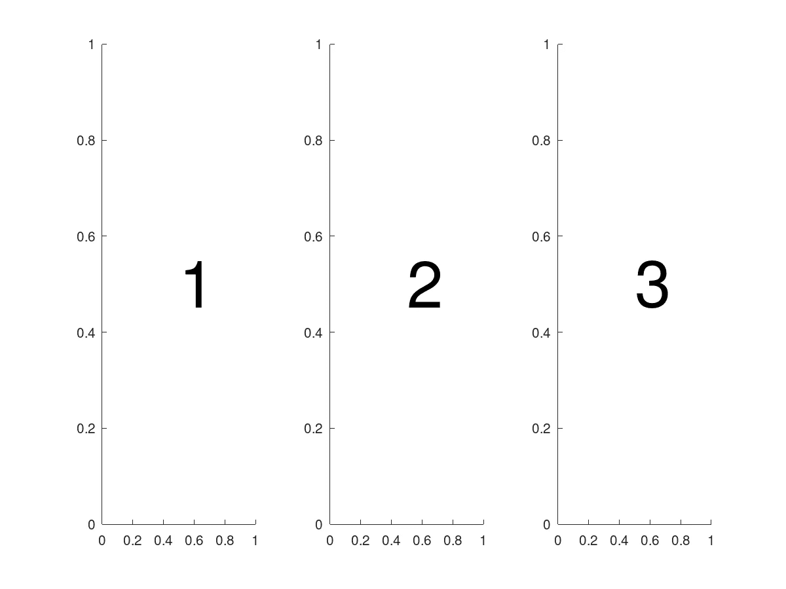
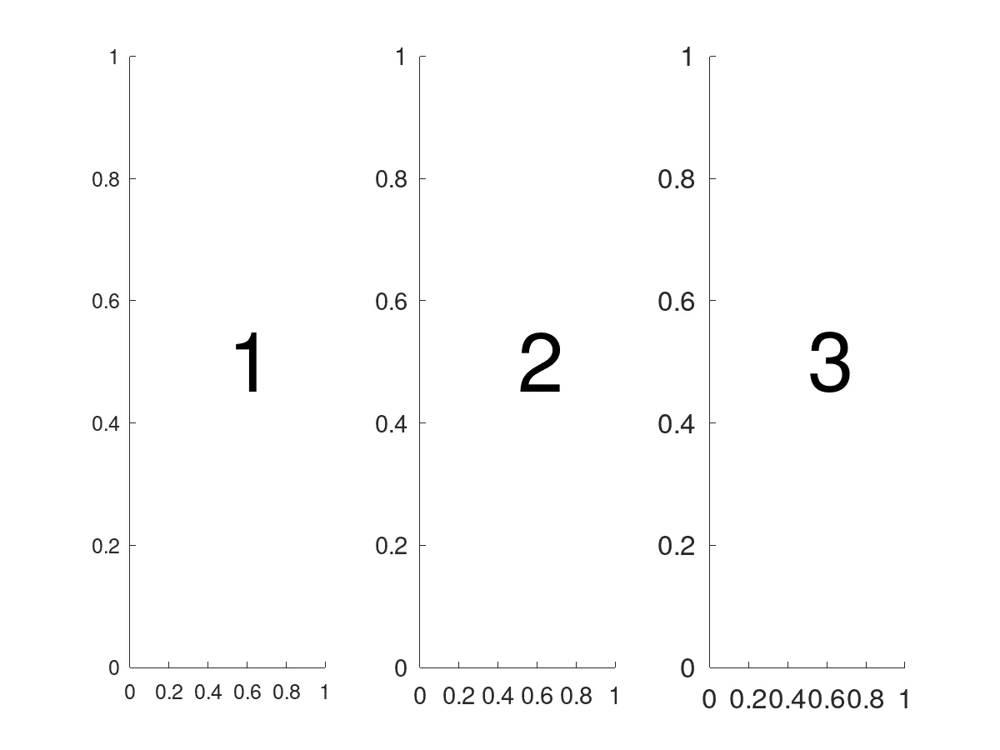
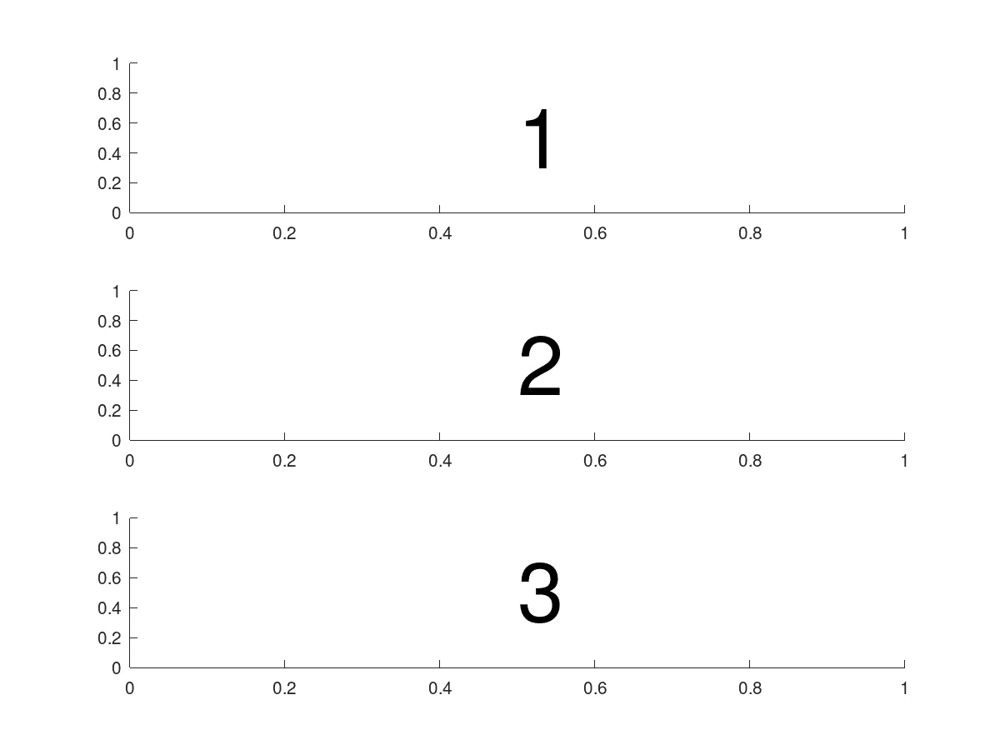
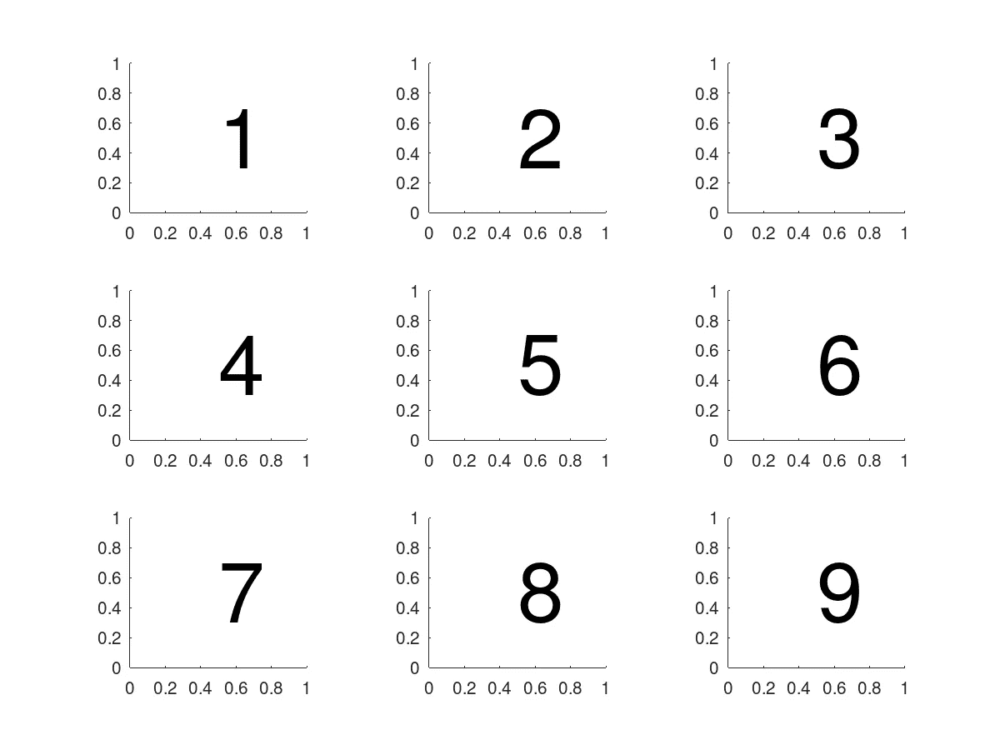
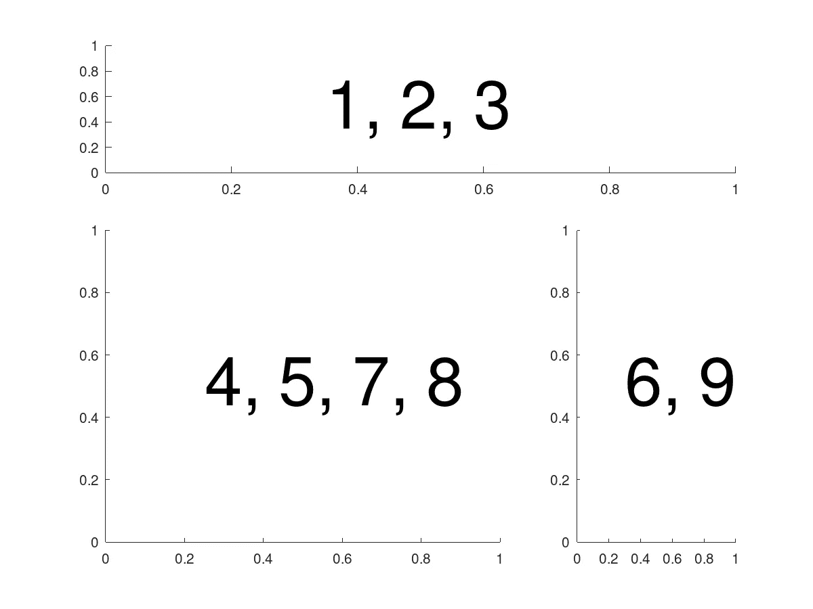
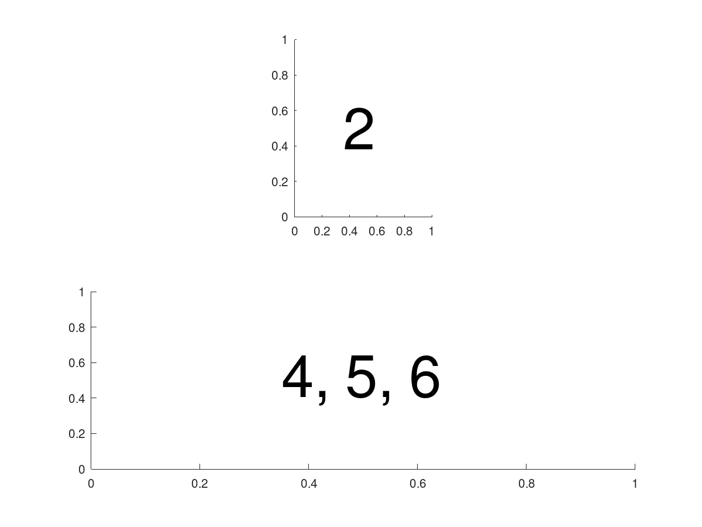
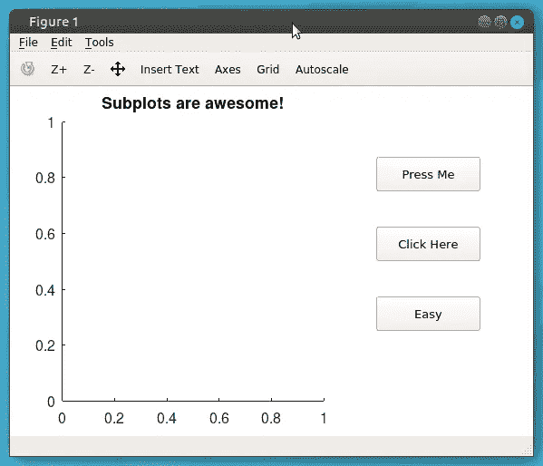

# MATLAB 中的支线图

> 原文：<https://towardsdatascience.com/subplots-in-matlab-34c339082300?source=collection_archive---------25----------------------->


作者图片

## 组织情节的简单方法

子绘图是 MATLAB 中一个非常强大的功能。它们允许用户非常快速地创建定制的数据可视化和显示。它们还可以用来快速创建交互式图形用户界面(GUI)。在本教程中，我描述了使用 subplot()命令的三种不同方式，并提供了每种方式的示例。提供的示例在 MATLAB 和 Octave 中都可以工作。

包含示例的源代码可以在 [GitHub 库](https://github.com/ThinkData-science/CodingTips)中找到。

# 使用基本支线剧情

MATLAB/Octave 中的 subplot()函数允许您在单个图形中的网格上插入多个图。subplot()命令的基本形式接受三个输入:nRows、nCols、linearIndex。前两个参数定义了网格中包含的行数和列数。第三个参数是选择当前活动绘图轴的线性索引。索引从 1 开始，从左到右、从上到下递增。如果这还没有意义，也没关系，在本节的所有例子中，顺序都是可视化的，在网格例子中尤其明显。

让我们从一个简单的例子开始，这个例子沿着一行包含三个子图。为了方便起见，我还使用了 text()函数来显示每个子情节中的线性索引。

```
a1 = subplot( 1, 3, 1 );
text( 0.5, 0.5, '1', 'fontsize', 48 );
a2 = subplot( 1, 3, 2 );
text( 0.5, 0.5, '2', 'fontsize', 48 );
a3 = subplot( 1, 3, 3 );
text( 0.5, 0.5, '3', 'fontsize', 48 );
```



作者图片

注意，在这个例子的代码中，我已经为每个子情节保存了轴句柄(a1，a2，a3)。这一点很重要，因为现在图形上有多个绘图轴，每当我们更改属性时，我们将需要指定我们引用的轴。例如，如果我们想改变字体大小，我们必须指定每个轴上的字体大小。下面的代码片段是一个示例，其中每个轴上的字体被设置为不同的大小。这一概念扩展到所有其他绘图轴属性，并显示了如何完全定制每个子图。

```
set( a1, 'fontsize', 12 )
set( a2, 'fontsize', 14 )
set( a3, 'fontsize', 16 )
```



作者图片

这是另一个例子，我交换了 subplot 函数中的前两个参数，现在我们将创建一个有三行的图形。

```
a1 = subplot( 3, 1, 1 );
text( 0.5, 0.5, '1', 'fontsize', 48 );
a2 = subplot( 3, 1, 2 );
text( 0.5, 0.5, '2', 'fontsize', 48 );
a3 = subplot( 3, 1, 3 );
text( 0.5, 0.5, '3', 'fontsize', 48 );
```



作者图片

最后，我们可以创建一个完整的子图网格。在这个例子中，我包含了 3 行 3 列；然而，可以使用任何组合。这个例子很好地说明了线性指数是如何增加的。

```
for iPlot=1 : 9
  subplot( 3, 3, iPlot );
  text( 0.5, 0.5, num2str( iPlot ), 'fontsize', 48 );
end
```



作者图片

# 使用不同大小的地块

使用 subplot()的一种稍微灵活的方法是将子图放置在网格中的多个点上。这是通过传入一个线性索引数组作为第三个参数来实现的，而不仅仅是一个值。例如，subplot( 1，3，[1，2])将创建一个包含三列的 subplot 网格和一个占据前两列的 plot。这种方法可以让你做出一些非常漂亮的图，可以很容易地容纳各种类型的数据。

让我们看另一个例子。底层网格的形状为 3 x 3。第一个子图位于网格的顶部，跨越所有三列。第二个子图位于左下角，覆盖 2 x 2 子网格。最后，最后一个子图在右下角，横跨最后两行。在所有情况下，线性指数都包括在图中，以说明它们覆盖了网格的哪些部分。

```
% - Create a single plot on the top row
subplot( 3, 3, 1:3 );
text( 0.35, 0.5, '1, 2, 3', 'fontsize', 48 );
% - Create a single plot in the last column
subplot( 3, 3, [6, 9] );
text( 0.30, 0.5, '6, 9', 'fontsize', 48 );
% - Create a matrix in the bottom left corner
subplot( 3, 3, [ 4:5, 7:8 ] );
text( 0.25, 0.5, '4, 5, 7, 8', 'fontsize', 48 );
```



作者图片

填充大型网格的另一个方便的用途是简单地留出一些空间。这很好，因为它创建了空白，并允许您在图中的不同位置对齐子图。下面是一个示例，它将子图放在顶行的中央，并将底行的子图跨越所有列。

```
subplot( 2, 3, 2 );
text( 0.35, 0.5, '2', 'fontsize', 48 );
subplot( 2, 3, 4:6 );
text( 0.35, 0.5, '4, 5, 6', 'fontsize', 48 );
```



作者图片

# 使用位置坐标

使用 subplot()函数的最后也是最灵活的方法是直接指定轴的位置。通过使用标准化的图形单位并指定图形内的相对偏移，最容易做到这一点。如果你对相对数字单位不熟悉，你可以看前面的教程来了解这些。

要指定一个子图位置，您可以将键盘“position”作为 subplot()中的第一个参数，后跟一个描述该位置的 1 x 4 向量。position 属性分别包含水平原点(h0)、垂直原点(v0)、宽度(w)和高度(h)，组织方式如下:[ h0，v0，h，v ]。以这种方式指定子图允许您完全控制位置，如果您想以编程方式创建 GUI，这是必不可少的。

我在下面加入了一个例子，在图的左半部分插入了一个子图，在右半部分插入了三个按钮。这些按钮仅用于说明。在 MATLAB 中创建 GUI 的任务留给另一个教程。请注意，对于下面的例子，我已经指定了图形的归一化单位，但是，默认单位是像素。

```
set( f, 'units', 'normalized' );
a = subplot( 'position', [ 0.1, 0.1, 0.5, 0.8 ] );
title( a, 'Subplots are awesome!' );
set( a, 'fontsize', 16 );
a = uicontrol( f, 'units', 'normalized', 'position', ...
  [ 0.7, 0.7, 0.2, 0.1 ], 'style', 'pushbutton', 'string', 'Press Me' );
a = uicontrol( f, 'units', 'normalized', 'position', ...
  [ 0.7, 0.5, 0.2, 0.1 ], 'style', 'pushbutton', 'string', 'Click Here' );
a = uicontrol( f, 'units', 'normalized', 'position', ...
  [ 0.7, 0.3, 0.2, 0.1 ], 'style', 'pushbutton', 'string', 'Easy' );
```



作者图片

# 摘要

在这篇快速教程中，我回顾了在 MATLAB/Octave 中使用 subplot()的三种(实际上是两种半)不同方式。我发现这个功能对很多不同的事情都非常有用，我每天都在使用它。根据我想要完成的目标，我会使用这三种方法。摆弄一下例子，放入一些真实的数据，感受一下这些类型的子图如何对你有用。

需要记住的一些要点:

*   每个子图都有自己的轴柄和属性(如字体大小、标签、网格)，需要单独设置
*   确保您保存了轴控制柄并正确引用它们
*   子图索引可以指定为单个值或整数索引数组
*   如果指定位置向量，请注意图形单位

编码快乐！