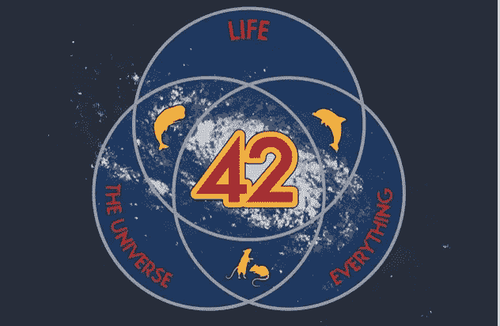
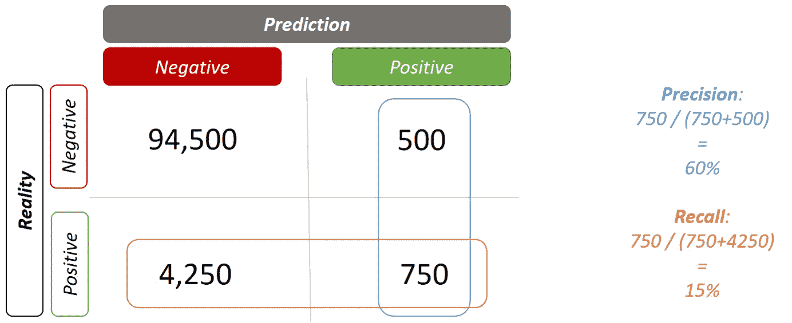
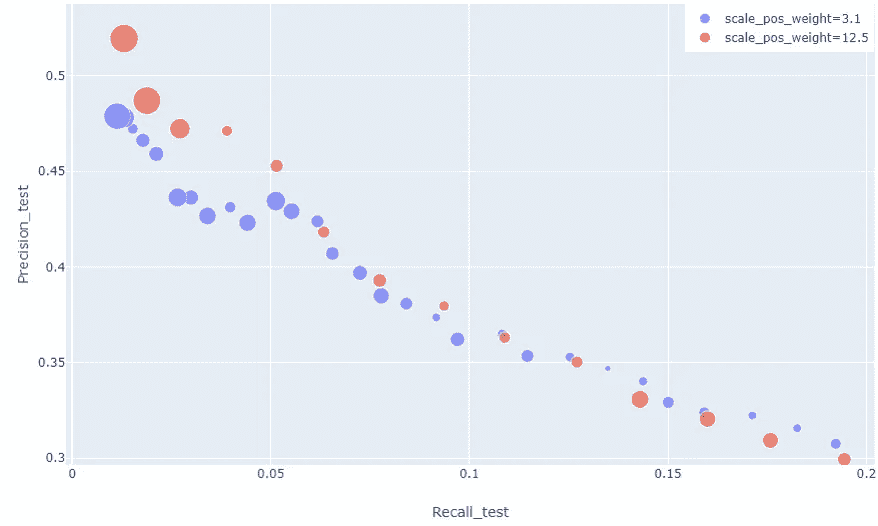
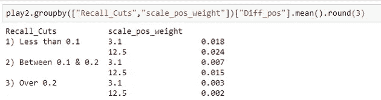
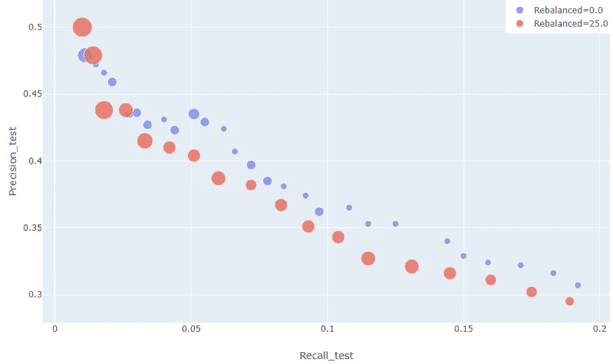
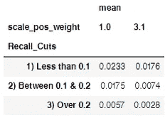

# 不平衡数据的成功:答案是 25，而不是 42

> 原文：<https://towardsdatascience.com/success-with-unbalanced-data-the-answer-is-25-not-42-9c9ffe233620?source=collection_archive---------33----------------------->

## 在稀缺数据上使用 xgboost 获得与业务相关的结果

图片来自 tshirtgifter.com

在《银河系漫游指南》中，我们被告知生命、宇宙和一切的答案是 42。今天，我认为老鼠错了。当处理不平衡的数据时，答案是 25，或者至少在 25 左右。

作为数据科学家，我们经常得到严重偏向非事件的数据。取消合同、升级产品或扩大服务的人往往占少数。这使得算法识别它们具有挑战性，因为缺乏从中进行预测的样本。事实上，当您想要识别的类别少于 5%时，该模型可以通过简单地预测没有人会流失/追加销售来为您提供 95%的准确性。很好的度量结果，但对业务毫无用处。

除非你有完美的数据，否则你不太可能识别出所有积极的类别。因此，我们的重点应该是以尽可能高的准确度识别阳性类别的前 x%。这里我说的是相对低的召回率，高精度。

*   *回忆:你能确定你的积极阶层的比例是多少？*
*   *精确:在你认为积极的人中，正确的比例是多少？*

在下面的示例中，有 100，000 名客户，有 5000 名客户经历了客户流失、追加销售、网络故障等事件，企业需要您预测这些事件会在哪里再次发生。在这里，模型挑选出 15%有问题的顾客(召回),在那些被预测的顾客中，有 60%的精确度——不完美，但如果你随机选择，比 5%好得多。

这里的挑战是，这两个价值存在权衡。一个模型可以得到更高的精度，但是召回率会下降。这归结为一个商业决策，即截止点应该在哪里。应该注意的是，多个截止点可以为或多或少可能的客户群创建不同的行动。

# 好的，但是我如何到达那里？

如上所述，该算法可能会将所有事情都预测为“负面的”,其结果对企业来说是不可用的。我们可以通过调整模型中错误决策的权重来防止这种情况。这告诉模型，不正确的正值赋值代价更高，因此预测更多的是上述混淆矩阵的正方向。

问题是“我们用什么值？”算法有时会提供一个“平衡”的选项。在我们上面的例子中，我们有 5%,这相当于赋予权重 20。今天我告诉你这是错误的。你的目标应该是综合价值 25。我所说的组合是指正类比例和加权值的乘积。在上面的例子中，我们的正类比例是 5%,因此我们希望权重为 5。

通过选择组合值为 25 的权重，您添加了足够的权重以确保有足够的预测，但您也添加了召回范围低端的粒度，那里有真正高的精确度。这可以增强对客户的定位。

让我们通过一个例子来实现这一点。我在 Kaggle 数据集上进行了这个实验:[家庭信用违约风险挑战](https://www.kaggle.com/c/home-credit-default-risk) : *这里大约有 8%的客户违约。* [*(感谢威尔·科尔森在这里做了数据准备)*](https://www.kaggle.com/willkoehrsen/start-here-a-gentle-introduction)

我在这个数据集上运行了一个 xgboost，使用了以下参数，但是请注意，scale_pos_weight 变量被设置为 3.1，以获得神奇的 25 数字。

然后，我以 1%的增量在概率阈值上创建预测，以针对测试和验证目标集生成召回率和精确度。我创建了测试**和**验证集，因为我想测试输出的质量和一致性。我们稍后会看到这一点很重要。

我用 12.5 的“平衡”权重重复了这个过程，并用 plotly.express 生成了这个图。

我们的业务环境要求我们需要最高精度的，因此我们专注于最低 20%的召回率。在这个图表中显而易见的是蓝色气泡的频率，它表示模型的权重为 3.1。

气泡的大小代表测试组和验证组的精度之间的差异。这是平方和平方根，以保持可比性。下面比较了两种模型在不同截止点的情况。

这表明加权值为 3.1 时，该值的平均值较低。这意味着粒度越大，我们也能获得更高的一致性。这对企业来说是个好消息。他们可以更好地锁定最有可能的客户，并获得更可靠的结果。

## 不要做什么…

可以推荐的另一种处理不平衡数据的方法是重新平衡它。这可以通过过采样正类或下采样负类来实现。这里的理论是，你让你的算法有机会识别你的样本中太小的部分。这可以手动完成，就像我下面做的，或者甚至有专门的包，比如 SMOTE。

下面，我比较了两者的权重都为 3.1 的输出，但是红色组已经对训练数据进行了重新平衡，因此正面类的大小是负面类的 25%。

我们在这里看到的是，红色(重新平衡)组的气泡尺寸明显更大。这也是测试集和验证集之间的精度差异。这表示通过重新平衡数据，结果更加不一致。

这甚至适用于没有对重采样数据进行加权的情况。下面是权重为 1 的重采样数据集和权重为 3.1 的非重采样数据集之间的平均差异，我们看到权重为 3.1 时的误差较低。

## 离别之思

有趣的是，在生成这些模型时，它们都生成了 0.74 的 AUC 和变化。所以最初的观点会说这并不好。然而，我希望这能鼓励你比你的第一个指标看得更深一点，并帮助你为你的企业创造更多的价值。

这篇文章的所有代码都在 [Github](https://github.com/jamesoliver1981/Home_Credit) 上