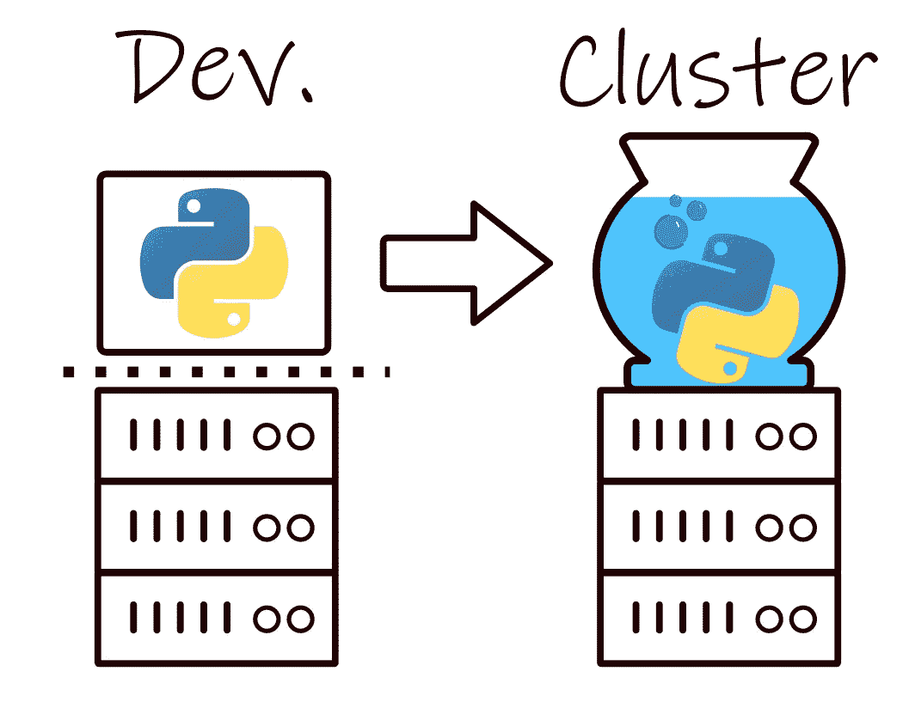

# Python 项目的成功 spark 提交。

> 原文：<https://towardsdatascience.com/successful-spark-submits-for-python-projects-53012ca7405a?source=collection_archive---------5----------------------->

## 在真实的集群上平稳地运行您的项目，而不是您一直使用的那个虚拟集群。

**TL；博士:**学习的最好方法就是去做，而学习难的东西最好的方法就是一小步一小步的去做。这是针对在独立开发环境中处理包的 Python 实践者(可能是数据科学家)的指南，他们希望在集群上使用该包成功执行 Spark 作业。大数据技术堆栈乍一看似乎令人望而生畏:本文的目标读者是那些刚刚开始有效地使用集群的人，他们希望自己的项目能够顺利启动并运行，然后满怀信心地探索、利用这一经验并完善自己的风格。



Python 程序可能无法在恶劣的环境中生存。

# 介绍

已经够了！带我去指南(向下滚动)。

**这个问题。**

在为 Spark 编写、开发和测试我们的 Python 包时，很可能我们将在某种隔离的开发环境中工作；在桌面或专用云计算资源上。至关重要的是，我们可以自由组合的 Python 环境，即我们最喜欢的所有最佳包的次要版本，很可能不同于在我们友好的邻居集群上执行的普通 spark-submit 作业可访问的 Python 环境。一般来说，希望有一定程度的灵活性，并且能够快速地将附加的依赖项合并到原型环境中。在开发我们的代码的热情和兴奋中，准备一个与我们的包兼容的集群范围的环境，准备接收和执行我们的 Spark 作业的远见可能避开了我们。现在，这个不可预见的障碍正在阻止我们大规模地运行我们的项目，这对一个数据科学家来说是一个悲哀。

**一种解决办法。**

在接下来的内容中，我们将以透明和可访问的方式，通过 spark-submit 完成在 Spark 上运行 Python 包的必要步骤。本指南中涵盖的步骤有:

1.  如何打包和准备我们的 Python 项目，以便在 Spark 集群上成功执行。
2.  使用适合我们项目的 Python 版本准备一个最小的工作环境，并将其上传到 Hadoop，使所有工作人员在执行时都可以访问它。
3.  打包我们的项目依赖关系。
4.  准备 spark-submit 脚本，以一种可理解的方式将上述所有内容整合在一起。

**目标受众。**

与该主题相关的现有资源(参见进一步阅读)主要是为了用 Python 产生生产级的 Spark 作业。它们真的很棒，但是对于那些不太熟悉集群模式下工作 Spark 的复杂性和细微差别的人来说，可能会形成一个陡峭的学习曲线；有很多东西需要消化。如果您刚刚开始接触这些大数据技术，您将需要很好地理解基础知识。本指南关注基础知识和关键概念，强调你在开始时肯定会遇到的事情。

# 向导

**序言。**

我的职业是数据科学家。我在一个运行 Hadoop 的商用集群上工作，使用 Spark 为机器学习和数据科学项目构建大数据管道，处理包含数十亿行的超大型数据集。开发在隔离的环境中进行，使用 Anaconda 作为 Python 发行版。通常，我会设置几个不同的虚拟环境，以便将 Spark 处理步骤从项目的其他方面分离出来。

在开发中，我的项目将是这样的结构。

```
my_data_science_project
├───data
├───models
├───envs
│   ├───/spark_env/
│   └───/ml_env/
├───conf
├───notebooks
│   ├───model_explore.ipynb
│   └───eda.ipynb
└───src
    ├───data_pipeline
    │   ├───functions.py
    │   ├───processing.py
    │   └───__init__.py
    ├───app.py
    └───__init__.py
```

我将使用 Jupyter 笔记本来试验和调整转换，仔细检查结果，直到它们与我试图实现的相匹配。最终，一旦所有的代码都做了它应该做的事情，下一步就是打包它，并从我们将传递给 spark-submit 作业的脚本中调用转换步骤。spark-submit 作业将按照我们的指令设置和配置 spark，执行我们传递给它的程序，然后干净地释放正在使用的资源。传递给 spark-submit 的一个简单的 Python 程序可能如下所示:

```
"""
spark_submit_example.pyAn example of the kind of script we might want to run. The modules and functions of our package can be imported and accessed in the usual way. Command line arguments can be accessed in parsed in the usual way. We can even read in files in the usual way. In fact, its all very... usual..."""import yaml
import sys
import src.data_pipeline.processing
from src.app import get_spark def run(ss, appConfig):
    # Do some steps using the appConfig
    input = ss.read.parquet(appConfig['input'])
    output = src.data_pipeline.processing.process(input)
    output.write.parquet(appConfig['output'], mode = 'overwrite') if __name__ == "__main__":
    #Get some configuration settings
    args = sys.argv
    appConfig = args[1] with open(appConfig) as file_handler:
        appConfig = yaml.load(file_handler, Loader=yaml.Loader) # Suppose the Spark session builder is wrapped in this function.
    ss = get_spark() run(ss, appConfig)
```

在一个刚刚脱离孤立开发环境的集群上，让这一点顺利工作可能会很棘手。有许多活动部件。之所以有这个指南，是因为我自己也经历过这个过程，我认为如果有这个指南作为参考，会大大加快速度。

声明:我不会开始讨论如何正确配置和创建绑定到 Spark 会话的 Python 对象。这本身就是一个话题，而且假设你已经成功地做到了这一点。在这里，我们将这个任务的复杂性委托给假设的`get_spark()`。

**1。打包项目。**

第一步是打包所有属于这个包的 python 文件、模块和脚本，即`./src/`目录的内容。这一步没什么特别的，你可以在这里阅读 setuptools [的用法。创建您的 setup.py 文件和`python setup.py bdist_egg`。在这一步之后，我们将有一些新的文件和目录，包括一个`.egg`，它在本指南中就像一个`.zip`。当我们稍后运行我们的 spark-submit 作业时，我们将让程序知道包含我们的项目源代码的 egg 文件，它将把这个文件发送给驱动程序和工人。当我们的应用程序启动时，传递给`--py-files`的任何工件(鸡蛋、拉链)的顶层都被添加到`PYTHON_PATH`，这就是我们如何从传递给 spark-submit 的程序中导入我们的包。](https://packaging.python.org/tutorials/packaging-projects/)

```
my_data_science_project
├++ setup.py      ]- python setup.py bdist_egg to produce the below.
├++ dist/                      
│   └++ my_data_science_project-0.1-py2.7.egg
└++ build/ 
```

**2。准备一个最小的工作环境。**

当用 Python 驱动程序运行我的 Spark 作业时，我喜欢使用最小化的工作环境。在原型开发和开发时，很容易以臃肿的虚拟环境告终，因此这是重新考虑是否可以进行任何修剪的有用点。如果我们运行的程序最终被表示为纯 Spark(而不是用 numpy、pandas 做任何事情),那么我发现只使用内置模块和一个 yaml 解析器就可以走得很远。

让我们继续使用 conda 创建一个新的环境，不包含任何默认安装的包(我们的 spark 作业可能不需要这些包)。

```
conda create \
--name spark_submit_env \
--no-default-packages \
--copy \
--prefix ./envs \
python=xx 
```

运行上面的命令将在`./envs/`中给我们一个额外的目录，其中包含我们的最小工作环境。当我们调整 Spark 程序时，我们可能会反复使用这个环境，所以我们会将它上传到 Hadoop 文件系统，而不是每次我们想要运行 Spark 作业时都要运送和分发它。我们将把我们的环境作为`.zip`上传到 Hadoop，这将保持一切整洁，并且我们可以告诉 spark-submit 我们已经创建了一个归档，我们希望我们的执行者能够使用`--archives`标志访问它。为此，首先遵循以下步骤:

1.  `cd ./envs/spark_submit_env/`
2.  `zip -r ..spark_submit_env.zip .`

现在向上移动一级，运行以下命令:

`hadoop fs -copyFromLocal ./spark_submit_env.zip /hdfs/env/path/`

记住这个 hdfs 路径，我们将在稍后的 spark-submit 脚本中引用它。上面运行的命令将在我们的项目目录中添加以下内容。

```
my_data_science_project
├───envs
│   ├───spark_env
│   ├───ml_env
│   ├++ spark_submit_env      ]- zip this up
│   └++ spark_submit_env.zip  ]- upload to hdfs
├───conf
```

**3。打包依赖项。**

准备好我们的`spark_submit_env`并上传到 hdfs 之后，我们现在开始准备我们的 Spark 作业所依赖的特定依赖项。这里有多种方法可以达到同样的效果，而且非常简单。这些步骤对于曾经打包过项目的任何人来说都是直观的，但是，我们确实想确保我们的`spark_submit_env`中有针对特定 Python 版本的正确版本的包。在一辆`requirements.txt`里草草写下我们的星火工作所需的包裹:

```
requirements.txt
pyyaml
another_package_you_love
~
```

然后，`source activate spark_submit_env`，让`which pip`放心地告诉我们`/path/to/your/project/envs/bin/pip`。现在，我们可以确信我们的 spark-submit 工作所需的包将与我们准备的环境很好地配合。我们现在可以`pip install`将需求中列出的依赖项放到一个指定的目录中，我们会将其压缩并传递给 Spark。

`pip install -t ./dependencies -r requirements.txt`

```
my_data_science_project    
├++ requirements.txt     ]- pip install this
├++ requirements/        ]- to here, then zip it up
├++ requirements.zip     ]- like this.
```

请注意，我们可以在开发过程中直接将依赖项打包为工作环境设置的一部分并进行分发，但是单独明确地列出并捆绑包依赖项会保持事情的美观和透明。我们也可以删除多余的包，这些包对 eda、可视化等很有用。，但不是授权给 Spark 的步骤所直接需要的。

**4。spark 提交脚本。**

这是我们将迄今为止所经历的所有步骤汇集在一起的地方。这是我们将运行来调用 Spark 的脚本，在这里我们将让它知道我们准备的 Python 环境、我们打包的项目及其依赖项。spark-submit 脚本如下所示:

```
#!/bin/bashPYTHON_ZIP="hdfs:////hdfs/env/path/spark_submit_env.zip#pythonlib"
PYSPARK_PYTHON="./pythonlib/bin/python2.7"PROJECT_EGG=./dist/my_data_science_project-0.1-py2.7.eggSPARK_CMD = "spark-submit \
--conf spark.yarn.appMasterEnv.PYSPARK_PYTHON=${PYSPARK_PYTHON} \
--archives ${PYTHON27_ZIP} \
--py-files ${PROJECT_EGG},./dependencies.zip \
--master yarn \
--deploy-mode cluster \
--files ./conf/appConf.yml#appConf.yml \
spark_submit_program.py appConf.yml arg2 ..."eval ${SPARK_CMD}
```

我们来分析一下。

`PYTHON_ZIP="hdfs:////hdfs/env/path/spark_submit_env.zip#pythonlib"`

在这里，我们声明变量`PYTHON_ZIP`，并为它分配我们在步骤 2 中上传 Python 环境的文件 url。`#pythonlib`后缀是一个小技巧，允许我们在 YARN 上运行 Spark 时指定名称别名。我们可以用它为传递给`--py-files`或`--archives`的任何东西指定一个文件名别名。这个别名是 Spark 应用程序将看到的实际名称。你可以在这里阅读更多。

`--conf spark.yarn.appMasterEnv.PYSPARK_PYTHON=${PYSPARK_PYTHON}`

这里我们设置环境变量 PYSPARK_PYTHON 指向我们打包到 spark_submit_env 中的 PYTHON 可执行文件。搜索以上[这里](https://spark.apache.org/docs/latest/running-on-yarn.html)阅读更多。

`--archives ${PYTHON_ZIP}`

传递给`--archives` get 的任何东西都被解压缩到每个执行器的工作目录中，所以传递压缩环境的 hdfs url 就是这些执行器访问我们准备的环境的二进制文件和模块的方式。

`--files ./conf/appConf.yml#appConf.yml`

传递给`--files`的单个文件也被复制到执行器的工作目录中，同样，我们可以使用`/path/to/file#alias`语法来命名它们。例如，我们可以传递一个 yaml 文件由驱动程序解析，如`spark_submit_example.py`所示。

`spark_submit_example.py appConf.yml arg2 arg3 ...`

在指定了我们的`[OPTIONS]`之后，我们传递由驱动程序执行的实际 Python 文件:`spark_submit_example.py`，以及程序的任何命令行参数，它们可以用通常的方式进行解析。例如，第一个参数可能是一个 yaml 文件`appConf.yml`，可能会有后续的参数为程序提供更多的上下文。

**跑跑跑。**

我们终于可以执行上面描述的 spark-submit 脚本了:

`./spark_submit_script.sh`

最后提醒一句，当使用虚拟环境时，要小心对`PATH`的修改。我以前在尝试 spark-submit 时遇到过问题，却不记得停用某个特定的虚拟环境。

如果你已经做到了这一步，我希望这是因为你发现本指南的内容很有帮助——我很想知道是不是这样。如果有人有足够的时间提出要求，我会非常乐意详细说明任何细节。我非常乐于接受反馈。因此，如果你发现不一致或错误，请大声喊出来；我会立即删除这篇文章，并删除它曾经存在过的所有痕迹，以及我的帐户和我的 LinkedIn。我将离开不适宜居住的环境象形图，虽然那花了我很长时间。

# **延伸阅读**

当您对本指南中介绍的步骤有信心时，您可能想看看以下资源:

[如何使用良好的软件工程实践设置 Python 和 Spark 开发环境](/how-to-setup-the-pyspark-environment-for-development-with-good-software-engineering-practices-5fb457433a86)

[建筑生产 PySpark 岗位](https://medium.com/@lubna_22592/building-production-pyspark-jobs-5480d03fd71e)

[编写生产级 PySpark 作业的最佳实践](https://developerzen.com/best-practices-writing-production-grade-pyspark-jobs-cb688ac4d20f)