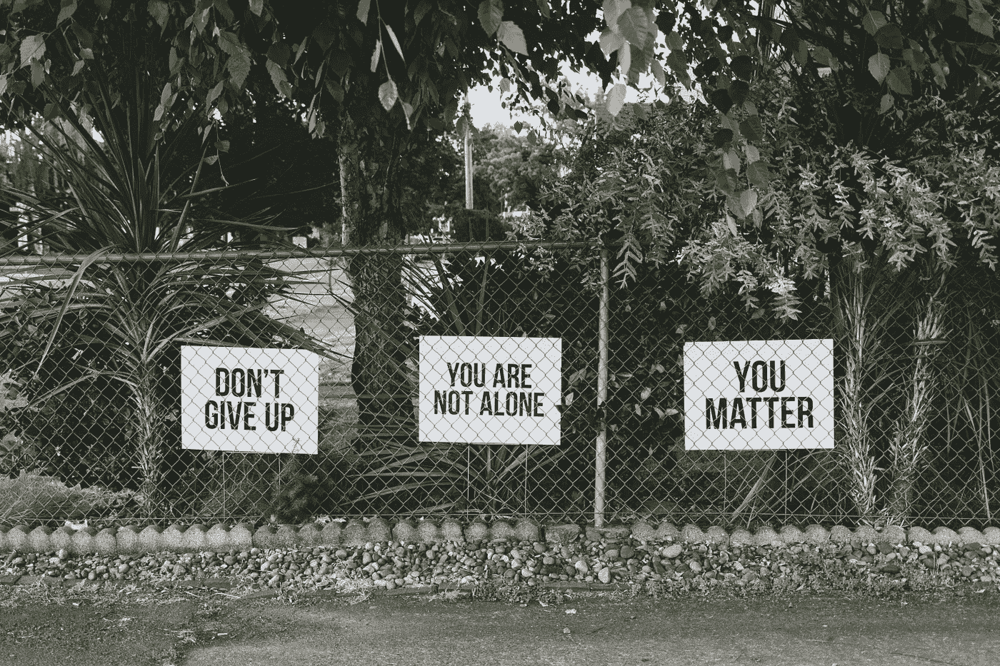

# 自杀是一个会传染的想法:你能做什么

> 原文：<https://towardsdatascience.com/suicide-is-almost-as-contagious-as-covid-19-we-can-change-that-through-social-media-c0bb573a9366?source=collection_archive---------36----------------------->

丹·梅耶斯在 Upsplash.com[拍摄的照片](https://unsplash.com/photos/hluOJZjLVXc)

上周一，2020 年 8 月 3 日，思科与 SAVE 合作，发布了 https://reportingonsuicide.cisco.com/[的公测版。这是一个关于我们如何利用数据科学拯救生命的故事，为什么这个发布会如此重要，以及你如何通过改变你交流精神疾病的方式来帮助防止自杀。也是我的故事，我从来没有公开讲过。](https://reportingonsuicide.cisco.com/)

上周四，8 月 6 日，是一个非常亲密的朋友自杀五周年纪念日。Erika 和我穿越了三大洲，从一架飞机上跳下，设计了定制的配对小指戒指，甚至一起创作了一本书。我们(几乎)无话不谈，并在谷歌上列出了我们将要进行的所有冒险。我们真的有一个共度余生的计划。

然后，在她 30 岁生日的前一个月，她自杀了。这让我崩溃了。对于那些因自杀而失去亲人的幸存者来说，这是很常见的，在接下来的 4 年里，我一直为她的死而自责。

2019 年，艾瑞卡的父亲比尔·艾尔金顿(Bill Elkington)和他在艾瑞卡去世后介绍给我的心理学家[彼得·科姆里](https://www.linkedin.com/in/petercomrie/?originalSubdomain=ca)帮助我理解了我们谈论精神疾病和自杀的方式往往会影响人们是否寻求他们需要的治疗。或者，如果像艾丽卡那样，他们如此有效地掩盖自己的疾病，以至于威胁到生命。

丹·赖登伯格博士的一生我是通过 https://reportingonsuicide.org/而熟悉他的工作的，受到他的启发，我给丹博士打了个电话，问他是否愿意一起努力使他的研究民主化。很明显，即使科学是可靠的，并得到包括疾病预防控制中心在内的有眼光的组织的支持，指南的采用水平还是很低——太低了。丹博士接受了我的邀请，今天我很荣幸地称他为同事。基于他和他的合作者的发现，世卫组织将报道自杀确定为预防自杀的 7 个优先领域之一，并为媒体专业人员创建了一个资源库。

2019 年末，Thomas Niederkrotenthaler 博士发表了[令人震惊的研究](https://www.bmj.com/content/368/bmj.m575):在名人自杀的报道不符合世卫组织准则的情况下，传染效应将*全国*自杀率提高了高达 13%。尽管彼得已经意识到自杀的传染效应——根据统计，艾丽卡的自杀使我死于自杀的可能性增加了 5%—50 %,彼得估计我的个人风险水平接近 75%——但我不知道传染效应如此之大。当我试图更好地理解传染效应时，丹博士告诉我，总的来说，其他人是否会因为另一个人(无论是否是名人)的自杀而死亡的风险约为 3-5%。为了更好地理解这个数字，[新冠肺炎的传染效应是 5.7%](https://www.healthline.com/health/r-nought-reproduction-number) 。

我不是媒体专业人士，很可能你也不是。但是，越来越多的人每天转向社交媒体获取新闻，这模糊了内容创作者和消费者之间的界限。这意味着指导方针不仅适用于专业人士，也适用于我们这些业余爱好者(他们在脸书、推特、LinkedIn 等网站上发帖)。)也是。好消息是它们相对较短:

1.  不要讨论、描述或描绘某人自杀的方法和地点。这样做已经导致了无数次自杀事件的增加——以同样的方式不成比例地增加。
2.  不要用“自杀”这个侮辱性的词汇。人们犯罪，而不是生病。相反，说“死于自杀”或“自杀”
3.  不要分享遗书的内容。它会把认同其内容的人推向自杀，而不是寻求治疗。
4.  不要过分简化或推测自杀的原因。我们仍然没有完全理解自杀和精神疾病，但我们知道自杀从来都不简单。
5.  不要美化、浪漫化或煽情自杀。如果你觉得自杀很迷人、浪漫或耸人听闻，请向心理健康专家寻求帮助。
6.  请记住，自杀的话题可能会引发任何人与你交谈或阅读你的社交媒体帖子。确保你的帖子引用了帮助热线。例如，在美国，国家自杀预防生命线的号码是 1–800–273–8255；危机短信热线可以通过给家里发短信联系到 741741(美国)、686868(加拿大)或 85258(英国)。

基于这些令人难以置信的研究，我和我的合作伙伴 Annie Ying 博士(人工智能博士)制定了以下计划:创建一个类似于语法检查器的工具，用户可以在发布前/发布前粘贴文本，突出显示任何不符合指南的单词或短语，同时提供教育和建议。

2019 年早些时候，我建立了[思科的数据科学和 AI for Good 计划](https://blogs.cisco.com/analytics-automation/ds4g)，作为思科人无偿回报的渠道，对 100 多名自愿为预防自杀贡献时间的人表示感谢。这份名单包括执行发起人首席数据官 Shanthi Iyer 和数据科学负责人 Sanjiv Patel，没有他们，我们的全球平台愿景所需的工具和基础设施将成为巨大的障碍。

志愿者加入后，我们的第一步是数据标记，因为不存在我们可以从中获取信息的存储库。数据科学家 Riley Hun 建立了一个基于 API 的数据管道。建筑师 Edgar Murillo 随后创建了一个易于使用的 UI，即使非技术志愿者也可以阅读媒体报道，并标记哪些文本违反了哪些准则。许多许多个夜晚和周末之后，我们已经标记了将近 2000 篇文章。我想借此机会向我们的顶级贡献者大声欢呼:丹尼斯·切斯基(294 篇文章)、罗斯·普菲尔(242 篇)、泽西·基梅尔(165 篇)、阿尔特米奥·里曼多(119 篇)、佩里·梅斯(107 篇)、乔迪·麦克米伦(95 篇)、梅根·理查森(86 篇)、斯科特·埃利奥特(79 篇)、加里·班塔德(65 篇)、安东尼·纳西亚特卡(61 篇)、克里斯·多兰(54 篇)和林恩·考夫兰(50 篇)。

我们惊恐地发现，我们标记的文章中只有 3%遵守了所有的准则。

利用标记的数据，数据科学家 Artemio Rimando 和 Shima Gerani 用 Python 构建了基于字符串匹配的数据科学模型，而产品经理 Raphael Tissot 则构建了网站和用户体验。这是一个历时数月的过程，丹博士和他的团队与我们密切合作，以确保该工具的功能符合他的标准。

现在，公开测试版已经上线，该团队正在努力提高该工具的性能(在我撰写本文时，Shima 正在编写代码),并根据我们的媒体和学术合作伙伴的意见构建产品开发路线图，以最大限度地提高指南的采用率。

至于你，亲爱的读者，请采纳这些指导方针。T2 将会帮助拯救生命。