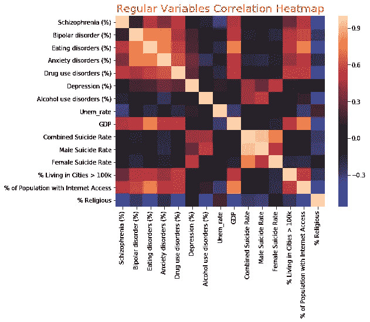
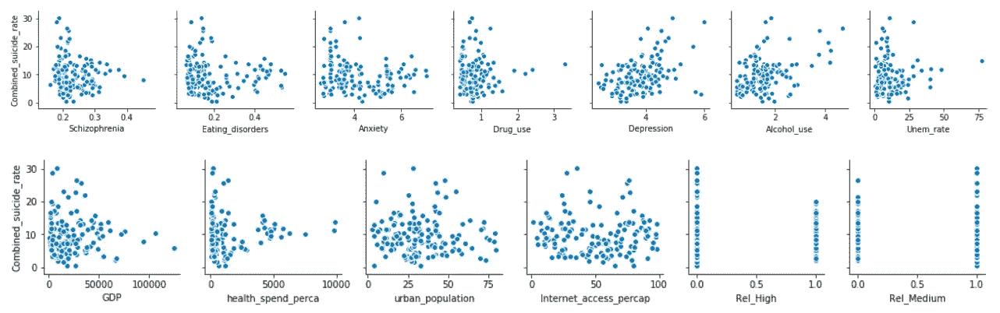
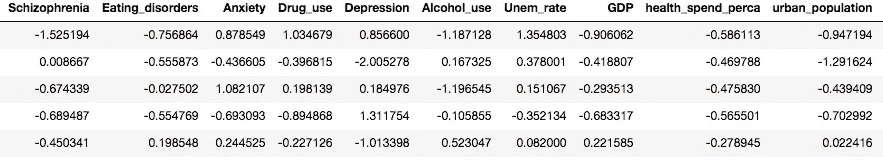
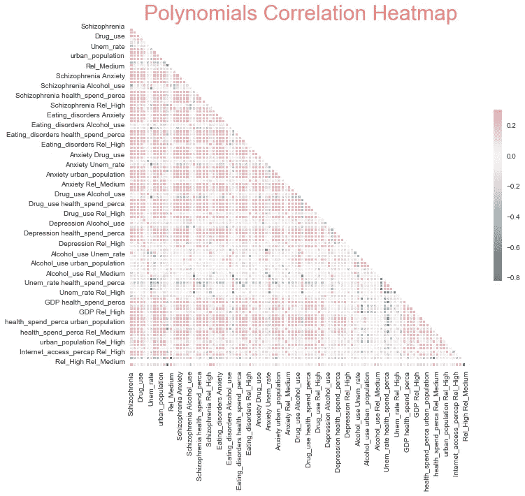
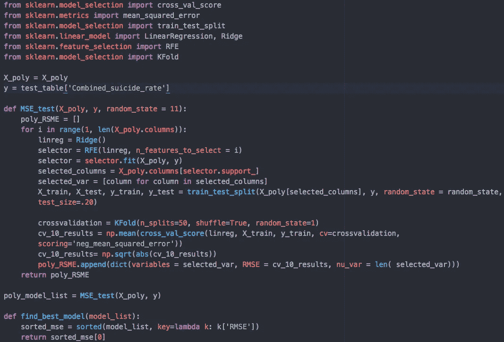
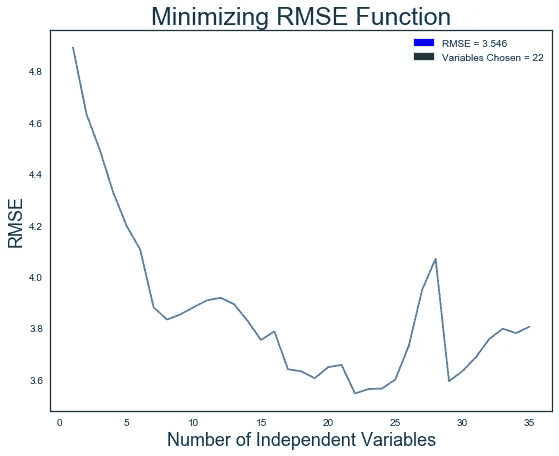
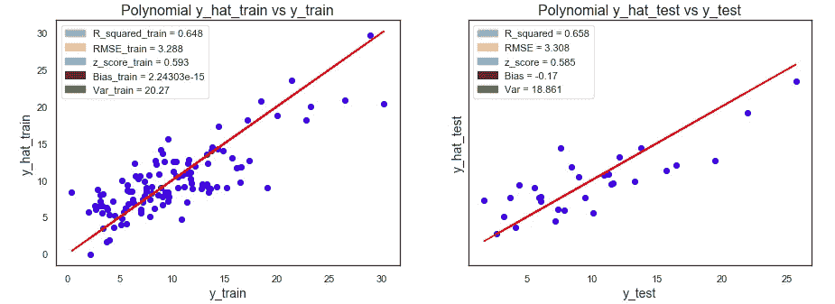
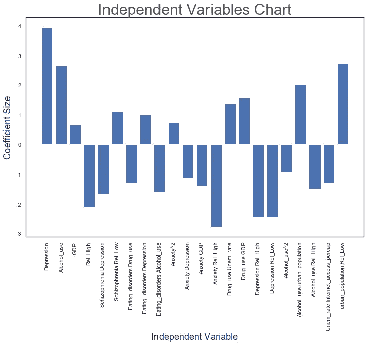
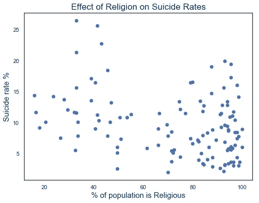
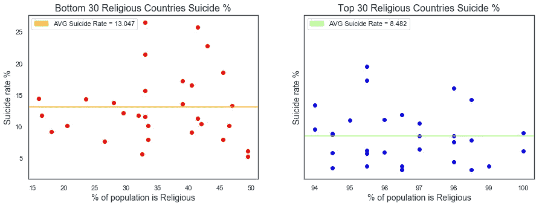

# 用数据科学洞察自杀预防

> 原文：<https://towardsdatascience.com/suicide-prevention-insights-with-data-science-f33131a3c3d0?source=collection_archive---------36----------------------->

## 心理健康

## 宗教是强有力的抗抑郁药

我相信我第一次经历强烈的情感冲击是在大约 11 岁的时候，当时我发现我认识的、钦佩的、被认为成功和幸福的人突然决定以自杀来结束自己的生命。短短几年内，我的两个童年好友的爸爸就发生了这样的事情。这两个人看起来都像慈爱的父母和模范公民，所以这个消息对我和他们各自的社区来说都是一个巨大的冲击。同样的悲剧故事在我青少年时期的三个主要英雄身上重演——柯特·科本、罗宾·威廉姆斯和安东尼·鲍代恩。这些年来，我度过了无数个不眠之夜，试图找出是什么可能将我所热爱和钦佩的人推向如此极端，这些人乍一看似乎拥有成功和幸福的生活。所有这些没有答案的问题可能会折磨任何近距离接触过亲密朋友、家人或明星偶像令人震惊的自杀事件的人，在这些问题的驱使下，我决定与我的同学布莱恩·斯雷布雷尼克合作，尝试用数据科学来研究自杀之谜。

这个项目的目标是利用 200 个国家的一些社会经济和心理健康指标建立一个机器学习监督的回归模型，并试图确定哪些因素可能与国家自杀率有统计上的显著相关性。

在对之前在这个问题上所做的工作做了一些研究后，我们收集了以下自变量的数据，我们认为这些数据将有助于建立我们的模型。我们使用了 2016 年的数据。

1.  **抑郁率**
2.  **精神分裂症发病率**
3.  **焦虑率**
4.  **躁郁症**
5.  **饮食失调**
6.  **酒精使用障碍**
7.  **药物使用障碍**
8.  **GDP**
9.  **人均卫生支出**
10.  **失业率**
11.  **居住在拥有> 10 万人口的城市的人口比例**
12.  **上网人口的百分比**
13.  **信教人口百分比的分类数据**

> **注:**如果您对我们如何构建和优化模型的技术细节不感兴趣，请跳至**“模型总结和最终见解及结论”**部分，了解我们调查结果的详细总结。

# 准备数据并检查多重共线性

首先，我们从世界卫生组织 API 和其他几个网站收集了 2016 年的年度社会经济数据。在清理所有数据并将其合并到一个 pd 中之后。数据框架我们使用 SeaBorn 关联热图检查了独立变量多重共线性:

使用 sns.heatmap(final_table.corr()，center = 0)的共线性热图

热图告诉我们，双相情感障碍%与其他三种精神健康问题有很高的相关性，因此我们决定在运行模型之前删除该变量，以避免由严重的多重共线性引起的额外噪声。

## 检查每个独立变量和自杀率之间的线性关系

接下来，我们创建了每个自变量与因变量**自杀率**相关性的成对散点图:

使用 seaborn.pairplot()绘制散点图对

从上面的图表中我们可以看到，在抑郁、焦虑、精神分裂症、酗酒的比率和一个国家的宗教程度之间存在某种程度上的**线性关系**。所以，我们最初的期望是，我们的机器学习模型应该给这些类别分配更多的权重。

# 缩放我们的独立变量，并在模型中引入变量组合和多项式

由于我们的一些自变量以千为单位，而另一些以百分比为单位，因此我们决定调整所有自变量，以确保我们的模型不会为某些变量分配过大的系数。

使用 sklearn.preprocessing.scale 缩放变量

下一步是通过二次多项式函数引入交互项，以帮助我们的模型进行特征选择，提高其最终精度，并降低均方根误差。下面的关联热图有助于我们识别所有相关的新变量:

## 对每个回归模型应用 RFE 和交叉验证，以选择最小化 RMSE 的最佳模型

既然我们的数据已经清理、缩放和预处理，现在是最后一步的时候了——根据我们的训练数据训练我们的机器学习模型，以提高其对测试数据的预测准确性。我们使用三个模型优化子步骤来创建我们自己的定制 GridSearch 函数:

1.  我们使用下面的函数运行线性、套索和岭回归，以确定哪一个生成的模型误差最小。对于这个特定的数据集，我们发现**岭回归**有最好的结果。我们对训练数据-测试数据比率采用了 80–20 的比例。
2.  我们使用 **RFE(递归特征消除)**将所有独立变量逐个输入每个模型，并选择最小化 RMSE 的变量数量和组合。
3.  我们使用了 **K 倍**交叉验证来优化每个模型在测试数据上准确预测的能力，这是它以前从未见过的。(*代码如下)*

我们的定制网格搜索算法

下图显示了我们的 RMSE 函数，以及我们如何训练我们的模型来挑选产生最低误差的独立变量的数量:

选择了 22 个变量，RMSE = 3.54

# 模型总结和最终见解和结论

现在大部分繁重的工作已经完成，是时候分析我们的结果了。首先，我们用训练数据与测试数据的模型统计绘制散点图，以确保没有太多的训练数据偏差或过度拟合。正如我们从下图中看到的，测试和训练样本的 RMSE、z 分数和 R 平方非常相似，这正是我们所希望的。0.66 的 R_squared 分数并不惊人，但是考虑到我们只有大约 150-200 个例子(国家)，我们对模型的表现相当满意。我们相信，如果我们能够将 500 多个观察值输入到我们的训练集中，模型的预测准确性将会显著提高。

基于测试数据和训练数据的模型性能

我们还想看看实际的独立变量及其系数，并试图从它们的分布中得出一些见解和结论。以下是最终模型方程和每个独立变量的条形图及其在最终模型中的权重:

**自杀率** = 10.28 + 3.58* **抑郁症** + 2.74* **酒精 _ 使用**—1.87 ***Rel _ 高** — 2.24* **精神分裂症抑郁症** + 0.65* **精神分裂症 health _ spend _ perca**+1.23 ***精神分裂症 Rel_Low** — 1.56* **进食障碍 **焦虑 Rel_High** + 1.67* **药物 _ 使用****Unem _ rate**+1.58 ***药物 _ 使用 GDP** — 2.48* **抑郁 Rel_High** — 1.76* **抑郁 Rel_Low** — 0.92* **酒精 _ 使用** + 0.71* **酒精 _ 使用 GDP【T44****

# 结论:

根据下面的方程系数和柱状图，我们可以假设以下假设，并可以进一步检验:

1.  **倾向于增加一个国家自杀率的变量:**

*   抑郁率
*   酒精使用障碍率
*   城市人口比例**结合**与低水平的宗教信仰
*   城市人口百分比**结合**高酒精使用
*   精神分裂症的发病率与低水平的宗教信仰相结合
*   吸毒紊乱与高失业率结合在一起
*   与国内生产总值水平相结合的药物使用

**2。倾向于降低一个国家自杀率的变量:**

*   人口的高度宗教性
*   抑郁率**结合**与高宗教信仰
*   焦虑率**结合**与高度宗教性
*   酒精使用障碍率**结合**与高度宗教性
*   药物使用率**结合**与高度宗教性
*   饮食失调率**与酒精使用率**相结合
*   饮食失调率**与药物使用率**相结合

# 调查一个国家的宗教信仰和自杀率之间的反比关系

当谈到对自杀率的影响时，我很好奇也很惊讶地发现**我们的模型很重视一个国家的宗教程度。如果我们仔细观察上面的系数图，我们可以看到，大多数似乎对高自杀率有很强直接影响的特征，如抑郁症、酗酒和精神分裂症**，在宗教人口高度密集的国家往往会失去它们的负面影响**。这一有趣的现象在下面的两个图表中得到了证明:**

大多数高自杀率的国家都是宗教人口不到 50%的国家

宗教程度最低的国家 AVG 自杀率要高得多

# 最后的个人想法

尽管我们没有分析足够的数据来得出任何有力的结论，但我们的发现促使我进一步思考这个话题，并试图提出有效的解释，说明宗教如何能够否定一些似乎导致高自杀率的因素的影响，如抑郁、焦虑和吸毒。我对患有抑郁症和自杀想法的人的主要症状做了一些研究，如下所列:

*   对未来有一种深深的绝望感，对情况会有所改善不抱太大希望
*   孤独感和逃避朋友或社交活动的倾向
*   **一种**的感觉**情感空虚、缺乏爱或人际关系**
*   增加使用**药物和/或酒精**
*   经历了**最近的创伤或生活危机**

**宗教是如何对抗这些症状，成为精神上的抗抑郁药物的？**

*   宗教经常围绕着**信仰和希望**
*   宗教经常试图赋予苦难以意义，并试图教导人们如何**克服个人创伤(解决创伤的痛苦)**
*   宗教机构倾向于提供一个**支持系统和一种社区感(解决孤独感和反社会行为)**
*   许多宗教对毒品和酒精持保守观点(解决高毒品/酒精使用障碍)
*   许多宗教教导说**上帝是爱**和**上帝无条件地爱所有的生命(解决爱的缺乏和填补情感的空虚)**

因此，有意或无意地，宗教似乎充当了一种**强效抗抑郁药物**，它可以**填补许多患有抑郁症和有自杀想法的人似乎会经历的情感和社会空白**。对我个人来说，这是我们项目中最有趣的发现，我可以有把握地说，我将带着在这次调查中学到的许多其他宝贵经验，并试图在未来用它们来帮助有需要的人。我真诚地希望这篇文章也能让世界各地的许多人受益，他们能以这样或那样的方式从我们的发现中受益！和平和爱给所有的生命❤