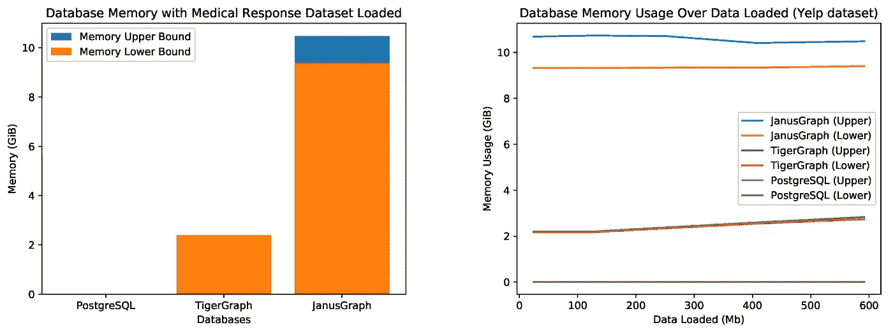

# 图形数据库技术在时空数据分析中的适用性

> 原文：<https://towardsdatascience.com/suitability-of-graph-database-technology-for-the-analysis-of-spatio-temporal-data-6167dba64be8?source=collection_archive---------39----------------------->

## 图形数据库 JanusGraph 和 TigerGraph 与行业标准 PostgreSQL 相比如何？

照片由[亨利·佩克斯](https://unsplash.com/@hjkp?utm_source=medium&utm_medium=referral)在 [Unsplash](https://unsplash.com?utm_source=medium&utm_medium=referral) 上拍摄

# 介绍

时空数据的收集在今天已经司空见惯，主要的例子是来自移动设备或社交平台的用户生成数据、来自静态或移动传感器的传感器数据流、卫星或遥感数据。为了理解这些海量的异构数据，必须应用各种聚合和融合步骤来实现语义数据丰富，以便随后在增值服务中使用。然而，实现这些丰富步骤通常依赖于稳定且高度可扩展的数据处理和存储基础设施。然而，随着时空数据量的不断增加，关系数据库技术(即使有时空数据的特殊对象关系扩展)也达到了极限，目前通常被称为“不仅是 SQL”(NoSQL)数据库的新范例被尝试作为更具可扩展性的替代，例如 MongoDB + GeoJSON 或 GeoMesa。

然而，尽管今天许多类别的数据被解释为图结构，但传统的关系数据库仍然缺乏有效地建模和操作这种结构的体系结构和高级查询语言。图形数据库被设计成将数据表示为顶点和边上的属性。它们通常是无模式的(即，没有固定的数据结构)，并且它们的属性被描述为简单的键值对。因此，图数据库的主要优势在于它们擅长复杂的连接式查询，而关系数据库对于大型表的效率是出了名的低。相比之下，当从局部子图转移到完整的图聚集查询时，图数据库往往表现不佳，而关系数据库技术在这方面发挥了它的优势。在商业 ML/AI 和自然语言处理的行列中，Gartner 将 graph analytics 确定为 2019 年 T4 十大数据分析趋势之一。

这项研究调查了哪种数据库技术最适合在真实环境下的典型数据操作任务中处理大规模时空数据。特别是，调查将涵盖开源图形数据库 **JanusGraph** (与 Cassandra 和 ElasticSearch)、开源对象关系数据库系统 **PostgreSQL** 和企业级图形分析平台 **TigerGraph** 的查询速度、可用查询语言的表达能力和计算需求。

我们的贡献可以总结如下:

*   将两个特征数据集建模并导入三个最先进的数据库，
*   使用各种分析对它们进行严格的基准测试，这些分析公平地代表了数据集通常会经历的查询和数据操作的类型，并且
*   通过调查 JanusGraph 和 TigerGraph 的特定图形查询语言实现来比较它们的适用性。

# 三个数据库

PostgreSQL 被选为**我们的控制数据库**,因为它在与 PostGIS 结合使用时具有业内公认的时空数据适用性。我们选择了两个具有**不同底层架构**的图形数据库，即 Java 和 C++，并比较了它们相对于我们的控制数据库以及相对于彼此的表现。尽管在数据库中有这种选择，但还有其他值得注意的提及，如 [GeoMesa](https://www.geomesa.org/) 和 [TerraLib](http://www.dpi.inpe.br/terralib5/wiki/doku.php) 被证明是时空数据分析的合适替代方法。

# 这两个数据集

为了进行公正和权威的评估，一方面，我们使用一个**真实世界数据集**进行基准测试。另一方面，我们使用提供更多控制的**模拟数据集**来测试所用数据库技术的限制。对于真实世界的数据，Yelp 是一个国际性的商业目录服务和评论论坛。“ [Yelp 数据集](https://www.yelp.com/dataset)”是 Yelp 的业务、评论和用户数据的当前子集，包括两个国家的 10 个大都市地区的时空数据，约有 200，000 家企业和 660 万条评论。它在一年一度的 Yelp 挑战赛中提供学术用途，用于各种数据分析和发现任务。

相比之下，瑞典于默奥大学的救护车响应模拟数据集提供了对场景的更多控制——给定一些医院资源，如调度中心和救护车，它模拟救护车如何响应紧急呼叫。数据集记录时空属性，例如响应生命周期内的时间间隔以及响应期间资源的来源和目的地。还记录了关于紧急事件本身的其他技术属性。总之，我们对两个数据集进行了评估，这两个数据集具有不同的时空属性表示、附加属性的复杂性以及总大小。

# 基准测试应用程序

为了进行基准测试，我们设计了一个名为 **Providentia** 的时空数据 web 应用程序。它用于对管道中的分析任务进行排队，在管道上运行每个基准，测量服务器性能，并显示累积的结果。在**图 1** 中说明了架构和每种技术如何通信。使用 [Docker](https://www.docker.com/) 将数据库容器化。

**图 1** 。普罗维登西亚的建筑

我们使用普通 Python 后端的第一个动机是让基准测试的分析设置更现实。另一个优点是可以使用 Flask 框架轻松快速地设计和部署简单的 REST API。Angular 被主观地选为前端框架，因为它允许快速的前端 web 开发。所有基准测试结果都存储在 PostgreSQL 的一个单独的数据库中。

不幸的是，JanusGraph 有一些特定于 Java 的特性，当使用 Python 中的嵌入式 Gremlin 时，这些特性增加了限制。当试图利用混合索引搜索谓词(如空间查询)时，局限性在于只能通过 Java 或其超集语言来实现。解决这个问题的方法是使用 Gremlin Translator，它将 Gremlin 查询作为一个字符串，并在服务器端对其进行解释。

你可以在 GitHub 库上查看 Providentia 的代码。

# 分析和设置

内核表示用于数据分析的某种用户故事，特别是以将应用于相应查询的一些时空约束为特征。这些内核中的每一个都将进行 30 次基准测试，因此在比较响应时间时可以考虑平均值和标准偏差。总共有 6 个内核，每个数据集运行 3 个内核。

所有实验都在**表 1** 中详述的两个设置上运行。使用这些设置可以考虑这些技术如何利用多个内核并在不同的存储限制下执行。每个数据库都是作为**单点** e 运行的

**表 1** 。用于测试数据库性能的两台机器的规格。设置 1 使用 AMD 锐龙 5 2600，而设置 2 是一个 AWS C5 . 4x 大型实例，采用英特尔至强白金 8000 系列 CPU。

# 结果和讨论

## 医疗响应数据集

在图 2 的**中，可以看到 JanusGraph 在响应时间方面远远优于其他两种数据库技术。这是关于医疗响应数据集的所有三个查询中的特征趋势。另一个趋势是 TigerGraph 和 PostgreSQL 在 TigerGraph 响应最快的地方表现接近。**

**图二。**使用医疗响应数据集为内核设置 1 和 2 的数据库响应时间:“优先级 1 表示响应时间”。误差线显示标准偏差。

与图 2 中的**性能相比，每个数据库似乎表现得更加一致(参见**图 3** )，偏差更小。JanusGraph 似乎在三个容器(JanusGraph、Cassandra 和 ElasticSearch)之间有某种一致的开销，这似乎会影响响应时间。**

**图 3。**使用医疗响应数据集为内核设置 1 和 2 的数据库响应时间:“转移患者的第二资源”。误差线显示标准偏差。

这只是一个时态查询，从图 4 中可以看出，TigerGraph 和 PostgreSQL 的性能比前两个查询更加相似。这表明 TigerGraph 比 PostgreSQL 在查询中因约束而增加的复杂性方面表现得更好。

**图 4。**使用医疗响应数据集为内核设置 1 和 2 的数据库响应时间(TigerGraph 和 PostgreSQL 低于 10ms):“长响应计数”。误差线显示标准偏差。

## Yelp 数据集

**图 5** 显示 PostgreSQL 的响应时间呈线性增长，而 JanusGraph 和 TigerGraph 对于不断增长的数据量保持水平。由于这个查询的复杂性，图形数据库优于关系数据库也就不足为奇了。TigerGraph 在查询响应时间方面优于 PostgreSQL 和 JanusGraph，并且表现出非常高的一致性，因为平均值周围几乎没有标准偏差。

**图 5。**内核设置 1 和设置 2 的不同百分比数据集的数据库响应时间:“Kate's Restaurant Recommendation”。误差线显示标准偏差。

**图 6** 显示，与其他两种数据库技术相比，JanusGraph 表现不佳，偏离平均值很高。PostgreSQL 对于这个内核是水平扩展的，这很可能是因为查询是三个内核中最简单的一个。尽管如此，TigerGraph 的表现超过了这两者。

**图六。**内核设置 1 和 2 的不同百分比数据集的数据库响应时间:“2018 年凤凰城趋势回顾”。误差线显示标准偏差。

**图 7** 显示了两种图形数据库技术都优于 PostgreSQL，因为 PostgreSQL 显示了线性增长，正如图 5 中的**所示。对于在 13%的数据集上的实验，JanusGraph 显示了围绕平均值的大量偏差。这可能是由于 JanusGraph 实现的所有移动部分及其多级缓存实现在这种规模的数据集上表现不佳。**

**图 7。**内核设置 1 和 2 的不同百分比数据集的数据库响应时间:“根据朋友的情绪对拉斯维加斯进行排名”。误差线显示标准偏差。

## 内存消耗

每个数据库的内存消耗(空闲时)在**图 8** 中进行了说明，并清楚地显示了 TigerGraph 和 JanusGraph 的图形数据库技术的高成本，分别使用大约 2 GiB 和 10 GiB。PostgreSQL 只使用大约 9 MiB，这比图形数据库要轻得多。

**图 8。**每个数据集的数据库内存使用情况。医疗响应数据集有 1.5 Mb 大。

用于 JanusGraph 的技术都运行在 JVM 上，并且在给定 32 GB 可用内存的情况下，允许 JVM 的垃圾收集器偶尔运行。JanusGraph 使用的大部分内存是 ElasticSearch、Cassandra 和 JanusGraph 的缓存，每个都存储一个独立的缓存。内存中的大部分波动来自 JanusGraph 容器，这从容器运行的那一刻起就发生了。这种缓存可能会受到配置的限制，但是我们的结果来自于一个无限制的缓存设置。

TigerGraph 和 PostgreSQL 的内存保持不变(因为它们的内存上限和下限在 MiB 差异范围内),因为这两个数据库的大部分是用 C 或 C++编写的，这需要手动管理内存。值得注意的是，虽然 JanusGraph 使用大量内存，但还有其他遵循 Apache TinkerPop 标准的图形数据库变体，它们声称在内存方面更有效，如 Neo4j 和 OrientDB。Neo4j 和 OrientDB 的内存消耗也是可配置的，但由于 JVM 的原因，可能仍然会使用多个 GiB 的内存。

美国宇航局在 [Unsplash](https://unsplash.com?utm_source=medium&utm_medium=referral) 拍摄的照片

# 结论

在本文中，我们分析和比较了三种数据库技术在处理互联时空数据方面的响应时间。比较的技术是两种开源数据库技术 PostgreSQL 和 JanusGraph，以及一种企业级技术 TigerGraph。结果清楚地显示了关系模型的线性增长，而图形数据库解决方案的水平扩展更大。这主要是因为在查询大量数据时，NoSQL 数据库的可伸缩性比传统的关系模型有所提高。通过采用一组时空查询来评估这三个系统，这些时空查询类似于在分析 Yelp 挑战数据集和救护车模拟数据集等数据集中的数据时在真实世界场景中会发现的那些时空查询。

特别地，我们的结果证明，对于时空数据，在我们实验中使用的所有内核中，图数据库技术都优于 PostgreSQL。这个结果部分是由于内核由于数据的互连性质而产生复杂的查询。与关系实现产生的多连接样式的查询相比，该数据集产生了密集的图形，图形数据库能够在其上执行有效的遍历。时空多维方面在所有数据库中都得到了很好的支持，这从具有这种性质的约束的查询的响应时间可以明显看出。

这是我与[布林克·范德梅尔韦](https://medium.com/u/48daa1d37199?source=post_page-----6167dba64be8--------------------------------)和沃尔夫·蒂洛·巴尔克合写的论文的一个更简洁的版本。在 [MDPI](https://www.mdpi.com/1999-5903/12/5/78) 可以免费找到完整的参考文献列表和数据库查询。

如果你有兴趣看我的其他作品，那就看看我的[个人页面](https://davidbakereffendi.github.io/)。同样，有网页可以找到更多关于我的合著者[布林克](http://www.cs.sun.ac.za/~abvdm/)和[沃尔夫-蒂洛](http://www.ifis.cs.tu-bs.de/staff/balke)的信息。

如果您需要工具来清理 Yelp 数据集或开始使用 TigerGraph 或 Neo4j 的 Yelp 数据集，请查看以下存储库:

*   数据清理和子集化: [yelp-normalization](https://github.com/DavidBakerEffendi/yelp-normalization)
*   TigerGraph 导入指南: [tigergraph-yelp](https://github.com/DavidBakerEffendi/tigergraph-yelp)
*   Neo4j 导入指南: [neo4j-yelp](https://github.com/DavidBakerEffendi/neo4j-yelp)