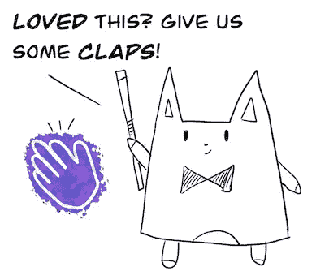

# 9 使用 LDA 和主题建模的冠状病毒研究趋势

> 原文：<https://towardsdatascience.com/summarising-the-latest-research-on-coronavirus-with-nlp-and-topic-modelling-28b867ad9860?source=collection_archive---------18----------------------->

## 受到所有公开的新冠肺炎印刷前研究的启发，我想应用一些数据科学技能，看看是否有任何趋势正在出现。有一些惊喜。

正如目前正在蔓延的冠状病毒疫情一样可怕，观察世界各地的学术和研究团体如何迅速开始了解这种病毒及其潜在影响是令人着迷的。

冠状病毒主题造型封面图片。作者插图

正因为如此，许多有趣的**预印本**学术论文迅速问世。我鼓励你**谨慎阅读预印本**，因为所做的声明**未经证实**，但我想看看这些论文讨论的主题和结论中是否有任何可辨别的模式。

因此，我根据来自[Elsevier Novel Coronavirus Information Center](https://www.elsevier.com/connect/coronavirus-information-center#research)的列表手动抓取了这些预印论文的结果和见解部分，并使用流行的 [Gensim 库](https://pypi.org/project/gensim/)使用潜在狄利克雷分配(LDA)做了一些主题建模。如果你想亲自尝试，我会在这篇文章的底部附上 GitHub 链接。

模型困惑和[主题一致性](https://rare-technologies.com/what-is-topic-coherence/)提供了一个方便的方法来判断一个给定的主题模型有多好。鸣谢:作者截图

在对 75 个预印件的样本大小训练多个 LDA 模型之后，32 个主题看起来是最佳的(可能 20 个主题是 ok ),一致性值为 0.54。然后，我选择了最突出和最令人兴奋的主题关键词集群，推断出中心观点，并为每个关键词找到最具代表性的文章。

**这篇文章绝不是科学评论**，而是我想分享的一个小实验。也许我们可以使用这样的工具更快地从多个来源识别模式，并促进合作。

结果。作者插图

# 9 个突出的冠状病毒课题及其最具代表性的论文

## 1.CT 扫描似乎有希望筛查新冠肺炎

**关键词:**肺炎，确认，证据，致死率，北京，焦点，大，预测，努力，传播

断层扫描。作者插图

尽管该病毒已被证明具有高度传染性，并可自发引起双肺感染，但临床证据显示，武汉病毒性肺炎的病死率较低。CT 成像在武汉病毒性肺炎的筛查、诊断、隔离方案、治疗、管理或预后中起着至关重要的作用。

**最具代表性论文:** [武汉病毒性肺炎的临床和影像学证据:一项大规模前瞻性队列研究](https://papers.ssrn.com/sol3/papers.cfm?abstract_id=3537088&utm_source=EC&utm_medium=Connect)

**带有主题的文档百分比:** 8%

## 2.利用人工智能筛查新冠肺炎患者

**关键词:**临床，诊断，显著，高度，特征，症状，目的，指标，嗜酸性粒细胞，入院

机器人。作者插图

使用人工智能技术来筛选患者的属性，如白细胞，嗜酸性粒细胞计数，嗜酸性粒细胞比率，2019 新型冠状病毒 RNA (2019n-CoV)和淀粉样蛋白-A。该团队开发了一种更快的方法来实现新冠肺炎诊断，提高了临床使用的确诊率。

**最具代表性论文:** [人工智能在新冠肺炎诊断预测中的应用](https://papers.ssrn.com/sol3/papers.cfm?abstract_id=3541119&utm_source=EC&utm_medium=Connect)

**具有主题的文档百分比:** 7%

## 3.各国尚未为 2019 年做好准备

**关键词:**预防，健康，能力，有效，应急，管理，加强，支持，准备，存在

地球仪。作者插图

各国在预防、发现和控制疫情的能力方面差异很大，这是因为全球卫生系统管理突发卫生事件的能力存在差异。我们需要加强全球准备，以遏制现有的疫情，包括正在进行的 2019-nCoV 国际传播。

**最具代表性的论文:** [根据 2019-nCoV 爆发回顾卫生安全能力——加强 IHR (2005)实施的机会](https://papers.ssrn.com/sol3/papers.cfm?abstract_id=3537089)

主题为的文档百分比为 7%

## 4.医务人员失眠、心理问题与新冠肺炎

**关键词:**心理，因素，发现，疾病，社交，隔离，员工，认同，抑郁，停留

医护人员失眠。作者插图

一项研究发现，在新冠肺炎疫情爆发期间，超过三分之一的医务人员患有失眠症。相关因素包括受教育程度、隔离环境、对新冠肺炎疫情的社会心理担忧和医生职业。考虑到不同的社会心理因素，需要对医务人员的失眠进行干预。

**最具代表性的论文:** [参与 2019 年新型冠状病毒疾病爆发的医务人员失眠及相关社会心理因素调查](https://papers.ssrn.com/sol3/papers.cfm?abstract_id=3542175&utm_source=EC&utm_medium=Connect)

**带有主题的文档百分比:** 7%

## 5.是否应该用强有力的预防措施来控制疫情？

**关键词:**衡量，预防，城市，强势，严格，个体，期望，维持，揭露，停止

孤立。作者插图

鼓励采取强有力的预防措施，直到冠状病毒疫情结束。国内其他地方和海外已经确认感染者应该以中国为榜样，立即采取强有力的干预措施。早期强有力的预防措施可以有效地阻止全球其他城市独立、自我持续的疫情爆发。

**最具代表性的论文:** [通过 EIR 模型模拟不同政策下 2019-nCov 的感染人群和传播趋势](https://papers.ssrn.com/sol3/papers.cfm?abstract_id=3537083)

**具有主题的文档百分比:** 7%

## 6.新的新冠肺炎快速基因诊断测试被发现

**关键词:**检测、pcr、样本、rt、lamp、诊断、反向、核酸、拭子、筛查

看核苷酸。作者插图

定量逆转录 PCR (qRT-PCR)是目前新冠肺炎检测的标准；然而，逆转录环介导等温扩增(RT-LAMP)可能允许在风险点进行更快、更便宜的现场检测。这项研究的目的是开发一种可以在 30 分钟内完成的快速筛查诊断测试。

**最具代表性的论文:** [逆转录-环介导等温扩增快速检测新型冠状病毒(covid 19)](https://papers.ssrn.com/sol3/papers.cfm?abstract_id=3539654&utm_source=EC&utm_medium=Connect)

主题为的文档百分比:5%

## 7.快速区分新冠肺炎病毒和其他感染

**关键词:**低，病人，酸，发热，肺，混浊，地面，过程，特征，图像

伪装的冠状病毒。作者插图

很少有人知道发热门诊中新冠肺炎和核酸阴性患者的不同临床特征。在肌肉疼痛的患者中观察到 2019-nCoV 感染的核酸检出率最高，其次是呼吸困难。发热、嗜酸性粒细胞减少和双侧肺毛玻璃样阴影的成像特征的结合可能是 2019-nCoV 感染的一个有价值的指标。

**最具代表性的论文:**[2019 年门诊患者 nCoV 感染及临床表现分析:来自中国武汉发热门诊的流行病学研究](https://papers.ssrn.com/sol3/papers.cfm?abstract_id=3542153&utm_source=EC&utm_medium=Connect)

**具有主题的文档百分比:** 5%

## 8.谁最有可能感染新冠肺炎病毒？

**关键词:**病人，症状，系统，政府，人民，年龄，人，显著，改善，肾

确定谁处于危险中。作者插图

调查证实，人群的传染性没有明显的年龄限制，但老年人仍然是弱势群体。糖尿病患者更有可能发展成重症患者，入住 ICU 的概率也显著增加。

**最具代表性论文:** [中国重庆地区 197 例感染 2019 新型冠状病毒患者的流行病学和临床特征:单中心描述性研究](https://papers.ssrn.com/sol3/papers.cfm?abstract_id=3539687&utm_source=EC&utm_medium=Connect)

**具有主题的文档百分比:** 4%

## 9.重度新冠肺炎的治疗

**关键词:**重症，呼吸系统，治疗，急性，方法，综合征，相似，级别，起源，发生

国际电联。作者插图

新冠肺炎感染导致严重的呼吸系统疾病，类似于严重急性呼吸综合征冠状病毒，并与 ICU 入院和高死亡率有关。我们对该病的起源、流行病学、治疗方法等方面进行了研究，根据武汉协和医院制定的治疗方案，经国家卫生部认证，希望能制定出有效的治疗方法，降低该病的死亡率。

**最具代表性论文:** [中国石首新冠肺炎感染者的临床特征及治疗](https://papers.ssrn.com/sol3/papers.cfm?abstract_id=3541147&utm_source=EC&utm_medium=Connect)

主题为的文档百分比为 4%

# 结论

我喜欢这个周末项目——这是我第一次尝试将一些 NLP 技巧应用到一个问题上。我知道有人会发现我的方法有问题(请联系我)，但这个想法很有趣。我想这就像是另一种形式的总结，我玩得越多，我就越思考医学和学术研究的可能性。

文字，文字无处不在。作者插图

也许是某种葡萄酒社交，我们根据聚集的主题关键词邀请学术作者，并根据主题交叉百分比进行某种人员匹配。我最好就此打住，免得我再免费给出任何奇思妙想。欢迎反馈！

**完整免责声明:**我是爱思唯尔的产品经理。这篇博客文章和分析是作者自己的创作，不代表爱思唯尔的想法和观点。

# GitHub 回购

使用 python 脚本的 GitHub Repo 输入数据和输出:[https://GitHub . com/raudashl/coronvavirus _ preprint _ research _ NLP](https://github.com/Raudaschl/coronvavirus_preprint_research_nlp)

# 想要更多吗？

上述文章的 5 月更新版

 [## 使用 NLP 的冠状病毒研究主题:2020 年 5 月

### 当你意识到在如此短的时间内发生了如此多的学术工作时，这是令人难以置信的。在这里，我潜入一些 LDA…

towardsdatascience.com](/top-coronavirus-research-topics-using-nlp-may-2020-b4166289b728) 

如果你喜欢这篇文章，一定要看看我在 2020 年 2 月初制作的关于冠状病毒的漫画。

 [## 冠状病毒爆发至今，为什么它如此令人担忧[漫画]

### 冠状病毒爆发在过去几周占据了头条。我越来越担心…

medium.co](https://medium.com/@raudaschl_32859/the-coronavirus-outbreak-so-far-and-why-its-so-concerning-comic-cd83d445f105) 

# 文献学

*   上面列出的所有预印本都是我在 2020 年 3 月 1 日从[爱思唯尔新型冠状病毒信息中心](https://www.elsevier.com/connect/coronavirus-information-center)收集的，我又从 [SSRN](https://www.ssrn.com/index.cfm/en/) 下载的。
*   冠状病毒:最新信息和建议。gov . uk .[https://www . gov . uk/guidance/Wuhan-novel-coronavirus-information-for-public](https://www.gov.uk/guidance/wuhan-novel-coronavirus-information-for-the-public)2020 出版。2020 年 2 月 2 日接入。