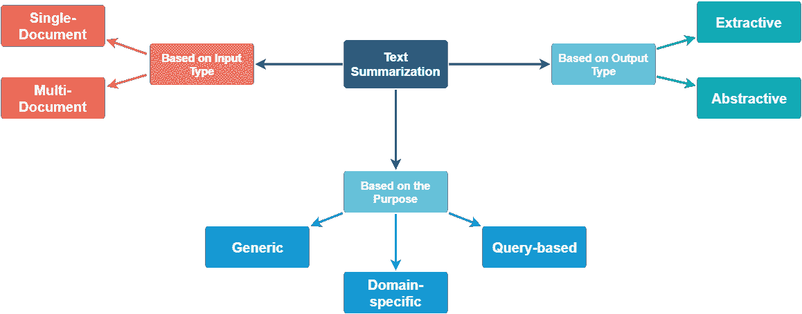
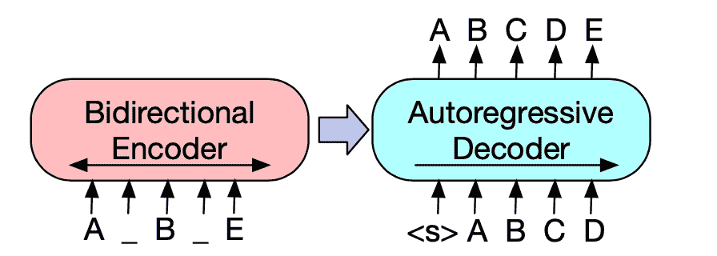
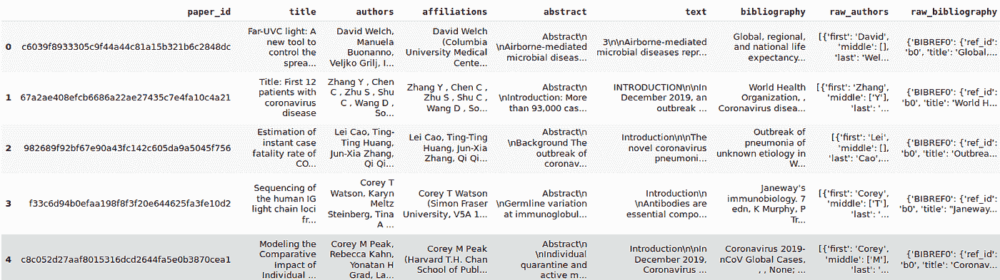

# 基于 BART 模型的 COVID 研究论文综述

> 原文：<https://towardsdatascience.com/summarization-of-covid-research-papers-using-bart-model-5b109a6669a6?source=collection_archive---------19----------------------->

## *用数据做酷事！*


[免费股票照片](https://unsplash.com/photos/U_Ff4ohzLSw)

# 介绍

与艾伦·艾、白宫和其他几个机构合作，Kaggle 已经开源了[新冠肺炎开放研究数据集(CORD-19)](https://www.kaggle.com/allen-institute-for-ai/CORD-19-research-challenge) 。CORD-19 是超过 52，000 篇学术文章的资源，包括超过 41，000 篇关于新冠肺炎、新型冠状病毒和相关冠状病毒的全文。这个免费提供的数据集提供给全球研究界，以应用自然语言处理和其他人工智能技术的最新进展，产生新的见解，支持正在进行的抗击这种传染病的斗争。由于新型冠状病毒文献的快速增长，使得医学研究界难以跟上，因此对这些方法的需求越来越迫切。

在[深度学习分析](https://deeplearninganalytics.org/)，我们一直在花时间，在这个数据集上尝试不同的 NLP 技术。在这篇博客中，我们展示了如何使用基于前沿变压器的摘要模型来总结与新冠肺炎相关的研究论文。这对于快速浏览研究论文或其部分内容非常有用，可以帮助你决定是否要完整阅读。请注意，我不是健康专家，本文的观点不应被解释为专业建议。

我们非常热衷于使用数据科学和机器学习来解决问题。如果您是一家医疗服务公司，并且正在寻找数据科学帮助来应对这场危机，请通过此处的[联系我们](https://deeplearninganalytics.org/contact-us/)。原文全文发表在[我们的网站这里。](https://deeplearninganalytics.org/summarization-of-covid-research-papers-using-bart-model/)

## **什么是总结？**

根据维基百科，**摘要**是通过计算缩短一组数据的过程，以创建代表原始内容中最重要或最相关信息的子集[摘要](https://en.wikipedia.org/wiki/Abstract_(summary))。摘要可以应用于多种数据类型，如文本、图像或视频。摘要已经被用于许多实际应用——摘要文章、摘要同一主题的多个文档、摘要视频内容以生成体育比赛中的精彩场面等。

具体来说，文本摘要非常有用，因为它使用户不必阅读长篇文章、博客或其他文本。可以有不同类型的总结，如下图所示，这是从这个[博客](https://medium.com/jatana/unsupervised-text-summarization-using-sentence-embeddings-adb15ce83db1)借用的。



摘要的类型(来源:https://medium . com/jatana/unsupervised-text-summary-using-sentence-embedding-ADB 15 ce 83 db 1)

有多种类型的总结——基于输入类型，基于期望的输出或目的。摘要的输入可以是单个或多个文档。多文档摘要是一个更具挑战性的任务，但最近有一些有前途的研究。

总结任务可以是抽象的，也可以是提取的。摘要通过选择现有文本的子集来创建摘要。摘要类似于高亮显示。抽象概括包括理解文本和重写文本。你也可以在我的博客[这里](/text-summarization-using-deep-learning-6e379ed2e89c)阅读更多关于总结的内容。

## **使用变形金刚的新闻摘要**

我们将利用 [huggingface 的变形金刚库](https://github.com/huggingface/transformers)对科学文章进行总结。这个库实现了不同的算法。

在这篇博客中，我们将使用 BART 算法。 [BART](https://arxiv.org/abs/1910.13461) 是一款去噪自动编码器，用于预处理序列间模型。正如他们在[论文](https://arxiv.org/abs/1910.13461)中所描述的，BART 是通过(1)用任意噪声函数破坏文本，以及(2)学习一个模型来重建原始文本来训练的。因此，BART 在抽象对话、问题回答和总结等多项任务上表现出色。具体来说，对于总结，增益高达 6 胭脂分数。



BART 架构(来源:[https://sshleifer . github . io/blog _ v2/jupyter/2020/03/12/BART . html](https://sshleifer.github.io/blog_v2/jupyter/2020/03/12/bart.html))

让我们测试一下 Huggingface 支持的 BART transformer 模型。该模型在 CNN/Daily Mail 数据集上进行训练，该数据集是用于摘要工作的标准数据集。数据集由新闻文章和人类撰写的摘要组成。在我们在研究论文上运行这个模型之前，让我们在一篇新闻文章上运行这个模型。以下代码片段可用于生成新闻文章的摘要

```
from transformers import pipelinesummarizer = pipeline(“summarization”)
```


测试摘要的新闻文章—来自[https://hugging face . co/transformers/usage . html #摘要的示例](https://huggingface.co/transformers/usage.html#summarization)

```
print(summarizer(ARTICLE, max_length=130, min_length=30))
```

运行 summary 命令会生成如下摘要。

*莉安娜·巴里恩托斯已经结了 10 次婚，有时是在两个星期之内。检察官称这些婚姻是移民骗局的一部分。周五，她在布朗克斯的州最高法院表示无罪。*

在我看来，这是一篇非常好的新闻摘要。可以调整 max_length 参数以获得更长的摘要。

## 新冠肺炎研究论文综述

全球许多科学家和研究人员正致力于更多地了解该病毒，以开发有效的治疗方法，包括疫苗或药物，以降低攻击的严重程度。我们关于这个话题的知识不断增加。如果人工智能能够第一次通读研究并提供良好的总结，它可以帮助人类有效地优先考虑他们的时间。然而，总结往往是一项困难且主观的任务。要真正总结人工智能需要理解的内容，这是很困难的，因为研究人员的写作风格差异很大。在这篇博客中，我们评估了 BART Transformer 模型在总结新冠肺炎论文内容方面的表现。

为了获得 CORD-19 研究论文的清晰数据集，我们将在这里使用来自[的 dataframe biorxiv_clean.csv。非常感谢 xhulu 在 Kaggle 上创造了这个。](https://www.kaggle.com/xhlulu/cord-19-eda-parse-json-and-generate-clean-csv)

让我们开始总结研究论文吧！

```
## Read the data frame
import pandas as pd
data = pd.read_csv('biorxiv_clean.csv')
```

一旦我们读取了数据帧，数据看起来就像这样:



清洁新冠肺炎开放研究数据集

我们的主要栏目有论文 id、标题、摘要、作者、正文、参考书目等。

然后，我们将遍历数据帧并生成摘要。正如我们所看到的,“文本”列在数据帧中有科学文本。

```
from transformers import pipelinesummarizer = pipeline(“summarization”)for i, text in enumerate(data): print(summarizer(data[‘text’].iloc[i], max_length=1000,   min_length=30))
```

您可以试验最小和最大长度参数。我们选择上述值，因为它提供了最佳结果。

## 新冠肺炎研究总结结果

这些总结的一些例子是:

**正文:**

[https://www.mdpi.com/2076-0817/9/2/107](https://www.mdpi.com/2076-0817/9/2/107)

**BART 变压器生成的汇总:**

*类圆线虫病是一种流行于热带和亚热带地区的蠕虫感染。然而，流动人口的患病率数据很少。这项研究评估了在西班牙六家医院就诊的人群中这种感染的患病率。流行率约为 9%，非洲和拉丁美洲高于其他地区。此外，免疫系统受损患者的患病率低于未遭受免疫抑制的患者。*

**正文:**

【https://www.biorxiv.org/content/10.1101/2020.02.22.961268v1 

**BART 变压器生成的汇总:**

*转录聚合酶链式反应(RT-PCR)是用于分析和定量各种致病 RNA 的标准和常规使用的技术。新冠肺炎疫情爆发后，报道了几种检测新型冠状病毒基因组 RNA 的方法和试剂盒。传统方法耗费大量操作人员，但诊断效率低，交叉感染风险高。基于磁性纳米粒子(MNPs)的提取方法无需离心机，已被证明易于操作且与自动化兼容。*

**观察:**

总体而言，我认为基于 CNN/Daily Mail 数据训练的 BART 模型表现不一。它确实提供了事实上正确的连贯摘要，但如果将该摘要与论文摘要进行比较，我们会发现一些差距:

*   它可能会遗漏一些关键方法或其他相关元数据，而研究人员可能希望将其作为摘要的一部分。
*   摘要往往比论文的摘要更短，结论也更弱
*   BART 模型中使用的嵌入是在常规英语词汇上训练的，可能不能正确理解这里的科学术语

为了应对这些挑战，最好的方法是对从上述数据框架中提取的文本和摘要的 BART 模型进行微调。我们已经开始这样做了，但是由于训练一个好的摘要模型需要大量的计算，所以我们无法继续向前。

# 结论

在这篇文章中，我们看到预训练的 BART 模型可以用来从新冠肺炎研究论文中提取摘要。由于科学术语和不同研究者不同的写作风格，研究论文摘要是一项困难的任务。BART 模型在生成论文摘要方面做得相当好。然而，它的局限性在于它可能无法涵盖所有的要点。