# 超级学习者对深度神经网络

> 原文：<https://towardsdatascience.com/super-learner-versus-deep-neural-network-aa78547aabd7?source=collection_archive---------27----------------------->

> “我从来没有输过。我要么赢，要么学”——纳尔逊·曼德拉

来源:https://linkites.com/

# **简介**

深度学习在涉及预测建模和模式识别的任务中占据了突出的位置。深度学习通过其自动特征提取和前馈方法提供了提取低级特征的信心，以便在大数据应用中识别高级身份。然而，深度神经网络有缺点，包括许多超参数一起调整，在较小的数据集中收敛缓慢，以及解释为什么做出特定决定的问题。虽然传统的机器学习算法可以解决这些缺点，但它们通常无法达到深度神经网络所记录的性能水平。为了提高性能，集成方法用于组合多个基础学习器。

在这篇文章中，我们将探索超级学习者是否可以通过使用特定于任务的调整来提供比深度神经网络更高的性能。

# **目标**

我将使用传统算法的组合，对照 ***深度神经网络*** 的多个参数，检查 ***深度超级学习器*** 的性能。我使用了*银行营销数据*来比较我的模型，使用的评分机制有 ***混淆矩阵、精确度和召回率、F1 分数、ROC-AUC 分数。***

模型比较指标

# 深度神经网络综述

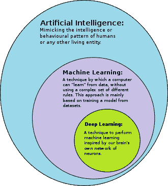

上图描绘了深度学习如何成为机器学习的子集，以及机器学习如何成为人工智能(AI)的子集，来源[维基百科](https://en.wikipedia.org/wiki/Deep_learning)

深度学习是人工智能中机器学习的一个子领域，深度神经网络是深度学习的基础。他们处理受大脑生物结构和功能启发的算法，以帮助机器拥有类似人类的智能。

一个简单的前馈神经网络，完全连接的神经元模仿大脑中的神经元。这些神经元根据收到的输入向其他神经元传递消息或信号，并形成一个复杂的网络，通过某种反馈机制进行学习。

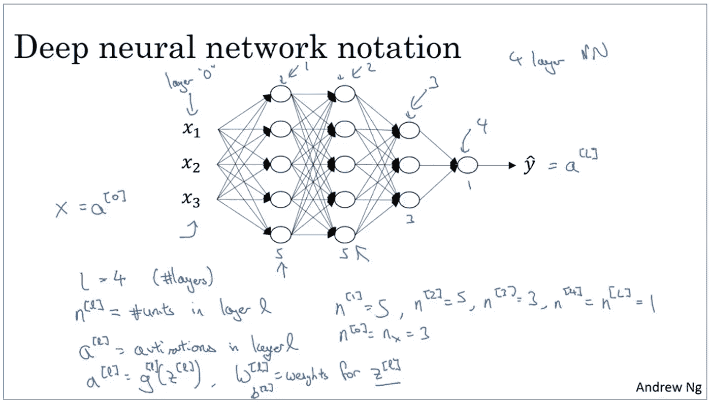

多层网络中的每个神经元从输入中提取一个特定的特征，并学习从中唯一地识别项目，使其具有像人类一样的学习能力。

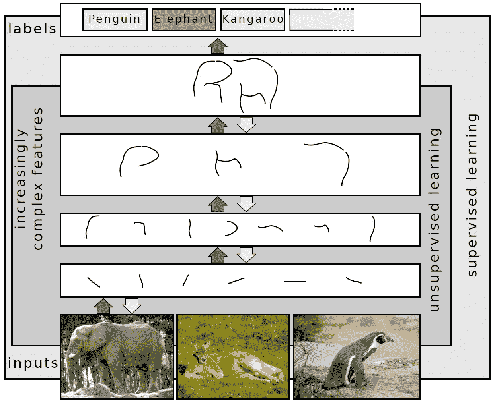

维基百科页面显示了如何在深度学习的多个抽象层上表示图像

我将使用简化构建神经网络的 [*Keras*](https://keras.io/) 库。下面的代码创建了一个顺序模型，指定我们添加的每一层的输出都是下一层的输入，依此类推。

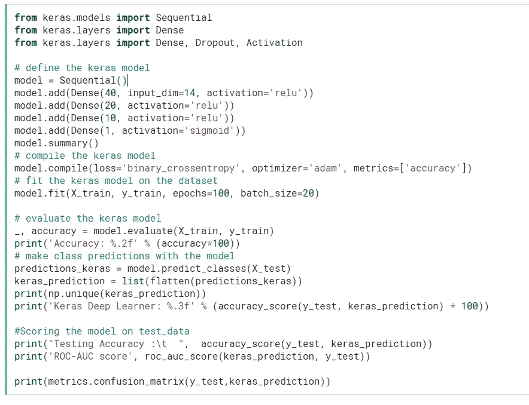

我用“relu”作为 2 个隐藏层的激活，用“sigmoid”作为输出层的激活。每一层都有不同的输入维度/神经元集，顺序为 40–20–10–1。

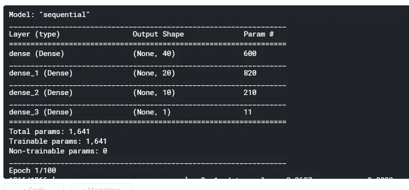

# **什么是超级学习者？**

正如我们在上面看到的，深度神经网络是一种强大的深度学习架构，它使用多层处理单元来学习前一层的输入并将其前馈，这使其能够识别更高级别的特征并简化实体/身份检测。然而，深度神经网络有缺点，包括许多超参数和无限架构，结果不透明，以及在较小的数据集上收敛相对较慢。

[**超级学习**](https://arxiv.org/abs/1803.02323) **，**通过将多个传统的机器学习算法堆叠成一个集合来解决这个问题，该集合可以找到不同学习算法的最佳组合。这是一种技术，我们将您可能调查的所有模型和配置组合起来，用于预测建模问题，并使用它们做出与您可能调查的任何单个模型一样好或更好的预测。

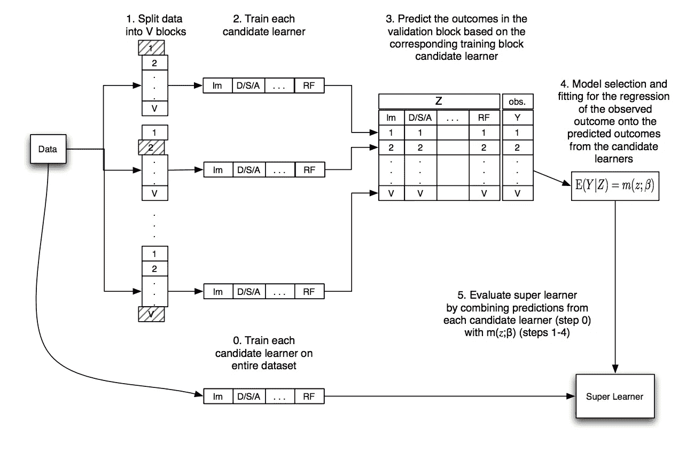

显示从“[超级学习者](https://arxiv.org/abs/1803.02323)”获取的超级学习者算法
的数据流的图表

如上所述，超级学习器将是堆叠或 k-fold 交叉验证的变体，其中各个模型将在 k-fold 数据分割上被训练，然后最终元模型将在其输出上被训练，也称为来自每个模型的非折叠预测。

现在让我来展示一下超级学习者的表现是如何与它所涉及的任何单一模型一样好甚至更好的。

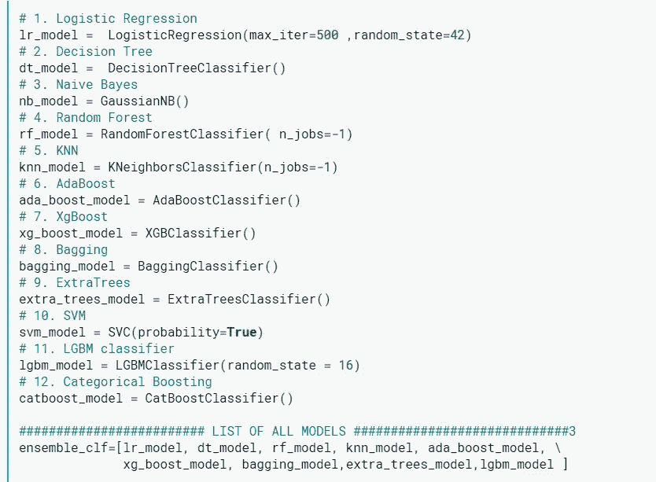

我选择了不同的基础学习者进行预测分析

这里我们可以看到基于准确性和 ROC-AUC 曲线的单个模型的性能

我将使用 [ML-Ensemble](http://ml-ensemble.com/) 库来训练超级学习者，它提供了一个模块化的、灵活的、高效内存的高性能集成学习者。关于超级学习者实现的深度可以在[这里](https://machinelearningmastery.com/super-learner-ensemble-in-python/)找到。

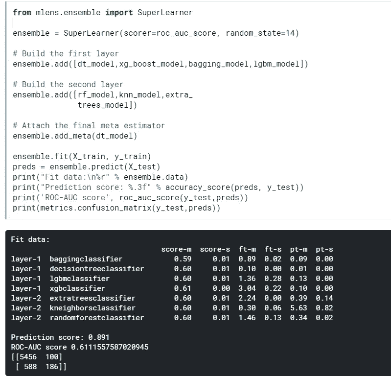

超级学习器的性能比使用任何一种传统的 ML 算法都更可靠。

# 用于比较的数据集

我在这里使用了 [UCI 的银行营销数据。该数据与一家葡萄牙银行机构的直接营销活动(电话)相关。通常，需要同一个客户进行多次联系，以便了解产品(银行定期存款)是否认购(“是”/1)或不认购(“否”/0)。](https://archive.ics.uci.edu/ml/datasets/Bank+Marketing)

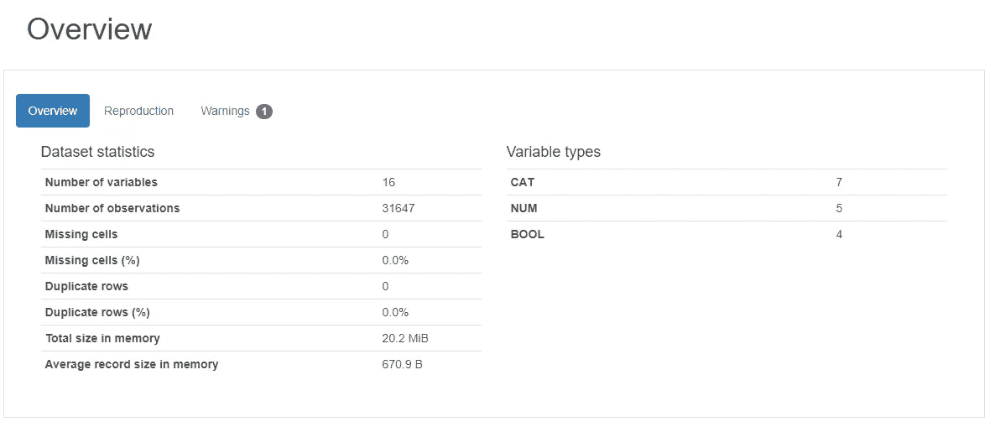

数据集的快速探索性数据分析

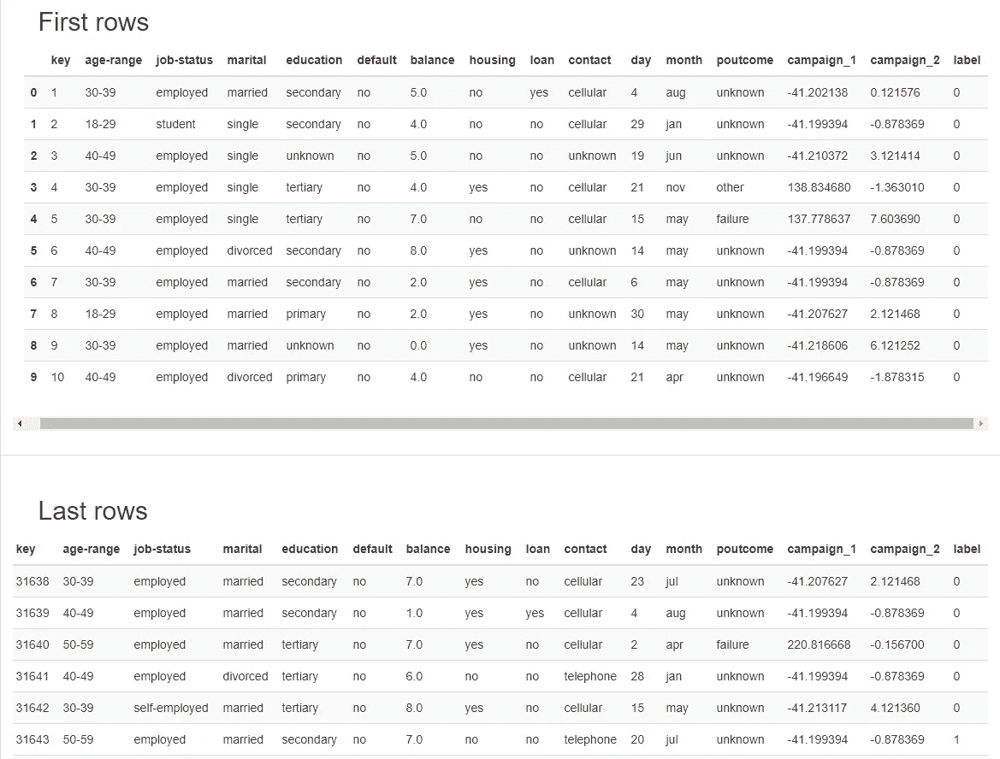

我们得到了 7 个分类特征，5 个数字特征和 4 个布尔特征。我已经使用标签编码器通过将分类值转换成数字形式来标准化数据。

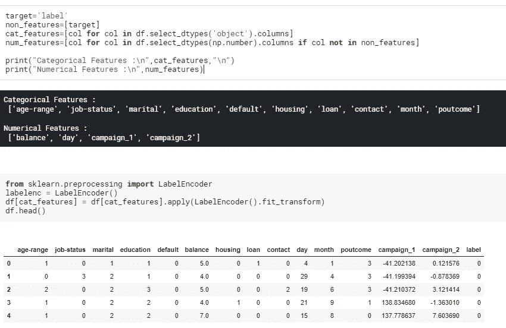

如下图所示，数据非常不平衡，因此我们需要在调整模型时实现类权重调整或数据采样技术。

# **6。DSL vs DNN 的正面碰撞**

让我们开始吧，为了比较哪种算法在我们的银行营销数据上表现最好，我将根据诸如*准确度、混淆度量、精确度、召回率、F-1 和 ROC-AUC 分数*等指标来比较性能。

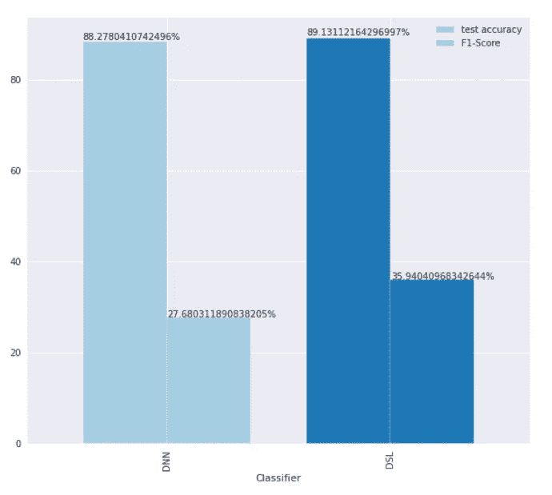

不准确性和 F1 分数深度超级学习者比深度神经网络略高

在不平衡数据集的情况下，准确性不能用作唯一的决策度量，因为根据这种数据训练的分类器可能会给你 98%准确性的惊人结果，但是当你进一步挖掘时，却发现 100 个样本中有 98 个样本属于正确分类的多数类，而属于少数类的 2 个样本被遗漏，使得分类器在实际情况下是多余的。因此，我将使用混淆度量和 ROC-AUC 分数来确保我们的分类器正确地对两个类别进行分类。

用于比较的混淆度量

尽管有高度不平衡的数据，两个分类器都表现得相对较好，没有偏向一个类别。然而，通过微调分类器和使用平衡数据，我们可以更好地改善上面看到的错误分类率。

精确召回曲线和 ROC 曲线的比较

与深度超级学习器相比，深度神经网络的精度-召回曲线似乎更平滑。然而，在迄今为止的分析中，深度超级学习者设法以微弱优势领先于深度神经网络。

我将使用数据集平衡做一个快速分析，看看深度神经网络是否能够弥合超级学习者所达到的差距。

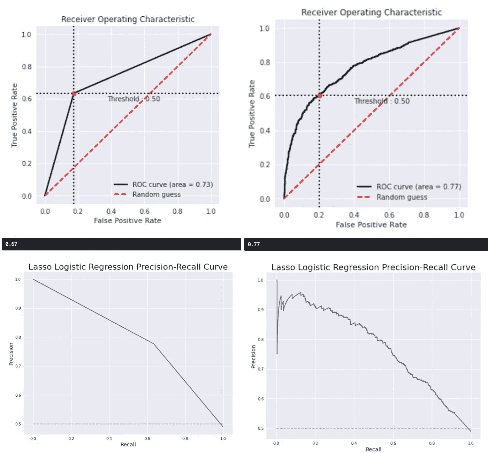

随着平衡训练数据的引入，错误分类率显著下降，提高了超级学习器和神经网络的准确性。然而，在上述任务的大多数评估指标中，深度超级学习器优于深度神经网络，下面的性能统计数据清楚地证明了这一点。

# **7。结论**

最终的结论是哪一个是最好的？

> 实际上，对于给定的预测问题和数据集，通常不可能事先知道学习者在哪个方面表现最好。——[*超级学习者*](https://www.degruyter.com/view/j/sagmb.2007.6.issue-1/sagmb.2007.6.1.1309/sagmb.2007.6.1.1309.xml) *，2007 年。*

上面的例子证明了深度学习不能作为所有问题的最佳解决方案。它对小数据的无效性加上无法解释所做的决定，使得传统的机器学习算法在某些用例中略占上风。

我们目前拥有的最佳答案是使用实证实验来测试和发现最适合您的数据集的方法。