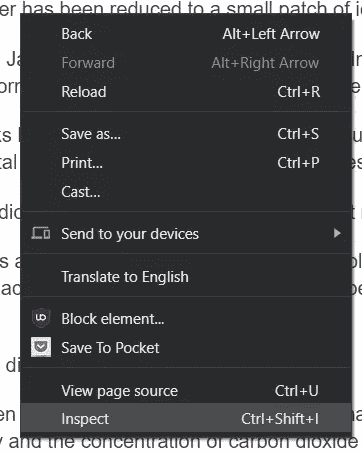
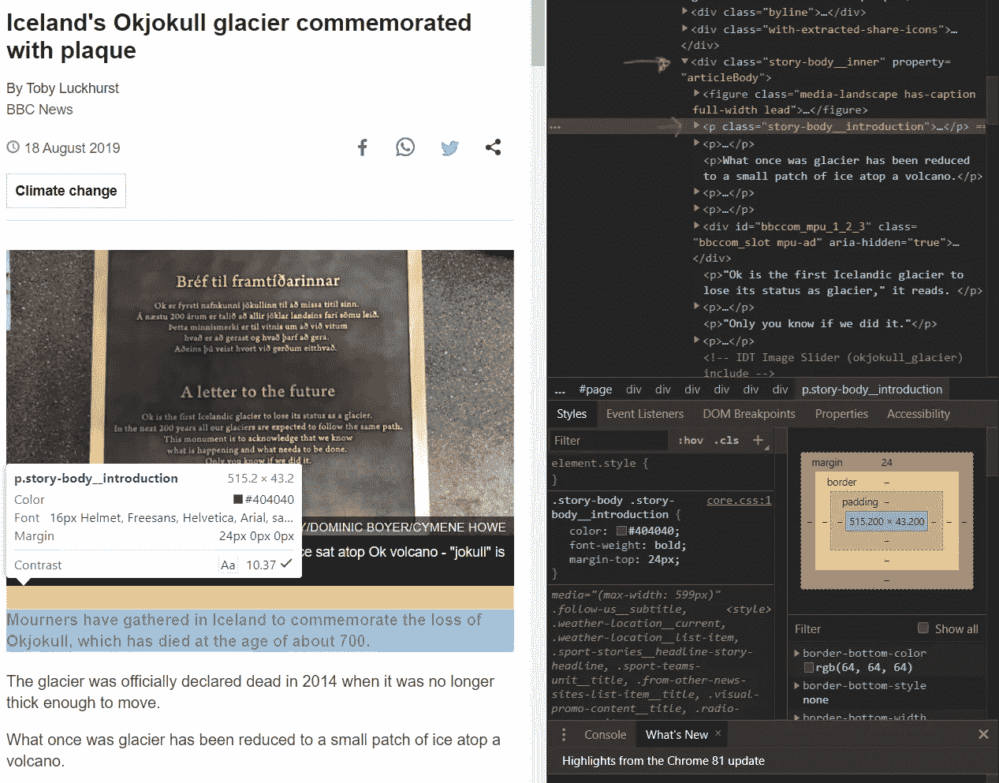
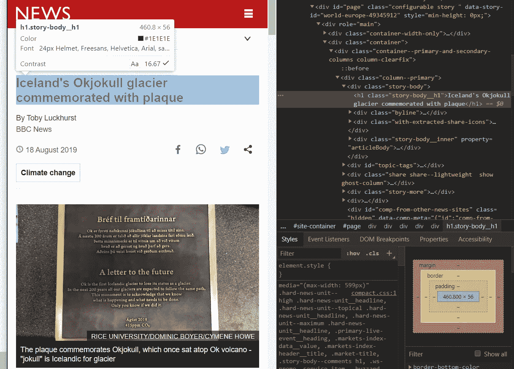
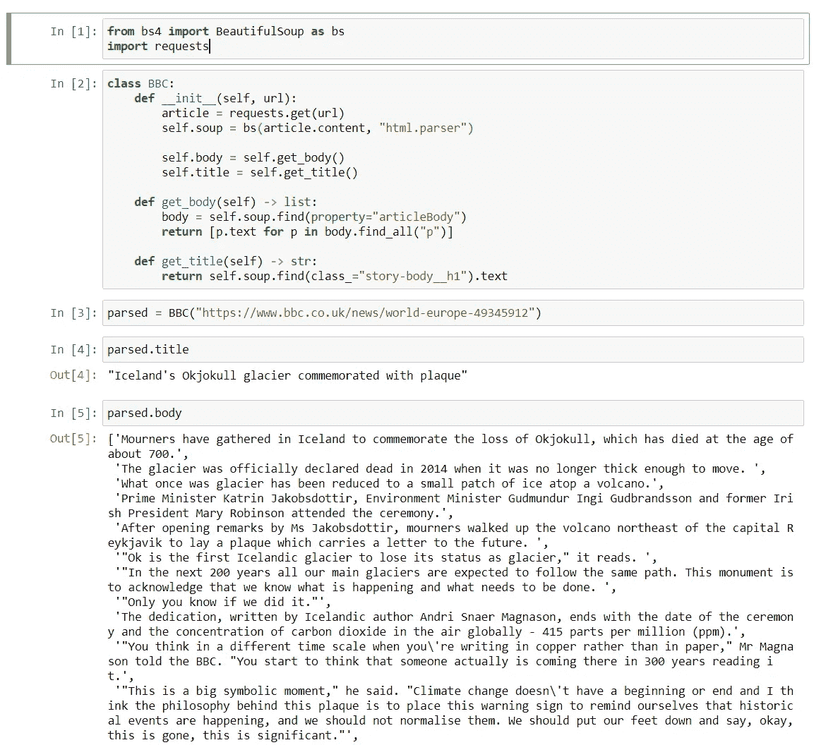

# 用 Python 抓取 BBC 新闻文章的超级简单方法

> 原文：<https://towardsdatascience.com/super-simple-way-to-scrape-bbc-news-articles-in-python-5fe1e6ee82d9?source=collection_archive---------17----------------------->

## *用最少代码抓取网站的简短教程*

# 嗨，我是彼得·🇮🇸

我在伦敦一家咨询公司担任数据科学家。这实际上意味着我为多家公司工作，从事不同的数据科学工作。

大多数情况下，我在云端构建机器学习解决方案。有时，通用数据解决方案、仪表盘或推荐数据科学最佳实践。不过，最近主要是 NLP 或计算机视觉。关于我已经说得够多了。

如果你对数据科学、机器学习或大数据感兴趣，那么你很有可能从一个网站上收集数据。

对于小型项目或概念验证(PoC ),手动完成就可以了。其他时候，这最好用代码来完成。这就是 Python 的闪光点，有很多开源库可以和各种网站交互。

知道如何使用任何刮库，是一个非常有用的技能。非常值得投资💰

> 秘密是很容易刮网站

我们将一起构建一个简单的 Python `class`来抓取 [BBC](https://www.bbc.co.uk/) 。

> Ps:如果你只是为了最后的代码而打开这篇文章，请随意跳到结尾，那里都是布局好的。


照片由 [Clément H](https://unsplash.com/@clemhlrdt?utm_source=unsplash&utm_medium=referral&utm_content=creditCopyText) 在 [Unsplash](https://unsplash.com/s/photos/coding?utm_source=unsplash&utm_medium=referral&utm_content=creditCopyText) 上拍摄

# 漂亮的组合和设置🍲🎣

[BeautifulSoup](https://www.crummy.com/software/BeautifulSoup/bs4/doc/) 是我最喜欢的浏览网站的方式。学起来简单，用起来方便。

此外，想象一下在网络抓取时从汤里捞出好的部分是很滑稽的。

首先，使用命令行将库安装到您的 [**环境**](https://realpython.com/python-virtual-environments-a-primer/) 中。作为一名数据科学家，我通常使用 [Anaconda](https://www.anaconda.com/) 。

我们还需要`requests` 模块从 BBC 获取 HTML 代码。在您的终端中运行这些:

```
conda install beautifulsoup4 requests -y
```

如果你愿意，你也可以使用`pip`。

```
pip install beautifulsoup4 requests
```

安装完成后，创建一个 python 文件(。py)并在代码顶部导入库。

我推荐使用 [PyCharm](https://www.jetbrains.com/pycharm/) ，但是如果你刚刚开始，Jupyter 笔记本是一个很好的尝试方式。

```
import requests
from bs4 import BeautifulSoup as bs
```

我们最关心的是两个`find` 函数。它们允许我们在汤里找到任何 HTML 元素，只需要指定它的名字。

```
**find**(element_tag, attribute) *#return first matching item***find_all**(element_tag, attribute) *#return list of matching items*
```

> 始终使用 python 环境来管理您的项目

## 示例文章

让我们挑选一篇 BBC 的文章。我选择了一个冰岛纪念其第一座冰川因气候变化而消失的地方。

通过 Python 访问原始文章:

```
url = '[https://www.bbc.co.uk/news/world-europe-49345912](https://www.bbc.co.uk/news/world-europe-49345912)'
article = requests.get(url)
```

然后将文章内容传递给 BeautifulSoup 并指定 HTML 解析器。

```
soup = bs(article.content, 'html.parser')
```

就这么简单，汤就做好了！让我们找出好的部分🎣

下一步是手动检查页面的 HTML 以找到我们感兴趣的元素。我用的是 Chrome，但是你可以用任何浏览器。

## 使用浏览器定位元素

在浏览器中打开网页，右键单击并“检查”。



*作者图片*

将鼠标悬停在任何文本上，浏览器会告诉您该段落在哪个 div 中。

*如果不起作用，按*`***Ctrl+ Shift+ C***`**或* `***CMD + shift + C***` *再试一次。**

*在这种情况下，“**story-body _ _ introduction**”包含突出显示的段落。*

*具有属性" **articleBody"** 的 div 类" **story-body__inner** "包含了整篇文章，这就是我们所追求的。*

**

**作者图片**

*在汤里找到尸体:*

```
*body = soup.find(property='articleBody')*
```

*这为我们提供了原始 HTML 格式的段落(p)的内容。*

*访问每个段落的文本，并使用列表理解将其分配到一个新列表:*

```
*text = [p.text for p in body.find_all('p')*
```

*我们可以将上述内容组合在一个函数中，该函数接受 BBC 文章的 URL:*

## *访问其他区域*

*如果我们想要访问标题，我们再次检查站点，找到标题所在的 div，然后把它从混乱中捞出来。*

**

**作者图片**

*代码看起来是这样的:*

*更有经验的编码人员可能已经发现了这些函数的问题…*

*它们在很大程度上是相同的。那不是很[干](https://en.wikipedia.org/wiki/Don%27t_repeat_yourself)嘛。*

*一种方法是将它们重构为 3 个函数，并将`get_soup`放在自己的函数中。*

*然而，这意味着如果我们想访问标题和正文，我们必须下载 BBC 文章两次！*

*这感觉反而应该是一门课。*

*另外，类看起来更专业，而不是在函数中调用函数。当刮刀变得越来越复杂时，它们也使维护变得更容易。*

*作为伟大的程序员，让我们把它变成一个类！*

# *重构为一个类🚀*

*从定义类开始。*

*每个类都应该有一个`__init__` 函数，你可以传递任何变量来初始化函数。*

*当您调用该类时，会自动调用`__init__`函数。*

*类中的每个函数还需要有`self` 作为第一个参数。这是那个特定类的实际实例。*

```
***class BBC:
    def __init__(self):
        pass***
```

*接下来，在`__init__`中添加 URL 作为参数，并把它变成一个汤。更改以粗体突出显示。*

```
*class BBC:
    def __init__(self, **url**):
        **article = requests.get(url)
        self.soup = bs(article.content, "html.parser")***
```

*将 soup 变量写成 self.soup 使它成为该类的一个属性。可以在类中的任何地方、任何函数中访问类属性。*

*为了访问文章的正文，我们使用前面的 body 函数。`body`现在也是这个类的一个属性*

```
*class BBC:
    def __init__(self, url):
        article = requests.get(url)
        self.soup = bs(article.content, "html.parser") **self.body = self.get_body()** **def get_body(self) -> list:
        body = self.soup.find(property="articleBody")
        return [p.text for p in body.find_all("p")]***
```

*同题:*

```
*class BBC:
    def __init__(self, url):
        article = requests.get(url)
        self.soup = bs(article.content, "html.parser") self.body = self.get_body()
 **self.title = self.get_title()** def get_body(self) -> list:
        body = self.soup.find(property="articleBody")
        return [p.text for p in body.find_all("p")] **def get_title(self) -> str:
        return self.soup.find(class_="story-body__h1").text***
```

*整个代码看起来像这样:*

# *摘要*

*暂时就这样了。下面是它的工作原理:*

**

**作者图片**

*在我的下一篇文章中，我将 NLP 应用于 BBC 文章，并构建一个 [Streamlit](https://www.streamlit.io/) 应用程序与之交互！*