# 超级星期二:多愁善感

> 原文：<https://towardsdatascience.com/super-tuesday-getting-sentimental-303a8ecc0212?source=collection_archive---------38----------------------->

## 缩小范围

在超级星期二之前的一周里，美国民主党总统初选的格局发生了很大变化。全世界的目光都在注视着我们走向谁将与唐纳德·特朗普总统对决的最终决定。这是一个拥挤的领域，但在过去的一周，它已经明显变得不那么拥挤了。情绪高涨；到目前为止，这是一个有争议的初选季节，许多候选人获得了热情的支持者，他们可能对党内其他人感到愤怒或失望。上周开始时，大约有 8 名候选人参加竞选(老实说，很难保持跟踪)，现在在超级星期二的另一边，看起来我们可能会剩下最后两名候选人。随着党内情绪的高涨，我决定看看候选人使用的语言，以及上周通过 Twitter 与他们互动的人使用的语言。

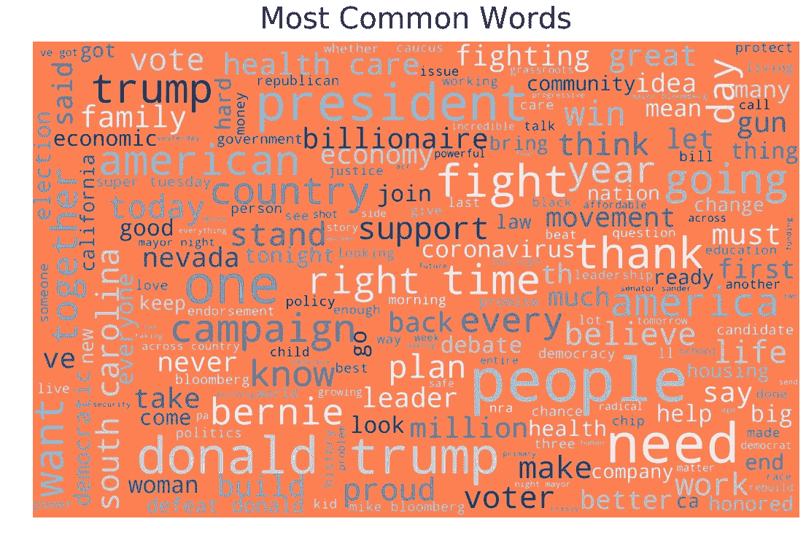

初选候选人上周使用的词汇(注意冠状病毒在中右蔓延😷)

## 分析概述

用于这一分析的数据从 2 月 24 日开始从 Twitter 上传到 3 月 3 日(超级星期二)。收集了满足以下要求的推文:

*   文本包含一名候选人的姓名
*   推特提到了其中一名候选人
*   其中一名候选人发送或转发了推文

这些推文存储在网络数据库(Neo4J)中，用 RegEx 和 NLTK (Python 的自然语言工具包)进行处理/清理，然后使用 Seaborn 和 Matplotlib 进行可视化。每条推文的情感都是用 VADER(效价感知词典情感推理器)计算的。总共查看了候选人的 753 条推文和大约 94，000 条关于候选人的推文。这些计数的细目如下所示。

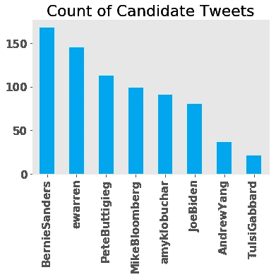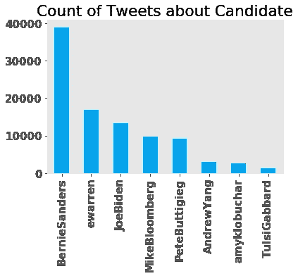

# 感情

情感可以被认为是文本情感内容的一种度量:数字越积极，情感越积极，数字越消极，情感越消极。VADER 用从-1 到 1 的范围来衡量情绪。在我处理 Twitter 文本的经验中，0 的情感不仅通常表示中性的价值(潜在的积极词汇和消极词汇一样多)，还表示客观的文本(没有相关情感的纯粹信息传递)。

## 候选人

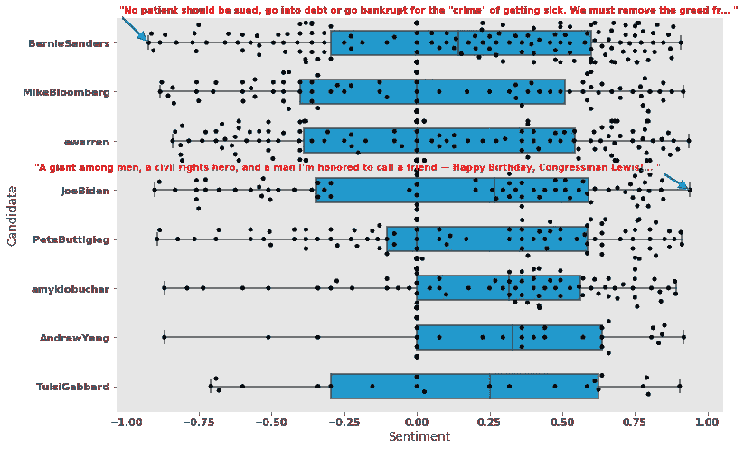

候选人推文的情绪统计摘要，也是 HBD 众议员 Lewis🎂！！

上面的可视化图描绘了候选人在 Twitter 上的用户名分组的每条推文的情绪。箱线图计算他们总体情绪的汇总统计数据，最外面的叉表示他们的极值(最低和最高)，内部突出显示的方框捕捉他们情绪的中间 50%的值。穿过突出显示的框的条标记中间值(在我们的例子中是中间值)。

值得注意的是，从这张图片中，我们可以了解候选人使用 Twitter 传播信息或获得支持的频率。根据他们发出的推文数量，作为超级星期二的竞争者留在比赛中的 4 名候选人名列榜首可能不是巧合。此外，我还注意到了两条观点最极端的推文(伯尼的推文最负面，拜登的最正面)。从这些推文中，我们看到情绪分析正在收集情绪化的词，如:破产、犯罪、债务、荣誉、朋友和快乐。

重要的是要认识到，消极和积极并不一定转化为悲伤/沮丧和快乐/激励。消极可以表示正义的愤怒，积极可以表示祝贺。当我们继续估算和聚合语言的情感内容时，这是一个需要记住的重要警告。

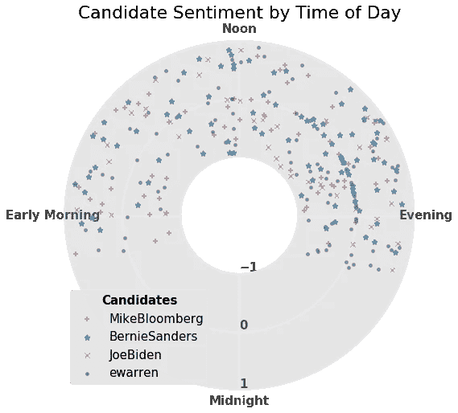

4 个超级星期二候选人的推特情绪。离中心越近的推文越负面，离中心越远的越正面。

从总体上看超级星期二的 4 个主要候选人的推文，我们可以感觉到他们什么时候最活跃(使用的时区是美国东部时间，每个象限代表一天中的 6 个小时)。此外，下午的中性推文群暗示了发布公告或发布更新的常见时间。

## 成分

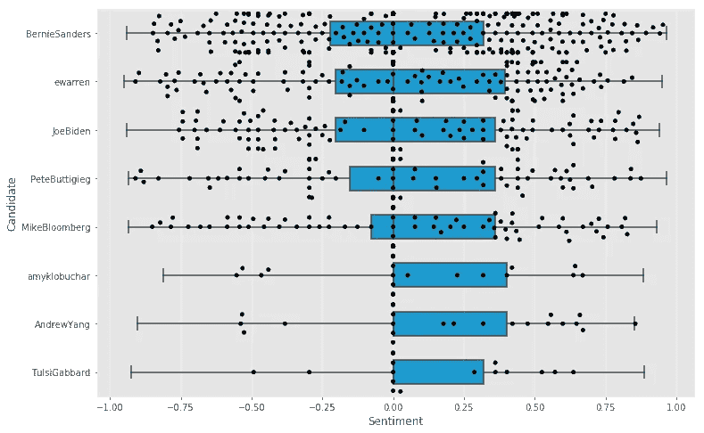

由于大量的推文，只有百分之一的推文被绘制成点，只有百分之十被用于方框图

如前所述，关于候选人的推文比候选人自己的推文多得多，上面我们来看看普通用户的推文样本。相对数量保持不变，似乎与少数例外情况相符。有趣的是，进步候选人似乎比温和派在 Twitter 上获得了更多的参与，这可能说明了在看待活跃在 Twitter 上的人时存在固有的偏见(即，人口统计数据可能比一般人群更倾向于自由派或年轻人)。特别是，伯尼在推特上被提及的次数远远超过了其他任何一位候选人(注意:他的推特数量与接下来三位候选人的总和相同)。

# 人民已经说话了

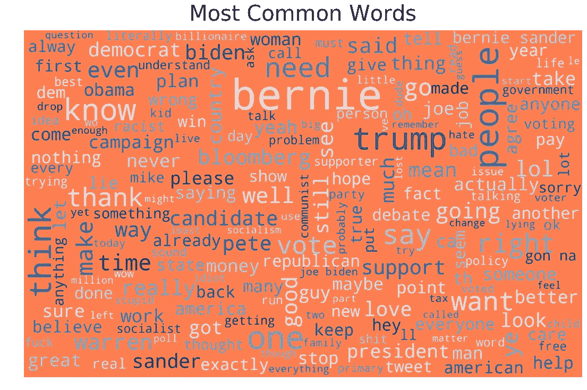

我们现在对这些推文中包含的一些情绪有所了解，但人们实际上在说什么呢？在选举中，我们的声音在投票中被听到，我们投给一个候选人而不是其他任何人。然后，我们的投票被汇总并分散到代表我们行事的代表的行为中(一般来说，不要@我)。在将我们的声音转化为选择候选人的行动的过程中，有相当多的步骤。但今天，我们可以直接看到数字化参与竞选过程的声音合唱。这个词云可视化了这些人在所有推文中的词频。单词越大，它在所有用户的词汇中就越普遍。它是围绕主节点发生的会话的聚合快照。

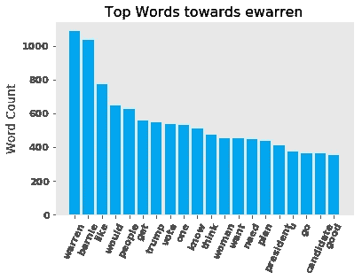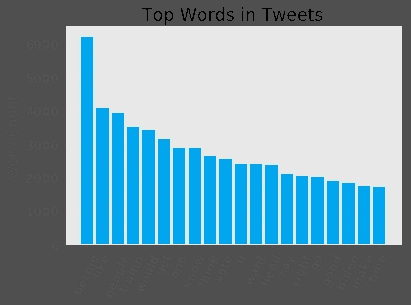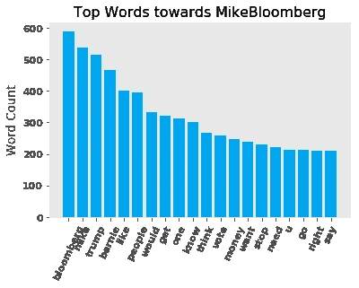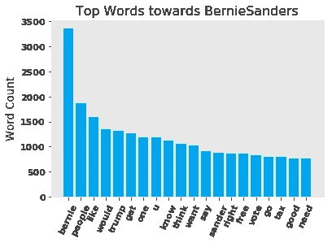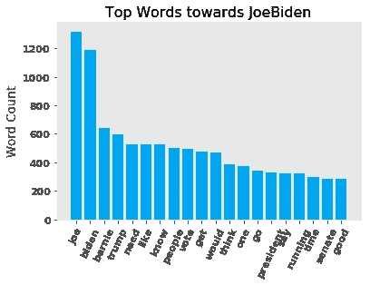

上面我们来看看超级星期二 4 个主要候选人最常使用的词，以及它们的总数(中上)。我把候选人的名字留在了分析中，而不是把他们作为停用词过滤掉，以了解一条推文引用另一条的频率。我们再一次看到伯尼似乎主宰了推特上的焦点。看着出现的一些词，我不得不指出,“男人”并没有出现在任何一个男性候选人的最常用词中，但“女人”却出现在竞选中唯一的主要女性候选人的最常用词中。这并不能证明潜在的厌女症或偏见，但我希望这是反思我们和媒体在整个过程中如何对待和报道每一位候选人的原因。

## 后续步骤

我希望这份初步分析能让你对超级星期二之前的日子有所了解。就收集到的数据而言，我们只是触及了全国性对话的表面，或者 Twitter 上的社区如何与候选人互动。接下来的步骤可能包括:

*   社区检测(根据用户与候选人的互动，哪些用户属于谁的阵营？既然候选人的范围已经缩小，这些用户是如何转移的？)
*   话题建模(Twitter 上发生了哪些离散的话题？这些在候选人中是如何分布的？)
*   异常检测(是否有用户以不真实的速率或方式进行操作？TW: 2016 俄罗斯[https://fivethirtyeight . com/features/what-you-found-in-300 万-russian-troll-tweets/](https://fivethirtyeight.com/features/what-you-found-in-3-million-russian-troll-tweets/)

欢迎建议和讨论！你可以在推特上找到我，但是我花在这个项目上的时间不会像 https://twitter.com/danjizquierdo[那样频繁](https://twitter.com/danjizquierdo)

# 资源

 [## danjisquierdo/感伤

### twitter 数据情感和统计分析工具集

github.com](https://github.com/danjizquierdo/Sentimental) 

## VADER 纸业

[http://comp . social . gatech . edu/papers/icwsm 14 . Vader . hutto . pdf](http://comp.social.gatech.edu/papers/icwsm14.vader.hutto.pdf)

## 形象化

[https://towards data science . com/3-awesome-visualization-techniques-for-every-dataset-9737 eecacbe 8](/3-awesome-visualization-techniques-for-every-dataset-9737eecacbe8)