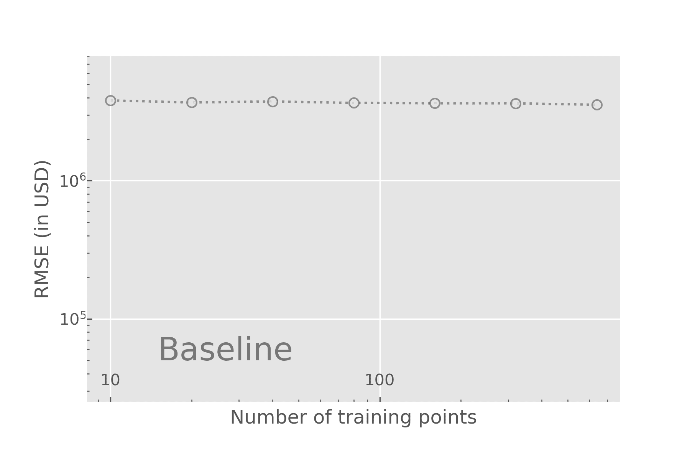
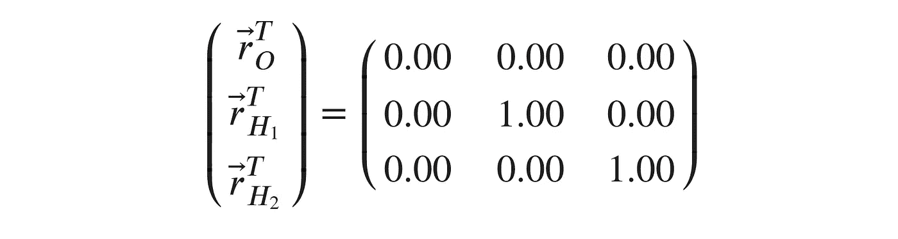
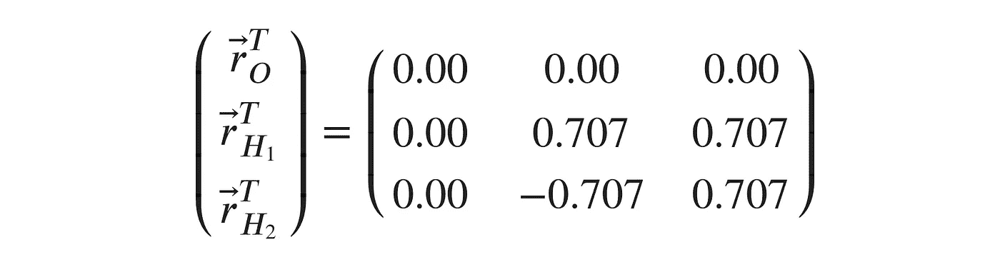
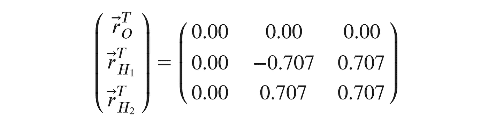
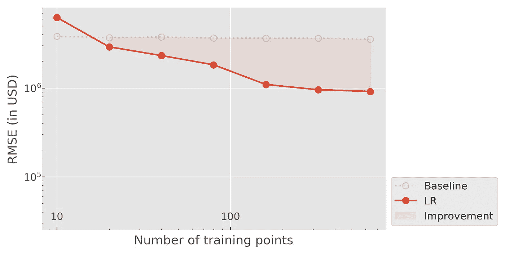
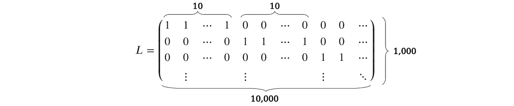
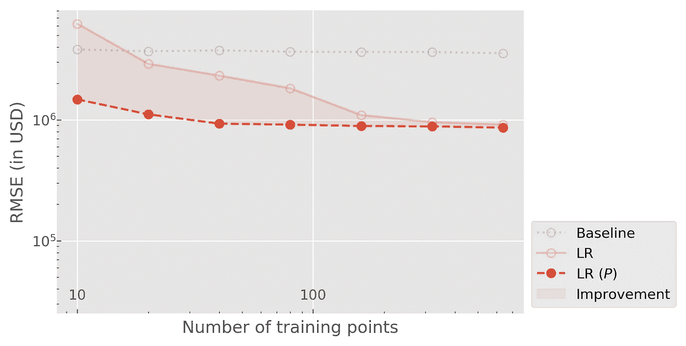
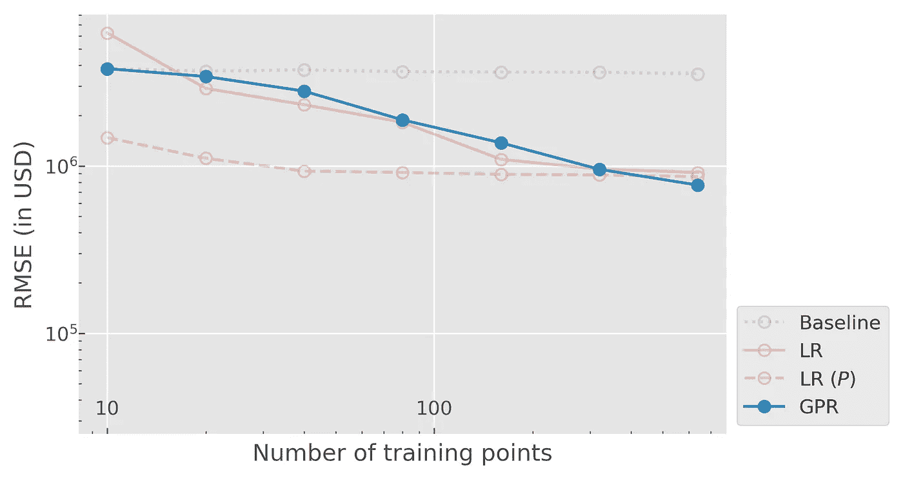
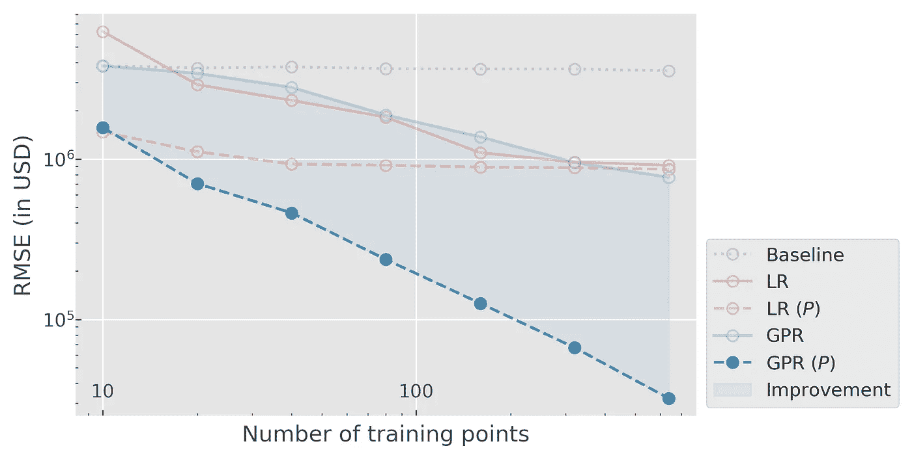

# 用感应偏置增强你的模型性能

> 原文：<https://towardsdatascience.com/supercharge-your-model-performance-with-inductive-bias-48559dba5133?source=collection_archive---------32----------------------->

照片由 CC0 的 Martin Vorel 拍摄——公共领域许可证

## [实践教程](https://towardsdatascience.com/tagged/hands-on-tutorials)

## 如何更聪明地工作，而不是更努力:在机器学习模型中编码现实生活中的对称性可以提高其准确性几个数量级！

## 对称无处不在；他们包围了我们。

雪花:GL kvs 2/CC BY-SA(https://creative commons . org/licenses/BY-SA/4.0)、Romanesco:Jacopo Werther/CC BY-SA(https://creative commons . org/licenses/BY-SA/3.0)、蜂巢:Pixabay license

从雪花美丽的规则形状、romanesco 的自相似(分形)结构到蜂巢的六边形图案。

大自然似乎在寻找对称。事实上，我们存在的规律展示了太多的对称:物理学家谈到时间和空间的平移对称。他们的意思是，像重力这样的力和几百万年前的作用方式是一样的，它们在悉尼和纽约之间没有变化。

他们的另一个最爱，旋转对称，简单地说，当你从不同的角度看一个物体时，它的属性不会改变。

对称的例子不胜枚举，其中一些比另一些更容易理解(洛伦兹对称，说明在惯性系中共同运动的观察者的光速是相同的，可能已经逃过了不太精通物理的头脑)。

尽管其中一些对称性对人类来说是显而易见的，但大多数机器学习模型却出人意料地忽视了它们的存在。我举一个我自己工作中的例子:

bin im Garten/CC BY-SA(【https://creativecommons.org/licenses/by-sa/3.0】T4)

粗略地说，我研究的目标是使用 ML 来**仅从结构信息**预测分子的性质。这意味着，我得到了一个原子列表，以及它们的坐标。

对于一个水分子，它看起来像这样:

原子的坐标可以方便地概括在矩阵中，矩阵中的行对应于原子，列分别对应于 x、y 和 z 位置。我想预测将分子分裂成它的组成原子需要多少能量(原子化能量)。我可以通过训练神经网络 F 来做到这一点，神经网络 F 使用原始坐标作为特征并输出能量:

假设我成功地在一个大而多样的分子数据集上训练了这个神经网络，并且我想要找到以下水分子的雾化能量:

你可能已经注意到，它只是我们原始分子的旋转版本。因此，它应该具有相同的雾化能量。我们有没有任何保证神经网络会尊重这个**旋转对称**？可惜没有。

更糟糕的是，如果我们简单地交换两个氢原子

网络可能再次给出完全不同的答案。相同原子的排序没有物理意义，只是源于神经网络功能形式的产物。理想情况下，我们希望神经网络输出尊重这种**排列对称性**(排列:“交换事物的顺序”)，但如何做到呢？

在化学和物理的机器学习的早期，很快就清楚了模型需要观察这些对称性才能足够准确。因此，大量的努力致力于找出如何将对称性结合到 ML 算法中。如今，这通常是通过巧妙的特征工程和神经网络设计的结合来实现的。综合考察这些方法可以在[这里找到](https://aip.scitation.org/doi/full/10.1063/1.4966192)【1】。所有这些方法的共同点是，它们以某种形式将**归纳偏差**引入到学习算法中。

> *学习算法的归纳偏差[……]是学习者用来预测尚未遇到的给定输入的输出的一组假设[2]*

在旋转对称的情况下，这种归纳偏差可以表述为这样的假设:“任何在旋转下不是不变的信息都可以而且应该被忽略”

不管你是否意识到了这一点，如果你以前使用过任何机器学习模型，你都会遇到归纳偏差:

*   线性回归基于因变量和协变量之间存在线性关系的假设。
*   k-最近邻分类器假设特征空间中的邻近性转化为输出空间中的邻近性。
*   卷积神经网络假设输出对输入的平移基本不变(不考虑边界条件)。

虽然所有这些标准算法都有一些内在的偏差，但我想用一个例子来说明引入额外的假设如何能够大大提高您的模型的准确性。

Pixabay 许可证

# 示例:房地产价格模型

想象以下场景:

*您的客户对买卖房地产感兴趣，并要求您创建一个机器学习模型，以准确预测建筑物的公平市场价值。幸运的是，训练数据很容易获得，但有些有限(大约 1000 个样本)。让事情变得复杂的是，除了价格之外，任何关于建筑的信息都是在单位级别上给出的，价格只适用于整个建筑。*

为了简化我们的分析，让我们假设每栋建筑正好包含十个单元，并且我们有关于每个单元的以下信息:

*   户型:零售、办公、居住空间
*   单位面积(平方英尺)
*   房间的数量
*   窗墙比
*   该单元位于哪一层(占总层数的比例)

我们的数据以表格形式出现，有 1000 行(样本数)和 51 列(5 个特征 x 10 个单位+总价)。让我们把模型输入(前 50 列)写成设计矩阵𝑋，因变量写成向量𝑦

# 线性回归

## 香草 LR

任何回归任务的良好起点总是线性回归，其目的是选择权重 *w* 以便模型预测

最小化均方误差

为了分析该模型对于我们的数据的表现如何，我们可以查看关于训练集大小的泛化误差(测试集上的误差)。绘制我们的结果，我们得到通常所说的学习曲线:

请注意，我们已经包括了一个基线模型，它只是预测训练集的平均价格。从这个情节中我们可以推断出几件事。我们看到，对于极小的训练集，基线模型比 LR 更准确，但是当我们处理较大的数据集时(注意对数-对数比例！)我们可以改进基线。但是 100 万美元的均方根误差(RMSE)并不是很大，对我们虚构的客户也没有用。我们希望做得更好…

## 置换不变 LR

让我们考虑一下对称性:在设计矩阵𝑋中以什么顺序排列重要吗？答案是:不。我们可以将第 1-5 列与第 6-10 列交换，但仍然期望建筑具有相同的净值。然而，我们的 Vanilla LR 无法准确捕捉到这一点，因为无法保证权重 15 与 610 相同。目标很明确:我们需要我们的模型在单位置换下保持不变。

让我们考虑一个稍微不同版本的设计矩阵，我们称之为𝑋̃。它的维数为 10000 x 5，是通过将每个单元(即每组五列)视为一个单独的数据点，从原始𝑋获得的。那么，线性回归就变成了

其中𝑧是每个单位的价格。不幸的是，我们无法获得𝑧(一个潜在变量)，但我们可以假设𝑧和𝑦.之间存在某种关系因为我们想停留在线性模型的范围内，我们写道

简单地说，这意味着一栋建筑的价格是该建筑内每个单元价格的总和。通过引入适当的𝐿矩阵，我们可以写出𝑖所有建筑物的上述总和，从而

这让我们可以求解线性回归模型

实际上，𝐿𝑋̃意味着我们总结一栋建筑内所有单元的特征，因此，例如，我们只看每栋建筑的总面积，而不是每个单元的面积。所以对于线性回归来说，强加排列对称性真的是一个微不足道的任务。当我们转向内核方法时，使用这种更抽象的符号的优点将变得明显。

使用 LR 的排列不变版本，我们得到以下学习曲线:

虽然我们看到了较小数据集的实质性改进，但该模型似乎没有从数据中学习到太多东西，导致曲线变得平坦。这表明线性模型**不足以表达**训练数据中包含的所有细节。显然，线性假设太强，对于“健康”模型，我们期望学习曲线在对数标度上是线性的(表明预期的幂律行为)[3]。

# 高斯过程回归

# 普通探地雷达

让我们考虑一个更复杂的模型。我们有几个选择:神经网络当然很受欢迎，但众所周知，对于这样的小数据集，神经网络是不可靠的。有效选项包括基于树的方法和 k-means 方法。我个人最喜欢的是基于内核的方法，特别是**高斯过程回归(GPR)** 。

我们正在寻找一个函数𝑦=𝑓(𝑥)，它将输入或自变量𝑥映射到因变量𝑦(价格)。在探地雷达中，我们采用贝叶斯方法来寻找这个函数，首先在所有可能的𝑓上指定一个先验，然后根据观察到的数据点(𝑋,𝑦).该先验通过具有协方差矩阵𝑘.的高斯过程来定义

> 高斯过程是随机变量的集合，任意有限个随机变量具有联合高斯分布[4]。

对于𝑥的任意值，输出𝑓(𝑥遵循正态分布。此外，𝑥和𝑥′这两个远点的输出是联合正态的，其协方差由𝑘(𝑥,𝑥′).定义在实践中，这意味着我们可以通过选择合适的协方差函数(也称为核)𝑘(𝑥,𝑥′).来确定拟合函数𝑓的形状

核的一个非常流行的选择是平方指数协方差(有时也称为径向基函数)

选择这个核，我们本质上在𝑓上设置了一个平滑条件，因为靠近在一起的点(意味着|𝑥−𝑥′|很小)将高度相关。

让我们回到我们的例子。一旦我们根据训练数据调整高斯过程，我们就可以对测试集进行预测。

使用我们的设计矩阵𝑋和目标值𝑦，模型预测给出如下

这看起来非常类似于线性回归，除了𝑋已经被𝑘(𝑋,𝑋).取代因为该方程在参数𝜔中是线性的，所以仍然可以直接求解:

请注意，我们包含了一个乘以单位矩阵 I 的参数𝜎。该参数用于模拟数据中存在的噪声，同时有助于避免矩阵求逆中的数值问题。

将我们的训练数据代入这些方程，我们得到以下学习曲线:

嗯，效果不太好。虽然与 LR 相比，我们赋予了该模型更多的表达能力，但其测试误差仍然与后者相当。我们的模型似乎**过度拟合**了数据。

# 置换不变探地雷达

我们再加回置换不变性。和以前一样，我们想解决辅助问题

和𝑦=𝐿𝑧.一起矩阵 L 保持与线性回归问题中相同。

在摆弄了一些术语之后，我们得到了下面的等式:

重新定义

我们恢复了 GPR 的原始形式

但是这次使用置换不变核𝑘̃。插入我们的数据，我们得到以下学习曲线:

万岁！通过使用置换不变性，我们已经能够将我们的最佳测试误差从大约 700，000 美元减少到 30，000 美元。此外，比例是线性的(对数-对数比例)，这表明如果需要，我们可以通过收集更多的数据来进一步提高模型的准确性。

# 回到科学

我希望我已经能够说服你，在用机器学习模型拟合你的数据之前，有时停下来三思是值得的。通过简单地识别数据中的对称性，我们已经能够将模型精度提高 20 倍以上！

作为一个小小的奖励，如果你理解了这篇文章中的所有内容，你实际上离成为计算化学家更近了一步。

怎么会这样

如果你用“分子”代替“建筑”,用“原子”代替“单位”,我们实际上已经建立了一个化学和材料科学研究人员经常使用的模型[5]。该模型可以通过将分子表示为原子贡献的组合来预测分子的属性，如其能量。正如在我们的例子中，这些原子的贡献是未知的——我们只知道整个分子的能量——但我们仍然可以用潜在变量 *z，*来表述这个问题，从而使其排列不变。

*如果你喜欢这篇文章，请在这里关注我，在* [*twitter*](https://twitter.com/semodi92) *或在*[*LinkedIn*](https://www.linkedin.com/in/sebastianmdick/)*上联系。*

# 参考

[1]贝勒尔，约尔格。"展望:原子模拟的机器学习潜力."*化学物理学报* 145.17 (2016): 170901。

[2][https://en.wikipedia.org/wiki/Inductive_bias](https://en.wikipedia.org/wiki/Inductive_bias)

[3] C. Cortes，L. D. Jackel，S. A. Solla，V. Vapnik 和 J. S. Denker，学习曲线:渐近值和收敛速度，*神经信息处理系统的进展*(柯伦联合公司，1994)，
第 327-334 页

[4]c . e . Rasmussen & c . k . I . Williams，机器学习的高斯过程，麻省理工学院出版社，2006 年，ISBN 026218253X。c 2006 麻省理工学院

[5] Bartók，Albert P .等人，“高斯近似势:没有电子的量子力学的精确性”*物理审查函* 104.13 (2010): 136403。