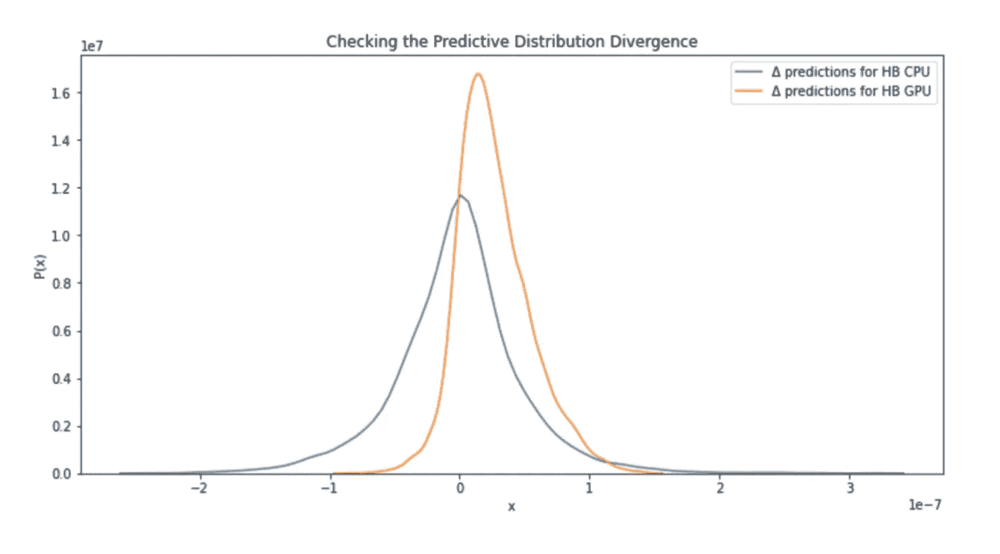
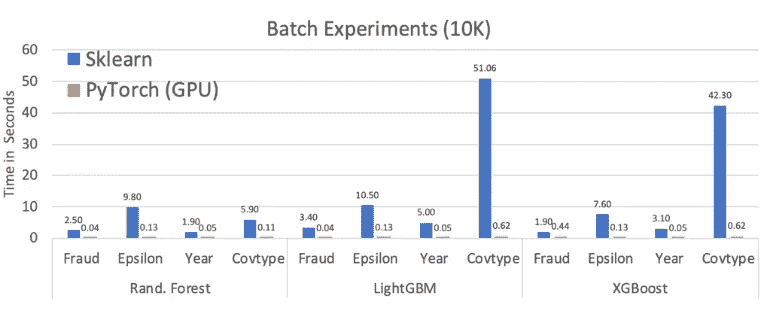

# 用蜂鸟增压你的浅 ML 模型

> 原文：<https://towardsdatascience.com/supercharge-your-shallow-ml-models-with-hummingbird-cdad2069e489?source=collection_archive---------59----------------------->

## 用一行代码弥合传统和深度学习之间的差距


利瓦伊·琼斯在 [Unsplash](https://unsplash.com/s/photos/hummingbird?utm_source=unsplash&utm_medium=referral&utm_content=creditCopyText) 上的照片

# 动机

自从 2012 年深度学习的最近一次复兴以来，大量新的 ML 库和框架已经被创建。那些经受住时间考验的公司(PyTorch、Tensorflow、ONNX 等)得到了*大型*公司的支持，可能不会很快消失。

然而，这也带来了一个问题，因为深度学习社区已经偏离了流行的传统 ML 软件库，如 scikit-learn、XGBoost 和 LightGBM。当公司需要将具有不同软件和硬件假设的多种模型投入生产时，事情变得…令人毛骨悚然。

*   当一些模型是基于张量的，而另一些是基于向量的，你如何保持 ML 推理代码[干燥](https://en.wikipedia.org/wiki/Don%27t_repeat_yourself)？
*   当基于 GPU 的神经网络开始围绕传统模型运行时，如何保持传统模型的推理运行效率具有竞争力？

# 寻找统一的模型服务界面

我知道，我知道。在 Kubernetes 中使用微服务可以通过保持事物的解耦在一定程度上解决设计模式问题…如果这是你想要的吗？

但是，我认为这真的忽略了问题。如果您想无缝部署 XGBoost 回归器或全连接 DNN 作为服务的主要输出，该怎么办？当然，你可以热交换你的服务启动的硬件。代码怎么样？

根据模型的类型，您是否打算使用一个精心设计的 if-else 开关来使用一个软件框架而不是另一个？

# XGBoost/LightGBM 还不够快吗？

嗯，对于很多用例来说，*就是*。然而，在需要神经网络的问题和可以用更传统的模型充分解决的问题之间仍然存在巨大的差距。对于更传统的模型，难道你不希望能够使用最新和最伟大的计算框架来支持你的模型的预测吗？这将允许您在需要通过冗余实例将模型*向外*扩展*之前，将模型*向上*扩展更多。*

# 输入蜂鸟

微软研究院引入了`hummingbird`来弥合面向 CPU 的模型和面向张量的模型之间的差距。该库简单地采用任何我们已经训练好的传统模型，并返回一个基于张量计算的模型版本。Hummingbird 旨在解决当前 ML 应用程序的两个核心问题:

1.  传统和深度学习软件库对其基本计算单元(向量与张量)有不同的抽象。
2.  这种差异的结果是，传统的 ML 库没有获得与硬件加速器(读:GPU)相同的性能增益。

有了蜂鸟，你的 ML 管道将开始看起来更干净。你会知道，不管算法如何，你最终会得到一个通过张量计算来创建预测的模型。不仅如此，这些张量计算将由您的组织可能已经效忠的同一深度学习框架来运行。

所有这些都来自一个函数调用。在我看来，这是一笔不错的交易！

让我们看看它的实际效果。

# 设置

让我们把这部分去掉。你知道该怎么做。

# 确保再现性

让我们用宇宙万物的答案[来控制 Numpy 和 PyTorch 中的随机性。](https://www.dictionary.com/e/slang/42/)

# 召唤一些数据

让我们定义一个快速助手来快速制作一些分类数据，并用它创建一些数据集。

多亏了 Deepnote，我不必占用这个笔记本的一半来为你打印数据形状和分布。这些笔记本配备了功能丰富的变量资源管理器，它提供了大多数关于数据的基本 EDA 风格的问题。

查看本文的[原始版本](https://beta.deepnote.com/article/supercharge-your-shallow-ml-models-with-hummingbird)，了解 Deepnote 如何从他们的 Jupyter 风格的笔记本中自动创建漂亮的文章。

# 把鸟带进来

现在，通过 Hummingbird 将您的模型转换成张量计算的一行程序是`convert(clf, 'pytorch')`。

就是这样。那是蜂鸟。

为了使我们的比较更加容易，让我们在此基础上创建一个快速的方法，当它可用时自动将其移动到 GPU。作为一些最终添加的糖，我们将接受一个标志，如果需要的话，强制将模型保存在 CPU 上。但是请记住，对`convert()`的单一调用是您需要拥有的与蜂鸟的唯一接口；它在单个函数调用的掩护下完成了它所有的魔法。一旦您得到返回给您的模型，您就像任何其他传统的 pythonic ML 模型一样对它调用`predict()`。

# 拿出你们的手表，时间到了

好了，是时候进行基准测试了！不要担心一连串的导入或方法包装。让我们用`%%timeit`魔法命令保持简单。这个神奇的命令将自动多次运行单元中的代码，报告运行时样本的平均值和标准偏差。首先，我们将按原样计时`sklearn`模型。然后，我们将看到蜂鸟在 CPU 上的模型和在 GPU 上的模型如何比较。

```
Original:        136 ms ± 1.59 ms per loop
Hummingbird CPU: 1.81 s ± 16.1 ms per loop
```

来源:[吉菲](https://giphy.com/gifs/turtle-slide-climbing-w87yLYL7lwDWE)

呀！

嗯……这真是出乎意料。关于这一点没有两种方法:对于某些数据集，Hummingbird 可能在 CPU 上运行得更慢。这甚至可以在他们当前的一些蜂鸟 [Github repo](https://github.com/microsoft/hummingbird) 示例笔记本中看到。此外，我确实有意提到了在某些数据集上运行时较慢*，因为它确实优于其他数据集。*

也就是说，这个副作用不应该让任何人跑向门口——记住图书馆的目标！将模型转换为张量计算的主要原因是利用硬件，而硬件在这方面*优于*。

剧透提示:我说的是 GPU！这款 Deepnote 笔记本由 NVIDIA T4 张量核心 GPU 驱动。让我们看看模型如何在*和*上运行。

```
Original:        136 ms ± 1.59 ms per loop
Hummingbird CPU: 1.81 s ± 16.1 ms per loop
Hummingbird GPU: 36.6 ms ± 65.8 µs per loop
```

我们走吧！现在，我们不仅比原来有了 73%的平均加速，而且还有一个*数量级的更小的方差。运行时的原始标准差是其均值的 1.1%，GPU 运行时的标准差是 0.18%！*

来源: [Giphy](https://media.giphy.com/media/B1uajA01vvL91Urtsp/giphy.gif)

# 以速度保证质量

不过，暂时不要激动。你的模型可能拥有世界上最快的运行时间；如果它不能在转换过程中保持精度，它就完全没用了。让我们看看原始模型和两个转换后的模型之间的预测是如何比较的。为此，我们求助于我最喜欢的可视化库之一，`seaborn`。



原始模型和蜂鸟模型之间预测差异的分布

# 有意思…

一点也不差。基于 CPU 的模型的增量分布在零附近相当对称，3σ(注意轴刻度)在 1e-7 附近。基于 GPU 的模型的增量分布也有类似的小偏差，但显示出非零偏差和偏斜！这当然是有趣的行为，激起了好奇的心，但它仍然是一个小细节，除了最精确敏感的模型。

陪审团已经决定:蜂鸟在加速的同时也提供了精确性👍。

看看下面微软的一些大规模比较。🚀



来源:[微软研究院](https://azuredata.microsoft.com/articles/ebd95ec0-1eae-44a3-90f5-c11f5c916d15)

# 顶端的樱桃

哦，顺便说一句，你还可以自动加入所有未来的计算优化，这些优化来自于成千上万受雇于这些巨型框架的人。随着对不太受欢迎的框架的支持逐渐消失(相信我，这最终会发生)，你会舒服地坐着，知道*你的每一个*模型都运行在良好支持的基于张量的推理框架上。

毕竟，我们从事的是数据科学，而不是运行时优化。利用大人物来完成该领域的工作感觉很好，让我们可以专注于我们的核心竞争力。

# 结论

正如微软研究院最近的许多其他举措一样，我对蜂鸟感到兴奋。在快速分化的 ML 空间中，这是走向整合的一大步，从混乱中获得一些秩序总是一件好事。我确信，随着时间的推移，他们基于 CPU 的推理的运行时停顿将被消除，同时确保 GPU 的持续优势。当他们进行更新时，我们只需点击几下鼠标，就可以使用支持 GPU 的 Deepnote 笔记本来测试他们的声明！

# 潜入蜂鸟

*   [【代号】蜂鸟 Github Repo](https://github.com/microsoft/hummingbird)
*   [【博客】蜂鸟微软博文](https://azuredata.microsoft.com/articles/ebd95ec0-1eae-44a3-90f5-c11f5c916d15)
*   [【论文】将经典 ML 流水线编译成张量计算，为“一刀切”的预测服务](http://learningsys.org/neurips19/assets/papers/27_CameraReadySubmission_Hummingbird%20(5).pdf)
*   [【论文】服务于复杂性、性能和成本的驯服模型:张量计算方法汇编](https://scnakandala.github.io/papers/TR_2020_Hummingbird.pdf)

# 使用蜂鸟和 Deepnote

*   [deep note 的故事](https://deepnote.com/about/)
*   [Deepnote 文档](https://docs.deepnote.com/)
*   [集成包管理](https://docs.deepnote.com/features/package-management)
*   [选择硬件](https://docs.deepnote.com/environment/selecting-hardware)

# 用数据解读更多生活

*   [CORD-19:数据科学对新冠肺炎的回应](https://lifewithdata.org/cord-19/)
*   [Deepmind 汹涌澎湃，释放极致和混响 RL](https://lifewithdata.org/deepmind-acme-reverb/)
*   [PyTorch 用 TorchServe 升级发球游戏](https://lifewithdata.org/torch-serve/)

*原载于*[*https://beta.deepnote.com*](https://beta.deepnote.com/article/supercharge-your-shallow-ml-models-with-hummingbird)*。*