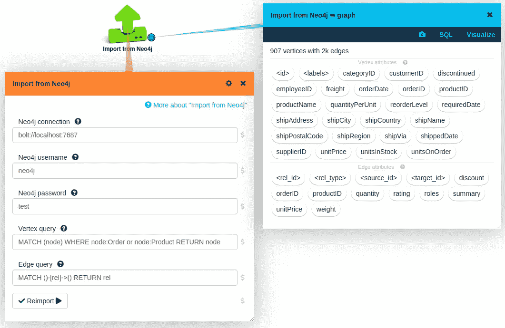
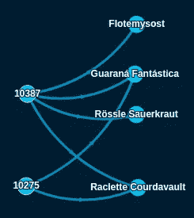
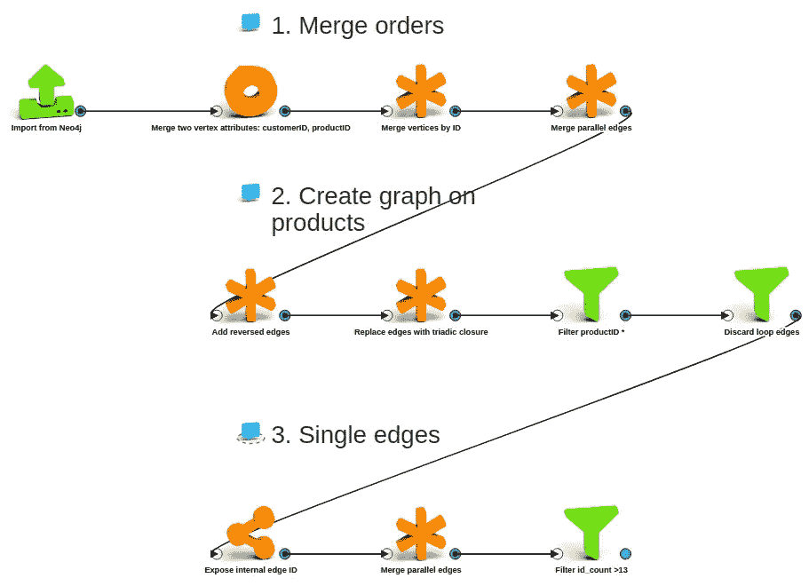
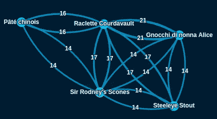
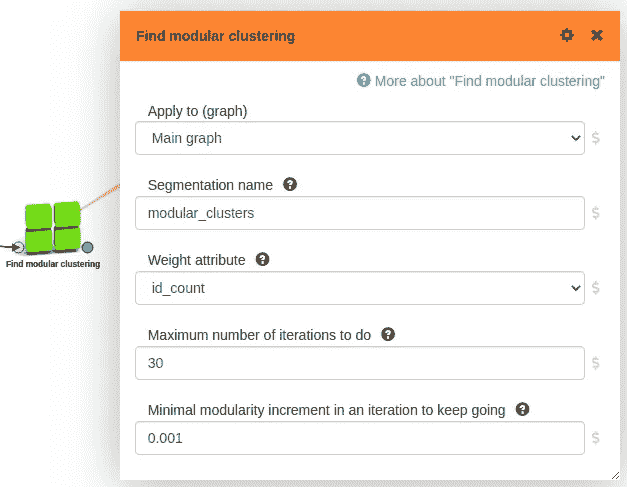
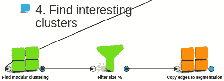
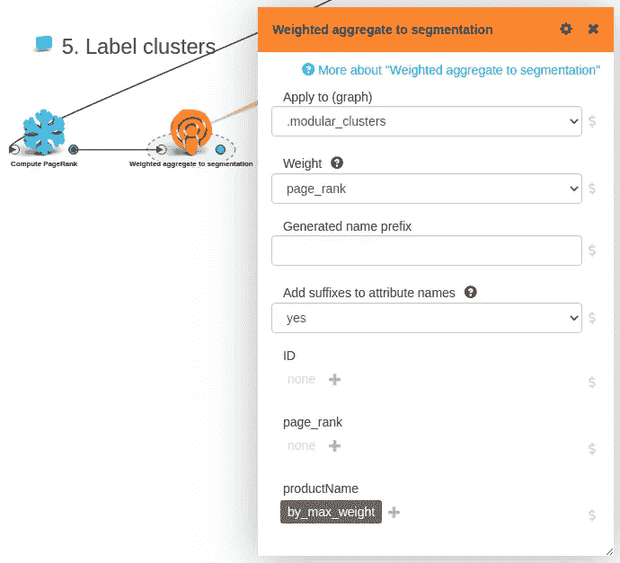
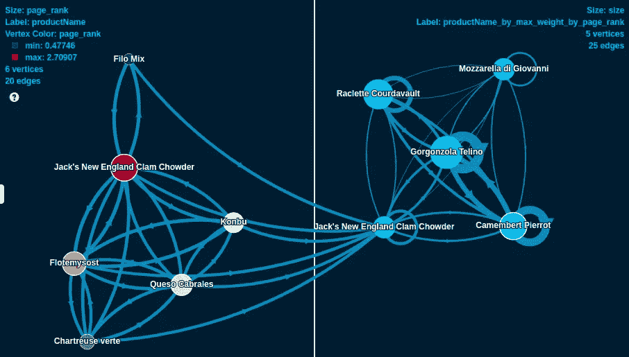
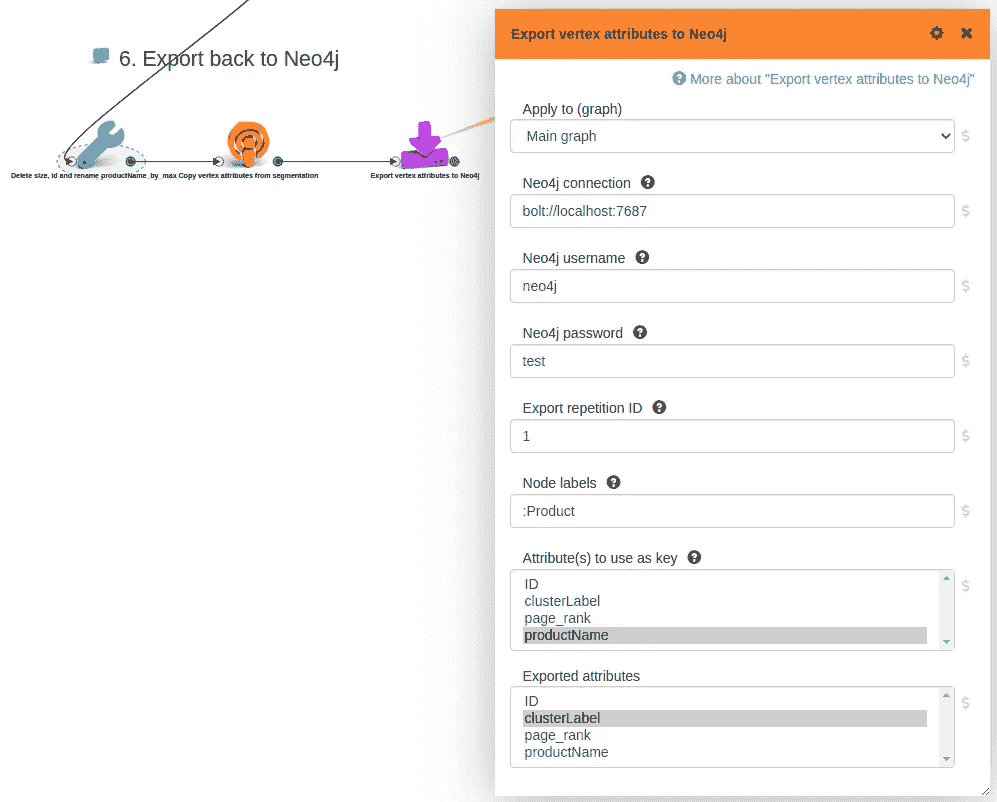
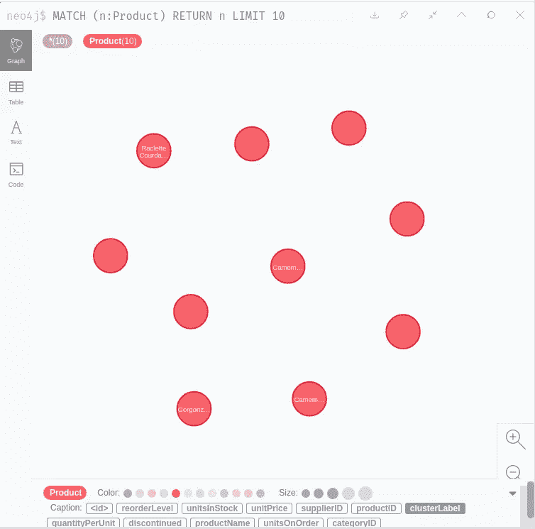

# 基于 Neo4j 数据的 LynxKite 超级数据科学

> 原文：<https://towardsdatascience.com/supercharged-data-science-with-lynxkite-on-neo4j-data-11cd0fa10f41?source=collection_archive---------45----------------------->

如果您有一个 Neo4j 数据库，那么您已经完成了您的图表之旅中的几个重要步骤:您知道如何将您的业务(的某些方面)建模为一个图表，可能您已经在使用您的数据进行特别的图表查询、本地调查，或者甚至在您的操作中！

但是，就像你不会在面向表的数据科学中直接使用 SQL 数据库一样，如果你想在一个复杂的、迭代的图形数据科学项目中取得成功，你需要的不仅仅是一个图形数据库。

在一个传统的、面向表格的项目中，你可以使用像 Pandas 或 Python 的 Spark 这样的东西，加入像 PyTorch 这样的 ML 框架，或者使用像 RapidMiner 或 Dataiku 这样的集成数据科学工具。但是无论您选择什么工具，您都将使用数据的快照，并且最终会得到一个包含许多相互依赖的操作的复杂工作流。

然而，如果你手头有一个严肃的*图形*项目，你应该转向 [LynxKite](https://lynxkite.com/) ！现在，我们的新 Neo4j 连接器让这一切变得非常简单。

为了记录，如果你想做图形数据科学，但是你还没有一个图形数据库，那也完全没问题。您可以直接使用 LynxKite 将传统数据转换成图表。但是这篇文章不是关于这个的。

现在让我们详细考虑一个简单但典型的图表数据科学工作。以 Neo4j 的 Northwind 数据集为例。(只需在你的 Neo4j 浏览器中输入`:play northwind-graph`，按照提示操作即可获得。)这是一个代表客户订单历史的图表。它包含客户、订单、产品、产品类别和供应商的节点。我们想要实现的是，根据同一顾客购买产品的频率，识别出迎合相似“口味”的产品组。

# 获取数据

首先，让我们将数据导入 LynxKite！使用新的 Neo4j 导入框非常简单:

(截图*作者*)

你只需在你的 LynxKite 工作区上放下一个`[Import from Neo4j](https://lynxkite.com/docs/latest/user-guide/#import-from-neo4j)`框，设置好你的连接参数，按下`Import`，你就可以开始了。

如果保留查询的默认值，则会导入所有数据。在本例中，我们通过添加 WHERE 子句修改了节点查询:现在我们只对订单和产品感兴趣。

以下是导入图形的一个小示例:

(截图*作者*)

在左边，您可以看到两个订单，右边是订购的产品。

# 图形转换

您很少想要在一个图形上运行固定图形算法，因为它在您的生产系统中是可用的。通常你想要一些结构上的改变，你想要实际的算法在一个修改过的图上运行。

值得注意的是，这些步骤构成了数据科学项目不可或缺的一部分，我们经常希望对它们进行大量迭代。在 LynxKite 中，这些步骤是您的分析工作流中的一等公民。您可以轻松地更改细节，并可以轻松地重新运行整个下游分析。如果你直接在一个 graph DB 中这样做，那么你将不得不在每次迭代中经历痛苦的清理和图形重建。

在我们的具体例子中，我们想从一个订单-产品二分图发展到一个只包含产品的图，其中边代表购买了两种相关产品的*客户*的数量。我们执行以下转换步骤:

1.  我们**根据客户 id 合并订单**:对于这个分析，我们不关心在同一个订单中购买了哪些产品，只关心相同的客户。
2.  我们添加反向边，然后计算[三元闭包](https://lynxkite.com/docs/latest/user-guide/#replace-edges-with-triadic-closure)。这样，我们在产品中得到我们想要的**边，除了我们还为每个产品创建了一串循环边。所以我们删除了它们，并且只保留代表产品的节点，而不是(合并的)订单。**
3.  最后，我们将所有平行边合并成**单条边**，并保留原始平行边的基数作为边属性。我们也只保留代表足够频繁的共享客户的边。

我们可以通过在工作区放几个盒子来完成以上所有的工作。以下是图形转换的完整流程:

(截图*作者*)

这是结果图的一个示例:

(作者截图*)*

# 查找和标记聚类

现在我们已经有了想要的图，对它运行一个聚类算法是很简单的，我们只需放入一个`[Find modular clustering](https://lynxkite.com/docs/latest/user-guide/#find-modular-clustering)`框:

(作者截图*)*

好吧，我们后来做了一点调整:我们删除了非常小的集群，我们将产品的边复制到产品集群，这样我们就可以看到不同集群之间的相关性。以下是完整的流程:

(截图*作者*)

我们基本上完成了，但让我们再做一个整容改进！让我们为每个集群找出最重要的产品，并使用该产品的名称作为我们集群的标签。这很简单:我们只需在产品图上计算 PageRank，并为所有集群取最高 PageRank 产品的名称:

(截图*作者*)

现在是时候惊叹我们(不那么)努力的成果了！这是一个可视化图，显示了所有有趣的带标签的集群(右侧)，以及一个集群的成员(左侧):

(截图*作者*)

有趣的是，几乎所有的集群都是由某种奶酪主导的…我一直都知道，奶酪就是石头！

# 回到 Neo4j

为了结束这个循环，让我们将分析结果返回到数据库中！我们需要两个简单的准备步骤。我们为聚合标签属性取了一个更好的名字，这是我们希望在数据库中看到的。然后，我们将它从集群移至其所有成员。最后，我们应用一个 Neo4j 导出框:

(截图*作者*)

事实上，集群标签如预期的那样出现在 Neo4j 中！

(截图*作者*)

在这种情况下，我们想要将顶点属性导出回数据库，但是也可以用[边属性](https://lynxkite.com/docs/latest/user-guide/#export-edge-attributes-to-neo4j)做同样的事情，或者你甚至可以[将一个完整的图形](https://lynxkite.com/docs/latest/user-guide/#export-graph-to-neo4j)推送到数据库。

# 全部用代码编写

我们的经验是，迭代的、探索性的图形数据科学可以在 UI 上更有效地完成:更容易改变事物，在任何点检查值和元数据，不需要记住参数名，等等。也就是说，有些人更喜欢编码，这也是数据科学管道自动化生产部署的唯一合理方式。

对于这些情况，我们提供了强大而简单的 [Python API](https://lynxkite.com/docs/tutorial-python/) 。仅为了演示，无需进一步解释，请参见下面执行上述完整分析的 python 代码。

# 概述

我们在 Northwind 数据集上进行了简单但有趣的分析。但这里的要点不是关于这个分析的具体细节，也不是结果。我们想要展示的是，为什么即使是一个相当简单的项目也需要一些步骤和功能，而这些步骤和功能在一个实时的、事务性的图形数据库中是不可能或非常麻烦的。

但是我们带来了好消息！现在有了我们的新连接器，在 Neo4j 实例上使用免费、开源的 LynxKite 来进行高效、舒适的图形数据科学变得非常容易！