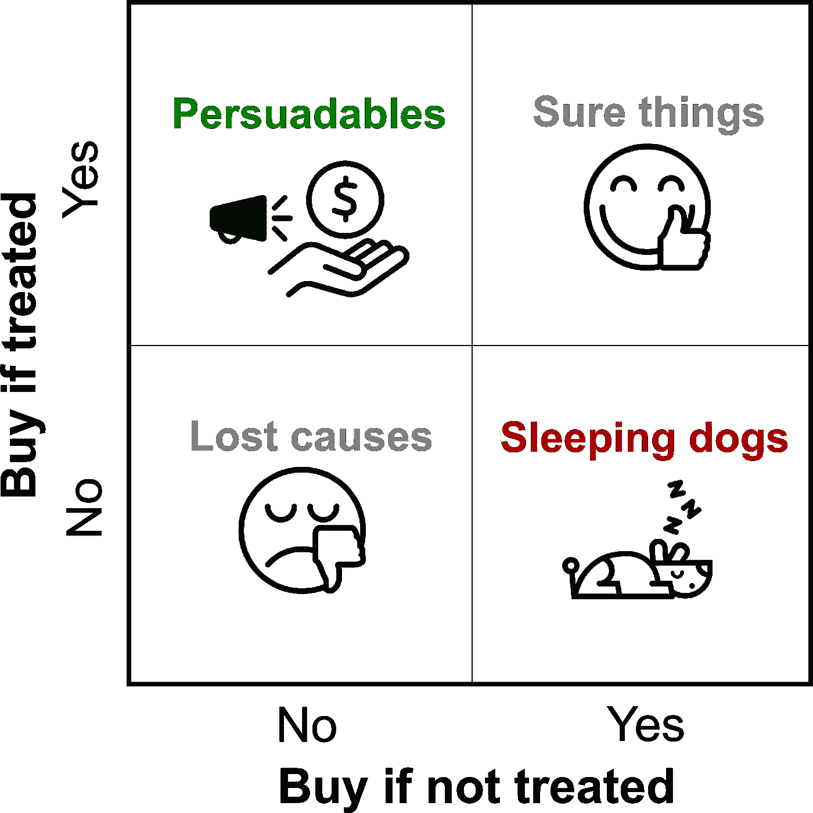
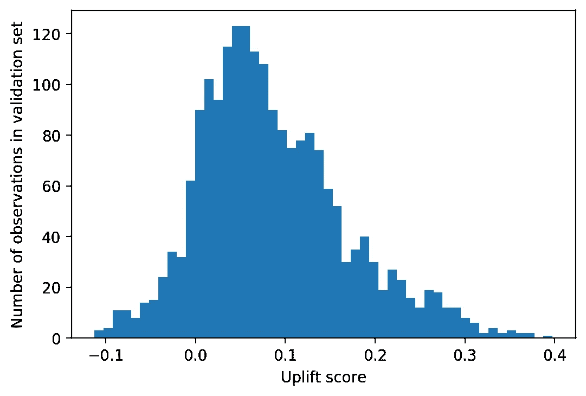

# 通过提升模型提升客户接触点

> 原文：<https://towardsdatascience.com/supercharging-customer-touchpoints-with-uplift-modeling-9913ddf62c1?source=collection_archive---------29----------------------->

## 介绍一种预测个体治疗效果的强大方法，使用 pandas 和 XGBoost 的 Python 中的合成数据。


图片来自 [Pixabay](https://pixabay.com/photos/space-shuttle-rocket-lift-off-774/)

在这篇文章中，我将介绍提升建模的概念，并举例说明为什么它是数据科学家增加业务价值的工具箱中的一个重要部分。然后，我将展示一种构建提升模型的简单方法，并使用 Python 中的合成数据演示几个提升模型评估指标。

这篇文章在 Github 上以 Jupyter 笔记本[的形式发布。](https://github.com/klostest/uplift_modeling/blob/master/uplift-modeling.ipynb)

# 介绍

在机器学习可以为企业创造价值的无数方式中，与监督分类或回归等方法相比，提升建模是鲜为人知的方式之一。但是对于许多用例来说，它可能是最有效的建模技术。在任何情况下，企业可以针对不同的客户有选择地采取代价高昂的行动，以期影响他们的行为，提升建模应该是确定战略的有力候选。这是因为提升建模旨在找到受行动影响最大的客户子集。识别这个细分市场对于在商业策略中最大化投资回报是很重要的。

例如，在提供优惠券时，企业可能会遭受收入损失:如果客户购买并使用优惠券，收入会因优惠券的价值而减少。但是，如果优惠券说服顾客购买，而他们本来不会购买，那么它可能仍然是值得的。在提升建模的术语中，这些类型的客户被称为“可说服的”，提升建模将事情分解为有“待遇”和没有“待遇”的客户行为，在本例中，待遇是接收优惠券。



经易和弗罗斯特许可使用的图片(2018)

提升建模的目标，也称为净提升或增量响应建模，是为了确定“可说服的”，而不是在“确定的事情”和“失败的原因”上浪费精力，并避免打扰“睡觉的狗”，或那些对治疗有负面反应的人，如果他们存在的话。提升建模已经在许多领域得到应用，包括营销，这里展示的经典用例，以及[讨债](https://blogs.oracle.com/datascience/data-driven-debt-collection-using-machine-learning-and-predictive-analytics)和[政治活动](https://go.forrester.com/blogs/13-06-27-how_the_obama_campaign_used_predictive_analytics_to_influence_voters/)。

# 隆起建模的数据:实验是关键

现在我们知道了隆起建模的目标，我们如何实现它呢？构建提升模型的典型起点是来自随机对照实验的数据集:我们需要一个代表治疗组和未接受治疗的对照组中所有不同类型客户的样本。如果治疗组中购买的顾客比例明显高于对照组，我们知道促销是“起作用的”,因为它鼓励所有顾客平均购买。这就是所谓的平均治疗效果(ATE)。量化 ATE 是 A/B 测试的典型结果。

然而，可能只有治疗组中的一部分客户对我们观察到的大部分 ATE 负责。举个极端的例子，也许治疗组中一半的顾客负责整个 ATE，而促销对另一半没有影响。如果我们有办法提前确定哪些顾客更容易接受治疗，那么我们就能把资源集中在他们身上，而不是把时间浪费在那些治疗效果很小或没有效果的人身上。我们可能需要找到其他促销活动来吸引不响应者。在确定因人而异的可变治疗效果的过程中，以这些人拥有的不同特质为条件，我们在寻找个体治疗效果(ITE)，也称为条件平均治疗效果(凯特)。这就是机器学习和预测建模发挥作用的地方。

# 模型的力学

构建提升模型的经典技术是为单个客户预测如果他们得到治疗，他们购买的可能性，以及如果他们没有得到治疗，他们购买的可能性。然后将这两个概率相减以获得提升:如果给予治疗，购买的可能性会增加多少？这可以通过两种方式实现，在这两种情况下，模型的二元响应变量是顾客在治疗后是否进行了购买:

*   将治疗组和对照组集合成一个数据集，并训练一个单一模型，其中治疗是二元特征。在推断阶段，模型用于对每个实例进行两次预测，第一次处理= 1，第二次处理= 0。这被称为“S-Learner”方法，因为它使用单一模型。
*   为治疗组和对照组训练单独的模型。在推理阶段，治疗和控制模型都用于获得每个实例的预测。这被称为“T-Learner”方法，因为它使用了两种模型。

下面的示意图总结了这两种方法:


这些方法在关于隆起建模和因果推断的文献中有广泛记载(Lee 等人，2013 年 Gutierrez 和 Gerardy，2016 年)。它们具有相对简单和直观的优势，可以使用许多数据科学家熟悉的二进制分类建模技术以及 SAS 等企业软件中的专用包来实现(Lee et al. 2013)。与此同时，因果推理是机器学习中一个活跃的研究领域，其他方法可能会实现更好的模型性能。不同的方法包括旨在提升的基于树的模型(Gutierrez 和 Gerardy 在 2016 年进行了审查)、目标变量转换(Yi 和 Frost 2018 年)以及其他最近的创新，如 X-Learner (Kunzel 等人，2019 年)。

在所有种类中，隆起建模面临一个基本挑战。目标是为单个客户预测治疗后的购买可能性，以及未治疗时的购买可能性，以计算提价。但在现实中，我们从来没有观察到一个人既接受治疗又没有接受治疗的结果，因为这是不可能的！有人要么接受治疗，要么不接受。在数学建模中，如果我们不能观察到我们感兴趣的所有结果，这通常是一个问题。这一挑战说明了提升建模的反事实性质，以及随机实验对了解所有类型客户的美食的重要性。


图片来自 [Pixabay](https://pixabay.com/images/id-2115485/)

Gutierrez 和 Gerardy (2016)总结了这一挑战，并指出了前进的方向:

> *估算客户提升既是一个因果推理，也是一个机器学习问题。这是一个因果推理问题，因为人们需要估计两个结果之间的差异，这两个结果对一个人来说是互斥的(要么人*我*收到了一封促销电子邮件，要么没有收到)。为了克服这种反事实的性质，提升建模主要依赖于随机实验，即随机分配客户接受治疗(治疗组)或不接受治疗(对照组)。隆起建模也是一个机器学习问题，因为人们需要训练不同的模型，并根据一些性能指标选择产生最可靠隆起预测的模型。这需要明智的交叉验证策略以及潜在的功能工程。*

让我们通过构建一个 S-Learner 模型并对其进行评估，使用一个示例数据集来探索这些概念。

```
*# load packages* import numpy **as** np
import pandas **as** pd

from statsmodels.stats.proportion import proportions_ztest

import sklearn **as** sk
from sklearn.metrics import auc
import xgboost **as** xgb

import matplotlib **as** mpl
import matplotlib.pyplot **as** plt
**%**matplotlib inline

import pickle
```

# 示例数据集

建立提升模型最直接的方法是从随机对照实验的数据开始。这样，治疗组和对照组都应该有一个具有代表性的顾客群体样本。在设计的实验之外，如果一个自然控制群体作为企业正常经营的一部分存在，准实验数据可能是可用的。治疗组和对照组也可以通过一种称为倾向评分匹配的技术来近似，该技术在 causaml 包中可用，该包还提供了一套提升建模工具(causaml)。

在这里，我们使用来自最近出版物(赵等人，2020 年)的合成数据，这些数据在这里公开提供。这些数据模拟了在治疗组和对照组之间平均分配的设计实验。我们只加载该数据集中的前 10，000 行，这是“100 次试验(用不同的随机种子重复)”中的第一次。数据集的构建使得一些特征可以预测结果，一些特征不提供信息，一些特征可以具体预测治疗效果。

我们感兴趣的列是`treatment_group_key`，它标识客户是否接受了治疗；`conversion`，如果客户进行了购买，则为 1；如果没有，则为 0；以及 36 个合成特征，它们都以`x`开头。在真实数据中，这些特征可能对应于客户购买历史、人口统计数据以及数据科学家可能设计的其他数量，假设它们在建模提升中有用。

让我们加载数据并简单地研究一下。

```
df **=** pd.read_csv('data/uplift_synthetic_data_100trials.csv', nrows**=**10000)df.info()<class 'pandas.core.frame.DataFrame'>
RangeIndex: 10000 entries, 0 to 9999
Data columns (total 43 columns):
 #   Column                      Non-Null Count  Dtype  
---  ------                      --------------  -----  
 0   Unnamed: 0                  10000 non-null  int64  
 1   trial_id                    10000 non-null  int64  
 2   treatment_group_key         10000 non-null  object 
 3   conversion                  10000 non-null  int64  
 4   control_conversion_prob     10000 non-null  float64
 5   treatment1_conversion_prob  10000 non-null  float64
 6   treatment1_true_effect      10000 non-null  float64
 7   x1_informative              10000 non-null  float64
 8   x2_informative              10000 non-null  float64
 9   x3_informative              10000 non-null  float64
 ...
 42  x36_uplift_increase         10000 non-null  float64
dtypes: float64(39), int64(3), object(1)
memory usage: 3.3+ MBdf.head()
```


这一万条记录中，有多少是治疗组的，有多少是对照组的？

```
df['treatment_group_key'].value_counts()control       5000
treatment1    5000
Name: treatment_group_key, dtype: int64
```

有五五分成。让我们将治疗变量编码为二进制 0/1:

```
df['treatment_group_key'] **=** df['treatment_group_key'].map(
    arg**=**{'control':0, 'treatment1':1})
```

# 分析实验结果

总转化率是多少？

```
df['conversion'].mean()0.3191
```

与对照组相比，治疗组的转化率是多少？

```
exp_results_df **=** \
df.groupby('treatment_group_key').agg({'conversion':['mean', 'sum',
    'count']})
exp_results_df
```


```
(exp_results_df.loc[1,('conversion', 'mean')] \
    **-** exp_results_df.loc[0,('conversion', 'mean')]).round(4)0.1042
```

治疗组的转化率(37%)明显高于对照组(27%)，表明该治疗在鼓励转化率方面是有效的:ate 为阳性，约为 10%。

在真实数据中，差异通常不是很大，通常进行显著性检验来确定 A/B 检验的结果。

```
proportions_ztest(count**=**exp_results_df[('conversion', 'sum')],
                  nobs**=**exp_results_df[('conversion', 'count')])(-11.177190529878043, 5.273302441543889e-29)
```

p 值是从比例测试中返回的第二个数量，它比 0.05 小得多，或者比用于确定显著性的任何其他阈值都小得多。所以我们知道有一个重要的 ATE。这是隆起建模的典型起点。如果我们观察到这种处理没有增加转化率，虽然理论上有可能使用提升模型找到一个有说服力的客户群，但实际上这可能不值得努力。这可能取决于手头的具体问题。

然而，在我们的案例中，在观察到显著的治疗效果后，我们继续使用隆起建模来寻找 CATE，看看我们是否能确定那些有说服力的证据。

# 构建提升模型

这里我将使用一个`XGBClassifier`来训练一个 S-Learner；即包括所有特征的单个模型，其中治疗指示也是一个特征。我将数据分成训练集和验证集(80/20 分割)，以便尽早停止。我还将使用验证集来说明模型评估指标。在一个真实的项目中，应该从这个过程中保留一个测试集，测试集上的评估度量将用于模型的最终评估。

```
train, valid **=** sk.model_selection.train_test_split(
    df, test_size**=**0.2,random_state**=**42)**print**(train.shape, valid.shape)(8000, 43) (2000, 43)
```

将功能指定为列表。这包括治疗栏和所有功能，从第 8 栏开始:

```
features **=** ['treatment_group_key'] **+** df.columns.tolist()[7:]**print**(features)['treatment_group_key', 'x1_informative', 'x2_informative', 'x3_informative',... 'x36_uplift_increase']
```

组合用于训练 XGBoost 分类器的训练集和验证集:

```
X_train **=** train[features]
y_train **=** train['conversion']
X_valid **=** valid[features]
y_valid **=** valid['conversion']eval_set **=** [(X_train, y_train), (X_valid, y_valid)]
```

现在是实例化和训练模型的时候了。

```
model **=** xgb.XGBClassifier(learning_rate **=** 0.1,
                          max_depth **=** 6,
                          min_child_weight **=** 100,
                          objective **=** 'binary:logistic',
                          seed **=** 42,
                          gamma **=** 0.1,
                          silent **=** True,
                          n_jobs**=**2)**%%**time
model.fit(X_train, y_train, eval_set**=**eval_set,\
          eval_metric**=**"auc", verbose**=**True, early_stopping_rounds**=**30)[0]	validation_0-auc:0.693049	validation_1-auc:0.648941
Multiple eval metrics have been passed: 'validation_1-auc' will be used for early stopping.

Will train until validation_1-auc hasn't improved in 30 rounds.
[1]	validation_0-auc:0.718238	validation_1-auc:0.656877
[2]	validation_0-auc:0.72416	validation_1-auc:0.667244
[3]	validation_0-auc:0.727643	validation_1-auc:0.669992
...
[99]	validation_0-auc:0.852237	validation_1-auc:0.762969
CPU times: user 6.7 s, sys: 87.8 ms, total: 6.79 s
Wall time: 3.48 s

XGBClassifier(base_score=0.5, booster='gbtree', colsample_bylevel=1,
              colsample_bynode=1, colsample_bytree=1, gamma=0.1,
              learning_rate=0.1, max_delta_step=0, max_depth=6,
              min_child_weight=100, missing=None, n_estimators=10,
              n_jobs=2, nthread=None, objective='binary:logistic',
              random_state=0, reg_alpha=0, reg_lambda=1,
              scale_pos_weight=1, seed=42, silent=True, subsample=1,
              verbosity=1)
```

训练过程完成，我们可以看到该模型具有相当高的验证 AUC。训练 AUC 甚至比这更高，这意味着从技术上来说模型是过度拟合的。通常我会进行超参数搜索，但我发现这里使用的值可以提供合理的结果，以便用该数据集说明隆起建模。

作为一个实用的旁注，我发现在某些情况下，当使用 T-Learner(这里没有显示)时，在计算提升时，过度适应训练集可能会导致意想不到的结果。根据我的经验，这个问题可以通过减少`max_depth`或增加`XGBClassifier`中的`min_child_weight`来解决，换句话说就是减少过度拟合的数量。

在模型构建中要考虑的另一点是特征选择，我在这里省略了。在隆起建模的上下文中，可以使用下面在验证集上介绍的隆起模型评估度量作为选择特征的方式，例如通过递归特征消除。隆起模型的特征选择也是最近研究的主题，包括本文所用数据集的来源(赵等人，2020)。

# 模型评估

现在，我们有了提升模型。如果你已经熟悉二进制分类，那么为一个 S 型学习者建立模型是非常简单的。为了实际计算给定数据集的提升，使用这种方法，我们需要对模型进行两次评分，一次处理= 1，另一次处理= 0，然后减去这两次得到提升。在这里，我们对验证集执行此操作，然后绘制提升分数的直方图。

```
X_valid_0 **=** X_valid.copy(); X_valid_0['treatment_group_key'] **=** 0
X_valid_1 **=** X_valid.copy(); X_valid_1['treatment_group_key'] **=** 1
Uplift **=** model.predict_proba(X_valid_1)[:,1]\
    **-** model.predict_proba(X_valid_0)[:,1]mpl.rcParams['figure.dpi'] **=** 200
mpl.rcParams['figure.figsize'] **=** (6,4)
plt.hist(Uplift, bins**=**50)
plt.xlabel('Uplift score')
plt.ylabel('Number of observations in validation set')
```



隆起的分布大部分是正的，这是有意义的，因为我们从对实验的分析中知道，平均而言，治疗鼓励转化。然而，一些例子有负面的提升，意味着治疗实际上不鼓励一些人的 T2 转变。换句话说，在这些数据中似乎存在一种睡狗效应。

现在的主要问题是:我们应该相信这些结果吗？我们怎么知道这个模型有多好？提升模型评估的指标比监督学习中使用的典型指标更复杂，例如用于分类任务的 ROC AUC 或用于回归的 RMSE。一般来说，对于不同范围的预测上升分数，上升评价指标对治疗组和对照组之间的转换率进行了比较。对于那些具有高提升分数的患者，我们期望看到治疗组和对照组之间的较大差异，而那些具有较低提升分数的患者应该具有较小的差异，或者甚至在对照组中具有较大的转化率(即负差异)。

# 分位数度量

评估提升模型的一种流行方法是使用分位数图。这将给出模型是否“工作”的快速视觉印象，在倾斜真实隆起的意义上。为了创建分位数图表，我们从验证集的提升预测开始，并根据这些分数将实例分成分位数。分位数的数量取决于我们有多少数据，尽管实际上 10 是一个非常典型的数字(十分位数)。然后，在每个箱中，我们会发现治疗组和对照组的转换率的差异。如果模型运行良好，我们应该在最高的十分位数中看到较大的正差异，在最低的十分位数中减少到小的或负的差异(即治疗率类似于控制率，或低于控制率)。换句话说，随着预测的隆起增加，从对照组到治疗组的真实隆起也应该增加。

## 获取分数分位数

从验证数据创建一个新的`DataFrame`，以添加提升分数和分位数。

```
Uplift.shape(2000,)valid.shape(2000, 43)valid_w_score **=** valid.copy()
valid_w_score['Uplift score'] **=** Upliftvalid_w_score.head()
```


检查验证集的治疗组和对照组是否大致平衡(它们应该是平衡的，因为我们使用了随机训练/验证分割，但检查总是好的):

```
valid_w_score['treatment_group_key'].value_counts()0    1011
1     989
Name: treatment_group_key, dtype: int64
```

现在，使用整个验证集(治疗组和对照组一起)，为提升分数分位数制作标签。我们将检查治疗组和对照组在分位数内是否平衡，因为我们将按分位数和治疗方法分割数据以创建图表。Pandas 有一个方便的功能，可以根据输入序列中的一个观察值属于哪个分位数来生成一系列标签。

```
score_quantiles, score_quantile_bins **=** \
pd.qcut(x**=**valid_w_score['Uplift score'],
        q**=**10,
        retbins**=**True,
        duplicates**=**'drop')
```

从这个函数中，我们得到一个列，指示每个实例属于哪个分位数，由 bin 边缘表示:

```
score_quantiles.head()6252    (-0.00339, 0.0186]
4684    (-0.114, -0.00339]
1731        (0.201, 0.398]
4742        (0.121, 0.148]
4521      (0.0391, 0.0548]
Name: Uplift score, dtype: category
Categories (10, interval[float64]): [(-0.114, -0.00339] < (-0.00339, 0.0186]...
```

我们还在`score_quantile_bins`中获得了所有面元边缘的列表，但是我们在这里不需要它。现在，让我们将分数分位数添加到数据帧中，以便我们可以使用它进行分析。

```
valid_w_score['Quantile bin'] **=** score_quantiles
valid_w_score[[
    'treatment_group_key', 'conversion', 'Uplift score',
    'Quantile bin']].head(10)
```


使用 groupby/count 和一些多指数魔术，检查分位数区间内的处理和对照观察值是否相似:

```
count_by_quantile_and_treatment **=** valid_w_score.groupby(
    ['Quantile bin', 'treatment_group_key']) \
    ['treatment_group_key'].count()
count_by_quantile_and_treatment **= \** count_by_quantile_and_treatment.unstack(**-**1)
count_by_quantile_and_treatment
```


```
count_by_quantile_and_treatment.plot.barh()
plt.xlabel('Number of observations')
```


不太精确地说，就治疗和控制的比例而言，分数分位数似乎并不不平衡；它们在每个箱中是相似的。这是意料之中的，因为我们正在处理来自随机实验的数据，然而再次检查这样的假设是好的。

## 上升分位数图表

上升分位数图。我们将首先创建一个可用于治疗组的遮罩:

```
validation_treatment_mask **=** \
valid_w_score['treatment_group_key'] **==** 1
```

然后，我们分别为治疗组和对照组获得提升分数分位数内的转换率:

```
treatment_by_quantile **=** valid_w_score[validation_treatment_mask]\
    .groupby('Quantile bin')['conversion'].mean()
control_by_quantile **=** valid_w_score[**~**validation_treatment_mask]\
    .groupby('Quantile bin')['conversion'].mean()
```

最后，我们计算它们的差异，这是每个分数分位数内的真实提升。

```
true_uplift_by_quantile **=** treatment_by_quantile **-** \
    control_by_quantile
true_uplift_by_quantile.head(5)Quantile bin
(-0.114, -0.00339]   -0.017486
(-0.00339, 0.0186]    0.034343
(0.0186, 0.0391]     -0.004600
(0.0391, 0.0548]      0.021554
(0.0548, 0.0726]      0.133929
Name: conversion, dtype: float64
```

现在我们有了绘制上升分位数图表所需的所有信息。

```
true_uplift_by_quantile.plot.barh()
plt.xlabel('True uplift')
```


上升分位数图表显示，在很大程度上，真实的上升从较低的分数仓增加到较高的分数仓，这是我们期望看到的模型是否有效。因此，看来我们的模型可以有效地细分出更容易对治疗做出反应的客户。在实际项目中，对保留的测试集重复这种分析是很重要的，以确认模型使用的数据根本没有用于模型训练，因为从技术上讲，这种验证集用于模型拟合过程中的早期停止。然而，验证集上的良好性能是一个好迹象，只要测试集与训练集和验证集具有相似的特征，我们就希望在那里看到相似的性能。

我们能从分位数图中学到什么？通过对实验的分析，我们知道 ATE 约为 10%。我们用验证集创建的分位数图告诉我们，通过瞄准提升分数的前十分位数，我们可以实现超过 35%的治疗效果，这是一个显著的增加。接下来的几个十分位数似乎也比 ATE 有更大的治疗效果。根据治疗费用的高低，利用这些信息针对有限的人群可能是有意义的。

我们还可以从对真实隆起的观察中看到睡狗效应的一些支持。分数最低的十分位数，完全由负分组成，实际上有负的真实上升。因此，通过提升分数，瞄准底层 10%的人口，实际上对业务有负面影响。

## 提升校准

虽然提升分位数图提供了一个定性的快照，告诉我们该模型在细分客户方面是否有效，但我们可以在这个方向上更进一步，并询问该模型在预测提升方面的准确性如何。这是校准过程，为此我们需要分数分位数内的平均预测提升:

```
predicted_uplift_by_quantile **=** valid_w_score\
    .groupby(['Quantile bin'])['Uplift score'].mean()
predicted_uplift_by_quantile.head(5)Quantile bin
(-0.114, -0.00339]   -0.035133
(-0.00339, 0.0186]    0.008385
(0.0186, 0.0391]      0.029582
(0.0391, 0.0548]      0.047033
(0.0548, 0.0726]      0.063634
Name: Uplift score, dtype: float32
```

我们将把这些数据和我们上面计算的真实上升量放在一个`DataFrame`中，以创建一个散点图。如果隆起预测是准确的，那么预测隆起和真实隆起的散点图应该接近一对一线。

```
pred_true_uplift **=** pd.DataFrame({'Predicted Uplift':predicted_uplift_by_quantile,
                                 'True Uplift':true_uplift_by_quantile})

min_on_plot **=** pred_true_uplift.min().min()
max_on_plot **=** pred_true_uplift.max().max()

ax **=** plt.axes()
ax.plot([min_on_plot, max_on_plot], [min_on_plot, max_on_plot],
        linestyle**=**'--', color**=**'tab:orange', label**=**'One-one line')
pred_true_uplift.plot.scatter(x**=**'Predicted Uplift', y**=**'True Uplift',
                              ax**=**ax, label**=**'Model performance')

ax.legend()
```


从定性角度来看，我们可以从校准图中看到，平均预测上升接近真实上升，按分位数计算。通过计算某种度量，也许是 MAE(平均绝对误差),作为模型拟合优度的度量，可以使这种校准更加精确。

这些基于分位数的分析还有其他一些扩展方式:

*   用于计算升高的治疗= 1 和治疗= 0 的预测值，可以分别在治疗组和对照组中根据这些分数的十分位数分别校准转换率。这将是对这些群体的预测转化概率的校准。
*   误差线可以包含在所有的图上。对于预测的转化概率，可以分别计算治疗组和对照组的每个箱内平均值的标准误差，而对于真实的转化率，可以使用二项式的正态近似值。然后，当减去处理和控制的平均值以获得上升时，将添加基于这些计算的方差，并且可以在每个箱内计算上升的标准误差。
*   在商业情况下，应该知道治疗的成本和转换的预期收入。提升分位数图可以扩展为代表收入的提升，这可以与治疗成本相平衡，以评估商业策略的盈利能力。

# 累积指标

## 累积增益图

在实践中使用提升分数时，一种常见的方法是根据客户的提升分数按降序排列客户。我们可以扩展分位数图的概念，通过这种方式，计算通过瞄准特定部分的人口，我们可以获得多少额外的客户(“增量客户”)。

这个想法是累积收益图的基础。Gutierrez 和 Gerardy (2016)给出的累积增益公式为:


其中 *Yᵀ* 是处理组每个 bin 中的累计转化数，从最高分 bin 开始向下，而 *Nᵀ* 是以相同方式找到的客户的累计数量； *Y^C* 和 *N^C* 是对照组相似的累积和。累积收益有效地衡量了转化概率的累积提升，从最高 bin 开始，乘以治疗组和对照组的总客户数，以估计如果目标客户数达到该数量，将会发生的额外转化数。

为了获得累积收益图的数据，我们需要计算治疗组和对照组中每个分数分位数 bin 中的客户数量(我们在上文中对此进行了可视化，但在此将重新计算)以及转化客户的总数。在这里，我们将使用`.iloc[::-1]`将结果颠倒过来，以模拟首先锁定提升分数最高的客户，然后从那里继续下去的策略。

```
treatment_count_by_quantile **=** valid_w_score[validation_treatment_mask]\
    .groupby('Quantile bin').agg({'conversion':['sum', 'count']}).iloc[::**-**1]

control_count_by_quantile **=** valid_w_score[**~**validation_treatment_mask]\
    .groupby('Quantile bin').agg({'conversion':['sum', 'count']}).iloc[::**-**1]
```

下面是治疗组的情况，例如:

```
treatment_count_by_quantile.head(5)
```


以及转换和客户总数的累计总和:

```
treatment_count_by_quantile.cumsum().head(5)
```


将所有这些放入上面所示的累积增益公式中，我们得到:

```
cumulative_gain **=** \
    ((treatment_count_by_quantile[('conversion','sum')].cumsum()
      **/** treatment_count_by_quantile[('conversion','count')].cumsum())
     **-**
     (control_count_by_quantile[('conversion','sum')].cumsum()
      **/** control_count_by_quantile[('conversion','count')].cumsum()))\
    ***** (treatment_count_by_quantile[('conversion','count')].cumsum()
       **+** control_count_by_quantile[('conversion','count')].cumsum())
```

我们现在可以检查和绘制累积增益。

```
cumulative_gain.round()Quantile bin
(0.201, 0.398]         74.0
(0.148, 0.201]        125.0
(0.121, 0.148]        149.0
(0.0941, 0.121]       172.0
(0.0726, 0.0941]      209.0
(0.0548, 0.0726]      237.0
(0.0391, 0.0548]      242.0
(0.0186, 0.0391]      240.0
(-0.00339, 0.0186]    249.0
(-0.114, -0.00339]    248.0
dtype: float64cumulative_gain.plot.barh()
plt.xlabel('Cumulative gain in converted customers')
```


累积收益提供了另一种方式来看待提升模型导向战略的潜在影响。如果我们向每位顾客提供这种治疗，我们将增加 248 名转化顾客。然而，我们可以获得 149 名客户，约为最大可能的 60%，通过提升分数，只为前 30%的客户(前 3 个十分位数)提供治疗。这是因为随着我们在列表中的下移，我们的目标客户是预测个体治疗效果较低的客户。在图表中价值较低的容器中，累积的转化数量甚至可能从一个容器下降到另一个容器，因为我们实际上因为瞄准睡觉的狗而失去了客户。

## 累积增益曲线

上面的各种图表都是了解提升模型性能的信息丰富且直观的方式，但是它们不会立即导致模型性能指标，通过这些指标可以比较不同的建模方法。为了实现这一飞跃，可以将累积增益的思想推广到曲线，类似于如何使用接收器操作特性(ROC)曲线来评估二元分类器。为了得到 ROC 曲线，随着阳性分类的阈值被连续提高以在数据集中包括越来越多的实例，直到全部被包括，计算真阳性率和假阳性率。相比之下，累积增益曲线测量目标人群中的累积转化率增益，如上所述，随着越来越多的人成为目标，根据提升分数递减，直到所有人都成为目标。

增益曲线定义为


其中 *t* 是客户的指数，从最高提升分数开始向下，其他变量的定义与前面的等式类似。

增益曲线计算是 causaml 软件包的一部分，称为提升曲线(causaml)。在熊猫身上也可以算的相当快。第一步是根据提升分数进行排序:

```
sorted_valid **=** valid_w_score.sort_values('Uplift score',
    ascending**=**False)\
.reset_index(drop**=**True)

sorted_valid[['treatment_group_key', 'conversion',
    'Uplift score']].head(10)
```


在这个`DataFrame`上，我们添加了几列，这将使曲线的计算更容易，遵循上面等式中的符号。

```
sorted_valid['Y_T'] **=** \
    (sorted_valid['conversion'] ***** \
    sorted_valid['treatment_group_key']).cumsum()
sorted_valid['Y_C'] **=** \
    (sorted_valid['conversion'] ***** \
    (sorted_valid['treatment_group_key']**==**0)).cumsum()
sorted_valid['N_T'] **=** sorted_valid['treatment_group_key'].cumsum()
sorted_valid['N_C'] **=** \
    (sorted_valid['treatment_group_key']**==**0).cumsum()sorted_valid[['treatment_group_key', 'conversion', 'Uplift score',
              'Y_T', 'Y_C', 'N_T', 'N_C']].head(10)
```


现在，增益曲线的计算可以如下进行:

```
sorted_valid['Gain curve'] **=** (
    (sorted_valid['Y_T']**/**sorted_valid['N_T'])
    **-**
    (sorted_valid['Y_C']**/**sorted_valid['N_C'])
    ) ***** (sorted_valid['N_T'] **+** sorted_valid['N_C'])
```

让我们来看看增益曲线。

```
sorted_valid['Gain curve'].plot()
plt.xlabel('Number of customers treated')
plt.ylabel('Gain in conversion')
```


增益曲线看起来与上面的增益图非常相似(如果它被翻转过来)，只是更连续，并且基本上讲述了相同的故事。然而，该曲线的一个优点是，类似于 ROC 曲线，我们可以计算曲线下的面积，解释为更大的面积意味着更好的模型:我们希望能够通过瞄准尽可能少的客户来获得尽可能多的客户。如果我们完全知道谁会对治疗做出积极反应，我们将只治疗那些会做出积极反应的人，上面绘制的增益曲线最初的斜率为 1，然后趋于平稳，如果有睡着的狗，可能会下降。这将导致增益曲线具有陡峭的初始斜率，并尽可能长时间地保持较高，从而导致曲线下的较大区域。

在计算 AUC 之前，归一化数据可能是有益的。如图所示，增益曲线在 x 轴和 y 轴上都有客户单位。这对于用真实世界的数量来可视化事物是很有好处的。然而，如果我们想要评估验证和测试集的性能，例如，这些曲线下的区域可能不可比较，因为这些数据集可能具有不同数量的观察值。我们可以通过缩放曲线来解决这个问题，使 x 轴和 y 轴的最大值都为 1。

缩放的 x 轴代表目标人群的比例:

```
gain_x **=** sorted_valid.index.values **+** 1
gain_x **=** gain_x**/**gain_x.max()
**print**(gain_x[:3])
**print**(gain_x[**-**3:])[0.0005 0.001  0.0015]
[0.999  0.9995 1\.    ]
```

缩放后的 y 轴是治疗整个人群的收益比例:

```
gain_y **=** (
    sorted_valid['Gain curve']
    **/**
    sorted_valid['Gain curve'].tail(1).values
    ).values

**print**(gain_y[:3])
**print**(gain_y[**-**3:])[nan  0\.  0.]
[1.00802087 1.00534686 1\.        ]
```

注意归一化增益曲线中的第一个条目是`NaN`；在开始时至少会有一个，因为至少在第一次观察时，n^t_t*或 n^c_t*会是零，导致被零除的误差。因此，我们将从 x 和 y 向量中删除条目，以消除`NaN`,如果数据集足够大，这应该不是问题。**

```
nan_mask **=** np.isnan(gain_y)
gain_x **=** gain_x[**~**nan_mask]
gain_y **=** gain_y[**~**nan_mask]
**print**(gain_y[:3])
**print**(gain_y[**-**3:])[0\.         0\.         0.00805023]
[1.00802087 1.00534686 1\.        ]
```

现在我们可以绘制归一化增益曲线，以及计算的 AUC。对此，我们将添加一条一对一的线。类似于 ROC 曲线上的一对一直线的解释，这里这对应于我们通过随机对待顾客而在理论上预期的收益曲线:我们通过对待所有顾客而获得的收益部分根据对待的部分和 ATE 而增加。

```
mpl.rcParams['font.size'] **=** 8
gain_auc **=** auc(gain_x, gain_y)

ax **=** plt.axes()
ax.plot(gain_x, gain_y,
        label**=**'Normalized gain curve, AUC {}'.format(gain_auc.round(2)))
ax.plot([0, 1], [0, 1],
        '--', color**=**'tab:orange',
        label**=**'Random treatment')
ax.set_aspect('equal')
ax.legend()
ax.set_xlabel('Fraction of population treated')
ax.set_ylabel('Fraction of gain in converted customers')
ax.grid()
```


注意，与 ROC 曲线不同，增益曲线在 y 轴上实际上可以超过 1.0。这是因为，如果我们能避免惹麻烦，我们可能会赢得比请客更多的顾客。

此处计算的 AUC 提供了一种通用方法来比较不同模型和数据集之间的提升模型性能，如给定应用的训练、验证和测试集。归一化增益曲线可以一起绘制，并以监督分类问题中比较 ROC AUCs 的相同方式比较它们的 AUC。感兴趣的读者可能希望开发一个 T-Learner 模型，并与这里作为练习显示的 S-Learner 结果进行比较。

# 结论

隆起建模的目标是创建个体治疗效果的预测模型。这种模型允许数据科学家将人群分为更可能对治疗有反应的群体和不太可能对治疗有反应的群体。以此为目标，各种建模技术得到了发展；隆起建模继续受到积极的研究兴趣。提升模型的评估不像监督分类或回归模型那样简单，因为它需要单独考虑和比较治疗组和对照组。然而，开源 Python 包(CausalML、Pylift)已经被创建来促进隆起模型的开发和评估。这里使用 Python 和 pandas 演示了几种有用的提升评估技术，其中一些在那些包中可用。

感谢阅读！如果您对使用提升建模解决业务用例感兴趣，包括考虑财务影响、模型可解释性和生产中的监控，请参见我的后续帖子[帮助晚期借款人在 Tala](/helping-late-borrowers-repay-with-uplift-modeling-at-tala-a1541aceffe4) 使用提升建模还款。

感谢 Pierre Gutierrez 和 Robert Yi 提供的意见和反馈

# 参考

[causaml:一个 Python 包，提供了一套隆起建模和因果推理方法，使用基于最近研究的机器学习算法。访问时间是 2020 年 7 月 5 日。](https://causalml.readthedocs.io/en/latest/about.html)

[古铁雷斯，皮埃尔和让-伊夫·杰拉德迪，2016。因果推理和隆起模型:文献综述。JMLR:研讨会和会议记录 67:1–13。](http://proceedings.mlr.press/v67/gutierrez17a/gutierrez17a.pdf)

[Kunzel，Soren R .等人，2019 年。使用机器学习评估异质治疗效果的金属学习者。PNAS 2019 年 3 月 5 日 115(10)4156–4165](https://www.pnas.org/content/116/10/4156)

[Lee，Taiyeong 等人，2013 年使用 SAS Enterprise Miner 进行增量响应建模。2013 年 SAS 全球论坛:数据挖掘和文本分析。](https://support.sas.com/resources/papers/proceedings13/096-2013.pdf)

Pylift:一个提升库，主要提供(1)快速提升建模实现和(2)评估工具。访问时间是 2020 年 7 月 5 日。

[易、罗伯特、威尔·弗罗斯特，2018。Pylift:用于隆起建模的快速 Python 包。访问时间是 2020 年 7 月 5 日。](https://tech.wayfair.com/data-science/2018/10/pylift-a-fast-python-package-for-uplift-modeling)

[赵，甄宇等，2020。隆起建模的特征选择方法。](https://arxiv.org/abs/2005.03447)

*原载于 2020 年 7 月 8 日 https://www.steveklosterman.com*[](https://www.steveklosterman.com/uplift-modeling/)**。**