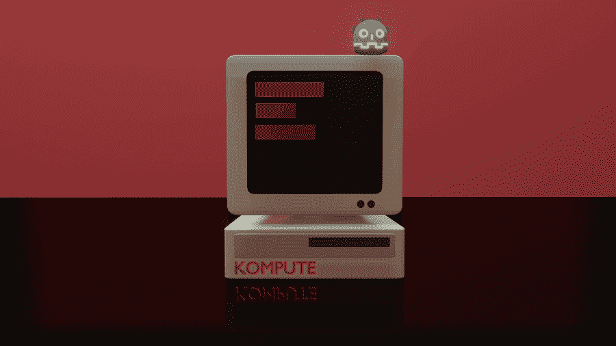

# 使用 GPU 加速游戏开发使用 Godot 引擎、Kompute 框架和 Vulkan SDK 加速机器学习

> 原文：<https://towardsdatascience.com/supercharging-game-development-with-gpu-accelerated-ml-using-vulkan-kompute-the-godot-game-engine-4e75a84ea9f0?source=collection_archive---------19----------------------->

## [实践教程](https://towardsdatascience.com/tagged/hands-on-tutorials)

## 一个实践教程，教你如何使用 Godot 游戏引擎和 Kompute 框架将 GPU 优化的 ML 代码集成到你的游戏开发工作流程中

作者图片

最近，世界已经看到了游戏行业和人工智能领域的各种定义性里程碑。仅在几周内，我们已经看到了游戏行业的重大财务公告，包括[Unity 13 亿美元的 IPO](https://venturebeat.com/2020/09/18/unity-technologies-raises-more-than-1-1-billion-in-ipo-at-12-1-billion-valuation/) 和[Epic Games 17.8 亿美元的投资](https://venturebeat.com/2020/08/06/epic-games-unveils-1-78-billion-funding-round-at-17-3-billion-valuation/)。人工智能领域也一直在赶上它的宣传，在 2020 年达到 600 多亿美元的市场，并在人工智能和游戏的交叉领域带来了令人兴奋的应用，包括 [AlphaGo 击败冠军 Lee Sedol](https://deepmind.com/research/case-studies/alphago-the-story-so-far) ，以及深度学习驱动的游戏，如[人工智能地牢](https://play.aidungeon.io/main/landing)(以及[更多应用](https://en.wikipedia.org/wiki/Artificial_intelligence_in_video_games))。

本文从技术上深入探讨了应用人工智能和游戏开发这两个领域之间的交集。我们专门研究如何利用跨供应商/移动 GPU 框架的能力来加速机器学习和高级数据处理用例的处理。

本教程的简单游戏界面(图片由作者提供)

在本教程中，你将学习如何使用 [**Kompute 框架**](https://github.com/EthicalML/vulkan-kompute) 在流行的开源 [**Godot 游戏引擎**](https://github.com/godotengine/godot) 内部构建 GPU 优化代码。

您将了解如何通过 Godot 游戏引擎在游戏开发中利用机器学习和高级 GPU 计算。

除了编程经验之外，不需要任何背景知识**，但是如果你对参考的底层 AI / GPU 计算概念感兴趣，我们建议查看我们以前的文章，“移动中的[机器学习&跨供应商 GPU 使用 Kompute & Vulkan](/machine-learning-and-data-processing-in-the-gpu-with-vulkan-kompute-c9350e5e5d3a) 变得简单”。**

你可以在 资源库的 [**示例文件夹中找到完整的代码，以及**](https://github.com/EthicalML/vulkan-kompute/tree/master/examples/godot_logistic_regression) **[**GDNative 库**](https://github.com/EthicalML/vulkan-kompute/tree/master/examples/godot_logistic_regression/gdnative_shared) 实现和 [**Godot 自定义模块**](https://github.com/EthicalML/vulkan-kompute/tree/master/examples/godot_logistic_regression/custom_module) 实现。**

# Godot 游戏引擎

图片来自 Godot [开源 GitHub 库](https://github.com/godotengine/godot)

拥有超过 30k github 明星和超过 1k 贡献者的 Godot 是最受欢迎的 OSS 游戏引擎。Godot [迎合了 2D 和 3D 开发](https://www.youtube.com/watch?v=KjX5llYZ5eQ)的需求，已经被广泛用于手机、桌面、主机和网络兼容游戏/应用。Godot 是用 C++构建的，这使得它又快又轻——它只有 40MB 的下载空间。

Godot 通过[健壮的设计原则](https://docs.godotengine.org/en/stable/getting_started/step_by_step/godot_design_philosophy.html)和对[高级语言](https://docs.godotengine.org/en/stable/getting_started/step_by_step/godot_design_philosophy.html#all-inclusive-package)的支持，包括其领域特定语言 [GdScript](https://docs.godotengine.org/en/stable/getting_started/scripting/gdscript/gdscript_basics.html) ，对于新手来说非常直观，具有类似 Python 的语法，使其非常容易采用。也可以使用 C#、Python、可视化脚本、C++等进行开发。

在本教程中，我们将使用编辑器构建一个游戏，使用 GdScript 触发 ML 训练/推理，使用 C++开发底层的核心处理组件。

# 进入 Kompute & Vulkan SDK

与 Khronos 成员一起玩“瓦尔多在哪里”(图片由 Vincent Hindriksen 通过 [StreamHPC](https://streamhpc.com/blog/2017-05-04/what-is-khronos-as-of-today/) 提供)

Vulkan 是一个由 [Khronos Group](https://www.khronos.org/) 领导的开源项目，Khronos Group 是一个由大量技术公司组成的财团，他们聚集在一起，致力于定义和推进移动和桌面媒体(和计算)技术的开放标准。

大量引人注目的(和新的)框架已经采用 Vulkan 作为他们的核心 GPU 处理 SDK。Godot 引擎本身正在进行一个重大的 4.0 更新，将[把 Vulkan 作为它的核心渲染引擎](https://godotengine.org/article/vulkan-progress-report-5)。

正如您所想象的，Vulkan SDK 提供了对 GPU 的非常低级的访问，这允许非常专业的优化。这对于数据处理和 GPU 开发人员来说是一笔巨大的财富——主要缺点是冗长，需要 500–2000 多行代码才能获得编写应用程序逻辑所需的基本样板文件。这可能导致昂贵的开发周期和错误，从而导致更大的问题。这是我们启动 **Kompute** 项目的主要动机之一。

[**Kompute**](https://github.com/axsaucedo/vulkan-kompute#vulkan-kompute) 是一个构建在 Vulkan SDK 之上的框架，专门用于扩展其计算能力，作为一个简单易用、高度优化、移动友好的通用 GPU 计算框架。

Kompute [文档](https://ethicalml.github.io/vulkan-kompute/)(图片由作者提供)

Kompute 不是为了隐藏任何核心 Vulkan 概念而构建的——核心 Vulkan API 设计得非常好。相反，它通过 BYOV(自带 Vulkan)设计增强了 Vulkan 的计算能力，通过减少所需的样板代码和自动化编写 Vulkan 应用程序中涉及的一些更常见的工作流，使开发人员能够进行开发。

对于想了解更多信息的新开发人员来说，它为开始使用 GPU 计算提供了坚实的基础。对于更高级的 Vulkan 开发人员，Kompute 允许他们将其集成到现有的 Vulkan 应用程序中，并通过在需要时访问所有 Vulkan 内部来执行非常精细的优化。该项目是完全开源的，我们欢迎错误报告、文档扩展、新的例子或建议——请随时[在回购中提出问题](https://github.com/axsaucedo/vulkan-kompute/issues)。

# 游戏开发中的人工智能

在本帖中，我们将基于我们在“[移动设备中的机器学习&跨厂商 GPU 使用 Kompute & Vulkan](/machine-learning-and-data-processing-in-the-gpu-with-vulkan-kompute-c9350e5e5d3a) 简化”文章中创建的机器学习用例。我们不会像在那篇文章中那样详细地讨论基础概念，但是我们仍然会在这一节中介绍所需的高级直觉。

首先，我们需要一个允许我们公开机器学习逻辑的接口，这主要需要两个功能:

1.  `train(…)` —允许机器学习模型学习从提供的输入预测输出的功能
2.  `predict(...)` —预测未知实例输出的函数。这可以在下图中概述的两个工作流程中看到。

数据科学流程(图片由作者提供)

特别是在游戏开发中，这也将是机器学习工作流的一种常见模式，对于预测性和解释性建模用例都是如此。这通常包括利用用户与游戏本身直接(或间接)互动时产生的数据。这些数据可以作为机器学习模型的训练特征。新模型的训练可以通过数据科学家执行的手动“离线”工作流来执行，或者通过自动触发再训练模型来执行。

# Godot 中的机器学习项目

我们将首先提供一个关于我们的 Kompute 绑定将如何在我们的 Godot 游戏中使用的高级概述。我们将创建一个简单的项目，并训练我们创建的 ML 模型，它将在 GPU 中运行。在本节中，我们已经可以访问定制的 KomputeModelML Godot 类——关于如何构建它并将其导入 Godot 项目的详细信息将在后面的章节中介绍。

新项目屏幕(图片由作者提供)

为此我们使用的是 [Godot 版本 **3.2.3 稳定版**](https://godotengine.org/download) 。创建一个新项目和一个新的 2D 场景。您应该会看到一个空白项目，带有一个顶级 2D 节点，如左图所示。

现在我们可以开始给游戏添加资源了。我们将从创建一个简单的 UI 界面/菜单开始，该界面/菜单由机器学习模型的输入组成，它反映了前面的架构图中涵盖的工作流。

我们将有两个用于数据`X_i`和`X_j`的输入行编辑文本框，以及一个用于`Y`预期预测的输入行编辑文本框。下图显示了用于构建 UI 的节点结构。您还可以通过导入`project.godot`文件来访问 repo 中的 [full godot 项目。节点将被引用以读取输入数据并显示输出预测(和学习的参数)。](https://github.com/EthicalML/vulkan-kompute/tree/godot_example/examples/godot_logistic_regression)

我们现在将能够在 Godot 中添加 GdScript 代码，这将允许我们读取输入，训练模型并执行预测——该脚本是在`Parent`节点下创建的。

下面是我们用来执行处理的完整脚本，它使用了我们在下一节中构建的`KomputeModelML` 自定义 Godot 类。我们将在下面分解代码的各个不同部分。

首先，我们定义变量来简化 Godot 编辑器节点的引用。这可以通过美元符号语法`$NODE/PATH`来实现，如下文所示。

下面的`compute_ml()`函数包含机器学习训练和预测的逻辑。我们首先使用 Godot 编辑器节点引用从文本框中读取输入。

我们现在可以从 C++类绑定中创建一个实例，我们将在下一节中构建这个实例。这个类公开了我们将用于机器学习推理的训练和预测函数。

我们现在可以通过传递输入和预期的预测来训练我们的模型。下面的 ML 模型是[逻辑回归模型](/machine-learning-and-data-processing-in-the-gpu-with-vulkan-kompute-c9350e5e5d3a#6c88)，它将调整其内部参数以最佳拟合输入和输出，从而产生一个能够预测未知数据点的模型。

既然我们已经训练了我们的模型，我们可以对看不见的数据点进行预测。为了简单起见，我们将传递用于测试的相同输入，但是您可以传递全新的数组，并查看它会产生什么样的预测。然后，我们可以在我们定义的`preds_node`引用节点变量中显示结果，这将显示在显示屏上。

最后，我们还想显示学习到的参数，在这种情况下，它包括`w1`、`w2`和`bias`。我们能够在各自的标签中显示权重和偏差。

最后要设置的是将“Kompute Train & Predict”按钮连接到`compute_ml`功能，这可以通过编辑器设置一个指向功能本身的信号来完成。

在我们的脚本中设置 compute_ml 方法的信号(图片由作者提供)

一旦这些都设置好了，我们就可以运行游戏，并使用提供的输入来触发训练和预测。然后，我们可以看到学习参数以及预测输出。当我们修改输入`y`、`xi`和`xj`时，也可以看到学习参数是如何变化的。

Kompute ML Godot 界面及结果参数(图片由作者提供)

# Kompute ML 实现

既然对游戏中发生的事情有了一个直觉，我们就能够使用 [**Kompute 框架**](https://github.com/EthicalML/vulkan-kompute) 编写我们的底层 C++类来创建 Godot 绑定。

Kompute [建筑设计](https://ethicalml.github.io/vulkan-kompute/overview/reference.html)(图片由作者提供)

我们将遵循 Kompute 的设计原则，这些原则在显示不同组件的附图中有所概述。我们将按照此工作流程在 GPU 中加载数据并执行培训。

下面列出了 Godot 类绑定实现的头文件，我们将对其进行详细分析。正如你所看到的，创建一个带有绑定的 C++类是非常直观的，你可以看到我们在上面的 Godot GdScript 中调用的相同的函数。

KomputeLogisticRegression.hpp 实现

类头文件的初始部分包括:

*   导入包含我们将在这个项目中使用的所有 Kompute 依赖项的`Kompute.hpp`头文件
*   顶级`Godot.hpp`导入是确保所有 Godot 组件可用所必需的。
*   Node2D 是我们将要继承的资源，但是你可以从[继承树](https://docs.godotengine.org/en/stable/development/cpp/inheritance_class_tree.html)中的其他类继承，这取决于你计划如何使用你的定制 Godot 类
*   对于跨应用传递的数据，我们将使用 Godot `Array`来处理 GdScript 和 Naive C++之间的传输，以及 Kompute `Tensor`来处理 GPU 数据管理。
*   GODOT_CLASS 宏定义通过添加额外的 GODOT 相关功能来扩展该类。正如我们将在下面看到的，当构建为 Godot 定制模块时，您将需要使用 GDCLASS。

遵循基本功能，我们必须定义核心逻辑:

*   `void train(Array y, Array xI, Array xJ)`—使用逻辑回归模型的 GPU 本机代码来训练机器学习模型。它接受输入数组`X`，以及包含预期输出的数组`y`。
*   `Array predict(Array xI, Array xJ)`—执行推理请求。在这种实现中，它不使用 GPU 代码，因为通常在推理端通过并行化获得的性能收益较少。然而，如果并行处理多个输入，仍有预期的性能增益(此功能允许)。
*   `Array get_params()`—以`[ <weight_1>, <weight_2>, <bias> ]`的格式返回包含学习参数的数组。

然后，我们可以声明将在 C++和高级 GdScript Godot 引擎之间绑定的方法，这些方法通常可供编辑器和更广泛的游戏访问。下面我们将简要地看一下注册一个函数所需的代码。

对于数据管理，我们将使用 Kompute 张量和数组——在这种情况下，我们只需要“学习”和“坚持”我们的逻辑回归模型的权重和偏差。

最后，我们还定义了着色器代码，它基本上就是[将在 GPU](https://en.wikipedia.org/wiki/OpenGL_Shading_Language) 内部作为机器码执行的代码。Kompute 允许我们传递包含代码的字符串，但是对于生产部署，可以将着色器转换为二进制文件，也可以使用可用的实用程序转换为头文件。

如果你对完整的实现感兴趣，你可以在 [gdnative 实现](https://github.com/EthicalML/vulkan-kompute/tree/godot_example/examples/godot_logistic_regression/gdnative_shared)和[定制模块](https://github.com/EthicalML/vulkan-kompute/tree/godot_example/examples/godot_logistic_regression/custom_module)实现文件夹中找到所有的文件。此外，如果你对这些技术的理论和潜在的基本概念感兴趣，这将在[我们之前的帖子](/machine-learning-and-data-processing-in-the-gpu-with-vulkan-kompute-c9350e5e5d3a#6c88)中全面介绍。

# 编译并集成到 Godot 中

现在我们有了 GPU 优化的机器学习模型的基础代码，我们现在可以在 Godot 游戏引擎中运行它了。Godot 允许我们通过两种主要方式将 C++代码添加到我们的项目中:

1.  [**GdNative 库构建指令**](https://github.com/EthicalML/vulkan-kompute/tree/godot_example/examples/godot_logistic_regression/gdnative_shared) —在 Godot 中，您可以添加自己的“GdNative 脚本”，这些脚本基本上是绑定到 GdScript 的 C++类，这意味着这些脚本可以在项目中动态使用和引用。这种方法适用于标准的 Godot 安装，不需要像第二种方法那样重新编译完整的编辑器。
2.  [**自定义模块**](https://github.com/EthicalML/vulkan-kompute/tree/godot_example/examples/godot_logistic_regression/custom_module) [**构建指令**](https://github.com/EthicalML/vulkan-kompute/tree/godot_example/examples/godot_logistic_regression/gdnative_shared) —在 Godot 中只有底层核心类是“核心”组件的一部分；其他的一切——UI、编辑器、GdScript 语言、网络功能——都是定制模型。编写一个定制模块很容易，这就是我们能够公开一些核心 Kompute 功能的方式。该选项要求用定制模块重新编译**完整的 Godot C++项目。**

一旦您通过指令设置了这些方法中的一个，您将能够从 Godot 内部访问自定义对象。每种方法之间存在一些细微的实现差异。

我们不会在博文中涉及具体的构建细节，但是你可以在上面的 GdNative 库/自定义模块链接中找到确切的代码和构建说明。

# 下一步是什么？

恭喜你，你一路走到了最后！虽然这篇文章涵盖了广泛的主题，但是也有大量的概念被浏览过。其中包括底层 Vulkan 概念、GPU 计算基础、机器学习最佳实践和更高级的 Kompute 概念。幸运的是，网上有资源可以扩展你在这些方面的知识。以下是我推荐的一些进一步阅读的链接:

*   "[利用 Kompute 简化移动设备中的机器学习&跨供应商 GPU&Vulkan](/machine-learning-and-data-processing-in-the-gpu-with-vulkan-kompute-c9350e5e5d3a)文章，深入探讨理论和概念
*   [Kompute 文档](https://axsaucedo.github.io/vulkan-kompute/)了解更多细节和更多示例
*   [机器学习工程师时事通讯](https://ethical.institute/mle.html)如果你想了解关于机器学习的最新文章
*   [令人敬畏的生产机器学习](https://github.com/EthicalML/awesome-production-machine-learning/)开源工具列表，用于部署、监控、版本化和扩展您的机器学习
*   [FastAI 的 ML for Coders 课程简介](https://www.fast.ai/2018/09/26/ml-launch/)进一步学习机器学习概念
*   [Vulkan SDK 教程](https://vulkan-tutorial.com/)深入了解底层 Vulkan 组件